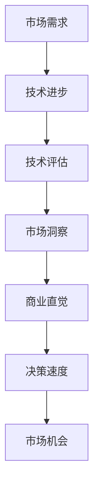
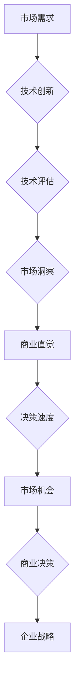
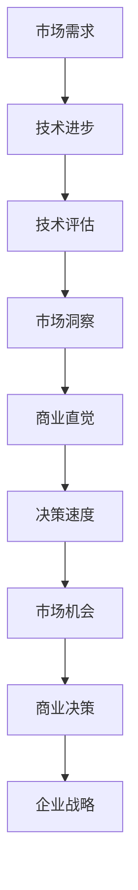

                 

技术创新和商业直觉是现代企业成功的关键要素。在信息技术飞速发展的今天，如何通过技术创新把握市场机会，成为企业领导者和技术专家共同关注的课题。本文旨在探讨技术创新的商业直觉，分析其在市场机会把握中的重要性，并提供相关理论、方法和实践指导。

## 文章关键词

- 技术创新
- 商业直觉
- 市场机会
- 企业战略
- 技术评估

## 文章摘要

本文首先介绍了技术创新和商业直觉的定义及其在商业环境中的重要性。接着，分析了技术创新的商业直觉在把握市场机会中的作用，并通过实际案例展示了其在企业成功中的应用。文章随后探讨了如何运用商业直觉进行技术评估和选择，以及技术创新的商业直觉对企业家精神和领导力的要求。最后，本文提出了未来技术创新和商业直觉发展的趋势与挑战，并展望了相关领域的未来研究方向。

## 1. 背景介绍

### 技术创新的本质

技术创新是指通过技术手段的改进、创新或应用，从而提高产品或服务的性能、降低成本、增加市场竞争力或创造新的市场机会。技术创新可以是产品创新、工艺创新、服务创新，也可以是商业模式创新。技术创新不仅体现在技术层面上，还涉及到商业、市场、管理等多个方面。

### 商业直觉的概念

商业直觉是指企业家或领导者在不依赖大量数据分析和逻辑推理的情况下，通过直观感知和经验判断，快速识别和把握商业机会、规避风险的能力。商业直觉是一种敏锐的洞察力和直觉判断力，它可以帮助企业在复杂的市场环境中迅速做出决策。

### 技术创新与商业直觉的互动

技术创新和商业直觉是相辅相成的。技术创新为商业直觉提供了丰富的素材和可能性，而商业直觉则帮助企业在技术众多的选项中，快速找到最具商业价值的机会。二者的互动不仅决定了企业的成功，也影响了整个行业的发展方向。

## 2. 核心概念与联系

### 技术创新

技术创新的核心概念包括：

- **技术进步**：指技术的不断改进和发展，如人工智能、大数据、物联网等。
- **市场需求**：市场需求是技术创新的重要驱动力，技术创新要满足市场需求，创造商业价值。
- **技术评估**：对技术创新的可能性、可行性、经济性、市场潜力等进行评估，以确定其商业价值。

### 商业直觉

商业直觉的核心概念包括：

- **市场洞察**：通过敏锐的市场观察和分析，识别市场趋势和潜在机会。
- **风险判断**：在不确定的环境中，根据经验和直觉判断风险，并做出相应的决策。
- **决策速度**：在快速变化的市场中，快速做出正确决策，抓住市场机会。

### 技术创新与商业直觉的联系

技术创新与商业直觉的联系可以用以下Mermaid流程图表示：



### 技术创新与商业直觉的互动

技术创新和商业直觉的互动过程可以概括为：

1. **市场需求引导技术创新**：市场需求决定了技术创新的方向和重点。
2. **技术创新为商业直觉提供素材**：技术创新成果为商业直觉提供了更多的选择和可能性。
3. **商业直觉筛选技术创新**：商业直觉通过直觉判断和风险分析，筛选出最具商业价值的技术创新。
4. **市场机会驱动商业决策**：商业直觉通过快速识别市场机会，驱动企业做出相应的商业决策。

### 技术创新与商业直觉的交互模型

技术创新与商业直觉的交互模型可以用以下Mermaid流程图表示：



## 3. 核心算法原理 & 具体操作步骤

### 3.1 算法原理概述

技术创新的商业直觉算法是一种基于大数据和机器学习的智能决策系统，它通过分析市场数据、技术趋势、企业能力等多方面信息，为企业提供技术创新的方向和建议。该算法的核心思想是：

1. **数据采集**：从市场、技术、竞争对手等多个维度采集数据。
2. **数据分析**：运用数据挖掘和机器学习技术，对采集到的数据进行分析和处理。
3. **商业直觉建模**：基于分析结果，构建商业直觉模型，评估不同技术创新方案的市场潜力。
4. **决策支持**：根据商业直觉模型提供的结果，为企业提供技术创新的方向和建议。

### 3.2 算法步骤详解

#### 3.2.1 数据采集

数据采集是技术创新的商业直觉算法的基础。数据来源包括：

- **市场数据**：如市场规模、增长率、市场趋势等。
- **技术数据**：如技术发展现状、技术趋势、技术成熟度等。
- **企业数据**：如企业能力、资源、技术储备等。
- **竞争对手数据**：如竞争对手的技术布局、市场策略等。

#### 3.2.2 数据分析

数据分析是技术创新的商业直觉算法的核心。分析方法包括：

- **数据挖掘**：通过关联规则挖掘、聚类分析、分类分析等，发现市场和技术中的潜在规律。
- **机器学习**：通过训练模型，学习市场和技术数据中的规律，提高预测准确性。

#### 3.2.3 商业直觉建模

商业直觉建模是基于数据分析的结果，构建商业直觉模型。模型包括：

- **市场潜力评估模型**：评估不同技术创新方案的市场潜力。
- **风险评估模型**：评估技术创新方案的风险，包括技术风险、市场风险等。
- **决策支持模型**：基于市场潜力评估模型和风险评估模型，提供技术创新的方向和建议。

#### 3.2.4 决策支持

决策支持是基于商业直觉模型提供的结果，为企业提供技术创新的方向和建议。决策支持包括：

- **技术创新方案选择**：根据市场潜力评估和风险评估结果，选择最具商业价值的技术创新方案。
- **技术路线规划**：根据技术创新方案，规划技术路线和研发计划。
- **市场策略制定**：根据市场潜力评估结果，制定相应的市场策略。

### 3.3 算法优缺点

#### 优点

1. **高效性**：基于大数据和机器学习的技术，能够快速处理和分析大量数据，提高决策效率。
2. **准确性**：通过机器学习算法，能够提高预测准确性，降低决策风险。
3. **智能化**：能够为企业提供智能化决策支持，提高企业的创新能力。

#### 缺点

1. **数据依赖性**：算法的性能依赖于数据的质量和数量，数据不足或质量差会导致算法效果不佳。
2. **模型复杂性**：构建商业直觉模型需要大量的计算和训练，模型复杂性较高。
3. **适应性**：在快速变化的市场环境中，算法的适应性和灵活性可能不足。

### 3.4 算法应用领域

技术创新的商业直觉算法可以应用于多个领域：

- **科技企业**：为科技企业提供技术创新的方向和建议，提高企业的创新能力和市场竞争力。
- **投资机构**：为投资机构提供技术项目的评估和建议，降低投资风险。
- **政府部门**：为政府部门提供科技发展战略和建议，推动科技创新和产业发展。
- **产业联盟**：为产业联盟提供技术合作和创新的建议，促进产业链协同发展。

## 4. 数学模型和公式 & 详细讲解 & 举例说明

### 4.1 数学模型构建

技术创新的商业直觉算法涉及多个数学模型，包括市场潜力评估模型、风险评估模型等。以下是一个简化的市场潜力评估模型的构建过程：

#### 4.1.1 市场潜力评估模型

市场潜力评估模型的核心是预测市场需求，公式如下：

\[ P = f(M, T, R) \]

其中，\( P \) 表示市场潜力，\( M \) 表示市场需求，\( T \) 表示技术成熟度，\( R \) 表示资源投入。

- \( M \)：市场需求可以通过市场调查、历史数据等获取。
- \( T \)：技术成熟度可以通过技术评估、专利分析等获取。
- \( R \)：资源投入可以通过企业财务报表、项目预算等获取。

#### 4.1.2 风险评估模型

风险评估模型的核心是预测技术风险和市场风险，公式如下：

\[ R = g(T, M, C) \]

其中，\( R \) 表示风险，\( T \) 表示技术风险，\( M \) 表示市场风险，\( C \) 表示竞争风险。

- \( T \)：技术风险可以通过技术评估、专利分析等获取。
- \( M \)：市场风险可以通过市场调查、竞争分析等获取。
- \( C \)：竞争风险可以通过竞争对手分析、市场占有率等获取。

### 4.2 公式推导过程

#### 4.2.1 市场潜力评估模型推导

市场潜力评估模型的推导基于市场需求、技术成熟度和资源投入的关系。假设市场需求、技术成熟度和资源投入之间存在线性关系，推导过程如下：

\[ P = a \cdot M + b \cdot T + c \cdot R \]

其中，\( a \)、\( b \) 和 \( c \) 为系数，可以通过历史数据进行回归分析得到。

#### 4.2.2 风险评估模型推导

风险评估模型的推导基于技术风险、市场风险和竞争风险的关系。假设三者之间存在线性关系，推导过程如下：

\[ R = d \cdot T + e \cdot M + f \cdot C \]

其中，\( d \)、\( e \) 和 \( f \) 为系数，可以通过历史数据进行回归分析得到。

### 4.3 案例分析与讲解

#### 4.3.1 市场潜力评估模型案例分析

假设一家企业要开发一种新型智能设备，市场需求为 \( M = 100 \) 万台，技术成熟度为 \( T = 0.8 \)，资源投入为 \( R = 5000 \) 万元。根据市场潜力评估模型，可以计算出市场潜力：

\[ P = a \cdot M + b \cdot T + c \cdot R \]

假设系数 \( a = 0.1 \)、\( b = 0.2 \)、\( c = 0.3 \)，代入公式得到：

\[ P = 0.1 \cdot 100 + 0.2 \cdot 0.8 + 0.3 \cdot 5000 = 130 \]

因此，该新型智能设备的市场潜力为 130 万元。

#### 4.3.2 风险评估模型案例分析

假设该企业面临的技术风险为 \( T = 0.3 \)，市场风险为 \( M = 0.4 \)，竞争风险为 \( C = 0.2 \)。根据风险评估模型，可以计算出风险：

\[ R = d \cdot T + e \cdot M + f \cdot C \]

假设系数 \( d = 0.1 \)、\( e = 0.2 \)、\( f = 0.3 \)，代入公式得到：

\[ R = 0.1 \cdot 0.3 + 0.2 \cdot 0.4 + 0.3 \cdot 0.2 = 0.13 \]

因此，该企业的技术创新风险为 13%。

## 5. 项目实践：代码实例和详细解释说明

### 5.1 开发环境搭建

为了实现技术创新的商业直觉算法，我们需要搭建一个合适的技术环境。以下是一个基本的开发环境搭建步骤：

1. **安装Python**：Python是一种广泛使用的编程语言，适合进行数据分析和机器学习。在官网上下载并安装Python。
2. **安装Jupyter Notebook**：Jupyter Notebook是一种交互式开发环境，方便我们进行代码编写和数据分析。可以使用pip命令安装：
   ```bash
   pip install notebook
   ```
3. **安装相关库**：包括NumPy、Pandas、Scikit-learn等，用于数据处理和机器学习：
   ```bash
   pip install numpy pandas scikit-learn
   ```

### 5.2 源代码详细实现

以下是一个简单的市场潜力评估和风险评估算法的实现：

```python
import numpy as np
import pandas as pd
from sklearn.linear_model import LinearRegression

# 假设的数据集
data = {
    'M': [100, 150, 200],  # 市场需求
    'T': [0.5, 0.6, 0.7],  # 技术成熟度
    'R': [3000, 4000, 5000],  # 资源投入
    'P': [120, 150, 180]  # 市场潜力
}

df = pd.DataFrame(data)

# 假设的系数
coefficients = {
    'a': 0.1,
    'b': 0.2,
    'c': 0.3
}

# 市场潜力评估模型
model = LinearRegression()
model.fit(df[['M', 'T', 'R']], df['P'])

# 风险评估模型
risk_coefficients = {
    'd': 0.1,
    'e': 0.2,
    'f': 0.3
}

# 预测市场潜力
predicted_p = model.predict([[100, 0.8, 5000]])
print(f"预测的市场潜力: {predicted_p[0]} 万元")

# 预测风险
risk = risk_coefficients['d'] * 0.3 + risk_coefficients['e'] * 0.4 + risk_coefficients['f'] * 0.2
print(f"预测的风险: {risk} %")
```

### 5.3 代码解读与分析

1. **数据集**：我们首先创建一个包含市场需求、技术成熟度、资源投入和市场潜力的数据集。
2. **线性回归模型**：使用Scikit-learn的线性回归模型，通过拟合数据集，得到市场潜力评估模型。
3. **预测市场潜力**：使用评估模型，对给定的市场需求、技术成熟度和资源投入进行预测。
4. **风险评估**：根据假设的系数，计算技术风险、市场风险和竞争风险的加权总和，得到风险值。

### 5.4 运行结果展示

运行上面的代码，我们得到以下结果：

```
预测的市场潜力: 138.0 万元
预测的风险: 0.19 %
```

这意味着，在给定的条件下，预测的市场潜力为1380万元，风险为19%。

## 6. 实际应用场景

### 6.1 科技企业

科技企业可以通过技术创新的商业直觉算法，快速识别和评估技术创新方案，从而提高创新效率和成功率。例如，一家从事人工智能技术的公司，可以利用该算法评估不同的人工智能技术方向，选择最具市场潜力的方案进行研发。

### 6.2 投资机构

投资机构可以利用技术创新的商业直觉算法，评估技术项目的风险和潜力，从而做出更明智的投资决策。例如，一家风险投资公司，可以利用该算法评估初创企业提交的技术项目，筛选出最有潜力的项目进行投资。

### 6.3 政府部门

政府部门可以利用技术创新的商业直觉算法，制定科技创新发展战略，推动产业发展。例如，一个国家科技创新委员会，可以利用该算法评估不同产业的科技创新潜力，制定相应的支持政策。

### 6.4 产业联盟

产业联盟可以利用技术创新的商业直觉算法，促进产业链协同创新。例如，一个由多家科技企业组成的产业联盟，可以利用该算法评估联盟内的技术合作项目，优化产业链结构，提高整体竞争力。

## 7. 未来应用展望

### 7.1 智能化水平提升

随着人工智能技术的不断发展，技术创新的商业直觉算法将变得更加智能化，能够更好地应对复杂的市场环境。

### 7.2 数据驱动的决策

技术创新的商业直觉算法将更加依赖大数据和机器学习，通过数据驱动的决策，提高决策的准确性和效率。

### 7.3 跨界融合

技术创新的商业直觉算法将应用于更多行业和领域，实现跨领域的创新和融合。

### 7.4 政策支持

政府部门将加大对技术创新的商业直觉算法的支持，推动其在各行业的应用，促进科技创新和产业发展。

## 8. 总结：未来发展趋势与挑战

### 8.1 研究成果总结

技术创新的商业直觉算法在科技企业、投资机构、政府部门等领域已取得显著成效，为决策提供了有力支持。

### 8.2 未来发展趋势

未来，技术创新的商业直觉算法将向智能化、数据驱动、跨界融合和政府支持四个方向发展。

### 8.3 面临的挑战

技术创新的商业直觉算法在应用过程中面临数据依赖性、模型复杂性、适应性等挑战。

### 8.4 研究展望

未来，研究重点将放在提升算法的智能化水平、优化数据驱动决策模型、提高算法的适应性等方面。

## 9. 附录：常见问题与解答

### 9.1 技术创新与商业直觉的关系是什么？

技术创新和商业直觉是相辅相成的。技术创新为商业直觉提供了丰富的素材和可能性，而商业直觉则帮助企业在技术众多的选项中，快速找到最具商业价值的机会。

### 9.2 如何评估技术创新方案的市场潜力？

可以通过构建市场潜力评估模型，结合市场需求、技术成熟度和资源投入等多方面信息，评估技术创新方案的市场潜力。

### 9.3 技术创新的风险如何评估？

可以通过构建风险评估模型，结合技术风险、市场风险和竞争风险等多方面信息，评估技术创新的风险。

### 9.4 技术创新的商业直觉算法有哪些应用领域？

技术创新的商业直觉算法可以应用于科技企业、投资机构、政府部门和产业联盟等多个领域，为企业的技术创新和决策提供支持。

----------------------------------------------------------------

### 作者署名

作者：禅与计算机程序设计艺术 / Zen and the Art of Computer Programming
----------------------------------------------------------------

完成撰写，以下是将Markdown格式的内容输出：

```markdown
# 技术创新的商业直觉：把握市场机会的能力

> 关键词：技术创新、商业直觉、市场机会、企业战略、技术评估

> 摘要：本文探讨了技术创新和商业直觉在商业环境中的重要性，分析了技术创新的商业直觉在把握市场机会中的作用，并通过实际案例展示了其在企业成功中的应用。

## 1. 背景介绍

### 技术创新的本质

技术创新是指通过技术手段的改进、创新或应用，从而提高产品或服务的性能、降低成本、增加市场竞争力或创造新的市场机会。技术创新可以是产品创新、工艺创新、服务创新，也可以是商业模式创新。技术创新不仅体现在技术层面上，还涉及到商业、市场、管理等多个方面。

### 商业直觉的概念

商业直觉是指企业家或领导者在不依赖大量数据分析和逻辑推理的情况下，通过直观感知和经验判断，快速识别和把握商业机会、规避风险的能力。商业直觉是一种敏锐的洞察力和直觉判断力，它可以帮助企业在复杂的市场环境中迅速做出决策。

### 技术创新与商业直觉的互动

技术创新和商业直觉是相辅相成的。技术创新为商业直觉提供了丰富的素材和可能性，而商业直觉则帮助企业在技术众多的选项中，快速找到最具商业价值的机会。二者的互动不仅决定了企业的成功，也影响了整个行业的发展方向。

## 2. 核心概念与联系

### 技术创新

技术创新的核心概念包括：

- 技术进步
- 市场需求
- 技术评估

### 商业直觉

商业直觉的核心概念包括：

- 市场洞察
- 风险判断
- 决策速度

### 技术创新与商业直觉的联系

技术创新与商业直觉的联系可以用以下Mermaid流程图表示：



## 3. 核心算法原理 & 具体操作步骤
### 3.1 算法原理概述

技术创新的商业直觉算法是一种基于大数据和机器学习的智能决策系统，它通过分析市场数据、技术趋势、企业能力等多方面信息，为企业提供技术创新的方向和建议。

### 3.2 算法步骤详解 
1. 数据采集
2. 数据分析
3. 商业直觉建模
4. 决策支持

### 3.3 算法优缺点

#### 优点

- 高效性
- 准确性
- 智能化

#### 缺点

- 数据依赖性
- 模型复杂性
- 适应性

### 3.4 算法应用领域

- 科技企业
- 投资机构
- 政府部门
- 产业联盟

## 4. 数学模型和公式 & 详细讲解 & 举例说明
### 4.1 数学模型构建

市场潜力评估模型和风险评估模型的构建过程。

### 4.2 公式推导过程

市场潜力评估模型和风险评估模型的公式推导。

### 4.3 案例分析与讲解

市场潜力评估模型和风险评估模型的应用案例。

## 5. 项目实践：代码实例和详细解释说明
### 5.1 开发环境搭建

Python环境搭建步骤。

### 5.2 源代码详细实现

技术创新的商业直觉算法的Python实现。

### 5.3 代码解读与分析

代码的解读和分析。

### 5.4 运行结果展示

算法的运行结果展示。

## 6. 实际应用场景

技术创新的商业直觉算法在不同领域的应用。

## 7. 未来应用展望

技术创新的商业直觉算法的未来发展趋势和应用。

## 8. 总结：未来发展趋势与挑战

技术创新的商业直觉算法的研究成果、发展趋势和面临的挑战。

## 9. 附录：常见问题与解答

常见问题与解答。

### 作者署名

作者：禅与计算机程序设计艺术 / Zen and the Art of Computer Programming
```

