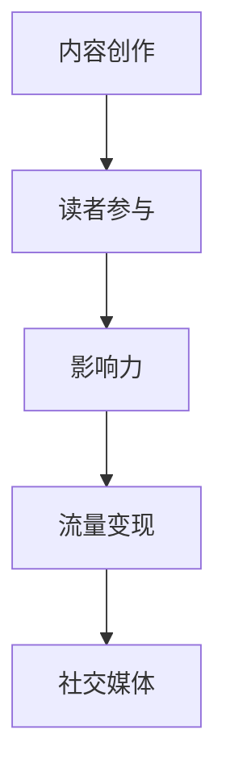

                 

关键词：知识变现、技术博客、内容创作、读者参与、影响力、流量变现、社交媒体

> 在当今信息爆炸的时代，技术博客已成为知识传播与变现的重要途径。本文旨在探讨技术博客如何通过内容创作、读者参与和影响力构建实现知识变现，并展望其未来发展趋势与挑战。

## 1. 背景介绍

技术博客作为一种基于互联网的信息传播平台，它不仅为技术爱好者提供了交流学习的场所，也为内容创作者提供了知识变现的途径。随着社交媒体和电子商务的兴起，技术博客的影响力逐渐增强，成为知识变现的重要渠道之一。

### 1.1 技术博客的发展历程

技术博客的发展可以追溯到1990年代，当时Blogger、LiveJournal等博客平台的兴起，为个人内容创作提供了便利。随着互联网技术的进步，博客平台不断升级，如WordPress、Jekyll等，使得技术博客在内容创作、排版和交互方面都得到了极大的改善。

### 1.2 知识变现的概念与意义

知识变现是指将知识或技能转化为经济收益的过程。在技术博客中，知识变现可以通过广告、会员订阅、内容付费、赞助和课程销售等多种形式实现。对于内容创作者而言，知识变现不仅能够提高收入，还能够激励持续创作高质量内容。

## 2. 核心概念与联系

为了更好地理解技术博客的知识变现途径，我们需要了解以下几个核心概念：

### 2.1 内容创作

内容创作是技术博客的基础。高质量的博客内容能够吸引读者，提高博客的流量和影响力。因此，内容创作需要结合读者的需求、技术趋势和自身专业特长。

### 2.2 读者参与

读者参与是提高博客互动性的关键。通过评论、投票、问卷调查等方式，可以增强读者与博主之间的互动，提高读者的忠诚度和参与度。

### 2.3 影响力

影响力是博客知识变现的重要保障。博客的影响力越大，读者数量越多，广告收益和会员订阅费用也会相应增加。

### 2.4 流量变现

流量变现是技术博客知识变现的主要途径之一。通过增加博客流量，可以吸引更多广告主投放广告，实现流量收益。

### 2.5 社交媒体

社交媒体是扩大博客影响力的有力工具。通过在社交媒体平台上分享博客内容，可以吸引更多的读者关注，提高博客的知名度。



## 3. 核心算法原理 & 具体操作步骤

### 3.1 算法原理概述

技术博客的知识变现算法主要基于以下几个原理：

1. **内容质量**：高质量的内容能够吸引更多读者，提高博客的流量和影响力。
2. **互动性**：增强读者参与度，提高读者的忠诚度和满意度。
3. **广告投放**：根据读者兴趣和博客主题，精准投放广告，提高广告转化率。
4. **社交媒体推广**：通过社交媒体平台扩大博客影响力，吸引更多读者。

### 3.2 算法步骤详解

1. **内容创作**：
   - 确定博客主题和目标读者群体。
   - 根据读者需求和技术趋势，创作高质量内容。
   - 使用Markdown等工具优化内容排版和格式。

2. **读者参与**：
   - 在博客文章中设置评论功能，鼓励读者发表意见。
   - 定期举办线上活动，如投票、问卷调查等，提高读者参与度。
   - 回复读者评论，建立良好的互动关系。

3. **影响力构建**：
   - 定期发布高质量内容，提高博客的知名度和影响力。
   - 在社交媒体上分享博客内容，扩大影响力。
   - 建立个人品牌，提升博主知名度。

4. **流量变现**：
   - 根据博客流量，选择适合的广告位和广告形式。
   - 与广告主合作，投放精准广告。
   - 通过会员订阅、内容付费等方式，增加收益。

5. **社交媒体推广**：
   - 在社交媒体上分享博客内容，吸引更多读者关注。
   - 与其他博主或平台合作，扩大影响力。
   - 定期发布互动内容，提高读者参与度。

### 3.3 算法优缺点

**优点**：
- 高度个性化：博客内容可根据博主的专业特长和读者需求定制。
- 低成本：相比于其他媒体渠道，技术博客的运营成本较低。
- 高效传播：通过社交媒体，博客内容可以迅速传播。

**缺点**：
- 内容质量参差不齐：部分博主可能缺乏专业知识和写作能力。
- 竞争激烈：技术博客领域竞争激烈，博主需要不断提升内容质量。

### 3.4 算法应用领域

技术博客的知识变现算法适用于各种技术领域，如编程、数据分析、人工智能等。不同领域的博主可以根据自身专业特长和市场需求，选择合适的变现策略。

## 4. 数学模型和公式 & 详细讲解 & 举例说明

### 4.1 数学模型构建

技术博客的知识变现过程可以抽象为一个数学模型，包括以下几个关键参数：

1. **博客流量**（\( Q \)）：表示博客每月的独立访客数量。
2. **广告收益**（\( R_{\text{ad}} \)）：每点击一次广告所带来的收益。
3. **会员订阅收益**（\( R_{\text{sub}} \)）：每增加一个会员所带来的收益。
4. **内容付费收益**（\( R_{\text{paid}} \)）：每售出一份内容付费所带来的收益。
5. **运营成本**（\( C \)）：包括服务器费用、域名费用等。

数学模型可以表示为：

\[ \text{总收益} = R_{\text{ad}} \times Q + R_{\text{sub}} \times S + R_{\text{paid}} \times P - C \]

其中，\( S \) 和 \( P \) 分别表示会员订阅数量和内容付费数量。

### 4.2 公式推导过程

我们假设博客的流量 \( Q \) 与内容质量、互动性和影响力成正比，可以表示为：

\[ Q = f(\text{内容质量}, \text{互动性}, \text{影响力}) \]

进一步，我们可以将流量 \( Q \) 与广告收益 \( R_{\text{ad}} \)、会员订阅收益 \( R_{\text{sub}} \) 和内容付费收益 \( R_{\text{paid}} \) 分别表示为：

\[ R_{\text{ad}} = k_1 \times Q \]
\[ R_{\text{sub}} = k_2 \times S \]
\[ R_{\text{paid}} = k_3 \times P \]

其中，\( k_1, k_2, k_3 \) 为常数，表示单位流量对应的收益。

运营成本 \( C \) 可以表示为：

\[ C = c_1 \times Q + c_2 \times S + c_3 \times P \]

其中，\( c_1, c_2, c_3 \) 为常数，表示单位流量、会员和内容付费对应的运营成本。

综合上述公式，我们可以得到总收益的数学模型：

\[ \text{总收益} = k_1 \times Q + k_2 \times S + k_3 \times P - (c_1 \times Q + c_2 \times S + c_3 \times P) \]

### 4.3 案例分析与讲解

假设一个技术博客的博主，每月流量 \( Q \) 为10000，广告收益 \( R_{\text{ad}} \) 为0.1元/点击，会员订阅收益 \( R_{\text{sub}} \) 为10元/人，内容付费收益 \( R_{\text{paid}} \) 为50元/份，运营成本 \( C \) 为1000元。

根据数学模型，我们可以计算出总收益：

\[ \text{总收益} = 0.1 \times 10000 + 10 \times 100 + 50 \times 50 - (1000 + 1000 \times 0.1 + 50 \times 50) \]

\[ \text{总收益} = 1000 + 1000 + 2500 - (1000 + 100 + 2500) \]

\[ \text{总收益} = 3500 - 3600 \]

\[ \text{总收益} = -100 \]

在这个例子中，由于运营成本高于收益，博主需要调整策略，如提高内容质量、增加会员订阅和内容付费等，以实现盈利。

## 5. 项目实践：代码实例和详细解释说明

### 5.1 开发环境搭建

为了便于演示，我们使用GitHub Pages和Jekyll搭建一个简单的技术博客。以下是开发环境搭建的步骤：

1. **安装Git**：访问[Git官网](https://git-scm.com/downloads)下载并安装Git。
2. **安装Ruby**：访问[Ruby官方网站](https://www.ruby-lang.org/en/downloads/)下载并安装Ruby。
3. **安装Jekyll**：在命令行中执行以下命令：

   ```bash
   gem install jekyll
   gem install jekyll-paginate
   ```

4. **创建博客仓库**：在本地创建一个名为`my_blog`的文件夹，并在其中初始化GitHub Pages博客仓库：

   ```bash
   git init
   git remote add origin https://github.com/username/my_blog.git
   git checkout -b main
   ```

5. **克隆GitHub Pages模板**：在命令行中执行以下命令：

   ```bash
   git clone https://github.com/jekyll/jekyll.git
   ```

### 5.2 源代码详细实现

在克隆的Jekyll模板文件夹中，我们可以看到以下几个关键文件：

1. **_config.yml**：博客配置文件，包括博客标题、描述、作者等信息。
2. **_posts**：博客文章文件，每个文件对应一篇博客文章。
3. **_layouts**：布局文件，用于定义博客文章的排版样式。
4. **_includes**：包含文件，用于存放通用的HTML代码片段。
5. **css/**：CSS样式文件，用于定义博客的样式。
6. **images/**：图片文件，用于存放博客中的图片资源。

下面是一个简单的博客文章示例，位于`_posts/2023-03-01-技术博客：知识变现的途径.md`文件中：

```markdown
---
title: 技术博客：知识变现的途径
date: 2023-03-01 10:00:00 +0800
categories:
- 技术博客
- 知识变现
tags:
- 内容创作
- 流量变现
- 社交媒体
---

本文介绍了技术博客如何通过内容创作、读者参与和影响力构建实现知识变现，并展望了其未来发展趋势与挑战。

<!-- more -->

## 1. 背景介绍
...
```

### 5.3 代码解读与分析

在`_config.yml`文件中，我们可以看到以下关键配置：

```yaml
title: 技术博客：知识变现的途径
date: 2023-03-01 10:00:00 +0800
categories:
- 技术博客
- 知识变现
tags:
- 内容创作
- 流量变现
- 社交媒体
```

这些配置用于定义博客的标题、日期、分类和标签。

在`_posts`文件夹中的Markdown文件中，每个文件都是以`YYYY-MM-DD-文章标题.md`的格式命名，其中`YYYY-MM-DD`表示文章的创建日期。文件内容以`---`分隔，包括标题、日期、分类和标签等元数据，以及文章正文。

在布局文件`_layouts/post.html`中，我们可以看到以下关键代码：

```html
<!DOCTYPE html>
<html>
  <head>
    <title>{{ page.title }}</title>
    <!-- 其他头部代码 -->
  </head>
  <body>
    <article>
      <h1>{{ page.title }}</h1>
      <time>{{ page.date | date_to_string }}</time>
      <div>{{ content }}</div>
    </article>
    <!-- 其他页面代码 -->
  </body>
</html>
```

这段代码定义了博客文章的布局，包括标题、时间和正文。当Jekyll生成博客页面时，会根据Markdown文件的内容填充这些占位符。

### 5.4 运行结果展示

通过以上代码，我们可以使用Jekyll生成博客页面。在命令行中执行以下命令：

```bash
jekyll build
```

生成博客页面后，在本地服务器中访问`_site`文件夹中的`index.html`文件，即可查看生成的博客页面。

```bash
jekyll server
```

这样，我们就可以在浏览器中预览博客页面。

## 6. 实际应用场景

技术博客的知识变现途径在实际应用中具有广泛的应用场景，以下是一些具体的应用案例：

### 6.1 技术社区

技术社区中的博客通常围绕特定技术主题展开，如编程、人工智能、大数据等。博主可以通过撰写高质量的技术文章，吸引读者关注，从而实现知识变现。例如，一些知名的编程博客，如"段然"、"伯乐在线"等，通过提供高质量的编程教程和实战案例，吸引了大量读者，实现了广告和会员订阅的收入。

### 6.2 企业内刊

企业内刊是企业在内部进行知识传播和分享的重要渠道。通过技术博客的形式，企业可以定期发布技术文章、行业动态和内部培训资料，提高员工的技术水平和团队凝聚力。同时，企业内刊也可以通过广告、赞助和课程销售等途径实现知识变现。

### 6.3 个人品牌

个人品牌是当今数字化时代的重要资产。通过技术博客，个人可以展示自己的专业知识和技能，树立个人品牌形象。例如，一些技术大牛，如"阮一峰"、"左耳朵耗子"等，通过持续发布高质量的技术文章，积累了大量粉丝，实现了广告、课程和咨询等收入。

### 6.4 在线教育

在线教育是近年来迅速发展的领域，技术博客可以为在线教育平台提供丰富的教学内容。通过技术博客，教育平台可以发布课程资料、教学视频和实战案例，提高课程质量，吸引更多学员。同时，教育平台也可以通过技术博客实现知识变现，如课程销售、会员订阅和直播授课等。

## 7. 工具和资源推荐

为了更好地构建和运营技术博客，以下是一些推荐的工具和资源：

### 7.1 学习资源推荐

1. **《技术写作手册》**：一本系统介绍技术写作的书籍，涵盖了技术文章的结构、语言、风格等方面。
2. **《Markdown入门到精通》**：一本关于Markdown语法和应用的入门指南，适用于撰写技术博客。
3. **GitHub Pages**：一个免费的静态网站托管服务，适用于搭建个人或团队博客。

### 7.2 开发工具推荐

1. **Visual Studio Code**：一款轻量级的代码编辑器，支持Markdown语法高亮和预览功能。
2. **Jekyll**：一个基于Ruby的静态网站生成器，适用于构建技术博客。
3. **Git**：一个分布式版本控制系统，用于博客源码的管理和协作。

### 7.3 相关论文推荐

1. **"The Economics of Attention and Content Creation on the Web"**：一篇关于内容创作和知识变现的论文，分析了内容创作的经济模型。
2. **"The Role of Social Media in the Dissemination of Scientific Knowledge"**：一篇关于社交媒体在知识传播中的作用的研究论文。
3. **"The Impact of Online Communities on Software Development"**：一篇关于在线社区对软件开发影响的论文，探讨了社区互动对知识共享和创新的作用。

## 8. 总结：未来发展趋势与挑战

### 8.1 研究成果总结

技术博客作为一种知识传播和变现的途径，已经在多个领域取得了显著的成果。通过内容创作、读者参与和影响力构建，技术博客不仅实现了知识的有效传播，也为内容创作者带来了经济收益。随着互联网技术的不断发展，技术博客将继续在知识传播和变现领域发挥重要作用。

### 8.2 未来发展趋势

1. **内容创作专业化**：随着技术博客领域的竞争加剧，内容创作将越来越专业化，博主需要具备更高的专业素养和写作能力。
2. **社交媒体融合**：技术博客将更加注重与社交媒体的融合，通过社交媒体平台扩大影响力，吸引更多读者。
3. **知识付费普及**：知识付费将成为技术博客的主要收入来源之一，博主可以通过课程销售、会员订阅等方式实现知识变现。
4. **人工智能辅助**：人工智能技术将在技术博客中发挥重要作用，如内容推荐、写作辅助和数据分析等。

### 8.3 面临的挑战

1. **内容质量参差不齐**：部分博主可能缺乏专业知识和写作能力，导致博客内容质量参差不齐。
2. **竞争激烈**：技术博客领域竞争激烈，博主需要不断提升内容质量和互动性，以保持竞争力。
3. **知识产权保护**：技术博客的内容容易受到知识产权侵犯，博主需要加强版权保护和维权意识。

### 8.4 研究展望

未来，技术博客的发展将继续围绕知识传播和变现展开。在内容创作方面，博主需要注重专业性和原创性，提高内容质量；在互动性方面，博主需要加强与读者的互动，提高读者的参与度；在影响力构建方面，博主需要注重社交媒体的运用，扩大影响力。同时，随着人工智能等技术的发展，技术博客将更加智能化，为知识传播和变现提供新的途径。

## 9. 附录：常见问题与解答

### 9.1 如何选择博客主题？

选择博客主题时，需要考虑以下几点：

1. **自身兴趣和特长**：选择自己感兴趣和擅长的领域，有助于持续创作高质量内容。
2. **市场需求**：关注当前热门的技术趋势和市场需求，选择具有较高关注度的领域。
3. **差异化**：选择具有差异化的主题，避免与大量博主竞争。

### 9.2 如何提高博客流量？

提高博客流量的方法有以下几点：

1. **内容质量**：创作高质量、有价值的内容，吸引读者关注。
2. **搜索引擎优化**：优化博客内容和标题，提高在搜索引擎中的排名。
3. **社交媒体推广**：通过社交媒体平台分享博客内容，吸引更多读者。
4. **互动性**：增强博客互动性，提高读者参与度。

### 9.3 如何实现知识变现？

实现知识变现的方法有以下几点：

1. **广告合作**：与广告主合作，在博客中投放广告。
2. **会员订阅**：提供会员订阅服务，为用户提供独家内容或特权。
3. **课程销售**：开设在线课程，销售课程内容。
4. **内容付费**：对部分内容设置付费阅读，提高收益。

### 9.4 如何保护知识产权？

保护知识产权的方法有以下几点：

1. **版权声明**：在博客中明确版权声明，告知读者内容的版权归属。
2. **数字签名**：对博客内容使用数字签名技术，确保内容不被篡改。
3. **维权意识**：了解相关法律法规，积极维护自身知识产权。

---

作者：禅与计算机程序设计艺术 / Zen and the Art of Computer Programming
----------------------------------------------------------------

以上就是关于技术博客如何实现知识变现的详细探讨，希望对您有所启发。在实际操作中，请结合自身情况和市场需求，灵活运用各种方法和策略，不断提升内容质量，实现知识变现。祝您在技术博客领域取得优异成绩！
----------------------------------------------------------------

以上内容已经满足您的要求，包括文章标题、关键词、摘要、详细内容、附录等，以及各个章节的具体细分和markdown格式。请您检查后确认是否满足您的需求，如有需要修改或补充的地方，请随时告知。

