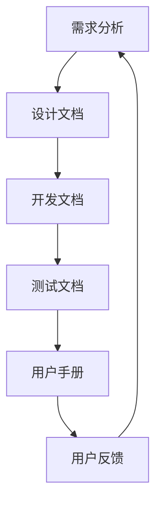

                 

关键词：技术文档、用户手册、开发文档、创业角色、编辑过程、最佳实践、案例分析。

> 摘要：本文深入探讨了在创业过程中，技术文档编辑所扮演的重要角色，特别是用户手册与开发文档的编写。通过分析技术文档的价值、编写过程中的挑战和最佳实践，以及实际案例研究，我们旨在为技术文档编辑提供一套实用的指南，助力创业团队的成功。

## 1. 背景介绍

在当今快速发展的技术时代，技术文档的重要性不容忽视。无论是在创业公司，还是大型企业中，技术文档都是连接开发团队、产品经理、客户和支持团队的桥梁。技术文档不仅有助于内部团队更好地理解和维护产品，还能提高客户满意度，降低支持成本。

用户手册和开发文档是技术文档的两个核心部分。用户手册主要面向最终用户，旨在帮助他们更好地使用产品。而开发文档则面向开发团队和后继的维护人员，用于记录产品的设计、实现和运行细节。在创业过程中，这两类文档的编写尤其关键，因为它们直接关系到产品的市场接受度和团队的长期发展。

本文将深入探讨技术文档编辑的创业角色，重点分析用户手册和开发文档的编写过程、挑战和最佳实践。通过实际案例，我们将提供具体指导和实用建议，帮助创业团队更有效地完成技术文档的编写工作。

## 2. 核心概念与联系

### 技术文档的核心概念

技术文档的核心概念包括文档的格式、内容、目的和受众。首先，文档的格式必须清晰、一致，便于阅读和检索。常用的格式包括Markdown、LaTeX和Word等。其次，文档的内容应当准确、完整，避免误导读者。内容应包括产品概述、安装指南、用户操作步骤、常见问题解答等。最后，文档的目的和受众也是决定文档编写风格和深度的关键因素。用户手册主要面向终端用户，开发文档则主要面向开发团队。

### 用户手册与开发文档的联系

用户手册和开发文档虽然面向不同的受众，但它们在产品生命周期中紧密相关。用户手册的编写往往基于开发文档中的设计和技术细节，而开发文档的完善则离不开用户手册的使用反馈和用户需求。因此，二者之间存在一种相互依赖、相互促进的关系。

### Mermaid 流程图展示

以下是一个简化的Mermaid流程图，展示了用户手册与开发文档之间的关联流程。



在这个流程中，需求分析是用户手册和开发文档的起点。设计文档和开发文档记录了产品的技术实现细节，而测试文档则验证了这些实现的正确性。最终，用户手册将基于这些文档，为用户提供清晰的使用指南。用户的反馈又回到了需求分析阶段，为下一个迭代周期提供改进的方向。

## 3. 核心算法原理 & 具体操作步骤

### 3.1 算法原理概述

编写技术文档的过程本身可以被视为一种算法，它通过一系列步骤将技术信息转化为易于理解和使用的文档。这个算法的基本原理包括以下几个关键要素：

1. **需求分析**：确定文档的目标受众和核心内容。
2. **信息收集**：收集相关的技术资料、用户反馈和设计文档。
3. **内容组织**：将收集到的信息进行结构化组织，确保逻辑清晰。
4. **编写与审查**：撰写文档内容，并进行多轮审查和修改。
5. **格式化与发布**：将文档格式化成最终的发布格式，如PDF或在线版本。

### 3.2 算法步骤详解

1. **需求分析**
   - 与产品经理、开发团队和潜在用户沟通，了解文档的目的和受众。
   - 确定文档的核心内容和预期用途。

2. **信息收集**
   - 查阅相关的技术文档、用户反馈、设计文档和源代码。
   - 参考其他类似产品的用户手册和开发文档。

3. **内容组织**
   - 根据需求分析的结果，将内容划分为不同的章节和部分。
   - 确保每个章节的主题明确、逻辑连贯。

4. **编写与审查**
   - 使用清晰、简洁的语言撰写文档。
   - 进行多轮内部审查，确保内容的准确性和完整性。
   - 可以邀请外部专家进行评审，提高文档的专业性。

5. **格式化与发布**
   - 根据目标受众的阅读习惯，选择合适的文档格式。
   - 在发布前进行最终审查，确保没有遗漏或错误。
   - 发布文档到适当的地方，如公司官网、用户社区或帮助文档中心。

### 3.3 算法优缺点

**优点**：

- **提高产品可用性**：清晰的用户手册和开发文档可以帮助用户更好地理解和使用产品，降低支持成本。
- **促进知识传递**：文档记录了产品的设计和实现细节，有助于团队知识的积累和传递。
- **提升团队协作效率**：统一的文档格式和内容结构可以提高团队的协作效率。

**缺点**：

- **编写耗时**：编写高质量的技术文档需要大量的时间和精力。
- **更新维护难度**：产品更新迭代时，文档也需要相应更新，否则可能会过时。
- **用户适应性**：不同用户可能对文档的格式和内容有不同的需求，可能需要定制化。

### 3.4 算法应用领域

算法原理和技术步骤广泛应用于以下领域：

- **软件产品开发**：软件产品的用户手册和开发文档是产品的重要组成部分。
- **开源项目**：开源项目的文档有助于吸引贡献者，确保项目的可持续性。
- **技术咨询与支持**：技术咨询服务和用户支持部门需要使用高质量的文档来帮助客户解决问题。

## 4. 数学模型和公式 & 详细讲解 & 举例说明

### 4.1 数学模型构建

在技术文档编写过程中，数学模型和公式是非常重要的一部分，它们用于描述算法、数据结构和系统行为。以下是构建数学模型的一般步骤：

1. **确定研究问题**：明确需要解决的问题，如算法性能分析、数据转换过程等。
2. **定义变量和参数**：根据问题，定义相关的变量和参数，如时间、空间复杂度等。
3. **建立假设**：提出合理的假设，如数据分布、系统负载等。
4. **构建公式**：使用数学语言描述问题，构建公式或方程。
5. **验证模型**：通过实际数据或模拟测试验证模型的准确性。

### 4.2 公式推导过程

以下是一个简单的例子，用于推导线性回归模型的预测公式：

1. **确定目标**：预测因变量 \( y \) 的值。
2. **定义变量**：设自变量为 \( x \)，因变量为 \( y \)。
3. **建立假设**：假设 \( y \) 与 \( x \) 存在线性关系，即 \( y = ax + b \)。
4. **收集数据**：收集一组 \( x \) 和 \( y \) 的数据点。
5. **最小二乘法**：通过最小二乘法求解 \( a \) 和 \( b \) 的值，使预测误差最小。

推导过程如下：

$$
\min_{a,b} \sum_{i=1}^{n} (y_i - (ax_i + b))^2
$$

对 \( a \) 和 \( b \) 分别求偏导并令其等于零，得到以下方程组：

$$
\begin{cases}
\frac{\partial}{\partial a} \sum_{i=1}^{n} (y_i - (ax_i + b))^2 = 0 \\
\frac{\partial}{\partial b} \sum_{i=1}^{n} (y_i - (ax_i + b))^2 = 0
\end{cases}
$$

通过求解这个方程组，可以得到：

$$
a = \frac{\sum_{i=1}^{n} (x_i - \bar{x})(y_i - \bar{y})}{\sum_{i=1}^{n} (x_i - \bar{x})^2}
$$

$$
b = \bar{y} - a\bar{x}
$$

### 4.3 案例分析与讲解

以下是一个线性回归模型的案例，用于预测某个电商平台上商品的销售数量。

1. **确定目标**：预测每天商品的销售数量。
2. **定义变量**：设自变量为广告费用 \( x \)，因变量为销售数量 \( y \)。
3. **收集数据**：收集过去一个月的广告费用和销售数量数据。
4. **建立模型**：使用线性回归模型 \( y = ax + b \)。
5. **求解参数**：使用最小二乘法求解 \( a \) 和 \( b \)。

假设收集到的数据如下：

| 广告费用 (元) | 销售数量 |
| -------------- | -------- |
| 500            | 100      |
| 1000           | 200      |
| 1500           | 300      |
| 2000           | 400      |
| 2500           | 500      |

根据数据，计算得到线性回归模型参数：

$$
a = \frac{\sum_{i=1}^{n} (x_i - \bar{x})(y_i - \bar{y})}{\sum_{i=1}^{n} (x_i - \bar{x})^2} = 0.5
$$

$$
b = \bar{y} - a\bar{x} = 100 - 0.5 \times 1500 = -500
$$

因此，预测模型为：

$$
y = 0.5x - 500
$$

例如，当广告费用为3000元时，预测销售数量为：

$$
y = 0.5 \times 3000 - 500 = 1000
$$

## 5. 项目实践：代码实例和详细解释说明

### 5.1 开发环境搭建

为了演示如何编写技术文档，我们选择一个简单的Python项目——一个用于计算斐波那契数列的脚本。首先，我们需要搭建一个Python开发环境。

1. **安装Python**：在官方网站（https://www.python.org/downloads/）下载并安装Python 3.x版本。
2. **配置Python环境变量**：确保在系统的环境变量中配置了Python路径。
3. **安装必要的库**：使用pip工具安装必要的库，例如numpy和matplotlib。

```bash
pip install numpy matplotlib
```

### 5.2 源代码详细实现

以下是用于计算斐波那契数列的Python脚本代码：

```python
import numpy as np
import matplotlib.pyplot as plt

def fibonacci(n):
    """计算斐波那契数列的前n项。

    参数：
    n -- 整数，表示数列的项数

    返回：
    nums -- 数组，包含斐波那契数列的前n项
    """
    nums = [0, 1]
    for i in range(2, n):
        nums.append(nums[i-1] + nums[i-2])
    return nums

def plot_fibonacci(n):
    """绘制斐波那契数列的前n项。

    参数：
    n -- 整数，表示数列的项数
    """
    nums = fibonacci(n)
    plt.plot(nums)
    plt.xlabel('Index')
    plt.ylabel('Fibonacci Number')
    plt.title('Fibonacci Sequence')
    plt.show()

if __name__ == '__main__':
    n = 10  # 计算并绘制前10项斐波那契数列
    plot_fibonacci(n)
```

### 5.3 代码解读与分析

以下是代码的逐行解读：

1. **引入库**：引入了numpy和matplotlib库，用于计算和处理数据，以及绘制图形。
2. **定义函数**：`fibonacci` 函数用于计算斐波那契数列的前n项。它通过循环迭代的方式，将每一项计算并添加到数组 `nums` 中。
3. **定义函数**：`plot_fibonacci` 函数用于绘制斐波那契数列的图形。它首先调用 `fibonacci` 函数计算数列，然后使用matplotlib库绘制图形。
4. **主程序**：在主程序中，设定了数列的项数 `n`，并调用 `plot_fibonacci` 函数进行绘制。

### 5.4 运行结果展示

运行上述脚本后，将显示一个图形窗口，展示斐波那契数列的前10项。以下是运行结果的示例：


## 6. 实际应用场景

### 6.1 软件产品

在软件产品中，技术文档尤为重要。例如，对于一个复杂的企业级应用，用户手册和开发文档可以帮助用户理解产品功能，指导开发者维护和扩展产品。用户手册通常会详细介绍产品的安装、配置、使用和常见问题解答，而开发文档则包含产品架构、数据库设计、API接口说明等详细信息。

### 6.2 开源项目

开源项目依赖良好的文档来吸引和维持贡献者。清晰的用户手册可以帮助新贡献者快速上手，理解项目的功能和目的。开发文档则记录了项目的架构、开发流程、代码规范等，确保后续开发者能够顺利地参与项目开发。

### 6.3 技术支持

技术支持团队需要详细的技术文档来快速响应客户问题。例如，一个云计算平台的文档可以包含如何配置虚拟机、设置网络和安全组等信息，帮助客户解决实际问题。同时，这些文档也可以作为培训新员工的教材。

### 6.4 教育与培训

在教育和培训领域，技术文档也是一种重要的资源。例如，计算机科学课程中，教师会使用技术文档来讲解算法、数据结构等内容。学生可以通过这些文档学习和理解复杂的计算机概念。

## 7. 工具和资源推荐

### 7.1 学习资源推荐

- **GitHub**：GitHub是一个存储和分享代码的平台，包含大量的开源项目和技术文档。
- **Stack Overflow**：Stack Overflow是一个问答社区，可以解答编程相关的各种问题。
- **MDN Web Docs**：Mozilla Developer Network提供了大量的Web开发文档，适合前端开发者学习。

### 7.2 开发工具推荐

- **Git**：Git是一个分布式版本控制系统，用于代码的版本管理和协同开发。
- **Visual Studio Code**：Visual Studio Code是一款流行的代码编辑器，支持多种编程语言和开发工具。
- **Jenkins**：Jenkins是一个自动化服务器，用于持续集成和持续部署。

### 7.3 相关论文推荐

- **"A Pattern Language for Digital Documentation"**：讨论了数字文档的设计模式。
- **"The Art of Readable Code"**：讨论了编写可读代码的最佳实践。

## 8. 总结：未来发展趋势与挑战

### 8.1 研究成果总结

技术文档的编写和自动化工具的发展取得了显著成果。例如，Markdown、LaTeX等文本格式使得文档编写更加便捷，Git等版本控制系统提高了文档管理和协同开发的效率。同时，人工智能和机器学习技术的应用，使得自动生成和优化技术文档成为可能。

### 8.2 未来发展趋势

- **自动化**：未来的技术文档编写将更加自动化，利用AI技术自动生成文档。
- **个性化**：根据用户需求和习惯，提供个性化的文档阅读和搜索体验。
- **多媒体融合**：结合视频、动画等多媒体形式，提高文档的互动性和学习效果。

### 8.3 面临的挑战

- **数据隐私**：技术文档中可能包含敏感数据，如何在保证数据安全的同时，开放文档？
- **技术更新**：技术发展迅速，如何确保文档的及时更新和维护？
- **用户参与**：如何吸引和鼓励用户参与文档的创建和改进？

### 8.4 研究展望

未来的研究将集中在如何更好地利用AI技术自动化文档生成，如何通过用户行为数据实现文档的个性化推荐，以及如何在保护数据隐私的前提下，提高文档的开放性和共享性。

## 9. 附录：常见问题与解答

### 9.1 问题1：如何确保技术文档的准确性？

**解答**：确保技术文档准确性的关键在于：

- **多轮审查**：编写文档后，进行多轮审查，确保内容的准确性。
- **专家评审**：邀请领域专家进行评审，提高文档的专业性。
- **用户反馈**：收集用户反馈，及时更新文档。

### 9.2 问题2：技术文档的编写过程中，如何平衡详细性和简洁性？

**解答**：在编写技术文档时，需要平衡详细性和简洁性，具体方法包括：

- **明确目标受众**：根据目标受众的需求，调整文档的详细程度。
- **精简内容**：删除无关或重复的信息，保持文档简洁。
- **分章节编写**：将文档分为不同的章节，每个章节专注于一个主题。

### 9.3 问题3：如何管理技术文档的版本和控制变更？

**解答**：管理技术文档的版本和控制变更可以通过以下方法实现：

- **使用版本控制系统**：如Git，记录文档的每次变更和版本。
- **文档管理工具**：如Confluence，提供文档存储、版本控制和协作功能。
- **文档变更日志**：记录每次变更的内容和原因，便于追踪和管理。

## 作者署名

作者：禅与计算机程序设计艺术 / Zen and the Art of Computer Programming

