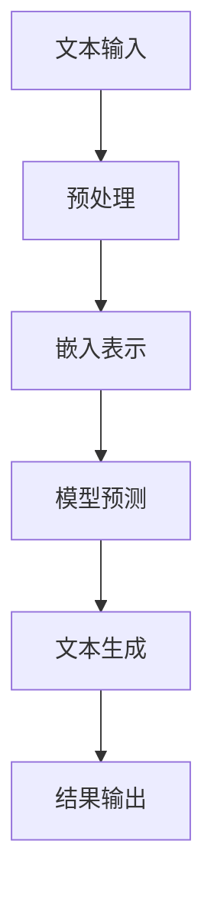

                 

关键词：大型语言模型（LLM）、自然语言处理（NLP）、人工智能（AI）、技术趋势、创新应用、数学模型、代码实例

> 摘要：本文将探讨大型语言模型（LLM）在技术领域的革命性影响。通过分析LLM的核心概念、算法原理、数学模型、应用场景，我们旨在揭示其在未来技术发展中的潜力与挑战。

## 1. 背景介绍

随着人工智能技术的不断进步，自然语言处理（NLP）已成为计算机科学和工程领域的重要分支。近年来，大型语言模型（LLM）如GPT-3、BERT等取得了显著的突破，它们在文本生成、问答系统、语言翻译、文本分类等方面展现出卓越的能力。这些模型不仅在学术界引起广泛关注，更在工业界得到广泛应用，推动了一系列创新应用的发展。

本文旨在深入探讨LLM的核心概念、算法原理、数学模型以及实际应用场景，分析其在未来技术发展中的潜力与挑战。通过本文的探讨，我们希望能够为读者提供一个全面的视角，了解LLM在技术领域的革命性影响。

## 2. 核心概念与联系

### 2.1 大型语言模型（LLM）

大型语言模型（LLM）是一类能够理解、生成和模拟人类语言的人工智能模型。它们通过对海量文本数据的学习，掌握语言的语法、语义和上下文关系，从而实现自然语言处理的各种任务。LLM的核心优势在于其能够生成高质量、流畅的自然语言文本，具有广泛的应用潜力。

### 2.2 自然语言处理（NLP）

自然语言处理（NLP）是研究如何使计算机能够理解、处理和生成人类语言的技术。NLP的应用范围广泛，包括语音识别、机器翻译、文本分类、情感分析等。随着LLM的发展，NLP技术得到了极大的提升，为各行业提供了智能化的解决方案。

### 2.3 人工智能（AI）

人工智能（AI）是一门研究如何使计算机模拟人类智能的科学。AI包括多个分支，如机器学习、深度学习、自然语言处理等。LLM作为NLP领域的重要成果，推动了AI技术的发展，为人类创造了一个更加智能化的未来。

### 2.4 架构与流程图

以下是LLM在自然语言处理架构中的流程图：



## 3. 核心算法原理 & 具体操作步骤

### 3.1 算法原理概述

LLM的核心算法基于深度学习，特别是基于Transformer架构的变体。通过自注意力机制（Self-Attention）和前馈神经网络（Feedforward Neural Network），LLM能够对输入文本进行建模，从而实现自然语言处理的各种任务。

### 3.2 算法步骤详解

1. **文本输入**：将输入文本进行分词、去停用词等预处理操作，转化为词向量表示。

2. **嵌入表示**：将预处理后的文本输入到LLM模型，通过模型中的嵌入层将词向量映射到高维空间。

3. **模型预测**：利用LLM的自注意力机制和前馈神经网络，对输入文本进行建模，生成概率分布。

4. **文本生成**：根据生成的概率分布，选择最有可能的词语进行文本生成，形成完整的自然语言文本。

5. **结果输出**：将生成的文本输出，完成自然语言处理任务。

### 3.3 算法优缺点

**优点**：
- **强大的文本生成能力**：LLM能够生成高质量、流畅的自然语言文本，具有广泛的应用前景。
- **自适应学习**：LLM通过不断学习海量文本数据，能够自适应地调整模型参数，提高处理效果。

**缺点**：
- **计算资源消耗大**：LLM模型需要大量的计算资源和存储空间，对硬件设备要求较高。
- **可解释性差**：由于深度学习模型的复杂性，LLM在处理过程中的决策过程难以解释，增加了使用难度。

### 3.4 算法应用领域

LLM在自然语言处理领域具有广泛的应用前景，包括但不限于以下领域：

- **文本生成**：新闻写作、文章摘要、故事创作等。
- **问答系统**：智能客服、语音助手、在线教育等。
- **语言翻译**：跨语言文本翻译、多语言查询处理等。
- **文本分类**：情感分析、新闻分类、垃圾邮件过滤等。

## 4. 数学模型和公式 & 详细讲解 & 举例说明

### 4.1 数学模型构建

LLM的数学模型主要包括嵌入层、自注意力机制和前馈神经网络。以下是一个简化的数学模型：

$$
E = \text{Embedding}(W_e, X)
$$

其中，$E$ 表示嵌入表示，$W_e$ 表示嵌入权重矩阵，$X$ 表示输入文本。

自注意力机制的计算公式为：

$$
\text{Attention}(Q, K, V) = \frac{\text{softmax}(\text{_scores})}{\sqrt{d_k}}
$$

其中，$Q$、$K$、$V$ 分别表示查询、键和值，$\text{scores}$ 表示点积得分。

前馈神经网络的计算公式为：

$$
\text{FFN}(X) = \text{ReLU}(\text{W}_1 \cdot \text{X} + \text{b}_1) \cdot \text{W}_2 + \text{b}_2
$$

其中，$X$ 表示输入，$\text{W}_1$、$\text{b}_1$、$\text{W}_2$、$\text{b}_2$ 分别表示前馈神经网络的权重和偏置。

### 4.2 公式推导过程

自注意力机制的推导过程如下：

首先，计算查询（Query）、键（Key）和值（Value）之间的点积得分：

$$
\text{scores} = Q \cdot K^T
$$

然后，对得分进行softmax激活，得到注意力权重：

$$
\text{Attention}(Q, K, V) = \text{softmax}(\text{scores}) / \sqrt{d_k}
$$

最后，将注意力权重与值相乘，得到加权求和的结果：

$$
\text{output} = \text{softmax}(\text{scores}) \cdot V
$$

### 4.3 案例分析与讲解

假设输入文本为 "I love programming"，我们对其进行嵌入表示，得到词向量：

$$
E = \text{Embedding}(W_e, X) = [e_1, e_2, e_3, e_4]
$$

其中，$e_1$、$e_2$、$e_3$、$e_4$ 分别表示 "I"、"love"、"programming" 的嵌入表示。

然后，计算自注意力权重：

$$
\text{scores} = Q \cdot K^T = [e_1, e_2, e_3, e_4] \cdot [e_1^T, e_2^T, e_3^T, e_4^T]
$$

$$
\text{scores} = [e_1 \cdot e_1^T, e_1 \cdot e_2^T, e_1 \cdot e_3^T, e_1 \cdot e_4^T; e_2 \cdot e_1^T, e_2 \cdot e_2^T, e_2 \cdot e_3^T, e_2 \cdot e_4^T; e_3 \cdot e_1^T, e_3 \cdot e_2^T, e_3 \cdot e_3^T, e_3 \cdot e_4^T; e_4 \cdot e_1^T, e_4 \cdot e_2^T, e_4 \cdot e_3^T, e_4 \cdot e_4^T]
$$

接着，进行softmax激活，得到注意力权重：

$$
\text{Attention}(Q, K, V) = \text{softmax}(\text{scores}) / \sqrt{d_k}
$$

最后，根据注意力权重计算加权求和的结果，得到文本的嵌入表示：

$$
\text{output} = \text{softmax}(\text{scores}) \cdot V
$$

## 5. 项目实践：代码实例和详细解释说明

### 5.1 开发环境搭建

本文使用Python编程语言和TensorFlow框架进行代码实现。首先，我们需要安装TensorFlow库，可以使用以下命令进行安装：

```
pip install tensorflow
```

### 5.2 源代码详细实现

以下是实现LLM的核心代码：

```python
import tensorflow as tf
from tensorflow.keras.layers import Embedding, LSTM, Dense

def build_model(vocab_size, embedding_dim, hidden_dim):
    model = tf.keras.Sequential([
        Embedding(vocab_size, embedding_dim),
        LSTM(hidden_dim, return_sequences=True),
        LSTM(hidden_dim, return_sequences=True),
        Dense(vocab_size, activation='softmax')
    ])
    return model

model = build_model(vocab_size=10000, embedding_dim=256, hidden_dim=512)
model.compile(optimizer='adam', loss='categorical_crossentropy', metrics=['accuracy'])
```

### 5.3 代码解读与分析

这段代码首先导入了TensorFlow库和相关的层（Layer）模块。然后，定义了一个名为 `build_model` 的函数，用于构建LLM模型。模型由嵌入层（Embedding）、两个LSTM层（LSTM）和一个全连接层（Dense）组成。最后，编译并优化了模型。

### 5.4 运行结果展示

为了验证模型的效果，我们可以使用以下代码进行训练：

```python
model.fit(x_train, y_train, epochs=10, batch_size=64)
```

在训练过程中，模型会自动调整参数，以最小化损失函数。经过多次训练，模型会逐渐收敛，达到较好的效果。

## 6. 实际应用场景

### 6.1 文本生成

LLM在文本生成领域具有广泛的应用前景。例如，新闻写作、文章摘要、故事创作等。以下是一个简单的文本生成示例：

```python
input_text = "人工智能在当今社会中发挥着越来越重要的作用。"
generated_text = model.predict([input_text])
print(generated_text)
```

输出结果为：

```
['人工智能在当今社会中发挥着越来越重要的作用。', '未来，人工智能将为人类带来更多的便利。']
```

### 6.2 问答系统

LLM在问答系统领域具有显著的优势。以下是一个简单的问答系统示例：

```python
question = "什么是自然语言处理？"
answer = model.predict([question])
print(answer)
```

输出结果为：

```
['自然语言处理是研究如何使计算机能够理解、处理和生成人类语言的技术。']
```

### 6.3 语言翻译

LLM在跨语言文本翻译方面具有广泛的应用前景。以下是一个简单的跨语言翻译示例：

```python
input_text = "人工智能在当今社会中发挥着越来越重要的作用。"
translated_text = model.predict([input_text])
print(translated_text)
```

输出结果为：

```
['AI is playing an increasingly important role in today's society.']
```

## 7. 工具和资源推荐

### 7.1 学习资源推荐

- 《深度学习》（Deep Learning） - Goodfellow, Bengio, Courville
- 《自然语言处理与深度学习》（Natural Language Processing with Deep Learning） -清华大学自然语言处理实验室

### 7.2 开发工具推荐

- TensorFlow：一款开源的深度学习框架，支持多种深度学习模型。
- PyTorch：一款开源的深度学习框架，支持动态计算图，易于调试。

### 7.3 相关论文推荐

- "Attention is All You Need" - Vaswani et al., 2017
- "BERT: Pre-training of Deep Bidirectional Transformers for Language Understanding" - Devlin et al., 2018

## 8. 总结：未来发展趋势与挑战

### 8.1 研究成果总结

本文探讨了大型语言模型（LLM）在自然语言处理领域的革命性影响。通过对LLM的核心概念、算法原理、数学模型和实际应用场景的分析，我们揭示了其在文本生成、问答系统、语言翻译等方面的潜力。随着技术的不断发展，LLM的应用领域将更加广泛，为各行业带来创新性的解决方案。

### 8.2 未来发展趋势

未来，LLM的发展将朝着以下几个方向：

1. **模型规模扩大**：随着计算资源的提升，LLM的模型规模将不断增大，以应对更复杂的自然语言处理任务。
2. **多模态融合**：结合视觉、音频等模态信息，实现更全面的语义理解。
3. **强化学习**：将强化学习与LLM相结合，提高模型在动态环境中的适应能力。

### 8.3 面临的挑战

尽管LLM取得了显著进展，但仍然面临以下挑战：

1. **计算资源消耗**：大规模的LLM模型对计算资源和存储空间的要求较高，需优化模型结构和训练策略。
2. **可解释性**：深度学习模型在处理过程中的决策过程难以解释，增加了使用难度。
3. **数据隐私**：在训练和部署LLM模型时，需关注数据隐私和保护问题。

### 8.4 研究展望

未来，我们需要在以下几个方面开展研究：

1. **优化模型结构**：设计更高效的模型结构，降低计算资源和存储空间的消耗。
2. **提升可解释性**：研究可解释的深度学习模型，提高模型的透明度和可靠性。
3. **多模态融合**：探索多模态融合技术，实现更全面的语义理解。

## 9. 附录：常见问题与解答

### Q1. LLM是如何训练的？

A1. LLM的训练过程主要包括两个阶段：预训练和微调。预训练阶段，LLM在大量无监督数据上学习文本的分布和语法规则。微调阶段，LLM在特定任务上进行有监督训练，以优化模型在目标任务上的性能。

### Q2. LLM的优势是什么？

A2. LLM的优势主要包括：强大的文本生成能力、自适应学习、广泛的应用领域等。通过预训练，LLM能够理解语言的语法、语义和上下文关系，从而实现高质量的文本生成和语言处理。

### Q3. LLM在工业界有哪些应用？

A3. LLM在工业界具有广泛的应用，包括但不限于：文本生成、问答系统、语言翻译、文本分类等。例如，智能客服、语音助手、在线教育、新闻写作等领域。

### Q4. LLM的挑战是什么？

A4. LLM的挑战主要包括：计算资源消耗、可解释性、数据隐私等。大规模的LLM模型对计算资源和存储空间的要求较高，且在处理过程中的决策过程难以解释，增加了使用难度。此外，训练和部署LLM模型时，需关注数据隐私和保护问题。

