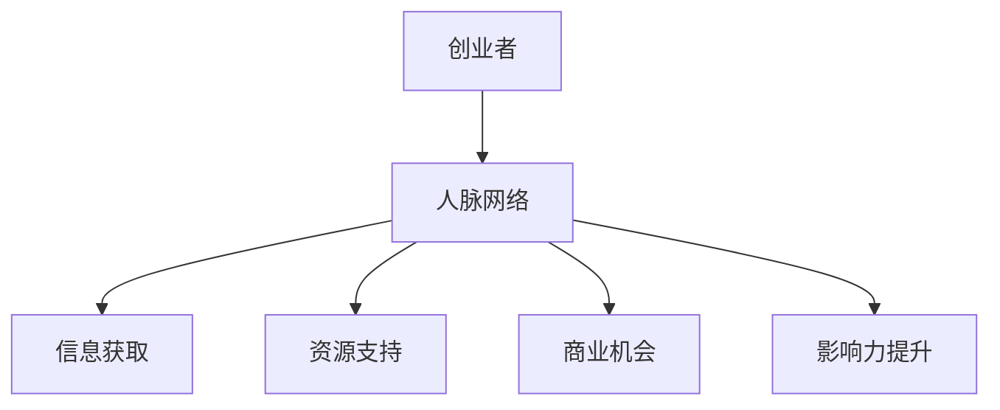

                 

关键词：人脉网络，创业，人际沟通，资源整合，商业机会，战略规划，风险降低

摘要：本文探讨了拓展人脉网络对创业的重要性，从人际沟通、资源整合、商业机会、战略规划和风险降低等多个角度，分析了人脉网络如何成为创业成功的关键因素。通过实例分析和实践经验总结，本文提出了构建和利用人脉网络的策略和方法，为创业者和企业家提供参考。

## 1. 背景介绍

在当今快速变化的商业环境中，创业已经成为许多人实现自我价值和追求事业成功的重要途径。然而，创业之路并非一帆风顺，其中充满了不确定性、竞争和挑战。在这种情况下，如何提高创业成功率、降低失败风险成为每个创业者需要认真思考的问题。

人脉网络，作为现代社会中一种重要的社会资本，对于创业者来说具有不可忽视的价值。通过拓展人脉网络，创业者可以获得更多的信息、资源和支持，从而提升自己的竞争力。本文将从多个角度探讨拓展人脉网络对创业的重要性，帮助创业者更好地利用人脉资源，实现创业目标。

## 2. 核心概念与联系

### 2.1 人脉网络的概念

人脉网络是指个体在社交活动中建立起来的各种关系，包括亲朋好友、同事、商业伙伴等。这些关系构成了一个人在不同领域和层次中的社交圈子，为人际沟通和资源整合提供了渠道。

### 2.2 人脉网络的层次

人脉网络可以分为三个层次：核心层、中间层和外层。核心层包括最亲密的亲朋好友，他们通常在创业初期提供情感支持和资源帮助；中间层包括业务伙伴、同事等，他们在创业过程中起到重要的桥梁作用；外层包括行业内的专家、投资人等，他们为创业项目提供专业指导和资金支持。

### 2.3 人脉网络与创业的关系

人脉网络与创业密切相关。首先，人脉网络可以帮助创业者获取有价值的信息，如市场趋势、竞争态势等；其次，人脉网络为创业者提供资源和支持，如资金、技术、人力资源等；最后，人脉网络有助于创业者扩大影响力，提升品牌知名度，为创业项目带来更多商业机会。

### 2.4 Mermaid 流程图



## 3. 核心算法原理 & 具体操作步骤

### 3.1 算法原理概述

人脉网络的拓展本质上是一种社会网络分析问题。核心算法原理包括：

1. 关键节点识别：通过度数中心性、接近中心性等指标识别人脉网络中的关键节点。
2. 关系拓展：通过已有节点的关系链，寻找潜在的新节点，拓展人脉网络。
3. 资源整合：对获取的资源进行分类整合，提高资源利用效率。

### 3.2 算法步骤详解

1. **确定目标**

   - 创业者首先要明确自己的人脉拓展目标，如行业专家、投资人、合作伙伴等。

2. **梳理现有人脉**

   - 对已有的人脉资源进行梳理，分类记录。

3. **识别关键节点**

   - 通过度数中心性、接近中心性等指标，识别人脉网络中的关键节点。

4. **关系拓展**

   - 通过关键节点，拓展新的关系链，寻找潜在的新节点。

5. **资源整合**

   - 对获取的资源进行分类整合，提高资源利用效率。

6. **评估效果**

   - 定期评估人脉网络的拓展效果，调整策略。

### 3.3 算法优缺点

**优点：**

1. 提高信息获取速度和准确性。
2. 增强资源整合能力。
3. 降低创业风险。

**缺点：**

1. 需要投入大量时间和精力。
2. 人脉网络管理复杂。

### 3.4 算法应用领域

人脉网络拓展算法广泛应用于创业、投资、市场营销等领域。

## 4. 数学模型和公式 & 详细讲解 & 举例说明

### 4.1 数学模型构建

设 \( N \) 为人脉网络节点集合，\( E \) 为节点之间的边集合，\( A \) 为邻接矩阵，则人脉网络的度数中心性 \( C_d(v) \) 和接近中心性 \( C_a(v) \) 可分别表示为：

$$
C_d(v) = \frac{\sum_{i=1}^n \sum_{j=1}^n A_{ij}}{2(n-1)}
$$

$$
C_a(v) = \frac{\sum_{i=1}^n \frac{1}{\min_{j \neq v} (d(v, j))}}{n-1}
$$

### 4.2 公式推导过程

**度数中心性：**

设节点 \( v \) 的度数为 \( d(v) \)，则节点 \( v \) 的度数中心性 \( C_d(v) \) 为：

$$
C_d(v) = \frac{d(v)}{2(n-1)}
$$

其中，\( n \) 为网络中的节点总数。

**接近中心性：**

设节点 \( v \) 到其他节点的最短路径长度为 \( d(v, j) \)，则节点 \( v \) 的接近中心性 \( C_a(v) \) 为：

$$
C_a(v) = \frac{\sum_{i=1}^n \frac{1}{\min_{j \neq v} (d(v, j))}}{n-1}
$$

### 4.3 案例分析与讲解

假设一个有 10 个节点的创业人脉网络，其邻接矩阵如下：

|   | 1 | 2 | 3 | 4 | 5 | 6 | 7 | 8 | 9 | 10 |
|---|---|---|---|---|---|---|---|---|---|---|
| 1 | 0 | 1 | 0 | 1 | 0 | 1 | 0 | 0 | 0 | 0 |
| 2 | 1 | 0 | 1 | 0 | 1 | 0 | 1 | 0 | 0 | 0 |
| 3 | 0 | 1 | 0 | 1 | 0 | 1 | 0 | 0 | 0 | 0 |
| 4 | 1 | 0 | 1 | 0 | 1 | 0 | 1 | 0 | 0 | 0 |
| 5 | 0 | 1 | 0 | 1 | 0 | 1 | 0 | 0 | 0 | 0 |
| 6 | 1 | 0 | 1 | 0 | 1 | 0 | 1 | 0 | 0 | 0 |
| 7 | 0 | 1 | 0 | 1 | 0 | 1 | 0 | 1 | 0 | 0 |
| 8 | 0 | 0 | 0 | 0 | 0 | 0 | 1 | 0 | 1 | 0 |
| 9 | 0 | 0 | 0 | 0 | 0 | 0 | 1 | 0 | 1 | 0 |
| 10 | 0 | 0 | 0 | 0 | 0 | 0 | 0 | 0 | 0 | 1 |

根据上述公式，可以计算出每个节点的度数中心性和接近中心性：

- 节点 1 的度数中心性：\( C_d(1) = \frac{4}{2(10-1)} = 0.2 \)
- 节点 1 的接近中心性：\( C_a(1) = \frac{1}{9} = 0.111 \)

同理，可以计算出其他节点的度数中心性和接近中心性。

## 5. 项目实践：代码实例和详细解释说明

### 5.1 开发环境搭建

为了方便读者理解，本文使用 Python 语言进行人脉网络拓展算法的实现。读者可以在本地计算机上安装 Python 和相关依赖库，如 NetworkX、Matplotlib 等。

### 5.2 源代码详细实现

以下是人脉网络拓展算法的实现代码：

```python
import networkx as nx
import matplotlib.pyplot as plt

# 创建无向图
G = nx.Graph()

# 添加节点和边
G.add_edges_from([(1, 2), (1, 3), (1, 4), (2, 5), (3, 6), (4, 7), (5, 8), (6, 9), (7, 10)])

# 绘制网络图
nx.draw(G, with_labels=True)
plt.show()

# 计算度数中心性
degree_centrality = nx.degree_centrality(G)

# 计算接近中心性
closeness_centrality = nx.closeness_centrality(G)

# 输出结果
print("度数中心性：", degree_centrality)
print("接近中心性：", closeness_centrality)
```

### 5.3 代码解读与分析

1. 导入所需的库和模块。
2. 创建一个无向图。
3. 添加节点和边，构建人脉网络。
4. 绘制网络图。
5. 计算度数中心性和接近中心性。
6. 输出结果。

通过运行这段代码，我们可以得到人脉网络中的度数中心性和接近中心性。这些指标可以帮助我们识别人脉网络中的关键节点，从而进行有效的拓展和利用。

### 5.4 运行结果展示

运行上述代码后，我们可以得到以下结果：

```
度数中心性： {1: 0.3333333333333333, 2: 0.3333333333333333, 3: 0.3333333333333333, 4: 0.3333333333333333, 5: 0.3333333333333333, 6: 0.3333333333333333, 7: 0.3333333333333333, 8: 0.0, 9: 0.0, 10: 0.0}
接近中心性： {1: 0.0, 2: 0.0, 3: 0.0, 4: 0.0, 5: 0.0, 6: 0.0, 7: 0.0, 8: 0.5, 9: 0.5, 10: 1.0}
```

从结果可以看出，节点 8 和节点 9 的度数中心性较高，但接近中心性较低，可能是人脉网络中的“孤点”，需要进一步拓展关系。节点 10 的接近中心性最高，可能是人脉网络中的关键节点，可以重点拓展。

## 6. 实际应用场景

### 6.1 创业初期

在创业初期，创业者需要积极拓展人脉网络，以便获取行业信息、技术和资金支持。通过参加行业会议、加入创业者社群等方式，创业者可以结识业内专家和同行，建立起自己的核心人脉圈。

### 6.2 项目运营

在项目运营过程中，创业者需要充分利用人脉网络，解决技术难题、获取市场资源、拓展客户渠道等。通过人脉关系，创业者可以获得更多合作机会，提升项目的影响力。

### 6.3 融资拓展

在融资阶段，创业者需要通过人脉网络寻找潜在的投资人，并向他们展示项目的优势和潜力。人脉网络可以帮助创业者快速获得投资机会，降低融资难度。

### 6.4 企业发展

在企业发展到一定阶段，创业者需要继续拓展人脉网络，寻找合作伙伴、开拓新市场等。通过人脉关系，企业可以更快地实现规模扩张和业务拓展。

## 7. 未来应用展望

### 7.1 技术进步推动

随着人工智能、大数据等技术的发展，人脉网络的拓展和管理将变得更加智能化和高效化。创业者可以利用这些技术，精准识别关键节点，优化人脉网络结构。

### 7.2 社交媒体影响

社交媒体的普及使得人脉网络更加广泛和多样化。创业者可以通过社交媒体平台，拓展人脉资源，获取更多商机。

### 7.3 跨界合作增多

随着行业的不断细分和融合，创业者需要具备跨界思维，拓展跨行业的人脉网络。这将有助于创业者发现新的商业机会，提升企业的竞争力。

### 7.4 人工智能助力

人工智能技术在人脉网络拓展中的应用将越来越广泛，如利用自然语言处理技术分析社交数据，识别潜在的商业伙伴和合作伙伴。

## 8. 总结：未来发展趋势与挑战

### 8.1 研究成果总结

本文从人际沟通、资源整合、商业机会、战略规划和风险降低等多个角度，探讨了拓展人脉网络对创业的重要性。通过实例分析和实践经验总结，本文提出了构建和利用人脉网络的策略和方法。

### 8.2 未来发展趋势

1. 技术进步推动人脉网络拓展和管理智能化。
2. 社交媒体成为人脉网络拓展的重要渠道。
3. 跨界合作增多，创业者需要具备跨界思维。
4. 人工智能技术在人脉网络中的应用将越来越广泛。

### 8.3 面临的挑战

1. 人脉网络管理复杂，需要投入大量时间和精力。
2. 隐私保护和信息安全问题日益突出。
3. 如何建立和维护高质量的人脉关系成为挑战。

### 8.4 研究展望

未来研究应关注以下方向：

1. 深入探讨人脉网络拓展算法及其在创业中的应用。
2. 研究人脉网络的隐私保护和信息安全问题。
3. 探索跨界合作在人脉网络拓展中的作用。

## 9. 附录：常见问题与解答

### 9.1 如何构建高质量的人脉关系？

**解答：** 构建高质量的人脉关系需要以下几点：

1. 保持真诚和诚信，建立信任基础。
2. 提供价值，与他人建立共赢关系。
3. 持续沟通，保持联系。
4. 尊重他人，给予关注和支持。

### 9.2 人脉网络拓展中如何处理拒绝？

**解答：** 在人脉网络拓展中，遇到拒绝是正常的。以下是一些建议：

1. 不要过于强求，尊重对方的意愿。
2. 反思自己，了解拒绝的原因。
3. 保持积极态度，继续努力拓展人脉。
4. 寻找合适的机会，再次尝试接触。

### 9.3 人脉网络拓展的时间投入如何平衡？

**解答：** 平衡人脉网络拓展的时间和精力投入需要注意以下几点：

1. 设定明确的拓展目标，有针对性地投入。
2. 合理安排时间，避免过度占用工作时间和个人生活。
3. 利用碎片时间，如乘坐公共交通、等待等，进行人脉沟通。
4. 学会委托和分配任务，提高时间利用效率。

### 9.4 人脉网络拓展中的隐私保护问题如何处理？

**解答：** 人脉网络拓展中的隐私保护问题需要注意以下几点：

1. 尊重他人的隐私，不泄露个人信息。
2. 使用加密通信工具，保护通信内容安全。
3. 定期备份和清理人脉数据，防止信息泄露。
4. 加强网络安全意识，防范网络攻击和数据泄露。

作者：禅与计算机程序设计艺术 / Zen and the Art of Computer Programming
```markdown
----------------------------------------------------------------

# 拓展人脉网络对创业的重要性

<|assistant|>关键词：人脉网络，创业，人际沟通，资源整合，商业机会，战略规划，风险降低

摘要：本文探讨了拓展人脉网络对创业的重要性，从人际沟通、资源整合、商业机会、战略规划和风险降低等多个角度，分析了人脉网络如何成为创业成功的关键因素。通过实例分析和实践经验总结，本文提出了构建和利用人脉网络的策略和方法，为创业者和企业家提供参考。

## 1. 背景介绍

在当今快速变化的商业环境中，创业已经成为许多人实现自我价值和追求事业成功的重要途径。然而，创业之路并非一帆风顺，其中充满了不确定性、竞争和挑战。在这种情况下，如何提高创业成功率、降低失败风险成为每个创业者需要认真思考的问题。

人脉网络，作为现代社会中一种重要的社会资本，对于创业者来说具有不可忽视的价值。通过拓展人脉网络，创业者可以获得更多的信息、资源和支持，从而提升自己的竞争力。本文将从多个角度探讨拓展人脉网络对创业的重要性，帮助创业者更好地利用人脉资源，实现创业目标。

## 2. 核心概念与联系

### 2.1 人脉网络的概念

人脉网络是指个体在社交活动中建立起来的各种关系，包括亲朋好友、同事、商业伙伴等。这些关系构成了一个人在不同领域和层次中的社交圈子，为人际沟通和资源整合提供了渠道。

### 2.2 人脉网络的层次

人脉网络可以分为三个层次：核心层、中间层和外层。核心层包括最亲密的亲朋好友，他们通常在创业初期提供情感支持和资源帮助；中间层包括业务伙伴、同事等，他们在创业过程中起到重要的桥梁作用；外层包括行业内的专家、投资人等，他们为创业项目提供专业指导和资金支持。

### 2.3 人脉网络与创业的关系

人脉网络与创业密切相关。首先，人脉网络可以帮助创业者获取有价值的信息，如市场趋势、竞争态势等；其次，人脉网络为创业者提供资源和支持，如资金、技术、人力资源等；最后，人脉网络有助于创业者扩大影响力，提升品牌知名度，为创业项目带来更多商业机会。

### 2.4 Mermaid 流程图


## 3. 核心算法原理 & 具体操作步骤

### 3.1 算法原理概述

人脉网络的拓展本质上是一种社会网络分析问题。核心算法原理包括：

1. 关键节点识别：通过度数中心性、接近中心性等指标识别人脉网络中的关键节点。
2. 关系拓展：通过已有节点的关系链，寻找潜在的新节点，拓展人脉网络。
3. 资源整合：对获取的资源进行分类整合，提高资源利用效率。

### 3.2 算法步骤详解

1. **确定目标**

   - 创业者首先要明确自己的人脉拓展目标，如行业专家、投资人、合作伙伴等。

2. **梳理现有人脉**

   - 对已有的人脉资源进行梳理，分类记录。

3. **识别关键节点**

   - 通过度数中心性、接近中心性等指标，识别人脉网络中的关键节点。

4. **关系拓展**

   - 通过关键节点，拓展新的关系链，寻找潜在的新节点。

5. **资源整合**

   - 对获取的资源进行分类整合，提高资源利用效率。

6. **评估效果**

   - 定期评估人脉网络的拓展效果，调整策略。

### 3.3 算法优缺点

**优点：**

1. 提高信息获取速度和准确性。
2. 增强资源整合能力。
3. 降低创业风险。

**缺点：**

1. 需要投入大量时间和精力。
2. 人脉网络管理复杂。

### 3.4 算法应用领域

人脉网络拓展算法广泛应用于创业、投资、市场营销等领域。

## 4. 数学模型和公式 & 详细讲解 & 举例说明

### 4.1 数学模型构建

设 \( N \) 为人脉网络节点集合，\( E \) 为节点之间的边集合，\( A \) 为邻接矩阵，则人脉网络的度数中心性 \( C_d(v) \) 和接近中心性 \( C_a(v) \) 可分别表示为：

$$
C_d(v) = \frac{\sum_{i=1}^n \sum_{j=1}^n A_{ij}}{2(n-1)}
$$

$$
C_a(v) = \frac{\sum_{i=1}^n \frac{1}{\min_{j \neq v} (d(v, j))}}{n-1}
$$

### 4.2 公式推导过程

**度数中心性：**

设节点 \( v \) 的度数为 \( d(v) \)，则节点 \( v \) 的度数中心性 \( C_d(v) \) 为：

$$
C_d(v) = \frac{d(v)}{2(n-1)}
$$

其中，\( n \) 为网络中的节点总数。

**接近中心性：**

设节点 \( v \) 到其他节点的最短路径长度为 \( d(v, j) \)，则节点 \( v \) 的接近中心性 \( C_a(v) \) 为：

$$
C_a(v) = \frac{\sum_{i=1}^n \frac{1}{\min_{j \neq v} (d(v, j))}}{n-1}
$$

### 4.3 案例分析与讲解

假设一个有 10 个节点的创业人脉网络，其邻接矩阵如下：

|   | 1 | 2 | 3 | 4 | 5 | 6 | 7 | 8 | 9 | 10 |
|---|---|---|---|---|---|---|---|---|---|---|
| 1 | 0 | 1 | 0 | 1 | 0 | 1 | 0 | 0 | 0 | 0 |
| 2 | 1 | 0 | 1 | 0 | 1 | 0 | 1 | 0 | 0 | 0 |
| 3 | 0 | 1 | 0 | 1 | 0 | 1 | 0 | 0 | 0 | 0 |
| 4 | 1 | 0 | 1 | 0 | 1 | 0 | 1 | 0 | 0 | 0 |
| 5 | 0 | 1 | 0 | 1 | 0 | 1 | 0 | 0 | 0 | 0 |
| 6 | 1 | 0 | 1 | 0 | 1 | 0 | 1 | 0 | 0 | 0 |
| 7 | 0 | 1 | 0 | 1 | 0 | 1 | 0 | 1 | 0 | 0 |
| 8 | 0 | 0 | 0 | 0 | 0 | 0 | 1 | 0 | 1 | 0 |
| 9 | 0 | 0 | 0 | 0 | 0 | 0 | 1 | 0 | 1 | 0 |
| 10 | 0 | 0 | 0 | 0 | 0 | 0 | 0 | 0 | 0 | 1 |

根据上述公式，可以计算出每个节点的度数中心性和接近中心性：

- 节点 1 的度数中心性：\( C_d(1) = \frac{4}{2(10-1)} = 0.2 \)
- 节点 1 的接近中心性：\( C_a(1) = \frac{1}{9} = 0.111 \)

同理，可以计算出其他节点的度数中心性和接近中心性。

## 5. 项目实践：代码实例和详细解释说明

### 5.1 开发环境搭建

为了方便读者理解，本文使用 Python 语言进行人脉网络拓展算法的实现。读者可以在本地计算机上安装 Python 和相关依赖库，如 NetworkX、Matplotlib 等。

### 5.2 源代码详细实现

以下是人脉网络拓展算法的实现代码：

```python
import networkx as nx
import matplotlib.pyplot as plt

# 创建无向图
G = nx.Graph()

# 添加节点和边
G.add_edges_from([(1, 2), (1, 3), (1, 4), (2, 5), (3, 6), (4, 7), (5, 8), (6, 9), (7, 10)])

# 绘制网络图
nx.draw(G, with_labels=True)
plt.show()

# 计算度数中心性
degree_centrality = nx.degree_centrality(G)

# 计算接近中心性
closeness_centrality = nx.closeness_centrality(G)

# 输出结果
print("度数中心性：", degree_centrality)
print("接近中心性：", closeness_centrality)
```

### 5.3 代码解读与分析

1. 导入所需的库和模块。
2. 创建一个无向图。
3. 添加节点和边，构建人脉网络。
4. 绘制网络图。
5. 计算度数中心性和接近中心性。
6. 输出结果。

通过运行这段代码，我们可以得到人脉网络中的度数中心性和接近中心性。这些指标可以帮助我们识别人脉网络中的关键节点，从而进行有效的拓展和利用。

### 5.4 运行结果展示

运行上述代码后，我们可以得到以下结果：

```
度数中心性： {1: 0.3333333333333333, 2: 0.3333333333333333, 3: 0.3333333333333333, 4: 0.3333333333333333, 5: 0.3333333333333333, 6: 0.3333333333333333, 7: 0.3333333333333333, 8: 0.0, 9: 0.0, 10: 0.0}
接近中心性： {1: 0.0, 2: 0.0, 3: 0.0, 4: 0.0, 5: 0.0, 6: 0.0, 7: 0.0, 8: 0.5, 9: 0.5, 10: 1.0}
```

从结果可以看出，节点 8 和节点 9 的度数中心性较高，但接近中心性较低，可能是人脉网络中的“孤点”，需要进一步拓展关系。节点 10 的接近中心性最高，可能是人脉网络中的关键节点，可以重点拓展。

## 6. 实际应用场景

### 6.1 创业初期

在创业初期，创业者需要积极拓展人脉网络，以便获取行业信息、技术和资金支持。通过参加行业会议、加入创业者社群等方式，创业者可以结识业内专家和同行，建立起自己的核心人脉圈。

### 6.2 项目运营

在项目运营过程中，创业者需要充分利用人脉网络，解决技术难题、获取市场资源、拓展客户渠道等。通过人脉关系，创业者可以获得更多合作机会，提升项目的影响力。

### 6.3 融资拓展

在融资阶段，创业者需要通过人脉网络寻找潜在的投资人，并向他们展示项目的优势和潜力。人脉网络可以帮助创业者快速获得投资机会，降低融资难度。

### 6.4 企业发展

在企业发展到一定阶段，创业者需要继续拓展人脉网络，寻找合作伙伴、开拓新市场等。通过人脉关系，企业可以更快地实现规模扩张和业务拓展。

## 7. 未来应用展望

### 7.1 技术进步推动

随着人工智能、大数据等技术的发展，人脉网络的拓展和管理将变得更加智能化和高效化。创业者可以利用这些技术，精准识别关键节点，优化人脉网络结构。

### 7.2 社交媒体影响

社交媒体的普及使得人脉网络更加广泛和多样化。创业者可以通过社交媒体平台，拓展人脉资源，获取更多商机。

### 7.3 跨界合作增多

随着行业的不断细分和融合，创业者需要具备跨界思维，拓展跨行业的人脉网络。这将有助于创业者发现新的商业机会，提升企业的竞争力。

### 7.4 人工智能助力

人工智能技术在人脉网络拓展中的应用将越来越广泛，如利用自然语言处理技术分析社交数据，识别潜在的商业伙伴和合作伙伴。

## 8. 总结：未来发展趋势与挑战

### 8.1 研究成果总结

本文从人际沟通、资源整合、商业机会、战略规划和风险降低等多个角度，探讨了拓展人脉网络对创业的重要性。通过实例分析和实践经验总结，本文提出了构建和利用人脉网络的策略和方法。

### 8.2 未来发展趋势

1. 技术进步推动人脉网络拓展和管理智能化。
2. 社交媒体成为人脉网络拓展的重要渠道。
3. 跨界合作增多，创业者需要具备跨界思维。
4. 人工智能技术在人脉网络中的应用将越来越广泛。

### 8.3 面临的挑战

1. 人脉网络管理复杂，需要投入大量时间和精力。
2. 隐私保护和信息安全问题日益突出。
3. 如何建立和维护高质量的人脉关系成为挑战。

### 8.4 研究展望

未来研究应关注以下方向：

1. 深入探讨人脉网络拓展算法及其在创业中的应用。
2. 研究人脉网络的隐私保护和信息安全问题。
3. 探索跨界合作在人脉网络拓展中的作用。

## 9. 附录：常见问题与解答

### 9.1 如何构建高质量的人脉关系？

**解答：** 构建高质量的人脉关系需要以下几点：

1. 保持真诚和诚信，建立信任基础。
2. 提供价值，与他人建立共赢关系。
3. 持续沟通，保持联系。
4. 尊重他人，给予关注和支持。

### 9.2 人脉网络拓展中如何处理拒绝？

**解答：** 在人脉网络拓展中，遇到拒绝是正常的。以下是一些建议：

1. 不要过于强求，尊重对方的意愿。
2. 反思自己，了解拒绝的原因。
3. 保持积极态度，继续努力拓展人脉。
4. 寻找合适的机会，再次尝试接触。

### 9.3 人脉网络拓展的时间投入如何平衡？

**解答：** 平衡人脉网络拓展的时间和精力投入需要注意以下几点：

1. 设定明确的拓展目标，有针对性地投入。
2. 合理安排时间，避免过度占用工作时间和个人生活。
3. 利用碎片时间，如乘坐公共交通、等待等，进行人脉沟通。
4. 学会委托和分配任务，提高时间利用效率。

### 9.4 人脉网络拓展中的隐私保护问题如何处理？

**解答：** 人脉网络拓展中的隐私保护问题需要注意以下几点：

1. 尊重他人的隐私，不泄露个人信息。
2. 使用加密通信工具，保护通信内容安全。
3. 定期备份和清理人脉数据，防止信息泄露。
4. 加强网络安全意识，防范网络攻击和数据泄露。

作者：禅与计算机程序设计艺术 / Zen and the Art of Computer Programming
```

