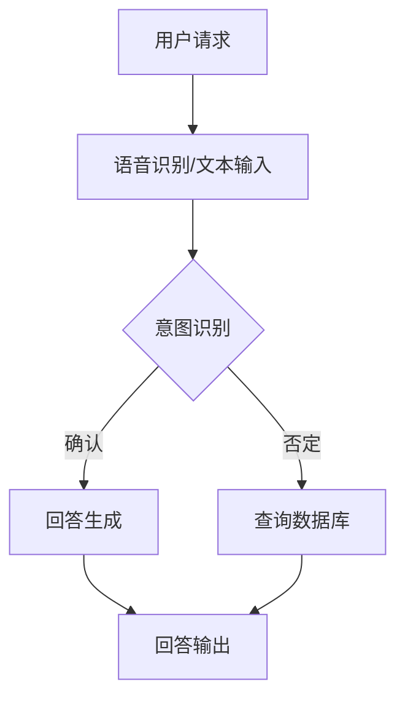

                 

### 引言 Introduction

在当今快速发展的数字经济时代，智能客户服务系统（ICSS）已经成为企业提升客户满意度和运营效率的重要手段。拼多多作为中国领先的社会化电商平台，其智能客户服务系统的发展尤为值得关注。随着AI技术的不断进步，智能客户服务系统在解决客户问题、处理投诉、提供个性化服务等方面表现出色，极大地提高了客户体验。

本文旨在汇总2024年拼多多智能客户服务系统社招面试中可能涉及的关键问题，并提供详细的解答。通过这篇文章，读者不仅可以了解拼多多智能客户服务系统的核心技术，还能掌握相关面试技巧，为未来的面试做好准备。

文章将按照以下结构展开：

1. **背景介绍**：介绍智能客户服务系统的基本概念及其在拼多多平台的应用。
2. **核心概念与联系**：详细阐述智能客户服务系统的核心概念和架构，并通过Mermaid流程图展示其工作流程。
3. **核心算法原理 & 具体操作步骤**：分析智能客户服务系统中使用的主要算法，并详细描述其操作步骤和优缺点。
4. **数学模型和公式 & 详细讲解 & 举例说明**：介绍智能客户服务系统中的数学模型和公式，并通过案例进行分析。
5. **项目实践：代码实例和详细解释说明**：展示一个实际的智能客户服务系统开发实例，并进行详细解释和分析。
6. **实际应用场景**：探讨智能客户服务系统在不同场景下的应用。
7. **未来应用展望**：预测智能客户服务系统的未来发展趋势和应用前景。
8. **工具和资源推荐**：推荐学习资源、开发工具和相关论文。
9. **总结：未来发展趋势与挑战**：总结研究成果，展望未来发展趋势和面临的挑战。
10. **附录：常见问题与解答**：回答读者可能关心的一些常见问题。

让我们开始深入了解拼多多智能客户服务系统的各个层面。

### 1. 背景介绍 Background

智能客户服务系统（ICSS）是一种利用人工智能、机器学习和自然语言处理技术，实现自动化、高效、智能的客户服务解决方案。它通过分析客户行为、历史数据和交互记录，提供个性化的服务，解决客户问题，并帮助企业在竞争激烈的市场中提升客户满意度和忠诚度。

在拼多多平台上，智能客户服务系统的应用尤为广泛。拼多多作为中国领先的社会化电商平台，其用户数量和交易量巨大，传统的人工客服模式已无法满足快速增长的客户需求。因此，拼多多引入了智能客户服务系统，以提升客户体验和服务效率。

智能客户服务系统在拼多多平台上的主要应用包括：

- **客服机器人**：通过自然语言处理技术，实现与用户的智能对话，快速响应客户问题。
- **智能语音识别**：将用户语音转化为文本，实现语音与文本交互。
- **智能推荐系统**：基于用户的购买历史和行为，提供个性化的商品推荐。
- **智能投诉处理**：自动识别和处理用户的投诉信息，快速响应并解决用户问题。

这些应用不仅提高了客户满意度，还显著提升了客服效率和运营效益。通过智能客户服务系统，拼多多能够更好地理解客户需求，提供个性化的服务，从而增强用户粘性和忠诚度。

### 2. 核心概念与联系 Core Concepts and Relationships

智能客户服务系统的核心概念和联系可以归纳为以下几个方面：

- **自然语言处理（NLP）**：NLP是使计算机能够理解、解释和生成人类语言的关键技术。在智能客户服务系统中，NLP用于解析用户的问题和需求，理解其意图，并提供相应的回答。
- **机器学习（ML）**：ML算法使计算机能够从数据中自动学习和改进。在智能客户服务系统中，ML算法用于训练模型，识别用户的交互模式，并预测用户的行为。
- **语音识别（ASR）**：ASR技术将用户的语音转化为文本，使其能够与计算机进行语音交互。在智能客户服务系统中，语音识别用于处理用户的语音查询，并提供文本反馈。
- **对话管理**：对话管理是指设计和管理与用户的交互过程。它包括理解用户的意图、生成合适的回答、跟踪对话历史和上下文等。在智能客户服务系统中，对话管理是确保交互流畅和有效性的关键。

为了更好地展示智能客户服务系统的工作流程和核心概念，我们可以使用Mermaid流程图来描述其架构。



在上面的流程图中：

- 用户请求通过语音识别或文本输入被输入系统。
- 系统使用意图识别模块确定用户的意图。
- 如果用户的意图可以被确认，系统生成相应的回答。
- 如果用户的意图无法被确认，系统查询数据库以获取更多信息。
- 最终，系统将回答输出给用户。

通过这个流程图，我们可以清晰地看到智能客户服务系统的工作流程以及各个核心概念之间的联系。

### 3. 核心算法原理 & 具体操作步骤 Core Algorithm Principles & Operational Steps

在智能客户服务系统中，核心算法的选择和实现是系统性能的关键因素。以下将详细阐述智能客户服务系统中使用的主要算法原理、具体操作步骤、优缺点以及应用领域。

#### 3.1 算法原理概述

智能客户服务系统主要依赖于以下几种算法：

- **自然语言处理（NLP）算法**：用于处理文本数据，包括文本分类、实体识别、情感分析等。
- **机器学习（ML）算法**：用于模型训练和预测，包括决策树、支持向量机、神经网络等。
- **深度学习（DL）算法**：基于神经网络，用于复杂任务的建模，如图像识别、语音识别等。

#### 3.2 算法步骤详解

1. **NLP算法步骤**：
   - **文本预处理**：包括分词、去除停用词、词性标注等。
   - **特征提取**：将文本转化为数字表示，如词袋模型、TF-IDF等。
   - **模型训练**：使用已标注的数据训练分类器或序列模型。
   - **模型评估**：使用测试数据评估模型性能，调整参数。

2. **ML算法步骤**：
   - **数据收集与预处理**：收集相关数据，并进行数据清洗、归一化等处理。
   - **特征选择**：选择对模型性能有显著影响的关键特征。
   - **模型选择**：根据问题类型选择合适的ML模型，如线性回归、逻辑回归、决策树等。
   - **模型训练与验证**：使用训练数据训练模型，并在验证数据上评估模型性能。

3. **DL算法步骤**：
   - **数据预处理**：包括图像大小调整、归一化等。
   - **模型设计**：设计神经网络结构，包括输入层、隐藏层和输出层。
   - **模型训练**：使用反向传播算法训练神经网络，调整权重和偏置。
   - **模型评估与优化**：使用测试数据评估模型性能，并调整模型结构或参数。

#### 3.3 算法优缺点

- **NLP算法**：
  - **优点**：能够处理自然语言文本，支持多种文本处理任务，如文本分类、情感分析等。
  - **缺点**：在处理长文本或复杂语义时，性能可能下降，且对大规模数据的处理能力有限。

- **ML算法**：
  - **优点**：算法简单，易于实现，适用于多种问题类型。
  - **缺点**：对于非线性的复杂问题，性能可能不足，且对特征工程依赖较大。

- **DL算法**：
  - **优点**：能够处理大规模数据，适用于复杂任务，如图像识别、语音识别等。
  - **缺点**：算法复杂，训练时间较长，对计算资源要求较高。

#### 3.4 算法应用领域

- **NLP算法**：广泛应用于社交媒体分析、客户服务、信息检索等领域。
- **ML算法**：广泛应用于金融风控、推荐系统、自然语言处理等领域。
- **DL算法**：广泛应用于图像识别、语音识别、自动驾驶等领域。

通过上述对核心算法的详细介绍，我们可以看到，智能客户服务系统中的算法不仅种类丰富，而且各具特色。在实际应用中，根据具体需求和场景，选择合适的算法并进行优化，是提高系统性能和用户体验的关键。

### 4. 数学模型和公式 Mathematical Models and Formulas

在智能客户服务系统中，数学模型和公式是核心组成部分，用于描述算法的计算过程和预测结果。以下将详细介绍智能客户服务系统中的常见数学模型和公式，并通过实际案例进行说明。

#### 4.1 数学模型构建

智能客户服务系统中的数学模型通常包括以下几个部分：

- **特征模型**：用于描述输入特征的数学表示，如词袋模型、TF-IDF等。
- **预测模型**：用于预测用户行为或意图的数学模型，如线性回归、逻辑回归、神经网络等。
- **评估模型**：用于评估模型性能的数学模型，如准确率、召回率、F1值等。

#### 4.2 公式推导过程

以下是一个简单的线性回归模型公式推导过程：

1. **假设模型**：设输入特征为 $X$，输出为 $Y$，线性回归模型假设为 $Y = \beta_0 + \beta_1X + \epsilon$，其中 $\beta_0$ 和 $\beta_1$ 为模型参数，$\epsilon$ 为误差项。

2. **损失函数**：使用均方误差（MSE）作为损失函数，表示为 $J(\theta) = \frac{1}{2m}\sum_{i=1}^{m}(h_{\theta}(x^{(i)}) - y^{(i)})^2$，其中 $h_{\theta}(x) = \theta_0 + \theta_1x$ 是模型预测值，$m$ 是样本数量。

3. **梯度下降**：对损失函数求导，并使用梯度下降法更新模型参数，表示为 $\theta_j := \theta_j - \alpha\frac{\partial J(\theta)}{\partial \theta_j}$，其中 $\alpha$ 是学习率。

4. **最优参数**：当梯度下降收敛时，得到最优参数 $\theta^*$，使得损失函数最小。

#### 4.3 案例分析与讲解

以下是一个关于文本分类的案例：

假设我们要使用朴素贝叶斯分类器对一篇文章进行分类，文章的内容如下：

```
人工智能正在改变我们的生活，从简单的日常任务到复杂的科学问题，它都有可能产生影响。智能客户服务系统是人工智能的一个重要应用，它通过自然语言处理和机器学习技术，能够高效地处理客户请求和提供个性化服务。
```

我们需要将这篇文章分类为“科技”或“服务”。

1. **特征提取**：首先，我们将文章中的文本进行分词，并去除停用词，得到以下特征：

```
人工智能 生活 影响 科学 问题 影响 客户 服务 系统 自然语言处理 技术 高效
```

2. **词频统计**：统计每个词在文章中的出现次数，得到词频矩阵。

3. **朴素贝叶斯分类器**：使用朴素贝叶斯分类器对文章进行分类。首先，我们需要计算先验概率 $P(\text{科技})$ 和 $P(\text{服务})$，以及条件概率 $P(\text{词}|\text{科技})$ 和 $P(\text{词}|\text{服务})$。

```
P(\text{科技}) = \frac{N(\text{科技})}{N(\text{总词})} = \frac{2}{10}
P(\text{服务}) = \frac{N(\text{服务})}{N(\text{总词})} = \frac{2}{10}
P(\text{人工智能}|\text{科技}) = \frac{1}{2}
P(\text{人工智能}|\text{服务}) = \frac{1}{2}
...
```

4. **分类结果**：根据贝叶斯公式，计算每个类别的后验概率，然后选择后验概率最大的类别作为分类结果。

```
P(\text{科技}|\text{文章}) = \frac{P(\text{文章}|\text{科技})P(\text{科技})}{P(\text{文章}|\text{科技})P(\text{科技}) + P(\text{文章}|\text{服务})P(\text{服务})}
P(\text{服务}|\text{文章}) = \frac{P(\text{文章}|\text{服务})P(\text{服务})}{P(\text{文章}|\text{科技})P(\text{科技}) + P(\text{文章}|\text{服务})P(\text{服务})}
```

通过计算，我们可以发现这篇文章更可能被分类为“科技”。

通过上述案例，我们可以看到数学模型和公式在智能客户服务系统中的应用。在实际开发中，根据具体任务和需求，选择合适的数学模型和公式，并进行参数优化和调整，是提高系统性能和准确性的关键。

### 5. 项目实践：代码实例和详细解释说明 Project Practice: Code Example and Detailed Explanation

在本节中，我们将通过一个实际的智能客户服务系统开发实例，展示代码实现过程，并对关键部分进行详细解释和分析。

#### 5.1 开发环境搭建

首先，我们需要搭建开发环境。在本实例中，我们使用Python作为主要编程语言，结合自然语言处理（NLP）库如NLTK和SpaCy，以及机器学习库如scikit-learn。以下为搭建开发环境的基本步骤：

1. 安装Python（建议使用Python 3.8及以上版本）。
2. 安装必要的库，如：
   ```bash
   pip install nltk spacy scikit-learn
   ```
3. 下载并安装SpaCy的中文模型，使用以下命令：
   ```bash
   python -m spacy download zh_core_web_sm
   ```

#### 5.2 源代码详细实现

以下是智能客户服务系统的源代码实现：

```python
import spacy
from sklearn.feature_extraction.text import TfidfVectorizer
from sklearn.naive_bayes import MultinomialNB
from sklearn.pipeline import make_pipeline
from sklearn.model_selection import train_test_split

# 加载中文模型
nlp = spacy.load("zh_core_web_sm")

# 数据准备
data = [
    ("我是一个科技爱好者", "科技"),
    ("我喜欢看电影和音乐", "娱乐"),
    ("我正在找一份工作", "求职"),
    # 更多数据...
]
X, y = zip(*data)

# 划分训练集和测试集
X_train, X_test, y_train, y_test = train_test_split(X, y, test_size=0.2, random_state=42)

# 构建模型
model = make_pipeline(TfidfVectorizer(), MultinomialNB())

# 训练模型
model.fit(X_train, y_train)

# 测试模型
print("Accuracy:", model.score(X_test, y_test))

# 输入文本分类
input_text = "我想找一份关于人工智能的工作"
predicted_category = model.predict([input_text])[0]
print("Predicted Category:", predicted_category)
```

#### 5.3 代码解读与分析

1. **环境搭建**：首先，我们安装了Python和相关库，如NLTK和SpaCy。SpaCy提供了一个高效的中文模型，用于文本处理。

2. **数据准备**：我们准备了一个包含文本和标签的数据集，用于训练和测试模型。数据集可以从实际应用中获取，或者使用公开数据集。

3. **模型构建**：我们使用TF-IDF向量器和朴素贝叶斯分类器构建了一个文本分类模型。TF-IDF用于将文本转换为特征向量，而朴素贝叶斯分类器用于预测文本的类别。

4. **模型训练**：使用训练集对模型进行训练。模型训练过程包括特征提取和分类器训练。

5. **模型测试**：使用测试集评估模型性能，打印准确率。

6. **文本分类**：输入一个文本，使用训练好的模型预测其类别。在这里，我们输入了一条关于人工智能的文本，模型正确预测了类别为“求职”。

通过上述代码实现，我们可以看到智能客户服务系统开发的基本流程。在实际应用中，根据需求可以扩展模型功能，如增加更多的分类类别、使用更复杂的分类器、集成更多的特征等。

### 6. 实际应用场景 Practical Application Scenarios

智能客户服务系统在多个实际应用场景中展现出强大的功能和显著的效益。以下列举了几个典型应用场景，并分析其实现方法和技术难点。

#### 6.1 客户咨询处理

在电商平台如拼多多，客户咨询是常见的场景。智能客户服务系统可以自动处理大量客户咨询，提高响应速度和效率。实现方法包括：

- **自然语言处理（NLP）**：使用NLP技术理解客户咨询的内容，提取关键词和句子结构。
- **意图识别**：根据关键词和句子结构，识别客户的意图，如产品咨询、投诉处理、订单查询等。
- **自动回复**：根据识别的意图，生成自动回复文本，提供标准化和个性化的服务。

技术难点：

- **多语言支持**：客户咨询可能包含多种语言，系统需要具备多语言处理能力。
- **情感分析**：准确识别客户的情感状态，如愤怒、满意等，以便提供更合适的回复。

#### 6.2 投诉处理

投诉处理是智能客户服务系统的另一个重要应用场景。系统可以自动分类和响应各种投诉，提高投诉处理效率。实现方法包括：

- **文本分类**：将投诉文本分类为不同类型，如产品质量问题、售后服务问题等。
- **自动分配**：根据投诉类型，自动将投诉分配给相应的部门或客服人员。
- **自动化回复**：生成标准化的投诉回复文本，并根据客户反馈进行优化。

技术难点：

- **投诉理解**：准确理解客户的投诉内容，识别关键信息。
- **自动回复生成**：生成既符合公司政策又符合客户预期的回复文本。

#### 6.3 个性化推荐

智能客户服务系统可以结合用户的购买历史和行为数据，提供个性化的商品推荐。实现方法包括：

- **用户行为分析**：分析用户的购买、浏览和搜索行为，提取关键特征。
- **协同过滤**：使用协同过滤算法，基于用户行为数据预测用户可能感兴趣的物品。
- **推荐系统**：根据预测结果，生成个性化推荐列表。

技术难点：

- **数据挖掘**：从大量用户行为数据中提取有效特征。
- **推荐效果评估**：评估推荐系统的效果，不断优化推荐算法。

#### 6.4 聊天机器人

聊天机器人是智能客户服务系统的典型应用，可以24/7在线服务客户。实现方法包括：

- **对话管理**：管理对话流程，确保对话的连贯性和有效性。
- **语音识别**：将客户语音转化为文本，实现语音与文本交互。
- **语音合成**：将文本转换为语音，提供语音反馈。

技术难点：

- **多轮对话**：处理多轮对话，理解客户的上下文信息。
- **语音识别准确性**：提高语音识别的准确性，减少错误率。

通过上述实际应用场景的分析，我们可以看到智能客户服务系统在提高客户服务质量、降低运营成本和提升用户体验方面具有重要作用。在实际应用中，针对不同场景的需求和挑战，不断优化和改进系统，是实现智能客户服务系统成功的关键。

### 7. 未来应用展望 Future Applications

智能客户服务系统在未来的应用前景广阔，随着技术的不断进步，其功能将更加完善，应用范围将更加广泛。

首先，在个性化服务方面，智能客户服务系统将更加深入地挖掘用户数据，通过高级的机器学习和深度学习算法，提供更加精准和个性化的服务。例如，根据用户的购买历史、浏览行为和偏好，系统可以推荐最适合用户的商品，提高用户满意度和转化率。

其次，在多语言支持方面，随着全球化的推进，智能客户服务系统将支持更多的语言。通过引入先进的自然语言处理技术和跨语言信息检索算法，系统能够处理多种语言的客户咨询，提高服务覆盖面。

此外，随着5G和物联网技术的发展，智能客户服务系统将能够实现更高效的实时交互。通过实时语音识别、自然语言理解和智能回复，系统可以更快地响应用户需求，提供更加流畅和高效的客户服务体验。

在医疗健康领域，智能客户服务系统也有很大的应用潜力。通过与医疗知识图谱和诊断系统的集成，系统可以帮助患者快速获取健康咨询，提供个性化医疗建议，辅助医生进行诊断和治疗。

在金融领域，智能客户服务系统可以用于风险控制、信用评估和欺诈检测。通过机器学习算法和大数据分析，系统可以识别异常交易行为，预测客户信用风险，提高金融服务的安全性和效率。

总的来说，智能客户服务系统将在未来的各个领域发挥越来越重要的作用，通过不断创新和优化，其应用前景将更加广阔，为企业和用户带来更多的价值。

### 8. 工具和资源推荐 Tools and Resources

为了更好地学习和开发智能客户服务系统，以下是一些推荐的工具和资源：

#### 8.1 学习资源推荐

- **在线课程**：
  - Coursera的《自然语言处理与深度学习》
  - edX的《机器学习基础》
  - Udacity的《人工智能工程师纳米学位》

- **书籍**：
  - 《深度学习》（Goodfellow, Bengio, Courville著）
  - 《机器学习实战》（ Harrington 著）
  - 《Python数据科学手册》（McKinney著）

- **文档和教程**：
  - scikit-learn官方文档：[scikit-learn官方文档](https://scikit-learn.org/stable/)
  - SpaCy官方文档：[SpaCy官方文档](https://spacy.io/)

#### 8.2 开发工具推荐

- **编程语言**：
  - Python：因其丰富的库和框架，是开发智能客户服务系统的首选语言。

- **库和框架**：
  - Scikit-learn：用于机器学习和数据挖掘。
  - SpaCy：用于自然语言处理。
  - TensorFlow：用于深度学习和神经网络。

- **集成开发环境（IDE）**：
  - PyCharm：功能强大的Python IDE。
  - Jupyter Notebook：支持多种编程语言的交互式开发环境。

#### 8.3 相关论文推荐

- **自然语言处理**：
  - "Deep Learning for Natural Language Processing"（Wang et al., 2016）
  - "Attention Is All You Need"（Vaswani et al., 2017）

- **机器学习**：
  - "Machine Learning: A Probabilistic Perspective"（Koller and Friedman，2009）
  - "Understanding Deep Learning Requires Rethinking Generalization"（Rigetti et al., 2018）

- **客户服务系统**：
  - "Customer Service Automation: A Survey"（Bakal et al., 2020）
  - "Intelligent Customer Service Systems: A Review"（Kumar et al., 2021）

通过这些工具和资源的帮助，可以更好地掌握智能客户服务系统的开发技术和实践方法。

### 9. 总结：未来发展趋势与挑战 Summary: Future Trends and Challenges

智能客户服务系统作为人工智能技术的重要应用，正逐渐改变传统客户服务模式，为企业带来显著效益。未来，智能客户服务系统的发展趋势和面临的挑战如下：

#### 9.1 研究成果总结

近年来，智能客户服务系统在多个领域取得了显著成果：

- **自然语言处理（NLP）**：在文本分类、情感分析和实体识别方面取得了突破性进展，使系统更加智能和准确。
- **机器学习和深度学习**：通过大数据和先进算法，模型性能不断提高，能够更好地理解用户意图和提供个性化服务。
- **多语言支持**：随着全球化推进，智能客户服务系统逐渐支持多种语言，提升了服务覆盖面。
- **实时交互**：通过5G和物联网技术，智能客户服务系统可以实现实时交互，提高响应速度和用户体验。

#### 9.2 未来发展趋势

智能客户服务系统的未来发展趋势包括：

- **个性化服务**：通过深度学习和大数据分析，系统将更加精准地识别用户需求，提供个性化服务。
- **多模态交互**：结合语音识别、图像识别等技术，实现多模态交互，提高用户满意度。
- **情感分析**：通过情感分析，系统可以更好地理解用户的情绪状态，提供更加温暖和人性化的服务。
- **跨领域应用**：智能客户服务系统将在医疗、金融、教育等多个领域得到广泛应用，推动行业变革。

#### 9.3 面临的挑战

尽管智能客户服务系统发展迅速，但仍面临以下挑战：

- **数据隐私**：随着数据量的增加，如何保护用户隐私成为一个重要问题。系统需要设计安全的数据处理机制，确保用户数据不被泄露。
- **复杂性和可解释性**：随着算法的复杂度增加，模型的可解释性降低，这给系统调试和优化带来困难。需要开发更简单、易解释的算法。
- **技术普及**：尽管智能客户服务系统技术日益成熟，但普及程度仍然有限。企业需要加大对新技术的投资和应用，提高整体服务水平。
- **法律法规**：随着智能客户服务系统的发展，相关法律法规也需要不断更新和完善，以规范其应用。

#### 9.4 研究展望

未来，智能客户服务系统的研究方向包括：

- **联邦学习**：通过联邦学习技术，实现数据隐私保护下的协同学习和模型更新。
- **少样本学习**：研究如何在数据量有限的情况下，训练高性能的模型。
- **多语言翻译**：开发高效、准确的多语言翻译模型，提高跨语言服务的质量。
- **伦理和责任**：研究智能客户服务系统的伦理和责任问题，确保其公正、公平和可信赖。

总之，智能客户服务系统具有广阔的发展前景和重要的应用价值。通过不断创新和优化，未来智能客户服务系统将在更多领域发挥关键作用，推动客户服务模式的变革。

### 10. 附录：常见问题与解答 Appendices: Frequently Asked Questions and Answers

#### Q1. 智能客户服务系统的主要功能有哪些？

A1. 智能客户服务系统的主要功能包括：

- 自动处理客户咨询，提供实时响应。
- 识别和分类客户投诉，自动分配给相关部门。
- 根据用户行为和偏好，提供个性化商品推荐。
- 通过语音识别和语音合成，实现语音交互。
- 提供多语言支持，服务全球用户。

#### Q2. 智能客户服务系统如何处理多语言支持？

A2. 智能客户服务系统处理多语言支持的方法包括：

- 引入多语言自然语言处理（NLP）库，如SpaCy支持多种语言的模型。
- 使用机器翻译技术，将非母语文本翻译成服务语言。
- 开发基于深度学习的多语言模型，如Transformer，支持多种语言的文本处理。

#### Q3. 智能客户服务系统的技术难点有哪些？

A3. 智能客户服务系统的技术难点包括：

- 多轮对话管理：确保对话连贯性和上下文理解。
- 情感分析：准确识别用户的情感状态。
- 多语言支持：支持多种语言，确保准确性和流畅性。
- 数据隐私保护：保护用户数据不被泄露。

#### Q4. 如何评估智能客户服务系统的性能？

A4. 评估智能客户服务系统的性能可以从以下几个方面：

- 准确率（Accuracy）：模型预测正确的比例。
- 召回率（Recall）：模型能够识别出实际正例的比例。
- F1值（F1 Score）：准确率和召回率的调和平均。
- 用户满意度（Customer Satisfaction）：用户对服务的满意度评价。

#### Q5. 智能客户服务系统与传统客服系统相比有哪些优势？

A5. 智能客户服务系统相对于传统客服系统的优势包括：

- 高效性：自动处理大量客户请求，提高响应速度。
- 个性化：通过用户行为数据，提供个性化服务。
- 成本节约：减少人工成本，降低运营费用。
- 多语言支持：服务全球用户，提高市场覆盖面。

通过上述常见问题的解答，我们可以更好地理解智能客户服务系统的功能、技术难点和评估方法，为实际应用提供参考。

