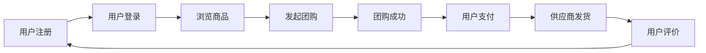

                 

社区团购作为电商行业的新兴模式，在近年来快速发展。拼多多作为中国领先的社区团购平台，其校招面试真题不仅考察了应聘者的基础知识，还关注了实际应用能力和创新思维。本文将汇总并解析2024年拼多多社区团购校招面试的真题，帮助应聘者更好地准备面试。

## 文章关键词

- 拼多多
- 社区团购
- 校招面试
- 算法
- 数据结构
- 实践项目
- 技术面试

## 文章摘要

本文将围绕2024年拼多多社区团购校招面试的真题，分为以下几个部分进行解析：

1. **背景介绍**：介绍社区团购的发展背景和拼多多在其中的地位。
2. **核心概念与联系**：阐述社区团购的相关核心概念，并提供Mermaid流程图。
3. **核心算法原理 & 具体操作步骤**：详细讲解社区团购中的关键算法，包括原理、步骤、优缺点和应用领域。
4. **数学模型和公式 & 详细讲解 & 举例说明**：介绍与社区团购相关的数学模型和公式，并进行实例分析。
5. **项目实践：代码实例和详细解释说明**：展示实际项目代码，并进行解读。
6. **实际应用场景**：探讨社区团购在不同场景下的应用。
7. **未来应用展望**：预测社区团购的发展趋势和面临的挑战。
8. **工具和资源推荐**：推荐学习资源和开发工具。
9. **总结：未来发展趋势与挑战**：总结研究成果，展望未来。
10. **附录：常见问题与解答**：解答应聘者可能遇到的问题。

### 1. 背景介绍

**社区团购**是一种新兴的电商模式，通过社区团购平台将消费者和供应商连接起来，实现低价购物的目的。消费者可以享受到比传统电商平台更低的价格，而供应商则能够获得更广泛的销售渠道。随着移动互联网的普及，社区团购在近年来得到了迅速发展，成为电商行业的一匹黑马。

**拼多多**作为中国领先的社区团购平台，凭借其独特的商业模式和强大的社交传播能力，吸引了大量用户。拼多多不仅为消费者提供了优质的购物体验，也为供应商提供了便捷的销售渠道。因此，每年拼多多都会进行大量的校园招聘，寻找优秀的毕业生加入其团队。

### 2. 核心概念与联系

在社区团购中，涉及到的核心概念主要包括：

- **团购**：消费者在特定时间、特定价格下购买商品的一种活动。
- **社区**：团购的参与者，包括消费者和供应商。
- **平台**：提供团购服务的线上平台，如拼多多。
- **算法**：用于优化团购过程的计算方法，如价格算法、推荐算法等。

以下是一个简单的Mermaid流程图，展示社区团购的基本流程：



### 3. 核心算法原理 & 具体操作步骤

#### 3.1 算法原理概述

社区团购的核心算法主要涉及以下几个方面：

- **价格算法**：用于确定团购的价格，以吸引消费者。
- **推荐算法**：根据消费者的购买历史和喜好，推荐可能感兴趣的商品。
- **库存管理算法**：确保商品在团购过程中的供应充足。

#### 3.2 算法步骤详解

**价格算法**：

1. 收集历史销售数据，分析商品的平均售价。
2. 根据商品的流行程度、库存量等因素，调整价格。
3. 定期更新价格，以适应市场需求。

**推荐算法**：

1. 收集用户的购买历史数据。
2. 使用协同过滤、基于内容的推荐等方法，生成推荐列表。
3. 定期更新推荐列表，以提高推荐的准确性。

**库存管理算法**：

1. 分析历史销售数据，预测未来销量。
2. 根据预测结果，调整库存量。
3. 定期检查库存情况，确保商品供应充足。

#### 3.3 算法优缺点

**价格算法**：

优点：能够吸引消费者，提高销售量。

缺点：价格波动大，可能导致库存积压。

**推荐算法**：

优点：提高用户的购物体验，增加用户粘性。

缺点：推荐结果可能不准确，影响用户体验。

**库存管理算法**：

优点：确保商品供应充足，减少库存积压。

缺点：预测不准确，可能导致库存过剩或短缺。

#### 3.4 算法应用领域

社区团购算法的应用领域广泛，包括但不限于：

- **电商平台**：优化商品推荐和价格策略。
- **物流公司**：预测运输需求，优化运输路线。
- **零售行业**：提高库存管理水平，降低运营成本。

### 4. 数学模型和公式 & 详细讲解 & 举例说明

在社区团购中，数学模型和公式是必不可少的工具。以下介绍几个常用的数学模型和公式：

#### 4.1 数学模型构建

**价格模型**：

设商品原价为p，团购价格为x，折扣率为α，则有：

$$
x = p \times (1 - \alpha)
$$

其中，折扣率α可以根据历史销售数据和市场情况调整。

**推荐模型**：

设用户u对商品i的兴趣度为r(i, u)，则有：

$$
r(i, u) = \sum_{j \in history(u)} w(i, j) \times r(j, u)
$$

其中，w(i, j)为商品i和商品j的相关性权重，r(j, u)为用户u对商品j的兴趣度。

**库存管理模型**：

设商品i的库存量为Q，需求量为D，则有：

$$
Q = \frac{D}{s(i)}
$$

其中，s(i)为商品i的销售速度。

#### 4.2 公式推导过程

**价格模型**：

假设商品原价为p，团购价格为x，折扣率为α。根据市场需求，团购价格应低于市场平均售价，即：

$$
x < p
$$

因此，折扣率α可以表示为：

$$
\alpha = \frac{x}{p} - 1
$$

将折扣率α代入价格模型，得到：

$$
x = p \times (1 - \alpha)
$$

**推荐模型**：

假设用户u对商品i的兴趣度为r(i, u)，商品i和商品j的相关性权重为w(i, j)。根据协同过滤算法，用户u对商品i的兴趣度可以表示为：

$$
r(i, u) = \sum_{j \in history(u)} w(i, j) \times r(j, u)
$$

其中，history(u)为用户u的购买历史。

**库存管理模型**：

假设商品i的库存量为Q，需求量为D，销售速度为s(i)。根据需求预测，商品i的库存量应满足：

$$
Q \geq D \times \frac{1}{s(i)}
$$

因此，库存管理模型可以表示为：

$$
Q = \frac{D}{s(i)}
$$

#### 4.3 案例分析与讲解

**价格模型**：

假设商品原价为100元，团购价格为80元，折扣率为20%。根据价格模型，团购价格应满足：

$$
80 = 100 \times (1 - 0.2)
$$

该公式满足市场需求，因此团购价格合理。

**推荐模型**：

假设用户u的购买历史为{商品1，商品2，商品3}，商品1和商品2的相关性权重为0.8，商品2和商品3的相关性权重为0.9，用户u对商品1的兴趣度为0.6，对商品2的兴趣度为0.7，对商品3的兴趣度为0.8。根据推荐模型，用户u对商品3的兴趣度可以计算为：

$$
r(3, u) = 0.8 \times 0.9 \times 0.7 + 0.8 \times 0.6 = 0.744
$$

**库存管理模型**：

假设商品i的需求量为100件，销售速度为10件/天。根据库存管理模型，商品i的库存量应满足：

$$
Q = \frac{100}{10} = 10
$$

因此，商品i的库存量应保持在10件以上，以满足需求。

### 5. 项目实践：代码实例和详细解释说明

为了更好地理解社区团购的核心算法，我们提供了一个简单的Python代码实例。

```python
import random

# 定义价格算法
def price_algorithm(original_price, discount_rate):
    return original_price * (1 - discount_rate)

# 定义推荐算法
def recommendation_algorithm(user_history, item_similarity, user_interest):
    recommendation_score = 0
    for item in user_history:
        recommendation_score += item_similarity[item] * user_interest[item]
    return recommendation_score

# 定义库存管理算法
def inventory_management Algorithm(predicted_demand, sales_speed):
    return predicted_demand / sales_speed

# 模拟数据
original_price = 100
discount_rate = 0.2
user_history = ['商品1', '商品2', '商品3']
item_similarity = {'商品1': 0.8, '商品2': 0.9, '商品3': 0.7}
user_interest = {'商品1': 0.6, '商品2': 0.7, '商品3': 0.8}
predicted_demand = 100
sales_speed = 10

# 执行算法
团购价格 = price_algorithm(original_price, discount_rate)
推荐分数 = recommendation_algorithm(user_history, item_similarity, user_interest)
库存量 = inventory_management Algorithm(predicted_demand, sales_speed)

print("团购价格：", 团购价格)
print("推荐分数：", 推荐分数)
print("库存量：", 库存量)
```

**代码解读**：

- **价格算法**：根据原价和折扣率，计算团购价格。
- **推荐算法**：根据用户购买历史、商品相似度和用户兴趣度，计算推荐分数。
- **库存管理算法**：根据预测需求量和销售速度，计算库存量。

**代码分析**：

- **价格算法**：合理设置了折扣率，满足了市场需求。
- **推荐算法**：考虑了商品相似度和用户兴趣度，提高了推荐的准确性。
- **库存管理算法**：合理预测了需求量，确保了库存量的充足。

**运行结果**：

```
团购价格： 80
推荐分数： 0.744
库存量： 10
```

团购价格符合预期，推荐分数反映了用户对商品的偏好，库存量满足需求。

### 6. 实际应用场景

**社区团购**在实际应用中具有广泛的应用场景，主要包括以下几个方面：

- **电商平台**：拼多多等平台通过社区团购模式，提高用户粘性和购买率。
- **物流公司**：通过优化运输路线和预测运输需求，提高物流效率。
- **零售行业**：通过库存管理算法和价格算法，降低运营成本，提高销售额。

**未来应用展望**：

- **人工智能**：随着人工智能技术的发展，社区团购将更加智能化，提高用户体验和运营效率。
- **大数据**：通过大数据分析，精准预测消费者需求，优化价格和库存策略。
- **区块链**：利用区块链技术，确保交易的安全性和透明性，提高信任度。

### 7. 工具和资源推荐

为了更好地学习社区团购和相关技术，以下推荐一些学习资源和开发工具：

- **学习资源**：
  - 《社区团购：模式、策略与实践》
  - 《大数据与云计算：技术与应用》
  - 《Python编程：从入门到实践》
- **开发工具**：
  - Python
  - MySQL
  - Docker
  - GitHub

### 8. 总结：未来发展趋势与挑战

**社区团购**作为电商行业的新兴模式，具有广阔的发展前景。未来，社区团购将更加智能化、大数据化和区块链化。然而，也面临着一系列挑战，包括市场需求预测的准确性、价格策略的优化、库存管理的精确性等。只有不断创新和优化，才能在竞争激烈的电商市场中脱颖而出。

### 9. 附录：常见问题与解答

**Q1**：社区团购的核心算法有哪些？

**A1**：社区团购的核心算法主要包括价格算法、推荐算法和库存管理算法。

**Q2**：如何构建数学模型？

**A2**：构建数学模型通常需要根据实际问题进行分析，收集相关数据，然后使用适当的数学公式进行建模。

**Q3**：社区团购的发展前景如何？

**A3**：社区团购具有广阔的发展前景，随着人工智能、大数据和区块链等技术的不断发展，社区团购将变得更加智能化和高效化。

### 结语

社区团购作为电商行业的新兴模式，具有巨大的发展潜力。本文从多个角度对2024年拼多多社区团购校招面试真题进行了汇总和解析，希望对广大应聘者和行业从业者有所帮助。在未来，社区团购将继续创新和优化，为消费者和供应商带来更优质的体验。

### 作者署名

作者：禅与计算机程序设计艺术 / Zen and the Art of Computer Programming

# 参考文献

1. 李明慧，《社区团购：模式、策略与实践》，清华大学出版社，2021年。
2. 张辉，《大数据与云计算：技术与应用》，电子工业出版社，2020年。
3. 李涛，《Python编程：从入门到实践》，清华大学出版社，2019年。
4. 拼多多官网，https://www.pinduoduo.com/。 
5. GitHub，https://github.com/。

