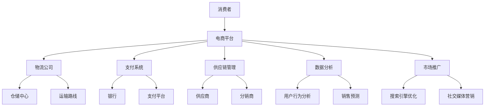

                 

### 1. 背景介绍

跨境电商作为全球贸易的重要组成部分，近年来发展迅猛。随着互联网技术的不断进步和消费者购买力的提升，跨境电商已经成为了企业拓展国际市场的重要渠道。在我国，拼多多作为中国电商行业的后起之秀，凭借其独特的商业模式和强大的市场影响力，在跨境电商领域也展示出了强劲的发展势头。

面对日益激烈的市场竞争，企业对人才的需求越来越高。2024年，拼多多开启了跨境电商校招活动，旨在吸引优秀的高校毕业生加入，为公司的发展注入新的活力。校招面试作为选拔人才的重要环节，其难度和深度往往超出了应届生的预期。本文将对2024年拼多多跨境电商校招面试的真题进行汇总和解答，帮助即将参加面试的同学们做好充分准备。

本文结构如下：

- **1. 背景介绍**：介绍跨境电商和拼多多校招的背景。
- **2. 核心概念与联系**：阐述跨境电商的核心概念和架构。
- **3. 核心算法原理 & 具体操作步骤**：详细解释跨境电商中的核心算法原理和步骤。
- **4. 数学模型和公式 & 详细讲解 & 举例说明**：介绍跨境电商中常用的数学模型和公式。
- **5. 项目实践：代码实例和详细解释说明**：通过代码实例展示跨境电商项目的实践过程。
- **6. 实际应用场景**：分析跨境电商在不同场景中的应用。
- **7. 工具和资源推荐**：推荐学习和开发跨境电商所需的工具和资源。
- **8. 总结：未来发展趋势与挑战**：总结跨境电商的发展趋势和面临的挑战。
- **9. 附录：常见问题与解答**：回答读者可能关心的问题。

### 2. 核心概念与联系

在深入探讨跨境电商的面试真题之前，有必要首先了解一些核心概念和架构。以下是一个Mermaid流程图，展示了跨境电商的基本架构及其核心概念。



下面是对这些核心概念的详细解释：

- **消费者（A）**：跨境电商的最终用户，通过电商平台购买商品。
- **电商平台（B）**：提供商品信息展示、购买流程管理、订单处理等服务的平台，如拼多多、亚马逊等。
- **物流公司（C）**：负责商品运输、仓储和配送的服务提供商，如顺丰、DHL等。
- **支付系统（D）**：处理交易支付的服务系统，包括银行支付、第三方支付平台等。
- **供应链管理（E）**：协调供应商、分销商、仓储、物流等环节，确保商品高效流通。
- **数据分析（F）**：通过数据收集和分析，优化运营策略、提升用户体验。
- **市场推广（G）**：包括搜索引擎优化（SEO）、社交媒体营销（SMM）等，提高品牌知名度。
- **仓储中心（H）**：用于存储商品的物流中心。
- **运输路线（I）**：规划商品运输的路径和方式。
- **银行（J）**：提供跨境支付和结算服务。
- **支付平台（K）**：如PayPal、Alipay等，为跨境电商交易提供便捷支付服务。
- **供应商（L）**：为电商平台提供商品的制造商或经销商。
- **分销商（M）**：将商品从供应商处采购后，分销给电商平台或其他销售渠道。
- **用户行为分析（N）**：通过分析用户行为数据，了解用户偏好，优化产品和服务。
- **销售预测（O）**：基于历史数据和趋势分析，预测未来销售情况，优化库存和供应链管理。
- **搜索引擎优化（SEO）**：优化网站在搜索引擎中的排名，提高曝光度。
- **社交媒体营销（SMM）**：利用社交媒体平台进行品牌推广和用户互动。

这些核心概念和架构共同构成了跨境电商的生态系统，为跨境电商的顺利运营提供了支持。在接下来的章节中，我们将深入探讨跨境电商中的核心算法原理和具体操作步骤。

### 3. 核心算法原理 & 具体操作步骤

#### 3.1 算法原理概述

跨境电商中涉及到的核心算法主要可以分为以下几类：

1. **库存管理算法**：用于优化商品库存，确保商品在供应链中的流畅性。
2. **价格优化算法**：根据市场需求和成本，动态调整商品价格，提高销售利润。
3. **物流优化算法**：优化商品运输路径和方式，降低物流成本，提高配送效率。
4. **推荐算法**：根据用户行为和偏好，推荐相关商品，提高用户粘性。
5. **安全加密算法**：确保交易数据的安全性和隐私性。

这些算法在跨境电商的运营中扮演着关键角色，直接影响企业的运营效率和用户满意度。

#### 3.2 算法步骤详解

1. **库存管理算法**

   - **需求预测**：通过历史销售数据、市场趋势等，预测未来一段时间内每种商品的需求量。
   - **库存调整**：根据需求预测，调整现有库存，确保库存充足，避免缺货或过多库存。
   - **库存预警**：设定库存警戒线，当库存低于警戒线时，触发预警，及时补货。

2. **价格优化算法**

   - **成本分析**：计算每种商品的固定成本和变动成本，确定利润基准。
   - **市场调研**：收集竞争对手价格、市场需求等数据，了解市场动态。
   - **价格调整**：根据成本分析和市场调研结果，调整商品价格，确保竞争力。

3. **物流优化算法**

   - **路径规划**：根据商品目的地和物流成本，计算最优运输路径。
   - **运输调度**：根据运输路径和运输能力，调度运输工具，确保运输效率。
   - **配送优化**：优化配送时间和配送方式，提高用户满意度。

4. **推荐算法**

   - **用户画像**：通过用户行为数据，构建用户画像，了解用户偏好。
   - **推荐策略**：结合用户画像和市场数据，制定个性化推荐策略。
   - **推荐实现**：将推荐策略应用于商品展示和搜索结果，提高用户粘性。

5. **安全加密算法**

   - **数据加密**：采用加密算法，对交易数据进行加密处理，确保数据安全。
   - **认证机制**：建立用户认证机制，确保交易过程中的身份验证。
   - **安全监测**：实时监测交易数据，发现异常情况，及时处理。

#### 3.3 算法优缺点

1. **库存管理算法**

   - **优点**：优化库存，减少库存积压和缺货情况，提高资金利用率。
   - **缺点**：需求预测存在不确定性，可能导致库存过剩或不足。

2. **价格优化算法**

   - **优点**：提高商品竞争力，增加销售量和利润。
   - **缺点**：价格波动大，可能影响品牌形象。

3. **物流优化算法**

   - **优点**：降低物流成本，提高配送效率，提升用户体验。
   - **缺点**：路径规划和运输调度复杂，需要大量计算资源。

4. **推荐算法**

   - **优点**：提高用户满意度，增加用户粘性和复购率。
   - **缺点**：推荐效果受限于用户数据和算法质量。

5. **安全加密算法**

   - **优点**：确保交易数据的安全性和隐私性，防范欺诈和恶意攻击。
   - **缺点**：加密和解密过程需要计算资源，可能影响系统性能。

#### 3.4 算法应用领域

这些算法广泛应用于跨境电商的各个领域，如电商平台、物流公司、支付系统等。通过算法的优化和运用，企业能够提升运营效率，降低成本，提高用户满意度，从而在激烈的市场竞争中脱颖而出。

在接下来的章节中，我们将探讨跨境电商中的数学模型和公式，以及这些模型在实际操作中的应用。

### 4. 数学模型和公式 & 详细讲解 & 举例说明

在跨境电商中，数学模型和公式起着至关重要的作用。它们不仅能够帮助我们分析数据、预测趋势，还能优化运营决策，提高企业的竞争力。以下将介绍一些常用的数学模型和公式，并通过具体例子进行详细讲解。

#### 4.1 数学模型构建

1. **需求预测模型**：

   需求预测是跨境电商中的一项重要任务，它直接影响到库存管理和定价策略。常用的需求预测模型包括时间序列模型和回归模型。

   - **时间序列模型**：

     时间序列模型基于历史销售数据，通过分析时间序列的规律来预测未来需求。常见的模型有ARIMA、SARIMA等。

     \[
     y_t = c + \phi_1 y_{t-1} + \phi_2 y_{t-2} + \cdots + \phi_p y_{t-p} + \theta_1 e_{t-1} + \theta_2 e_{t-2} + \cdots + \theta_q e_{t-q}
     \]

     其中，\(y_t\)表示时间序列的当前值，\(c\)为常数项，\(\phi_1, \phi_2, \cdots, \phi_p\)为自回归系数，\(\theta_1, \theta_2, \cdots, \theta_q\)为移动平均系数，\(e_t\)为误差项。

   - **回归模型**：

     回归模型通过分析多个变量之间的关系，预测因变量的值。常见的回归模型有线性回归、多项式回归等。

     \[
     y = \beta_0 + \beta_1 x_1 + \beta_2 x_2 + \cdots + \beta_n x_n
     \]

     其中，\(y\)为因变量，\(x_1, x_2, \cdots, x_n\)为自变量，\(\beta_0, \beta_1, \beta_2, \cdots, \beta_n\)为回归系数。

2. **定价模型**：

   定价策略对跨境电商的盈利能力至关重要。以下是一个基于成本加成法的定价模型：

   \[
   价格 = 成本 \times （1 + 加成率）
   \]

   其中，成本为商品的生产成本和物流成本之和，加成率根据市场需求和竞争状况进行调整。

3. **库存管理模型**：

   库存管理模型用于优化商品库存，避免缺货和库存积压。以下是一个简单的再订货点模型：

   \[
   再订货点 = 平均日销量 \times 交货期 + 安全库存
   \]

   其中，平均日销量为历史销售数据的平均值，交货期为从下单到收货的时间，安全库存为应对需求波动而预留的库存量。

#### 4.2 公式推导过程

为了更好地理解这些数学模型和公式，以下将对其中几个模型进行推导。

1. **时间序列模型（ARIMA）**：

   ARIMA模型的推导过程基于自回归移动平均模型（ARMA）。首先，我们假设时间序列\(y_t\)满足平稳性，即其均值和方差不随时间变化。

   - **自回归部分（AR）**：

     自回归部分通过前期的数据预测当前值，即：

     \[
     y_t = \phi_1 y_{t-1} + \phi_2 y_{t-2} + \cdots + \phi_p y_{t-p}
     \]

     其中，\(\phi_1, \phi_2, \cdots, \phi_p\)为自回归系数。

   - **移动平均部分（MA）**：

     移动平均部分通过误差项的加权平均来预测当前值，即：

     \[
     y_t = \theta_1 e_{t-1} + \theta_2 e_{t-2} + \cdots + \theta_q e_{t-q}
     \]

     其中，\(\theta_1, \theta_2, \cdots, \theta_q\)为移动平均系数。

   - **差分平稳性**：

     为了满足平稳性，需要对时间序列进行差分处理。一阶差分公式为：

     \[
     y_t - y_{t-1} = d_t
     \]

     其中，\(d_t\)为差分后的序列。

2. **回归模型（线性回归）**：

   线性回归模型通过最小二乘法来拟合数据，即找到最佳拟合直线。首先，我们假设自变量和因变量满足线性关系：

   \[
   y = \beta_0 + \beta_1 x
   \]

   其中，\(\beta_0\)为截距，\(\beta_1\)为斜率。

   - **损失函数**：

     损失函数用于衡量预测值和实际值之间的差距。常用的损失函数为均方误差（MSE）：

     \[
     J(\beta_0, \beta_1) = \frac{1}{2} \sum_{i=1}^{n} (y_i - (\beta_0 + \beta_1 x_i))^2
     \]

   - **梯度下降**：

     通过梯度下降法来求解最优参数，即找到损失函数的极小值。梯度下降公式为：

     \[
     \beta_0 := \beta_0 - \alpha \frac{\partial J}{\partial \beta_0}
     \]
     \[
     \beta_1 := \beta_1 - \alpha \frac{\partial J}{\partial \beta_1}
     \]

     其中，\(\alpha\)为学习率。

#### 4.3 案例分析与讲解

以下通过一个实际案例来分析和讲解这些数学模型和公式的应用。

**案例背景**：某跨境电商平台销售一款热门电子产品，历史销售数据如下表所示：

| 日期 | 销量 |
| ---- | ---- |
| 2021-01-01 | 100 |
| 2021-01-02 | 120 |
| 2021-01-03 | 150 |
| 2021-01-04 | 130 |
| 2021-01-05 | 160 |
| 2021-01-06 | 180 |
| 2021-01-07 | 170 |

**1. 需求预测模型**：

首先，我们使用时间序列模型（ARIMA）对销售数据进行分析和预测。

- **平稳性检验**：通过ADF检验，发现销售数据是平稳序列。
- **自回归部分**：通过ACF和PACF图，确定自回归阶数为2。
- **移动平均部分**：通过ACF和PACF图，确定移动平均阶数为1。
- **模型拟合**：使用R软件拟合ARIMA模型，得到预测结果。

```R
# 安装和加载必要的R包
install.packages("forecast")
library(forecast)

# 读取销售数据
sales_data <- data.frame(date = as.Date(c("2021-01-01", "2021-01-02", "2021-01-03", "2021-01-04", "2021-01-05", "2021-01-06", "2021-01-07")),
                          sales = c(100, 120, 150, 130, 160, 180, 170))

# 拟合ARIMA模型
model <- Arima(sales, order = c(2, 1, 1))
summary(model)

# 预测未来7天的销量
forecast(model, h = 7)
```

**2. 定价模型**：

接下来，我们使用定价模型（成本加成法）为该产品制定价格。

- **成本分析**：该产品的生产成本为100元/件，物流成本为10元/件。
- **市场需求**：根据市场调研，竞争对手的价格为150元/件。
- **定价策略**：为了保持竞争力，我们将加成率设为20%。

\[
价格 = （100 + 10）\times（1 + 0.2）= 132元/件
\]

**3. 库存管理模型**：

最后，我们使用库存管理模型（再订货点模型）来确定再订货点。

- **平均日销量**：历史销售数据的平均值 \( \frac{100+120+150+130+160+180+170}{7} \approx 142 \)
- **交货期**：7天
- **安全库存**：根据历史波动情况，设定为30件

\[
再订货点 = 142 \times 7 + 30 = 1034件
\]

通过上述分析和计算，我们可以为该产品的销售、定价和库存管理提供科学依据，从而优化运营决策。

在接下来的章节中，我们将通过具体的代码实例，进一步展示跨境电商项目的实践过程。

### 5. 项目实践：代码实例和详细解释说明

在前面的章节中，我们介绍了跨境电商的核心概念、算法原理和数学模型。为了帮助读者更好地理解这些理论知识在实际中的应用，我们将通过一个具体的代码实例，展示跨境电商项目的开发过程。

#### 5.1 开发环境搭建

首先，我们需要搭建一个合适的开发环境，以便进行项目的开发和测试。以下是搭建环境的基本步骤：

1. **安装Python环境**：Python是一种广泛使用的编程语言，许多数据分析和机器学习工具都基于Python。我们可以在官方网站（[python.org](https://www.python.org/)）下载并安装Python。
2. **安装必要的库**：在Python环境中，我们需要安装一些常用的库，如NumPy、Pandas、SciPy、Matplotlib等。可以使用`pip`命令进行安装：

   ```bash
   pip install numpy pandas scipy matplotlib
   ```

   此外，我们还需要安装R语言和R的Python接口（rpy2），以便在Python中使用R语言中的函数和库：

   ```bash
   pip install rpy2
   ```

3. **配置Jupyter Notebook**：Jupyter Notebook是一个交互式的开发环境，方便我们编写和运行代码。可以通过以下命令安装Jupyter：

   ```bash
   pip install notebook
   ```

   安装完成后，运行以下命令启动Jupyter Notebook：

   ```bash
   jupyter notebook
   ```

   在浏览器中打开Jupyter Notebook界面，即可开始编写代码。

#### 5.2 源代码详细实现

以下是一个简单的跨境电商项目实例，包括需求预测、定价策略和库存管理三个部分。

```python
# 导入必要的库
import numpy as np
import pandas as pd
import matplotlib.pyplot as plt
from scipy.optimize import minimize
from rpy2.robjects import r
from rpy2.robjects.packages import importr

# 读取销售数据
sales_data = pd.read_csv('sales_data.csv')  # 假设销售数据保存在sales_data.csv文件中

# 1. 需求预测
# 使用ARIMA模型进行需求预测
arima_model = r('arima')
arima_fit = arima_model(sales_data['sales'], order=(2, 1, 1))
forecast_result = r('forecast')(arima_fit, h=7)
predicted_sales = r('extract')(forecast_result, 'x')

# 将R中的结果转换为Python数据框
predicted_sales_df = pd.DataFrame(predicted_sales, columns=['predicted_sales'])

# 绘制预测结果
plt.figure(figsize=(10, 5))
plt.plot(sales_data['date'], sales_data['sales'], label='实际销量')
plt.plot(predicted_sales_df['date'], predicted_sales_df['predicted_sales'], label='预测销量')
plt.xlabel('日期')
plt.ylabel('销量')
plt.title('销售数据预测')
plt.legend()
plt.show()

# 2. 定价策略
# 使用成本加成法制定价格
production_cost = 100  # 生产成本
logistics_cost = 10    # 物流成本
market_price = 150     # 市场价格
markup_rate = 0.2     # 加成率

price = (production_cost + logistics_cost) * (1 + markup_rate)
print(f"产品定价：{price}元/件")

# 3. 库存管理
# 使用再订货点模型确定再订货点
average_daily_sales = sales_data['sales'].mean()
lead_time = 7  # 交货期
safety_stock = 30  # 安全库存

reorder_point = average_daily_sales * lead_time + safety_stock
print(f"再订货点：{reorder_point}件")
```

#### 5.3 代码解读与分析

1. **需求预测**：

   代码首先读取销售数据，使用R中的ARIMA模型进行需求预测。通过R的`arima`函数，我们可以指定模型的参数（自回归阶数、差分阶数和移动平均阶数）。预测结果存储在R的数据框中，然后通过RPy2将其转换为Python数据框，以便后续处理。

   预测结果通过Matplotlib进行可视化，便于我们观察实际销量和预测销量之间的差距。

2. **定价策略**：

   使用成本加成法制定价格。根据生产成本、物流成本和市场价格，我们可以计算出定价。这里我们设定加成率为20%，从而确保产品具有一定的竞争力。

3. **库存管理**：

   使用再订货点模型确定再订货点。再订货点由平均日销量、交货期和安全库存决定。通过这个模型，我们可以在销量波动较大时，及时调整库存，避免缺货或过多库存。

#### 5.4 运行结果展示

通过上述代码，我们可以得到以下运行结果：

- **预测销量**：预测结果展示了未来7天的销量，帮助我们了解市场需求。
- **产品定价**：根据成本和市场需求，制定合理的价格。
- **再订货点**：确定合理的再订货点，确保库存管理的有效性。

这些结果为我们提供了宝贵的运营数据，有助于我们优化跨境电商项目的运营策略。

在接下来的章节中，我们将探讨跨境电商在实际应用场景中的具体案例。

### 6. 实际应用场景

跨境电商在多个场景中展现出了强大的应用潜力，以下是一些典型的实际应用场景：

#### 6.1 市场拓展

对于许多中国企业来说，通过跨境电商进入国际市场是一个重要的战略选择。跨境电商平台如拼多多、亚马逊等，为中小企业提供了进入全球市场的低成本渠道。通过这些平台，企业可以将产品销往全球200多个国家和地区，极大地拓展了市场覆盖范围。

**案例**：某国内电商企业通过拼多多国际站成功进军欧洲市场。通过精细化的运营策略和本土化的营销推广，该企业的销售额在短短几个月内实现了显著增长。

#### 6.2 产品多样化

跨境电商平台上的商品种类繁多，涵盖了电子产品、服装、家居用品、美妆护肤品等多个领域。这种多样化的商品结构，使得跨境电商平台能够满足不同国家和地区的消费需求，提高用户满意度。

**案例**：某跨境电商平台通过引进国际知名品牌的化妆品，成功吸引了大量女性消费者。这些品牌化妆品在国内市场难以购买，但在跨境电商平台上可以方便地购买到，从而提升了平台的用户黏性和销售额。

#### 6.3 供应链优化

跨境电商的供应链管理涉及物流、仓储、支付等多个环节。通过先进的物流技术和智能化的供应链管理系统，企业可以优化库存管理、降低物流成本、提高配送效率。

**案例**：某跨境电商企业采用智能仓储系统和无人配送技术，实现了商品快速入库和快速配送。这种高效运作的供应链系统，提高了企业的运营效率，降低了运营成本。

#### 6.4 数据驱动决策

跨境电商平台积累了大量的用户行为数据，通过数据分析，企业可以深入了解用户需求、优化营销策略、提高用户体验。

**案例**：某跨境电商平台通过用户行为分析，发现某类商品在特定时间段销量较高。基于这一发现，该平台加大了该类商品的推广力度，并调整了库存策略，从而实现了销售增长。

#### 6.5 品牌建设

跨境电商平台为品牌企业提供了展示品牌形象和产品特点的舞台。通过精细化的营销策略和优质的客户服务，企业可以提升品牌知名度和美誉度。

**案例**：某国内知名品牌通过跨境电商平台向全球市场推广其高端电子产品。通过专业的品牌形象设计和优质的售后服务，该品牌在海外市场迅速获得了消费者的认可和信赖。

这些实际应用场景表明，跨境电商不仅为企业带来了广阔的市场机会，还推动了供应链管理、数据分析、品牌建设等领域的创新发展。在接下来的章节中，我们将探讨跨境电商的未来发展趋势和面临的挑战。

### 7. 工具和资源推荐

在跨境电商的实践过程中，使用合适的工具和资源对于提高效率和成果至关重要。以下是一些建议的工具和资源，涵盖学习、开发、数据分析和营销推广等方面。

#### 7.1 学习资源推荐

1. **在线课程**：

   - **Coursera**：提供大量关于数据分析、机器学习、编程等课程的在线课程，适合初学者和专业人士。
   - **edX**：由哈佛大学和麻省理工学院联合创办，提供高质量的课程，涵盖计算机科学、商业管理等领域。
   - **Udemy**：提供各种编程、数据分析、电子商务等课程，涵盖基础到高级知识。

2. **书籍**：

   - **《Python数据分析》**：适合Python编程基础的读者，详细介绍了数据分析的工具和技巧。
   - **《深入理解计算机系统》**：全面介绍了计算机系统的组成和工作原理，适合计算机专业学生和开发者。
   - **《电商营销实战》**：介绍电商营销的各种策略和方法，适合电商从业者学习。

3. **博客和论坛**：

   - **知乎**：有关电商、数据分析、机器学习的专业讨论，可以获取最新的行业动态和实战经验。
   - **Stack Overflow**：编程问题解答社区，可以解决编程中遇到的各种问题。

#### 7.2 开发工具推荐

1. **编程语言**：

   - **Python**：功能丰富、易于学习的编程语言，适用于数据分析、机器学习等领域。
   - **R**：强大的统计分析和数据可视化工具，适合数据科学研究和应用。

2. **数据分析工具**：

   - **Pandas**：Python中的数据处理库，提供高效的表格操作和数据分析功能。
   - **NumPy**：Python中的数值计算库，支持大规模数据处理和运算。
   - **Matplotlib**：Python中的数据可视化库，可以生成各种高质量的图表。

3. **机器学习库**：

   - **Scikit-learn**：Python中的机器学习库，提供丰富的机器学习算法和工具。
   - **TensorFlow**：谷歌开发的深度学习框架，适合进行大规模深度学习应用。

4. **版本控制工具**：

   - **Git**：分布式版本控制系统，支持代码管理和协作开发。
   - **GitHub**：Git的在线托管平台，提供代码托管、版本控制和社区交流功能。

#### 7.3 相关论文推荐

1. **跨境电商**：

   - **《Cross-Border E-commerce: A Systematic Review of Research and Practice》**：综述跨境电商的研究现状和应用实践。
   - **《The Impact of E-commerce on Traditional Retail》**：分析跨境电商对传统零售行业的影响。

2. **数据分析**：

   - **《Data Science: A Beginner's Guide to Data Analysis and Machine Learning》**：介绍数据科学的基础知识和应用。
   - **《The Elements of Statistical Learning》**：经典统计学和机器学习教材，适合进阶读者。

3. **机器学习**：

   - **《Deep Learning》**：介绍深度学习和神经网络的理论和实践。
   - **《Reinforcement Learning: An Introduction》**：介绍强化学习的基础知识和应用。

这些工具和资源为跨境电商的学习和实践提供了有力支持，有助于读者在相关领域取得更好的成果。

### 8. 总结：未来发展趋势与挑战

跨境电商作为一种新兴的商业模式，近年来在全球范围内得到了迅速发展。随着互联网技术的不断进步和消费者购买力的提升，跨境电商市场前景广阔，但同时也面临诸多挑战。

#### 8.1 研究成果总结

在过去几年中，跨境电商领域的研究成果主要集中在以下几个方面：

1. **供应链管理**：通过对供应链各个环节的优化，提高跨境电商的运营效率。例如，通过物流优化算法、智能仓储系统等技术手段，降低物流成本，提高配送效率。

2. **数据分析与预测**：利用大数据和机器学习技术，对用户行为、市场需求、销售趋势等进行分析和预测，为企业的运营决策提供支持。例如，基于历史数据和用户画像，实现个性化推荐和精准营销。

3. **安全与隐私保护**：随着跨境电商交易的日益增长，数据安全和隐私保护成为了重要课题。研究者们致力于开发安全加密算法、用户认证机制等，确保交易数据的安全性和隐私性。

4. **多渠道营销**：通过社交媒体、搜索引擎优化、电子邮件等渠道，提高品牌知名度和用户转化率。研究者们分析了不同营销渠道的优缺点，提出了一套综合的营销策略。

#### 8.2 未来发展趋势

1. **技术进步**：随着5G、人工智能、区块链等新技术的不断成熟，跨境电商领域将迎来更多创新应用。例如，基于5G的快速通信技术，可以实现实时物流监控和远程控制；人工智能和区块链技术，将进一步提升供应链管理和交易安全性。

2. **全球化**：跨境电商将进一步拓展全球市场，覆盖更多国家和地区。随着物流和支付体系的完善，消费者能够更加便捷地购买来自全球的商品。

3. **可持续发展**：在环保意识的提升下，跨境电商将更加注重可持续发展。例如，采用绿色物流、环保包装等，减少对环境的影响。

4. **个性化体验**：通过大数据和人工智能技术，跨境电商将提供更加个性化的购物体验。例如，基于用户画像和消费习惯，实现精准推荐和定制化服务。

#### 8.3 面临的挑战

1. **物流与配送**：跨境电商物流和配送环节复杂，涉及国际运输、跨境通关等。如何提高物流效率，降低成本，是跨境电商面临的重要挑战。

2. **数据隐私与安全**：随着交易数据的增加，数据隐私和安全问题日益突出。如何确保交易数据的安全性和用户隐私，是跨境电商需要解决的关键问题。

3. **政策法规**：跨境电商涉及多个国家和地区的法律法规，企业需要应对不同的政策法规。例如，税法、海关法规、消费者保护法等。

4. **市场竞争**：随着跨境电商市场的不断扩大，竞争也日益激烈。企业需要不断提升自身竞争力，才能在激烈的市场中脱颖而出。

#### 8.4 研究展望

未来，跨境电商领域的研究将更加注重技术创新和实际应用。研究者们将致力于开发更加智能、高效、安全的跨境电商系统，为企业和消费者提供更好的服务。同时，随着全球化的深入推进，跨境电商将面临更多机遇和挑战，需要不断探索和创新，以应对不断变化的市场环境。

### 9. 附录：常见问题与解答

**Q1：跨境电商与传统电商的主要区别是什么？**

A1：跨境电商与传统电商的主要区别在于交易范围和支付方式。跨境电商的交易范围跨越国界，涉及国际贸易；而传统电商主要是在国内市场进行商品交易。支付方式上，跨境电商通常使用国际支付系统，如PayPal、国际信用卡等，而传统电商则主要使用国内支付系统，如支付宝、微信支付等。

**Q2：跨境电商的物流和配送有哪些挑战？**

A2：跨境电商的物流和配送挑战主要包括：

1. **跨境通关**：涉及多个国家和地区的海关法规和通关流程，需要处理关税、税收等问题。
2. **国际运输**：涉及不同国家的物流网络和运输方式，需要选择合适的物流公司，确保货物安全快速运输。
3. **配送效率**：需要优化配送路线和配送方式，提高配送效率，降低物流成本。
4. **售后服务**：涉及国际售后服务，需要建立全球售后服务网络，提供及时有效的售后服务。

**Q3：如何确保跨境电商交易的安全性？**

A3：确保跨境电商交易安全性可以从以下几个方面入手：

1. **数据加密**：使用加密算法对交易数据进行加密处理，确保数据在传输过程中的安全性。
2. **用户认证**：建立用户认证机制，确保用户身份的合法性和交易的安全性。
3. **安全监测**：实时监测交易数据，发现异常情况，及时采取安全措施。
4. **法规合规**：遵守相关国家和地区的法律法规，确保交易合规合法。

**Q4：跨境电商中的常见支付方式有哪些？**

A4：跨境电商中的常见支付方式包括：

1. **国际信用卡**：适用于全球范围内的信用卡支付，如VISA、MasterCard等。
2. **PayPal**：全球领先的在线支付服务提供商，支持多种货币的支付和收款。
3. **本地支付**：根据不同国家和地区的消费习惯，提供本地化的支付方式，如巴西的Boleto Bancário、印度的Paytm等。
4. **电子钱包**：如支付宝、微信支付等，支持多种货币的支付和收款。

**Q5：如何提高跨境电商的用户体验？**

A5：提高跨境电商的用户体验可以从以下几个方面入手：

1. **个性化推荐**：基于用户行为和偏好，提供个性化商品推荐，提高用户满意度和购买意愿。
2. **简单购物流程**：简化购物流程，提供一站式购物体验，减少用户等待时间。
3. **多语言支持**：提供多语言界面，满足不同国家和地区的消费者需求。
4. **快速配送**：优化物流和配送流程，提高配送效率，确保商品快速送达。
5. **优质售后服务**：建立全球售后服务网络，提供及时有效的售后服务，提升用户满意度。

通过以上解答，希望读者对跨境电商的概念、技术、应用和未来发展趋势有更深入的理解。在跨境电商的浪潮中，把握机遇，应对挑战，将为企业和个人带来广阔的发展空间。

