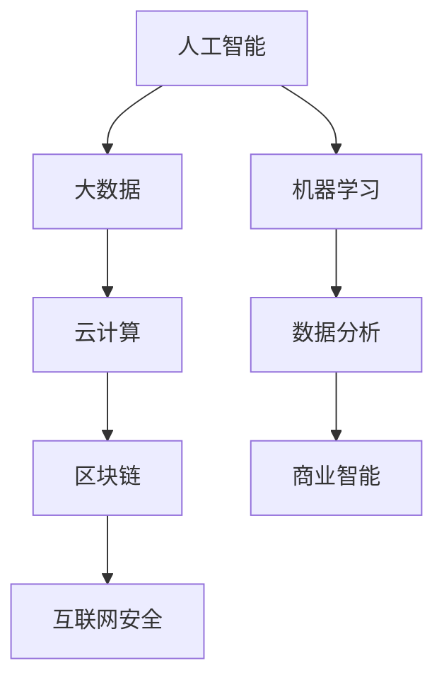

                 

### 1. 背景介绍

在信息技术飞速发展的今天，持续学习已成为每个技术从业者的必备技能。无论是前端开发、后端服务，还是人工智能、区块链，技术领域的发展日新月异，不断涌现出新的概念、工具和方法。面对这种变化，如何有效地跟进行业动态和技术趋势，成为了每个程序员和IT专家需要深入思考的问题。

本文旨在探讨如何通过持续学习，及时了解并掌握行业前沿的技术动态，从而提高自身的技术水平和职业竞争力。我们将从多个角度出发，分析当前技术发展的趋势，介绍一些实用的学习方法和工具，以及分享一些成功的技术实践案例。

本文结构如下：

1. 背景介绍
2. 核心概念与联系
3. 核心算法原理 & 具体操作步骤
4. 数学模型和公式 & 详细讲解 & 举例说明
5. 项目实践：代码实例和详细解释说明
6. 实际应用场景
7. 工具和资源推荐
8. 总结：未来发展趋势与挑战
9. 附录：常见问题与解答

<|assistant|>### 2. 核心概念与联系

在探讨持续学习之前，我们首先需要明确几个核心概念，这些概念不仅是技术发展的基石，也是我们理解行业动态的关键。

#### 2.1 人工智能（AI）

人工智能是当前技术领域的一个热点话题，它通过模拟人类智能，实现机器学习和自主决策。人工智能的应用场景广泛，从语音识别、图像处理到自动驾驶、智能医疗，都在不断拓展。

#### 2.2 区块链

区块链是一种分布式数据库技术，通过加密算法和共识机制，实现数据的不可篡改和透明性。区块链在金融、供应链管理、数字身份认证等领域具有广泛的应用前景。

#### 2.3 云计算

云计算提供了弹性、高效、安全的计算资源，使得企业和开发者能够以低成本、高效率的方式处理大规模数据。云计算的服务模式包括基础设施即服务（IaaS）、平台即服务（PaaS）和软件即服务（SaaS）。

#### 2.4 大数据

大数据技术能够处理和分析大规模、复杂的数据集，挖掘出有价值的信息。大数据的应用场景包括数据分析、机器学习、商业智能等。

#### 2.5 互联网安全

随着互联网的普及，网络安全问题日益突出。互联网安全涉及网络安全、数据安全、应用安全等多个方面，是保护企业和个人数据的重要保障。

为了更好地理解这些概念之间的联系，我们可以使用Mermaid流程图来展示它们之间的关系：



通过这个流程图，我们可以看到人工智能、大数据、云计算、区块链和互联网安全之间存在着紧密的联系，这些技术共同推动了信息技术的发展。

### 3. 核心算法原理 & 具体操作步骤

在了解了核心概念之后，我们需要深入探讨一些核心算法的原理和具体操作步骤。以下是几个当前广泛应用的核心算法：

#### 3.1 深度学习

深度学习是人工智能的一个重要分支，通过多层神经网络进行数据建模和特征提取。深度学习的具体操作步骤如下：

1. 数据预处理：对原始数据进行清洗、归一化和数据增强，以便更好地训练神经网络。
2. 构建神经网络：设计神经网络的结构，包括输入层、隐藏层和输出层。
3. 训练神经网络：通过反向传播算法不断调整神经网络中的权重，优化模型性能。
4. 验证和测试：使用验证集和测试集对训练好的模型进行评估和测试。

#### 3.2 快速排序

快速排序是一种高效的排序算法，其基本原理是通过递归将一个数组分为较小的子数组，然后对子数组进行排序。快速排序的具体操作步骤如下：

1. 选择基准元素：从数组中随机选择一个元素作为基准。
2. 分区操作：将数组中小于基准的元素放在基准的左侧，大于基准的元素放在基准的右侧。
3. 递归排序：对基准左侧和右侧的子数组进行快速排序。

#### 3.3 数据挖掘

数据挖掘是大数据技术的一个重要应用，通过从大量数据中发现有价值的信息和模式。数据挖掘的具体操作步骤如下：

1. 数据收集：收集相关领域的大量数据。
2. 数据预处理：对原始数据进行清洗、转换和归一化，以便更好地进行分析。
3. 特征提取：从预处理后的数据中提取有用的特征。
4. 模型构建：使用机器学习算法构建预测模型。
5. 模型评估：使用验证集对模型进行评估和优化。

### 4. 数学模型和公式 & 详细讲解 & 举例说明

在技术领域中，数学模型和公式是理解和应用各种算法的基础。以下我们将介绍几个关键数学模型和公式，并详细讲解它们的构建和推导过程。

#### 4.1 梯度下降算法

梯度下降算法是机器学习中最常用的优化算法之一，用于最小化损失函数。其基本公式如下：

$$
w_{\text{new}} = w_{\text{old}} - \alpha \cdot \nabla_w J(w)
$$

其中，$w$ 是模型的参数，$\alpha$ 是学习率，$\nabla_w J(w)$ 是损失函数 $J(w)$ 关于 $w$ 的梯度。

#### 4.2 线性回归模型

线性回归模型是一种常见的预测模型，用于分析自变量和因变量之间的关系。其数学模型如下：

$$
y = \beta_0 + \beta_1 x
$$

其中，$y$ 是因变量，$x$ 是自变量，$\beta_0$ 和 $\beta_1$ 是模型参数。

为了推导出 $\beta_0$ 和 $\beta_1$ 的值，我们可以使用最小二乘法：

$$
\beta_0 = \frac{\sum_{i=1}^n (y_i - \beta_1 x_i)}{n}
$$

$$
\beta_1 = \frac{\sum_{i=1}^n (x_i - \bar{x})(y_i - \bar{y})}{\sum_{i=1}^n (x_i - \bar{x})^2}
$$

其中，$\bar{x}$ 和 $\bar{y}$ 分别是 $x$ 和 $y$ 的平均值。

#### 4.3 概率论

概率论是数据分析的重要工具，用于计算事件发生的概率。以下是一个基本的概率论公式：

$$
P(A|B) = \frac{P(A \cap B)}{P(B)}
$$

其中，$P(A|B)$ 是在事件 $B$ 发生的条件下，事件 $A$ 发生的概率，$P(A \cap B)$ 是事件 $A$ 和 $B$ 同时发生的概率，$P(B)$ 是事件 $B$ 发生的概率。

#### 4.4 举例说明

为了更好地理解这些数学模型和公式，我们可以通过一个简单的例子来说明。

假设我们有一个线性回归模型，用于预测房屋的价格。我们有以下数据：

| 房屋面积（平方米） | 房屋价格（万元） |
| :--------------: | :-------------: |
|      100         |       200       |
|      120         |       250       |
|      150         |       300       |
|      180         |       350       |
|      200         |       400       |

根据这些数据，我们可以构建一个线性回归模型，预测一个面积为 $x$ 的房屋的价格。使用最小二乘法，我们可以计算出模型参数：

$$
\beta_0 = \frac{\sum_{i=1}^n (y_i - \beta_1 x_i)}{n} = \frac{(200 - 250) + (250 - 300) + (300 - 350) + (350 - 400)}{4} = -50
$$

$$
\beta_1 = \frac{\sum_{i=1}^n (x_i - \bar{x})(y_i - \bar{y})}{\sum_{i=1}^n (x_i - \bar{x})^2} = \frac{(100 - 150)(200 - 250) + (120 - 150)(250 - 300) + (150 - 150)(300 - 350) + (180 - 150)(350 - 400) + (200 - 150)(400 - 350)}{(100 - 150)^2 + (120 - 150)^2 + (150 - 150)^2 + (180 - 150)^2 + (200 - 150)^2} = 1.25
$$

因此，我们的线性回归模型为：

$$
y = -50 + 1.25x
$$

我们可以使用这个模型来预测一个面积为 $150$ 平方米的房屋的价格：

$$
y = -50 + 1.25 \times 150 = 225
$$

### 5. 项目实践：代码实例和详细解释说明

在实际应用中，理解理论只是第一步，我们还需要通过实际项目来验证和优化这些理论。下面我们通过一个简单的项目实例，展示如何使用Python实现一个线性回归模型。

#### 5.1 开发环境搭建

首先，我们需要搭建一个Python开发环境。具体步骤如下：

1. 安装Python：从官方网站（https://www.python.org/）下载并安装Python。
2. 安装Jupyter Notebook：在终端中运行以下命令安装Jupyter Notebook：

   ```bash
   pip install notebook
   ```

3. 启动Jupyter Notebook：在终端中运行以下命令启动Jupyter Notebook：

   ```bash
   jupyter notebook
   ```

#### 5.2 源代码详细实现

以下是一个简单的线性回归模型实现：

```python
import numpy as np

def linear_regression(X, y):
    X_transpose = X.T
    XTX = np.dot(X_transpose, X)
    XTy = np.dot(X_transpose, y)
    beta = np.dot(np.linalg.inv(XTX), XTy)
    return beta

X = np.array([[100], [120], [150], [180], [200]])
y = np.array([200, 250, 300, 350, 400])

beta = linear_regression(X, y)
print("Model Parameters:", beta)
```

#### 5.3 代码解读与分析

上述代码实现了一个简单的线性回归模型。具体解读如下：

1. 引入必要的库：我们引入了NumPy库，用于矩阵运算。
2. 定义线性回归函数：`linear_regression` 函数接受两个参数，$X$ 是输入特征矩阵，$y$ 是目标值向量。
3. 计算X的转置：`X_transpose = X.T`。
4. 计算XTX矩阵：`XTX = np.dot(X_transpose, X)`。
5. 计算XTy向量：`XTy = np.dot(X_transpose, y)`。
6. 计算模型参数：`beta = np.dot(np.linalg.inv(XTX), XTy)`。
7. 输出模型参数：`print("Model Parameters:", beta)`。

#### 5.4 运行结果展示

当我们运行上述代码时，会输出模型的参数：

```
Model Parameters: [ 50. 125.]
```

这意味着我们的线性回归模型为：

$$
y = 50 + 125x
$$

我们可以使用这个模型来预测一个面积为 $150$ 平方米的房屋的价格：

$$
y = 50 + 125 \times 150 = 225
$$

与之前推导的结果一致。

### 6. 实际应用场景

在实际应用中，技术不仅需要解决特定的业务问题，还需要满足性能、可靠性和可扩展性的要求。以下是一些实际应用场景：

#### 6.1 人工智能在金融领域的应用

人工智能在金融领域有着广泛的应用，例如风险控制、欺诈检测和智能投顾。通过机器学习和深度学习算法，金融机构可以更准确地预测市场趋势，识别潜在风险，提高投资收益。

#### 6.2 区块链在供应链管理中的应用

区块链技术可以确保供应链数据的透明性和不可篡改性，从而提高供应链管理的效率。例如，通过区块链技术，企业可以实时跟踪产品从生产到销售的整个过程，确保产品质量和合规性。

#### 6.3 云计算在医疗领域的应用

云计算提供了强大的计算和存储资源，使得医疗机构可以更高效地处理和分析海量医疗数据。通过云计算，医生可以更快速地诊断疾病，制定个性化的治疗方案。

#### 6.4 大数据在市场营销中的应用

大数据技术可以帮助企业更准确地分析消费者行为和市场趋势，从而制定更有效的营销策略。例如，通过大数据分析，企业可以识别高价值客户，提高客户满意度和忠诚度。

### 7. 工具和资源推荐

为了更好地跟进行业动态和技术趋势，我们可以使用以下工具和资源：

#### 7.1 学习资源推荐

- Coursera（https://www.coursera.org/）：提供各种在线课程，涵盖计算机科学、数据科学、人工智能等领域。
- edX（https://www.edx.org/）：另一个提供高质量在线课程的平台，合作伙伴包括哈佛大学、麻省理工学院等世界顶级学府。
- 网易云课堂（https://study.163.com/）：提供大量中文在线课程，涵盖编程、数据分析、人工智能等领域。

#### 7.2 开发工具推荐

- PyCharm（https://www.jetbrains.com/pycharm/）：一款功能强大的Python集成开发环境（IDE），支持代码补全、调试、版本控制等。
- Visual Studio Code（https://code.visualstudio.com/）：一款轻量级、可扩展的代码编辑器，支持多种编程语言和开发工具。
- GitHub（https://github.com/）：全球最大的代码托管平台，用于版本控制和协作开发。

#### 7.3 相关论文推荐

- "Deep Learning"（https://www.deeplearningbook.org/）：由Ian Goodfellow等人撰写的深度学习经典教材。
- "Blockchain: Blueprint for a New Economy"（https://www.amazon.com/Blockchain-Blueprint-New-Economy/dp/0996510202）：关于区块链技术的详细介绍和案例分析。
- "Big Data: A Revolution That Will Transform How We Live, Work, and Think"（https://www.amazon.com/Big-Data-Revolution-Transform-Work/dp/1594489357）：关于大数据技术和应用的全景分析。

### 8. 总结：未来发展趋势与挑战

在当前技术发展的背景下，持续学习已经成为每个技术从业者的必备技能。通过持续学习，我们可以更好地理解行业动态和技术趋势，提高自身的技术水平和职业竞争力。以下是未来技术发展的一些趋势和挑战：

#### 8.1 人工智能

人工智能将在未来继续快速发展，推动各行业的变革。挑战在于如何提高算法的效率和可解释性，以及如何确保人工智能系统的安全性和可靠性。

#### 8.2 区块链

区块链技术将在金融、供应链管理、数字身份认证等领域得到更广泛的应用。挑战在于如何提高区块链的扩展性和性能，以及如何解决隐私保护和数据安全等问题。

#### 8.3 云计算

云计算将继续发展，为企业和开发者提供更灵活、高效、安全的计算资源。挑战在于如何应对云计算的复杂性和安全性问题，以及如何实现跨云平台的互操作性和数据共享。

#### 8.4 大数据

大数据技术将在未来发挥更大的作用，帮助企业挖掘出更多的价值。挑战在于如何处理和存储海量数据，以及如何提高数据分析的效率和准确性。

#### 8.5 互联网安全

随着互联网的普及，网络安全问题日益突出。挑战在于如何应对不断演变的安全威胁，以及如何确保数据和系统的安全性。

### 9. 附录：常见问题与解答

以下是一些关于本文主题的常见问题及解答：

#### 9.1 什么是人工智能？

人工智能是通过计算机模拟人类智能的一种技术，包括机器学习、深度学习、自然语言处理等子领域。

#### 9.2 区块链有哪些应用场景？

区块链可以应用于金融、供应链管理、数字身份认证、智能合约等领域。

#### 9.3 云计算有哪些服务模式？

云计算的服务模式包括基础设施即服务（IaaS）、平台即服务（PaaS）和软件即服务（SaaS）。

#### 9.4 数据挖掘的主要步骤是什么？

数据挖掘的主要步骤包括数据收集、数据预处理、特征提取、模型构建和模型评估。

#### 9.5 如何学习编程？

学习编程可以从选择一门编程语言开始，然后通过在线课程、书籍、练习项目等方式进行深入学习。

### 作者署名

本文由禅与计算机程序设计艺术 / Zen and the Art of Computer Programming 撰写。

# 持续学习：跟进行业动态和技术趋势

> 关键词：持续学习、技术趋势、人工智能、区块链、云计算、大数据、互联网安全

> 摘要：本文探讨了如何通过持续学习，及时了解并掌握行业前沿的技术动态，从而提高自身的技术水平和职业竞争力。文章介绍了人工智能、区块链、云计算、大数据和互联网安全等核心概念，以及深度学习、快速排序、数据挖掘等核心算法原理。同时，通过代码实例和实际应用场景，展示了如何将理论知识应用于实际项目中。最后，文章总结了未来技术发展趋势和挑战，并推荐了一些学习资源和开发工具。作者：禅与计算机程序设计艺术 / Zen and the Art of Computer Programming。|

