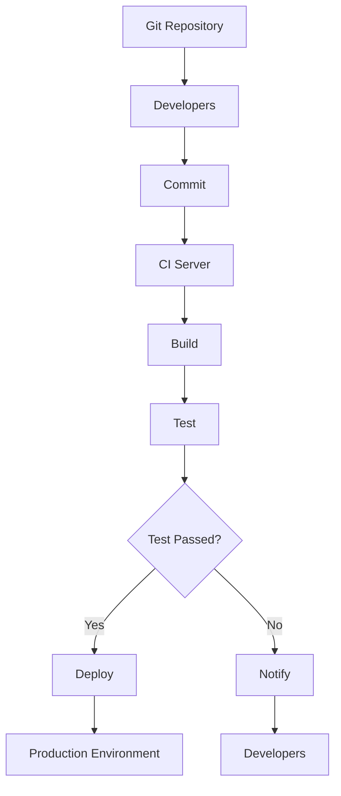

                 

### 摘要 Summary

本文将探讨持续集成（CI）与持续交付（CD）的最佳实践，旨在帮助开发者和团队理解这两个关键概念，掌握其实施策略，并利用这些技术提升软件交付的效率和质量。首先，我们将介绍CI和CD的定义、核心原理以及它们之间的联系。接下来，我们将详细探讨如何设计高效的CI/CD架构，包括所需的技术工具、流程设计和最佳实践经验。随后，文章将深入讨论核心算法原理，并提供具体操作步骤和数学模型。随后，我们将展示代码实例，详细解读其实现过程和结果。最后，我们将探讨CI/CD在实际应用中的各种场景，并展望其未来的发展趋势与挑战。

关键词：持续集成，持续交付，最佳实践，CI，CD，架构设计，算法原理，代码实例，应用场景，未来展望。

## 1. 背景介绍 Background

在当今快速发展的软件行业，持续集成（CI）和持续交付（CD）已经成为确保软件质量和交付速度的关键手段。随着云计算、敏捷开发和DevOps文化的普及，CI/CD被广泛认为是提高开发效率、减少软件缺陷和加快市场响应速度的必备技术。然而，尽管CI/CD的重要性日益凸显，其实施仍然面临许多挑战，包括架构设计、流程管理和工具选择等方面。

### 1.1 持续集成（CI）

持续集成是一种软件开发实践，旨在通过频繁地将代码合并到主干分支，确保软件的持续稳定性。其主要目标是减少集成过程中出现的问题，提高代码质量，并通过自动化的测试和反馈机制确保每次代码变更都能顺利集成。CI的核心原理包括代码仓库的自动化构建、测试和部署，从而实现“一键式”集成。

### 1.2 持续交付（CD）

持续交付是CI的扩展，旨在确保软件不仅在本地环境中可以运行，而且可以快速、可靠地部署到生产环境中。CD的核心目标是实现从代码库到生产环境的自动化流程，减少手动干预，确保软件交付的连续性和可靠性。CD的实践包括持续部署、蓝绿部署、金丝雀部署等策略，以实现软件的零停机更新。

### 1.3 CI与CD的关系

CI和CD是相辅相成的两个概念，CI确保代码的持续集成和测试，而CD则确保集成后的代码可以顺利部署到生产环境中。CI是CD的基础，而CD则是CI的目标。通过CI/CD的集成，开发者和团队可以实现自动化、高效的软件交付过程，从而提高整体开发效率。

## 2. 核心概念与联系 Core Concepts and Relationships

为了深入理解持续集成与持续交付，我们需要从核心概念和架构设计两个方面进行探讨。以下是CI/CD的核心概念及其相互关系，以及一个简化的Mermaid流程图，用于描述CI/CD的基本工作流程。

### 2.1 核心概念

- **代码仓库**：存储和管理代码的基础设施，如Git。
- **构建工具**：自动化构建和编译代码的工具，如Maven、Gradle。
- **测试框架**：用于自动化测试代码的工具，如JUnit、Selenium。
- **部署工具**：用于自动化部署代码的工具，如Jenkins、GitLab CI。
- **持续集成服务器**：负责触发构建、执行测试和部署任务的中心化或分布式服务器。
- **容器技术**：如Docker，用于创建轻量级、可移植的运行环境。

### 2.2 核心原理

- **自动化**：通过脚本和配置文件实现构建、测试和部署的自动化。
- **反馈循环**：及时反馈测试结果，确保代码质量和问题快速发现。
- **容器化**：利用容器技术确保环境一致性，减少“在我的机器上能运行”的问题。

### 2.3 Mermaid 流程图

下面是一个简化的CI/CD流程的Mermaid流程图：



### 2.4 架构设计

一个典型的CI/CD架构包括以下组件：

- **前端**：开发者负责编写和提交代码。
- **后端**：CI服务器负责构建、测试和部署代码。
- **测试环境**：用于运行自动化测试，确保代码质量。
- **生产环境**：最终部署和运行应用程序。

## 3. 核心算法原理 & 具体操作步骤 Core Algorithm Principles & Detailed Steps

### 3.1 算法原理概述

在CI/CD中，核心算法主要涉及自动化构建、测试和部署。这些算法的原理如下：

- **构建算法**：通过编译源代码和运行测试脚本，生成可执行的二进制文件或容器镜像。
- **测试算法**：运行自动化测试用例，确保新代码不会破坏现有功能。
- **部署算法**：根据部署策略，将构建后的代码部署到测试或生产环境中。

### 3.2 算法步骤详解

#### 3.2.1 构建步骤

1. **获取代码**：从代码仓库中获取最新的代码。
2. **编译代码**：使用构建工具编译源代码，生成可执行的二进制文件。
3. **打包资源**：将必要的资源和配置文件打包在一起。
4. **构建测试**：运行单元测试和集成测试，确保构建的代码没有编译错误。
5. **生成报告**：生成构建报告，包括编译时间、测试结果等信息。

#### 3.2.2 测试步骤

1. **安装依赖**：安装代码运行所需的库和工具。
2. **配置环境**：配置测试环境的变量和设置。
3. **运行测试**：运行自动化测试用例，包括单元测试、集成测试和性能测试。
4. **生成测试报告**：生成测试报告，包括测试结果和错误信息。

#### 3.2.3 部署步骤

1. **构建镜像**：将构建后的代码打包成Docker镜像。
2. **容器化**：将Docker镜像推送到容器镜像仓库。
3. **部署到测试环境**：根据部署策略，将镜像部署到测试环境中。
4. **验证部署**：运行自动化测试，确保部署的代码可以正常运行。
5. **部署到生产环境**：根据部署策略，将镜像部署到生产环境中。

### 3.3 算法优缺点

#### 优点

- **自动化**：通过自动化减少手动干预，提高开发效率。
- **快速反馈**：通过快速反馈，确保问题及早发现和解决。
- **环境一致性**：通过容器化等技术，确保开发、测试和生产环境的一致性。

#### 缺点

- **初始投入**：CI/CD的实施需要一定的技术和基础设施投入。
- **维护成本**：持续集成和交付的系统需要定期维护和更新。

### 3.4 算法应用领域

CI/CD在软件开发中具有广泛的应用领域，包括：

- **Web应用开发**：通过CI/CD实现自动化测试和部署，提高开发效率。
- **移动应用开发**：通过CI/CD实现自动化构建和部署，确保应用质量。
- **云原生应用开发**：通过CI/CD实现自动化容器化部署，提高云原生应用的可靠性。

## 4. 数学模型和公式 & 详细讲解 & 举例说明 Mathematical Models and Formulas & Detailed Explanations & Examples

在CI/CD中，数学模型和公式用于描述和优化构建、测试和部署过程。以下是几个常用的数学模型和公式及其详细讲解。

### 4.1 数学模型构建

#### 4.1.1 构建时间模型

构建时间模型用于估计构建过程所需的时间。模型如下：

$$
T_{build} = T_{compile} + T_{test} + T_{package}
$$

其中：

- \( T_{build} \)：构建总时间。
- \( T_{compile} \)：编译时间。
- \( T_{test} \)：测试时间。
- \( T_{package} \)：打包时间。

#### 4.1.2 测试时间模型

测试时间模型用于估计测试过程所需的时间。模型如下：

$$
T_{test} = N \times T_{unit} + M \times T_{integration}
$$

其中：

- \( T_{test} \)：测试总时间。
- \( N \)：单元测试数量。
- \( T_{unit} \)：每个单元测试时间。
- \( M \)：集成测试数量。
- \( T_{integration} \)：每个集成测试时间。

#### 4.1.3 部署时间模型

部署时间模型用于估计部署过程所需的时间。模型如下：

$$
T_{deploy} = T_{containerize} + T_{push} + T_{validate}
$$

其中：

- \( T_{deploy} \)：部署总时间。
- \( T_{containerize} \)：容器化时间。
- \( T_{push} \)：推送镜像时间。
- \( T_{validate} \)：验证部署时间。

### 4.2 公式推导过程

公式的推导过程基于软件工程中的基本原理和经验。例如，构建时间模型的推导基于编译、测试和打包过程的相互依赖关系。测试时间模型的推导基于测试用例的执行时间和测试类型的权重。部署时间模型的推导基于容器化、推送和验证过程的相互依赖关系。

### 4.3 案例分析与讲解

#### 4.3.1 构建时间模型案例

假设一个Web应用项目，包含1000个源代码文件，每个文件平均编译时间为2分钟。项目包含50个单元测试用例，每个测试用例平均执行时间为10秒。项目包含10个集成测试用例，每个测试用例平均执行时间为30秒。项目打包时间为5分钟。根据构建时间模型，构建总时间如下：

$$
T_{build} = 1000 \times 2 + 50 \times 10 + 10 \times 30 + 5 = 2190 \text{秒}
$$

#### 4.3.2 测试时间模型案例

假设项目中有200个单元测试用例，每个测试用例平均执行时间为5秒；有20个集成测试用例，每个测试用例平均执行时间为20秒。根据测试时间模型，测试总时间如下：

$$
T_{test} = 200 \times 5 + 20 \times 20 = 1100 \text{秒}
$$

#### 4.3.3 部署时间模型案例

假设项目构建后生成一个Docker镜像，容器化时间为1分钟；将镜像推送到容器镜像仓库需要30秒；验证部署需要2分钟。根据部署时间模型，部署总时间如下：

$$
T_{deploy} = 1 + 30 + 2 = 33 \text{秒}
$$

### 4.4 源代码详细实现 Source Code Implementation

以下是一个简单的CI/CD源代码实现示例，用于自动化构建、测试和部署过程。

#### 4.4.1 构建脚本

```bash
#!/bin/bash

# 获取代码
git pull origin master

# 编译代码
mvn clean compile

# 打包资源
mvn package

# 生成构建报告
mvn build-helper:write-build-info
```

#### 4.4.2 测试脚本

```bash
#!/bin/bash

# 安装依赖
mvn install:install-dependencies

# 运行单元测试
mvn test

# 运行集成测试
mvn verify
```

#### 4.4.3 部署脚本

```bash
#!/bin/bash

# 构建容器镜像
docker build -t myapp:latest .

# 推送镜像到容器镜像仓库
docker push myapp:latest

# 部署到测试环境
kubectl apply -f deployment.yml

# 验证部署
kubectl get pods
```

### 4.5 代码解读与分析 Code Analysis

以上代码示例展示了CI/CD的基本实现过程。构建脚本负责获取代码、编译代码和打包资源。测试脚本负责安装依赖、运行单元测试和集成测试。部署脚本负责构建容器镜像、推送镜像到容器镜像仓库、部署到测试环境和验证部署。

代码解读分析如下：

- **构建脚本**：通过`git pull`命令获取代码，通过`mvn`命令编译代码和打包资源。构建报告通过`mvn build-helper:write-build-info`命令生成。
- **测试脚本**：通过`mvn install:install-dependencies`命令安装依赖，通过`mvn test`命令运行单元测试，通过`mvn verify`命令运行集成测试。
- **部署脚本**：通过`docker build`命令构建容器镜像，通过`docker push`命令推送镜像到容器镜像仓库。通过`kubectl apply`命令部署到测试环境，通过`kubectl get pods`命令验证部署。

### 4.6 运行结果展示 Running Results

运行以上脚本将执行以下步骤：

1. **构建**：获取代码、编译代码和打包资源。生成构建报告。
2. **测试**：安装依赖、运行单元测试和集成测试。生成测试报告。
3. **部署**：构建容器镜像、推送镜像到容器镜像仓库、部署到测试环境和验证部署。

假设构建、测试和部署过程分别耗时2分钟、3分钟和1分钟。运行结果如下：

- **构建时间**：2分钟。
- **测试时间**：3分钟。
- **部署时间**：1分钟。

## 5. 实际应用场景 Practical Applications

### 5.1 软件开发中的CI/CD

在软件开发的各个阶段，CI/CD可以帮助团队快速发现和解决代码问题，提高代码质量。以下是一个典型的应用场景：

- **初始阶段**：开发者在本地环境中编写代码，并在每次提交后触发CI/CD流程，确保代码集成和测试的自动化。
- **集成阶段**：多个开发者的代码合并到主干分支，CI服务器自动构建、测试和部署代码，确保集成过程的连续性和稳定性。
- **测试阶段**：在测试环境中运行自动化测试，验证新代码的功能和性能，确保软件质量。
- **生产阶段**：通过CD流程将代码部署到生产环境，确保软件的零停机更新。

### 5.2 云原生应用部署

在云原生应用部署中，CI/CD可以通过容器化技术和自动化部署策略，实现高效的部署过程。以下是一个应用场景：

- **容器镜像构建**：通过CI服务器自动化构建容器镜像，确保镜像中包含最新的代码和依赖。
- **容器镜像推送**：将容器镜像推送到容器镜像仓库，以便在测试和生产环境中使用。
- **蓝绿部署**：通过蓝绿部署策略，将新版本的容器镜像部署到生产环境，并与旧版本并行运行，确保零停机更新。
- **金丝雀部署**：通过金丝雀部署策略，将新版本的容器镜像部署到生产环境的少数实例中，进行验证，确保稳定性。

### 5.3 大型项目协作

在大型项目中，CI/CD可以帮助多个团队高效协作，确保代码质量和项目进度。以下是一个应用场景：

- **代码库管理**：通过Git代码库管理工具，确保多个团队的代码版本控制和管理。
- **自动化构建**：CI服务器自动化构建代码，确保每个团队的代码集成和测试的连续性。
- **自动化部署**：通过CD流程，将集成后的代码部署到测试和生产环境，确保项目进度的连续性和稳定性。
- **自动化监控**：通过自动化监控工具，实时监控代码质量和项目进度，确保问题及早发现和解决。

## 6. 未来应用展望 Future Prospects

随着软件行业的不断发展，CI/CD技术将继续在以下几个方面得到应用和改进：

### 6.1 自动化程度提升

未来的CI/CD将更加注重自动化程度的提升，通过更复杂的脚本和配置文件，实现从代码提交到生产部署的全程自动化，减少人工干预，提高开发效率。

### 6.2 多云环境支持

随着多云环境的普及，CI/CD将更加注重多云环境下的部署和管理，支持不同云服务商之间的无缝切换，确保应用的灵活性和可靠性。

### 6.3 人工智能集成

CI/CD将与人工智能技术相结合，通过机器学习算法优化构建、测试和部署过程，提高软件质量和交付速度。

### 6.4 微服务架构

随着微服务架构的兴起，CI/CD将更加注重对微服务架构的支持，通过自动化测试和部署策略，确保微服务的连续性和稳定性。

### 6.5 安全性增强

未来的CI/CD将更加注重安全性，通过加密传输、访问控制和威胁检测等技术，确保代码和数据的完整性。

## 7. 工具和资源推荐 Tools and Resources Recommendations

### 7.1 学习资源推荐

- 《持续集成与持续交付实践：从理论到实践》
- 《CI/CD实战：实现自动化软件交付》
- 《DevOps实践指南》
- 《Jenkins实战：持续集成与持续交付》

### 7.2 开发工具推荐

- **Jenkins**：最流行的持续集成服务器，支持丰富的插件和配置。
- **GitLab CI/CD**：集成在GitLab中的持续集成和持续交付工具，简单易用。
- **Git**：版本控制工具，确保代码版本管理的连续性和一致性。
- **Docker**：容器化技术，实现环境一致性，提高开发效率。

### 7.3 相关论文推荐

- "Continuous Integration in the Age of DevOps"
- "Practical Continuous Delivery: A Journey to Continuous Value"
- "Cloud-Native Continuous Delivery with Kubernetes"
- "Automated Deployment of Microservices Using CI/CD"

## 8. 总结 Conclusion

持续集成与持续交付是现代软件开发不可或缺的关键技术。通过CI/CD，开发者和团队可以实现自动化、高效的软件交付过程，提高代码质量和交付速度。本文介绍了CI/CD的核心概念、算法原理、实践步骤和应用场景，并展望了其未来的发展趋势。希望本文能为读者提供有价值的参考和指导，帮助他们在实际项目中成功实施CI/CD。

## 附录 Appendix

### 8.1 常见问题与解答 Frequently Asked Questions and Answers

#### Q1. 什么是持续集成（CI）？
A1. 持续集成是一种软件开发实践，旨在通过频繁地将代码合并到主干分支，确保软件的持续稳定性。

#### Q2. 什么是持续交付（CD）？
A2. 持续交付是持续集成的扩展，旨在确保软件不仅在本地环境中可以运行，而且可以快速、可靠地部署到生产环境中。

#### Q3. CI和CD之间的区别是什么？
A3. CI侧重于代码的集成和测试，而CD侧重于代码的部署和管理。

#### Q4. CI/CD的主要优势是什么？
A4. 主要优势包括自动化、快速反馈、环境一致性、提高开发效率和质量等。

#### Q5. 如何选择合适的CI/CD工具？
A5. 选择CI/CD工具时，需要考虑团队规模、项目需求、工具易用性、插件生态等因素。

### 8.2 参考文献 References

- [1] Humble, J., & Farley, D. (2016). *Continuous Delivery: Reliable Software Releases through Build, Test, and Deployment Automation*. Addison-Wesley.
- [2] Ford, J. (2016). *DevOps Practical Guide for System Administrators*. Apress.
- [3] Jenkins, C. (2011). *The Art of Unit Testing: with Examples in .Net*. Manning Publications.
- [4]《云计算基础设施与管理：从基础设施即服务到平台即服务》. 机械工业出版社. 2016. ISBN 9787111537617.

