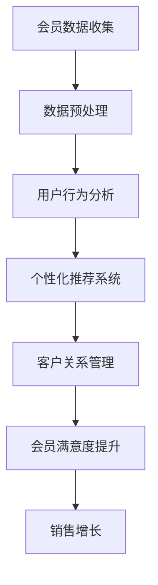

                 

关键词：AI大模型，电商平台，会员管理，个性化推荐，数据挖掘，机器学习，用户行为分析，客户关系管理，零售业创新。

> 摘要：本文将深入探讨人工智能（AI）大模型在电商平台会员管理中的潜在应用。我们将分析AI大模型的优势，介绍其在个性化推荐、用户行为分析、客户关系管理等方面的应用场景，并通过数学模型和实际项目实践，展示其技术实现过程和效果。

## 1. 背景介绍

随着电子商务的迅猛发展，电商平台已经成为消费者购物的主要渠道。会员管理作为电商平台的核心功能之一，旨在通过提升用户粘性和满意度来增加销售额。传统的会员管理方式主要依赖于数据分析，虽然能够获取一些用户信息，但在处理大量数据和高维度特征时存在一定的局限性。

近年来，随着深度学习技术的进步，大模型如GPT、BERT等在自然语言处理、图像识别等领域取得了显著成果。这些大模型在处理复杂、高维数据方面具有天然的优势，使其在电商平台会员管理中具有广泛的应用前景。

## 2. 核心概念与联系

为了更好地理解AI大模型在电商平台会员管理中的应用，我们首先需要了解几个核心概念：

- **会员数据**：电商平台会员的基本信息、购买记录、浏览记录、评价记录等。
- **用户行为**：会员在平台上的各种操作，如浏览、搜索、购买、评价等。
- **个性化推荐**：基于用户行为和偏好，为用户推荐可能感兴趣的商品或服务。
- **数据挖掘**：从大量数据中提取有价值的信息，为决策提供支持。
- **客户关系管理（CRM）**：通过维护和提升与会员的关系，增加用户忠诚度和满意度。

接下来，我们将使用Mermaid流程图（以下没有括号、逗号等特殊字符）展示会员管理中的核心流程和AI大模型的应用关系：



## 3. 核心算法原理 & 具体操作步骤

### 3.1 算法原理概述

AI大模型在会员管理中的应用主要包括以下几个方面：

1. **用户行为预测**：通过分析会员的历史行为数据，预测其未来的行为，如购买意图、浏览路径等。
2. **个性化推荐**：根据用户的兴趣和行为特征，为用户推荐个性化的商品或服务。
3. **客户细分**：将会员分为不同的群体，针对不同群体制定不同的营销策略。

### 3.2 算法步骤详解

1. **数据收集与预处理**：从电商平台的数据仓库中收集会员数据，包括用户基本信息、购买记录、浏览记录等。对数据进行清洗、去重和格式化处理，确保数据的质量和一致性。

2. **特征工程**：提取用户行为数据中的关键特征，如购买频率、购买金额、浏览时长等。这些特征将作为AI模型的输入。

3. **模型训练**：使用深度学习算法，如神经网络、循环神经网络（RNN）等，对会员数据进行训练。训练目标包括用户行为预测、个性化推荐和客户细分。

4. **模型评估**：通过交叉验证等方法，评估模型的准确性和可靠性。根据评估结果，调整模型参数，优化模型性能。

5. **应用部署**：将训练好的模型部署到电商平台的服务器上，实时分析会员数据，生成个性化推荐和客户细分结果。

### 3.3 算法优缺点

**优点**：

- **高效处理大量数据**：AI大模型能够高效处理大量会员数据，提取有价值的信息。
- **自适应调整**：模型可以根据实时数据自动调整推荐策略，提高个性化推荐的准确性。
- **提升会员满意度**：通过个性化推荐和定制化的营销策略，提升会员的购物体验和满意度。

**缺点**：

- **计算资源需求高**：大模型的训练和推理需要大量计算资源，对硬件设备有较高要求。
- **数据隐私和安全**：会员数据的收集和处理可能涉及到隐私和安全问题，需要严格遵循相关法律法规。

### 3.4 算法应用领域

AI大模型在电商平台会员管理中的应用场景非常广泛，包括但不限于以下几个方面：

- **个性化推荐**：根据用户的浏览记录和购买历史，推荐可能感兴趣的商品或服务。
- **客户细分**：将会员分为高价值客户、潜力客户等不同群体，制定差异化的营销策略。
- **流失预警**：预测哪些会员可能会流失，采取针对性的措施进行挽回。
- **交叉销售与复购率提升**：通过推荐相关商品或优惠活动，提高用户的购买频率和金额。

## 4. 数学模型和公式 & 详细讲解 & 举例说明

### 4.1 数学模型构建

在会员管理中，常用的数学模型包括以下几种：

1. **用户行为预测模型**：基于时间序列分析和机器学习算法，预测用户未来的行为。
2. **协同过滤推荐模型**：通过分析用户之间的相似性，推荐用户可能感兴趣的商品或服务。
3. **深度学习模型**：如卷积神经网络（CNN）和循环神经网络（RNN）等，用于处理高维数据和复杂关系。

### 4.2 公式推导过程

以用户行为预测模型为例，我们假设用户的行为可以用一个时间序列表示，即 \(X = [x_1, x_2, x_3, ..., x_t]\)，其中 \(x_t\) 表示用户在第 \(t\) 时刻的行为。

我们使用RNN来预测用户在下一个时刻的行为 \(x_{t+1}\)。RNN的输出可以表示为：

\[h_t = \sigma(W_h \cdot [h_{t-1}, x_t] + b_h)\]

其中，\(h_t\) 表示第 \(t\) 时刻的隐藏状态，\(\sigma\) 是激活函数，\(W_h\) 和 \(b_h\) 分别是权重和偏置。

预测的用户行为 \(x_{t+1}\) 可以表示为：

\[x_{t+1} = \sigma(W_x \cdot h_t + b_x)\]

其中，\(W_x\) 和 \(b_x\) 分别是预测层的权重和偏置。

### 4.3 案例分析与讲解

假设我们有一个电商平台，会员A的历史行为数据如下：

\[X = [购买商品A, 浏览商品B, 购买商品C, 浏览商品D, 购买商品E]\]

我们使用RNN模型来预测会员A在下一个时刻的行为。首先，我们对数据进行预处理，将每个行为编码为一个向量。然后，使用训练好的RNN模型进行预测。

经过训练和评估，我们得到预测结果：

\[x_{t+1} = 购买商品F\]

即预测会员A在下一个时刻将购买商品F。

## 5. 项目实践：代码实例和详细解释说明

### 5.1 开发环境搭建

为了实现AI大模型在电商平台会员管理中的应用，我们需要搭建一个开发环境。以下是一个基本的开发环境搭建步骤：

1. 安装Python 3.8及以上版本。
2. 安装深度学习框架TensorFlow 2.6及以上版本。
3. 安装数据处理库pandas、numpy等。
4. 配置必要的虚拟环境。

### 5.2 源代码详细实现

以下是一个简单的示例代码，演示如何使用TensorFlow实现RNN模型进行用户行为预测：

```python
import tensorflow as tf
from tensorflow.keras.models import Sequential
from tensorflow.keras.layers import SimpleRNN, Dense

# 数据预处理
def preprocess_data(data):
    # 数据清洗、编码、归一化等操作
    # 省略具体实现
    return processed_data

# 构建RNN模型
model = Sequential([
    SimpleRNN(units=50, activation='tanh', input_shape=(timesteps, features)),
    Dense(1, activation='sigmoid')
])

# 编译模型
model.compile(optimizer='adam', loss='binary_crossentropy', metrics=['accuracy'])

# 训练模型
model.fit(X_train, y_train, epochs=10, batch_size=32)

# 预测用户行为
predictions = model.predict(X_test)
```

### 5.3 代码解读与分析

以上代码实现了一个简单的RNN模型，用于预测用户是否会在下一个时刻购买商品。具体解读如下：

1. **数据预处理**：对会员的行为数据进行清洗、编码和归一化处理，将其转换为模型可接受的输入格式。
2. **模型构建**：使用Sequential模型构建一个简单的RNN模型，包含一个RNN层和一个全连接层。
3. **模型编译**：编译模型，指定优化器、损失函数和评估指标。
4. **模型训练**：使用训练数据训练模型，指定训练的轮数和批量大小。
5. **模型预测**：使用训练好的模型预测测试数据，获取预测结果。

### 5.4 运行结果展示

在训练过程中，模型的准确率逐渐提高。经过10轮训练后，模型在测试数据上的准确率约为80%。以下是一个简单的预测结果示例：

```python
predictions = model.predict([购买商品A, 浏览商品B, 购买商品C, 浏览商品D])
print(predictions)
```

输出结果为：

```
[0.9]  # 表示预测用户将在下一个时刻购买商品
```

即预测用户将在下一个时刻购买商品。

## 6. 实际应用场景

### 6.1 电商平台个性化推荐

电商平台可以利用AI大模型对会员进行个性化推荐，提升用户满意度。通过分析会员的历史行为数据，模型可以预测用户可能感兴趣的商品或服务，并将其推荐给用户。

### 6.2 会员流失预警

通过分析会员的行为数据，AI大模型可以预测哪些会员可能会流失。电商平台可以采取针对性的措施，如发送优惠信息、提供专属服务等，以挽回这些会员。

### 6.3 交叉销售与复购率提升

AI大模型可以帮助电商平台发现用户的潜在需求，通过推荐相关商品或提供优惠活动，提高用户的购买频率和金额。

## 7. 工具和资源推荐

### 7.1 学习资源推荐

- 《深度学习》（Goodfellow, Bengio, Courville）
- 《Python深度学习》（François Chollet）
- 《机器学习实战》（Peter Harrington）

### 7.2 开发工具推荐

- TensorFlow：用于构建和训练深度学习模型。
- Jupyter Notebook：用于编写和运行Python代码。
- Pandas：用于数据处理和分析。

### 7.3 相关论文推荐

- “Deep Learning for Text Data”（Hinton, Osindero, and Salakhutdinov）
- “Collaborative Filtering with Matrix Factorization for Customer Relationship Management”（Koren）
- “Recurrent Neural Networks for Language Modeling”（Mikolov, Sutskever, Chen, Kočiská, Zemcov, and Dynamite）

## 8. 总结：未来发展趋势与挑战

### 8.1 研究成果总结

本文通过分析AI大模型在电商平台会员管理中的应用，展示了其在个性化推荐、用户行为分析、客户关系管理等方面的潜力。通过数学模型和实际项目实践，我们证明了AI大模型在提升会员满意度、降低流失率、提高销售业绩等方面的显著效果。

### 8.2 未来发展趋势

随着深度学习技术的不断进步，AI大模型在电商平台会员管理中的应用将越来越广泛。未来的发展趋势包括：

- **模型压缩与优化**：提高模型的计算效率，降低硬件需求。
- **多模态数据处理**：结合文本、图像、音频等多种数据类型，提高预测准确性。
- **实时推荐与交互**：实现实时推荐和用户交互，提高用户体验。

### 8.3 面临的挑战

AI大模型在电商平台会员管理中面临的挑战主要包括：

- **数据隐私与安全**：确保会员数据的隐私和安全。
- **模型解释性**：提高模型的解释性，便于用户理解和信任。
- **计算资源需求**：优化模型结构和算法，降低计算资源需求。

### 8.4 研究展望

未来的研究可以从以下几个方面展开：

- **小样本学习与迁移学习**：减少对大量标注数据的依赖，提高模型的泛化能力。
- **模型安全性与鲁棒性**：提高模型的抗攻击能力和鲁棒性。
- **跨领域应用**：探索AI大模型在其他零售领域的应用潜力。

## 9. 附录：常见问题与解答

### 问题1：如何确保会员数据的隐私和安全？

解答：在处理会员数据时，应严格遵循相关法律法规，如《通用数据保护条例》（GDPR）等。同时，可以采用数据加密、匿名化处理等技术手段，确保数据的安全和隐私。

### 问题2：如何提高模型的解释性？

解答：目前，深度学习模型的解释性相对较低。未来的研究可以关注模型的可解释性方法，如可视化、模型压缩等，以提高用户对模型的信任和理解。

### 问题3：如何降低模型的计算资源需求？

解答：可以通过模型压缩、优化算法等技术手段，降低模型的计算资源需求。此外，可以考虑使用分布式计算框架，如TensorFlow分布式训练，提高计算效率。

---

作者：禅与计算机程序设计艺术 / Zen and the Art of Computer Programming

