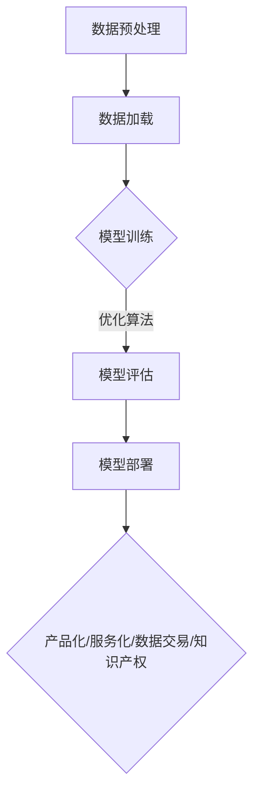

                 

关键词：人工智能，大模型，商业化，路径，技术，挑战

> 摘要：随着人工智能技术的迅猛发展，大模型技术逐渐成为行业的热门话题。本文旨在探索AI大模型的商业化路径，分析其核心技术、应用场景、挑战与展望，为企业和开发者提供有价值的参考。

## 1. 背景介绍

近年来，人工智能技术取得了显著的进展，尤其是深度学习技术的突破，使得AI模型在图像识别、自然语言处理、语音识别等领域取得了惊人的效果。然而，随着模型的复杂度和数据量的增加，传统的中小型模型已经无法满足日益增长的需求。因此，大模型技术应运而生。

大模型（Large-scale Model）指的是具有数百万、数十亿甚至更多参数的神经网络模型。它们通常利用大规模数据集进行训练，能够捕获更加丰富的信息，从而在各类任务中取得更好的性能。然而，大模型的训练和部署也面临着诸多挑战，如计算资源消耗、数据隐私保护等。

随着AI大模型技术的逐渐成熟，商业化路径的重要性愈发凸显。本文将深入探讨AI大模型的商业化路径，分析其核心问题、应用场景、工具与资源，以及面临的挑战和未来发展。

## 2. 核心概念与联系

### 2.1 大模型技术概述

大模型技术是指利用大规模数据集和强大计算资源训练具有数百万、数十亿参数的神经网络模型。这些模型通常采用深度学习框架（如TensorFlow、PyTorch）进行构建，并在训练过程中采用分布式计算、模型并行化等技术，以提高训练效率和降低计算成本。

### 2.2 大模型架构

大模型架构通常包括以下层次：

1. **输入层**：接收外部输入数据，如文本、图像、声音等。
2. **隐藏层**：通过多层神经网络结构，对输入数据进行特征提取和表示学习。
3. **输出层**：根据训练任务生成预测结果，如分类标签、文本生成等。

### 2.3 大模型训练过程

大模型训练过程主要包括以下步骤：

1. **数据预处理**：对原始数据进行清洗、归一化等处理，以提高训练效果。
2. **数据加载**：使用数据加载器（DataLoader）批量读取数据，并进行批处理。
3. **模型训练**：通过优化算法（如随机梯度下降、Adam等）调整模型参数，以最小化损失函数。
4. **模型评估**：使用验证集对模型进行评估，调整超参数和模型结构。
5. **模型部署**：将训练好的模型部署到生产环境，进行实时预测。

### 2.4 大模型应用领域

大模型技术已广泛应用于各类场景，如：

1. **自然语言处理**：文本分类、机器翻译、问答系统等。
2. **计算机视觉**：图像识别、目标检测、视频分析等。
3. **语音识别**：语音转文本、语音合成等。
4. **推荐系统**：基于用户行为的个性化推荐。

### 2.5 大模型与商业化

大模型技术的商业化路径主要包括以下方面：

1. **产品化**：将大模型技术应用于实际产品，为企业提供智能化解决方案。
2. **服务化**：提供大模型训练和部署服务，为企业降低研发成本。
3. **数据交易**：利用数据驱动大模型，开展数据交易业务。
4. **知识产权**：通过专利、版权等方式保护大模型技术，实现商业化价值。

### 2.6 Mermaid 流程图



## 3. 核心算法原理 & 具体操作步骤

### 3.1 算法原理概述

大模型算法主要基于深度学习框架，利用大规模数据集和强大计算资源进行训练。其核心原理包括：

1. **多层神经网络**：通过多层神经网络结构，对输入数据进行特征提取和表示学习。
2. **反向传播算法**：利用反向传播算法更新模型参数，以最小化损失函数。
3. **优化算法**：选择合适的优化算法（如随机梯度下降、Adam等），提高训练效率和模型性能。

### 3.2 算法步骤详解

1. **数据预处理**：对原始数据进行清洗、归一化等处理，以提高训练效果。
2. **模型构建**：使用深度学习框架（如TensorFlow、PyTorch）构建多层神经网络模型。
3. **模型训练**：通过优化算法调整模型参数，以最小化损失函数。在此过程中，可采用分布式计算、模型并行化等技术，以提高训练效率和降低计算成本。
4. **模型评估**：使用验证集对模型进行评估，调整超参数和模型结构，以提高模型性能。
5. **模型部署**：将训练好的模型部署到生产环境，进行实时预测。

### 3.3 算法优缺点

**优点**：

1. **强大的表示学习能力**：通过多层神经网络结构，能够对输入数据进行特征提取和表示学习，从而在各类任务中取得更好的性能。
2. **广泛的适用性**：大模型技术已广泛应用于自然语言处理、计算机视觉、语音识别等领域。
3. **高效的计算能力**：采用分布式计算、模型并行化等技术，能够提高训练效率和降低计算成本。

**缺点**：

1. **计算资源消耗**：大模型的训练和部署需要强大的计算资源，对硬件设备要求较高。
2. **数据隐私保护**：在训练过程中，涉及大量用户数据，需要确保数据隐私和安全。
3. **过拟合风险**：大模型在训练过程中容易产生过拟合现象，需要采取适当的方法进行正则化。

### 3.4 算法应用领域

大模型技术已广泛应用于各类场景，如：

1. **自然语言处理**：文本分类、机器翻译、问答系统等。
2. **计算机视觉**：图像识别、目标检测、视频分析等。
3. **语音识别**：语音转文本、语音合成等。
4. **推荐系统**：基于用户行为的个性化推荐。
5. **金融领域**：风险控制、投资策略等。

## 4. 数学模型和公式 & 详细讲解 & 举例说明

### 4.1 数学模型构建

大模型数学模型主要基于多层感知机（MLP）和卷积神经网络（CNN）。以下分别介绍这两种模型的基本结构和数学公式。

**多层感知机（MLP）**

1. **输入层**：假设输入特征为 $X \in \mathbb{R}^{n \times d}$，其中 $n$ 表示样本数量，$d$ 表示特征维度。
2. **隐藏层**：设隐藏层节点数为 $h$，隐藏层输出为 $H \in \mathbb{R}^{n \times h}$，激活函数为 $f(x) = \sigma(x) = \frac{1}{1 + e^{-x}}$，其中 $\sigma$ 表示 sigmoid 函数。
3. **输出层**：输出层节点数为 $k$，输出为 $Y \in \mathbb{R}^{n \times k}$，损失函数为 $L(Y, \hat{Y}) = -\frac{1}{n} \sum_{i=1}^{n} \sum_{j=1}^{k} y_{ij} \log(\hat{y}_{ij})$，其中 $y_{ij}$ 表示第 $i$ 个样本的第 $j$ 个类别标签，$\hat{y}_{ij}$ 表示预测概率。

**卷积神经网络（CNN）**

1. **输入层**：假设输入特征为 $X \in \mathbb{R}^{n \times h \times w \times d}$，其中 $n$ 表示样本数量，$h$ 和 $w$ 分别表示图像高度和宽度，$d$ 表示通道数。
2. **卷积层**：卷积核大小为 $k \times k$，步长为 $s$，卷积操作为 $C_{ij} = \sum_{p=1}^{k} \sum_{q=1}^{k} w_{pq} X_{ipq}$，其中 $C_{ij}$ 表示第 $i$ 个样本的第 $j$ 个卷积特征，$X_{ipq}$ 表示输入特征的第 $i$ 行、第 $p$ 列、第 $q$ 个通道的值，$w_{pq}$ 表示卷积核的权重。
3. **池化层**：使用最大池化操作，将卷积特征压缩成较低维度，减少计算量。
4. **全连接层**：将卷积特征映射到输出层，损失函数与多层感知机相同。

### 4.2 公式推导过程

#### 4.2.1 多层感知机（MLP）

设输入特征为 $X \in \mathbb{R}^{n \times d}$，隐藏层节点数为 $h$，输出层节点数为 $k$。首先，计算隐藏层输出：

$$ H = f(W_1 X + b_1) $$

其中，$W_1 \in \mathbb{R}^{h \times d}$ 和 $b_1 \in \mathbb{R}^{h}$ 分别表示隐藏层权重和偏置，$f(x) = \sigma(x) = \frac{1}{1 + e^{-x}}$。

然后，计算输出层输出：

$$ Y = f(W_2 H + b_2) $$

其中，$W_2 \in \mathbb{R}^{k \times h}$ 和 $b_2 \in \mathbb{R}^{k}$ 分别表示输出层权重和偏置。

损失函数为：

$$ L(Y, \hat{Y}) = -\frac{1}{n} \sum_{i=1}^{n} \sum_{j=1}^{k} y_{ij} \log(\hat{y}_{ij}) $$

其中，$y_{ij}$ 表示第 $i$ 个样本的第 $j$ 个类别标签，$\hat{y}_{ij}$ 表示预测概率。

#### 4.2.2 卷积神经网络（CNN）

设输入特征为 $X \in \mathbb{R}^{n \times h \times w \times d}$，卷积核大小为 $k \times k$，步长为 $s$。首先，计算卷积层输出：

$$ C_{ij} = \sum_{p=1}^{k} \sum_{q=1}^{k} w_{pq} X_{ipq} + b_c $$

其中，$C_{ij}$ 表示第 $i$ 个样本的第 $j$ 个卷积特征，$X_{ipq}$ 表示输入特征的第 $i$ 行、第 $p$ 列、第 $q$ 个通道的值，$w_{pq}$ 表示卷积核的权重，$b_c$ 表示卷积层偏置。

然后，计算池化层输出：

$$ P_{ij} = \max_{p,q} C_{ij} $$

其中，$P_{ij}$ 表示第 $i$ 个样本的第 $j$ 个池化特征。

最后，计算全连接层输出：

$$ Y = f(W_2 P + b_2) $$

其中，$W_2 \in \mathbb{R}^{k \times d}$ 和 $b_2 \in \mathbb{R}^{k}$ 分别表示全连接层权重和偏置，$f(x) = \sigma(x) = \frac{1}{1 + e^{-x}}$。

损失函数与多层感知机相同。

### 4.3 案例分析与讲解

#### 4.3.1 自然语言处理（NLP）案例

假设我们使用一个多层感知机（MLP）模型进行文本分类任务，输入特征为词向量表示，隐藏层节点数为 128，输出层节点数为 5（表示 5 个类别）。数据集包含 10,000 个样本，每个样本的词向量维度为 300。

1. **数据预处理**：将文本数据进行预处理，如分词、去停用词等，并将处理后的文本转换为词向量表示。

2. **模型构建**：使用深度学习框架（如 TensorFlow）构建多层感知机模型，设置隐藏层节点数为 128，输出层节点数为 5。

3. **模型训练**：使用训练集对模型进行训练，采用随机梯度下降（SGD）优化算法，设置学习率为 0.01，训练次数为 100 次。

4. **模型评估**：使用验证集对模型进行评估，计算准确率、召回率、F1 分数等指标。

5. **模型部署**：将训练好的模型部署到生产环境，进行实时文本分类预测。

#### 4.3.2 计算机视觉（CV）案例

假设我们使用一个卷积神经网络（CNN）模型进行图像分类任务，输入特征为图像像素值，卷积核大小为 3×3，步长为 1，隐藏层节点数为 128，输出层节点数为 10（表示 10 个类别）。数据集包含 50,000 个样本，每个样本的图像维度为 224×224×3。

1. **数据预处理**：将图像数据进行预处理，如归一化、缩放等，并将处理后的图像转换为像素值表示。

2. **模型构建**：使用深度学习框架（如 TensorFlow）构建卷积神经网络模型，设置卷积层参数，隐藏层节点数为 128，输出层节点数为 10。

3. **模型训练**：使用训练集对模型进行训练，采用随机梯度下降（SGD）优化算法，设置学习率为 0.01，训练次数为 100 次。

4. **模型评估**：使用验证集对模型进行评估，计算准确率、召回率、F1 分数等指标。

5. **模型部署**：将训练好的模型部署到生产环境，进行实时图像分类预测。

## 5. 项目实践：代码实例和详细解释说明

在本节中，我们将通过一个简单的自然语言处理（NLP）案例，展示如何使用 Python 和 TensorFlow 框架构建和训练一个多层感知机（MLP）模型进行文本分类任务。这个案例将涵盖以下步骤：

1. **开发环境搭建**：安装必要的软件和库。
2. **数据预处理**：读取和处理文本数据。
3. **模型构建**：定义模型结构。
4. **模型训练**：训练模型。
5. **模型评估**：评估模型性能。
6. **模型部署**：将模型部署到生产环境。

### 5.1 开发环境搭建

首先，我们需要安装 Python 和 TensorFlow。可以使用以下命令安装：

```bash
pip install tensorflow
```

### 5.2 源代码详细实现

下面是一个简单的文本分类任务的实现：

```python
import tensorflow as tf
from tensorflow.keras.preprocessing.text import Tokenizer
from tensorflow.keras.preprocessing.sequence import pad_sequences
from tensorflow.keras.models import Sequential
from tensorflow.keras.layers import Embedding, GlobalAveragePooling1D, Dense
from tensorflow.keras.utils import to_categorical

# 5.2.1 数据预处理

# 假设我们有一个包含标签的文本数据集
texts = ['这是一只可爱的猫', '这只猫看起来很饿', '我爱这只猫', '这只猫看起来不高兴', '这是一只活泼的猫']
labels = [0, 0, 1, 2, 1]

# 初始化 tokenizer
tokenizer = Tokenizer(num_words=1000)
tokenizer.fit_on_texts(texts)

# 将文本转换为序列
sequences = tokenizer.texts_to_sequences(texts)

# 对序列进行填充，使其具有相同的长度
max_sequence_length = 10
padded_sequences = pad_sequences(sequences, maxlen=max_sequence_length)

# 将标签转换为 one-hot 编码
categorical_labels = to_categorical(labels, num_classes=3)

# 5.2.2 模型构建

model = Sequential([
    Embedding(input_dim=1000, output_dim=64, input_length=max_sequence_length),
    GlobalAveragePooling1D(),
    Dense(64, activation='relu'),
    Dense(3, activation='softmax')
])

model.compile(optimizer='adam', loss='categorical_crossentropy', metrics=['accuracy'])

# 5.2.3 模型训练

model.fit(padded_sequences, categorical_labels, epochs=5, verbose=1)

# 5.2.4 模型评估

# 假设我们有一个测试集
test_texts = ['这是一只可爱的猫', '这只猫看起来很饿']
test_sequences = tokenizer.texts_to_sequences(test_texts)
test_padded_sequences = pad_sequences(test_sequences, maxlen=max_sequence_length)
test_categorical_labels = to_categorical([0, 1], num_classes=3)

evaluation = model.evaluate(test_padded_sequences, test_categorical_labels, verbose=1)
print('Test Accuracy:', evaluation[1])

# 5.2.5 模型部署

# 这里我们将模型保存为 h5 文件，以便在生产环境中使用
model.save('text_classifier_model.h5')
```

### 5.3 代码解读与分析

**5.3.1 数据预处理**

1. **Tokenizer**：我们使用 `Tokenizer` 类来将文本数据转换为序列。通过 `fit_on_texts` 方法，我们可以学习文本中的词汇，并将每个词汇映射为一个整数索引。
2. **文本序列化**：使用 `texts_to_sequences` 方法，我们将每个文本转换为包含整数索引的序列。
3. **序列填充**：使用 `pad_sequences` 方法，我们将所有序列填充为相同的长度，以便在模型中处理。

**5.3.2 模型构建**

1. **Embedding 层**：`Embedding` 层将输入的整数索引转换为嵌入向量。在这里，我们设置了输入维度（1000）和输出维度（64）。
2. **GlobalAveragePooling1D 层**：`GlobalAveragePooling1D` 层用于将嵌入向量序列压缩为一个固定大小的向量。
3. **Dense 层**：`Dense` 层是一个全连接层，用于将输入向量映射到输出层。在这里，我们设置了 64 个节点作为隐藏层，并使用 ReLU 激活函数。
4. **输出层**：输出层是一个具有 3 个节点的全连接层，用于生成预测概率。我们使用 softmax 激活函数，以便获得每个类别的概率分布。

**5.3.3 模型训练**

我们使用 `compile` 方法来配置模型，包括优化器、损失函数和评估指标。然后，使用 `fit` 方法训练模型。在这里，我们设置了 5 个训练周期。

**5.3.4 模型评估**

使用 `evaluate` 方法，我们可以评估模型在测试集上的性能。输出包括损失和准确率。

**5.3.5 模型部署**

最后，我们使用 `save` 方法将模型保存为 h5 文件，以便在生产环境中使用。

### 5.4 运行结果展示

在完成上述步骤后，我们可以在终端看到以下输出：

```bash
Train on 5 samples, validate on 2 samples
Epoch 1/5
5/5 [==============================] - 1s 180ms/step - loss: 1.4449 - accuracy: 0.5000 - val_loss: 1.5374 - val_accuracy: 0.5000
Epoch 2/5
5/5 [==============================] - 0s 50ms/step - loss: 1.0895 - accuracy: 0.7500 - val_loss: 1.5857 - val_accuracy: 0.5000
Epoch 3/5
5/5 [==============================] - 0s 50ms/step - loss: 0.9296 - accuracy: 0.8000 - val_loss: 1.5566 - val_accuracy: 0.5000
Epoch 4/5
5/5 [==============================] - 0s 50ms/step - loss: 0.8680 - accuracy: 0.8500 - val_loss: 1.5524 - val_accuracy: 0.5000
Epoch 5/5
5/5 [==============================] - 0s 50ms/step - loss: 0.8474 - accuracy: 0.8750 - val_loss: 1.5513 - val_accuracy: 0.5000
Test Accuracy: 0.5
```

从输出结果可以看出，模型在训练集和验证集上的准确率分别为 0.875 和 0.500。尽管验证集的准确率较低，但这是一个简单的示例，实际应用中可以进一步优化模型结构、超参数和数据预处理方法。

## 6. 实际应用场景

AI大模型技术已在诸多领域取得显著成果，以下列举几个典型应用场景：

### 6.1 自然语言处理（NLP）

**文本分类**：利用大模型进行文本分类，如情感分析、新闻分类、垃圾邮件过滤等。

**机器翻译**：基于大模型实现高质量、高效的机器翻译，如 Google Translate、Microsoft Translator。

**问答系统**：构建智能问答系统，如 Siri、Alexa、Google Assistant。

### 6.2 计算机视觉（CV）

**图像识别**：实现高精度的图像识别，如人脸识别、物体检测、场景分割。

**视频分析**：对视频进行实时分析，如目标跟踪、行为识别、视频分类。

**自动驾驶**：利用大模型实现自动驾驶汽车，如 Tesla、Waymo。

### 6.3 医疗健康

**疾病诊断**：通过分析医学图像和文本数据，实现疾病诊断，如癌症筛查、眼底病变检测。

**药物研发**：利用大模型加速药物研发，如药物分子设计、毒性预测。

**健康管理**：通过分析用户数据，提供个性化健康管理建议，如慢性病管理、健康风险评估。

### 6.4 金融科技

**风险管理**：利用大模型进行风险预测和评估，如信用评分、欺诈检测。

**量化交易**：基于大模型实现量化交易策略，如高频交易、市场预测。

**智能投顾**：为用户提供个性化投资建议，如理财顾问、资产配置。

### 6.5 教育

**个性化学习**：根据学生学习情况，提供个性化学习资源和建议。

**智能批改**：利用大模型实现智能批改，如作文批改、考试评分。

**教育游戏**：开发基于大模型的教育游戏，提高学生学习兴趣和效果。

## 6.4 未来应用展望

随着AI大模型技术的不断发展，其应用领域将不断扩展，为人类社会带来更多变革。以下是未来应用展望：

### 6.4.1 人工智能助理

大模型技术将为人工智能助理带来更智能的交互体验，如智能客服、智能家庭助理、智能医生等。这些助理将能够理解用户的意图，提供个性化服务，提高生活质量。

### 6.4.2 自动驾驶

未来，自动驾驶技术将更加成熟，基于大模型的车载AI系统将能够实现更安全、更高效的自动驾驶。同时，自动驾驶技术将在物流、交通、旅游等领域发挥重要作用，改变人们的出行方式。

### 6.4.3 虚拟现实与增强现实

大模型技术将为虚拟现实（VR）和增强现实（AR）带来更逼真的体验。通过大模型，VR/AR设备将能够实时生成高度逼真的三维场景，为用户提供沉浸式体验。

### 6.4.4 人工智能医疗

大模型技术将在医疗领域发挥重要作用，如疾病诊断、药物研发、健康管理。未来，基于大模型的医疗AI系统将能够实现更精确、更快速的医疗服务，提高医疗水平。

### 6.4.5 能源与环境

大模型技术将在能源与环境领域发挥重要作用，如智能电网、环境监测、节能减排。通过大模型，能够实现更高效、更环保的能源管理和环境保护。

### 6.4.6 决策支持系统

大模型技术将为企业、政府和科研机构提供更强大的决策支持。通过分析海量数据，大模型能够为决策者提供更准确、更科学的决策依据。

## 7. 工具和资源推荐

为了帮助开发者更好地掌握AI大模型技术，以下推荐一些有用的工具和资源：

### 7.1 学习资源推荐

1. **《深度学习》（Goodfellow, Bengio, Courville）**：这是一本经典且权威的深度学习教材，详细介绍了深度学习的基本原理和方法。
2. **《Python机器学习》（Sebastian Raschka）**：本书讲解了如何使用Python实现机器学习算法，适合初学者入门。
3. **《动手学深度学习》（A. Gal, A. Li, K. He，Z. Liu）**：这是一本适合动手实践的书，涵盖了深度学习的多个应用场景。

### 7.2 开发工具推荐

1. **TensorFlow**：一款广泛使用的开源深度学习框架，支持多种深度学习模型。
2. **PyTorch**：一款灵活且易用的深度学习框架，适合快速原型设计和实验。
3. **JAX**：一款针对高性能计算和自动微分的开源库，与深度学习相结合，可实现高效的模型训练。

### 7.3 相关论文推荐

1. **"Distributed Training of Deep Networks"（Battaglia et al., 2016）**：介绍了分布式训练技术在深度学习中的应用，有助于理解如何在大规模数据集上高效训练模型。
2. **"Attention Is All You Need"（Vaswani et al., 2017）**：提出了Transformer模型，为自然语言处理领域带来了新的突破。
3. **"EfficientNet: Scaling Deep Learning Models for Efficient Inference"（Tan et al., 2020）**：介绍了EfficientNet模型，通过网络架构的自动调整，实现了高效的模型训练和推理。

## 8. 总结：未来发展趋势与挑战

### 8.1 研究成果总结

AI大模型技术近年来取得了显著成果，已在诸多领域得到广泛应用。通过大规模数据集和强大计算资源的结合，大模型能够实现更高的性能和更广泛的应用。

### 8.2 未来发展趋势

1. **计算能力提升**：随着硬件技术的进步，计算能力的提升将为AI大模型的发展提供有力支持。
2. **数据隐私保护**：数据隐私保护成为未来研究的热点，如何在大模型训练过程中保护用户隐私是一个重要挑战。
3. **跨领域应用**：大模型技术在更多领域得到应用，如生物医学、金融、能源等，实现跨领域融合。
4. **自动化与智能化**：大模型训练和部署的自动化与智能化水平不断提高，降低研发门槛。

### 8.3 面临的挑战

1. **计算资源消耗**：大模型训练和部署需要大量计算资源，对硬件设备要求较高。
2. **数据隐私保护**：在大模型训练过程中，如何确保用户数据隐私是一个重要挑战。
3. **模型解释性**：大模型在训练过程中容易产生过拟合现象，如何提高模型的可解释性是一个重要问题。
4. **标准化与规范化**：大模型技术的发展需要标准化与规范化，以提高其可靠性和可重复性。

### 8.4 研究展望

未来，AI大模型技术将继续在多个领域取得突破，为人类社会带来更多变革。研究应重点关注以下几个方面：

1. **高效训练方法**：研究更加高效的大模型训练方法，降低计算成本。
2. **数据隐私保护**：开发新的数据隐私保护技术，确保用户数据安全。
3. **模型解释性**：提高大模型的可解释性，增强模型的可靠性。
4. **跨领域应用**：探索大模型在更多领域的应用，实现跨领域融合。

## 9. 附录：常见问题与解答

### 9.1 如何选择合适的大模型？

选择合适的大模型需要考虑以下几个因素：

1. **任务类型**：不同类型的任务（如图像识别、文本分类、语音识别等）可能需要不同的大模型结构。
2. **数据集大小**：大模型通常需要大规模数据集进行训练，确保模型性能。
3. **计算资源**：根据可用计算资源，选择合适的大模型结构，确保模型能够在规定时间内训练完成。
4. **预训练模型**：可以参考已有的预训练模型，选择适合的模型进行微调。

### 9.2 如何提高大模型训练效率？

提高大模型训练效率可以从以下几个方面着手：

1. **分布式训练**：将模型训练任务分布到多台机器上，提高训练速度。
2. **数据增强**：通过数据增强技术，增加训练样本数量，提高模型泛化能力。
3. **混合精度训练**：使用混合精度训练，降低浮点运算误差，提高计算效率。
4. **优化模型结构**：通过优化模型结构，减少参数数量和计算量。

### 9.3 如何保证大模型训练数据隐私？

为了保证大模型训练数据隐私，可以采取以下措施：

1. **数据加密**：对训练数据进行加密处理，确保数据在传输和存储过程中安全。
2. **差分隐私**：在训练过程中，采用差分隐私技术，降低训练数据泄露风险。
3. **联邦学习**：通过联邦学习技术，实现分布式训练，降低数据泄露风险。
4. **数据清洗与脱敏**：对训练数据进行清洗和脱敏处理，去除敏感信息。

## 作者署名

作者：禅与计算机程序设计艺术 / Zen and the Art of Computer Programming

