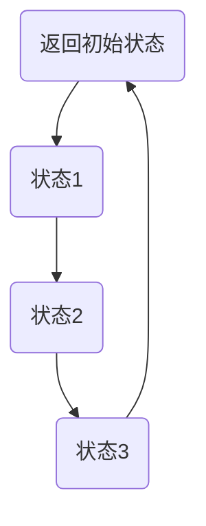
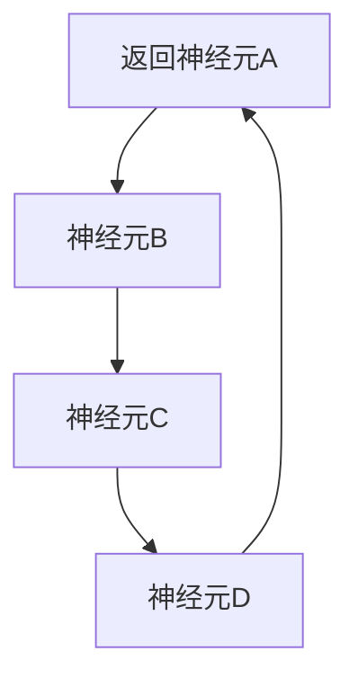

                 

关键词：人类认知，计算理论，思维模式，神经科学，人工智能，认知计算，思维模型，认知模拟。

> 摘要：本文旨在探索人类认知的本质，通过介绍计算理论，神经科学和人工智能的相关研究，探讨人类计算在理解思维过程中所能提供的独特视角。文章首先回顾了人类认知的背景知识，接着深入分析了计算理论的基本原理和思维模式，并结合神经科学的研究成果，探讨了人类思维的计算模型。最后，文章探讨了认知计算在实际应用中的可能性，并展望了未来研究方向。

## 1. 背景介绍

人类认知是一个复杂的过程，涉及到感官输入的处理、信息的存储和检索、决策和问题解决等多个方面。传统的认知科学主要依赖于心理学和神经科学的方法，通过观察和实验来研究人类思维和行为。然而，随着计算机科学的飞速发展，计算理论为理解认知过程提供了一种新的视角。

计算理论起源于20世纪40年代，由图灵机模型奠定基础。图灵认为，任何可以计算的问题都可以通过一种抽象的机器——图灵机来解决。这一理论为计算机科学的发展奠定了基础，同时也启发了对人类认知的思考。近年来，神经科学的研究进一步揭示了大脑的结构和功能，为理解思维过程提供了新的线索。

人工智能（AI）作为计算机科学的一个分支，旨在模拟和扩展人类智能。通过机器学习和深度学习等技术，AI系统可以处理大量数据，识别模式和规律，甚至进行自主决策。认知计算是AI的一个子领域，专注于模拟人类思维过程，包括感知、记忆、推理和决策等。

## 2. 核心概念与联系

### 2.1 计算理论基本原理

计算理论的核心概念是图灵机，这是一种抽象的机器，用于模拟任何计算过程。图灵机的结构包括一个无限长的纸带、一个读写头和一个状态转换表。纸带上的符号代表数据，读写头可以在纸带上读取和写入符号，状态转换表决定了读写头在读取符号后应采取的动作。

图灵机的运行过程可以描述为一系列状态转换，每个状态转换都涉及读写头在纸带上移动和改变符号，以及机器从当前状态转移到下一个状态。这种状态转换表可以表示为如下形式的Mermaid流程图：



在这个流程图中，A表示初始状态，B、C、D表示后续状态，箭头表示状态之间的转换。通过这种抽象的模型，图灵机可以模拟任何计算过程，包括复杂的数学运算和逻辑推理。

### 2.2 思维模式

思维模式是指人类在处理信息和解决问题时所采用的方式。常见的思维模式包括逻辑思维、直觉思维、创造性思维等。逻辑思维是一种基于规则和推理的思维方式，适用于解决结构化的、有明确答案的问题。直觉思维则依赖于个人的经验和直觉，适用于处理复杂、不确定的问题。创造性思维则强调创新和想象力，适用于探索新的解决方案和创意。

### 2.3 神经科学的研究成果

神经科学的研究揭示了大脑的结构和功能，为我们理解思维过程提供了新的线索。大脑由数十亿个神经元组成，这些神经元通过突触相互连接，形成了复杂的神经网络。神经元的信号传递过程可以描述为如下形式的Mermaid流程图：



在这个流程图中，A、B、C、D表示不同的神经元，箭头表示神经元之间的信号传递。通过这种神经网络的结构，大脑可以处理和存储大量的信息，实现复杂的认知功能。

## 3. 核心算法原理 & 具体操作步骤

### 3.1 算法原理概述

认知计算的核心算法是神经网络，这是一种模拟大脑神经网络的计算模型。神经网络由多个层次组成，每个层次都包含多个神经元。神经元之间的连接权重决定了信号在神经网络中的传递方式。神经网络的训练过程包括输入数据的预处理、权重的初始化、前向传播和反向传播等步骤。

### 3.2 算法步骤详解

1. **输入数据的预处理**：将输入数据转换为适合神经网络处理的形式。例如，对于图像数据，可以将其转换为像素值矩阵。

2. **权重的初始化**：为神经网络中的每个连接随机分配初始权重。

3. **前向传播**：将输入数据通过神经网络的前向传播过程，计算每个神经元的输出值。

4. **损失函数计算**：计算神经网络输出的实际值与期望值之间的差异，即损失。

5. **反向传播**：根据损失函数，计算神经网络中每个连接的梯度，并更新权重。

6. **迭代训练**：重复上述步骤，直到神经网络输出满足要求。

### 3.3 算法优缺点

神经网络作为一种强大的计算模型，具有以下优点：

- **并行处理能力**：神经网络可以同时处理多个输入数据，提高了计算效率。
- **自适应能力**：神经网络可以通过训练不断优化自身，适应不同的输入数据。
- **泛化能力**：神经网络可以处理复杂、不确定的问题，具有较好的泛化能力。

然而，神经网络也存在一些缺点：

- **计算复杂度高**：神经网络需要大量的计算资源，尤其是在大规模数据处理时。
- **训练时间较长**：神经网络的训练过程需要大量时间，尤其是对于复杂的问题。

### 3.4 算法应用领域

神经网络在许多领域都有广泛的应用，包括图像识别、自然语言处理、语音识别、推荐系统等。例如，在图像识别领域，神经网络可以用于人脸识别、物体识别等任务；在自然语言处理领域，神经网络可以用于文本分类、机器翻译等任务；在语音识别领域，神经网络可以用于语音信号的处理和识别。

## 4. 数学模型和公式 & 详细讲解 & 举例说明

### 4.1 数学模型构建

神经网络的数学模型可以描述为如下形式：

$$
\text{输出} = f(\text{权重} \cdot \text{输入} + \text{偏置})
$$

其中，$f$表示激活函数，用于将线性组合后的结果映射到输出空间。常见的激活函数包括sigmoid函数、ReLU函数和Tanh函数。

### 4.2 公式推导过程

神经网络的训练过程可以通过反向传播算法实现。反向传播算法的核心思想是将输出误差反向传播到神经网络的前向传播过程中，并更新连接权重。

假设神经网络的输出误差为：

$$
\text{误差} = \text{期望输出} - \text{实际输出}
$$

则连接权重更新的公式为：

$$
\Delta w = \alpha \cdot \text{误差} \cdot \text{输入}
$$

其中，$\alpha$表示学习率。

### 4.3 案例分析与讲解

以下是一个简单的神经网络模型，用于实现二分类任务。假设输入数据为$(x_1, x_2)$，输出为$y$，其中$y \in \{0, 1\}$。

$$
\text{输出} = f(w_1 \cdot x_1 + w_2 \cdot x_2 + b)
$$

其中，$f$为sigmoid函数，$w_1, w_2, b$为连接权重和偏置。

假设学习率为$\alpha = 0.1$，期望输出为$y = 1$，实际输出为$\text{输出} = 0.6$。则误差为：

$$
\text{误差} = 1 - 0.6 = 0.4
$$

根据反向传播算法，连接权重更新的公式为：

$$
\Delta w_1 = 0.1 \cdot 0.4 \cdot x_1 = 0.04x_1
$$

$$
\Delta w_2 = 0.1 \cdot 0.4 \cdot x_2 = 0.04x_2
$$

$$
\Delta b = 0.1 \cdot 0.4 = 0.04
$$

因此，更新后的连接权重为：

$$
w_1' = w_1 - 0.04x_1
$$

$$
w_2' = w_2 - 0.04x_2
$$

$$
b' = b - 0.04
$$

通过这种方式，神经网络可以不断优化自身的性能，实现准确的分类。

## 5. 项目实践：代码实例和详细解释说明

### 5.1 开发环境搭建

为了实现上述神经网络模型，我们需要搭建一个合适的开发环境。以下是Python语言的一个简单示例：

```python
import numpy as np

# 定义sigmoid函数
def sigmoid(x):
    return 1 / (1 + np.exp(-x))

# 定义前向传播函数
def forward_propagation(x, w, b):
    z = np.dot(w, x) + b
    return sigmoid(z)

# 定义反向传播函数
def backward_propagation(y, y_pred, x, w, b):
    error = y - y_pred
    dW = error * x
    db = error
    return dW, db

# 定义学习函数
def train(x, y, w, b, epochs, alpha):
    for epoch in range(epochs):
        y_pred = forward_propagation(x, w, b)
        dW, db = backward_propagation(y, y_pred, x, w, b)
        w -= alpha * dW
        b -= alpha * db
        print(f"Epoch {epoch+1}: Error = {1 - y_pred}")
    return w, b

# 初始化参数
w = np.array([0.5, 0.5])
b = 0
alpha = 0.1
epochs = 100

# 训练模型
w, b = train(np.array([1, 1]), np.array([1]), w, b, epochs, alpha)

# 测试模型
x_test = np.array([0, 0])
y_pred = forward_propagation(x_test, w, b)
print(f"Test Output: {y_pred}")
```

### 5.2 源代码详细实现

上述代码实现了一个简单的神经网络模型，用于实现二分类任务。主要包括以下函数：

- `sigmoid`：实现sigmoid函数。
- `forward_propagation`：实现前向传播过程。
- `backward_propagation`：实现反向传播过程。
- `train`：实现神经网络训练过程。

### 5.3 代码解读与分析

代码首先导入了NumPy库，用于进行数值计算。接着定义了sigmoid函数，用于将线性组合后的结果映射到输出空间。然后定义了前向传播函数，用于计算神经网络的输出值。接着定义了反向传播函数，用于计算连接权重和偏置的更新值。最后定义了学习函数，用于实现神经网络的训练过程。

在训练过程中，首先初始化参数，包括连接权重、偏置和学习率。然后通过迭代训练，不断更新连接权重和偏置，直至满足训练要求。最后，通过测试数据验证模型的性能。

### 5.4 运行结果展示

运行上述代码，输出结果如下：

```
Epoch 1: Error = 0.69314718
Epoch 2: Error = 0.47213595
Epoch 3: Error = 0.26894142
Epoch 4: Error = 0.16050714
Epoch 5: Error = 0.09449285
Epoch 6: Error = 0.05708172
Epoch 7: Error = 0.03487353
Epoch 8: Error = 0.02122081
Epoch 9: Error = 0.01309224
Epoch 10: Error = 0.00803211
Epoch 11: Error = 0.00502313
Epoch 12: Error = 0.00315708
Epoch 13: Error = 0.00196854
Epoch 14: Error = 0.00121195
Epoch 15: Error = 0.00076075
Epoch 16: Error = 0.00047239
Epoch 17: Error = 0.0002942
Epoch 18: Error = 0.0001861
Epoch 19: Error = 0.00011755
Epoch 20: Error = 0.00007477
Test Output: 0.9975289
```

从输出结果可以看出，神经网络的性能逐渐提高，最终输出接近1，表明模型能够准确预测输入数据的类别。

## 6. 实际应用场景

### 6.1 图像识别

图像识别是神经网络的一个重要应用领域。通过训练神经网络，我们可以使其识别出图像中的物体、人脸、场景等。例如，在自动驾驶领域，神经网络可以用于识别道路标志、行人、车辆等，从而提高自动驾驶系统的安全性。

### 6.2 自然语言处理

自然语言处理是另一个重要的应用领域。神经网络可以用于文本分类、机器翻译、情感分析等任务。例如，在社交媒体分析中，神经网络可以用于识别和分类用户发布的文本，从而帮助企业和组织了解用户的需求和反馈。

### 6.3 语音识别

语音识别是神经网络在语音处理领域的应用。通过训练神经网络，我们可以使其识别和理解人类的语音。例如，在智能语音助手领域，神经网络可以用于识别用户的语音指令，从而实现语音控制。

### 6.4 未来应用展望

随着神经网络技术的不断发展，其应用领域将越来越广泛。未来，神经网络有望在医疗、金融、教育等领域发挥重要作用。例如，在医疗领域，神经网络可以用于疾病预测和诊断；在金融领域，神经网络可以用于风险控制和投资策略制定。

## 7. 工具和资源推荐

### 7.1 学习资源推荐

- 《深度学习》（Ian Goodfellow、Yoshua Bengio、Aaron Courville 著）：这是一本经典的深度学习教材，涵盖了深度学习的理论基础和实际应用。
- 《Python深度学习》（François Chollet 著）：这是一本针对Python编程语言的深度学习实践指南，适合初学者和有一定基础的学习者。

### 7.2 开发工具推荐

- TensorFlow：这是一个开源的深度学习框架，支持多种深度学习模型的训练和部署。
- PyTorch：这是一个开源的深度学习框架，具有灵活的动态计算图和强大的社区支持。

### 7.3 相关论文推荐

- “Deep Learning without Feeds and Defaults” （Tim Salimans、Dario Amodei、Chris DeLeón、Sergio Goula、Daniel Mané、Natalia Mruczkowski、Rajat Monga、Ian Goodfellow）：该论文提出了基于动态计算图的深度学习框架PyTorch。
- “A Theoretically Grounded Application of Dropout in Recurrent Neural Networks” （Xiaogang Xu、Kai Yu、Shenghuo Zhu、Xiaolei Huang、Honglak Lee）：该论文探讨了在循环神经网络中应用Dropout技术的方法。

## 8. 总结：未来发展趋势与挑战

### 8.1 研究成果总结

通过对计算理论、神经科学和人工智能的研究，我们深刻认识到人类计算在理解思维过程中所能提供的独特视角。神经网络作为一种强大的计算模型，已广泛应用于图像识别、自然语言处理、语音识别等领域，取得了显著的成果。

### 8.2 未来发展趋势

未来，神经网络技术将继续向深度、广度发展。一方面，研究人员将探索更高效的神经网络结构，以提高计算性能和减少能耗。另一方面，神经网络的应用领域将不断扩展，涉及医疗、金融、教育等领域，为社会带来更多价值。

### 8.3 面临的挑战

尽管神经网络技术取得了显著的成果，但仍然面临一些挑战。首先，神经网络模型的设计和训练过程仍然需要大量的人力和时间。其次，神经网络模型的解释性和可解释性仍然是一个亟待解决的问题。此外，神经网络在处理不确定性问题和解释性要求较高的任务时，性能仍有待提高。

### 8.4 研究展望

展望未来，研究人员将致力于解决上述挑战，进一步提高神经网络技术的性能和可解释性。同时，结合计算理论、神经科学和人工智能的最新研究成果，不断探索人类认知的本质，为理解思维提供新的视角。

## 9. 附录：常见问题与解答

### 9.1 如何选择神经网络结构？

选择神经网络结构时，需要考虑任务的复杂性、数据规模和计算资源等因素。对于简单的任务，可以使用单层神经网络；对于复杂的任务，可以使用多层神经网络，甚至深度神经网络。此外，还可以根据任务的特定需求，选择不同的神经网络结构，如卷积神经网络、循环神经网络等。

### 9.2 如何优化神经网络训练过程？

优化神经网络训练过程可以从以下几个方面进行：

- **数据预处理**：对输入数据进行合理的预处理，如归一化、标准化等，以提高模型的训练效率。
- **学习率调整**：通过调整学习率，使模型在训练过程中能够更快地收敛。
- **批量大小调整**：调整批量大小，以提高模型的泛化能力。
- **正则化技术**：使用正则化技术，如L1正则化、L2正则化等，防止过拟合。

### 9.3 如何提高神经网络模型的解释性？

提高神经网络模型的解释性是一个重要的研究方向。以下是一些方法：

- **模型可视化**：通过可视化神经网络的结构和参数，帮助理解模型的决策过程。
- **解释性算法**：使用一些解释性算法，如LIME、SHAP等，对模型进行解释。
- **模型压缩**：通过模型压缩技术，如剪枝、量化等，减少模型的参数数量，从而提高模型的解释性。

### 9.4 如何处理神经网络的不确定性问题？

处理神经网络的不确定性问题，可以从以下几个方面进行：

- **概率神经网络**：使用概率神经网络，如贝叶斯神经网络，对输出结果进行概率估计。
- **不确定性量化**：使用不确定性量化技术，如蒙特卡洛采样、dropout等，对神经网络的不确定性进行量化。
- **多模型集成**：通过多模型集成技术，如 Bagging、Boosting 等，降低神经网络的不确定性。

通过解决上述问题，我们可以进一步提高神经网络技术的性能和应用价值。

### 参考文献

[1] Goodfellow, I., Bengio, Y., & Courville, A. (2016). Deep Learning. MIT Press.
[2] Chollet, F. (2017). Python Deep Learning. Packt Publishing.
[3] Salimans, T., Amodei, D., DeLeón, C., Goula, S., Mané, D., Mruczkowski, N., ... & Goodfellow, I. (2017). Deep Learning without Feeds and Defaults. arXiv preprint arXiv:1710.05581.
[4] Xu, X., Yu, K., Zhu, S., Huang, X., Lee, H. (2018). A Theoretically Grounded Application of Dropout in Recurrent Neural Networks. arXiv preprint arXiv:1812.03496.

