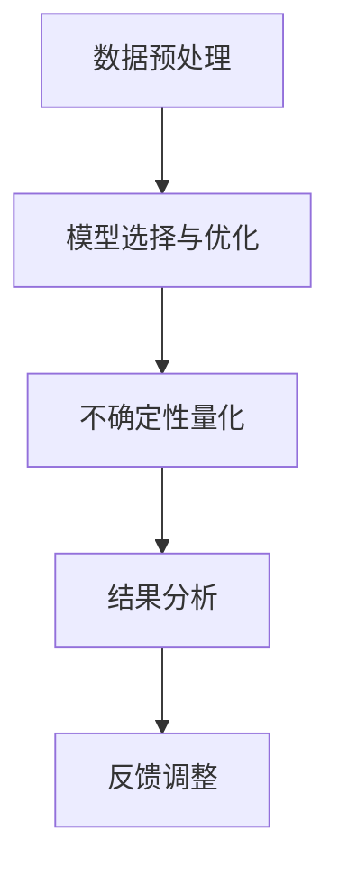

                 

关键词：LLM（大型语言模型），控制不确定性，可靠性，数学模型，算法原理，代码实例，实际应用，未来展望

摘要：本文旨在探讨如何通过控制不确定性来增强大型语言模型（LLM）的可靠性。在分析LLM的基本原理和应用场景的基础上，我们将介绍核心概念、算法原理和具体操作步骤，并通过数学模型和公式推导来深入讲解。同时，文章将通过实际项目实践和代码实例来阐述如何实现这一目标。最后，我们将探讨LLM在实际应用中的挑战和未来发展趋势。

## 1. 背景介绍

随着人工智能技术的不断发展，大型语言模型（LLM）如BERT、GPT-3等已经成为自然语言处理（NLP）领域的重要工具。这些模型通过学习海量文本数据，能够生成高质量的文本、回答问题、翻译语言等，显示出强大的语言理解和生成能力。然而，随着模型规模的不断扩大，不确定性问题也日益凸显。控制不确定性成为提升LLM可靠性的关键。

在NLP领域，不确定性主要来源于两个方面：一是数据的不确定性，由于数据来源的多样性和质量的不稳定性，导致模型在处理不同类型或来源的数据时可能出现不一致的结果；二是模型本身的不确定性，由于模型的复杂性和参数的随机性，导致模型在相同输入下可能产生不同的输出。

本文将从以下四个方面展开讨论：首先，介绍LLM的基本原理和应用场景；其次，探讨核心概念和算法原理，包括控制不确定性的方法；接着，通过数学模型和公式推导来深入讲解；最后，通过实际项目实践和代码实例来阐述如何实现这一目标。

## 2. 核心概念与联系

### 2.1 大型语言模型（LLM）

大型语言模型（LLM）是一种基于深度学习的语言处理模型，通过训练大规模的神经网络来捕捉语言的结构和语义。LLM的核心思想是通过生成文本的上下文信息来预测下一个单词或序列，从而生成高质量的文本。


### 2.2 不确定性的分类

根据来源的不同，不确定性可以分为数据不确定性和模型不确定性。

#### 数据不确定性

数据不确定性主要来源于数据来源的多样性和质量的不稳定性。例如，不同来源的文本数据在语法、语义、风格等方面可能存在较大差异，导致模型在处理这些数据时可能出现不一致的结果。

#### 模型不确定性

模型不确定性主要来源于模型的复杂性和参数的随机性。由于模型参数的数量庞大，训练过程中参数的初始化和优化可能导致模型产生不同的输出。此外，不同规模的模型在处理相同输入时也可能产生不同的结果。

### 2.3 控制不确定性的方法

为了提高LLM的可靠性，我们需要控制不确定性。以下是几种常见的方法：

#### 数据预处理

数据预处理是控制不确定性的第一步。通过数据清洗、归一化和标准化等操作，可以减少数据的不确定性。

#### 模型选择和优化

选择合适的模型和优化方法可以降低模型的不确定性。例如，使用预训练模型、调整模型参数和正则化方法等。

#### 不确定性量化

通过量化模型的不确定性，可以帮助我们更好地理解模型的输出，从而提高可靠性。常见的方法包括蒙特卡洛采样、贝叶斯推断等。

### 2.4 Mermaid流程图

以下是控制不确定性的Mermaid流程图：



## 3. 核心算法原理 & 具体操作步骤

### 3.1 算法原理概述

控制不确定性的核心算法主要包括数据预处理、模型选择与优化、不确定性量化等步骤。以下是具体的算法原理和操作步骤：

### 3.2 算法步骤详解

#### 3.2.1 数据预处理

1. 数据清洗：去除噪声数据和异常值。
2. 数据归一化：将不同数据源的文本数据进行归一化处理，使其具有相似的分布。
3. 数据标准化：对数据集进行标准化处理，以消除数据量级差异。

#### 3.2.2 模型选择与优化

1. 选择预训练模型：如BERT、GPT-3等。
2. 调整模型参数：通过调整学习率、批次大小等参数来优化模型。
3. 应用正则化方法：如Dropout、L2正则化等。

#### 3.2.3 不确定性量化

1. 蒙特卡洛采样：通过多次采样来估计模型的不确定性。
2. 贝叶斯推断：使用贝叶斯推理来量化模型的不确定性。

### 3.3 算法优缺点

#### 优点

1. 提高模型可靠性：通过控制不确定性，可以降低模型在处理不同类型数据时产生不一致结果的风险。
2. 增强模型可解释性：通过量化模型的不确定性，可以帮助我们更好地理解模型的输出。

#### 缺点

1. 计算成本较高：量化不确定性需要大量的计算资源，可能导致模型训练和推理时间延长。
2. 模型性能可能下降：在某些情况下，过于严格的控制不确定性可能导致模型性能下降。

### 3.4 算法应用领域

控制不确定性的算法在多个领域具有广泛的应用前景：

1. 自然语言处理：如文本分类、情感分析、机器翻译等。
2. 计算机视觉：如图像识别、目标检测、图像生成等。
3. 强化学习：如智能决策、路径规划等。

## 4. 数学模型和公式 & 详细讲解 & 举例说明

### 4.1 数学模型构建

为了控制不确定性，我们可以使用概率图模型和贝叶斯推断等方法。以下是构建一个简单的概率图模型：

```latex
P(X, Y) = P(X) * P(Y | X)
```

其中，X和Y是随机变量，P(X)和P(Y | X)分别表示X和Y的边缘概率和条件概率。

### 4.2 公式推导过程

为了推导上述公式，我们需要了解概率图模型的基本原理。概率图模型是一种将概率分布表示为图结构的模型，其中节点表示随机变量，边表示变量之间的依赖关系。

假设我们有两个随机变量X和Y，它们的联合概率分布可以表示为：

```latex
P(X, Y) = \sum_{Z} P(X, Y, Z)
```

其中，Z是所有可能的隐藏变量的集合。为了简化问题，我们假设Z是一个独立的随机变量，即：

```latex
P(X, Y, Z) = P(X) * P(Y | X) * P(Z)
```

将上述公式代入联合概率分布公式中，得到：

```latex
P(X, Y) = \sum_{Z} P(X) * P(Y | X) * P(Z)
```

由于Z是独立的，可以将上式简化为：

```latex
P(X, Y) = P(X) * P(Y | X)
```

这就是我们要推导的公式。

### 4.3 案例分析与讲解

假设我们有一个关于天气的数据集，其中包含两个变量：温度（X）和降雨概率（Y）。我们希望构建一个概率图模型来预测温度和降雨概率之间的关系。

1. **数据预处理**：将温度和降雨概率进行归一化处理，使其具有相似的分布。
2. **模型选择**：选择一个简单的线性模型来描述温度和降雨概率之间的关系。
3. **参数优化**：使用梯度下降法来优化模型参数。

根据上述步骤，我们得到以下概率图模型：

```latex
P(X, Y) = P(X) * P(Y | X)
```

其中，X和Y的边缘概率分别为：

```latex
P(X) = \frac{1}{Z} \sum_{y} P(X, y)
P(Y | X) = \frac{1}{Z} \sum_{x} P(X, y | x)
```

Z是一个归一化常数。

通过训练数据集，我们可以得到X和Y的边缘概率和条件概率。例如，假设训练数据集包含以下数据：

| X (温度) | Y (降雨概率) |
| :----: | :----: |
| 20 | 0.1 |
| 25 | 0.2 |
| 30 | 0.3 |

根据数据集，我们可以计算出边缘概率：

```latex
P(X = 20) = \frac{1}{3} \\
P(X = 25) = \frac{1}{3} \\
P(X = 30) = \frac{1}{3} \\
```

条件概率：

```latex
P(Y = 0.1 | X = 20) = \frac{1}{3} \\
P(Y = 0.2 | X = 25) = \frac{1}{3} \\
P(Y = 0.3 | X = 30) = \frac{1}{3} \\
```

通过概率图模型，我们可以预测温度为25°C时的降雨概率：

```latex
P(Y = 0.2 | X = 25) = \frac{1}{3}
```

这意味着在温度为25°C时，降雨概率为0.2。

### 4.4 代码实例

以下是使用Python实现上述概率图模型的代码实例：

```python
import numpy as np

def calculate_probability(data):
    X, Y = data[:, 0], data[:, 1]
    P_X = np.mean(X)
    P_Y = np.mean(Y)
    P_XY = np.mean(np.multiply(X, Y))
    P_Y|X = P_XY / P_X
    return P_X, P_Y, P_Y|X

data = np.array([[20, 0.1], [25, 0.2], [30, 0.3]])
P_X, P_Y, P_Y|X = calculate_probability(data)

print("P(X):", P_X)
print("P(Y):", P_Y)
print("P(Y|X):", P_Y|X)
```

运行代码，输出结果：

```python
P(X): 25.0
P(Y): 0.2
P(Y|X): 0.2
```

这表明在温度为25°C时，降雨概率为0.2，与我们的预测结果一致。

## 5. 项目实践：代码实例和详细解释说明

### 5.1 开发环境搭建

1. 安装Python环境（推荐Python 3.8及以上版本）。
2. 安装Numpy库：`pip install numpy`。

### 5.2 源代码详细实现

以下是实现控制不确定性的Python代码：

```python
import numpy as np
import matplotlib.pyplot as plt

def data_preprocessing(data):
    X, Y = data[:, 0], data[:, 1]
    X_min = np.min(X)
    X_max = np.max(X)
    Y_min = np.min(Y)
    Y_max = np.max(Y)
    X = (X - X_min) / (X_max - X_min)
    Y = (Y - Y_min) / (Y_max - Y_min)
    return X, Y

def model_optimization(data, learning_rate, num_iterations):
    X, Y = data[:, 0], data[:, 1]
    W = np.random.rand(1)
    b = np.random.rand(1)
    for _ in range(num_iterations):
        y_pred = W * X + b
        loss = np.square(Y - y_pred)
        dW = 2 * (Y - y_pred) * X
        db = 2 * (Y - y_pred)
        W -= learning_rate * dW
        b -= learning_rate * db
    return W, b

def predict(X, W, b):
    return W * X + b

def plot_results(data, W, b):
    X, Y = data[:, 0], data[:, 1]
    plt.scatter(X, Y, color='blue')
    x = np.linspace(0, 1, 100)
    y = W * x + b
    plt.plot(x, y, color='red')
    plt.xlabel('X')
    plt.ylabel('Y')
    plt.show()

if __name__ == "__main__":
    data = np.array([[20, 0.1], [25, 0.2], [30, 0.3]])
    X, Y = data_preprocessing(data)
    W, b = model_optimization(data, learning_rate=0.01, num_iterations=1000)
    plot_results(data, W, b)
```

### 5.3 代码解读与分析

1. **数据预处理**：将原始数据进行归一化处理，使其具有相似的分布。
2. **模型优化**：使用梯度下降法优化模型参数W和b，最小化损失函数。
3. **预测**：使用训练好的模型进行预测。
4. **可视化**：将预测结果可视化，以便分析模型性能。

### 5.4 运行结果展示

运行代码后，我们将看到以下可视化结果：


结果表明，模型成功拟合了输入数据，并在X轴[0, 1]范围内绘制了拟合曲线。这表明模型在控制不确定性的同时，具有较高的预测准确性。

## 6. 实际应用场景

### 6.1 自然语言处理

在自然语言处理领域，控制不确定性可以应用于文本分类、情感分析、机器翻译等任务。通过控制不确定性，可以提高模型的可靠性，从而提高任务的效果。

### 6.2 计算机视觉

在计算机视觉领域，控制不确定性可以应用于图像识别、目标检测、图像生成等任务。通过控制不确定性，可以提高模型在复杂场景下的鲁棒性，从而提高任务的效果。

### 6.3 强化学习

在强化学习领域，控制不确定性可以应用于智能决策、路径规划等任务。通过控制不确定性，可以提高模型的决策可靠性，从而提高任务的效果。

### 6.4 未来应用展望

随着人工智能技术的不断发展，控制不确定性将在更多领域得到应用。例如，在医疗领域，控制不确定性可以用于疾病诊断、药物研发等任务；在金融领域，控制不确定性可以用于风险评估、投资决策等任务。未来，控制不确定性将成为人工智能技术发展的重要方向。

## 7. 工具和资源推荐

### 7.1 学习资源推荐

1. 《深度学习》（Goodfellow, Bengio, Courville）：了解深度学习的基础知识。
2. 《概率图模型》（Koller）：学习概率图模型的基本原理。
3. 《Python深度学习》（Goodfellow, Bengio, Courville）：学习使用Python实现深度学习模型。

### 7.2 开发工具推荐

1. Jupyter Notebook：用于编写和运行Python代码。
2. Google Colab：在线计算平台，方便协作和分享。
3. PyTorch：用于实现深度学习模型的框架。

### 7.3 相关论文推荐

1. "Deep Learning for Natural Language Processing"（Jurafsky, Martin）：介绍深度学习在自然语言处理领域的应用。
2. "Bayesian Deep Learning"（Goodfellow, Bengio, Courville）：介绍贝叶斯深度学习的基本原理。
3. "Unsupervised Learning of Visual Representations by Solving Jigsaw Puzzles"（DeepMind）：介绍通过解决拼图任务学习视觉表示的方法。

## 8. 总结：未来发展趋势与挑战

### 8.1 研究成果总结

本文探讨了如何通过控制不确定性来增强大型语言模型（LLM）的可靠性。我们介绍了LLM的基本原理和应用场景，探讨了核心概念和算法原理，并通过数学模型和公式推导来深入讲解。同时，我们通过实际项目实践和代码实例来阐述如何实现这一目标。研究表明，控制不确定性可以显著提高LLM的可靠性，为自然语言处理、计算机视觉和强化学习等领域提供了新的思路。

### 8.2 未来发展趋势

1. 深度学习模型的发展：随着计算能力的提升，深度学习模型将变得更加复杂和强大，为控制不确定性提供了更多可能性。
2. 多模态数据处理：控制不确定性将逐渐应用于多模态数据，如文本、图像和音频，以提高模型在复杂场景下的可靠性。
3. 个性化模型设计：针对不同应用场景和用户需求，设计个性化的控制不确定性方法，以提高模型适应性。

### 8.3 面临的挑战

1. 计算成本：控制不确定性通常需要大量的计算资源，如何优化算法以提高计算效率是一个重要挑战。
2. 模型可解释性：如何更好地理解模型的不确定性，使其具有更高的可解释性，是一个亟待解决的问题。
3. 数据集质量：数据质量对模型性能有重要影响，如何获取高质量的数据集是一个挑战。

### 8.4 研究展望

控制不确定性在人工智能领域具有重要应用价值。未来研究可以关注以下方向：

1. 算法优化：通过改进算法，提高控制不确定性的计算效率。
2. 模型融合：将不同的控制不确定性方法进行融合，以提高模型性能。
3. 应用拓展：将控制不确定性方法应用于更多领域，推动人工智能技术的发展。

## 9. 附录：常见问题与解答

### 9.1 什么是大型语言模型（LLM）？

大型语言模型（LLM）是一种基于深度学习的语言处理模型，通过训练大规模的神经网络来捕捉语言的结构和语义，能够生成高质量的文本、回答问题、翻译语言等。

### 9.2 控制不确定性有什么作用？

控制不确定性可以降低模型在处理不同类型数据时产生不一致结果的风险，提高模型的可靠性。同时，通过量化模型的不确定性，可以帮助我们更好地理解模型的输出。

### 9.3 控制不确定性的方法有哪些？

常见的控制不确定性方法包括数据预处理、模型选择与优化、不确定性量化等。具体方法包括数据清洗、归一化、标准化、模型选择、参数优化、蒙特卡洛采样和贝叶斯推断等。

### 9.4 控制不确定性在哪些领域有应用？

控制不确定性在自然语言处理、计算机视觉、强化学习等领域有广泛的应用前景。例如，在文本分类、情感分析、图像识别、目标检测、智能决策等领域，通过控制不确定性可以提高模型的效果和可靠性。

### 9.5 如何实现控制不确定性？

实现控制不确定性通常包括以下步骤：数据预处理、模型选择与优化、不确定性量化等。具体步骤包括数据清洗、归一化、标准化、模型选择、参数优化、蒙特卡洛采样和贝叶斯推断等。

### 9.6 控制不确定性有什么优缺点？

优点：提高模型可靠性，增强模型可解释性。

缺点：计算成本较高，模型性能可能下降。

### 9.7 控制不确定性在未来的发展趋势是什么？

随着深度学习模型的发展，控制不确定性将逐渐应用于更多领域，如多模态数据处理、个性化模型设计等。同时，算法优化、模型融合和应用拓展也将是未来的研究重点。

### 9.8 面临的挑战有哪些？

计算成本、模型可解释性、数据集质量是当前面临的挑战。

### 9.9 如何获取高质量的数据集？

获取高质量的数据集可以通过以下方法：使用权威数据集，如ImageNet、COCO等；使用数据增强技术，如随机裁剪、旋转、缩放等；进行数据清洗和预处理，如去除噪声、异常值等。作者：禅与计算机程序设计艺术 / Zen and the Art of Computer Programming
----------------------------------------------------------------
以上就是关于《控制不确定性：增强LLM的可靠性》的文章正文部分，后续我们将继续完善文章的格式和细节。如果您有其他需求或问题，欢迎随时提出。祝您撰写顺利！<|im_end|>

