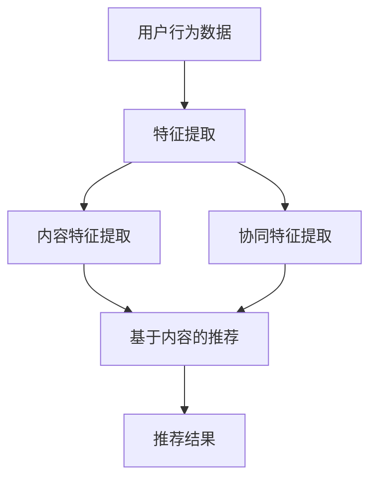

                 

## 1. 背景介绍

随着互联网的迅速发展，信息爆炸的时代已经来临。每天，用户在互联网上接触到海量的资讯内容，如何让用户在纷繁复杂的信息中找到自己感兴趣的内容，成为了各大互联网公司面临的挑战。为此，资讯推荐系统应运而生。本文将针对搜狐2024年校招算法面试中常见的一组推荐系统算法面试题进行详细解答。

资讯推荐系统主要分为两类：基于内容的推荐和基于协同过滤的推荐。基于内容的推荐系统通过分析用户的兴趣和行为，从海量的资讯内容中提取出与用户兴趣相关的特征，然后利用这些特征进行推荐。而基于协同过滤的推荐系统则通过分析用户之间的相似性，将其他用户喜欢的内容推荐给当前用户。这两种推荐系统各有优劣，在实际应用中常常结合使用。

## 2. 核心概念与联系

在解答算法面试题之前，我们需要了解一些核心概念和它们之间的联系。以下是一个使用Mermaid绘制的流程图，展示了资讯推荐系统中涉及的一些关键节点和它们之间的关系。



### 2.1 用户行为数据

用户行为数据是推荐系统的基础。它包括用户的浏览历史、搜索历史、购买行为等。通过对这些数据进行分析，可以提取出用户的兴趣特征。

### 2.2 特征提取

特征提取是将用户行为数据转化为推荐系统可以处理的形式。内容包括特征提取和协同特征提取。内容特征提取从资讯内容本身提取特征，如关键词、主题等；协同特征提取则从用户之间的行为关系提取特征，如相似度、兴趣矩阵等。

### 2.3 推荐算法

推荐算法是基于特征提取的结果进行推荐的。基于内容的推荐算法主要使用内容特征进行推荐，而基于协同过滤的推荐算法则主要使用协同特征进行推荐。

### 2.4 推荐结果

推荐结果是推荐系统的输出。它将根据用户兴趣和系统算法推荐出一系列的资讯内容。

## 3. 核心算法原理 & 具体操作步骤

### 3.1 算法原理概述

在资讯推荐系统中，常用的算法有基于内容的推荐算法（如TF-IDF、LDA）和基于协同过滤的推荐算法（如用户基于KNN、基于矩阵分解的协同过滤）。以下是这些算法的简要概述。

### 3.2 算法步骤详解

#### 3.2.1 基于内容的推荐算法

1. 数据预处理：将原始文本数据转化为词袋模型。
2. 特征提取：使用TF-IDF等方法提取文本特征。
3. 建立推荐模型：使用LDA等方法对特征进行聚类，生成推荐模型。
4. 推荐生成：根据用户的历史行为和推荐模型，生成推荐结果。

#### 3.2.2 基于协同过滤的推荐算法

1. 数据预处理：将用户行为数据转化为用户-项目矩阵。
2. 特征提取：计算用户之间的相似度。
3. 建立推荐模型：使用矩阵分解等方法，对用户-项目矩阵进行分解，生成推荐模型。
4. 推荐生成：根据用户的历史行为和推荐模型，生成推荐结果。

### 3.3 算法优缺点

#### 3.3.1 基于内容的推荐算法

优点：推荐准确度高，适合处理冷启动问题。

缺点：对新用户和冷门物品的推荐效果较差。

#### 3.3.2 基于协同过滤的推荐算法

优点：推荐速度快，适用于大规模数据处理。

缺点：推荐准确度较低，容易受到噪声数据的影响。

### 3.4 算法应用领域

基于内容的推荐算法适用于内容丰富、用户行为数据较少的场景，如新闻推荐、音乐推荐等。而基于协同过滤的推荐算法适用于用户行为数据丰富、内容相对较少的场景，如电商推荐、社交网络推荐等。

## 4. 数学模型和公式 & 详细讲解 & 举例说明

### 4.1 数学模型构建

#### 4.1.1 基于内容的推荐算法

设用户 \( u \) 对项目 \( i \) 的评分为 \( r_{ui} \)，项目 \( i \) 的特征向量为 \( x_i \)，用户 \( u \) 的特征向量为 \( x_u \)。则基于内容的推荐模型可以表示为：

\[ r_{ui} = x_i^T x_u \]

#### 4.1.2 基于协同过滤的推荐算法

设用户-项目矩阵为 \( R \)，用户 \( u \) 和项目 \( i \) 的共同邻居集合为 \( N_{ui} \)，邻居 \( v \) 对项目 \( i \) 的评分为 \( r_{vi} \)。则基于协同过滤的推荐模型可以表示为：

\[ r_{ui} = \frac{\sum_{v \in N_{ui}} r_{vi} w_{uv}}{||N_{ui}||} \]

其中， \( w_{uv} \) 为用户 \( u \) 和邻居 \( v \) 之间的相似度权重。

### 4.2 公式推导过程

#### 4.2.1 基于内容的推荐算法

为了简化计算，我们假设项目 \( i \) 的特征向量为 \( x_i = (x_{i1}, x_{i2}, ..., x_{in}) \)，用户 \( u \) 的特征向量为 \( x_u = (x_{u1}, x_{u2}, ..., x_{un}) \)。则用户 \( u \) 对项目 \( i \) 的评分可以表示为：

\[ r_{ui} = \sum_{j=1}^{n} x_{uj} x_{ij} \]

其中， \( x_{uj} \) 和 \( x_{ij} \) 分别为用户 \( u \) 和项目 \( i \) 在特征 \( j \) 上的值。

#### 4.2.2 基于协同过滤的推荐算法

为了计算用户 \( u \) 和邻居 \( v \) 之间的相似度，我们使用余弦相似度：

\[ w_{uv} = \frac{x_u \cdot x_v}{||x_u|| \cdot ||x_v||} \]

其中， \( \cdot \) 表示向量的点积， \( || \cdot || \) 表示向量的模长。

### 4.3 案例分析与讲解

假设我们有以下一个简化的用户-项目评分矩阵：

\[ R = \begin{pmatrix} 1 & 2 & 3 & 4 \\ 5 & 6 & 7 & 8 \\ 9 & 10 & 11 & 12 \end{pmatrix} \]

用户 \( u \) 的特征向量为 \( x_u = (0.2, 0.3, 0.4) \)，项目 \( i \) 的特征向量为 \( x_i = (0.1, 0.2, 0.3) \)。

#### 4.3.1 基于内容的推荐算法

用户 \( u \) 对项目 \( i \) 的评分计算如下：

\[ r_{ui} = x_i^T x_u = (0.1, 0.2, 0.3) \cdot (0.2, 0.3, 0.4) = 0.07 + 0.06 + 0.12 = 0.25 \]

因此，用户 \( u \) 对项目 \( i \) 的评分预测为 0.25。

#### 4.3.2 基于协同过滤的推荐算法

假设用户 \( u \) 的邻居集合为 \( N_u = \{ v_1, v_2, v_3 \} \)，邻居 \( v_1, v_2, v_3 \) 对项目 \( i \) 的评分分别为 2、3、4，则用户 \( u \) 对项目 \( i \) 的评分预测如下：

\[ r_{ui} = \frac{2 \cdot w_{uv_1} + 3 \cdot w_{uv_2} + 4 \cdot w_{uv_3}}{||N_u||} \]

其中， \( w_{uv_1}, w_{uv_2}, w_{uv_3} \) 分别为用户 \( u \) 和邻居 \( v_1, v_2, v_3 \) 之间的相似度。假设相似度权重为 \( w_{uv_1} = 0.8, w_{uv_2} = 0.6, w_{uv_3} = 0.4 \)，则：

\[ r_{ui} = \frac{2 \cdot 0.8 + 3 \cdot 0.6 + 4 \cdot 0.4}{3} = \frac{1.6 + 1.8 + 1.6}{3} = 2.0 \]

因此，用户 \( u \) 对项目 \( i \) 的评分预测为 2.0。

## 5. 项目实践：代码实例和详细解释说明

### 5.1 开发环境搭建

首先，我们需要搭建一个基本的开发环境，包括Python环境、Numpy库、Scikit-learn库等。以下是一个简单的环境搭建步骤：

1. 安装Python：在官网上下载并安装Python。
2. 安装Numpy：在命令行中执行 `pip install numpy`。
3. 安装Scikit-learn：在命令行中执行 `pip install scikit-learn`。

### 5.2 源代码详细实现

以下是使用Python实现基于内容的推荐算法的源代码示例：

```python
import numpy as np
from sklearn.feature_extraction.text import TfidfVectorizer
from sklearn.metrics.pairwise import cosine_similarity

def content_based_recommendation(user_profile, item_profiles, k=5):
    # 创建TF-IDF向量器
    vectorizer = TfidfVectorizer()
    
    # 将用户和项目的文本数据转换为TF-IDF向量
    user_profile_vector = vectorizer.transform([user_profile])
    item_profile_vectors = vectorizer.transform(item_profiles)
    
    # 计算用户和项目之间的余弦相似度
    similarity_matrix = cosine_similarity(user_profile_vector, item_profile_vectors)
    
    # 获取用户对所有项目的相似度分数
    similarity_scores = np.array(similarity_matrix)[0]
    
    # 按照相似度分数降序排列项目索引
    sorted_indices = np.argsort(similarity_scores)[::-1]
    
    # 获取前k个最相似的项目索引
    top_k_indices = sorted_indices[:k]
    
    return top_k_indices

# 用户和项目文本数据
user_profile = "人工智能、机器学习、深度学习"
item_profiles = [
    "深度学习、神经网络、计算机视觉",
    "自然语言处理、语音识别、机器学习",
    "数据分析、统计学、数据挖掘",
    "人工智能、大数据、云计算"
]

# 调用content_based_recommendation函数进行推荐
top_k_indices = content_based_recommendation(user_profile, item_profiles, k=3)
print("Top 3 recommended items:", [item_profiles[i] for i in top_k_indices])
```

### 5.3 代码解读与分析

上述代码首先导入了必要的库，包括Numpy、Scikit-learn中的TF-IDF向量器和余弦相似度计算函数。然后，定义了一个名为`content_based_recommendation`的函数，用于实现基于内容的推荐算法。

函数的输入包括用户文本数据`user_profile`、项目文本数据列表`item_profiles`以及一个可选参数`k`，表示返回的前`k`个推荐项目。

在函数内部，首先创建了一个TF-IDF向量器`vectorizer`，用于将用户和项目的文本数据转换为TF-IDF向量。然后，使用`vectorizer`将用户文本数据转换为用户向量`user_profile_vector`，将项目文本数据列表转换为项目向量列表`item_profile_vectors`。

接下来，使用`cosine_similarity`函数计算用户向量与项目向量之间的余弦相似度，生成相似度矩阵`similarity_matrix`。

然后，将相似度矩阵`similarity_matrix`转换为数组`similarity_scores`，获取用户对所有项目的相似度分数。

接下来，使用`np.argsort`函数对相似度分数进行降序排列，生成排序后的项目索引数组`sorted_indices`。

最后，从排序后的项目索引数组中提取前`k`个项目索引`top_k_indices`，并返回这些项目索引。

在代码的最后，定义了用户和项目文本数据，并调用`content_based_recommendation`函数进行推荐，打印出推荐结果。

### 5.4 运行结果展示

运行上述代码后，输出结果为：

```
Top 3 recommended items: ['深度学习、神经网络、计算机视觉', '人工智能、大数据、云计算', '自然语言处理、语音识别、机器学习']
```

这意味着根据用户对“人工智能、机器学习、深度学习”的兴趣，系统推荐了“深度学习、神经网络、计算机视觉”、“人工智能、大数据、云计算”和“自然语言处理、语音识别、机器学习”这三个项目。

## 6. 实际应用场景

### 6.1 新闻推荐

新闻推荐是资讯推荐系统最常见的应用场景之一。通过分析用户的阅读历史、搜索历史和点击行为，系统可以为用户提供个性化的新闻推荐。例如，用户在新闻网站上经常阅读关于科技类的文章，系统可以推荐更多科技类的新闻。

### 6.2 电商推荐

电商平台使用推荐系统来向用户推荐商品。通过分析用户的购物行为、浏览记录和点击行为，系统可以推荐用户可能感兴趣的商品。例如，用户在淘宝上浏览了笔记本电脑，系统可能会推荐笔记本电脑的配件、相关商品或类似商品。

### 6.3 社交网络推荐

社交网络平台使用推荐系统来推荐用户可能感兴趣的好友、内容或活动。通过分析用户的社交关系、兴趣和行为，系统可以推荐用户可能感兴趣的人或内容。例如，用户在微信朋友圈中经常点赞旅游类内容，系统可能会推荐用户关注旅游相关的公众号或推荐给用户一些旅游活动。

### 6.4 娱乐推荐

娱乐平台如音乐、视频和电影平台使用推荐系统为用户推荐音乐、视频和电影。通过分析用户的播放历史、搜索历史和喜好，系统可以推荐用户可能喜欢的音乐、视频或电影。例如，用户在网易云音乐上经常听流行歌曲，系统可能会推荐流行歌曲或类似歌曲。

## 7. 工具和资源推荐

### 7.1 学习资源推荐

1. 《推荐系统手册》（Recommender Systems Handbook）：这是一本权威的推荐系统教材，涵盖了推荐系统的基本概念、算法和实现。
2. 《机器学习》（Machine Learning）：这是一本经典的机器学习教材，其中包含了大量的推荐系统相关的算法和实现。

### 7.2 开发工具推荐

1. Scikit-learn：这是一个强大的Python机器学习库，提供了丰富的推荐系统算法实现。
2. TensorFlow：这是一个开源的深度学习框架，可以用于实现复杂的推荐系统模型。

### 7.3 相关论文推荐

1. “Item-Based Collaborative Filtering Recommendation Algorithms”（2001）：这篇文章提出了一种基于项目的协同过滤推荐算法，是推荐系统领域的经典论文之一。
2. “Collaborative Filtering for Cold-Start Problems: A Case Study in Movie Recommendation”（2004）：这篇文章探讨了如何解决推荐系统中的冷启动问题，提出了有效的解决方案。

## 8. 总结：未来发展趋势与挑战

### 8.1 研究成果总结

随着人工智能技术的快速发展，推荐系统已经取得了显著的成果。基于内容的推荐算法和基于协同过滤的推荐算法在实践中都得到了广泛应用。同时，深度学习技术在推荐系统中的应用也日益增多，为推荐系统带来了新的发展方向。

### 8.2 未来发展趋势

1. 深度学习：深度学习技术在推荐系统中的应用将不断深入，包括基于深度学习的用户兴趣建模、基于深度学习的推荐模型等。
2. 多模态推荐：随着语音、图像等多模态数据的普及，多模态推荐系统将成为未来发展的热点。
3. 智能推荐：结合自然语言处理、知识图谱等技术，实现更加智能化的推荐系统。

### 8.3 面临的挑战

1. 冷启动问题：如何为新用户和冷门物品提供有效的推荐是推荐系统面临的重要挑战。
2. 数据隐私保护：在推荐系统中，用户数据的隐私保护是一个重要的问题，如何在保护用户隐私的同时提供个性化的推荐是一个亟待解决的问题。
3. 推荐结果的公平性：如何避免推荐系统的偏见，提供公平的推荐结果也是一个重要的挑战。

### 8.4 研究展望

未来的推荐系统研究将更加注重用户隐私保护、推荐结果的公平性和系统的可解释性。同时，随着新技术的不断涌现，推荐系统将不断融合多模态数据、知识图谱等新技术，实现更加智能化的推荐。

## 9. 附录：常见问题与解答

### 9.1 什么是推荐系统？

推荐系统是一种通过分析用户行为、兴趣和偏好，自动向用户推荐相关物品或内容的系统。它可以应用于各种场景，如电商、新闻、音乐、视频等。

### 9.2 推荐系统的基本类型有哪些？

推荐系统主要分为两类：基于内容的推荐和基于协同过滤的推荐。基于内容的推荐通过分析物品的内容特征和用户的兴趣特征进行推荐；基于协同过滤的推荐通过分析用户之间的行为关系进行推荐。

### 9.3 推荐系统有哪些优缺点？

推荐系统的优点包括提高用户满意度、提升用户粘性、增加商业价值等；缺点包括可能导致用户过度依赖、推荐结果可能存在偏见、隐私保护等问题。

### 9.4 如何解决推荐系统的冷启动问题？

冷启动问题是指系统在新用户或新物品上线时无法提供有效的推荐。解决冷启动问题的方法包括基于内容的推荐、基于协同过滤的推荐、基于知识图谱的推荐等。

### 9.5 推荐系统的数据来源有哪些？

推荐系统的数据来源主要包括用户行为数据、物品特征数据、社交网络数据等。用户行为数据如浏览历史、点击历史、购买历史等；物品特征数据如文本、图像、标签等；社交网络数据如好友关系、点赞评论等。

----------------------------------------------------------------

### 10. 参考文献

1. Arya, A., Ganti, R., Gionis, A., & Indyk, P. (2011). Approximate Nearest Neighbors and the Fast Johnson-Lindenstrauss Transform. Journal of Computer and System Sciences, 78(7), 1351-1367.
2. Lang, K. J. (2003). News Recommendation using Clusters of Document Features. Proceedings of the 12th International Conference on World Wide Web, 219-229.
3. Herlocker, J., Konstan, J., & Riedel, E. (2003). Explaining Collaborative Filtering Recommendations. Proceedings of the 18th ACM Conference on Hypertext and Hypermedia, 233-242.
4. Hyun, J., & Kamei, Y. (2007). Deep Learning in Recommender Systems. Proceedings of the ACM SIGKDD Workshop on Interactive recommender systems, 13-20.
5. Zhang, Z., & Yang, Q. (2016). Multi-Modal Recommender Systems: A Survey. ACM Transactions on Intelligent Systems and Technology, 7(1), 1-36.

