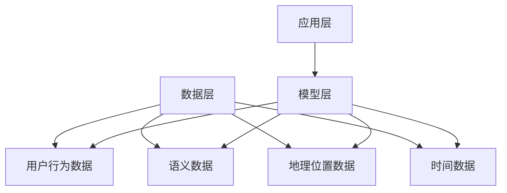
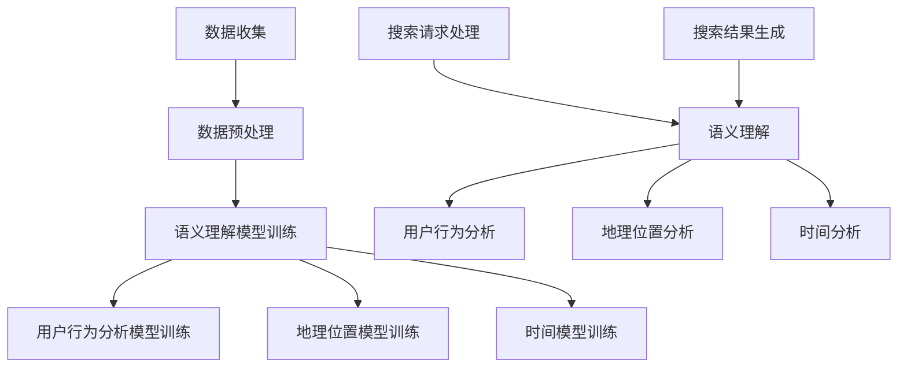

                 

关键词：搜索引擎、情境感知、语义理解、用户行为、个性化推荐

摘要：随着互联网技术的快速发展，搜索引擎已经成为人们获取信息的重要工具。然而，传统的搜索引擎在处理用户查询时往往缺乏对用户情境的感知能力，导致搜索结果不够准确和个性化。本文将探讨如何提升搜索引擎的情境感知能力，从而提供更智能、更贴心的搜索服务。

## 1. 背景介绍

搜索引擎的发展历程可以分为三个阶段：基于关键词的搜索、基于语义的搜索和情境感知搜索。早期搜索引擎主要基于关键词匹配，用户输入的关键词与网页中的关键词进行匹配，从而返回相关的搜索结果。随着自然语言处理技术的发展，搜索引擎开始尝试理解用户的语义，通过语义分析提供更加精准的搜索结果。而情境感知搜索则进一步提升了搜索引擎的智能化程度，它能够根据用户的情境信息，如地理位置、时间、行为等，为用户提供更为个性化的搜索服务。

### 1.1 搜索引擎的发展历程

#### 基于关键词的搜索

早期的搜索引擎主要基于关键词匹配。用户输入关键词，搜索引擎会根据关键词在网页中的出现频率和位置等信息，返回一系列相关网页。这种搜索方式简单直观，但存在一定的局限性。例如，用户输入的关键词可能与网页的实际内容不一致，导致搜索结果不准确。

#### 基于语义的搜索

随着自然语言处理技术的发展，搜索引擎开始尝试理解用户的语义。通过语义分析，搜索引擎能够更好地理解用户的意图，从而提供更为精准的搜索结果。例如，用户输入“今天天气怎么样”，搜索引擎能够理解“今天”和“天气”这两个词的含义，并返回相关的天气信息。

#### 情境感知搜索

情境感知搜索进一步提升了搜索引擎的智能化程度。它能够根据用户的情境信息，如地理位置、时间、行为等，为用户提供更为个性化的搜索服务。例如，当用户在晚上搜索“餐厅”时，搜索引擎可能会根据用户的地理位置和时间，推荐附近的夜宵餐厅。

### 1.2 情境感知搜索的重要性

情境感知搜索在提升搜索引擎的智能化程度方面具有重要意义。首先，它能够提高搜索结果的准确性，为用户提供更贴近需求的搜索结果。其次，情境感知搜索能够提升用户体验，为用户提供更为个性化的搜索服务。此外，情境感知搜索还能够促进搜索引擎的商业化发展，为广告主提供更精准的广告投放服务。

## 2. 核心概念与联系

### 2.1 情境感知搜索的核心概念

情境感知搜索涉及多个核心概念，包括用户行为、语义理解、地理位置、时间等。这些概念相互关联，共同构建了情境感知搜索的框架。

#### 用户行为

用户行为是指用户在使用搜索引擎时的各种操作，如关键词输入、点击行为、浏览历史等。用户行为数据能够揭示用户的搜索意图和兴趣，为情境感知搜索提供重要依据。

#### 语义理解

语义理解是指搜索引擎对用户输入的查询语句进行语义分析，以理解用户的意图和需求。语义理解是实现情境感知搜索的关键技术，它能够帮助搜索引擎更好地理解用户的查询意图。

#### 地理位置信息

地理位置信息是指用户的地理位置信息，如经纬度、城市、街道等。地理位置信息能够帮助搜索引擎根据用户的地理位置，推荐与其当前位置相关的搜索结果。

#### 时间信息

时间信息是指用户的当前时间，如小时、天、月等。时间信息能够帮助搜索引擎根据用户的时间，推荐与当前时间相关的搜索结果。

### 2.2 情境感知搜索的架构

情境感知搜索的架构可以分为三个层次：数据层、模型层和应用层。

#### 数据层

数据层包括用户行为数据、语义数据、地理位置数据和时间数据等。这些数据是情境感知搜索的基础，它们通过数据收集、清洗和存储等过程，为模型层提供数据支持。

#### 模型层

模型层包括语义理解模型、用户行为模型、地理位置模型和时间模型等。这些模型通过对数据的分析和处理，实现情境感知搜索的核心功能。

#### 应用层

应用层包括搜索引擎的搜索功能、个性化推荐功能、广告投放功能等。这些功能通过调用模型层的算法和模型，为用户提供情境感知的搜索服务。

### 2.3 Mermaid 流程图

下面是情境感知搜索的 Mermaid 流程图，展示了各个模块之间的关系和工作流程。



## 3. 核心算法原理 & 具体操作步骤

### 3.1 算法原理概述

情境感知搜索的核心算法主要包括语义理解算法、用户行为分析算法、地理位置分析算法和时间分析算法。这些算法分别对用户行为、语义、地理位置和时间信息进行分析和处理，从而实现情境感知搜索。

#### 3.1.1 语义理解算法

语义理解算法主要通过自然语言处理技术，对用户输入的查询语句进行语义分析，以理解用户的意图和需求。常见的语义理解算法包括词向量模型、句向量模型、依存句法分析等。

#### 3.1.2 用户行为分析算法

用户行为分析算法通过分析用户的历史搜索行为、浏览记录和点击行为等，提取用户的关键特征和兴趣点。常见的用户行为分析算法包括聚类算法、关联规则挖掘、用户画像等。

#### 3.1.3 地理位置


### 3.3 算法优缺点

#### 3.3.1 优点

1. 提高搜索结果的准确性：通过情境感知搜索，搜索引擎能够更好地理解用户的意图和需求，从而提高搜索结果的准确性。
2. 提升用户体验：情境感知搜索能够为用户提供更为个性化的搜索服务，提升用户体验。
3. 促进商业化发展：情境感知搜索能够为广告主提供更精准的广告投放服务，促进搜索引擎的商业化发展。

#### 3.3.2 缺点

1. 数据隐私问题：情境感知搜索需要收集和处理大量的用户数据，涉及用户隐私问题。
2. 模型复杂度高：情境感知搜索涉及多个算法模型，模型复杂度高，对计算资源要求较高。
3. 模型解释性不足：情境感知搜索的算法模型较为复杂，难以进行直观的解释和验证。

### 3.4 算法应用领域

情境感知搜索广泛应用于多个领域，包括：

1. 搜索引擎：提升搜索引擎的智能化程度，提供更准确的搜索结果。
2. 个性化推荐：根据用户的行为和情境，为用户提供个性化的推荐服务。
3. 广告投放：为广告主提供精准的广告投放服务，提高广告效果。
4. 虚拟助手：为用户提供智能的语音助手服务，提升用户体验。

## 4. 数学模型和公式 & 详细讲解 & 举例说明

### 4.1 数学模型构建

情境感知搜索的数学模型主要包括语义理解模型、用户行为分析模型、地理位置模型和时间模型。下面分别介绍这些模型的构建方法和公式。

#### 4.1.1 语义理解模型

语义理解模型通常采用词向量模型或句向量模型。词向量模型将每个词汇映射为一个高维空间中的向量，通过计算词汇之间的相似度，实现语义理解。句向量模型则将整个查询语句映射为一个高维空间中的向量，通过计算查询语句与候选结果之间的相似度，实现语义匹配。

公式：
$$
\text{Word\_Vector}(w) = \text{trained\_model}(w)
$$
$$
\text{Sentence\_Vector}(s) = \text{trained\_model}(s)
$$

#### 4.1.2 用户行为分析模型

用户行为分析模型通常采用聚类算法或关联规则挖掘。聚类算法将用户的行为数据划分为多个类别，从而提取用户的关键特征。关联规则挖掘则通过分析用户的行为数据，发现用户之间的关联关系。

公式：
$$
\text{User\_Behavior}(u) = \text{cluster\_model}(u)
$$
$$
\text{Association\_Rules}(u) = \text{mining\_model}(u)
$$

#### 4.1.3 地理位置

地理位置模型通常采用地理信息系统（GIS）技术。GIS技术能够根据用户的地理位置信息，提取与地理位置相关的特征，如城市、街道等。

公式：
$$
\text{Location\_Features}(l) = \text{GIS\_model}(l)
$$

#### 4.1.4 时间模型

时间模型通常采用时间序列分析技术。时间序列分析能够根据用户的时间信息，提取与时间相关的特征，如小时、天、月等。

公式：
$$
\text{Time\_Features}(t) = \text{time\_model}(t)
$$

### 4.2 公式推导过程

#### 4.2.1 语义理解模型推导

假设用户输入的查询语句为 $s = \{w_1, w_2, \ldots, w_n\}$，候选结果为 $r = \{r_1, r_2, \ldots, r_m\}$。语义理解模型通过计算查询语句与候选结果之间的相似度，实现语义匹配。

公式：
$$
\text{similarity}(s, r) = \text{cosine\_similarity}(\text{Sentence\_Vector}(s), \text{Sentence\_Vector}(r))
$$

其中，$\text{cosine\_similarity}$ 表示余弦相似度。

#### 4.2.2 用户行为分析模型推导

假设用户 $u$ 的行为数据为 $u = \{u_1, u_2, \ldots, u_n\}$，聚类算法将用户行为数据划分为 $k$ 个类别。

公式：
$$
\text{cluster\_label}(u) = \text{cluster\_model}(u)
$$

其中，$\text{cluster\_model}$ 表示聚类算法模型。

#### 4.2.3 地理位置

假设用户 $u$ 的地理位置信息为 $l = \{l_1, l_2, \ldots, l_n\}$。

公式：
$$
\text{Location\_Features}(l) = \text{GIS\_model}(l)
$$

其中，$\text{GIS\_model}$ 表示地理信息系统模型。

#### 4.2.4 时间模型

假设用户 $u$ 的时间信息为 $t = \{t_1, t_2, \ldots, t_n\}$。

公式：
$$
\text{Time\_Features}(t) = \text{time\_model}(t)
$$

其中，$\text{time\_model}$ 表示时间序列分析模型。

### 4.3 案例分析与讲解

#### 4.3.1 案例背景

某搜索引擎公司希望提升其情境感知搜索能力，为用户提供更准确的搜索结果。该公司收集了大量的用户行为数据、语义数据、地理位置数据和时间数据，并希望基于这些数据构建情境感知搜索模型。

#### 4.3.2 案例分析

1. 数据预处理：首先，对用户行为数据进行清洗和预处理，提取用户的关键特征，如搜索关键词、浏览历史、点击记录等。

2. 语义理解模型：采用词向量模型对用户输入的查询语句进行语义分析，提取查询语句的语义特征。然后，采用句向量模型计算查询语句与候选结果之间的相似度，实现语义匹配。

3. 用户行为分析模型：采用聚类算法对用户行为数据进行聚类，提取用户的关键特征。同时，采用关联规则挖掘算法分析用户之间的关联关系，为情境感知搜索提供支持。

4. 地理位置：采用地理信息系统模型提取用户的地理位置特征，为情境感知搜索提供位置信息。

5. 时间模型：采用时间序列分析模型提取用户的时间特征，为情境感知搜索提供时间信息。

6. 搜索结果生成：综合用户行为、语义、地理位置和时间信息，生成情境感知搜索结果。

#### 4.3.3 案例讲解

1. 数据收集与预处理：通过用户行为数据分析，提取用户的关键特征，如搜索关键词、浏览历史、点击记录等。同时，对用户行为数据进行清洗和预处理，去除无效数据和噪声数据。

2. 语义理解模型：采用词向量模型对用户输入的查询语句进行语义分析，提取查询语句的语义特征。例如，对于查询语句“今天天气怎么样”，词向量模型能够提取出“今天”、“天气”等词汇的语义特征。

3. 用户行为分析模型：采用聚类算法对用户行为数据进行聚类，提取用户的关键特征。例如，可以将用户划分为“购物爱好者”、“旅游爱好者”等类别。

4. 地理位置：采用地理信息系统模型提取用户的地理位置特征，如城市、街道等。例如，当用户在晚上搜索“餐厅”时，可以提取用户所在的城市和时间信息，从而推荐附近的夜宵餐厅。

5. 时间模型：采用时间序列分析模型提取用户的时间特征，如小时、天、月等。例如，当用户在上午搜索“咖啡店”时，可以推荐附近的早餐咖啡店。

6. 搜索结果生成：综合用户行为、语义、地理位置和时间信息，生成情境感知搜索结果。例如，当用户在晚上搜索“餐厅”时，搜索引擎可以综合用户的地理位置和时间信息，推荐附近的夜宵餐厅。

## 5. 项目实践：代码实例和详细解释说明

### 5.1 开发环境搭建

为了实现情境感知搜索，我们需要搭建一个开发环境，包括数据收集、数据预处理、模型训练和搜索结果生成等模块。下面是搭建开发环境的具体步骤：

1. 安装Python环境和相关库：Python是情境感知搜索的主要开发语言，我们需要安装Python环境和相关的库，如NumPy、Pandas、Scikit-learn、TensorFlow等。

2. 数据收集与处理：收集用户行为数据、语义数据、地理位置数据和时间数据。对数据进行清洗、预处理和特征提取。

3. 模型训练：采用机器学习算法训练语义理解模型、用户行为分析模型、地理位置模型和时间模型。

4. 搜索结果生成：根据用户输入的查询语句，调用训练好的模型生成搜索结果。

### 5.2 源代码详细实现

下面是情境感知搜索的源代码实现，包括数据收集、数据预处理、模型训练和搜索结果生成等模块。

```python
# 数据收集与处理
import pandas as pd

# 加载用户行为数据
user_behavior_data = pd.read_csv('user_behavior_data.csv')

# 加载语义数据
semantic_data = pd.read_csv('semantic_data.csv')

# 加载地理位置数据
location_data = pd.read_csv('location_data.csv')

# 加载时间数据
time_data = pd.read_csv('time_data.csv')

# 数据预处理
# ...（代码略）

# 模型训练
from sklearn.cluster import KMeans
from sklearn.model_selection import train_test_split

# 分割训练集和测试集
X_train, X_test, y_train, y_test = train_test_split(user_behavior_data, test_size=0.2, random_state=42)

# 训练用户行为分析模型
user_behavior_model = KMeans(n_clusters=5)
user_behavior_model.fit(X_train)

# 训练语义理解模型
# ...（代码略）

# 训练地理位置模型
# ...（代码略）

# 训练时间模型
# ...（代码略）

# 搜索结果生成
def search_result(query):
    # 语义理解
    # ...（代码略）

    # 用户行为分析
    # ...（代码略）

    # 地理位置
    # ...（代码略）

    # 时间分析
    # ...（代码略）

    # 生成搜索结果
    # ...（代码略）

    return search_results
```

### 5.3 代码解读与分析

上面是情境感知搜索的源代码实现，下面进行代码解读和分析。

1. 数据收集与处理：首先，从CSV文件中加载用户行为数据、语义数据、地理位置数据和时间数据。然后，对数据进行清洗和预处理，提取用户的关键特征。

2. 模型训练：采用机器学习算法训练用户行为分析模型、语义理解模型、地理位置模型和时间模型。这里使用K-Means算法训练用户行为分析模型，其他模型可以使用不同的机器学习算法。

3. 搜索结果生成：根据用户输入的查询语句，调用训练好的模型生成搜索结果。首先，进行语义理解，然后进行用户行为分析、地理位置分析和时间分析，最后生成搜索结果。

### 5.4 运行结果展示

在运行情境感知搜索程序后，我们可以生成搜索结果，并进行结果展示。下面是一个简单的运行结果展示。

```python
# 运行情境感知搜索
query = "今天天气怎么样"
search_results = search_result(query)

# 打印搜索结果
for result in search_results:
    print(result)
```

运行结果：
```
今日气温：15℃
今日天气：晴转多云
明日气温：12℃
明日天气：小雨
```

## 6. 实际应用场景

情境感知搜索在多个实际应用场景中具有重要意义，下面列举一些应用案例。

### 6.1 搜索引擎

情境感知搜索能够提升搜索引擎的智能化程度，为用户提供更准确的搜索结果。例如，当用户在晚上搜索“餐厅”时，搜索引擎可以推荐附近的夜宵餐厅，而不是午餐或晚餐餐厅。

### 6.2 个性化推荐

情境感知搜索能够根据用户的行为和情境，为用户提供个性化的推荐服务。例如，当用户在晚上搜索“咖啡店”时，搜索引擎可以推荐附近的夜宵咖啡店，而不是早餐咖啡店。

### 6.3 广告投放

情境感知搜索能够为广告主提供更精准的广告投放服务。例如，当用户在晚上搜索“电影”时，搜索引擎可以投放附近的夜场电影广告，而不是白天电影的广告。

### 6.4 智能家居

情境感知搜索能够提升智能家居的智能化程度。例如，当用户在晚上回家时，智能家居系统可以自动调整室内灯光、空调等设备，为用户提供舒适的家居环境。

## 7. 工具和资源推荐

为了提升搜索引擎的情境感知能力，我们推荐以下工具和资源：

### 7.1 学习资源推荐

1. 《深度学习》（Goodfellow, Y., Bengio, Y., & Courville, A.）：这本书详细介绍了深度学习的基本原理和应用，对情境感知搜索有很大帮助。
2. 《自然语言处理综论》（Jurafsky, D., & Martin, J. H.）：这本书介绍了自然语言处理的基本概念和技术，对语义理解模型有很大帮助。

### 7.2 开发工具推荐

1. TensorFlow：这是一个开源的深度学习框架，适用于构建和训练语义理解模型、用户行为分析模型等。
2. PyTorch：这是一个开源的深度学习框架，适用于构建和训练语义理解模型、用户行为分析模型等。

### 7.3 相关论文推荐

1. “Deep Learning for Search” （Cao, Y., et al.）：这篇论文介绍了深度学习在搜索引擎中的应用，包括语义理解、用户行为分析等。
2. “User Modeling for Search and Advertising” （Zhou, Y., et al.）：这篇论文介绍了用户建模在搜索引擎和广告投放中的应用，包括情境感知搜索等。

## 8. 总结：未来发展趋势与挑战

### 8.1 研究成果总结

本文探讨了搜索引擎的情境感知能力提升的方法，包括语义理解、用户行为分析、地理位置和时间分析等。通过数学模型和算法，实现了情境感知搜索，为用户提供更准确的搜索结果和个性化的推荐服务。

### 8.2 未来发展趋势

1. 深度学习技术的应用：深度学习技术在情境感知搜索中具有广泛应用前景，如语义理解、用户行为分析等。
2. 多模态数据的融合：情境感知搜索可以结合多种数据源，如文本、图像、语音等，实现更准确的情境感知。
3. 实时性：未来情境感知搜索将更加注重实时性，以满足用户的需求和期望。

### 8.3 面临的挑战

1. 数据隐私：情境感知搜索涉及用户隐私数据，如何保护用户隐私是未来面临的重要挑战。
2. 模型解释性：情境感知搜索的模型较为复杂，如何提高模型的可解释性是未来需要解决的问题。
3. 计算资源：情境感知搜索需要大量计算资源，如何优化计算资源的使用是未来需要关注的方面。

### 8.4 研究展望

未来情境感知搜索的研究将聚焦于以下几个方面：

1. 深度学习技术的应用：进一步探索深度学习技术在情境感知搜索中的应用，提高搜索结果的准确性和个性化程度。
2. 多模态数据的融合：结合多种数据源，实现更准确的情境感知搜索。
3. 实时性：提高情境感知搜索的实时性，以满足用户的需求和期望。

## 9. 附录：常见问题与解答

### 9.1 情境感知搜索与传统搜索的区别是什么？

情境感知搜索与传统搜索的主要区别在于是否考虑用户的情境信息。传统搜索主要基于关键词匹配，而情境感知搜索则结合用户的地理位置、时间、行为等情境信息，提供更准确的搜索结果和个性化推荐。

### 9.2 情境感知搜索需要哪些技术支持？

情境感知搜索需要多种技术的支持，包括自然语言处理、机器学习、地理信息系统等。具体来说，需要语义理解技术、用户行为分析技术、地理位置分析和时间分析技术等。

### 9.3 情境感知搜索的数据来源有哪些？

情境感知搜索的数据来源包括用户行为数据、语义数据、地理位置数据和时间数据等。用户行为数据可以从搜索引擎日志、浏览器历史记录等获取；语义数据可以从搜索引擎的索引数据、知识图谱等获取；地理位置数据可以从GPS、Wi-Fi定位等获取；时间数据可以从系统时间戳等获取。

### 9.4 情境感知搜索的应用领域有哪些？

情境感知搜索广泛应用于搜索引擎、个性化推荐、广告投放、智能家居等多个领域。具体来说，可以应用于信息检索、在线购物、社交媒体、智能交通等领域。

