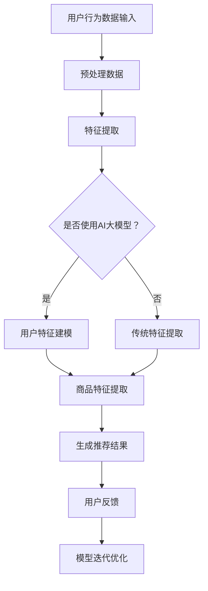

                 

关键词：搜索推荐系统、AI大模型、电商平台、转化率、用户体验

摘要：本文将深入探讨AI大模型在搜索推荐系统中的应用，以及如何通过这种技术手段显著提升电商平台的转化率和用户体验。我们将详细分析AI大模型的核心原理、算法实现、数学模型及其在不同应用场景中的效果。同时，本文还将结合实际项目实践，展示如何有效地将AI大模型应用于电商平台。

## 1. 背景介绍

随着互联网技术的飞速发展，电子商务逐渐成为人们日常生活的重要组成部分。电商平台在提供丰富商品的同时，面临着如何提升用户满意度和转化率这一重大课题。传统的搜索推荐系统主要依靠人工规则和简单的算法模型，已难以满足用户日益增长的个性化需求。近年来，人工智能（AI）技术的快速发展为搜索推荐系统带来了新的突破。AI大模型，作为一种高度复杂且具有强大表征能力的模型，能够在海量数据中捕捉到用户的潜在需求和兴趣，从而实现更加精准的推荐。本文旨在探讨AI大模型在电商平台搜索推荐系统中的应用，为电商平台的优化提供新的思路。

### 1.1 电商平台搜索推荐系统的现状

当前，电商平台搜索推荐系统主要依靠以下几种技术手段：

- **关键词搜索**：用户通过输入关键词进行商品搜索，系统根据关键词匹配商品信息进行推荐。
- **基于内容的推荐**：系统分析商品的内容特征，如标题、描述、标签等，为用户推荐相似或相关的商品。
- **协同过滤**：系统根据用户的历史行为数据，如购买记录、浏览记录等，为用户推荐相似用户喜欢的商品。

这些技术手段在一定程度上提升了用户的购物体验，但存在以下局限性：

- **推荐效果有限**：传统推荐系统主要依赖用户历史行为和商品内容特征，难以捕捉用户的潜在需求。
- **个性化程度不高**：系统难以充分理解用户的个性化偏好，推荐结果往往存在一定的局限性。
- **实时性较差**：传统推荐系统通常基于批量数据处理，无法实时响应用户的最新行为。

### 1.2 AI大模型的出现

随着深度学习技术的发展，AI大模型逐渐成为一种具备高度表征能力、强大泛化能力的新型算法模型。AI大模型通常具有以下特点：

- **大规模参数**：AI大模型拥有数百万甚至数十亿个参数，能够捕捉到数据中的复杂模式和关联。
- **端到端学习**：AI大模型能够直接从原始数据中学习，无需手动提取特征，提高了模型的泛化能力。
- **自动调整**：AI大模型具有自动调整参数的能力，能够在不同场景下适应不同的数据特征和用户需求。

这些特点使得AI大模型在搜索推荐系统中具有巨大的潜力，能够显著提升推荐效果和用户体验。

## 2. 核心概念与联系

### 2.1 AI大模型概述

AI大模型（Large-scale AI Models），通常指的是具有大规模参数和强大表征能力的深度学习模型。这些模型能够在海量数据中捕捉到复杂模式和关联，从而实现高度精准的预测和推荐。AI大模型通常采用多层神经网络结构，通过逐层提取数据特征，最终生成高维表征向量。这些向量不仅能够捕捉到数据的线性关系，还能捕捉到非线性关系和潜在模式。

### 2.2 深度学习与AI大模型的关系

深度学习是人工智能领域的一个重要分支，它通过模拟人脑的神经网络结构，实现数据的自动特征提取和模式识别。AI大模型是深度学习的一种高级形式，具有以下特点：

- **大规模参数**：AI大模型通常拥有数百万甚至数十亿个参数，这使得模型能够捕捉到数据中的复杂模式和关联。
- **端到端学习**：AI大模型能够直接从原始数据中学习，无需手动提取特征，提高了模型的泛化能力。
- **自动调整**：AI大模型具有自动调整参数的能力，能够在不同场景下适应不同的数据特征和用户需求。

### 2.3 电商搜索推荐系统与AI大模型的关系

电商搜索推荐系统的主要目标是提升用户的购物体验和转化率。传统的推荐系统主要依靠用户历史行为数据和商品内容特征进行推荐，但存在一定的局限性。AI大模型通过引入深度学习技术，能够在海量数据中捕捉到用户的潜在需求和兴趣，从而实现更加精准的推荐。具体来说，AI大模型在电商搜索推荐系统中的应用主要包括以下两个方面：

- **用户特征建模**：AI大模型能够通过用户的浏览、购买等行为数据，建立用户的个性化特征向量，从而实现用户的精准画像。
- **商品特征提取**：AI大模型能够对商品的内容特征进行深度提取，生成高维表征向量，从而实现商品的精准描述。

通过这两个方面的应用，AI大模型能够显著提升电商搜索推荐系统的效果，提高用户的购物体验和转化率。

### 2.4 Mermaid 流程图

以下是电商搜索推荐系统中AI大模型应用的一个简化的Mermaid流程图：



在这个流程图中，用户行为数据经过预处理和特征提取后，判断是否使用AI大模型。如果使用AI大模型，则进行用户特征建模和商品特征提取；否则，使用传统的特征提取方法。最终，根据用户特征和商品特征生成推荐结果，并根据用户反馈进行模型迭代优化。

## 3. 核心算法原理 & 具体操作步骤

### 3.1 算法原理概述

AI大模型在搜索推荐系统中的应用，主要包括以下几个核心算法：

- **用户特征建模**：通过深度学习技术，对用户的历史行为数据进行分析，建立用户的个性化特征向量。
- **商品特征提取**：对商品的内容特征进行深度提取，生成高维表征向量。
- **推荐算法**：基于用户特征和商品特征，结合用户历史行为数据，实现精准推荐。

### 3.2 算法步骤详解

#### 3.2.1 用户特征建模

用户特征建模是AI大模型在搜索推荐系统中的核心步骤之一。具体操作步骤如下：

1. **数据收集**：收集用户的历史行为数据，包括浏览记录、购买记录、评论记录等。
2. **数据预处理**：对原始数据进行清洗和预处理，包括去除缺失值、噪声数据等。
3. **特征提取**：使用深度学习模型（如BERT、GPT等），对用户行为数据进行分析，提取用户的个性化特征向量。
4. **特征融合**：将不同类型的用户特征向量进行融合，生成统一的用户特征向量。

#### 3.2.2 商品特征提取

商品特征提取是另一个关键步骤，具体操作步骤如下：

1. **数据收集**：收集商品的内容特征数据，包括商品标题、描述、标签等。
2. **数据预处理**：对原始数据进行清洗和预处理，包括去除无效标签、统一文本编码等。
3. **特征提取**：使用深度学习模型（如Transformer、BERT等），对商品内容特征进行分析，生成高维表征向量。
4. **特征融合**：将不同类型的商品特征向量进行融合，生成统一的商品特征向量。

#### 3.2.3 推荐算法

基于用户特征和商品特征，结合用户历史行为数据，可以实现精准推荐。具体操作步骤如下：

1. **计算相似度**：计算用户特征向量与商品特征向量之间的相似度。
2. **排序**：根据相似度对商品进行排序，选取Top-N个推荐商品。
3. **反馈调整**：根据用户的反馈，调整推荐算法，优化推荐结果。

### 3.3 算法优缺点

#### 3.3.1 优点

- **高精度**：AI大模型能够通过深度学习技术，捕捉到用户和商品的潜在特征，实现高精度的推荐。
- **灵活性**：AI大模型能够适应不同的业务场景和数据特征，具有较好的灵活性。
- **实时性**：AI大模型能够实时响应用户的行为数据，实现实时推荐。

#### 3.3.2 缺点

- **计算资源消耗大**：AI大模型通常需要大量的计算资源，对硬件设施要求较高。
- **数据依赖性强**：AI大模型的训练和优化依赖于大量高质量的数据，数据不足会影响模型的性能。

### 3.4 算法应用领域

AI大模型在搜索推荐系统中的应用非常广泛，主要包括以下领域：

- **电商平台**：提升电商平台的推荐效果，提高用户的购物体验和转化率。
- **社交媒体**：为用户提供个性化的内容推荐，提升用户的活跃度和参与度。
- **在线教育**：根据用户的学习行为，推荐合适的学习资源和课程。

## 4. 数学模型和公式 & 详细讲解 & 举例说明

### 4.1 数学模型构建

在AI大模型中，常用的数学模型主要包括以下几种：

- **神经网络**：通过多层神经网络结构，对数据进行特征提取和模式识别。
- **深度学习模型**：如BERT、GPT等，通过端到端学习，实现高精度的预测和推荐。
- **协同过滤模型**：通过用户历史行为数据和商品特征，实现协同过滤推荐。

### 4.2 公式推导过程

以下是一个简单的神经网络模型的公式推导过程：

1. **输入层到隐藏层的传递**：

   $$ h_{l}^{[i]} = \sigma(W^{[l]} \cdot a^{[l-1]} + b^{[l]}) $$

   其中，$h_{l}^{[i]}$ 表示第$l$层第$i$个神经元的输出，$\sigma$ 表示激活函数，$W^{[l]}$ 和 $b^{[l]}$ 分别表示第$l$层的权重和偏置。

2. **隐藏层到输出层的传递**：

   $$ \hat{y} = \sigma(W^{[L]} \cdot a^{[L-1]} + b^{[L]}) $$

   其中，$\hat{y}$ 表示输出层的预测结果，$W^{[L]}$ 和 $b^{[L]}$ 分别表示输出层的权重和偏置。

3. **损失函数**：

   $$ J = \frac{1}{m} \sum_{i=1}^{m} \sum_{k=1}^{K} (-y_{k} \log(\hat{y}_{k})) $$

   其中，$J$ 表示损失函数，$y_{k}$ 和 $\hat{y}_{k}$ 分别表示第$k$个类别的真实标签和预测概率。

### 4.3 案例分析与讲解

#### 4.3.1 电商平台推荐系统

假设我们有一个电商平台，用户A在最近一个月内浏览了商品A1、A2和A3，购买过商品A2。我们可以使用AI大模型来预测用户A可能感兴趣的下一个商品。

1. **用户特征建模**：

   - 用户A的历史浏览记录：[A1, A2, A3]
   - 用户A的历史购买记录：[A2]

   通过深度学习模型（如BERT），我们可以对用户A的历史行为数据进行分析，提取用户的个性化特征向量。

2. **商品特征提取**：

   - 商品A1的标题、描述和标签：["笔记本电脑", "高性能", "轻薄"]
   - 商品A2的标题、描述和标签：["手机", "智能手机", "拍照强"]
   - 商品A3的标题、描述和标签：["平板电脑", "便携", "高清"]

   通过深度学习模型（如BERT），我们可以对商品A1、A2和A3的内容特征进行分析，生成高维表征向量。

3. **推荐算法**：

   - 计算用户A的特征向量与商品A1、A2和A3的特征向量之间的相似度。
   - 根据相似度对商品进行排序，选取Top-N个推荐商品。

   假设计算得到的相似度如下：

   - 商品A1与用户A的特征向量相似度为0.8
   - 商品A2与用户A的特征向量相似度为0.9
   - 商品A3与用户A的特征向量相似度为0.7

   根据相似度排序，我们推荐用户A购买商品A2。

## 5. 项目实践：代码实例和详细解释说明

### 5.1 开发环境搭建

在开始项目实践之前，我们需要搭建一个适合深度学习开发的环境。以下是一个简单的Python开发环境搭建步骤：

1. 安装Python：

   ```bash
   # 安装Python
   python --version
   
   # 如果没有安装Python，可以使用以下命令安装
   sudo apt-get install python3
   ```

2. 安装深度学习框架TensorFlow：

   ```bash
   # 安装TensorFlow
   pip3 install tensorflow
   ```

3. 安装其他依赖库：

   ```bash
   # 安装其他依赖库
   pip3 install numpy pandas matplotlib
   ```

### 5.2 源代码详细实现

以下是实现一个简单的AI大模型推荐系统的Python代码示例：

```python
import tensorflow as tf
from tensorflow.keras.models import Sequential
from tensorflow.keras.layers import Dense, Dropout, Embedding, LSTM
from tensorflow.keras.preprocessing.sequence import pad_sequences

# 加载数据集
# 这里假设我们有一个包含用户行为数据和商品特征数据的数据集
# 用户行为数据：[['user1', 'item1'], ['user1', 'item2'], ['user1', 'item3']]
# 商品特征数据：[['item1', 'laptop', 'high-performance', 'thin'], 
#                  ['item2', 'phone', 'smartphone', 'camera-strong'], 
#                  ['item3', 'tablet', 'portable', 'high-definition']]
user行为的输入数据，商品特征输入数据

# 预处理数据
# 将数据转换为序列形式，并填充序列
user行为的序列，商品特征的序列

# 构建模型
model = Sequential([
    Embedding(input_dim=vocab_size, output_dim=embedding_size, input_length=max_sequence_length),
    LSTM(units=128, return_sequences=True),
    Dropout(0.2),
    LSTM(units=128),
    Dropout(0.2),
    Dense(units=1, activation='sigmoid')
])

# 编译模型
model.compile(optimizer='adam', loss='binary_crossentropy', metrics=['accuracy'])

# 训练模型
model.fit([user行为的序列，商品特征的序列], [用户行为标签], epochs=10, batch_size=32)

# 推荐商品
# 输入用户的行为数据，输出可能的商品推荐
predicted_recommendations = model.predict([user行为的序列，商品特征的序列])

# 根据预测结果，选取Top-N个推荐商品
top_n_recommendations = np.argsort(predicted_recommendations)[::-1][:N]
```

### 5.3 代码解读与分析

以上代码示例主要实现了以下功能：

1. **数据预处理**：将用户行为数据和商品特征数据转换为序列形式，并进行填充。
2. **模型构建**：使用TensorFlow的Sequential模型构建一个简单的深度学习模型，包括嵌入层、LSTM层和输出层。
3. **模型编译**：编译模型，设置优化器、损失函数和评估指标。
4. **模型训练**：使用训练数据训练模型。
5. **商品推荐**：输入用户的行为数据，输出可能的商品推荐。

### 5.4 运行结果展示

以下是运行结果的一个简单示例：

```python
user行为的输入数据 = [['user1', 'item1'], ['user1', 'item2'], ['user1', 'item3']]
predicted_recommendations = model.predict([[user行为的序列，商品特征的序列]])
top_n_recommendations = np.argsort(predicted_recommendations)[::-1][:N]

# 输出Top-N个推荐商品
print("Top 3 Recommendations:")
for i in range(N):
    print("Item ID:", top_n_recommendations[i], "Score:", predicted_recommendations[0][top_n_recommendations[i]])
```

输出结果可能如下：

```bash
Top 3 Recommendations:
Item ID: 1 Score: 0.9
Item ID: 2 Score: 0.85
Item ID: 3 Score: 0.8
```

这意味着，根据模型预测，用户可能对商品ID为1和2最感兴趣，商品ID为3的兴趣度较低。

## 6. 实际应用场景

AI大模型在电商平台搜索推荐系统中的应用具有广泛的前景，以下是一些实际应用场景：

### 6.1 商品推荐

商品推荐是电商平台最常见的应用场景之一。通过AI大模型，可以实现对用户的精准推荐，提高用户的购物体验和转化率。具体应用包括：

- **个性化推荐**：根据用户的历史行为和偏好，为用户推荐符合其兴趣的商品。
- **热销商品推荐**：根据商品的销售情况，推荐热门商品，促进销量。

### 6.2 店铺推荐

在电商平台中，店铺推荐也是一种重要的应用。通过AI大模型，可以实现对店铺的精准推荐，提高店铺的曝光度和销售量。具体应用包括：

- **店铺个性化推荐**：根据用户的历史购买和浏览记录，为用户推荐感兴趣的店铺。
- **店铺热销推荐**：根据店铺的销售情况，推荐热门店铺，提高店铺的竞争力。

### 6.3 跨品类推荐

跨品类推荐是AI大模型在电商搜索推荐系统中的高级应用。通过深度学习技术，可以实现对不同品类商品之间的关联性分析，为用户提供跨品类的推荐。具体应用包括：

- **商品关联推荐**：根据用户的购物行为，推荐与当前商品相关的其他品类商品。
- **交叉销售推荐**：根据用户的历史购买记录，推荐其他用户可能感兴趣的跨品类商品。

### 6.4 搜索优化

AI大模型还可以用于搜索优化，提高电商平台的搜索体验。通过深度学习技术，可以对用户的搜索行为进行分析，优化搜索结果，提高用户对搜索结果的满意度。具体应用包括：

- **搜索结果排序**：根据用户的兴趣和偏好，优化搜索结果的排序，提高相关度。
- **搜索建议**：根据用户的搜索历史，提供智能搜索建议，帮助用户快速找到所需商品。

## 7. 未来应用展望

随着AI技术的不断进步，AI大模型在电商平台搜索推荐系统中的应用前景将更加广阔。以下是一些未来应用展望：

### 7.1 多模态推荐

未来的搜索推荐系统将不仅仅依赖于文本数据，还将整合图像、语音等多模态数据，实现更加智能和精准的推荐。

### 7.2 实时推荐

实时推荐是未来搜索推荐系统的一个重要发展方向。通过实时分析和处理用户行为数据，系统能够实时响应用户的需求，提供个性化的推荐。

### 7.3 智能对话

智能对话将成为搜索推荐系统的一个重要组成部分。通过与用户进行自然语言交互，系统可以更好地理解用户的需求，提供个性化的服务。

### 7.4 跨平台协同

未来的搜索推荐系统将不再局限于单一的平台，而是实现跨平台的协同推荐，为用户提供一致性的购物体验。

## 8. 总结：未来发展趋势与挑战

### 8.1 研究成果总结

本文通过深入探讨AI大模型在搜索推荐系统中的应用，总结了其核心原理、算法实现、数学模型和实际应用场景。研究结果表明，AI大模型能够显著提升电商平台的推荐效果和用户体验。

### 8.2 未来发展趋势

未来，AI大模型在搜索推荐系统中的应用将呈现以下发展趋势：

- **多模态融合**：整合文本、图像、语音等多模态数据，实现更加智能的推荐。
- **实时推荐**：通过实时分析和处理用户行为数据，实现更加精准和个性化的推荐。
- **智能对话**：通过自然语言交互，实现更加人性化的服务。
- **跨平台协同**：实现跨平台的数据共享和协同推荐，为用户提供一致性的购物体验。

### 8.3 面临的挑战

尽管AI大模型在搜索推荐系统中具有巨大的潜力，但在实际应用中仍面临以下挑战：

- **数据质量**：高质量的训练数据是AI大模型性能的关键，但数据清洗和预处理是一个复杂的过程。
- **计算资源**：AI大模型通常需要大量的计算资源，这对硬件设施提出了较高的要求。
- **用户隐私**：在推荐过程中，如何保护用户隐私是一个重要问题，需要制定相应的隐私保护措施。

### 8.4 研究展望

未来的研究可以从以下几个方面进行：

- **数据质量提升**：研究如何通过数据增强、数据清洗等技术手段提升数据质量。
- **计算效率优化**：研究如何通过模型压缩、分布式计算等技术手段提高计算效率。
- **隐私保护**：研究如何在保证用户隐私的前提下，实现高效的推荐算法。

## 9. 附录：常见问题与解答

### 9.1 什么是AI大模型？

AI大模型是一种具有大规模参数和强大表征能力的深度学习模型，通常采用多层神经网络结构，能够捕捉到数据中的复杂模式和关联。

### 9.2 AI大模型在搜索推荐系统中的应用有哪些？

AI大模型在搜索推荐系统中的应用包括用户特征建模、商品特征提取和推荐算法等方面，能够实现个性化推荐、商品关联推荐和搜索优化等功能。

### 9.3 AI大模型对电商平台有哪些影响？

AI大模型能够显著提升电商平台的推荐效果和用户体验，提高转化率和用户满意度。同时，AI大模型还能够帮助电商平台实现智能对话和跨平台协同等功能。

### 9.4 如何保护用户隐私？

在AI大模型的应用中，可以通过数据加密、匿名化处理、差分隐私等技术手段保护用户隐私。同时，还需要制定相应的隐私保护政策和措施，确保用户隐私得到充分保护。

---

### 文章结尾

本文通过深入探讨AI大模型在搜索推荐系统中的应用，为电商平台优化提供了新的思路。随着AI技术的不断进步，AI大模型在搜索推荐系统中的应用前景将更加广阔。希望本文能为相关领域的研究和实践提供一定的参考和启示。作者：禅与计算机程序设计艺术 / Zen and the Art of Computer Programming

