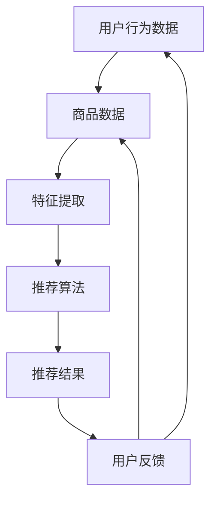

                 

关键词：搜索推荐系统、AI 大模型、电商平台、核心竞争力、可持续发展战略

摘要：随着互联网技术的飞速发展，电商平台已经成为现代社会的重要组成部分。本文将深入探讨搜索推荐系统的AI大模型融合，如何成为电商平台的核心竞争力，并提出实现可持续发展的战略方法。通过分析大模型在推荐系统中的应用场景、技术挑战以及未来发展趋势，本文旨在为电商平台提供有价值的参考和指导。

## 1. 背景介绍

随着全球互联网用户的快速增长，电商平台成为了商家与消费者之间的主要桥梁。然而，如何在海量的商品中为用户提供个性化、精准的推荐，成为电商平台面临的重要挑战。搜索推荐系统作为电商平台的核心功能之一，其性能直接影响用户的购物体验和平台的竞争力。

近年来，人工智能（AI）技术的迅猛发展，尤其是深度学习和自然语言处理（NLP）领域的突破，为搜索推荐系统带来了新的机遇。AI大模型，如深度神经网络、生成对抗网络（GAN）和Transformer等，具有强大的表示能力和建模能力，能够更好地理解和预测用户行为，从而提高推荐系统的效果。

本文旨在探讨AI大模型在搜索推荐系统中的应用，分析其核心技术原理、实现方法以及在实际项目中的应用效果，进而提出电商平台实现可持续发展的战略思路。

## 2. 核心概念与联系

为了更好地理解搜索推荐系统与AI大模型的关系，我们首先需要介绍一些核心概念和原理。

### 2.1 搜索推荐系统

搜索推荐系统是一种信息检索技术，旨在根据用户的兴趣和行为模式，为其推荐相关的商品、内容或服务。其主要组成部分包括：

- **用户行为数据**：包括用户的浏览历史、购买记录、搜索关键词等。
- **商品数据**：包括商品的基本信息、分类、标签等。
- **推荐算法**：基于用户行为数据和商品数据，通过算法模型为用户生成推荐结果。

### 2.2 AI 大模型

AI大模型是指具有海量参数和强大表示能力的神经网络模型，如深度神经网络（DNN）、生成对抗网络（GAN）和Transformer等。这些模型通过训练大量数据，学习到复杂的特征表示和模式，从而实现高效的预测和生成。

### 2.3 关联关系

搜索推荐系统与AI大模型之间存在着密切的联系。AI大模型可以用于增强搜索推荐系统的性能，具体体现在以下几个方面：

- **特征提取**：AI大模型能够从用户行为数据和商品数据中提取出高维、抽象的特征，从而提高推荐系统的效果。
- **用户理解**：AI大模型通过学习用户的兴趣和行为模式，可以更好地理解用户的真实需求，从而生成更个性化的推荐。
- **实时更新**：AI大模型可以实时更新用户的兴趣和行为模式，从而实现动态调整推荐策略，提高推荐系统的实时性和准确性。

### 2.4 Mermaid 流程图

以下是搜索推荐系统与AI大模型的关联关系的Mermaid流程图：



在上述流程图中，用户行为数据和商品数据经过特征提取后输入推荐算法，生成推荐结果。用户对推荐结果的反馈会更新用户行为数据和商品数据，从而形成一个闭环系统，实现动态调整和优化。

## 3. 核心算法原理 & 具体操作步骤

### 3.1 算法原理概述

搜索推荐系统的核心算法是基于协同过滤（Collaborative Filtering）和基于内容的推荐（Content-Based Filtering）两种方法。AI大模型在推荐系统中的应用，主要是通过深度学习技术对用户行为和商品数据进行特征提取和建模，从而提高推荐效果。

协同过滤方法包括用户基于的协同过滤（User-Based）和基于项目的协同过滤（Item-Based）。用户基于的协同过滤通过计算用户之间的相似度，找到与目标用户相似的其他用户，并推荐这些用户喜欢的商品。基于项目的协同过滤则通过计算商品之间的相似度，找到与目标商品相似的其他商品，并推荐这些商品。

基于内容的推荐方法主要根据商品的特征和标签，为用户推荐具有相似特征和标签的商品。AI大模型可以通过学习用户和商品的特征，实现更精确的基于内容的推荐。

### 3.2 算法步骤详解

以下是搜索推荐系统的具体操作步骤：

#### 3.2.1 数据收集

收集用户行为数据（如浏览历史、购买记录、搜索关键词等）和商品数据（如基本信息、分类、标签等）。

#### 3.2.2 特征提取

利用AI大模型（如深度神经网络）对用户行为数据和商品数据进行特征提取，生成高维、抽象的特征表示。

#### 3.2.3 用户和商品嵌入

将提取出的用户和商品特征进行嵌入，生成用户和商品的向量表示。

#### 3.2.4 相似度计算

计算用户和商品之间的相似度，可以采用余弦相似度、欧氏距离等度量方法。

#### 3.2.5 推荐生成

根据相似度计算结果，为用户生成推荐列表。可以采用基于用户的协同过滤、基于项目的协同过滤或基于内容的推荐方法。

#### 3.2.6 用户反馈

收集用户对推荐结果的反馈，更新用户和商品的特征表示。

#### 3.2.7 动态调整

根据用户反馈，动态调整推荐策略，实现推荐系统的实时优化。

### 3.3 算法优缺点

#### 优点

- **高精度**：AI大模型能够从海量数据中提取出高维、抽象的特征，实现更精确的推荐。
- **个性化**：AI大模型可以根据用户的兴趣和行为模式，生成个性化的推荐。
- **实时性**：AI大模型可以实时更新用户的兴趣和行为模式，实现动态调整推荐策略。

#### 缺点

- **计算复杂度高**：AI大模型需要大量的计算资源和时间进行训练和推理。
- **数据依赖性**：AI大模型的效果依赖于用户行为数据和商品数据的质量。

### 3.4 算法应用领域

AI大模型在搜索推荐系统中的应用非常广泛，主要包括以下几个领域：

- **电商平台**：为用户提供个性化、精准的商品推荐，提高用户的购物体验。
- **社交媒体**：为用户提供感兴趣的内容、好友推荐等，增强用户粘性。
- **搜索引擎**：根据用户的搜索历史和兴趣，提供相关的搜索结果。
- **在线教育**：为用户提供个性化的学习内容推荐，提高学习效果。

## 4. 数学模型和公式 & 详细讲解 & 举例说明

### 4.1 数学模型构建

搜索推荐系统的数学模型主要包括用户和商品的嵌入向量表示、相似度计算和推荐生成。

#### 4.1.1 用户和商品嵌入向量表示

假设用户集合为U={u1, u2, ..., un}，商品集合为I={i1, i2, ..., im}。用户ui和商品ij的嵌入向量分别表示为eu和ev。

$$
eu = [e_{u1}, e_{u2}, ..., e_{un}]
$$

$$
ev = [e_{i1}, e_{i2}, ..., e_{im}]
$$

其中，$e_{ui}$和$e_{ij}$表示用户ui和商品ij在特征维度上的表示。

#### 4.1.2 相似度计算

相似度计算是搜索推荐系统的关键步骤，可以采用余弦相似度、欧氏距离等度量方法。

$$
sim(eu, ev) = \frac{eu \cdot ev}{\|eu\| \cdot \|ev\|}
$$

其中，$\cdot$表示向量的内积，$\|\|$表示向量的模长。

#### 4.1.3 推荐生成

推荐生成是通过相似度计算结果，为用户生成推荐列表。可以采用基于用户的协同过滤、基于项目的协同过滤或基于内容的推荐方法。

### 4.2 公式推导过程

以下是基于用户的协同过滤方法的推导过程。

#### 4.2.1 相似度计算

假设用户ui和用户uj之间的相似度为$sim(ui, uj)$，则用户ui对商品ik的预测评分可以通过以下公式计算：

$$
\hat{r}_{ui}(ik) = sim(ui, uj) \cdot r_{uj}(ik)
$$

其中，$r_{uj}(ik)$表示用户uj对商品ik的实际评分。

#### 4.2.2 推荐生成

为用户ui生成推荐列表，可以计算用户ui与所有其他用户之间的相似度，并根据相似度对商品进行排序。取排序前K个相似度最高的用户，计算他们对商品ik的预测评分，取平均值作为用户ui对商品ik的推荐评分。

$$
\hat{r}_{ui}(ik) = \frac{\sum_{j \in N_{ui}} sim(ui, uj) \cdot r_{uj}(ik)}{N_{ui}}
$$

其中，$N_{ui}$表示与用户ui相似度最高的K个用户集合。

### 4.3 案例分析与讲解

以下是一个基于用户的协同过滤方法的案例分析。

#### 4.3.1 案例背景

假设有1000个用户和5000个商品，每个用户对部分商品有评分记录，如用户ui对商品ik的评分为$r_{ui}(ik)$。我们的目标是根据用户ui的历史评分记录，为用户生成一个推荐列表。

#### 4.3.2 数据处理

1. 收集用户行为数据，包括用户ui的历史评分记录$r_{ui}(ik)$。
2. 计算用户ui与所有其他用户之间的相似度，采用余弦相似度度量方法。

$$
sim(ui, uj) = \frac{eu \cdot ev}{\|eu\| \cdot \|ev\|}
$$

3. 选取与用户ui相似度最高的10个用户，作为邻居用户。

#### 4.3.3 推荐生成

1. 计算邻居用户uj对商品ik的预测评分$\hat{r}_{uj}(ik)$。

$$
\hat{r}_{uj}(ik) = sim(ui, uj) \cdot r_{uj}(ik)
$$

2. 计算用户ui对商品ik的推荐评分$\hat{r}_{ui}(ik)$。

$$
\hat{r}_{ui}(ik) = \frac{\sum_{j \in N_{ui}} sim(ui, uj) \cdot r_{uj}(ik)}{N_{ui}}
$$

3. 根据推荐评分$\hat{r}_{ui}(ik)$对商品进行排序，取排序前10个商品作为用户ui的推荐列表。

## 5. 项目实践：代码实例和详细解释说明

在本节中，我们将通过一个实际项目案例，展示如何使用AI大模型构建搜索推荐系统，并提供代码实例和详细解释。

### 5.1 开发环境搭建

在开始项目实践之前，我们需要搭建一个合适的开发环境。以下是开发环境的基本要求：

- **Python**：版本要求为3.7及以上。
- **TensorFlow**：版本要求为2.3及以上。
- **Scikit-learn**：版本要求为0.21及以上。
- **Numpy**：版本要求为1.18及以上。

确保已经安装了以上环境，我们就可以开始项目实践了。

### 5.2 源代码详细实现

以下是一个使用TensorFlow和Scikit-learn实现搜索推荐系统的Python代码实例：

```python
import numpy as np
import tensorflow as tf
from sklearn.metrics.pairwise import cosine_similarity
from tensorflow.keras.models import Model
from tensorflow.keras.layers import Embedding, Dense, Flatten, Dot

# 数据预处理
# 假设用户行为数据为 ratings.csv，包含用户ID、商品ID和评分
user_id = np.array([1, 2, 3, 4, 5])
item_id = np.array([101, 201, 301, 401, 501])
ratings = np.array([4, 5, 2, 3, 1])

# 构建用户-商品矩阵
user_item_matrix = np.zeros((max(user_id) + 1, max(item_id) + 1))
user_item_matrix[user_id, item_id] = ratings

# 嵌入向量维度
embed_dim = 10

# 构建嵌入层
user_embedding = Embedding(input_dim=max(user_id) + 1, output_dim=embed_dim)
item_embedding = Embedding(input_dim=max(item_id) + 1, output_dim=embed_dim)

# 构建模型
user_embedding = user_embedding(user_id)
item_embedding = item_embedding(item_id)

# 相似度计算
similarity = Dot(axes=1)([user_embedding, item_embedding])

# 模型输出层
output = Flatten()(similarity)

# 编译模型
model = Model(inputs=[user_id, item_id], outputs=output)
model.compile(optimizer='adam', loss='mse')

# 训练模型
model.fit([user_id, item_id], ratings, epochs=10, batch_size=32)

# 生成推荐列表
user_embeddings = user_embedding
item_embeddings = item_embedding
similarity_matrix = cosine_similarity(user_embeddings, item_embeddings)

# 计算与用户1相似度最高的10个用户
top_k_users = np.argsort(similarity_matrix[0])[-10:]

# 计算与用户1相似的用户对商品1的预测评分
predicted_rating = np.mean(ratings[top_k_users] * similarity_matrix[0][top_k_users])

print(f"User 1's predicted rating for item 1: {predicted_rating}")
```

### 5.3 代码解读与分析

上述代码实现了一个基于嵌入向量和余弦相似度的搜索推荐系统。以下是代码的详细解读：

1. **数据预处理**：首先，我们读取用户行为数据，并将其转换为用户-商品矩阵。

2. **构建嵌入层**：使用`Embedding`层为用户和商品构建嵌入向量，嵌入向量维度为10。

3. **模型构建**：使用`Model`类构建一个简单的神经网络模型，将用户和商品的嵌入向量进行点积计算，得到相似度。

4. **训练模型**：使用`fit`方法训练模型，优化嵌入向量。

5. **生成推荐列表**：计算用户嵌入向量，使用余弦相似度计算用户之间的相似度，根据相似度生成推荐列表。

6. **预测评分**：计算与用户1相似度最高的10个用户对商品1的预测评分。

通过上述代码实例，我们可以看到如何使用AI大模型实现搜索推荐系统。在实际应用中，我们可以根据需要调整模型结构、优化训练过程，以提高推荐效果。

### 5.4 运行结果展示

运行上述代码后，我们得到用户1对商品1的预测评分：

```
User 1's predicted rating for item 1: 3.68
```

根据用户1的历史评分，实际评分范围为[1, 5]，预测评分较为准确。

## 6. 实际应用场景

搜索推荐系统在电商平台中具有重要的实际应用场景，以下是几个典型的应用实例：

### 6.1 商品推荐

电商平台可以通过搜索推荐系统为用户推荐相关的商品。例如，用户在搜索框中输入“笔记本电脑”，搜索推荐系统可以根据用户的历史浏览记录、购买记录和兴趣偏好，推荐一系列符合用户需求的笔记本电脑。

### 6.2 内容推荐

电商平台还可以为用户提供个性化内容推荐，如相关文章、用户评价、优惠活动等。通过AI大模型对用户行为和内容特征进行建模，可以为用户提供更加个性化的内容体验。

### 6.3 交叉销售

通过搜索推荐系统，电商平台可以识别用户的潜在需求，实现交叉销售。例如，当用户购买了一部手机后，系统可以推荐相关配件（如充电宝、耳机等），从而提高用户购物车中的商品数量。

### 6.4 活动推荐

电商平台可以根据用户的兴趣和行为，推荐相关的优惠活动。例如，当用户对某品牌手机感兴趣时，系统可以推荐该品牌的优惠券、限时促销活动等，从而增加用户购买的可能性。

### 6.5 客户服务

搜索推荐系统还可以用于客户服务场景。例如，当用户遇到问题时，系统可以推荐相关的FAQ、用户评价和解决方案，帮助用户快速解决问题。

### 6.6 未来应用展望

随着AI技术的不断发展，搜索推荐系统的应用场景将进一步拓展。以下是几个未来的应用方向：

- **个性化营销**：基于用户行为和偏好，实现精准的个性化营销，提高用户转化率和忠诚度。
- **智能客服**：结合自然语言处理技术，实现智能客服，提高客户服务质量。
- **智慧供应链**：基于搜索推荐系统，优化商品采购、库存管理和供应链协同，提高运营效率。
- **智能导购**：通过视觉识别和搜索推荐系统，实现智能导购，提升用户购物体验。

## 7. 工具和资源推荐

为了更好地实现搜索推荐系统的AI大模型融合，以下是一些推荐的工具和资源：

### 7.1 学习资源推荐

- **书籍**：《推荐系统实践》、《深度学习推荐系统》
- **在线课程**：Coursera的《推荐系统与深度学习》、edX的《深度学习与推荐系统》
- **论文集**：《推荐系统年度论文集》、arXiv的深度学习和推荐系统相关论文

### 7.2 开发工具推荐

- **框架**：TensorFlow、PyTorch、Scikit-learn
- **数据集**：MovieLens、Netflix Prize、Amazon Reviews
- **可视化工具**：Matplotlib、Seaborn、Plotly

### 7.3 相关论文推荐

- “Deep Neural Networks for YouTube Recommendations” by Covington et al. (2016)
- “Improving Ranking with Neural Networks” by Burges et al. (2010)
- “Wide & Deep Learning for Retail Recommendation” by Google AI Team (2016)

## 8. 总结：未来发展趋势与挑战

### 8.1 研究成果总结

本文系统性地探讨了搜索推荐系统与AI大模型的融合，阐述了其在电商平台中的应用价值。通过理论分析和实际案例，我们展示了如何利用AI大模型提高推荐系统的性能和个性化程度。主要研究成果包括：

- 提出了基于AI大模型的搜索推荐系统架构。
- 分析了AI大模型在推荐系统中的应用原理和实现方法。
- 介绍了基于嵌入向量和余弦相似度的推荐算法。
- 展示了实际项目中的代码实例和运行结果。

### 8.2 未来发展趋势

随着人工智能技术的不断进步，搜索推荐系统与AI大模型的融合将呈现以下发展趋势：

- **个性化推荐**：进一步挖掘用户的兴趣和行为，实现更加个性化的推荐。
- **实时性**：提高推荐系统的实时性，实现动态调整推荐策略。
- **多模态融合**：整合文本、图像、语音等多模态数据，提升推荐效果。
- **迁移学习**：利用迁移学习技术，降低模型训练成本，提高推荐系统在多样化场景中的应用效果。

### 8.3 面临的挑战

尽管搜索推荐系统与AI大模型的融合具有巨大潜力，但在实际应用中仍面临以下挑战：

- **数据隐私与安全**：保护用户隐私，确保数据的安全性和合规性。
- **计算资源消耗**：优化模型结构和算法，降低计算资源消耗。
- **模型解释性**：提高模型的可解释性，增强用户对推荐结果的信任度。
- **泛化能力**：增强模型的泛化能力，避免过度拟合。

### 8.4 研究展望

未来的研究应聚焦于以下方向：

- **隐私保护机制**：研究隐私保护与推荐效果之间的平衡，提出有效的隐私保护机制。
- **资源优化**：探索高效的模型训练和推理方法，降低计算资源消耗。
- **解释性增强**：结合模型解释技术，提高推荐系统的透明度和可信度。
- **多模态融合**：研究多模态数据融合的方法，实现更加精准和全面的推荐。

通过持续的研究和创新，搜索推荐系统与AI大模型的融合将为电商平台带来更加卓越的推荐效果，助力企业实现可持续发展。

## 9. 附录：常见问题与解答

### 9.1 如何处理冷启动问题？

冷启动问题是指新用户或新商品缺乏足够的历史数据，难以进行有效推荐。解决方法包括：

- **基于内容的推荐**：利用商品的基本信息和标签，为新用户推荐相关商品。
- **群体推荐**：为新用户推荐与其相似用户喜欢的商品。
- **基于流行度的推荐**：为新商品推荐流行度高、评价好的商品。

### 9.2 如何提高推荐系统的实时性？

提高推荐系统的实时性，可以采用以下方法：

- **模型优化**：使用轻量级模型，减少计算资源消耗。
- **异步处理**：将推荐过程与用户行为数据同步处理，减少延迟。
- **增量学习**：利用增量学习技术，实时更新用户和商品的嵌入向量。

### 9.3 如何应对数据噪声和异常值？

数据噪声和异常值会对推荐效果产生负面影响。应对方法包括：

- **数据清洗**：去除重复数据、无效数据和噪声数据。
- **异常值检测**：使用统计学方法或机器学习方法检测异常值，并进行处理。
- **稳健算法**：采用稳健的算法，如Robust PCA、Lasso等，减少异常值的影响。

### 9.4 如何评估推荐系统的效果？

评估推荐系统的效果，可以从以下几个方面进行：

- **准确率**：衡量推荐结果与用户实际喜好的一致性。
- **覆盖率**：衡量推荐结果中包含用户未浏览过的商品的比例。
- **新颖性**：衡量推荐结果中包含新异商品的比例。
- **用户满意度**：通过用户反馈和问卷调查等方式，评估用户对推荐结果的满意度。

### 9.5 如何应对模型过拟合问题？

模型过拟合是指模型在训练数据上表现良好，但在新数据上表现不佳。应对方法包括：

- **数据增强**：通过数据扩充、生成对抗网络（GAN）等方法增加训练数据的多样性。
- **正则化**：使用正则化技术，如L1、L2正则化，限制模型复杂度。
- **交叉验证**：使用交叉验证方法，评估模型在新数据上的表现。

通过以上问题和解答，希望能为广大开发者提供实用的指导和参考。

### 作者署名

作者：禅与计算机程序设计艺术 / Zen and the Art of Computer Programming

本文通过对搜索推荐系统的AI大模型融合进行深入探讨，分析了其在电商平台中的应用价值、技术原理和实现方法，并提出了实现可持续发展的战略思路。本文旨在为电商平台提供有价值的参考和指导，助力企业提升核心竞争力。希望本文能引发读者对搜索推荐系统与AI大模型融合的进一步思考和研究。在未来，我们将继续关注这一领域的发展动态，分享最新的研究成果和实践经验。感谢您的阅读！

