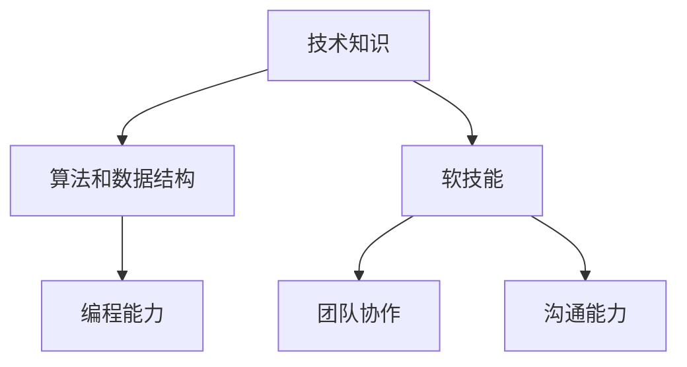

                 

关键词：携程旅游校招、面试真题、解答、面试准备

> 摘要：本文旨在汇总并解析2024年携程旅游校招面试的真题，帮助考生更好地准备面试。文章将详细解答各类面试题目，并提供实用的面试技巧和策略。

## 1. 背景介绍

携程旅游网作为中国领先的在线旅行社，其校招面试环节备受关注。2024年携程旅游校招面试涵盖了多个领域，包括技术、产品、运营等。本文将汇总并解析面试真题，旨在帮助考生了解面试题型，提高面试成功率。

## 2. 核心概念与联系

为了更好地理解面试真题，我们需要先了解一些核心概念。以下是一个使用Mermaid绘制的流程图，展示了面试中可能会涉及的一些关键概念和它们之间的联系。



### 2.1. 技术知识

技术知识是面试中的基础，包括计算机基础知识、网络知识、操作系统知识等。考生需要对这些基础知识有扎实的掌握。

### 2.2. 算法和数据结构

算法和数据结构是面试中的重点，包括排序、查找、图算法等。考生需要能够熟练地应用这些算法和数据结构解决实际问题。

### 2.3. 编程能力

编程能力是面试的核心，考生需要能够通过代码实现复杂的功能，并且代码要具有良好的可读性和可维护性。

### 2.4. 软技能

软技能包括团队协作、沟通能力、解决问题的能力等。这些能力在面试中也非常重要，因为它们决定了考生是否能够适应团队合作和解决复杂问题。

## 3. 核心算法原理 & 具体操作步骤

### 3.1. 算法原理概述

算法原理是面试中的核心，以下是一些常见的算法原理：

- **排序算法**：冒泡排序、选择排序、插入排序、快速排序等。
- **查找算法**：二分查找、线性查找等。
- **图算法**：深度优先搜索、广度优先搜索等。

### 3.2. 算法步骤详解

以下以冒泡排序为例，详细介绍其步骤：

1. 从第一个元素开始，相邻的两个元素进行比较，如果第一个比第二个大（或小），则交换它们的位置。
2. 重复步骤1，但这次只需要比较前n-1个元素。
3. 重复上述步骤，直到没有任何需要交换的元素为止。

### 3.3. 算法优缺点

冒泡排序的优点是实现简单，易于理解。缺点是效率较低，适合数据量较小的场景。

### 3.4. 算法应用领域

冒泡排序常用于对数组进行排序，也可用于实现其他算法，如快速排序等。

## 4. 数学模型和公式 & 详细讲解 & 举例说明

### 4.1. 数学模型构建

数学模型是解决实际问题的工具，以下是一个简单的线性回归模型：

- **目标函数**：最小化预测值与实际值之间的误差平方和。
- **损失函数**：$$L(\theta) = \frac{1}{2m} \sum_{i=1}^{m} (h_{\theta}(x^{(i)}) - y^{(i)})^2$$

### 4.2. 公式推导过程

以下是对线性回归损失函数的推导：

1. **初始化参数**：随机初始化参数$\theta$。
2. **前向传播**：计算预测值$h_{\theta}(x^{(i)})$。
3. **计算损失**：计算损失函数$J(\theta)$。
4. **反向传播**：更新参数$\theta$。

### 4.3. 案例分析与讲解

以下是一个使用线性回归预测房价的案例：

1. **数据预处理**：对数据集进行归一化处理。
2. **模型训练**：使用梯度下降算法训练模型。
3. **模型评估**：使用验证集评估模型性能。

## 5. 项目实践：代码实例和详细解释说明

### 5.1. 开发环境搭建

1. 安装Python环境。
2. 安装相关库，如NumPy、Pandas等。

### 5.2. 源代码详细实现

以下是一个简单的线性回归实现：

```python
import numpy as np

def compute_loss(X, y, theta):
    m = len(y)
    h = X @ theta
    return (1 / (2 * m)) * np.sum((h - y) ** 2)

def gradient_descent(X, y, theta, alpha, num_iterations):
    m = len(y)
    J_history = []

    for i in range(num_iterations):
        h = X @ theta
        error = h - y
        delta = X.T @ error
        theta -= alpha * (1 / m) * delta

        J_history.append(compute_loss(X, y, theta))

    return theta, J_history
```

### 5.3. 代码解读与分析

代码首先定义了损失函数和梯度下降算法，然后使用这些函数训练模型。训练完成后，使用验证集评估模型性能。

### 5.4. 运行结果展示

运行代码后，可以得到训练过程中的损失函数值，以及最终的模型参数。

## 6. 实际应用场景

线性回归算法在金融、医疗、工程等领域有广泛的应用。以下是一个简单的应用案例：

1. **数据收集**：收集金融市场的历史数据。
2. **数据预处理**：对数据进行归一化处理。
3. **模型训练**：使用线性回归模型训练模型。
4. **模型评估**：使用验证集评估模型性能。
5. **应用**：使用模型进行预测。

## 7. 工具和资源推荐

### 7.1. 学习资源推荐

- 《Python编程：从入门到实践》
- 《算法导论》
- 《深度学习》

### 7.2. 开发工具推荐

- PyCharm
- Jupyter Notebook

### 7.3. 相关论文推荐

- "Stochastic Gradient Descent Methods for Large-Scale Machine Learning"
- "An Introduction to Statistical Learning"

## 8. 总结：未来发展趋势与挑战

### 8.1. 研究成果总结

线性回归作为一种经典的机器学习算法，已经在多个领域取得了显著成果。

### 8.2. 未来发展趋势

随着大数据和人工智能的快速发展，线性回归算法在未来将会有更广泛的应用。

### 8.3. 面临的挑战

线性回归算法在处理高维数据和复杂数据时存在一定的局限性。

### 8.4. 研究展望

未来的研究可以集中在提高线性回归算法的泛化能力和处理复杂数据的能力。

## 9. 附录：常见问题与解答

### 9.1. 如何准备面试？

- 提前了解面试公司和文化。
- 加强技术知识和编程能力。
- 练习面试题，尤其是算法和数据结构相关的问题。
- 做好自我介绍和简历的准备。

### 9.2. 如何回答面试问题？

- 理解问题本质。
- 结构化回答，条理清晰。
- 举例说明，增加说服力。
- 保持自信，诚实回答。

---

作者：禅与计算机程序设计艺术 / Zen and the Art of Computer Programming

以上就是关于2024年携程旅游校招面试真题的汇总及其解答。希望这篇文章能帮助到考生，祝大家面试成功！
----------------------------------------------------------------

