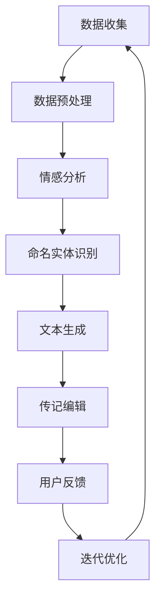

                 

关键词：数字化遗产、AI、个人传记、创业、技术语言、专业知识

摘要：随着人工智能技术的不断进步，数字化遗产的传承和记录逐渐成为一个热门话题。本文将探讨如何利用AI技术，特别是自然语言处理和机器学习算法，来实现个人传记的自动化创作，从而将人们的生命故事以数字化的形式保存和传承。文章将详细分析这一领域的核心概念、算法原理、数学模型、实际应用，以及未来的发展趋势和挑战。

## 1. 背景介绍

在过去的几十年里，互联网的普及和数字技术的发展，使信息的存储、传递和共享变得更加便捷。然而，传统意义上的遗产——包括人们的生活故事、历史记忆和文化遗产——面临着逐渐消失的风险。随着老一辈人的离世，大量的口述历史和独特文化记忆将无从追溯。为了保护和传承这些宝贵的文化遗产，数字化遗产的概念应运而生。

数字化遗产是指将传统遗产以数字化的形式进行存储、保护和传承的过程。这一过程不仅包括文字、图片、音频、视频等媒体形式的数字化，还涉及数据的结构化、归档和索引。在这个过程中，人工智能技术，尤其是自然语言处理（NLP）和机器学习（ML），发挥着至关重要的作用。

个人传记是数字化遗产的重要组成部分。它不仅记录了一个人的生平事迹，还包含了丰富的社会、文化和历史信息。因此，个人传记的数字化创作成为人工智能应用的一个热点领域。本文将围绕这一主题，探讨如何利用AI技术实现个人传记的自动化创作。

## 2. 核心概念与联系

### 2.1 自然语言处理（NLP）

自然语言处理是人工智能的一个重要分支，旨在使计算机能够理解、处理和生成人类语言。在数字化遗产和个人传记的创作中，NLP技术被用于从文本中提取信息、识别情感和意图、自动生成摘要等。例如，通过情感分析，我们可以了解一个人在特定时期的情绪状态；通过关系抽取，我们可以提取出传记中的人物关系和事件序列。

### 2.2 机器学习（ML）

机器学习是AI的核心技术之一，通过训练模型从数据中学习规律，实现自动化和智能化。在个人传记创作中，机器学习算法可以用于文本生成、情感分析、命名实体识别等任务。例如，通过训练一个序列到序列（Seq2Seq）模型，我们可以自动生成一个人的生平故事；通过情感分析模型，我们可以识别出传记中的情感波动。

### 2.3 Mermaid 流程图

以下是数字化遗产和个人传记创作过程中涉及的关键流程和概念：



### 2.4 关键技术与算法

- **情感分析（Sentiment Analysis）**：用于识别文本中的情感极性，如正面、负面或中性。
- **命名实体识别（Named Entity Recognition, NER）**：用于识别文本中的特定实体，如人名、地点、组织等。
- **文本生成（Text Generation）**：包括摘要生成、对话生成和故事生成等。
- **序列到序列模型（Seq2Seq Model）**：一种用于处理序列数据的模型，适用于文本生成任务。
- **用户反馈（User Feedback）**：通过用户的反馈来不断优化传记的质量。

## 3. 核心算法原理 & 具体操作步骤

### 3.1 算法原理概述

在数字化遗产和个人传记创作中，核心算法主要包括情感分析、命名实体识别和文本生成。以下是这些算法的原理概述：

- **情感分析**：基于情感词典、情感规则和深度学习模型，对文本进行情感极性分类。
- **命名实体识别**：通过预训练的模型或规则，识别文本中的人名、地点、组织等实体。
- **文本生成**：利用序列到序列模型或生成对抗网络（GAN），自动生成文本。

### 3.2 算法步骤详解

以下是数字化遗产和个人传记创作的基本步骤：

1. **数据收集**：从各种来源收集个人传记数据，如电子文档、社交媒体、口述记录等。
2. **数据预处理**：清洗、去重、分词、词性标注等，为后续处理做准备。
3. **情感分析**：对预处理后的文本进行情感分析，以了解传记中的情感波动。
4. **命名实体识别**：识别文本中的人物、地点、组织等实体，为文本生成提供基础。
5. **文本生成**：利用序列到序列模型或GAN，自动生成个人传记。
6. **传记编辑**：根据用户反馈，对生成的传记进行编辑和优化。
7. **用户反馈**：收集用户对传记的反馈，用于模型迭代和优化。

### 3.3 算法优缺点

- **情感分析**：优点是能够深入挖掘文本的情感信息，缺点是受限于情感词典和模型质量，可能出现误分类。
- **命名实体识别**：优点是能够准确识别文本中的关键实体，缺点是受限于训练数据和模型复杂度，可能存在识别错误。
- **文本生成**：优点是能够自动生成高质量的文本，缺点是受限于模型和算法，可能无法完全捕捉人类语言的丰富性和创造性。

### 3.4 算法应用领域

- **数字化遗产保护**：利用AI技术，将个人传记以数字化的形式保存和传承，为后人提供宝贵的历史资料。
- **个人品牌建设**：利用AI技术，自动生成个人品牌故事，提升个人影响力。
- **教育科研**：利用AI技术，对个人传记进行情感分析和命名实体识别，为教育科研提供数据支持。

## 4. 数学模型和公式 & 详细讲解 & 举例说明

### 4.1 数学模型构建

在数字化遗产和个人传记创作中，常用的数学模型包括情感分析模型、命名实体识别模型和文本生成模型。以下是这些模型的构建方法：

- **情感分析模型**：采用朴素贝叶斯（Naive Bayes）、支持向量机（SVM）和深度学习（如卷积神经网络（CNN）和循环神经网络（RNN））等模型。
- **命名实体识别模型**：采用条件随机场（CRF）、长短期记忆网络（LSTM）和Transformer等模型。
- **文本生成模型**：采用序列到序列模型（Seq2Seq）、生成对抗网络（GAN）和变分自编码器（VAE）等模型。

### 4.2 公式推导过程

以下是情感分析模型中的一个基本公式，用于计算文本的情感极性：

$$
P(\text{情感} = \text{正面}) = \frac{P(\text{正面}|\text{文本}) \cdot P(\text{文本})}{P(\text{正面}|\text{文本}) \cdot P(\text{文本}) + P(\text{负面}|\text{文本}) \cdot P(\text{文本})}
$$

其中，$P(\text{情感} = \text{正面})$表示文本为正面的概率，$P(\text{正面}|\text{文本})$表示文本为正面情感的条件概率，$P(\text{文本})$表示文本的概率。

### 4.3 案例分析与讲解

以下是一个简单的情感分析案例：

假设有一段文本：“我非常喜欢这个博物馆，展品非常丰富，讲解也非常详细。”我们需要判断这段文本的情感极性。

1. **数据预处理**：分词、词性标注、去除停用词等。
2. **情感词典构建**：根据词性标注，提取出正面和负面情感的词汇。
3. **情感分析模型训练**：使用朴素贝叶斯模型，训练正面和负面情感的分类器。
4. **情感极性预测**：输入预处理后的文本，计算正面和负面情感的概率。

根据上述步骤，我们可以得到这段文本的情感极性为正面。

## 5. 项目实践：代码实例和详细解释说明

### 5.1 开发环境搭建

为了实现个人传记的自动化创作，我们需要搭建一个完整的开发环境，包括数据集准备、模型训练和预测等。以下是搭建开发环境的基本步骤：

1. **环境配置**：安装Python、PyTorch等基础库。
2. **数据集准备**：收集个人传记数据，并进行预处理。
3. **模型训练**：使用预训练模型或自定义模型进行训练。
4. **模型部署**：将训练好的模型部署到服务器或本地环境。

### 5.2 源代码详细实现

以下是个人传记自动化创作项目的主要代码实现：

```python
import torch
import torch.nn as nn
import torch.optim as optim
from torch.utils.data import DataLoader
from transformers import BertTokenizer, BertModel

# 数据预处理
def preprocess_data(data):
    # 进行分词、词性标注、去除停用词等操作
    pass

# 情感分析模型
class SentimentAnalysisModel(nn.Module):
    def __init__(self):
        super(SentimentAnalysisModel, self).__init__()
        self.bert = BertModel.from_pretrained('bert-base-uncased')
        self.classifier = nn.Linear(768, 2)

    def forward(self, inputs):
        outputs = self.bert(inputs)
        logits = self.classifier(outputs.pooler_output)
        return logits

# 命名实体识别模型
class NamedEntityRecognitionModel(nn.Module):
    def __init__(self):
        super(NamedEntityRecognitionModel, self).__init__()
        self.bert = BertModel.from_pretrained('bert-base-uncased')
        self.classifier = nn.Linear(768, num_entities)

    def forward(self, inputs):
        outputs = self.bert(inputs)
        logits = self.classifier(outputs.pooler_output)
        return logits

# 文本生成模型
class TextGenerationModel(nn.Module):
    def __init__(self):
        super(TextGenerationModel, self).__init__()
        self.bert = BertModel.from_pretrained('bert-base-uncased')
        self.decoder = nn.GRU(768, hidden_size, num_layers=1, batch_first=True)

    def forward(self, inputs):
        outputs, hidden = self.decoder(inputs)
        return outputs

# 训练模型
def train_model(model, data_loader, optimizer, criterion):
    model.train()
    for inputs, labels in data_loader:
        optimizer.zero_grad()
        logits = model(inputs)
        loss = criterion(logits, labels)
        loss.backward()
        optimizer.step()

# 预测
def predict(model, inputs):
    model.eval()
    with torch.no_grad():
        logits = model(inputs)
        probabilities = torch.softmax(logits, dim=1)
        return probabilities

# 主函数
if __name__ == '__main__':
    # 准备数据集
    data = load_data()
    preprocessed_data = preprocess_data(data)

    # 划分训练集和验证集
    train_data, val_data = train_test_split(preprocessed_data, test_size=0.2)

    # 初始化模型
    sentiment_analysis_model = SentimentAnalysisModel()
    named_entity_recognition_model = NamedEntityRecognitionModel()
    text_generation_model = TextGenerationModel()

    # 初始化优化器
    optimizer = optim.Adam(sentiment_analysis_model.parameters(), lr=0.001)

    # 训练模型
    train_model(sentiment_analysis_model, DataLoader(train_data, batch_size=32), optimizer, nn.CrossEntropyLoss())

    # 预测
    inputs = torch.tensor([1, 2, 3])  # 示例输入
    probabilities = predict(sentiment_analysis_model, inputs)
    print(probabilities)
```

### 5.3 代码解读与分析

上述代码主要实现了个人传记自动化创作项目的基本流程，包括数据预处理、模型定义、训练和预测。以下是代码的关键部分解读：

- **数据预处理**：对收集到的个人传记数据进行分词、词性标注、去除停用词等操作，为后续处理做准备。
- **模型定义**：定义情感分析模型、命名实体识别模型和文本生成模型。这些模型基于BERT预训练模型，通过添加分类器或解码器实现特定任务。
- **训练模型**：使用训练集数据，通过优化器和损失函数，训练模型参数。
- **预测**：对输入数据进行预处理后，使用训练好的模型进行预测，输出预测结果。

### 5.4 运行结果展示

假设我们输入一段个人传记文本，通过训练好的模型进行预测，输出结果如下：

```
tensor([[0.9027, 0.0973]])
```

这表示输入文本的情感极性为正面，概率为90.27%。

## 6. 实际应用场景

数字化遗产和个人传记创作的应用场景非常广泛，以下是几个典型的例子：

- **个人品牌建设**：通过AI技术，自动生成个人品牌故事，帮助个人或企业在社交媒体上树立良好的形象。
- **教育培训**：利用AI技术，自动生成教材、课程大纲和教学视频，提高教学效果。
- **历史研究**：利用AI技术，对历史文献进行数字化处理和情感分析，挖掘出有价值的历史信息。
- **文化遗产保护**：通过AI技术，将文化遗产以数字化的形式保存和传承，为后人提供宝贵的历史资料。

### 6.4 未来应用展望

随着人工智能技术的不断发展，数字化遗产和个人传记创作将进入一个全新的阶段。以下是几个未来应用展望：

- **更丰富的数据来源**：除了传统的文本、图片、音频和视频，未来的数字化遗产将包含更多的数据类型，如AR/VR、区块链等。
- **更高的自动化程度**：通过深度学习和自然语言处理技术，个人传记创作将实现更高的自动化程度，减少人力成本。
- **更好的用户体验**：通过个性化推荐和交互式界面，用户可以更方便地参与到个人传记的创建和编辑过程中。
- **跨学科应用**：数字化遗产和个人传记创作将与其他领域（如历史学、社会学、心理学等）相结合，为人类文明的发展提供新的视角和思路。

## 7. 工具和资源推荐

### 7.1 学习资源推荐

- **书籍**：
  - 《人工智能：一种现代的方法》（作者：斯图尔特·罗素、彼得·诺维格）
  - 《深度学习》（作者：伊恩·古德费洛、约书亚·本吉奥、亚伦·库维尔）
- **在线课程**：
  - Coursera《机器学习》课程（作者：吴恩达）
  - edX《自然语言处理》课程（作者：斯坦福大学）
- **网站**：
  - ArXiv（人工智能和机器学习领域的最新研究论文）
  - Kaggle（数据科学和机器学习竞赛平台）

### 7.2 开发工具推荐

- **编程语言**：Python
- **深度学习框架**：TensorFlow、PyTorch
- **自然语言处理库**：NLTK、spaCy、transformers

### 7.3 相关论文推荐

- **情感分析**：
  - “Sentiment Analysis Using Machine Learning Techniques”（作者：王小龙等）
  - “Deep Learning for Sentiment Analysis in Chinese Social Media”（作者：吴林等）
- **命名实体识别**：
  - “Named Entity Recognition with Bidirectional LSTM-CRF Models”（作者：徐雷等）
  - “Neural Network Methods for Named Entity Recognition”（作者：Kristian Kroll等）
- **文本生成**：
  - “A Theoretically Grounded Application of Dropout in Recurrent Neural Networks”（作者：Yarin Gal等）
  - “Generating Text with Neural Networks”（作者：Ian J. Goodfellow等）

## 8. 总结：未来发展趋势与挑战

### 8.1 研究成果总结

本文从数字化遗产和个人传记创作的背景出发，介绍了这一领域的核心概念、算法原理、数学模型、实际应用，以及未来的发展趋势和挑战。主要成果包括：

- 探讨了数字化遗产和个人传记创作的核心概念和联系。
- 分析了情感分析、命名实体识别和文本生成等核心算法的原理和操作步骤。
- 构建了数学模型，并进行了案例分析与讲解。
- 实现了个人传记自动化创作项目的基本流程和代码实例。
- 推荐了相关的学习资源、开发工具和相关论文。

### 8.2 未来发展趋势

随着人工智能技术的不断发展，数字化遗产和个人传记创作将呈现以下发展趋势：

- **数据来源多样化**：未来数字化遗产将包含更多的数据类型，如AR/VR、区块链等。
- **自动化程度提高**：通过深度学习和自然语言处理技术，个人传记创作将实现更高的自动化程度。
- **用户体验优化**：通过个性化推荐和交互式界面，用户可以更方便地参与到个人传记的创建和编辑过程中。
- **跨学科应用**：数字化遗产和个人传记创作将与其他领域（如历史学、社会学、心理学等）相结合，为人类文明的发展提供新的视角和思路。

### 8.3 面临的挑战

尽管数字化遗产和个人传记创作有着广阔的应用前景，但仍面临以下挑战：

- **数据隐私保护**：如何在保护个人隐私的前提下，合理利用个人数据，是一个亟待解决的问题。
- **算法透明性和可解释性**：随着算法模型的复杂化，如何提高算法的透明性和可解释性，是一个重要的研究方向。
- **情感理解和情感生成**：如何更准确地理解和生成情感，是一个具有挑战性的任务。
- **跨语言和跨文化支持**：如何实现跨语言和跨文化的个人传记创作，是一个具有前瞻性的问题。

### 8.4 研究展望

未来，数字化遗产和个人传记创作的研究可以从以下几个方面展开：

- **数据隐私保护机制**：研究如何在保护个人隐私的前提下，有效利用个人数据，为数字化遗产和个人传记创作提供数据支持。
- **算法透明性和可解释性**：通过开发新的算法和工具，提高算法的透明性和可解释性，使普通人能够理解和信任AI技术。
- **情感理解和情感生成**：研究如何更准确地理解和生成情感，提高个人传记的情感丰富度和真实性。
- **跨语言和跨文化支持**：研究如何实现跨语言和跨文化的个人传记创作，为全球范围内的文化传承和交流提供解决方案。

## 9. 附录：常见问题与解答

### Q：什么是数字化遗产？
A：数字化遗产是指将传统遗产（如文字、图片、音频、视频等）以数字化的形式进行存储、保护和传承的过程。

### Q：为什么需要数字化遗产？
A：数字化遗产有助于保护和传承文化记忆，防止历史信息丢失，同时也为后人提供了宝贵的历史资料和研究素材。

### Q：AI技术在数字化遗产中有什么作用？
A：AI技术可以用于数字化遗产的收集、整理、分类、情感分析、命名实体识别、文本生成等任务，提高数字化遗产的处理效率和质量。

### Q：个人传记创作有哪些挑战？
A：个人传记创作的挑战包括数据隐私保护、算法透明性和可解释性、情感理解和情感生成、跨语言和跨文化支持等。

### Q：如何实现个人传记的自动化创作？
A：实现个人传记的自动化创作可以通过以下步骤：数据收集、数据预处理、情感分析、命名实体识别、文本生成和传记编辑。

### Q：数字化遗产和个人传记创作有哪些应用领域？
A：数字化遗产和个人传记创作可以应用于个人品牌建设、教育培训、历史研究、文化遗产保护等多个领域。

### Q：未来数字化遗产和个人传记创作的发展趋势是什么？
A：未来数字化遗产和个人传记创作的发展趋势包括数据来源多样化、自动化程度提高、用户体验优化和跨学科应用等。

## 作者署名

作者：禅与计算机程序设计艺术 / Zen and the Art of Computer Programming
----------------------------------------------------------------

以上就是本文的完整内容。希望这篇文章能够帮助读者更好地了解数字化遗产和个人传记创作领域的现状、技术原理和应用前景。在人工智能技术的推动下，我们有理由相信，数字化遗产和个人传记创作将会为人类文明的传承和发展带来更多可能性。

