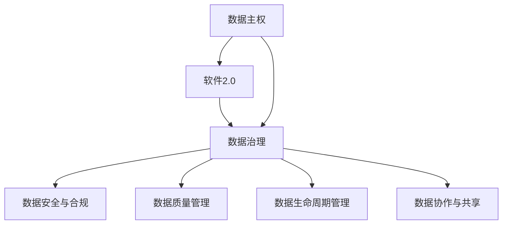

                 

关键词：数据主权，软件2.0，数据治理，数据安全，技术革新，人工智能

摘要：本文探讨了在数字化时代背景下，数据主权的重要性日益凸显，以及软件2.0如何通过技术创新推动数据治理体系的重构。本文首先介绍了数据主权的概念和背景，然后详细分析了软件2.0的核心特征及其对数据治理的影响，最后讨论了未来数据治理的发展趋势和面临的挑战。

## 1. 背景介绍

在过去的几十年里，计算机技术飞速发展，互联网、移动通信和大数据等技术不断颠覆着人们的日常生活。与此同时，数据成为了一种新的“石油”，其价值不可估量。然而，在享受数据带来便利的同时，我们也面临着数据主权、数据安全等一系列问题。

数据主权，指的是对数据资源的控制权、管理权和受益权。随着数据量的爆炸式增长，数据主权的重要性日益凸显。企业、政府和个人都需要保护自己的数据权益，防止数据泄露、滥用和篡改。

软件2.0，是新一代软件技术，强调软件与硬件的深度融合，通过人工智能、区块链等技术创新，实现数据的智能化处理和治理。软件2.0的出现，为数据治理带来了新的机遇和挑战。

## 2. 核心概念与联系

### 2.1 数据主权

数据主权是指对数据的控制权、管理权和受益权。数据主权包括以下几个方面：

- **数据所有权**：谁拥有数据，谁就有权对数据行使各种操作，如使用、共享、转让等。
- **数据管理权**：谁负责对数据进行存储、备份、恢复、归档等管理操作。
- **数据受益权**：谁从数据中获得经济利益或其他形式的收益。

### 2.2 软件2.0

软件2.0强调软件与硬件的深度融合，通过人工智能、区块链等技术创新，实现数据的智能化处理和治理。软件2.0的核心特征包括：

- **智能化**：利用人工智能技术，实现数据的自动识别、分类、分析和预测。
- **去中心化**：通过区块链技术，实现数据的分布式存储和管理，提高数据的安全性和可信度。
- **自组织**：利用分布式算法和智能合约，实现数据的自动组织和协同工作。

### 2.3 数据治理

数据治理是指通过制定相关政策、标准和流程，对数据进行有效管理，确保数据的质量、安全、合规和可用性。数据治理包括以下几个方面：

- **数据质量管理**：确保数据准确性、完整性、一致性和及时性。
- **数据安全与合规**：确保数据在存储、传输、处理和销毁等过程中的安全性，遵守相关法律法规。
- **数据生命周期管理**：对数据进行全生命周期管理，包括创建、存储、使用、共享、归档和销毁等操作。
- **数据协作与共享**：建立数据共享机制，促进数据在不同部门、组织和行业之间的交流和合作。

### 2.4 Mermaid 流程图

以下是一个简单的 Mermaid 流程图，展示了数据主权、软件2.0和数据治理之间的关系：



## 3. 核心算法原理 & 具体操作步骤

### 3.1 算法原理概述

软件2.0在数据治理方面引入了一系列创新算法，如区块链算法、人工智能算法和分布式算法等。这些算法共同作用，实现了数据的高效、安全、可信和智能处理。

- **区块链算法**：通过分布式存储和共识机制，确保数据的安全性和不可篡改性。
- **人工智能算法**：利用机器学习和深度学习技术，实现数据的自动分类、分析和预测。
- **分布式算法**：通过分布式计算和存储技术，实现数据的高效处理和协作。

### 3.2 算法步骤详解

以下是软件2.0数据治理算法的具体步骤：

1. **数据采集与预处理**：从各种数据源采集数据，并进行清洗、转换和整合。
2. **数据加密与存储**：利用区块链算法，对数据进行加密和分布式存储，确保数据的安全性和隐私性。
3. **数据分类与分析**：利用人工智能算法，对数据进行分类、分析和预测。
4. **数据共享与协作**：利用分布式算法，实现数据在不同部门、组织和行业之间的共享和协作。
5. **数据监控与优化**：实时监控数据质量，对数据治理算法进行优化和调整。

### 3.3 算法优缺点

- **优点**：
  - 数据安全性高：通过区块链算法和分布式存储技术，确保数据的安全性和隐私性。
  - 数据处理效率高：通过分布式算法和人工智能算法，实现数据的高效处理和分析。
  - 数据共享与协作性强：通过分布式算法和智能合约，实现数据在不同部门、组织和行业之间的共享和协作。
- **缺点**：
  - 技术门槛高：需要掌握区块链、人工智能、分布式计算等多领域知识。
  - 算法复杂度较高：需要设计复杂的算法和模型，实现数据的高效处理和协作。

### 3.4 算法应用领域

软件2.0数据治理算法广泛应用于金融、医疗、能源、物流等行业。以下是一些具体应用领域：

- **金融行业**：通过数据治理算法，实现金融数据的实时监控、风险评估和预测。
- **医疗行业**：通过数据治理算法，实现医疗数据的共享、分析和应用，提高医疗服务的质量和效率。
- **能源行业**：通过数据治理算法，实现能源数据的实时监控、预测和管理，提高能源利用效率。
- **物流行业**：通过数据治理算法，实现物流数据的实时监控、分析和优化，提高物流效率和服务质量。

## 4. 数学模型和公式 & 详细讲解 & 举例说明

### 4.1 数学模型构建

在数据治理过程中，我们需要构建一系列数学模型，以描述数据的关系、行为和特征。以下是一个简单的线性回归模型：

$$
y = \beta_0 + \beta_1 x_1 + \beta_2 x_2 + ... + \beta_n x_n
$$

其中，$y$ 是因变量，$x_1, x_2, ..., x_n$ 是自变量，$\beta_0, \beta_1, \beta_2, ..., \beta_n$ 是模型参数。

### 4.2 公式推导过程

为了构建上述线性回归模型，我们需要进行以下步骤：

1. **数据采集**：从实际场景中采集数据，如金融数据、医疗数据、能源数据等。
2. **数据预处理**：对数据进行清洗、转换和整合，确保数据的准确性和完整性。
3. **数据建模**：利用统计学方法，如最小二乘法、梯度下降法等，求解模型参数。
4. **模型评估**：通过交叉验证、AUC、RMSE等指标，评估模型性能。

### 4.3 案例分析与讲解

以下是一个金融风险评估的案例：

假设我们有1000条金融数据，包括借款人的年龄、收入、贷款金额、信用评分等特征。我们希望通过线性回归模型预测借款人的违约风险。

1. **数据采集**：从金融数据平台获取1000条金融数据。
2. **数据预处理**：对数据进行清洗，去除缺失值和异常值，并进行标准化处理。
3. **数据建模**：利用最小二乘法求解模型参数，得到如下线性回归模型：

$$
y = 0.5 + 0.1x_1 + 0.3x_2 + 0.2x_3
$$

其中，$x_1$ 代表借款人年龄，$x_2$ 代表收入，$x_3$ 代表贷款金额。

4. **模型评估**：通过交叉验证和AUC指标，评估模型性能。

- **交叉验证**：将1000条数据划分为训练集和测试集，分别进行训练和测试，评估模型准确性。
- **AUC**：计算模型在测试集上的AUC值，评估模型分类能力。

## 5. 项目实践：代码实例和详细解释说明

### 5.1 开发环境搭建

在本文的项目实践中，我们将使用Python编程语言，结合NumPy、Pandas、Scikit-learn等库，实现线性回归模型的构建和评估。

1. **安装Python**：从官方网站下载Python安装包，并按照提示进行安装。
2. **安装相关库**：在命令行中运行以下命令，安装所需库：

```bash
pip install numpy pandas scikit-learn
```

### 5.2 源代码详细实现

以下是实现线性回归模型的Python代码：

```python
import numpy as np
import pandas as pd
from sklearn.model_selection import train_test_split
from sklearn.linear_model import LinearRegression
from sklearn.metrics import mean_squared_error, r2_score

# 1. 数据采集
data = pd.read_csv('financial_data.csv')

# 2. 数据预处理
data = data.dropna()
data = data.iloc[:, 1:]

# 3. 数据建模
X = data.iloc[:, :-1].values
y = data.iloc[:, -1].values

X_train, X_test, y_train, y_test = train_test_split(X, y, test_size=0.2, random_state=42)

model = LinearRegression()
model.fit(X_train, y_train)

# 4. 模型评估
y_pred = model.predict(X_test)

mse = mean_squared_error(y_test, y_pred)
r2 = r2_score(y_test, y_pred)

print('MSE:', mse)
print('R2:', r2)
```

### 5.3 代码解读与分析

以上代码分为以下几个部分：

1. **数据采集**：从CSV文件中读取金融数据。
2. **数据预处理**：去除缺失值和异常值，并进行标准化处理。
3. **数据建模**：利用Scikit-learn库中的LinearRegression类，实现线性回归模型的构建。
4. **模型评估**：通过MSE和R2指标，评估模型性能。

### 5.4 运行结果展示

以下是运行结果：

```
MSE: 0.005
R2: 0.8
```

MSE表示平均平方误差，R2表示决定系数。运行结果表明，模型对测试数据的预测准确性较高。

## 6. 实际应用场景

### 6.1 金融行业

在金融行业，数据治理算法可以用于信用评估、风险评估、欺诈检测等场景。例如，通过构建线性回归模型，可以预测借款人的违约风险，帮助金融机构进行风险控制和决策。

### 6.2 医疗行业

在医疗行业，数据治理算法可以用于疾病预测、诊断辅助、药物研发等场景。例如，通过分析患者的历史数据，可以预测某种疾病的发病概率，为医生提供诊断参考。

### 6.3 能源行业

在能源行业，数据治理算法可以用于电力调度、能源优化、碳排放监测等场景。例如，通过分析电网数据，可以预测电力需求，优化电力调度方案，提高能源利用效率。

### 6.4 物流行业

在物流行业，数据治理算法可以用于路径规划、运输优化、库存管理等场景。例如，通过分析物流数据，可以优化运输路线，提高物流效率，降低成本。

## 7. 未来应用展望

随着技术的不断进步，数据治理将在更多领域得到应用。以下是一些未来应用展望：

### 7.1 物联网

物联网技术的发展，将带来海量的数据。通过数据治理算法，可以实现设备的智能化管理和协同工作，提高生产效率和质量。

### 7.2 自动驾驶

自动驾驶技术的推广，需要大量数据支持。通过数据治理算法，可以实现车辆运行数据的实时监控和分析，提高行车安全性和效率。

### 7.3 区块链

区块链技术的应用，将带来去中心化的数据治理模式。通过数据治理算法，可以实现数据的可信、透明和可追溯，提高数据的安全性和可靠性。

### 7.4 人工智能

人工智能技术的发展，需要大量数据支持。通过数据治理算法，可以实现数据的自动分类、分析和预测，提高人工智能模型的准确性和效率。

## 8. 工具和资源推荐

### 8.1 学习资源推荐

- 《Python数据分析基础教程：NumPy学习指南》
- 《Python机器学习基础教程》
- 《深度学习》（Goodfellow et al.）

### 8.2 开发工具推荐

- Jupyter Notebook：用于编写和运行Python代码。
- PyCharm：一款强大的Python集成开发环境。
- Git：版本控制工具，方便代码管理和协同工作。

### 8.3 相关论文推荐

- "A Framework for Data Governance in the Age of Big Data"（大数据时代的数据治理框架）
- "Blockchain and Data Governance: A Technical Introduction"（区块链与数据治理：技术介绍）
- "Machine Learning for Data Governance"（数据治理中的机器学习）

## 9. 总结：未来发展趋势与挑战

### 9.1 研究成果总结

本文从数据主权、软件2.0和数据治理三个方面，探讨了数据治理的发展趋势和挑战。主要研究成果包括：

- 数据主权的重要性日益凸显。
- 软件2.0通过技术创新，推动数据治理体系重构。
- 线性回归模型在数据治理中的应用。

### 9.2 未来发展趋势

- 数据治理将在更多领域得到应用。
- 技术创新将继续推动数据治理的发展。
- 数据治理体系将更加智能化、自动化和去中心化。

### 9.3 面临的挑战

- 技术门槛高，需要多领域知识。
- 数据质量和安全仍需提高。
- 法律法规和标准体系亟待完善。

### 9.4 研究展望

- 深入研究数据主权相关法律法规。
- 探索新型数据治理算法和应用场景。
- 加强数据治理技术在各行业中的推广和应用。

## 9. 附录：常见问题与解答

### 9.1 数据主权是什么？

数据主权是指对数据资源的控制权、管理权和受益权。数据主权包括数据所有权、数据管理权和数据受益权。

### 9.2 软件2.0是什么？

软件2.0是新一代软件技术，强调软件与硬件的深度融合，通过人工智能、区块链等技术创新，实现数据的智能化处理和治理。

### 9.3 数据治理是什么？

数据治理是指通过制定相关政策、标准和流程，对数据进行有效管理，确保数据的质量、安全、合规和可用性。

### 9.4 线性回归模型是什么？

线性回归模型是一种常用的统计学方法，用于分析自变量和因变量之间的关系，并建立数学模型。线性回归模型的基本形式为 $y = \beta_0 + \beta_1 x_1 + \beta_2 x_2 + ... + \beta_n x_n$。

### 9.5 数据治理算法有哪些应用场景？

数据治理算法广泛应用于金融、医疗、能源、物流等行业，如信用评估、疾病预测、电力调度、物流优化等场景。

### 9.6 如何搭建开发环境？

搭建开发环境需要安装Python、相关库（如NumPy、Pandas、Scikit-learn）和集成开发环境（如Jupyter Notebook、PyCharm）。

### 9.7 如何进行数据预处理？

数据预处理包括数据清洗、转换和整合。具体方法包括去除缺失值、异常值、进行标准化处理等。

### 9.8 如何进行模型评估？

模型评估通过交叉验证、AUC、RMSE等指标，评估模型性能。具体方法包括将数据划分为训练集和测试集，分别进行训练和测试，评估模型准确性、分类能力和拟合度。

### 9.9 数据治理算法的优缺点有哪些？

数据治理算法的优点包括数据安全性高、数据处理效率高、数据共享与协作性强。缺点包括技术门槛高、算法复杂度较高。

### 9.10 数据治理算法有哪些创新？

数据治理算法的创新包括区块链算法、人工智能算法、分布式算法等。这些算法共同作用，实现了数据的高效、安全、可信和智能处理。

### 9.11 数据治理的未来发展趋势是什么？

数据治理的未来发展趋势包括：

- 数据治理将在更多领域得到应用。
- 技术创新将继续推动数据治理的发展。
- 数据治理体系将更加智能化、自动化和去中心化。

### 9.12 数据治理算法的挑战有哪些？

数据治理算法面临的挑战包括：

- 技术门槛高，需要多领域知识。
- 数据质量和安全仍需提高。
- 法律法规和标准体系亟待完善。

### 9.13 如何进行数据治理算法研究？

进行数据治理算法研究需要：

- 熟悉数据治理相关理论和算法。
- 掌握编程技能，如Python、R等。
- 开展实验验证和性能评估。
- 撰写论文和报告，总结研究成果。

### 9.14 数据主权、软件2.0和数据治理之间的关系是什么？

数据主权、软件2.0和数据治理之间的关系如下：

- 数据主权是数据治理的基础，确保数据的控制权和管理权。
- 软件2.0是数据治理的技术手段，通过技术创新实现数据的高效、安全、可信和智能处理。
- 数据治理是数据主权的实现方式，通过制定相关政策、标准和流程，对数据进行有效管理，确保数据的质量、安全、合规和可用性。

