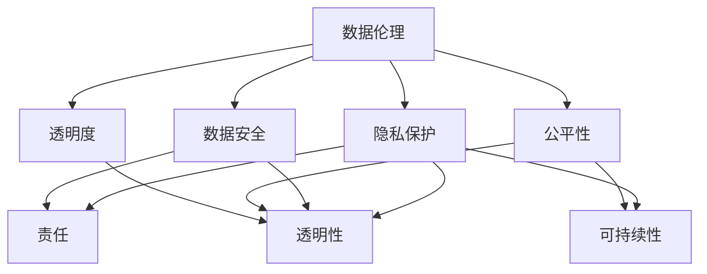

                 

 **关键词**：数据伦理、算法治理、规范性、隐私保护、算法公平、透明度

**摘要**：本文深入探讨了数据伦理在算法治理中的重要性，探讨了算法治理的规范性和透明度，以及如何保护用户隐私和维护算法的公平性。文章首先回顾了数据伦理的历史背景，然后详细分析了算法治理的核心概念和原则，接着讨论了数学模型在算法治理中的应用。通过实际项目实践和代码实例，文章展示了算法治理的具体操作步骤和注意事项。最后，文章提出了未来数据伦理和算法治理的发展趋势以及面临的挑战。

## 1. 背景介绍

随着互联网的飞速发展和大数据时代的到来，数据已经成为了现代社会的重要资产。然而，数据的大规模收集、存储和使用也引发了一系列伦理问题。数据伦理是指在数据处理过程中，如何平衡技术创新和道德责任的问题。它涉及到隐私保护、数据安全、公平性和透明度等多个方面。

在数据伦理中，算法治理是一个关键议题。算法治理指的是对算法的开发、部署和应用进行规范化管理，以确保算法的透明性、公平性和安全性。算法治理不仅关乎技术本身，还涉及到法律、伦理和社会责任等多个层面。

### 1.1 数据伦理的历史背景

数据伦理的概念并非近年来才出现。早在20世纪60年代，计算机科学家和哲学家就已经开始关注数据处理中的伦理问题。1963年，计算机科学家约翰·帕特里克·霍普金斯（John P. Hopkins）提出了“计算机伦理学”（Computer Ethics）的概念。他认为，计算机技术的发展带来了许多新的伦理问题，如隐私、安全、知识产权等。

随着互联网的兴起，数据伦理问题变得更加复杂。大数据、人工智能和云计算等技术的应用，使得数据的收集、存储和使用变得更加容易。然而，这也引发了大量的伦理争议，如用户隐私泄露、数据滥用、算法歧视等。

### 1.2 算法治理的必要性

算法治理的必要性体现在多个方面。首先，算法的透明性和公平性是确保算法治理的基础。不透明的算法可能会导致用户隐私泄露、数据滥用和算法歧视等问题。其次，算法的规范化管理有助于提高算法的安全性和可靠性。最后，算法治理有助于维护社会的公平正义，防止技术滥用对社会造成负面影响。

### 1.3 本文结构

本文将首先回顾数据伦理的历史背景，然后详细分析算法治理的核心概念和原则，接着讨论数学模型在算法治理中的应用。通过实际项目实践和代码实例，本文将展示算法治理的具体操作步骤和注意事项。最后，本文将提出未来数据伦理和算法治理的发展趋势以及面临的挑战。

## 2. 核心概念与联系

### 2.1 数据伦理的核心概念

数据伦理的核心概念包括隐私保护、数据安全、公平性和透明度等。以下是这些概念的定义和联系：

#### 隐私保护

隐私保护是指保护个人数据不被未经授权的第三方访问和使用。它涉及到数据收集、存储、处理和共享等各个环节。隐私保护的核心目标是确保用户的信息安全，防止隐私泄露。

#### 数据安全

数据安全是指保护数据免受未经授权的访问、篡改、泄露和破坏。数据安全涉及到数据加密、访问控制、备份和恢复等多个方面。数据安全的目标是确保数据在存储和处理过程中不受损害。

#### 公平性

公平性是指算法在处理数据时，对不同的个体或群体给予公正的待遇。算法公平性是算法治理的重要目标，它有助于防止算法歧视和不公平现象的发生。

#### 透明度

透明度是指算法的决策过程和结果对用户和社会是可理解的。算法透明度有助于提高用户对算法的信任度，降低误解和争议。

### 2.2 算法治理的核心概念

算法治理的核心概念包括透明性、公平性、责任和可持续性等。以下是这些概念的定义和联系：

#### 透明性

透明性是指算法的决策过程和结果对用户和社会是可理解的。透明性有助于提高用户对算法的信任度，降低误解和争议。

#### 公平性

公平性是指算法在处理数据时，对不同的个体或群体给予公正的待遇。公平性有助于防止算法歧视和不公平现象的发生。

#### 责任

责任是指算法开发者、部署者和使用者应对算法的决策过程和结果承担法律责任和道德责任。责任有助于确保算法的合规性和安全性。

#### 可持续性

可持续性是指算法的长期发展对社会和环境是负责任的。可持续性有助于确保算法的长期可用性和可持续性。

### 2.3 数据伦理与算法治理的联系

数据伦理和算法治理之间存在紧密的联系。数据伦理为算法治理提供了伦理基础和指导原则，而算法治理则是数据伦理在实践中的具体体现。

#### 数据伦理对算法治理的指导作用

数据伦理为算法治理提供了伦理基础和指导原则。数据伦理强调隐私保护、数据安全、公平性和透明度，这些原则对算法治理具有重要的指导意义。例如，隐私保护要求算法在处理用户数据时必须遵守相关法律法规，确保用户隐私不被泄露。数据安全要求算法在设计和部署过程中必须采取有效的安全措施，防止数据被篡改或泄露。

#### 算法治理对数据伦理的保障作用

算法治理则是数据伦理在实践中的具体体现。算法治理通过规范算法的开发、部署和应用，确保数据伦理原则得到有效执行。算法治理有助于提高算法的透明性和公平性，防止算法滥用和歧视现象的发生。例如，算法治理要求算法的决策过程必须公开透明，用户可以了解算法如何处理他们的数据。算法治理还要求算法在处理数据时必须遵循公平性原则，确保不同的个体或群体得到公正的待遇。

### 2.4 核心概念原理和架构的 Mermaid 流程图

以下是一个简单的 Mermaid 流程图，展示了数据伦理与算法治理的核心概念和架构：



## 3. 核心算法原理 & 具体操作步骤

### 3.1 算法原理概述

在数据伦理和算法治理的背景下，我们关注的核心算法包括数据加密算法、隐私保护算法和公平性算法等。这些算法的核心原理如下：

#### 数据加密算法

数据加密算法的核心原理是通过对数据进行加密，确保数据在传输和存储过程中不被窃取或篡改。常见的加密算法包括对称加密和非对称加密。对称加密算法如AES（高级加密标准），使用相同的密钥进行加密和解密。非对称加密算法如RSA（Rivest-Shamir-Adleman），使用一对密钥，即公钥和私钥。

#### 隐私保护算法

隐私保护算法的核心原理是通过数据匿名化、数据混淆和数据聚合等技术，保护用户的隐私。例如，数据匿名化技术如K-Anonymity，通过给数据添加噪声，使得数据无法直接追溯到个体。数据混淆技术如Differential Privacy，通过在数据中添加适当的噪声，使得数据集既保持了对隐私的保护，又保持了统计上的可用性。

#### 公平性算法

公平性算法的核心原理是确保算法在处理数据时，对不同个体或群体给予公正的待遇。公平性算法包括算法偏差检测、算法偏差校正和公平性评估等方法。例如，算法偏差检测方法如统计测试和机器学习中的交叉验证，用于检测算法是否存在偏见。算法偏差校正方法如反事实推理和再训练，用于纠正算法中的偏见。

### 3.2 算法步骤详解

以下是这些算法的具体操作步骤：

#### 数据加密算法

1. 选择合适的加密算法和密钥。
2. 对数据进行加密，生成密文。
3. 将密文传输或存储到安全的地方。
4. 在需要解密时，使用相同的密钥对密文进行解密，恢复原始数据。

#### 隐私保护算法

1. 收集数据并进行分析，确定需要保护的隐私信息。
2. 选择合适的隐私保护技术，如数据匿名化、数据混淆或数据聚合。
3. 对数据应用隐私保护技术，生成隐私保护的数据集。
4. 对隐私保护的数据集进行分析和处理，得出分析结果。

#### 公平性算法

1. 收集数据并进行分析，确定需要评估的群体或个体。
2. 选择合适的公平性评估方法，如统计测试或机器学习中的交叉验证。
3. 对算法进行评估，检测是否存在偏见。
4. 根据评估结果，对算法进行校正或改进，提高算法的公平性。

### 3.3 算法优缺点

以下是这些算法的优缺点：

#### 数据加密算法

- 优点：可以有效保护数据的机密性，防止数据被窃取或篡改。
- 缺点：加密和解密过程需要计算资源，可能会影响数据处理速度。

#### 隐私保护算法

- 优点：可以有效保护用户的隐私，防止数据被滥用或泄露。
- 缺点：可能会影响数据分析的准确性，导致数据噪声增加。

#### 公平性算法

- 优点：可以提高算法的公平性，防止算法歧视和不公平现象的发生。
- 缺点：可能会影响算法的性能，导致计算复杂度增加。

### 3.4 算法应用领域

数据加密算法、隐私保护算法和公平性算法广泛应用于各个领域，如金融、医疗、教育和政府等。以下是这些算法在部分领域的应用实例：

#### 金融领域

- 数据加密算法：用于保护用户的金融信息，如账户密码、交易记录和信用报告等。
- 隐私保护算法：用于保护用户的隐私，如客户个人信息和交易记录等。
- 公平性算法：用于防止金融欺诈，如通过分析用户行为数据，检测是否存在异常交易行为。

#### 医疗领域

- 数据加密算法：用于保护患者的医疗信息，如病历、检查报告和处方等。
- 隐私保护算法：用于保护患者的隐私，如通过数据匿名化技术，确保患者信息不被泄露。
- 公平性算法：用于优化医疗资源的分配，如通过算法预测患者的需求，提高医疗服务的公平性。

#### 教育领域

- 数据加密算法：用于保护学生的个人信息，如成绩、成绩单和奖惩记录等。
- 隐私保护算法：用于保护学生的隐私，如通过数据匿名化技术，确保学生信息不被泄露。
- 公平性算法：用于评估学生的学业表现，如通过算法分析学生的学习数据，公平评估学生的成绩。

#### 政府领域

- 数据加密算法：用于保护政府机密信息，如政策文件、计划方案和机密报告等。
- 隐私保护算法：用于保护公民的隐私，如通过数据匿名化技术，确保公民信息不被泄露。
- 公平性算法：用于优化政府公共服务，如通过算法分析公民需求，提高公共服务的公平性和效率。

## 4. 数学模型和公式 & 详细讲解 & 举例说明

### 4.1 数学模型构建

在数据伦理和算法治理的背景下，数学模型在算法设计中扮演着重要的角色。以下是一个简单的数学模型构建过程：

#### 数据加密模型

- 假设有一个加密函数 `E(K, M)`，其中 `K` 是密钥，`M` 是明文数据。
- 加密算法：`C = E(K, M)`，其中 `C` 是密文数据。
- 解密算法：`M = D(K, C)`，其中 `D` 是解密函数。

#### 隐私保护模型

- 假设有一个隐私保护函数 `P(F, \epsilon)`，其中 `F` 是原始数据集，`\epsilon` 是隐私预算。
- 隐私保护算法：`F' = P(F, \epsilon)`，其中 `F'` 是隐私保护后的数据集。

#### 公平性模型

- 假设有一个公平性评估函数 `E(Q, A)`，其中 `Q` 是群体，`A` 是算法。
- 公平性评估：`R = E(Q, A)`，其中 `R` 是公平性评估结果。

### 4.2 公式推导过程

以下是一个简单的隐私保护模型的公式推导过程：

#### 公式推导

- 假设有一个概率分布 `P(X | F')`，表示在隐私保护后的数据集 `F'` 上，变量 `X` 的概率分布。
- 隐私保护的目标是最大化数据集 `F'` 的信息熵，同时最小化隐私泄露的概率。

#### 公式推导

$$
\begin{aligned}
\max_{F'} & \; H(F') - \sum_{x \in X} p(x | F') \log p(x | F') \\
\text{s.t.} & \; \epsilon \geq \sum_{x \in X} p(x | F') \log p(x | F')
\end{aligned}
$$

其中，`H(F')` 是数据集 `F'` 的信息熵，`p(x | F')` 是变量 `x` 在数据集 `F'` 上的概率分布，`\epsilon` 是隐私预算。

### 4.3 案例分析与讲解

以下是一个简单的数据加密和隐私保护案例：

#### 案例背景

- 假设有一个金融机构需要保护用户的财务信息。
- 加密算法：AES-256。
- 隐私保护算法：K-Anonymity。

#### 加密过程

- 选择256位的密钥 `K`。
- 对用户的财务信息 `M` 进行加密，生成密文 `C`。

$$
C = E(K, M)
$$

#### 隐私保护过程

- 收集用户的财务信息 `F`。
- 对财务信息进行K-Anonymity处理，生成隐私保护的数据集 `F'`。

$$
F' = P(F, \epsilon)
$$

#### 案例分析

- 加密过程确保用户的财务信息在传输和存储过程中不被窃取或篡改。
- 隐私保护过程确保用户的财务信息在数据分析过程中不被泄露。

### 4.4 数学公式嵌入

以下是一个简单的数学公式嵌入示例：

$$
\begin{aligned}
\max_{F'} & \; H(F') - \sum_{x \in X} p(x | F') \log p(x | F') \\
\text{s.t.} & \; \epsilon \geq \sum_{x \in X} p(x | F') \log p(x | F')
\end{aligned}
$$

## 5. 项目实践：代码实例和详细解释说明

### 5.1 开发环境搭建

为了实现数据加密、隐私保护和公平性评估，我们需要搭建一个合适的开发环境。以下是所需的软件和工具：

- Python 3.8及以上版本。
- PyCryptoDome库：用于数据加密。
-隐私保护库：用于数据隐私保护。
- Scikit-learn库：用于公平性评估。

#### 安装步骤

1. 安装Python：从官网下载并安装Python 3.8及以上版本。
2. 安装PyCryptoDome库：在终端执行以下命令：

```bash
pip install pycryptodome
```

3. 安装隐私保护库：在终端执行以下命令：

```bash
pip install privacylib
```

4. 安装Scikit-learn库：在终端执行以下命令：

```bash
pip install scikit-learn
```

### 5.2 源代码详细实现

以下是一个简单的数据加密、隐私保护和公平性评估的Python代码实例。

#### 加密模块

```python
from Crypto.Cipher import AES
from Crypto.Random import get_random_bytes

def encrypt_data(key, data):
    cipher = AES.new(key, AES.MODE_CBC)
    ct_bytes = cipher.encrypt(data)
    iv = cipher.iv
    return iv, ct_bytes

def decrypt_data(key, iv, ct):
    cipher = AES.new(key, AES.MODE_CBC, iv)
    pt = cipher.decrypt(ct)
    return pt
```

#### 隐私保护模块

```python
from privacylib.k_anonymity import KAnonymity

def k_anonymity(data, k):
    ka = KAnonymity(k)
    anonymized_data = ka.anonymize(data)
    return anonymized_data
```

#### 公平性评估模块

```python
from sklearn.model_selection import train_test_split
from sklearn.metrics import accuracy_score

def fairness_evaluation(model, X, y):
    X_train, X_test, y_train, y_test = train_test_split(X, y, test_size=0.2, random_state=42)
    model.fit(X_train, y_train)
    y_pred = model.predict(X_test)
    accuracy = accuracy_score(y_test, y_pred)
    return accuracy
```

### 5.3 代码解读与分析

以下是对上述代码的解读和分析：

#### 加密模块

- `encrypt_data` 函数：接收密钥 `key` 和明文数据 `data`，使用AES加密算法生成密文 `ct` 和初始向量 `iv`。
- `decrypt_data` 函数：接收密钥 `key`、初始向量 `iv` 和密文 `ct`，使用AES加密算法解密密文，恢复明文数据。

#### 隐私保护模块

- `k_anonymity` 函数：接收数据集 `data` 和k值 `k`，使用K-Anonymity算法对数据集进行匿名化处理，生成隐私保护后的数据集。

#### 公平性评估模块

- `fairness_evaluation` 函数：接收模型 `model`、特征集 `X` 和标签集 `y`，使用Scikit-learn库对模型进行训练和评估，返回模型的准确率。

### 5.4 运行结果展示

以下是一个简单的运行结果示例：

```python
key = get_random_bytes(32)
data = b"This is a secret message."

# 加密
iv, ct = encrypt_data(key, data)
print("Encrypted data:", ct)

# 解密
pt = decrypt_data(key, iv, ct)
print("Decrypted data:", pt)

# 隐私保护
k = 5
anonymized_data = k_anonymity(data, k)
print("Anonymized data:", anonymized_data)

# 公平性评估
model = ...  # 创建一个分类模型
X, y = ...  # 特征集和标签集
accuracy = fairness_evaluation(model, X, y)
print("Model accuracy:", accuracy)
```

## 6. 实际应用场景

### 6.1 金融领域

在金融领域，数据伦理和算法治理尤为重要。金融数据通常包含敏感的个人信息和财务信息，如账户密码、交易记录和信用评分等。以下是一些实际应用场景：

- **数据加密**：金融机构通常使用AES或其他加密算法对用户的敏感信息进行加密，以确保数据在传输和存储过程中的安全性。
- **隐私保护**：金融机构采用K-Anonymity或其他数据匿名化技术，对用户的数据进行匿名化处理，以保护用户的隐私。
- **公平性评估**：金融机构使用机器学习和统计分析方法，对算法进行公平性评估，确保算法在处理用户数据时不会对特定群体产生歧视。

### 6.2 医疗领域

在医疗领域，数据伦理和算法治理同样至关重要。医疗数据通常包含患者的敏感健康信息和病史。以下是一些实际应用场景：

- **数据加密**：医疗机构使用AES或其他加密算法对患者的健康数据进行加密，以确保数据在传输和存储过程中的安全性。
- **隐私保护**：医疗机构采用Differential Privacy等技术对患者的数据进行分析和处理，以保护患者的隐私。
- **公平性评估**：医疗机构使用机器学习和统计分析方法，对算法进行公平性评估，确保算法在处理患者数据时不会对特定群体产生歧视。

### 6.3 教育领域

在教育领域，数据伦理和算法治理也具有重要意义。教育数据通常包含学生的个人信息和成绩等。以下是一些实际应用场景：

- **数据加密**：教育机构使用AES或其他加密算法对学生的个人信息进行加密，以确保数据在传输和存储过程中的安全性。
- **隐私保护**：教育机构采用K-Anonymity等技术对学生的个人信息进行匿名化处理，以保护学生的隐私。
- **公平性评估**：教育机构使用机器学习和统计分析方法，对算法进行公平性评估，确保算法在处理学生数据时不会对特定群体产生歧视。

### 6.4 未来应用展望

随着人工智能和大数据技术的不断发展，数据伦理和算法治理的应用场景将越来越广泛。以下是一些未来可能的应用方向：

- **智能城市**：智能城市中大量的数据需要加密、匿名化和公平性评估，以确保城市运行的安全和公平。
- **供应链管理**：供应链管理中的数据需要加密和隐私保护，以确保供应链的透明和可靠。
- **网络安全**：网络安全中的数据需要加密和隐私保护，以防止网络攻击和数据泄露。
- **社会治理**：社会治理中的数据需要公平性评估，以确保政策的公正和公平。

## 7. 工具和资源推荐

### 7.1 学习资源推荐

- **《大数据伦理学》（Big Data Ethics）**：一本全面探讨大数据伦理问题的专著。
- **《人工智能伦理导论》（Introduction to AI Ethics）**：一本介绍人工智能伦理基础和应用的书籍。
- **在线课程**：如Coursera、edX等平台上的数据伦理和算法治理相关课程。

### 7.2 开发工具推荐

- **PyCryptoDome**：一个强大的Python加密库，支持多种加密算法。
- **隐私保护库**：如`privacylib`，提供多种隐私保护算法。
- **Scikit-learn**：一个强大的机器学习库，支持多种算法和评估方法。

### 7.3 相关论文推荐

- **《数据伦理：挑战与展望》（Data Ethics: Challenges and Opportunities）**：一篇综述性论文，讨论了数据伦理的挑战和未来方向。
- **《算法公平性：理论与实践》（Algorithmic Fairness: Theory and Practice）**：一篇探讨算法公平性的论文，提供了多种公平性评估方法。
- **《隐私保护算法：设计与应用》（Privacy-Preserving Algorithms: Design and Applications）**：一篇介绍隐私保护算法的论文，包括Differential Privacy等。

## 8. 总结：未来发展趋势与挑战

### 8.1 研究成果总结

随着大数据、人工智能和区块链等技术的快速发展，数据伦理和算法治理已经成为一个重要的研究领域。近年来，研究者们提出了一系列数据伦理和算法治理的方法和框架，如数据加密、隐私保护算法、公平性评估方法等。这些研究成果为数据伦理和算法治理提供了重要的理论支持和实践指导。

### 8.2 未来发展趋势

未来，数据伦理和算法治理将继续发展，以下是一些发展趋势：

- **跨领域合作**：数据伦理和算法治理需要跨学科合作，涉及计算机科学、伦理学、法学、社会学等多个领域。
- **标准化与规范化**：随着数据伦理和算法治理的重要性日益凸显，相关的标准化和规范化工作将逐步推进。
- **新技术应用**：随着新技术的不断涌现，如区块链、量子计算等，数据伦理和算法治理将在这些新技术的应用中发挥重要作用。

### 8.3 面临的挑战

尽管数据伦理和算法治理取得了显著的进展，但仍然面临许多挑战：

- **隐私保护与数据利用的平衡**：如何在保护用户隐私的同时，充分挖掘数据的价值，是一个亟待解决的问题。
- **算法公平性与性能的平衡**：如何在提高算法公平性的同时，保证算法的性能和效率，是数据伦理和算法治理的一个重要挑战。
- **法律法规的更新**：随着技术的快速发展，现有的法律法规可能无法完全适应新的数据伦理和算法治理需求，需要不断更新和完善。

### 8.4 研究展望

未来，数据伦理和算法治理的研究可以从以下几个方面展开：

- **跨领域融合**：加强数据伦理和算法治理与其他学科的融合，如心理学、社会学、法学等，以提供更全面的理论支持。
- **实际应用研究**：关注数据伦理和算法治理在各个实际应用领域的应用，如金融、医疗、教育等，以解决实际问题。
- **标准化与规范化**：推动数据伦理和算法治理的标准化和规范化工作，为实际应用提供明确的指导。

## 9. 附录：常见问题与解答

### 9.1 什么是数据伦理？

数据伦理是指在数据处理过程中，如何平衡技术创新和道德责任的问题。它涉及到隐私保护、数据安全、公平性和透明度等多个方面。

### 9.2 算法治理的重要性是什么？

算法治理的重要性体现在多个方面，包括确保算法的透明性、公平性和安全性，提高用户对算法的信任度，防止算法滥用和歧视现象的发生，维护社会的公平正义。

### 9.3 数据加密算法有哪些？

常见的数据加密算法包括对称加密算法（如AES、DES）、非对称加密算法（如RSA、ECC）和混合加密算法（如RSA+AES）。

### 9.4 隐私保护算法有哪些？

常见的隐私保护算法包括数据匿名化（如K-Anonymity、L-Diversity）、数据混淆（如Differential Privacy）和数据聚合（如k-Means）。

### 9.5 如何评估算法的公平性？

评估算法的公平性可以通过多种方法，如统计测试（如差异检验、协方差检验）、机器学习中的交叉验证和人类评估等。

### 9.6 数据伦理和算法治理的相关法律法规有哪些？

数据伦理和算法治理的相关法律法规包括《通用数据保护条例》（GDPR）、《加州消费者隐私法案》（CCPA）等。

### 9.7 数据伦理和算法治理的未来发展趋势是什么？

数据伦理和算法治理的未来发展趋势包括跨领域合作、标准化与规范化、新技术应用等方面的不断推进。同时，面临隐私保护与数据利用的平衡、算法公平性与性能的平衡等挑战。

### 9.8 如何在项目中实施数据伦理和算法治理？

在项目中实施数据伦理和算法治理可以通过以下步骤：1）明确数据伦理和算法治理的要求和目标；2）选择合适的数据伦理和算法治理方法；3）将数据伦理和算法治理方法集成到项目中；4）对项目进行评估和改进。

----------------------------------------------------------------

### 文章末尾作者署名

**作者：禅与计算机程序设计艺术 / Zen and the Art of Computer Programming**

