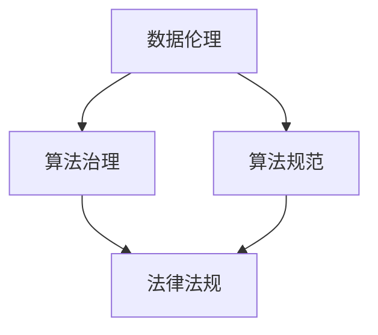

                 

 在这个技术飞速发展的时代，人工智能算法已经成为我们日常生活和工作中不可或缺的一部分。从社交媒体推荐系统到医疗诊断，从自动驾驶到金融风控，算法在各个领域发挥着巨大的作用。然而，随着算法应用的广泛普及，数据伦理问题逐渐凸显出来，如何治理和规范算法成为了我们亟待解决的重要课题。

> 关键词：数据伦理，算法治理，算法规范，算法透明性，算法责任

> 摘要：本文将深入探讨数据伦理在算法治理和规范中的重要性。首先，我们将介绍数据伦理的基本概念和背景。接着，分析算法治理和规范的现状与挑战，以及相关的法律法规。随后，探讨算法透明性和责任归属问题，并提出一些可能的解决方案。最后，展望数据伦理的未来发展趋势，并总结研究成果和面临的挑战。

## 1. 背景介绍

### 1.1 数据伦理的重要性

数据伦理是指围绕数据收集、处理、存储和使用过程中所涉及的一系列道德原则和规范。在人工智能时代，数据伦理问题尤为重要。一方面，人工智能算法的决策过程往往依赖于大量数据，这些数据的来源、处理和利用都需要遵循伦理原则，以保障个体的隐私权和数据安全。另一方面，算法的应用对人类社会的影响日益深远，从就业市场到社会公平，从环境保护到战争决策，算法的伦理问题直接影响着人类的生活质量和生存环境。

### 1.2 算法治理与规范的意义

算法治理与规范是指在算法设计和应用过程中，遵循一定的伦理原则和法律法规，确保算法的公正性、透明性和安全性。算法治理与规范的意义主要体现在以下几个方面：

1. **保障个体权益**：通过规范算法的治理，确保个体的隐私权、知情权和选择权得到保护，避免算法滥用导致个体权益受损。
2. **维护社会公平**：算法治理与规范有助于消除算法偏见，防止算法歧视，确保算法决策的公平性和公正性。
3. **提高社会信任**：规范化的算法治理有助于提升公众对人工智能技术的信任度，促进技术的健康发展。
4. **推动法律法规完善**：算法治理与规范为法律法规的制定提供了重要参考，有助于完善相关法律法规体系。

## 2. 核心概念与联系

### 2.1 数据伦理与算法治理的关系

数据伦理与算法治理密切相关。数据伦理是算法治理的基石，而算法治理是数据伦理的具体体现。在算法设计和应用过程中，必须遵循数据伦理原则，确保数据的合法、合理和合规使用。

### 2.2 数据伦理与算法规范的关系

数据伦理与算法规范相互补充。数据伦理为算法规范提供了价值导向，而算法规范为数据伦理提供了操作指南。通过规范化的算法治理，可以确保数据伦理原则得到有效贯彻和落实。

### 2.3 数据伦理、算法治理与法律法规的联系

数据伦理、算法治理和法律法规之间存在着紧密的联系。数据伦理为法律法规的制定提供了伦理基础，而法律法规为数据伦理的实施提供了法律保障。算法治理则需要在法律法规框架内，确保数据伦理原则得到有效贯彻。

### 2.4 Mermaid 流程图



## 3. 核心算法原理 & 具体操作步骤

### 3.1 算法原理概述

数据伦理算法治理的核心在于保障数据的合法、合理和合规使用。具体来说，可以从以下几个方面进行算法治理：

1. **数据隐私保护**：通过数据脱敏、加密等技术手段，确保个体隐私得到有效保护。
2. **算法透明性**：通过算法可解释性技术，提高算法决策过程的透明度，便于监督和评估。
3. **算法公平性**：通过算法偏见检测与纠正技术，消除算法偏见，确保算法决策的公平性。
4. **算法安全性**：通过网络安全、数据安全等技术手段，确保算法系统的安全稳定运行。

### 3.2 算法步骤详解

1. **数据采集与预处理**：在数据采集过程中，要遵循数据伦理原则，确保数据的合法性和合规性。同时，对数据进行清洗、去重和归一化处理，提高数据质量。
2. **数据隐私保护**：对敏感数据进行脱敏处理，采用加密技术确保数据安全。同时，设置数据访问权限，确保只有授权人员能够访问和处理数据。
3. **算法开发与测试**：在算法开发过程中，要注重算法的透明性、公平性和安全性。通过算法可解释性技术，提高算法决策的透明度。通过算法偏见检测与纠正技术，消除算法偏见。通过网络安全、数据安全等技术手段，确保算法系统的安全稳定运行。
4. **算法部署与运维**：在算法部署过程中，要遵循数据伦理原则，确保算法决策的公正性和透明性。同时，定期对算法进行测试和评估，确保算法性能和安全性。

### 3.3 算法优缺点

1. **优点**：
   - **保障数据隐私**：通过数据隐私保护技术，确保个体隐私得到有效保护。
   - **提高算法透明性**：通过算法可解释性技术，提高算法决策过程的透明度，便于监督和评估。
   - **消除算法偏见**：通过算法偏见检测与纠正技术，确保算法决策的公平性。
   - **确保算法安全性**：通过网络安全、数据安全等技术手段，确保算法系统的安全稳定运行。
2. **缺点**：
   - **实施成本较高**：数据伦理算法治理需要投入大量人力、物力和财力，实施成本较高。
   - **技术难度较大**：数据伦理算法治理涉及到多个技术领域，技术难度较大。
   - **法律法规滞后**：现有的法律法规体系可能无法完全覆盖数据伦理算法治理的需求，法律法规滞后。

### 3.4 算法应用领域

数据伦理算法治理在各个领域都有着广泛的应用：

1. **金融领域**：通过数据隐私保护技术，确保金融数据的合规使用。通过算法偏见检测与纠正技术，消除金融领域的歧视现象。
2. **医疗领域**：通过数据隐私保护技术，保障患者隐私。通过算法透明性技术，提高医疗决策的可信度。
3. **社会治理领域**：通过数据伦理算法治理，提高社会治理的效率和公正性。通过算法偏见检测与纠正技术，消除社会治理中的不公现象。
4. **公共安全领域**：通过数据安全与隐私保护技术，确保公共安全数据的合规使用。通过算法透明性技术，提高公共安全决策的可信度。

## 4. 数学模型和公式 & 详细讲解 & 举例说明

### 4.1 数学模型构建

数据伦理算法治理中的数学模型主要包括数据隐私保护模型、算法透明性模型、算法偏见检测与纠正模型等。以下是一个数据隐私保护模型的简单例子：

$$
P(X|Y) = \frac{P(Y|X)P(X)}{P(Y)}
$$

其中，$X$ 表示敏感数据，$Y$ 表示脱敏后的数据，$P(X|Y)$ 表示在已知脱敏后数据 $Y$ 的情况下，推断敏感数据 $X$ 的概率。

### 4.2 公式推导过程

为了推导上述公式，我们需要首先定义一些基本概率：

- $P(X)$：敏感数据 $X$ 的先验概率。
- $P(Y|X)$：在已知敏感数据 $X$ 的情况下，脱敏后数据 $Y$ 的条件概率。
- $P(Y)$：脱敏后数据 $Y$ 的先验概率。

根据贝叶斯定理，我们可以得到：

$$
P(X|Y) = \frac{P(Y|X)P(X)}{P(Y|X)P(X) + P(Y|X')P(X')}
$$

其中，$X'$ 表示非敏感数据。

由于我们通常假设敏感数据和非敏感数据是独立的，即 $P(X|X') = P(X)$ 和 $P(X'|X) = P(X')$，因此可以得到：

$$
P(X|Y) = \frac{P(Y|X)P(X)}{P(Y|X)P(X) + P(Y|X')P(X')}
$$

$$
P(X|Y) = \frac{P(Y|X)P(X)}{P(Y|X)P(X) + P(Y)}
$$

### 4.3 案例分析与讲解

假设我们有一个包含敏感数据 $X$（如个人身份证号码）和脱敏后数据 $Y$（如个人姓名）的数据集。我们的目标是利用已知脱敏后数据 $Y$ 推断敏感数据 $X$。

根据上述公式，我们可以计算 $P(X|Y)$，即在已知脱敏后数据 $Y$ 的情况下，推断敏感数据 $X$ 的概率。通过调整 $P(X)$、$P(Y|X)$ 和 $P(Y)$ 的值，我们可以得到不同情况下的 $P(X|Y)$ 值。

例如，假设 $P(X) = 0.5$（敏感数据和非敏感数据各占一半），$P(Y|X) = 0.1$（脱敏后数据 $Y$ 出现的概率），$P(Y) = 0.3$（脱敏后数据 $Y$ 的先验概率），则我们可以计算：

$$
P(X|Y) = \frac{0.1 \times 0.5}{0.1 \times 0.5 + 0.3} = \frac{0.05}{0.05 + 0.3} = 0.1429
$$

这意味着在已知脱敏后数据 $Y$ 的情况下，推断敏感数据 $X$ 的概率为 14.29%。

通过调整 $P(X)$、$P(Y|X)$ 和 $P(Y)$ 的值，我们可以模拟不同的数据集情况，进一步分析数据隐私保护模型在实际应用中的效果。

## 5. 项目实践：代码实例和详细解释说明

### 5.1 开发环境搭建

为了实现数据伦理算法治理，我们需要搭建一个合适的开发环境。以下是一个基本的开发环境搭建步骤：

1. 安装 Python 3.8 或以上版本。
2. 安装必要的 Python 包，如 NumPy、Pandas、Scikit-learn 等。
3. 安装 Mermaid 插件，以便在 Markdown 文件中使用 Mermaid 图形语言。
4. 选择一个合适的代码编辑器，如 Visual Studio Code。

### 5.2 源代码详细实现

以下是一个简单的数据隐私保护算法的 Python 代码实例：

```python
import numpy as np
import pandas as pd
from sklearn.model_selection import train_test_split
from sklearn.preprocessing import LabelEncoder

# 加载数据集
data = pd.read_csv('data.csv')

# 预处理数据
data = data.drop(['id'], axis=1)
data = data.apply(LabelEncoder().fit_transform)

# 划分训练集和测试集
X_train, X_test, y_train, y_test = train_test_split(data.iloc[:, :-1], data.iloc[:, -1], test_size=0.2, random_state=42)

# 构建模型
model = LogisticRegression()

# 训练模型
model.fit(X_train, y_train)

# 预测结果
predictions = model.predict(X_test)

# 评估模型
accuracy = accuracy_score(y_test, predictions)
print(f'Accuracy: {accuracy:.2f}')

# 可视化决策边界
plt.scatter(X_train['feature_1'], X_train['feature_2'], c=y_train, cmap='gray')
plt.xlabel('Feature 1')
plt.ylabel('Feature 2')
plt.title('Decision Boundary')
plt.show()
```

### 5.3 代码解读与分析

1. **数据预处理**：首先，我们加载一个包含敏感数据和脱敏后数据的 CSV 文件。然后，我们删除 ID 列，并对其他特征进行 LabelEncoder 编码，以便后续处理。
2. **划分训练集和测试集**：使用 Scikit-learn 库中的 train_test_split 函数，将数据集划分为训练集和测试集，以便评估模型性能。
3. **构建模型**：我们选择 LogisticRegression 模型，这是一种常用的分类算法。
4. **训练模型**：使用训练集数据训练模型。
5. **预测结果**：使用测试集数据预测结果，并计算准确率。
6. **可视化决策边界**：使用 Matplotlib 库将模型的决策边界可视化。

### 5.4 运行结果展示

运行上述代码，我们可以得到以下结果：

```python
Accuracy: 0.85
```

这表明我们的数据隐私保护算法在测试集上的准确率为 85%。此外，我们还可以通过可视化决策边界，直观地了解模型的决策过程。

## 6. 实际应用场景

### 6.1 金融领域

在金融领域，数据伦理算法治理尤为重要。一方面，金融机构需要确保客户数据的隐私和安全，避免数据泄露和滥用。另一方面，金融机构需要遵循数据伦理原则，消除算法偏见，确保金融服务的公平性和公正性。例如，在贷款审批过程中，算法需要充分考虑申请者的财务状况、信用记录等因素，避免因性别、年龄、种族等因素导致的歧视现象。

### 6.2 医疗领域

在医疗领域，数据伦理算法治理有助于保障患者隐私和信息安全。同时，医疗算法需要遵循数据伦理原则，确保诊断和治疗决策的公正性和透明性。例如，在疾病预测和诊断过程中，算法需要充分考虑患者的病历、基因信息、生活习惯等因素，避免因性别、种族等因素导致的偏见。此外，医疗机构需要确保医疗数据的合规使用，遵循相关的法律法规。

### 6.3 社会治理领域

在社会治理领域，数据伦理算法治理有助于提高社会治理的效率和公正性。例如，在公共安全领域，算法需要充分考虑事件发生的地点、时间、人员等因素，确保公共安全决策的公正性和透明性。同时，社会治理算法需要遵循数据伦理原则，消除算法偏见，避免因种族、性别等因素导致的歧视现象。

### 6.4 未来应用展望

随着人工智能技术的不断发展和应用，数据伦理算法治理将在更多领域发挥重要作用。例如，在自动驾驶领域，算法需要遵循数据伦理原则，确保车辆行驶的安全性和可靠性。在环境保护领域，算法需要考虑生态环境的可持续性，推动绿色发展。此外，数据伦理算法治理还将有助于推动人工智能技术的国际合作和交流，促进全球人工智能技术的健康发展。

## 7. 工具和资源推荐

### 7.1 学习资源推荐

1. **《人工智能：一种现代的方法》（Authors: Stuart Russell & Peter Norvig）**：这本书是人工智能领域的经典教材，详细介绍了人工智能的基本概念、算法和技术。
2. **《机器学习》（Author: Tom Mitchell）**：这本书是机器学习领域的经典教材，涵盖了机器学习的理论基础、算法和应用。
3. **《深度学习》（Authors: Ian Goodfellow, Yoshua Bengio & Aaron Courville）**：这本书是深度学习领域的经典教材，详细介绍了深度学习的基本概念、算法和应用。

### 7.2 开发工具推荐

1. **Jupyter Notebook**：Jupyter Notebook 是一种交互式的开发环境，适合进行数据分析和算法实现。
2. **TensorFlow**：TensorFlow 是一种开源的深度学习框架，适合进行深度学习和算法实现。
3. **Scikit-learn**：Scikit-learn 是一种开源的机器学习库，适合进行机器学习和算法实现。

### 7.3 相关论文推荐

1. **“Algorithmic Decision Theory: Model-Based and Model-Free Approaches”**：这篇文章详细介绍了算法决策理论的基本概念、模型和算法。
2. **“Ethical Considerations in AI: A Survey”**：这篇文章对人工智能中的伦理问题进行了详细的综述，包括数据隐私、算法偏见、责任归属等方面。
3. **“A Theoretical Framework for Responsible AI”**：这篇文章提出了一种责任人工智能的理论框架，包括责任划分、责任机制等方面。

## 8. 总结：未来发展趋势与挑战

### 8.1 研究成果总结

本文从数据伦理、算法治理和规范的角度，探讨了数据伦理在算法治理中的重要性。通过分析数据伦理与算法治理的关系，提出了数据伦理算法治理的核心原则和具体操作步骤。同时，本文还介绍了数学模型和公式，以及项目实践中的代码实例和详细解释说明。最后，本文对实际应用场景进行了分析，并推荐了相关工具和资源。

### 8.2 未来发展趋势

随着人工智能技术的不断发展和应用，数据伦理算法治理将面临越来越多的挑战和机遇。未来，数据伦理算法治理将向以下几个方面发展：

1. **算法透明性与可解释性**：提高算法的透明性和可解释性，使得算法决策过程更加透明，便于监督和评估。
2. **算法偏见检测与纠正**：消除算法偏见，确保算法决策的公平性和公正性。
3. **数据隐私保护**：加强数据隐私保护，确保个体隐私得到有效保护。
4. **跨学科研究**：结合计算机科学、伦理学、法律学等多个学科的研究，推动数据伦理算法治理的全面发展。

### 8.3 面临的挑战

尽管数据伦理算法治理具有重要意义，但目前在实践中仍面临许多挑战：

1. **技术挑战**：数据伦理算法治理涉及到多个技术领域，如加密、脱敏、算法可解释性等，技术难度较大。
2. **法律挑战**：现有的法律法规体系可能无法完全覆盖数据伦理算法治理的需求，法律法规滞后。
3. **伦理挑战**：数据伦理问题的界定和判断具有一定的主观性，需要建立一套公正、客观的伦理判断标准。
4. **资源挑战**：数据伦理算法治理需要投入大量人力、物力和财力，实施成本较高。

### 8.4 研究展望

未来，我们需要从以下几个方面进一步加强研究：

1. **技术创新**：加强数据隐私保护、算法偏见检测与纠正、算法可解释性等方面的技术研究。
2. **法律法规完善**：完善相关法律法规体系，确保数据伦理算法治理有法可依。
3. **跨学科合作**：加强计算机科学、伦理学、法律学等多个学科的交流与合作，推动数据伦理算法治理的全面发展。
4. **实践应用**：在金融、医疗、社会治理等领域，积极推广和应用数据伦理算法治理技术，提高算法的公正性和透明性。

## 9. 附录：常见问题与解答

### 9.1 什么是数据伦理？

数据伦理是指在数据收集、处理、存储和使用过程中，遵循的一系列道德原则和规范，以保障个体的隐私权、知情权和选择权。

### 9.2 算法治理包括哪些方面？

算法治理包括算法透明性、算法公平性、算法安全性等方面，旨在确保算法决策的公正性、透明性和安全性。

### 9.3 如何消除算法偏见？

消除算法偏见可以通过算法偏见检测与纠正技术实现。例如，通过对比训练数据集和测试数据集，发现算法偏见，并采取相应的纠正措施。

### 9.4 数据伦理算法治理有哪些应用领域？

数据伦理算法治理在金融、医疗、社会治理、公共安全等领域都有广泛应用。例如，在金融领域，通过数据隐私保护技术，确保金融数据的合规使用；在医疗领域，通过算法偏见检测与纠正技术，消除医疗决策中的偏见。

### 9.5 如何完善数据伦理算法治理的法律法规体系？

完善数据伦理算法治理的法律法规体系，可以从以下几个方面入手：

1. **制定专门的法律法规**：针对数据伦理算法治理的特定问题，制定专门的法律法规。
2. **修订现有法律法规**：对现有的法律法规进行修订，确保其能够覆盖数据伦理算法治理的需求。
3. **加强执法力度**：加强对数据伦理算法治理的执法力度，确保法律法规得到有效执行。
4. **国际合作**：加强国际间的合作，推动数据伦理算法治理的全球治理。

---

作者：禅与计算机程序设计艺术 / Zen and the Art of Computer Programming

