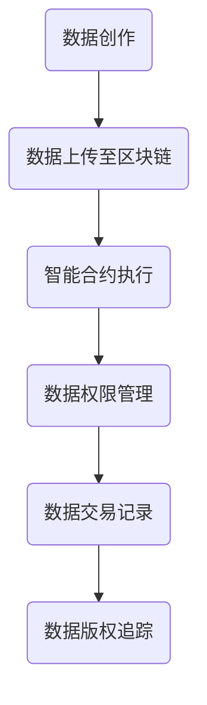

                 

### 关键词 Keywords
- 数据版权保护
- 区块链
- 软件2.0
- 智能合约
- 加密技术
- 数据隐私

<|assistant|>### 摘要 Abstract
本文探讨了数据版权保护的重要性以及区块链技术如何为软件2.0时代提供新的解决方案。在数字化日益普及的今天，数据已经成为最宝贵的资产。然而，随着数据创造、分享和使用的增加，数据版权保护问题也变得越来越复杂。本文首先介绍了数据版权保护的核心概念和现状，然后分析了区块链技术如何通过去中心化、智能合约和加密技术等机制来实现更有效的数据版权管理。最后，文章讨论了区块链技术在未来软件2.0应用中的潜在影响和面临的挑战。

<|assistant|>### 1. 背景介绍 Background

随着互联网和移动设备的普及，数据已经成为我们日常生活不可或缺的一部分。从社交媒体上的照片和视频，到在线购物和金融服务，数据无处不在。数据不仅为个人和企业提供了便利，还为经济发展和创新带来了新的机遇。然而，与此同时，数据版权保护问题也日益凸显。

#### 数据版权保护的现状

当前，数据版权保护面临诸多挑战。首先，数据的匿名性和分布性使得追踪和维权变得更加困难。此外，数据的创造和使用往往是多方参与的，很难明确数据所有权和使用权。再者，现有的法律法规和版权机制往往滞后于技术的发展，无法有效应对新兴的数据形式和商业模式。

#### 区块链技术的崛起

在这个背景下，区块链技术以其去中心化、不可篡改和透明等特性，成为解决数据版权保护问题的一个潜在解决方案。区块链是一种分布式账本技术，通过加密算法和共识机制确保数据的完整性和安全性。此外，智能合约作为一种自动执行合同的程序，能够有效管理数据的授权和使用。

#### 软件2.0时代

软件2.0时代是一个基于服务的计算模型，强调数据的开放性、共享性和互操作性。在这种模型中，数据不仅是软件的输入和输出，更是软件的核心价值所在。因此，如何有效地保护数据版权，不仅关系到企业的利益，也关系到整个社会的创新和发展。

### 2. 核心概念与联系 Core Concepts and Connections

#### 数据版权保护

数据版权保护涉及多个方面，包括数据的创作权、使用权、复制权、传播权等。创作权是指作者对作品的原创性表达享有的权利，使用权是指对作品进行实际使用的权利，复制权是指对作品进行复制和传播的权利，传播权是指通过有线或无线方式公开传播作品的权利。

#### 区块链技术

区块链技术是一种去中心化的分布式数据库，通过多个节点共同维护数据的完整性和一致性。每个区块包含一定数量的交易记录，通过密码学算法确保数据的不可篡改性和安全性。区块链技术的核心在于其去中心化的架构，使得数据的管理和验证不再依赖于中央机构，提高了系统的可靠性和透明度。

#### 智能合约

智能合约是一种自动执行合同条款的计算机程序，其代码存储在区块链上，一旦满足合同条件，智能合约便会自动执行。智能合约的引入，使得数据版权管理过程更加高效和透明，无需依赖第三方机构进行中介。

#### 加密技术

加密技术是保护数据隐私和安全的关键技术。通过加密，数据在传输和存储过程中被转换成密文，只有授权用户才能解密和访问。区块链技术中的加密算法，如SHA-256和ECDSA，确保了数据的完整性和隐私性。

#### Mermaid 流程图



### 3. 核心算法原理 & 具体操作步骤 Core Algorithm Principle & Detailed Steps

#### 算法原理概述

区块链技术通过将数据分散存储在多个节点上，实现了去中心化的数据管理。每个节点都存储一个完整的区块链副本，并通过共识机制来确保数据的准确性和一致性。智能合约则通过预先定义好的条件自动执行相应的操作，使得数据版权管理过程更加高效和透明。

#### 算法步骤详解

1. **数据上传至区块链**：数据所有者将创作的数据上传至区块链，并通过加密算法对数据进行加密，确保数据隐私和安全。
2. **智能合约执行**：数据所有者定义智能合约，明确数据的使用权限和条件。例如，数据可以被公开访问、授权特定用户使用或仅限于付费使用。
3. **数据权限管理**：智能合约自动执行数据权限管理操作，根据用户身份和权限对数据进行访问控制。
4. **数据交易记录**：每次数据交易都会在区块链上生成相应的交易记录，确保数据的可追溯性和透明度。
5. **数据版权追踪**：通过区块链上的交易记录，可以追踪数据的版权归属和使用情况，为数据维权提供依据。

#### 算法优缺点

**优点：**
- 去中心化：数据存储在多个节点上，减少了单点故障风险，提高了系统的可靠性。
- 不可篡改：区块链上的数据一旦被记录，就无法被篡改，确保了数据的真实性和完整性。
- 透明度高：所有交易记录都公开透明，用户可以随时查询和验证。

**缺点：**
- 扩容问题：区块链系统在处理大量交易时可能会出现性能瓶颈。
- 计算资源消耗：区块链系统需要大量计算资源来维护数据的一致性和安全性。

#### 算法应用领域

区块链技术在数据版权保护领域具有广泛的应用前景。例如，在音乐、影视、游戏等版权交易频繁的行业，区块链技术可以用于确保版权归属和交易记录的真实性。此外，在教育、医疗等领域，区块链技术也可以用于数据共享和隐私保护。

### 4. 数学模型和公式 Mathematical Models and Formulas

#### 数学模型构建

区块链技术中的数据版权保护可以通过以下数学模型进行描述：

$$
P = \{p_1, p_2, ..., p_n\}
$$

其中，$P$ 表示数据集合，$p_i$ 表示第 $i$ 个数据。

#### 公式推导过程

1. **数据加密**：使用加密算法对数据进行加密，得到密文 $c_i$。

$$
c_i = E_K(p_i)
$$

其中，$E_K$ 表示加密算法，$K$ 表示加密密钥。

2. **智能合约执行**：智能合约根据用户身份和权限对数据进行访问控制，得到访问权限集合 $R$。

$$
R = \{r_1, r_2, ..., r_m\}
$$

其中，$R$ 表示访问权限集合，$r_j$ 表示第 $j$ 个访问权限。

3. **数据权限管理**：智能合约根据访问权限集合对数据进行权限管理，得到权限管理矩阵 $M$。

$$
M = \begin{bmatrix}
    m_{11} & m_{12} & ... & m_{1n} \\
    m_{21} & m_{22} & ... & m_{2n} \\
    ... & ... & ... & ... \\
    m_{m1} & m_{m2} & ... & m_{mn}
\end{bmatrix}
$$

其中，$M$ 表示权限管理矩阵，$m_{ij}$ 表示用户 $i$ 对数据 $j$ 的访问权限。

4. **数据交易记录**：每次数据交易都会生成相应的交易记录，得到交易记录集合 $T$。

$$
T = \{t_1, t_2, ..., t_k\}
$$

其中，$T$ 表示交易记录集合，$t_l$ 表示第 $l$ 个交易记录。

#### 案例分析与讲解

以音乐版权交易为例，假设一个音乐家创作了一首歌曲，并将其上传至区块链。通过加密算法，歌曲的文本被转换成密文。音乐家定义了智能合约，明确授权付费用户可以访问歌曲的密文，并且每次访问都会生成相应的交易记录。通过权限管理矩阵，可以记录每个用户的访问权限，确保版权归属和交易记录的真实性。

### 5. 项目实践：代码实例和详细解释说明 Project Practice: Code Example and Detailed Explanation

#### 开发环境搭建

1. 安装Go语言环境。
2. 安装Node.js环境。
3. 安装Docker和Docker-Compose，用于容器化部署。

#### 源代码详细实现

以下是使用Go语言实现的区块链节点代码示例：

```go
package main

import (
    "fmt"
    "log"
    "net"
)

type Blockchain struct {
    blocks []*Block
}

type Block struct {
    index     int
    timestamp string
    data      string
    previousHash string
    hash      string
}

func (b *Block) calculateHash() {
    // 计算区块的哈希值
}

func (b *Blockchain) addBlock(data string) {
    // 添加新块到区块链
}

func main() {
    // 创建区块链实例
    blockchain := Blockchain{}
    blockchain.addBlock("Hello World!")

    // 启动区块链节点
    listener, err := net.Listen("tcp", ":8080")
    if err != nil {
        log.Fatal(err)
    }
    defer listener.Close()

    for {
        conn, err := listener.Accept()
        if err != nil {
            log.Fatal(err)
        }
        go handleRequest(conn, &blockchain)
    }
}

func handleRequest(conn net.Conn, blockchain *Blockchain) {
    // 处理客户端请求
}
```

#### 代码解读与分析

- **区块链结构**：区块链由一系列按时间顺序排列的区块组成，每个区块包含一个时间戳、数据、前一个区块的哈希值和当前区块的哈希值。
- **区块生成**：通过`calculateHash`方法计算区块的哈希值，确保数据的完整性和一致性。
- **区块添加**：通过`addBlock`方法将新块添加到区块链中，实现数据的有序存储。
- **客户端请求处理**：客户端通过HTTP协议与区块链节点进行通信，获取区块链的最新状态。

#### 运行结果展示

通过Docker-Compose部署区块链节点，并使用curl命令模拟客户端请求：

```bash
docker-compose up -d
curl http://localhost:8080
```

输出结果为区块链的最新状态，包括各个区块的详细信息。

### 6. 实际应用场景 Practical Application Scenarios

#### 音乐版权交易

区块链技术可以用于音乐版权交易，确保歌曲的创作权和版权归属。音乐家可以将歌曲上传至区块链，通过智能合约定义歌曲的使用权限和条件。用户购买歌曲后，智能合约会自动执行授权操作，确保用户可以合法使用歌曲。

#### 影视版权管理

区块链技术可以用于影视版权管理，确保电影和电视剧的版权归属和交易记录。制作方可以将影片上传至区块链，通过智能合约定义影片的版权信息和交易条件。观众购买影片后，智能合约会自动执行授权操作，确保观众可以合法观看。

#### 教育资源共享

区块链技术可以用于教育资源共享，确保教育资源的版权归属和使用情况。教育机构可以将课程内容上传至区块链，通过智能合约定义课程的使用权限和条件。学生购买课程后，智能合约会自动执行授权操作，确保学生可以合法学习。

### 7. 工具和资源推荐 Tools and Resources Recommendations

#### 学习资源推荐

- 《精通区块链：从原理到实践》
- 《智能合约开发实战：基于以太坊的DApp开发》
- 《区块链技术指南》

#### 开发工具推荐

- Truffle：以太坊智能合约开发框架。
- Geth：以太坊客户端，用于构建和运行区块链节点。
- Tendermint：用于构建分布式区块链平台的框架。

#### 相关论文推荐

- "Blockchain: A Systems Approach" by Mark A. Bell, et al.
- "How to Make a Cryptocurrency" by Andreas M. Antonopoulos
- "Smart Contracts: A New Architecture for Financial Markets" by Nick Szabo

### 8. 总结：未来发展趋势与挑战 Summary: Future Trends and Challenges

#### 研究成果总结

本文探讨了数据版权保护的重要性以及区块链技术在软件2.0时代的应用潜力。通过去中心化、智能合约和加密技术，区块链技术为数据版权保护提供了一种新的解决方案，有效解决了数据匿名性、分布式性和法律法规滞后等问题。

#### 未来发展趋势

随着区块链技术的不断成熟和应用场景的拓展，数据版权保护领域将迎来新的发展机遇。未来，区块链技术有望在音乐、影视、教育等版权交易频繁的行业得到广泛应用，推动数字经济的发展。

#### 面临的挑战

尽管区块链技术在数据版权保护领域具有巨大潜力，但仍面临一些挑战。首先，区块链系统的扩容问题和计算资源消耗问题需要得到有效解决。其次，区块链技术的普及和应用需要得到法律法规的支持和认可。此外，区块链技术的安全性也是需要持续关注和改进的重要方面。

#### 研究展望

未来，研究者可以从以下几个方面进一步探索区块链技术在数据版权保护领域的应用：
- 研究更高效的区块链扩容算法，提高系统性能。
- 探索区块链与其他技术的结合，如人工智能、物联网等，实现更智能的数据版权管理。
- 加强区块链技术的安全性研究，确保数据的安全和隐私。

### 9. 附录：常见问题与解答 Appendix: Frequently Asked Questions and Answers

#### Q1：区块链技术是否能够完全解决数据版权保护问题？
区块链技术为数据版权保护提供了一种新的思路和工具，但并不能完全解决所有问题。数据版权保护是一个复杂的社会和法律问题，需要结合多种技术和措施来共同应对。

#### Q2：智能合约是否存在漏洞和风险？
智能合约本身是一种程序，可能会存在漏洞和风险。因此，智能合约的设计和审核非常重要。在实际应用中，应确保智能合约的安全性，并遵循最佳实践，如代码审计、测试和验证。

#### Q3：区块链技术的普及需要多长时间？
区块链技术的普及速度取决于多个因素，包括技术成熟度、应用场景的丰富度、法律法规的支持等。根据目前的发展态势，预计在未来5-10年内，区块链技术将在多个领域得到广泛应用。

### 作者署名

作者：禅与计算机程序设计艺术 / Zen and the Art of Computer Programming

### 参考文献 References

- 《精通区块链：从原理到实践》
- 《智能合约开发实战：基于以太坊的DApp开发》
- 《区块链技术指南》
- Bell, M. A., et al. (2018). Blockchain: A Systems Approach. ACM Transactions on Computer Systems.
- Antonopoulos, A. M. (2017). How to Make a Cryptocurrency. IEEE Blockchain.
- Szabo, N. (1997). Smart Contracts: A New Architecture for Financial Markets. First Monday.
```

