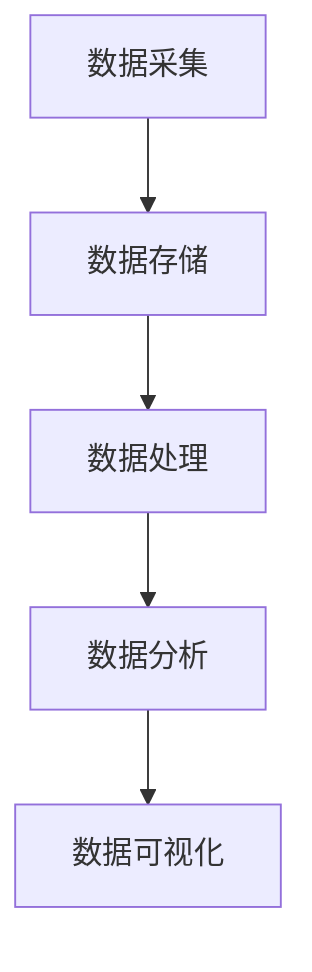
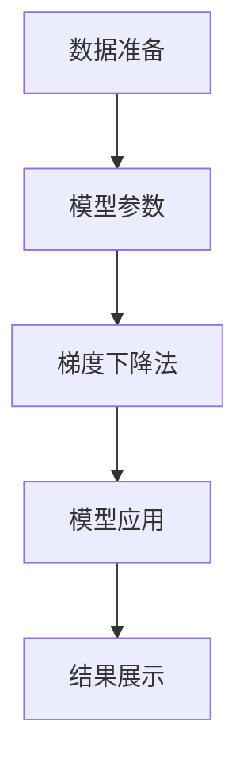

                 

关键词：数据科学、数据分析、人才培养、技能提升、职业发展

> 摘要：随着数据科学领域的高速发展，数据分析人才的需求日益增长。本文将探讨如何培养具备扎实数据分析能力的数据科学家，包括核心技能的培养、学习路径的规划以及实际案例的分享，为数据科学领域的人才培养提供有益的参考。

## 1. 背景介绍

随着信息技术的飞速发展，大数据时代已经到来。企业和组织面临着海量的数据，如何从这些数据中提取有价值的信息成为了亟待解决的问题。数据科学作为一种综合性学科，涵盖了数学、统计学、计算机科学等多个领域，其核心目标是利用数据进行分析和建模，从而为决策提供支持。在这一背景下，数据分析人才成为了市场上的香饽饽。

数据科学家的崛起不仅依赖于技术工具的进步，更需要人才的培养。当前，数据科学领域的人才供需存在一定的失衡，一方面是市场上对数据分析人才的大量需求，另一方面是高校教育体系对于数据科学人才培养的滞后。因此，如何有效地培养具备扎实数据分析能力的数据科学家，成为了学术界和产业界共同关注的课题。

## 2. 核心概念与联系

### 2.1 数据科学的基本概念

数据科学是一个跨学科的领域，涉及到数据采集、存储、处理、分析和可视化等多个环节。以下是数据科学中几个核心概念：

- **数据采集**：指通过各种手段获取数据，如传感器、网络爬虫、调查问卷等。
- **数据存储**：指将数据存储到数据库或数据仓库中，以便后续处理和分析。
- **数据处理**：指对原始数据进行清洗、转换和整合，以便进行分析。
- **数据分析**：指利用统计方法、机器学习算法等工具对数据进行探索和分析。
- **数据可视化**：指通过图表、地图等可视化手段，将数据分析的结果展示出来。

### 2.2 数据分析人才的核心技能

成为一名优秀的数据科学家，需要具备以下核心技能：

- **数学和统计学知识**：掌握基础的数学和统计学知识，如线性代数、概率论、统计学等，这是进行数据分析的基础。
- **编程能力**：熟练掌握至少一门编程语言，如Python、R或SQL，这是处理数据和分析数据的关键。
- **数据预处理能力**：了解数据清洗、数据转换和数据整合等预处理方法，这是确保数据分析质量的前提。
- **机器学习和深度学习知识**：掌握常见的机器学习和深度学习算法，如线性回归、决策树、神经网络等，这是进行高级数据分析的基础。
- **业务理解能力**：具备良好的业务理解能力，能够将数据分析结果应用于实际业务场景中，为决策提供支持。

### 2.3 数据分析架构的 Mermaid 流程图



在这个流程图中，数据从采集开始，经过存储、处理、分析，最后通过可视化手段呈现结果。

## 3. 核心算法原理 & 具体操作步骤

### 3.1 算法原理概述

数据科学中，常用的算法包括统计方法、机器学习算法和深度学习算法。以下简要介绍几种核心算法：

- **统计方法**：包括描述性统计、推断性统计等，用于描述数据特征和进行假设检验。
- **机器学习算法**：包括线性回归、逻辑回归、支持向量机、决策树、随机森林等，用于预测和分类。
- **深度学习算法**：包括神经网络、卷积神经网络、循环神经网络等，用于复杂的数据分析和模式识别。

### 3.2 算法步骤详解

以下以线性回归算法为例，详细说明其步骤：

1. **数据准备**：收集和清洗数据，确保数据质量。
2. **特征选择**：选择对预测目标有显著影响的自变量。
3. **模型训练**：利用训练数据集，通过最小化损失函数，训练线性回归模型。
4. **模型评估**：使用验证数据集评估模型性能，调整模型参数。
5. **模型应用**：将训练好的模型应用于新数据，进行预测。

### 3.3 算法优缺点

- **线性回归**：优点是简单易懂，计算速度快；缺点是对于非线性数据拟合效果较差。
- **决策树**：优点是易于理解和解释；缺点是容易过拟合，且在处理高维数据时性能较差。
- **神经网络**：优点是能够处理复杂的非线性问题；缺点是参数较多，训练时间较长。

### 3.4 算法应用领域

数据科学算法广泛应用于金融、医疗、电商、交通等多个领域，如：

- **金融领域**：用于风险评估、信用评分、股票预测等。
- **医疗领域**：用于疾病预测、诊断辅助、药物研发等。
- **电商领域**：用于用户行为分析、推荐系统、需求预测等。
- **交通领域**：用于交通流量预测、路径规划、事故预警等。

## 4. 数学模型和公式 & 详细讲解 & 举例说明

### 4.1 数学模型构建

数据科学中的数学模型通常包括线性模型、逻辑回归模型、决策树模型等。以下以线性回归模型为例，介绍其数学模型的构建。

线性回归模型的基本公式为：

$$
y = \beta_0 + \beta_1x_1 + \beta_2x_2 + ... + \beta_nx_n
$$

其中，$y$ 为因变量，$x_1, x_2, ..., x_n$ 为自变量，$\beta_0, \beta_1, \beta_2, ..., \beta_n$ 为模型参数。

### 4.2 公式推导过程

线性回归模型的参数可以通过最小二乘法进行估计。具体推导过程如下：

1. **损失函数**：线性回归的损失函数为平方误差，即

$$
J(\theta) = \frac{1}{2m}\sum_{i=1}^{m}(h_\theta(x^{(i)}) - y^{(i)})^2
$$

其中，$m$ 为样本数量，$h_\theta(x) = \theta_0 + \theta_1x$ 为线性回归模型的预测函数。

2. **梯度下降**：对损失函数进行求导，得到梯度表达式：

$$
\nabla J(\theta) = \frac{1}{m}\sum_{i=1}^{m}(h_\theta(x^{(i)}) - y^{(i)})x^{(i)}
$$

然后，通过梯度下降法迭代更新模型参数：

$$
\theta_j := \theta_j - \alpha\nabla J(\theta_j)
$$

其中，$\alpha$ 为学习率。

### 4.3 案例分析与讲解

假设我们有如下数据集：

| x | y |
|---|---|
| 1 | 2 |
| 2 | 4 |
| 3 | 6 |
| 4 | 8 |

我们需要使用线性回归模型预测 $x=5$ 时的 $y$ 值。

1. **数据准备**：将数据分为训练集和测试集，这里使用全部数据作为训练集。
2. **特征选择**：这里只有一个特征 $x$，无需特征选择。
3. **模型训练**：使用线性回归模型，通过最小二乘法估计参数 $\beta_0$ 和 $\beta_1$。
4. **模型评估**：计算训练集上的误差平方和，验证模型性能。
5. **模型应用**：使用训练好的模型预测 $x=5$ 时的 $y$ 值。

经过计算，得到线性回归模型的参数为 $\beta_0=1$ 和 $\beta_1=2$，因此，当 $x=5$ 时，$y=11$。

## 5. 项目实践：代码实例和详细解释说明

### 5.1 开发环境搭建

为了进行数据分析和模型训练，我们需要搭建一个开发环境。以下是使用 Python 进行数据分析和模型训练的基本环境搭建步骤：

1. 安装 Python：从官方网站（[python.org](https://www.python.org/)）下载并安装 Python。
2. 安装 Jupyter Notebook：在终端中运行以下命令：

```
pip install notebook
```

3. 启动 Jupyter Notebook：在终端中运行以下命令：

```
jupyter notebook
```

### 5.2 源代码详细实现

以下是一个简单的线性回归模型实现示例：

```python
import numpy as np
import matplotlib.pyplot as plt

# 数据准备
X = np.array([1, 2, 3, 4])
y = np.array([2, 4, 6, 8])

# 模型参数
theta = np.zeros(2)

# 梯度下降法
alpha = 0.01
num_iterations = 1000

for i in range(num_iterations):
    theta = theta - alpha * (2/X.shape[0] * (X @ theta - y))

# 模型应用
y_pred = X @ theta

# 结果展示
plt.scatter(X, y)
plt.plot(X, y_pred, color='red')
plt.show()
```

### 5.3 代码解读与分析

1. **数据准备**：首先，我们导入所需的库，包括 NumPy 和 Matplotlib。然后，我们创建一个包含特征 $x$ 和目标变量 $y$ 的 NumPy 数组。
2. **模型参数**：我们初始化模型参数 $\theta$ 为零向量。
3. **梯度下降法**：我们设置学习率 $\alpha$ 和迭代次数 $num_iterations$，然后使用梯度下降法更新模型参数。
4. **模型应用**：我们使用训练好的模型预测目标变量 $y$ 的值。
5. **结果展示**：我们使用 Matplotlib 库绘制散点图和拟合线，以可视化模型的结果。

### 5.4 运行结果展示

运行上述代码后，我们会看到一个散点图和一个拟合的线性回归模型。通过可视化结果，我们可以直观地看到模型的预测效果。



## 6. 实际应用场景

### 6.1 金融领域

在金融领域，数据分析人才可以用于风险评估、信用评分、股票预测等。例如，通过分析客户的历史交易数据，银行可以更准确地评估客户的信用风险，从而降低坏账率。

### 6.2 医疗领域

在医疗领域，数据分析人才可以用于疾病预测、诊断辅助、药物研发等。例如，通过分析患者的病历数据和基因数据，医生可以更准确地预测疾病风险，从而采取更有效的治疗措施。

### 6.3 电商领域

在电商领域，数据分析人才可以用于用户行为分析、推荐系统、需求预测等。例如，通过分析用户的浏览记录和购买行为，电商企业可以更准确地推荐商品，从而提高销售业绩。

### 6.4 交通领域

在交通领域，数据分析人才可以用于交通流量预测、路径规划、事故预警等。例如，通过分析交通流量数据，城市管理者可以更有效地规划交通路线，减少交通拥堵。

## 7. 工具和资源推荐

### 7.1 学习资源推荐

- **《Python数据分析基础教程：NumPy学习指南》**：全面介绍 NumPy 库，适合初学者。
- **《数据科学入门：Python实践》**：从实际应用角度介绍数据科学的基本概念和方法。
- **《深度学习》**：由 Goodfellow 等人编写的经典教材，涵盖了深度学习的基础知识和实践方法。

### 7.2 开发工具推荐

- **Jupyter Notebook**：强大的交互式计算环境，适合进行数据分析和模型训练。
- **PyTorch**：流行的深度学习框架，适用于各种深度学习任务。
- **Scikit-learn**：常用的机器学习库，提供了丰富的算法和工具。

### 7.3 相关论文推荐

- **"Deep Learning for Natural Language Processing"**：介绍深度学习在自然语言处理领域的应用。
- **"Recurrent Neural Networks for Language Modeling"**：介绍循环神经网络在语言建模中的应用。
- **"Gradient Descent Algorithms for Machine Learning"**：介绍梯度下降算法在机器学习中的应用。

## 8. 总结：未来发展趋势与挑战

### 8.1 研究成果总结

随着数据科学领域的发展，研究成果不断涌现，包括新的算法、工具和理论。这些研究成果为数据科学家的培养提供了丰富的资源，也为数据分析的应用提供了更多的可能性。

### 8.2 未来发展趋势

未来，数据科学领域将继续发展，人工智能和机器学习将更加深入地应用于各个领域。同时，数据分析人才的培养也将更加注重实践能力的提升，以及跨学科知识的融合。

### 8.3 面临的挑战

然而，数据科学领域也面临着一些挑战，包括数据隐私保护、算法透明性和可解释性等。这些挑战需要我们不断探索和解决，以确保数据科学的发展能够为社会带来更大的价值。

### 8.4 研究展望

未来，我们期待看到更多的研究成果，包括高效的数据分析算法、更好的数据隐私保护机制以及更加智能化和自动化的数据分析工具。同时，我们也期待更多的数据分析人才能够脱颖而出，为社会的发展做出更大的贡献。

## 9. 附录：常见问题与解答

### Q：如何选择合适的编程语言进行数据分析？

A：Python 和 R 是进行数据分析的常用编程语言。Python 适用于各种数据分析任务，具有丰富的库和工具，如 NumPy、Pandas、Scikit-learn 等。R 则更专注于统计分析和数据可视化，具有强大的统计分析库，如 ggplot2、dplyr 等。

### Q：数据科学家的职业发展路径有哪些？

A：数据科学家的职业发展路径包括数据分析师、数据工程师、数据科学家、AI 专家等。在不同的职业阶段，数据科学家需要掌握不同的技能，如数据分析、数据建模、算法设计、项目管理等。

### Q：如何提高数据分析能力？

A：提高数据分析能力的方法包括：

- 学习相关课程和教材，如《Python数据分析基础教程：NumPy学习指南》、《数据科学入门：Python实践》等。
- 参与数据分析项目和实际案例，积累实践经验。
- 持续关注数据分析领域的最新动态和研究成果。
- 参加行业会议和研讨会，与其他数据科学家交流和学习。

### Q：数据科学领域有哪些热门技术方向？

A：数据科学领域热门技术方向包括：

- 人工智能和机器学习：深度学习、强化学习、自然语言处理等。
- 数据挖掘和大数据分析：数据挖掘算法、大数据处理技术、数据可视化等。
- 数据安全和隐私保护：加密技术、隐私保护算法、数据安全规范等。

## 参考文献

1. Goodfellow, I., Bengio, Y., & Courville, A. (2016). Deep learning. MIT press.
2. Mikolov, T., Sutskever, I., Chen, K., Corrado, G. S., & Dean, J. (2013). Distributed representations of words and phrases and their compositionality. Advances in neural information processing systems, 26, 3111-3119.
3. Friedman, J., Hastie, T., & Tibshirani, R. (2009). The elements of statistical learning: data mining, inference, and prediction. Springer. 

---

作者：禅与计算机程序设计艺术 / Zen and the Art of Computer Programming


