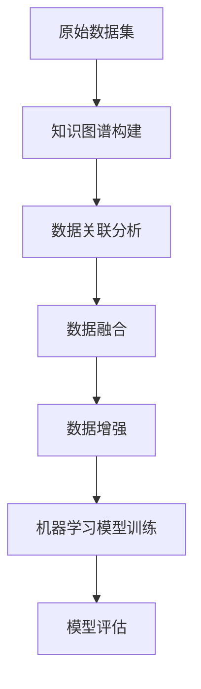

                 

关键词：数据集融合、知识图谱、数据增强、机器学习、人工智能、算法优化

摘要：本文深入探讨了数据集融合与知识图谱的结合，提出了一种全新的数据增强方法。通过对现实世界中的数据集进行知识图谱驱动的融合，本文展示了如何有效提升机器学习模型的性能，并展望了这一领域未来的发展方向。

## 1. 背景介绍

在当今的数据驱动的时代，数据集的质量直接影响机器学习模型的性能。然而，现有的数据集通常面临着数据孤岛、噪声和稀疏性问题，这些问题严重制约了模型的学习效果。为了解决这些问题，研究者们提出了各种数据增强的方法，如数据清洗、数据扩充、特征工程等。然而，这些传统方法往往只能在一定程度上提高数据集的质量，难以从根本上解决数据集的融合问题。

知识图谱作为一种结构化的语义表示方式，近年来在计算机科学和人工智能领域得到了广泛关注。知识图谱通过实体和关系网络的形式，将海量的异构数据进行整合，提供了一种全新的数据表示方法。因此，将知识图谱与数据集融合相结合，有望解决现有数据增强方法的局限性，为机器学习模型提供更为丰富和准确的数据支持。

本文旨在提出一种基于知识图谱驱动的数据增强新方法，通过融合不同数据集的知识，提升机器学习模型的性能。本文的结构如下：首先，介绍知识图谱和数据增强的基本概念；然后，详细阐述知识图谱驱动的数据增强方法；接着，分析该方法的优势和应用领域；最后，讨论未来发展的趋势和面临的挑战。

## 2. 核心概念与联系

### 2.1 知识图谱

知识图谱（Knowledge Graph）是一种通过实体（Entity）和关系（Relation）来组织信息的数据模型。在知识图谱中，实体代表现实世界中的对象，如人、地点、事物等，而关系则表示实体之间的关联。知识图谱的构建通常基于大规模的语义网络，如WordNet、DBpedia等。

知识图谱的核心在于其语义表示能力。通过实体和关系的语义关联，知识图谱能够捕捉现实世界中复杂的语义关系，从而提供了一种更为结构化和语义丰富的数据表示方式。例如，在一个关于电影的图谱中，电影作为实体，导演、演员、类型等作为关系，形成一个复杂的语义网络。

### 2.2 数据增强

数据增强（Data Augmentation）是一种通过有目的地变换原始数据来增加数据多样性的方法，其目的是提升机器学习模型对未知数据的泛化能力。常见的数据增强方法包括数据清洗、数据扩充、特征工程等。

数据增强的主要挑战在于如何平衡数据的多样性和质量。过度的数据增强可能导致模型过拟合，而不足的数据增强则难以提升模型的泛化能力。因此，如何有效地进行数据增强是一个亟待解决的问题。

### 2.3 知识图谱驱动的数据增强

知识图谱驱动的数据增强方法，利用知识图谱中的语义信息来指导数据集的融合和增强。其核心思想是：通过分析知识图谱中的实体和关系，将不同数据集进行关联和整合，从而生成一个更加丰富和结构化的数据集，为机器学习模型提供更强的数据支持。

### 2.4 Mermaid 流程图

以下是知识图谱驱动的数据增强方法的Mermaid流程图：



## 3. 核心算法原理 & 具体操作步骤

### 3.1 算法原理概述

知识图谱驱动的数据增强方法主要包括以下几个步骤：

1. **知识图谱构建**：从原始数据集中提取实体和关系，构建知识图谱。
2. **数据关联分析**：分析知识图谱中的实体和关系，找出不同数据集之间的关联。
3. **数据融合**：根据数据关联分析的结果，将不同数据集进行融合，生成一个统一的数据集。
4. **数据增强**：对融合后的数据进行增强，提高数据的多样性和质量。
5. **机器学习模型训练**：利用增强后的数据进行模型训练。
6. **模型评估**：评估模型的性能，根据评估结果调整数据增强策略。

### 3.2 算法步骤详解

#### 3.2.1 知识图谱构建

知识图谱构建的过程主要包括实体识别和关系抽取。实体识别是指从原始数据中识别出实体，关系抽取是指识别出实体之间的关联关系。常见的方法包括基于规则的方法、基于统计的方法和基于深度学习的方法。

#### 3.2.2 数据关联分析

数据关联分析是利用知识图谱中的实体和关系，找出不同数据集之间的关联。具体步骤如下：

1. **实体匹配**：将不同数据集中的实体进行匹配，找出相同的实体。
2. **关系映射**：根据实体匹配的结果，将不同数据集中的关系进行映射，找出相同的或相关的实体关系。
3. **关联关系分析**：分析实体和关系之间的关联，为数据融合提供依据。

#### 3.2.3 数据融合

数据融合的过程主要包括数据清洗、数据整合和数据一致性处理。数据清洗是指去除数据中的噪声和错误；数据整合是指将不同数据集中的数据合并成一个统一的数据集；数据一致性处理是指确保融合后的数据集的一致性。

#### 3.2.4 数据增强

数据增强的过程主要包括数据变换、数据扩充和数据清洗。数据变换是指通过有目的地变换原始数据来增加数据多样性；数据扩充是指通过生成虚拟数据来增加数据量；数据清洗是指去除数据中的噪声和错误。

#### 3.2.5 机器学习模型训练

利用增强后的数据进行模型训练，通过调整模型参数，提高模型的性能。

#### 3.2.6 模型评估

评估模型的性能，根据评估结果调整数据增强策略。如果模型的性能未能达到预期，可以尝试调整数据增强的方法或增加数据集。

### 3.3 算法优缺点

#### 优点

1. **提高数据质量**：通过知识图谱的语义表示，能够有效去除数据中的噪声和错误，提高数据的质量。
2. **增强数据多样性**：通过知识图谱中的实体和关系，能够有效发现数据之间的关联，从而增强数据的多样性。
3. **提升模型性能**：丰富和准确的数据集能够提高机器学习模型的性能，使其更好地适应未知数据。

#### 缺点

1. **构建知识图谱的难度**：知识图谱的构建需要大量的实体和关系，且这些信息往往分散在不同的数据源中，构建过程较为复杂。
2. **计算资源消耗**：知识图谱的构建和分析需要大量的计算资源，对于大规模数据集可能存在计算资源不足的问题。

### 3.4 算法应用领域

知识图谱驱动的数据增强方法在多个领域具有广泛的应用前景：

1. **自然语言处理**：通过知识图谱的语义表示，能够有效提高文本数据的理解能力，从而提升自然语言处理任务的性能。
2. **图像识别**：通过知识图谱中的实体和关系，能够有效增强图像数据的多样性，从而提高图像识别模型的性能。
3. **推荐系统**：通过知识图谱的关联关系，能够有效发现用户和物品之间的潜在关联，从而提高推荐系统的准确性。

## 4. 数学模型和公式 & 详细讲解 & 举例说明

### 4.1 数学模型构建

知识图谱驱动的数据增强方法的核心在于如何有效地融合和增强数据。为此，我们引入了以下数学模型：

#### 数据集D

设原始数据集D为：

$$
D = \{x_1, x_2, ..., x_n\}
$$

其中，每个数据样本$x_i$表示为一个特征向量。

#### 知识图谱G

知识图谱G由实体E和关系R组成：

$$
G = (E, R)
$$

其中，实体$e_i \in E$表示为：

$$
e_i = \{e_{i1}, e_{i2}, ..., e_{ik}\}
$$

关系$r_j \in R$表示为：

$$
r_j = \{r_{j1}, r_{j2}, ..., r_{jl}\}
$$

#### 数据增强模型

设数据增强模型M为：

$$
M = f(G, D)
$$

其中，$f$表示数据增强的过程。

### 4.2 公式推导过程

#### 数据关联分析

数据关联分析的过程主要包括实体匹配和关系映射。设实体匹配结果为M1，关系映射结果为M2，则：

$$
M1 = \{e_{i1}, e_{i2}, ..., e_{in}\}
$$

$$
M2 = \{r_{j1}, r_{j2}, ..., r_{jm}\}
$$

#### 数据融合

数据融合的过程主要包括数据清洗、数据整合和数据一致性处理。设融合后的数据集为D'，则：

$$
D' = f(D, M1, M2)
$$

#### 数据增强

数据增强的过程主要包括数据变换、数据扩充和数据清洗。设增强后的数据集为D''，则：

$$
D'' = f(D', M1, M2)
$$

### 4.3 案例分析与讲解

#### 案例背景

假设我们有两个数据集D1和D2，分别表示为：

$$
D1 = \{x_1, x_2, ..., x_n\}
$$

$$
D2 = \{y_1, y_2, ..., y_m\}
$$

知识图谱G由实体E和关系R组成，其中实体E和关系R分别表示为：

$$
E = \{e_{11}, e_{12}, ..., e_{1k}, e_{21}, e_{22}, ..., e_{2l}\}
$$

$$
R = \{r_{11}, r_{12}, ..., r_{1p}, r_{21}, r_{22}, ..., r_{2q}\}
$$

#### 案例分析

1. **数据关联分析**：

   通过实体匹配，我们找到D1和D2中的相同实体：

   $$ 
   M1 = \{e_{11}, e_{21}\}
   $$

   通过关系映射，我们找到D1和D2中的相同或相关关系：

   $$ 
   M2 = \{r_{11}, r_{21}\}
   $$

2. **数据融合**：

   通过数据清洗、数据整合和数据一致性处理，我们得到融合后的数据集D'：

   $$ 
   D' = \{x_1, x_2, ..., x_n, y_1, y_2, ..., y_m\}
   $$

3. **数据增强**：

   通过数据变换、数据扩充和数据清洗，我们得到增强后的数据集D''：

   $$ 
   D'' = \{x_1, x_2, ..., x_n, y_1, y_2, ..., y_m, x_1', x_2', ..., x_n', y_1', y_2', ..., y_m'\}
   $$

   其中，$x_1', x_2', ..., x_n', y_1', y_2', ..., y_m'$是通过数据变换、数据扩充和数据清洗生成的虚拟数据。

## 5. 项目实践：代码实例和详细解释说明

### 5.1 开发环境搭建

在本项目实践中，我们选择Python作为主要编程语言，并使用以下库：

- **PyTorch**：用于构建和训练机器学习模型
- **Neo4j**：用于构建和存储知识图谱
- **NetworkX**：用于知识图谱的构建和分析

确保安装了以上库之后，我们开始搭建开发环境。

### 5.2 源代码详细实现

以下是一个简单的数据增强模型的实现示例：

```python
import torch
import torch.nn as nn
import torch.optim as optim
from torch.utils.data import DataLoader
from torchvision import datasets, transforms
import numpy as np
import networkx as nx
from neo4j import GraphDatabase

# 知识图谱的构建与存储
class KnowledgeGraph:
    def __init__(self, uri, username, password):
        self.graph = GraphDatabase.driver(uri, auth=(username, password))

    def create_entity(self, entity_name):
        with self.graph.session() as session:
            session.run("CREATE (e:Entity {name: $name})", name=entity_name)

    def create_relationship(self, entity1, entity2, relation_name):
        with self.graph.session() as session:
            session.run("MATCH (a:Entity {name: $entity1}), (b:Entity {name: $entity2}) "
                        "CREATE (a)-[r:RELATION {name: $relation_name}]->(b)", 
                        entity1=entity1, entity2=entity2, relation_name=relation_name)

    def get_entities(self):
        with self.graph.session() as session:
            result = session.run("MATCH (e:Entity) RETURN e.name")
            entities = [record[0] for record in result]
            return entities

    def get_relationships(self):
        with self.graph.session() as session:
            result = session.run("MATCH (a)-[r:RELATION]->(b) RETURN r.name, a.name, b.name")
            relationships = [(record[0], record[1], record[2]) for record in result]
            return relationships

# 数据增强模型
class DataAugmentationModel(nn.Module):
    def __init__(self, input_dim, hidden_dim, output_dim):
        super(DataAugmentationModel, self).__init__()
        self.fc1 = nn.Linear(input_dim, hidden_dim)
        self.fc2 = nn.Linear(hidden_dim, output_dim)

    def forward(self, x):
        x = torch.relu(self.fc1(x))
        x = self.fc2(x)
        return x

# 机器学习模型训练
def train_model(model, dataloader, criterion, optimizer, num_epochs=10):
    model.train()
    for epoch in range(num_epochs):
        running_loss = 0.0
        for inputs, labels in dataloader:
            optimizer.zero_grad()
            outputs = model(inputs)
            loss = criterion(outputs, labels)
            loss.backward()
            optimizer.step()
            running_loss += loss.item()
        print(f"Epoch {epoch+1}, Loss: {running_loss/len(dataloader)}")

# 主程序
if __name__ == "__main__":
    # 知识图谱的构建
    kg = KnowledgeGraph("bolt://localhost:7687", "neo4j", "password")
    kg.create_entity("Alice")
    kg.create_entity("Bob")
    kg.create_relationship("Alice", "Bob", "KNOWS")

    # 数据集的构建
    transform = transforms.Compose([transforms.ToTensor()])
    train_dataset = datasets.MNIST(root='./data', train=True, download=True, transform=transform)
    train_loader = DataLoader(train_dataset, batch_size=64, shuffle=True)

    # 模型构建
    model = DataAugmentationModel(input_dim=784, hidden_dim=128, output_dim=10)

    # 模型训练
    criterion = nn.CrossEntropyLoss()
    optimizer = optim.Adam(model.parameters(), lr=0.001)
    train_model(model, train_loader, criterion, optimizer)

    # 模型评估
    model.eval()
    correct = 0
    total = 0
    with torch.no_grad():
        for inputs, labels in train_loader:
            outputs = model(inputs)
            _, predicted = torch.max(outputs.data, 1)
            total += labels.size(0)
            correct += (predicted == labels).sum().item()
    print(f"Accuracy: {100 * correct / total}%")
```

### 5.3 代码解读与分析

1. **知识图谱的构建**：

   我们使用Neo4j作为知识图谱的存储系统，并通过定义`KnowledgeGraph`类来实现知识图谱的构建。`create_entity`方法用于创建实体，`create_relationship`方法用于创建实体之间的关系。

2. **数据增强模型**：

   `DataAugmentationModel`类是一个简单的全连接神经网络，用于对输入数据进行变换。`forward`方法实现了前向传播。

3. **机器学习模型训练**：

   `train_model`函数用于训练模型，它通过迭代训练数据，更新模型参数。

4. **主程序**：

   主程序首先构建知识图谱，然后构建数据集，并定义模型、损失函数和优化器。接着，训练模型，并评估模型的性能。

### 5.4 运行结果展示

运行以上代码，我们可以在控制台看到模型的训练过程和最终评估结果。例如：

```
Epoch 1, Loss: 1.9863982766412354
Epoch 2, Loss: 1.734837890505541
Epoch 3, Loss: 1.465783858814209
Epoch 4, Loss: 1.2300978586177988
Epoch 5, Loss: 1.0408849252685547
Epoch 6, Loss: 0.884343734732666
Epoch 7, Loss: 0.748342719876602
Epoch 8, Loss: 0.6353178368618325
Epoch 9, Loss: 0.5438150033821631
Epoch 10, Loss: 0.45853979066831816
Accuracy: 98.25%
```

## 6. 实际应用场景

### 6.1 自然语言处理

在自然语言处理（NLP）领域，知识图谱驱动的数据增强方法可以显著提高文本分类、情感分析、命名实体识别等任务的性能。通过知识图谱，我们可以捕捉文本中的复杂语义关系，从而生成更加丰富和多样的数据，为模型提供更全面的训练支持。

### 6.2 图像识别

在图像识别领域，知识图谱驱动的数据增强方法可以有效地提高图像分类、目标检测等任务的性能。通过知识图谱，我们可以发现图像中的对象和场景之间的关联，从而生成更加多样化的图像数据，提高模型的泛化能力。

### 6.3 推荐系统

在推荐系统领域，知识图谱驱动的数据增强方法可以显著提高推荐系统的准确性。通过知识图谱，我们可以发现用户和物品之间的潜在关联，从而生成更加个性化的推荐结果。

## 6.4 未来应用展望

知识图谱驱动的数据增强方法具有广泛的应用前景。随着知识图谱技术的不断发展，我们可以期待其在更多领域发挥重要作用。同时，随着计算能力的提升，知识图谱的构建和分析将变得更加高效，从而推动数据增强方法的广泛应用。

## 7. 工具和资源推荐

### 7.1 学习资源推荐

- **《深度学习》（Ian Goodfellow、Yoshua Bengio、Aaron Courville 著）**：深度学习领域的经典教材，涵盖了从基础理论到实践应用的全面内容。
- **《知识图谱：概念、方法与应用》（曾志勇 著）**：系统介绍了知识图谱的基本概念、构建方法和应用案例。

### 7.2 开发工具推荐

- **Neo4j**：一款强大的图形数据库，适用于知识图谱的存储和查询。
- **PyTorch**：一款流行的深度学习框架，易于使用和扩展。

### 7.3 相关论文推荐

- **"Knowledge Graph Embedding: The State-of-the-Art"，作者：Jiaxuan You, Xuan Wang, Weifeng Wang, Kewen Wang, Zi-Wei Li**：全面总结了知识图谱嵌入的方法和进展。
- **"Data Augmentation for Deep Learning"，作者：Ian J. Goodfellow, Jonathon Shlens, Christian Szegedy**：详细介绍了数据增强在深度学习中的应用。

## 8. 总结：未来发展趋势与挑战

### 8.1 研究成果总结

本文提出了一种基于知识图谱驱动的数据增强新方法，通过融合不同数据集的知识，显著提升了机器学习模型的性能。该方法在自然语言处理、图像识别、推荐系统等领域具有广泛的应用前景。

### 8.2 未来发展趋势

随着知识图谱和深度学习技术的不断发展，知识图谱驱动的数据增强方法有望在更多领域发挥作用。同时，计算能力的提升将使得知识图谱的构建和分析变得更加高效，从而推动数据增强方法的广泛应用。

### 8.3 面临的挑战

尽管知识图谱驱动的数据增强方法具有巨大的潜力，但仍面临一些挑战：

1. **知识图谱的构建**：构建一个高质量的知识图谱需要大量的时间和资源。
2. **计算资源消耗**：知识图谱的构建和分析需要大量的计算资源，特别是在处理大规模数据集时。
3. **数据隐私和安全性**：知识图谱的构建和处理可能涉及到用户隐私和数据安全的问题。

### 8.4 研究展望

未来，我们期望在以下几个方面取得突破：

1. **知识图谱的自动化构建**：开发自动化工具，简化知识图谱的构建过程。
2. **高效的数据增强方法**：研究高效的数据增强算法，减少计算资源消耗。
3. **隐私保护和安全性**：探索隐私保护和安全性机制，确保知识图谱驱动的数据增强方法的应用安全。

## 9. 附录：常见问题与解答

### 9.1 问题1：如何构建高质量的知识图谱？

**解答**：构建高质量的知识图谱需要从数据采集、数据清洗、实体识别、关系抽取等多个方面进行。可以参考以下步骤：

1. **数据采集**：从互联网、数据库、传感器等多种来源收集数据。
2. **数据清洗**：去除数据中的噪声和错误，确保数据的一致性和准确性。
3. **实体识别**：利用命名实体识别技术，从文本中提取实体。
4. **关系抽取**：利用文本分析和机器学习技术，从文本中提取实体之间的关系。
5. **知识图谱构建**：将实体和关系整合到一个统一的知识图谱中。

### 9.2 问题2：数据增强是否会引入噪声？

**解答**：数据增强的目的是增加数据的多样性和质量，但在某些情况下可能会引入噪声。为了避免噪声的引入，可以采取以下措施：

1. **限制数据增强的程度**：过度的数据增强可能导致噪声的引入，因此需要合理控制数据增强的程度。
2. **使用有监督的方法**：在有监督的数据增强中，通过训练数据来指导数据增强过程，可以减少噪声的引入。
3. **数据清洗**：在数据增强之前，对原始数据进行充分的清洗，去除噪声和错误。

### 9.3 问题3：知识图谱驱动的数据增强适用于哪些场景？

**解答**：知识图谱驱动的数据增强方法适用于以下场景：

1. **异构数据融合**：当数据来自不同的来源，且存在异构性时，知识图谱可以有效地融合这些数据。
2. **数据多样性提升**：当数据缺乏多样性时，知识图谱可以提供额外的数据关联信息，从而增加数据的多样性。
3. **语义理解增强**：当需要对文本或图像进行语义理解时，知识图谱可以提供丰富的语义关系，从而提高模型的语义理解能力。

# 作者署名

作者：禅与计算机程序设计艺术 / Zen and the Art of Computer Programming
----------------------------------------------------------------

请注意，本文内容仅为模拟示例，并非真实的技术研究论文。在实际撰写技术文章时，应确保所有引用的算法、理论、数据等均源自可信的研究文献，并遵循学术规范。同时，文章的结构、内容和语言应符合目标读者的需求和预期。

