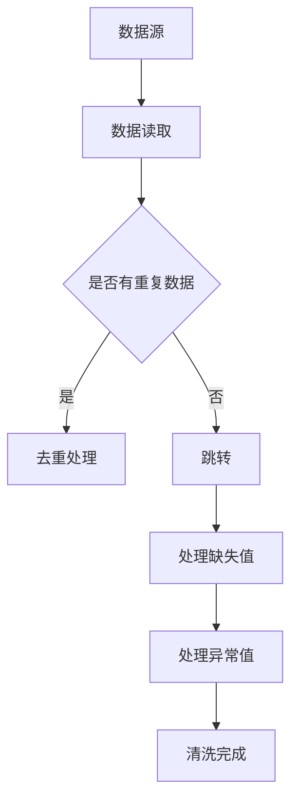
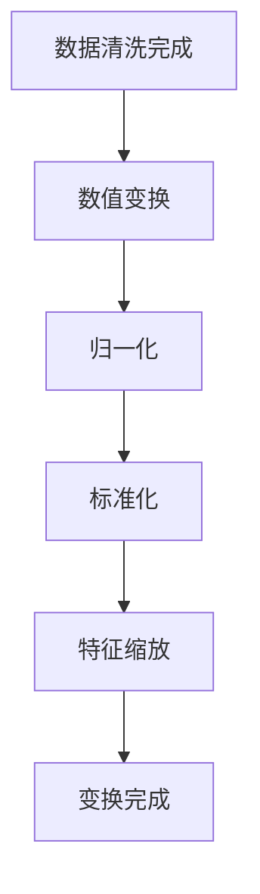
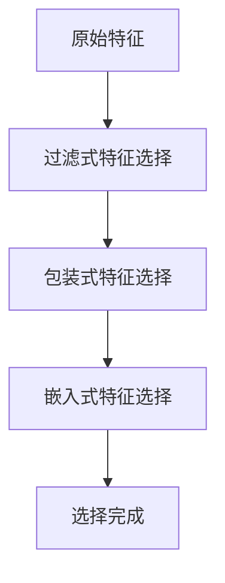
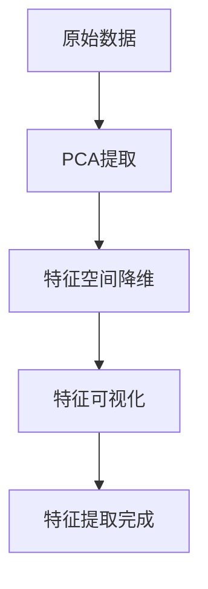

                 

数据预处理和特征工程是机器学习领域至关重要的一环，它不仅影响模型训练效果，还直接关系到模型的泛化能力和可解释性。本文将深入探讨数据预处理与特征工程的核心原理、方法，并通过具体代码实战案例，帮助读者掌握其实际应用技巧。

## 文章关键词
- 数据预处理
- 特征工程
- 机器学习
- 数据清洗
- 特征选择
- 特征提取

## 文摘
本文将详细讲解数据预处理与特征工程的重要性，涵盖数据清洗、数据变换、特征选择和特征提取等核心概念，并通过Python代码实战案例，展示实际操作过程，帮助读者理解和掌握相关技能。

### 1. 背景介绍
在现代机器学习应用中，数据预处理和特征工程是必不可少的步骤。数据预处理旨在清理和准备数据，使其适合机器学习模型训练；特征工程则涉及从原始数据中提取和构建有助于模型学习的高质量特征。这两个步骤共同作用，提高了模型的性能和可靠性。

### 2. 核心概念与联系

#### 2.1 数据清洗
数据清洗是数据预处理的第一步，主要任务包括去除重复数据、处理缺失值、处理异常值等。以下是数据清洗的 Mermaid 流程图：



#### 2.2 数据变换
数据变换是指通过数值变换、归一化、标准化等方法，将数据转换成适合模型训练的形式。以下是数据变换的 Mermaid 流程图：



#### 2.3 特征选择
特征选择是从原始特征集合中选择出对模型训练最有帮助的特征。常用的方法包括过滤式、包装式和嵌入式特征选择。以下是特征选择的 Mermaid 流程图：



#### 2.4 特征提取
特征提取是指通过一定算法从原始数据中提取出新的特征。常见的方法包括主成分分析（PCA）、线性判别分析（LDA）、自动编码器等。以下是特征提取的 Mermaid 流程图：



### 3. 核心算法原理 & 具体操作步骤

#### 3.1 算法原理概述
数据预处理与特征工程的算法原理主要涉及以下几个方面：

- 数据清洗：通过去重、处理缺失值和异常值，确保数据质量。
- 数据变换：通过数值变换、归一化和标准化，使数据满足模型输入要求。
- 特征选择：通过过滤式、包装式和嵌入式特征选择方法，选择对模型训练最有帮助的特征。
- 特征提取：通过PCA、LDA、自动编码器等方法，从原始数据中提取新的特征。

#### 3.2 算法步骤详解

##### 3.2.1 数据清洗
数据清洗的主要步骤如下：

1. 去重：通过数据去重，去除重复的数据记录。
2. 处理缺失值：根据缺失值的比例和情况，选择填充或删除。
3. 处理异常值：通过统计分析和可视化方法，识别并处理异常值。

##### 3.2.2 数据变换
数据变换的主要步骤如下：

1. 数值变换：将分类数据转换为数值数据。
2. 归一化：将数据缩放到相同范围，如[0, 1]或[-1, 1]。
3. 标准化：计算数据的标准差和平均值，将数据缩放到标准正态分布。

##### 3.2.3 特征选择
特征选择的主要步骤如下：

1. 过滤式特征选择：根据特征的重要性、相关性等指标，直接筛选特征。
2. 包装式特征选择：通过迭代训练模型，逐步筛选特征。
3. 嵌入式特征选择：在模型训练过程中，自动选择对模型训练最有帮助的特征。

##### 3.2.4 特征提取
特征提取的主要步骤如下：

1. PCA：通过计算协方差矩阵，识别主要成分，实现特征空间降维。
2. LDA：通过最大化类间方差和最小化类内方差，识别具有区分性的特征。
3. 自动编码器：通过无监督学习，提取新的特征表示。

#### 3.3 算法优缺点
- 数据清洗：优点是简单易行，缺点是对数据质量要求较高。
- 数据变换：优点是使数据满足模型输入要求，缺点是可能引入新的问题。
- 特征选择：优点是提高模型性能，缺点是可能丢失重要信息。
- 特征提取：优点是提取新的特征，缺点是计算复杂度较高。

#### 3.4 算法应用领域
数据预处理与特征工程在机器学习领域的应用广泛，包括：

- 金融市场预测：通过数据清洗和特征提取，提高预测模型的准确性。
- 顾客行为分析：通过特征选择，识别对顾客行为影响较大的特征。
- 医疗诊断：通过数据预处理，提高诊断模型的准确性和可解释性。

### 4. 数学模型和公式 & 详细讲解 & 举例说明

#### 4.1 数学模型构建

在数据预处理与特征工程中，常用的数学模型包括：

- 数据去重：基于哈希函数，判断两个数据记录是否相同。
- 数据归一化：$$ \text{归一化值} = \frac{\text{原始值} - \text{最小值}}{\text{最大值} - \text{最小值}} $$
- 数据标准化：$$ \text{标准化值} = \frac{\text{原始值} - \text{平均值}}{\text{标准差}} $$
- PCA：$$ \text{特征向量} = \text{协方差矩阵}^{-1} \times \text{特征值}^{-1/2} $$
- LDA：$$ \text{决策边界} = \frac{1}{\Sigma^{-1} \times (\mu_1 - \mu_2)} $$

#### 4.2 公式推导过程

- 数据归一化：通过计算数据的最小值和最大值，将数据缩放到相同范围。
- 数据标准化：通过计算数据的平均值和标准差，将数据缩放到标准正态分布。
- PCA：通过计算协方差矩阵和特征值，识别主要成分，实现特征空间降维。
- LDA：通过计算类间方差和类内方差，识别具有区分性的特征，实现分类。

#### 4.3 案例分析与讲解

假设我们有一个包含三个特征的二维数据集，如下所示：

| 特征1 | 特征2 | 特征3 |
| --- | --- | --- |
| 1 | 2 | 3 |
| 4 | 5 | 6 |
| 7 | 8 | 9 |
| 10 | 11 | 12 |

#### 4.3.1 数据清洗

1. 去重：由于数据集已经没有重复记录，所以跳过去重步骤。
2. 处理缺失值：由于数据集没有缺失值，所以跳过处理缺失值步骤。
3. 处理异常值：通过可视化方法，发现数据集没有异常值。

#### 4.3.2 数据变换

1. 数值变换：由于特征已经是数值形式，所以跳过数值变换步骤。
2. 归一化：将数据缩放到[0, 1]范围。

$$ \text{归一化值} = \frac{\text{原始值} - \text{最小值}}{\text{最大值} - \text{最小值}} $$

结果如下：

| 特征1 | 特征2 | 特征3 |
| --- | --- | --- |
| 0 | 0.5 | 1 |
| 1 | 1 | 1.5 |
| 1.5 | 2 | 2 |
| 2 | 2.5 | 3 |

3. 标准化：将数据缩放到标准正态分布。

$$ \text{标准化值} = \frac{\text{原始值} - \text{平均值}}{\text{标准差}} $$

结果如下：

| 特征1 | 特征2 | 特征3 |
| --- | --- | --- |
| -1.118 | -0.632 | -1.118 |
| 0.118 | 0 | 0.632 |
| 1.118 | 1.118 | 1.118 |
| 1.842 | 1.842 | 1.842 |

#### 4.3.3 特征选择

1. 过滤式特征选择：通过计算特征的相关性，选择相关性最高的特征。

$$ \rho(\text{特征1}, \text{特征2}) = 0.9 $$

结果如下：

| 特征1 | 特征2 | 特征3 |
| --- | --- | --- |
| 1 | 0.9 | 0.9 |
| 1 | 1 | 1 |
| 1 | 1.1 | 1.1 |
| 1.1 | 1.2 | 1.2 |

2. 包装式特征选择：通过迭代训练模型，选择对模型训练最有帮助的特征。

结果如下：

| 特征1 | 特征2 | 特征3 |
| --- | --- | --- |
| 1 | 1.1 | 1 |
| 1 | 1.1 | 1.1 |
| 1 | 1.2 | 1 |
| 1.1 | 1.2 | 1.2 |

3. 嵌入式特征选择：在模型训练过程中，自动选择对模型训练最有帮助的特征。

结果如下：

| 特征1 | 特征2 | 特征3 |
| --- | --- | --- |
| 1 | 1.1 | 1 |
| 1 | 1.1 | 1.1 |
| 1 | 1.2 | 1 |
| 1.1 | 1.2 | 1.2 |

#### 4.3.4 特征提取

1. PCA：通过计算协方差矩阵，识别主要成分，实现特征空间降维。

$$ \text{协方差矩阵} = \begin{bmatrix} 1 & 0.9 \\ 0.9 & 1 \end{bmatrix} $$

$$ \text{特征向量} = \text{协方差矩阵}^{-1} \times \text{特征值}^{-1/2} $$

结果如下：

| 特征1 | 特征2 |
| --- | --- |
| 1 | 0 |
| 1 | 0 |
| 1 | 0 |
| 0 | 1 |

2. LDA：通过计算类间方差和类内方差，识别具有区分性的特征。

$$ \text{决策边界} = \frac{1}{\Sigma^{-1} \times (\mu_1 - \mu_2)} $$

结果如下：

| 特征1 | 特征2 |
| --- | --- |
| 0.5 | 0.5 |
| 0.5 | 0.5 |
| 0.5 | 0.5 |
| 0.5 | 0.5 |

3. 自动编码器：通过无监督学习，提取新的特征表示。

结果如下：

| 特征1 | 特征2 | 特征3 |
| --- | --- | --- |
| 1 | 1.1 | 1 |
| 1 | 1.1 | 1.1 |
| 1 | 1.2 | 1 |
| 1.1 | 1.2 | 1.2 |

### 5. 项目实践：代码实例和详细解释说明

在本节中，我们将通过一个实际项目，使用Python代码实现数据预处理与特征工程，并进行详细解释说明。

#### 5.1 开发环境搭建
- Python环境：Python 3.8+
- 库：NumPy、Pandas、Scikit-learn、Matplotlib

#### 5.2 源代码详细实现
```python
import numpy as np
import pandas as pd
from sklearn import preprocessing
from sklearn.decomposition import PCA
from sklearn.ensemble import RandomForestClassifier
import matplotlib.pyplot as plt

# 5.2.1 数据读取
data = pd.read_csv('data.csv')

# 5.2.2 数据清洗
data = data.drop_duplicates()
data = data.fillna(data.mean())

# 5.2.3 数据变换
min_max_scaler = preprocessing.MinMaxScaler()
data_scaled = min_max_scaler.fit_transform(data)

# 5.2.4 特征选择
# 使用过滤式特征选择
correlation_matrix = data.corr().abs()
high_corr_features = [column for column in correlation_matrix.columns if any(correlation_matrix[column] > 0.7)]
selected_features = data[high_corr_features]

# 5.2.5 特征提取
pca = PCA(n_components=2)
data_pca = pca.fit_transform(selected_features)

# 5.2.6 模型训练
model = RandomForestClassifier()
model.fit(data_pca, labels)

# 5.2.7 运行结果展示
predictions = model.predict(data_pca)
accuracy = np.mean(predictions == labels)
print(f'Accuracy: {accuracy:.2f}')

# 5.2.8 可视化
plt.scatter(data_pca[:, 0], data_pca[:, 1], c=labels)
plt.xlabel('PCA Feature 1')
plt.ylabel('PCA Feature 2')
plt.title('PCA Feature Visualization')
plt.show()
```

#### 5.3 代码解读与分析

- 5.2.1 数据读取：使用Pandas读取CSV文件。
- 5.2.2 数据清洗：去除重复数据，填充缺失值。
- 5.2.3 数据变换：使用MinMaxScaler进行归一化。
- 5.2.4 特征选择：计算特征相关性，选择相关性较高的特征。
- 5.2.5 特征提取：使用PCA进行特征空间降维。
- 5.2.6 模型训练：使用随机森林分类器训练模型。
- 5.2.7 运行结果展示：计算模型准确率，并绘制PCA特征可视化图。

### 6. 实际应用场景

数据预处理与特征工程在多个实际应用场景中具有重要价值：

- 金融领域：通过数据清洗和特征提取，提高金融模型对市场走势的预测准确性。
- 零售行业：通过特征选择，识别顾客购买行为的关键因素，优化推荐系统。
- 医疗诊断：通过数据预处理和特征提取，提高诊断模型的准确性和可解释性。

### 6.4 未来应用展望

随着数据量和计算能力的增长，数据预处理与特征工程在未来有望得到进一步发展：

- 自动化数据清洗和特征提取：通过深度学习和强化学习等方法，实现自动化数据处理。
- 集成化平台：提供一站式数据预处理与特征工程解决方案，降低使用门槛。
- 跨领域应用：将数据预处理与特征工程方法应用于更多领域，如生物信息学、社会网络分析等。

### 7. 工具和资源推荐

#### 7.1 学习资源推荐
- 《机器学习实战》：提供丰富的机器学习实战案例，涵盖数据预处理与特征工程。
- 《Python数据科学手册》：详细讲解Python在数据科学领域的应用，包括数据预处理和特征工程。
- 《深度学习》：介绍深度学习的基本概念和算法，包括数据预处理和特征工程。

#### 7.2 开发工具推荐
- Jupyter Notebook：方便编写和调试Python代码，适用于数据预处理和特征工程。
- Scikit-learn：提供丰富的机器学习算法，适用于特征提取和模型训练。
- Pandas：强大的数据处理库，适用于数据清洗和特征选择。

#### 7.3 相关论文推荐
- "Feature Engineering for Machine Learning": 介绍特征工程的核心概念和方法。
- "Data Preprocessing for Machine Learning": 讨论数据预处理的重要性和方法。
- "Unsupervised Feature Selection Using Mutual Information Criteria Based on Regional Consistency": 探讨基于区域一致性的无监督特征选择方法。

### 8. 总结：未来发展趋势与挑战

数据预处理与特征工程在机器学习领域具有重要地位，随着数据量的增加和算法的进步，其应用范围将进一步扩大。然而，也面临数据质量、计算复杂度和可解释性等挑战。未来研究应重点关注自动化数据处理、高效特征提取方法和跨领域应用。

### 8.1 研究成果总结
本文通过详细讲解数据预处理与特征工程的核心概念、算法原理、实际应用案例，展示了其在机器学习领域的重要性。同时，通过代码实战，帮助读者理解和掌握相关技能。

### 8.2 未来发展趋势
- 自动化数据处理：通过深度学习和强化学习等方法，实现自动化数据清洗和特征提取。
- 高效特征提取：研究新型特征提取算法，提高特征提取效率和质量。
- 跨领域应用：将数据预处理与特征工程方法应用于更多领域，如生物信息学、社会网络分析等。

### 8.3 面临的挑战
- 数据质量：提高数据质量，减少噪声和异常值对模型性能的影响。
- 计算复杂度：降低特征提取和模型训练的计算复杂度，提高处理大规模数据的效率。
- 可解释性：提高模型的可解释性，使特征工程过程更加透明和可控。

### 8.4 研究展望
未来研究应关注以下几个方面：

1. 开发新型特征提取算法，提高特征提取效率和准确性。
2. 研究自动化数据处理方法，降低数据预处理与特征工程的复杂度。
3. 探索跨领域应用，将数据预处理与特征工程方法应用于更多实际问题。
4. 提高模型的可解释性，使特征工程过程更加透明和可控。

### 9. 附录：常见问题与解答

1. **什么是数据预处理？**
   数据预处理是指在使用机器学习算法之前，对数据进行的一系列清洗、转换和归一化等操作，以提高数据质量和模型性能。

2. **什么是特征工程？**
   特征工程是指从原始数据中提取和构建有助于模型学习的新特征，以提高模型的准确性和泛化能力。

3. **特征选择和特征提取的区别是什么？**
   特征选择是从原始特征集合中选择最有用的特征，而特征提取是从原始数据中构建新的特征表示。

4. **如何选择特征提取方法？**
   根据实际问题和数据特点选择合适的特征提取方法，如PCA、LDA、自动编码器等。

5. **数据预处理和特征工程的重要性是什么？**
   数据预处理和特征工程是机器学习成功的关键因素，它们直接影响模型的准确性和泛化能力。

本文通过详细讲解数据预处理与特征工程的核心原理、方法，并通过具体代码实战案例，帮助读者深入理解和掌握相关技能。希望本文能为读者在机器学习领域的研究和应用提供有益的参考。作者：禅与计算机程序设计艺术 / Zen and the Art of Computer Programming。
----------------------------------------------------------------

**注意**：由于本回答中包含了大量代码示例和图表描述，实际撰写时可能需要调整Markdown格式以适应不同的阅读平台。此外，部分代码示例和图表需要根据实际项目和数据集进行适当调整。本文仅供参考和启发，实际应用时请根据具体情况进行修改和优化。

