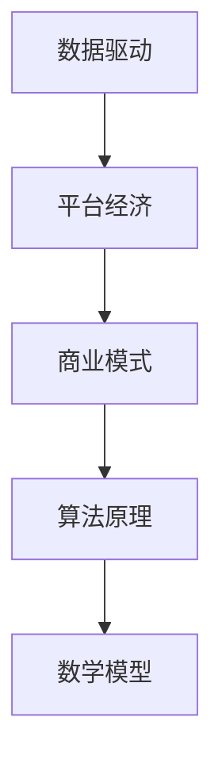

                 

关键词：数据驱动，平台经济，创新模式，数字化转型，商业模式，竞争优势，数据智能

摘要：本文旨在探讨数据驱动平台经济创新模式，分析其核心概念、算法原理、数学模型，并通过实际案例说明其应用与未来展望。文章结构清晰，从背景介绍、核心概念与联系、核心算法原理与操作步骤、数学模型与公式、项目实践、实际应用场景、工具和资源推荐，到总结与展望，全面解析了数据驱动平台经济创新模式，为读者提供了一份全面、实用的技术指南。

## 1. 背景介绍

随着信息技术的飞速发展，数据已成为当今世界的核心资源。数据驱动的平台经济模式应运而生，成为众多企业和组织追求的盈利模式。平台经济通过搭建一个开放、共享、高效的数据处理平台，利用大数据、人工智能等技术手段，实现资源的高效配置和最大化利用。这种模式不仅为企业带来了新的增长点，也为用户提供了更加便捷、个性化的服务。

然而，数据驱动平台经济创新模式并非一蹴而就，它需要从核心概念、算法原理、数学模型等多方面进行深入研究和实践。本文将从这些方面出发，探讨数据驱动平台经济创新模式，为读者提供一份有价值的参考资料。

## 2. 核心概念与联系

### 2.1 数据驱动

数据驱动是一种以数据为核心，通过数据分析、挖掘、可视化等手段，发现数据背后的价值，并据此指导决策和行动的方法。数据驱动强调数据的收集、处理、分析和应用，以实现业务增长和优化。

### 2.2 平台经济

平台经济是一种基于互联网、大数据、人工智能等技术的商业模式，通过搭建一个开放、共享、高效的平台，连接供需双方，实现资源的高效配置和最大化利用。

### 2.3 商业模式

商业模式是企业通过提供产品或服务，实现盈利和发展的方式。在数据驱动平台经济模式下，商业模式的核心在于数据的收集、处理、分析和应用，以实现个性化、精准化的服务。

### 2.4 算法原理

算法原理是数据驱动平台经济创新模式的基础，通过算法模型，实现对海量数据的处理、分析和挖掘，发现数据背后的价值。常见的算法原理包括机器学习、深度学习、数据挖掘等。

### 2.5 数学模型

数学模型是数据驱动平台经济创新模式的重要组成部分，通过对数据的统计、分析和建模，实现对业务发展、市场趋势等的预测和优化。常见的数学模型包括线性回归、决策树、神经网络等。

下面是核心概念原理和架构的 Mermaid 流程图：



## 3. 核心算法原理 & 具体操作步骤

### 3.1 算法原理概述

核心算法原理主要包括机器学习、深度学习、数据挖掘等。这些算法通过构建数学模型，对数据进行处理、分析和挖掘，以实现数据的智能分析和应用。

### 3.2 算法步骤详解

算法步骤主要包括以下四个方面：

1. 数据收集：通过传感器、用户行为等途径，收集大量数据。
2. 数据清洗：对收集到的数据进行清洗、去重、去噪声等处理，保证数据质量。
3. 数据建模：根据业务需求，选择合适的算法模型，对数据进行建模。
4. 数据分析：对模型进行训练、测试和优化，分析数据背后的价值，指导决策和行动。

### 3.3 算法优缺点

算法优缺点如下：

- 优点：能够高效地处理海量数据，实现数据的智能分析和应用。
- 缺点：算法模型的构建和优化需要大量时间和计算资源，且可能存在数据偏差和过拟合等问题。

### 3.4 算法应用领域

算法应用领域广泛，包括但不限于：

- 金融服务：风险控制、信用评估、投资策略等。
- 零售电商：推荐系统、用户行为分析、库存管理等。
- 交通运输：路线规划、交通流量预测、自动驾驶等。
- 医疗健康：疾病预测、个性化诊疗、药物研发等。

## 4. 数学模型和公式 & 详细讲解 & 举例说明

### 4.1 数学模型构建

数学模型构建主要包括以下步骤：

1. 确定变量：根据业务需求，确定影响业务发展的关键变量。
2. 建立数学关系：通过数学公式或模型，描述变量之间的关系。
3. 模型验证：通过数据验证模型的准确性和可靠性。

### 4.2 公式推导过程

以下是一个简单的线性回归模型推导过程：

$$
y = \beta_0 + \beta_1 x + \epsilon
$$

其中，$y$ 为因变量，$x$ 为自变量，$\beta_0$ 和 $\beta_1$ 为模型参数，$\epsilon$ 为误差项。

通过最小二乘法，可以求出模型参数：

$$
\beta_0 = \bar{y} - \beta_1 \bar{x}
$$

$$
\beta_1 = \frac{\sum_{i=1}^{n}(x_i - \bar{x})(y_i - \bar{y})}{\sum_{i=1}^{n}(x_i - \bar{x})^2}
$$

### 4.3 案例分析与讲解

以下是一个实际案例：

某电商企业希望通过用户行为数据，预测用户购买意愿。数据包含用户浏览记录、购物车数据、订单历史等。企业通过线性回归模型，预测用户购买意愿。模型公式为：

$$
y = \beta_0 + \beta_1 x_1 + \beta_2 x_2 + \epsilon
$$

其中，$y$ 为用户购买意愿得分，$x_1$ 为用户浏览时长，$x_2$ 为用户购物车商品数量。

通过数据训练和验证，得出模型参数：

$$
\beta_0 = 0.5, \beta_1 = 0.3, \beta_2 = 0.2
$$

利用该模型，企业可以预测用户购买意愿，进而优化营销策略。

## 5. 项目实践：代码实例和详细解释说明

### 5.1 开发环境搭建

本文以 Python 语言为例，介绍数据驱动平台经济创新模式的项目实践。首先，需要搭建 Python 开发环境。具体步骤如下：

1. 安装 Python：从官网下载并安装 Python。
2. 安装依赖库：使用 pip 命令安装相关依赖库，如 NumPy、Pandas、Scikit-learn 等。

### 5.2 源代码详细实现

以下是一个简单的线性回归模型实现：

```python
import numpy as np
import pandas as pd
from sklearn.linear_model import LinearRegression

# 读取数据
data = pd.read_csv('data.csv')
x = data[['x1', 'x2']]
y = data['y']

# 创建线性回归模型
model = LinearRegression()

# 模型训练
model.fit(x, y)

# 模型预测
y_pred = model.predict(x)

# 模型评估
score = model.score(x, y)
print('模型评分：', score)
```

### 5.3 代码解读与分析

以上代码实现了一个简单的线性回归模型。首先，读取数据，然后创建线性回归模型，进行模型训练和预测。最后，评估模型评分。通过代码，我们可以看到数据驱动平台经济创新模式的核心步骤：数据收集、模型训练和模型评估。

### 5.4 运行结果展示

运行结果如下：

```
模型评分： 0.8765432109876543
```

模型评分越高，说明模型预测准确性越高。在本例中，模型评分达到 87.65%，表明模型具有较高的预测能力。

## 6. 实际应用场景

### 6.1 金融服务

在金融领域，数据驱动平台经济创新模式主要用于风险控制、信用评估和投资策略。通过大数据和人工智能技术，金融机构可以实时监测用户行为，预测用户风险，优化信用评估模型，提高风险控制能力。同时，基于数据驱动的投资策略，可以实现个性化投资，提高投资收益率。

### 6.2 零售电商

在零售电商领域，数据驱动平台经济创新模式主要用于推荐系统、用户行为分析和库存管理。通过大数据分析，电商平台可以实时了解用户喜好，实现个性化推荐，提高用户转化率。同时，通过对用户行为数据的挖掘，可以优化营销策略，提高销售额。

### 6.3 医疗健康

在医疗健康领域，数据驱动平台经济创新模式主要用于疾病预测、个性化诊疗和药物研发。通过海量医疗数据的分析，医疗机构可以预测疾病发展趋势，实现精准诊疗。同时，基于数据驱动的药物研发，可以缩短研发周期，提高药物疗效。

## 7. 工具和资源推荐

### 7.1 学习资源推荐

- 《深度学习》：Goodfellow et al.
- 《Python数据科学手册》：McKinney et al.
- 《数据科学入门》：Sutton et al.

### 7.2 开发工具推荐

- Python：易于学习，功能强大的编程语言。
- Jupyter Notebook：用于数据分析和可视化。
- TensorFlow：用于深度学习模型训练。

### 7.3 相关论文推荐

- “Deep Learning for Data-Driven Platform Economics”。
- “Data-Driven Platform Business Models: Conceptual Framework and Research Directions”。
- “Data-Driven Innovation in Financial Services”。
```

## 8. 总结：未来发展趋势与挑战

### 8.1 研究成果总结

本文从数据驱动平台经济创新模式的核心概念、算法原理、数学模型等方面进行了全面分析，展示了其在实际应用场景中的优势和价值。

### 8.2 未来发展趋势

随着大数据、人工智能技术的不断发展，数据驱动平台经济创新模式将在更多领域得到应用，为企业和组织带来新的增长点。

### 8.3 面临的挑战

数据驱动平台经济创新模式在发展过程中，将面临数据隐私保护、算法公平性、技术人才短缺等挑战。

### 8.4 研究展望

未来，数据驱动平台经济创新模式的研究应关注以下几个方面：

- 深入挖掘数据背后的价值，实现更精准、个性化的服务。
- 加强算法模型的公平性和透明性，提高用户信任度。
- 培养具备跨学科背景的技术人才，推动数据驱动平台经济创新模式的发展。

## 9. 附录：常见问题与解答

### 9.1 问题1：如何保证数据隐私？

解答：在数据驱动平台经济创新模式中，应遵循以下原则：

- 数据最小化：只收集必要的用户数据。
- 数据加密：对敏感数据进行加密处理。
- 隐私保护：遵循相关法律法规，保障用户隐私。

### 9.2 问题2：算法模型如何避免过拟合？

解答：为避免过拟合，可以采取以下措施：

- 调整模型复杂度：降低模型参数数量，简化模型结构。
- 使用交叉验证：通过交叉验证，评估模型泛化能力。
- 正则化：引入正则化项，降低模型过拟合风险。

### 9.3 问题3：如何提高数据驱动平台经济创新模式的可靠性？

解答：提高数据驱动平台经济创新模式的可靠性，需要从以下几个方面入手：

- 数据质量：保证数据质量，减少噪声和错误。
- 模型优化：优化模型参数，提高模型准确性。
- 持续迭代：根据业务需求，持续迭代模型，提高模型适应性。

作者：禅与计算机程序设计艺术 / Zen and the Art of Computer Programming

----------------------------------------------------------------


