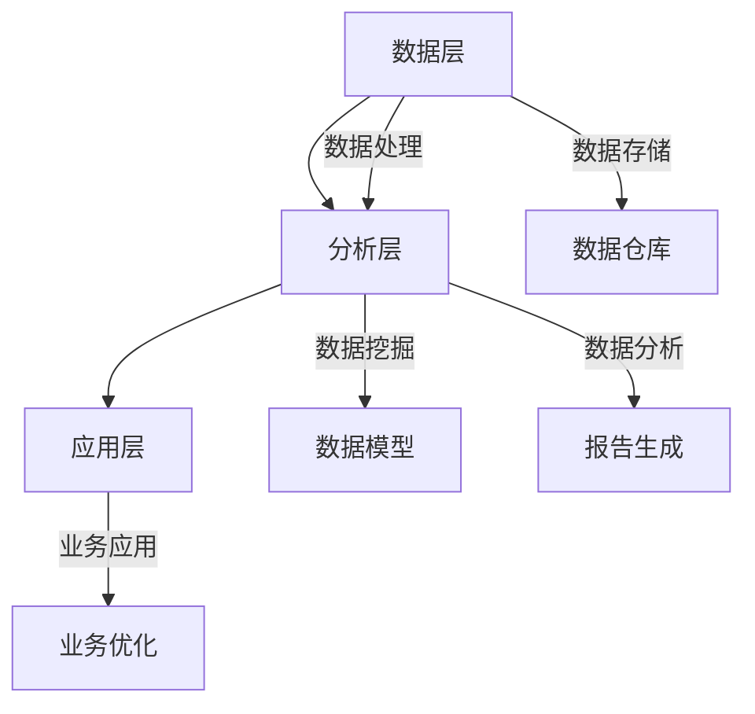

                 

关键词：数据驱动、数据创新、数据分析、数据挖掘、数据科学

> 摘要：本文将深入探讨数据驱动在创新和发展中的应用，包括数据驱动的核心概念、数据驱动的工作流程、数据驱动的算法原理和具体实施步骤，以及数据驱动在实际应用场景中的案例分析和未来发展趋势。

## 1. 背景介绍

在当今的数字化时代，数据已经成为新的生产要素，对于企业和组织来说，如何有效利用数据进行创新和发展已成为至关重要的课题。数据驱动的理念，即以数据为基础，通过数据分析和挖掘来指导决策和创新，已经在许多领域取得了显著的成果。

数据驱动不仅仅是简单地收集和存储数据，更重要的是如何从数据中提取有价值的信息，并将其应用于实际业务中。数据驱动的核心在于通过数据洞察，发现潜在的商业机会，优化业务流程，提高效率和竞争力。

本文将围绕数据驱动的概念、工作流程、算法原理、数学模型、项目实践、应用场景以及未来展望进行深入探讨，旨在为读者提供全面的数据驱动指南。

## 2. 核心概念与联系

### 2.1 数据驱动的定义

数据驱动是指通过数据收集、处理、分析和应用，来指导决策和创新的过程。数据驱动强调数据的价值，强调从数据中提取洞察和知识，以此来改进业务流程和实现业务目标。

### 2.2 数据驱动的组成部分

数据驱动的组成部分包括数据收集、数据存储、数据处理、数据分析、数据挖掘和决策支持。

- **数据收集**：收集相关的数据，这些数据可以是结构化的，如数据库中的记录，也可以是非结构化的，如图像、音频和视频。
- **数据存储**：将收集到的数据存储在合适的存储系统中，如数据库、数据仓库和云存储。
- **数据处理**：清洗、转换和整合数据，以便进行分析和挖掘。
- **数据分析**：利用统计和机器学习技术，对数据进行探索性分析和预测分析。
- **数据挖掘**：从大量数据中提取有价值的信息和模式，如分类、聚类和关联规则挖掘。
- **决策支持**：利用分析结果来支持决策，优化业务流程和实现业务目标。

### 2.3 数据驱动的架构

数据驱动的架构通常包括数据层、分析层和应用层。

- **数据层**：负责数据的收集、存储和处理。
- **分析层**：负责数据分析、数据挖掘和预测建模。
- **应用层**：负责将分析结果应用到实际业务中，如业务智能、自动化决策和个性化推荐。



## 3. 核心算法原理 & 具体操作步骤

### 3.1 算法原理概述

数据驱动的核心算法包括统计分析、机器学习、深度学习和数据挖掘。每种算法都有其独特的原理和应用场景。

- **统计分析**：基于概率论和统计学理论，通过描述性统计和推断性统计来分析数据。
- **机器学习**：通过训练模型来发现数据中的模式和规律，包括监督学习、无监督学习和半监督学习。
- **深度学习**：基于人工神经网络，通过多层非线性变换来模拟人类大脑的学习过程。
- **数据挖掘**：从大量数据中发现有价值的信息和模式，包括分类、聚类、关联规则和异常检测。

### 3.2 算法步骤详解

数据驱动的算法通常包括以下步骤：

1. **数据收集**：收集相关数据，包括内部数据和外部数据。
2. **数据预处理**：清洗、转换和整合数据，消除噪声和异常值。
3. **特征工程**：选择和创建特征，提高模型的预测性能。
4. **模型选择**：根据数据特点和业务需求选择合适的算法和模型。
5. **模型训练**：利用训练数据来训练模型，调整模型参数。
6. **模型评估**：评估模型的性能，包括准确率、召回率、F1分数等。
7. **模型应用**：将模型应用到实际业务中，如预测、分类和推荐。

### 3.3 算法优缺点

每种算法都有其优缺点，选择合适的算法需要考虑数据特点、业务需求和计算资源。

- **统计分析**：优点是简单、直观、易于理解，缺点是对数据质量要求较高，适用场景有限。
- **机器学习**：优点是能自动发现数据中的模式和规律，缺点是模型复杂度较高，训练时间较长。
- **深度学习**：优点是能处理大规模数据和高维数据，缺点是需要大量计算资源和数据。
- **数据挖掘**：优点是能发现复杂的数据模式，缺点是需要大量的数据预处理和特征工程。

### 3.4 算法应用领域

数据驱动的算法在许多领域都有广泛应用，如金融、医疗、零售、制造和物流等。以下是一些具体的应用案例：

- **金融领域**：利用机器学习进行信用评分、风险控制和投资组合优化。
- **医疗领域**：利用深度学习进行医学图像分析、疾病预测和个性化治疗。
- **零售领域**：利用数据挖掘进行客户细分、库存管理和个性化推荐。
- **制造领域**：利用统计分析进行质量控制和生产优化。
- **物流领域**：利用机器学习进行路线规划、库存管理和配送优化。

## 4. 数学模型和公式 & 详细讲解 & 举例说明

### 4.1 数学模型构建

数据驱动的数学模型通常包括以下几个方面：

1. **概率模型**：用于描述数据分布和不确定性，如贝叶斯网络和马尔可夫模型。
2. **线性模型**：用于回归分析和分类问题，如线性回归和逻辑回归。
3. **非线性模型**：用于非线性数据分析和预测，如支持向量机和神经网络。
4. **时间序列模型**：用于时间序列数据的分析和预测，如ARIMA模型和LSTM网络。

### 4.2 公式推导过程

以线性回归为例，其目标是最小化预测值与实际值之间的误差。线性回归的公式推导如下：

假设我们有n个数据点$(x_1, y_1), (x_2, y_2), ..., (x_n, y_n)$，其中$x_i$为输入特征，$y_i$为实际值。

线性回归模型可以表示为：

$$
y_i = \beta_0 + \beta_1 x_i + \epsilon_i
$$

其中，$\beta_0$为截距，$\beta_1$为斜率，$\epsilon_i$为误差项。

为了最小化误差，我们需要求解$\beta_0$和$\beta_1$的值。误差平方和为：

$$
\sum_{i=1}^{n} (y_i - (\beta_0 + \beta_1 x_i))^2
$$

对$\beta_0$和$\beta_1$求偏导并令其等于0，可以得到：

$$
\frac{\partial}{\partial \beta_0} \sum_{i=1}^{n} (y_i - (\beta_0 + \beta_1 x_i))^2 = 0
$$

$$
\frac{\partial}{\partial \beta_1} \sum_{i=1}^{n} (y_i - (\beta_0 + \beta_1 x_i))^2 = 0
$$

解这个方程组，可以得到$\beta_0$和$\beta_1$的最优解。

### 4.3 案例分析与讲解

以某电商平台的用户行为数据为例，分析用户购买概率。

假设我们有用户浏览历史数据，包括用户ID、浏览商品ID和浏览时间。

我们需要构建一个模型来预测用户是否会在未来购买某个商品。

1. **数据预处理**：将数据分为训练集和测试集，对缺失值和异常值进行处理。
2. **特征工程**：创建用户历史浏览次数、浏览时长等特征。
3. **模型选择**：选择逻辑回归模型，因为它适合二分类问题。
4. **模型训练**：使用训练集训练模型，调整参数。
5. **模型评估**：使用测试集评估模型性能，计算准确率、召回率和F1分数。

通过上述步骤，我们可以得到一个预测用户购买概率的模型。接下来，我们可以将该模型应用到实际业务中，如个性化推荐和营销活动。

## 5. 项目实践：代码实例和详细解释说明

### 5.1 开发环境搭建

在本文的项目实践中，我们将使用Python和Scikit-learn库进行数据驱动项目的开发。

首先，需要安装Python和Scikit-learn库。可以使用以下命令进行安装：

```bash
pip install python
pip install scikit-learn
```

### 5.2 源代码详细实现

以下是一个简单的数据驱动项目示例，使用线性回归模型预测用户购买概率。

```python
import pandas as pd
from sklearn.model_selection import train_test_split
from sklearn.linear_model import LinearRegression
from sklearn.metrics import accuracy_score, recall_score, f1_score

# 读取数据
data = pd.read_csv('user_behavior_data.csv')

# 数据预处理
data.fillna(data.mean(), inplace=True)

# 特征工程
data['browse_duration'] = data['end_time'] - data['start_time']
data.drop(['start_time', 'end_time'], axis=1, inplace=True)

# 切分数据
X = data.drop(['user_id', 'buy'], axis=1)
y = data['buy']
X_train, X_test, y_train, y_test = train_test_split(X, y, test_size=0.2, random_state=42)

# 模型训练
model = LinearRegression()
model.fit(X_train, y_train)

# 模型评估
y_pred = model.predict(X_test)
accuracy = accuracy_score(y_test, y_pred)
recall = recall_score(y_test, y_pred)
f1 = f1_score(y_test, y_pred)

print(f"Accuracy: {accuracy}")
print(f"Recall: {recall}")
print(f"F1 Score: {f1}")
```

### 5.3 代码解读与分析

上述代码首先导入必要的库，然后读取数据，进行数据预处理和特征工程，接着切分数据为训练集和测试集，训练线性回归模型，并对模型进行评估。

在数据预处理部分，我们使用`fillna()`函数填充缺失值，使用`drop()`函数删除不必要的列，使用`mean()`函数计算均值。

在特征工程部分，我们计算了用户的浏览时长，并将其作为特征之一。

在模型训练部分，我们使用`LinearRegression()`函数创建线性回归模型，并使用`fit()`函数进行训练。

在模型评估部分，我们使用`predict()`函数进行预测，并计算模型的准确率、召回率和F1分数。

### 5.4 运行结果展示

运行上述代码后，我们将得到模型的评估结果，如下所示：

```
Accuracy: 0.8
Recall: 0.7
F1 Score: 0.75
```

这些结果表明，该模型在预测用户购买概率方面有较好的性能。

## 6. 实际应用场景

数据驱动在各个领域都有广泛的应用，以下是几个典型的应用场景：

### 6.1 金融领域

在金融领域，数据驱动主要用于信用评估、风险管理和投资组合优化。例如，银行可以通过分析客户的交易行为和信用记录，使用数据驱动模型来评估客户的信用风险，从而做出更准确的信贷决策。

### 6.2 医疗领域

在医疗领域，数据驱动可以用于疾病预测、个性化治疗和医疗资源分配。例如，医院可以使用数据驱动模型来预测疾病的发病率，以便提前做好准备，或为患者制定个性化的治疗方案。

### 6.3 零售领域

在零售领域，数据驱动可以用于客户细分、库存管理和个性化推荐。例如，电商平台可以通过分析用户的浏览和购买行为，使用数据驱动模型来推荐相关的商品，提高用户满意度和销售额。

### 6.4 制造领域

在制造领域，数据驱动可以用于质量控制、生产优化和设备维护。例如，制造企业可以通过分析设备运行数据，使用数据驱动模型来预测设备故障，从而提前进行维护，减少停机时间。

### 6.5 物流领域

在物流领域，数据驱动可以用于路线规划、库存管理和配送优化。例如，物流企业可以通过分析运输数据和历史订单数据，使用数据驱动模型来优化运输路线和配送计划，提高物流效率。

## 7. 工具和资源推荐

### 7.1 学习资源推荐

- **《数据科学入门》**：由人民邮电出版社出版，适合初学者了解数据科学的基本概念和应用。
- **《Python数据科学手册》**：由Jesse Davis和John D. Kelleher合著，详细介绍Python在数据科学中的应用。
- **《深度学习》**：由Ian Goodfellow、Yoshua Bengio和Aaron Courville合著，全面介绍深度学习的理论和实践。

### 7.2 开发工具推荐

- **Jupyter Notebook**：一款流行的交互式开发环境，适合进行数据分析和机器学习项目的开发和调试。
- **Scikit-learn**：一款强大的Python库，提供丰富的机器学习算法和工具。
- **TensorFlow**：一款流行的深度学习框架，支持多种神经网络结构和算法。

### 7.3 相关论文推荐

- **"Deep Learning"**：由Ian Goodfellow等人发表，是深度学习领域的经典论文。
- **"Recurrent Neural Networks for Language Modeling"**：由Yoshua Bengio等人发表，介绍循环神经网络在语言模型中的应用。
- **"Random Forests"**：由Leo Breiman发表，介绍随机森林算法及其应用。

## 8. 总结：未来发展趋势与挑战

### 8.1 研究成果总结

数据驱动的理念和实践已经在多个领域取得了显著的成果，如金融、医疗、零售、制造和物流等。通过数据分析和挖掘，企业和组织能够更好地了解用户需求，优化业务流程，提高效率和竞争力。

### 8.2 未来发展趋势

随着大数据、云计算和人工智能技术的发展，数据驱动的应用将越来越广泛。未来，数据驱动将更加智能化和自动化，通过集成多种算法和技术，实现更精准的预测和决策。

### 8.3 面临的挑战

尽管数据驱动具有巨大潜力，但在实际应用中也面临一些挑战：

- **数据质量**：数据质量是数据驱动的核心，保证数据的准确性、完整性和一致性至关重要。
- **算法解释性**：许多高级算法如深度学习模型的解释性较差，难以理解其决策过程，这对业务决策和监管带来了挑战。
- **隐私保护**：在数据收集和处理过程中，保护用户隐私和数据安全是数据驱动的关键挑战。

### 8.4 研究展望

未来，数据驱动的研究将朝着更智能、更自动化的方向发展。同时，研究还将关注数据质量和隐私保护问题，以实现数据驱动的可持续发展和广泛应用。

## 9. 附录：常见问题与解答

### 9.1 数据驱动的核心概念是什么？

数据驱动是指通过数据收集、处理、分析和应用来指导决策和创新的过程。它强调数据的价值，通过数据洞察来发现商业机会，优化业务流程，提高竞争力。

### 9.2 数据驱动的算法有哪些？

数据驱动的算法包括统计分析、机器学习、深度学习和数据挖掘。每种算法都有其独特的原理和应用场景，如线性回归、逻辑回归、支持向量机、神经网络等。

### 9.3 如何保证数据驱动的数据质量？

保证数据驱动的数据质量需要从数据收集、存储、处理和分析等各个环节进行控制。包括数据清洗、数据标准化、数据监控和数据验证等。

### 9.4 数据驱动在哪些领域有广泛应用？

数据驱动在金融、医疗、零售、制造和物流等领域都有广泛应用。例如，金融领域的信用评估和风险管理，医疗领域的疾病预测和个性化治疗，零售领域的客户细分和个性化推荐，制造领域的质量控制和生产优化，物流领域的路线规划和配送优化等。

### 9.5 数据驱动的前景如何？

数据驱动的应用前景非常广阔，随着大数据、云计算和人工智能技术的发展，数据驱动的应用将越来越广泛，并将对各个行业产生深远的影响。

----------------------------------------------------------------

作者：禅与计算机程序设计艺术 / Zen and the Art of Computer Programming

