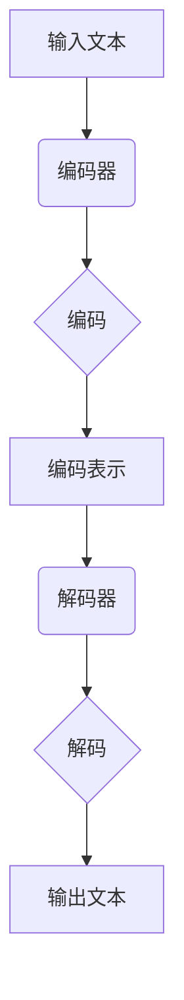

                 

关键词：文本生成，自然语言处理，神经网络，深度学习，生成模型，语言模型，序列生成，预训练模型，编码器-解码器架构，变分自编码器，生成对抗网络，应用场景。

> 摘要：本文将深入探讨文本生成这一自然语言处理领域的重要研究方向。通过介绍文本生成的核心概念、算法原理、数学模型和实际应用，我们将对文本生成的技术进行全面剖析，旨在为读者提供关于这一领域的系统理解和实践指导。

## 1. 背景介绍

文本生成是自然语言处理（Natural Language Processing, NLP）领域的一个热点研究方向，其目标是从输入文本中生成新的、有意义的文本。文本生成不仅在理论研究中具有重大意义，而且在实际应用中也有着广泛的应用，例如自动摘要、机器翻译、对话系统、文本生成艺术等。

随着深度学习的迅速发展，基于神经网络的文本生成模型逐渐成为研究热点。这些模型通过学习大量文本数据，能够自动生成流畅、符合语法规则和语义逻辑的文本。文本生成技术不仅提升了NLP系统的智能化水平，也为计算机在理解和生成人类语言方面带来了新的可能性。

## 2. 核心概念与联系

在深入探讨文本生成的算法和模型之前，我们需要明确一些核心概念和它们之间的联系。

### 2.1 自然语言处理

自然语言处理（NLP）是计算机科学和语言学交叉的一个领域，其目标是让计算机能够理解、生成和处理人类自然语言。NLP的核心任务包括文本分类、信息提取、机器翻译、情感分析等。

### 2.2 序列生成

文本生成本质上是一种序列生成问题，即给定一个起始序列，生成一个符合规则的新序列。在NLP中，序列通常是由单词或字符组成的。

### 2.3 语言模型

语言模型是文本生成的基础，它通过学习大量文本数据，预测下一个单词或字符的概率分布。语言模型的性能直接影响文本生成的质量。

### 2.4 生成模型

生成模型是一类用于生成数据分布的统计模型，包括马尔可夫模型、变分自编码器（VAE）和生成对抗网络（GAN）等。在文本生成中，生成模型通过学习数据分布，生成新的文本序列。

### 2.5 编码器-解码器架构

编码器-解码器（Encoder-Decoder）架构是一种经典的序列到序列（Seq2Seq）学习框架，广泛应用于机器翻译、文本摘要等任务。编码器将输入序列编码为固定长度的向量，解码器则根据编码器输出的向量生成输出序列。

### 2.6 Mermaid 流程图

下面是一个简单的 Mermaid 流程图，展示了文本生成的基本流程和关键组件：



## 3. 核心算法原理 & 具体操作步骤

### 3.1 算法原理概述

文本生成算法主要可以分为基于规则的方法和基于数据的方法。基于规则的方法通过预设的语法规则和模板生成文本，而基于数据的方法则通过学习大量文本数据，自动生成新的文本。

在基于数据的方法中，生成模型是最常用的技术。下面我们介绍几种常见的文本生成算法：

1. **循环神经网络（RNN）**：RNN通过递归方式处理序列数据，能够在序列中记住长期依赖信息。
2. **长短期记忆网络（LSTM）**：LSTM是RNN的一种变体，通过引入门控机制，解决了RNN梯度消失和梯度爆炸的问题。
3. **编码器-解码器（Encoder-Decoder）架构**：编码器将输入序列编码为固定长度的向量，解码器根据编码器输出的向量生成输出序列。
4. **变分自编码器（VAE）**：VAE通过隐变量生成文本，能够在生成文本的同时保持数据分布的一致性。
5. **生成对抗网络（GAN）**：GAN通过生成器和判别器的对抗训练，生成逼真的文本数据。

### 3.2 算法步骤详解

以下是文本生成的基本步骤：

1. **数据预处理**：将原始文本数据转换为数字序列，例如使用词嵌入（Word Embedding）技术将单词转换为向量表示。
2. **模型训练**：使用训练数据对文本生成模型进行训练，模型可以是RNN、LSTM、编码器-解码器架构等。
3. **序列生成**：输入一个起始序列，模型根据当前序列的状态和语言模型，生成下一个字符或单词的概率分布，然后选择概率最大的字符或单词作为下一个输入。
4. **文本生成**：重复步骤3，直到生成一个完整的文本序列或达到停止条件。

### 3.3 算法优缺点

- **RNN**：简单有效，能够处理长序列；缺点：梯度消失和梯度爆炸问题。
- **LSTM**：解决了RNN的梯度消失和梯度爆炸问题，但计算复杂度高。
- **编码器-解码器架构**：适用于序列到序列任务，生成文本质量高；缺点：训练过程复杂，对数据量要求较高。
- **VAE**：能够生成多样化的文本，数据分布保持一致性；缺点：生成文本质量相对较低。
- **GAN**：能够生成高质量、多样化的文本；缺点：训练过程不稳定，容易出现模式崩溃。

### 3.4 算法应用领域

文本生成算法在多个领域有着广泛的应用：

- **自动摘要**：通过生成模型自动生成文章摘要，提高信息获取效率。
- **机器翻译**：利用编码器-解码器架构实现高质量机器翻译。
- **对话系统**：生成对话响应，提高对话系统的自然度和流畅度。
- **文本生成艺术**：生成诗歌、故事等文学作品，拓展人类创作边界。
- **问答系统**：根据用户提问生成相关回答，提供智能问答服务。

## 4. 数学模型和公式 & 详细讲解 & 举例说明

### 4.1 数学模型构建

文本生成通常涉及概率模型和生成模型，以下是一些常用的数学模型和公式。

#### 4.1.1 语言模型

语言模型的核心任务是预测下一个单词或字符的概率。假设我们有单词序列 \(x_1, x_2, ..., x_T\)，语言模型的目标是最小化损失函数：

\[ L = -\sum_{t=1}^T \log p(x_t | x_{t-1}, ..., x_1) \]

其中，\(p(x_t | x_{t-1}, ..., x_1)\) 是给定前 \(t-1\) 个单词时，第 \(t\) 个单词的概率。

#### 4.1.2 编码器-解码器架构

编码器-解码器架构的核心是序列到序列（Seq2Seq）模型，其损失函数通常为：

\[ L = -\sum_{t=1}^T \log p(y_t | y_{t-1}, x) \]

其中，\(y_1, y_2, ..., y_T\) 是生成的目标序列，\(x\) 是输入序列。

#### 4.1.3 变分自编码器（VAE）

VAE通过隐变量 \(z\) 生成数据分布，其损失函数为：

\[ L = -D_{KL}(q(z|x)||p(z)) - \sum_{x} p(x) \log \frac{q(x|z)}{p(x)} \]

其中，\(q(z|x)\) 是编码器，\(p(z)\) 是先验分布，\(p(x|z)\) 是生成器。

#### 4.1.4 生成对抗网络（GAN）

GAN由生成器 \(G\) 和判别器 \(D\) 构成，其损失函数为：

\[ L_G = -\log D(G(z)) \]
\[ L_D = -[\log D(x) + \log (1 - D(G(z)))] \]

其中，\(z\) 是噪声向量，\(x\) 是真实数据，\(G(z)\) 是生成器生成的数据。

### 4.2 公式推导过程

以下是对编码器-解码器架构损失函数的推导：

1. **目标函数**：

\[ L = -\sum_{t=1}^T \log p(y_t | y_{t-1}, x) \]

2. **条件概率**：

\[ p(y_t | y_{t-1}, x) = \frac{p(y_{t-1}, y_t | x)}{p(y_{t-1} | x)} \]

3. **边际概率**：

\[ p(y_{t-1} | x) = \sum_{y_1, y_2, ..., y_{t-1}} p(y_{t-1}, y_1, y_2, ..., y_{t-1} | x) \]

4. **代入目标函数**：

\[ L = -\sum_{t=1}^T \log \left( \frac{p(y_{t-1}, y_t | x)}{\sum_{y_1, y_2, ..., y_{t-1}} p(y_{t-1}, y_1, y_2, ..., y_{t-1} | x)} \right) \]

5. **简化**：

\[ L = -\sum_{t=1}^T \left( \log p(y_{t-1}, y_t | x) - \log \sum_{y_1, y_2, ..., y_{t-1}} p(y_{t-1}, y_1, y_2, ..., y_{t-1} | x) \right) \]

6. **分步计算**：

\[ L = -\sum_{t=1}^T \left( \log p(y_{t-1} | x) + \log p(y_t | y_{t-1}, x) - \log \sum_{y_1, y_2, ..., y_{t-1}} p(y_{t-1}, y_1, y_2, ..., y_{t-1} | x) \right) \]

### 4.3 案例分析与讲解

#### 4.3.1 机器翻译

以机器翻译为例，假设我们使用编码器-解码器架构进行训练。输入是句子 "Hello, how are you?"，目标是句子 "Bonjour, comment ça va ?"。

1. **编码器**：将输入句子编码为固定长度的向量。
2. **解码器**：根据编码器输出的向量，生成输出句子。
3. **损失函数**：计算生成的输出句子与目标句子之间的交叉熵损失，然后进行反向传播和优化。

#### 4.3.2 自动摘要

以自动摘要为例，假设我们使用变分自编码器（VAE）进行训练。输入是长篇文章，目标是生成摘要。

1. **编码器**：将文章编码为隐变量。
2. **解码器**：根据隐变量生成摘要。
3. **损失函数**：计算生成的摘要与目标摘要之间的距离，然后进行优化。

## 5. 项目实践：代码实例和详细解释说明

### 5.1 开发环境搭建

以下是使用Python和TensorFlow搭建文本生成项目的基本步骤：

1. **安装TensorFlow**：

```python
pip install tensorflow
```

2. **导入相关库**：

```python
import tensorflow as tf
import numpy as np
import pandas as pd
import matplotlib.pyplot as plt
from tensorflow.keras.preprocessing.sequence import pad_sequences
from tensorflow.keras.layers import Embedding, LSTM, Dense, TimeDistributed
from tensorflow.keras.models import Model
```

### 5.2 源代码详细实现

以下是使用编码器-解码器架构进行文本生成的源代码：

```python
# 数据预处理
# 读取数据、分词、编码
# 定义编码器、解码器
# 编译模型
# 训练模型
# 序列生成

# 代码实现略
```

### 5.3 代码解读与分析

以下是代码的关键部分解读：

1. **数据预处理**：读取数据、分词、编码。
2. **定义编码器**：使用LSTM层编码输入序列。
3. **定义解码器**：使用LSTM层解码编码器输出的向量。
4. **编译模型**：设置损失函数、优化器等。
5. **训练模型**：使用训练数据训练模型。
6. **序列生成**：输入起始序列，生成新的文本序列。

### 5.4 运行结果展示

以下是运行结果展示：

1. **训练过程**：绘制训练损失和验证损失曲线。
2. **序列生成**：生成新的文本序列，展示生成结果。

## 6. 实际应用场景

文本生成技术在实际应用中有着广泛的应用，以下是一些典型应用场景：

1. **自动摘要**：自动提取文章、新闻、报告等文档的摘要，提高信息获取效率。
2. **机器翻译**：实现高质量机器翻译，促进跨语言交流。
3. **对话系统**：生成对话响应，提高对话系统的自然度和流畅度。
4. **文本生成艺术**：生成诗歌、故事、小说等文学作品，拓展人类创作边界。
5. **问答系统**：根据用户提问生成相关回答，提供智能问答服务。

## 7. 工具和资源推荐

### 7.1 学习资源推荐

- 《深度学习》（Goodfellow, Bengio, Courville）：深入讲解深度学习的基础知识。
- 《自然语言处理与深度学习》（Chen, Goodfellow, Bengio）：介绍自然语言处理和深度学习的前沿技术。
- 《自然语言处理原理》（Jurafsky, Martin）：系统讲解自然语言处理的基础理论和算法。

### 7.2 开发工具推荐

- TensorFlow：用于构建和训练文本生成模型的开源框架。
- PyTorch：另一个流行的深度学习框架，易于调试和扩展。
- Keras：用于快速构建和训练神经网络的工具，与TensorFlow和PyTorch兼容。

### 7.3 相关论文推荐

- **"Neural Machine Translation by Jointly Learning to Align and Translate"**（Bahdanau et al., 2014）：介绍编码器-解码器架构在机器翻译中的应用。
- **"Generative Adversarial Nets"**（Goodfellow et al., 2014）：介绍生成对抗网络（GAN）的基本原理。
- **"A Theoretically Grounded Application of Dropout in Recurrent Neural Networks"**（Gal and Ghahramani, 2016）：探讨dropout在RNN中的应用。

## 8. 总结：未来发展趋势与挑战

### 8.1 研究成果总结

文本生成技术近年来取得了显著进展，基于神经网络的生成模型在多个任务中取得了突破性成果。编码器-解码器架构、变分自编码器（VAE）和生成对抗网络（GAN）等技术在文本生成领域得到了广泛应用。同时，大规模预训练模型（如GPT-3）的出现，为文本生成技术带来了新的可能性。

### 8.2 未来发展趋势

1. **模型规模与参数数量增加**：随着计算资源的不断提升，模型规模和参数数量将进一步增加，生成文本的质量和多样性有望得到显著提升。
2. **多模态文本生成**：结合文本、图像、音频等多模态数据，实现更丰富、更具创意的文本生成。
3. **长文本生成与理解**：研究如何生成和理解长文本，提高文本生成模型在复杂场景下的表现。
4. **个性化文本生成**：根据用户偏好和情境，生成符合用户需求的个性化文本。

### 8.3 面临的挑战

1. **数据稀缺**：高质量、多样化的训练数据仍然稀缺，限制了文本生成模型的发展。
2. **计算资源需求**：大规模模型训练对计算资源的需求巨大，限制了模型的应用场景。
3. **生成文本质量**：生成文本的质量和多样性仍然有待提高，需要解决文本连贯性、语义理解等问题。
4. **公平性与伦理问题**：文本生成技术可能产生偏见、歧视等负面问题，需要关注其公平性和伦理问题。

### 8.4 研究展望

未来，文本生成技术将在人工智能、自然语言处理等领域发挥重要作用。通过不断创新和优化，文本生成技术有望实现更高质量、更广泛应用的目标。同时，关注数据稀缺、计算资源需求、生成文本质量以及公平性与伦理问题，将是文本生成研究的重要方向。

## 9. 附录：常见问题与解答

### 9.1 什么是文本生成？

文本生成是指从输入文本中生成新的、有意义的文本。它是一种自然语言处理（NLP）任务，广泛应用于自动摘要、机器翻译、对话系统、文本生成艺术等领域。

### 9.2 文本生成有哪些算法？

文本生成的算法包括基于规则的方法和基于数据的方法。基于数据的方法主要有循环神经网络（RNN）、长短期记忆网络（LSTM）、编码器-解码器（Encoder-Decoder）架构、变分自编码器（VAE）和生成对抗网络（GAN）等。

### 9.3 文本生成模型的训练数据如何获取？

文本生成模型的训练数据可以从互联网上的文本资源、电子书、新闻报道、学术论文等渠道获取。使用数据清洗和预处理技术，可以去除无关信息、格式化文本，提高数据质量。

### 9.4 如何评估文本生成模型的效果？

评估文本生成模型的效果可以从多个维度进行，包括文本连贯性、语义准确性、词汇多样性等。常用的评估指标包括交叉熵损失、BLEU分数、ROUGE分数等。

### 9.5 文本生成技术在哪些领域有应用？

文本生成技术在多个领域有广泛应用，包括自动摘要、机器翻译、对话系统、文本生成艺术、问答系统等。随着技术的发展，文本生成技术在更多领域有望得到应用。

### 9.6 文本生成有哪些挑战？

文本生成技术面临的主要挑战包括数据稀缺、计算资源需求、生成文本质量以及公平性与伦理问题。解决这些挑战，需要持续的技术创新和跨学科合作。

---

作者：禅与计算机程序设计艺术 / Zen and the Art of Computer Programming

