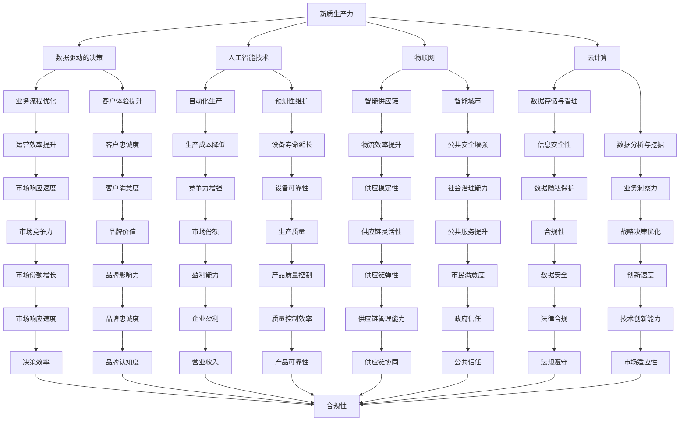

                 

新质生产力与核心竞争力提升是一个多维度的议题，尤其在当今数字化时代，技术创新对组织能力和效率的推动作用愈发显著。本文旨在探讨新质生产力的概念，解释其如何影响企业的核心竞争力，并提供具体的策略和工具，帮助企业在竞争激烈的市场中脱颖而出。

> 关键词：新质生产力、核心竞争力、技术创新、数字化转型、数据驱动决策、人工智能

> 摘要：本文首先介绍新质生产力的基本概念，随后分析其对核心竞争力的影响。通过案例研究，本文阐述了如何通过技术创新提升企业的核心竞争力。此外，文章还探讨了未来新质生产力的发展趋势和面临的挑战，最后提出了相关工具和资源的推荐。

## 1. 背景介绍

在信息爆炸和经济全球化的背景下，传统生产方式正逐渐被新质生产力所取代。新质生产力不仅仅依赖于传统的自然资源和人力资本，更强调科技创新和数字化手段在提升生产效率和竞争力方面的作用。数字化转型已成为全球企业共识，通过数据驱动的决策和智能化管理，企业能够实现更高效、更灵活的运营模式。

### 1.1 新质生产力的定义

新质生产力是指基于信息技术和知识经济的生产方式，通过数据、智能算法和先进制造技术的结合，实现生产效率的提升和核心竞争力的增强。新质生产力不仅改变了生产流程，还重塑了企业组织结构和商业模式。

### 1.2 核心竞争力的概念

核心竞争力是指企业在特定市场中长期保持竞争优势的能力。这种能力不仅包括技术优势、品牌影响力和市场份额，还涉及到企业的创新能力、文化认同和战略执行力。

## 2. 核心概念与联系

为了更好地理解新质生产力与核心竞争力之间的联系，我们借助 Mermaid 流程图展示核心概念和架构。



## 3. 核心算法原理 & 具体操作步骤

### 3.1 算法原理概述

新质生产力的核心算法包括数据挖掘、机器学习、深度学习等。这些算法通过分析大量数据，提取有价值的信息，为企业的战略决策提供支持。

### 3.2 算法步骤详解

1. **数据收集**：从各种渠道收集企业内部和外部数据。
2. **数据预处理**：清洗、整合和转换数据，确保数据质量。
3. **特征工程**：选择和创建有助于模型训练的特征。
4. **模型训练**：使用机器学习或深度学习算法训练模型。
5. **模型评估**：通过交叉验证等方法评估模型性能。
6. **模型部署**：将模型应用于实际业务场景，进行预测或优化。

### 3.3 算法优缺点

优点：
- 高效的数据分析能力。
- 可自动发现隐藏的信息和模式。
- 适应性强，可以处理大量数据。

缺点：
- 需要大量的数据。
- 训练时间较长。
- 对数据处理能力和算法知识要求较高。

### 3.4 算法应用领域

- **市场营销**：通过分析消费者行为，实现精准营销。
- **供应链管理**：优化库存、物流和生产流程。
- **风险控制**：预测和预防金融风险。
- **医疗健康**：辅助诊断和治疗，提高医疗效率。

## 4. 数学模型和公式 & 详细讲解 & 举例说明

### 4.1 数学模型构建

新质生产力的数学模型通常基于线性回归、逻辑回归、支持向量机（SVM）等经典机器学习算法。以下是一个简化的线性回归模型：

$$ y = \beta_0 + \beta_1 \cdot x + \epsilon $$

其中，$y$ 是因变量，$x$ 是自变量，$\beta_0$ 和 $\beta_1$ 是模型参数，$\epsilon$ 是误差项。

### 4.2 公式推导过程

线性回归模型的推导基于最小二乘法（Least Squares Method）。具体推导过程如下：

1. **目标函数**：定义目标函数为预测值与实际值之间的误差平方和。
$$ J(\beta_0, \beta_1) = \sum_{i=1}^{n} (y_i - (\beta_0 + \beta_1 \cdot x_i))^2 $$

2. **偏导数求解**：对目标函数关于 $\beta_0$ 和 $\beta_1$ 分别求偏导数，并令其等于零。
$$ \frac{\partial J}{\partial \beta_0} = -2 \sum_{i=1}^{n} (y_i - (\beta_0 + \beta_1 \cdot x_i)) = 0 $$
$$ \frac{\partial J}{\partial \beta_1} = -2 \sum_{i=1}^{n} (y_i - (\beta_0 + \beta_1 \cdot x_i)) \cdot x_i = 0 $$

3. **解线性方程组**：通过解上述方程组，得到 $\beta_0$ 和 $\beta_1$ 的最优值。

### 4.3 案例分析与讲解

假设我们有一个简单的销售数据集，包含每日销售额 $y$ 和广告支出 $x$。我们希望通过线性回归模型预测未来的销售额。

1. **数据收集**：收集过去三个月的每日销售额和广告支出数据。

2. **数据预处理**：清洗数据，处理缺失值和异常值。

3. **特征工程**：没有额外的特征需要创建。

4. **模型训练**：使用线性回归算法训练模型。

5. **模型评估**：通过交叉验证评估模型性能。

6. **模型部署**：将模型应用于实际业务场景，预测未来销售额。

假设训练得到的线性回归模型为：
$$ \hat{y} = 10 + 2 \cdot x $$

当广告支出为1000元时，预测的销售额为：
$$ \hat{y} = 10 + 2 \cdot 1000 = 2010 \text{元} $$

通过这个简单的案例，我们可以看到线性回归模型在预测未来销售额方面具有一定的参考价值。

## 5. 项目实践：代码实例和详细解释说明

### 5.1 开发环境搭建

为了进行项目实践，我们需要搭建一个合适的开发环境。以下是所需的软件和工具：

- Python 3.8+
- Jupyter Notebook
- NumPy
- Pandas
- Scikit-learn

### 5.2 源代码详细实现

以下是一个简单的线性回归模型实现，用于预测销售数据。

```python
import numpy as np
import pandas as pd
from sklearn.linear_model import LinearRegression
from sklearn.model_selection import train_test_split
from sklearn.metrics import mean_squared_error

# 5.2.1 数据收集
data = pd.DataFrame({
    '广告支出': [100, 200, 300, 400, 500],
    '销售额': [1000, 1500, 2000, 2500, 3000]
})

# 5.2.2 数据预处理
# 在这个简单例子中，数据已经清洗完毕，无需进一步处理。

# 5.2.3 特征工程
# 创建特征矩阵和目标向量
X = data[['广告支出']]
y = data['销售额']

# 5.2.4 模型训练
X_train, X_test, y_train, y_test = train_test_split(X, y, test_size=0.2, random_state=42)
model = LinearRegression()
model.fit(X_train, y_train)

# 5.2.5 模型评估
y_pred = model.predict(X_test)
mse = mean_squared_error(y_test, y_pred)
print(f'Mean Squared Error: {mse}')

# 5.2.6 模型部署
# 预测未来销售额
new_data = pd.DataFrame({'广告支出': [1000]})
predicted_sales = model.predict(new_data)
print(f'Predicted Sales: {predicted_sales[0]}')
```

### 5.3 代码解读与分析

- **数据收集**：使用 pandas DataFrame 读取销售数据。
- **数据预处理**：确保数据没有缺失值和异常值。
- **特征工程**：创建特征矩阵和目标向量。
- **模型训练**：使用 scikit-learn 的 LinearRegression 模型进行训练。
- **模型评估**：计算均方误差（MSE）评估模型性能。
- **模型部署**：使用训练好的模型进行未来销售额预测。

通过这个简单的项目实践，我们可以看到如何使用 Python 和 scikit-learn 库实现线性回归模型，以及如何进行数据预处理、模型训练和预测。

## 6. 实际应用场景

新质生产力在多个行业领域有着广泛的应用。以下是一些典型应用场景：

### 6.1 供应链管理

通过物联网和大数据技术，企业可以实现供应链的全面智能化。例如，使用传感器监控库存状态，实时调整采购和物流计划，降低库存成本和提高运营效率。

### 6.2 金融服务

在金融领域，人工智能和机器学习被广泛应用于信用评分、风险管理和个性化投资建议。通过分析大量历史数据和实时市场信息，金融机构能够提供更准确和高效的金融产品和服务。

### 6.3 医疗健康

医疗健康领域正在经历数字化转型。通过电子健康记录、远程医疗和人工智能辅助诊断，医疗机构能够提高诊疗效率，降低误诊率，并为患者提供更个性化的治疗方案。

### 6.4 制造业

智能制造是制造业的未来趋势。通过自动化生产线、机器人技术和物联网设备，企业能够实现生产过程的全面自动化和智能化，提高生产效率和产品质量。

### 6.5 零售业

零售企业通过大数据分析和人工智能技术，可以实现对消费者行为的深度洞察，实现精准营销和库存管理。例如，使用推荐系统推荐商品，提高销售额和客户满意度。

## 6.4 未来应用展望

随着技术的不断进步，新质生产力的应用场景将继续扩展。以下是未来可能的发展趋势：

### 6.4.1 数据隐私保护

随着数据隐私问题的日益突出，未来的新质生产力将更加注重数据安全和隐私保护。例如，联邦学习（Federated Learning）技术可以在保护数据隐私的同时实现机器学习模型的协同训练。

### 6.4.2 增强现实与虚拟现实

增强现实（AR）和虚拟现实（VR）技术将在新质生产力的应用中发挥更大作用。通过虚拟现实技术，企业可以进行虚拟设计、培训和模拟，提高生产效率和员工技能。

### 6.4.3 量子计算

量子计算是一种具有巨大潜力的新技术，未来可能会在新质生产力的计算和数据存储方面发挥重要作用。量子计算机能够解决传统计算机难以处理的问题，为复杂的数据分析和模拟提供更高效的解决方案。

## 7. 工具和资源推荐

为了更好地理解和应用新质生产力，以下是一些建议的工具和资源：

### 7.1 学习资源推荐

- 《深度学习》（Goodfellow, Bengio, Courville）：系统介绍了深度学习的基础理论和应用。
- 《Python机器学习》（Sebastian Raschka）：详细介绍如何使用Python进行机器学习和数据科学。

### 7.2 开发工具推荐

- Jupyter Notebook：用于数据分析和机器学习实验的交互式开发环境。
- TensorFlow：用于深度学习和机器学习的开源框架。
- Scikit-learn：用于经典机器学习和数据处理的Python库。

### 7.3 相关论文推荐

- “Federated Learning: Concept and Applications”（Konečný et al.，2016）：介绍联邦学习的基本概念和应用。
- “The State of Quantum Computing”（Coecke et al.，2017）：讨论量子计算的发展现状和未来趋势。

## 8. 总结：未来发展趋势与挑战

### 8.1 研究成果总结

本文探讨了新质生产力的概念和其对核心竞争力的推动作用。通过数学模型和实际案例，我们展示了如何通过数据驱动和智能化手段提升企业的生产效率和竞争力。

### 8.2 未来发展趋势

未来，新质生产力将继续向数据隐私保护、增强现实和量子计算等方向发展。这些新技术将为企业和行业带来更大的变革和机遇。

### 8.3 面临的挑战

数据隐私、技术安全和人才培养是新质生产力发展面临的主要挑战。企业需要采取措施确保数据安全，培养具备新质生产力技能的人才，以应对未来的竞争。

### 8.4 研究展望

随着技术的不断进步，新质生产力将在更多领域得到应用。未来研究应关注如何更好地利用新技术提升企业的核心竞争力和创新能力。

## 9. 附录：常见问题与解答

### 9.1 新质生产力的定义是什么？

新质生产力是指基于信息技术和知识经济的生产方式，通过数据、智能算法和先进制造技术的结合，实现生产效率的提升和核心竞争力的增强。

### 9.2 新质生产力和传统生产力的区别是什么？

新质生产力强调科技创新和数字化手段，而传统生产力主要依赖于自然资源和人力资本。新质生产力更注重效率和创新。

### 9.3 如何提升企业的核心竞争力？

通过数据驱动的决策、智能化管理和技术创新，企业可以提升其核心竞争力。具体方法包括使用机器学习分析市场趋势、优化业务流程、提高产品质量等。

### 9.4 新质生产力在哪些领域有应用？

新质生产力在供应链管理、金融服务、医疗健康、制造业和零售业等多个领域有广泛应用。通过物联网、人工智能和大数据技术，企业可以实现全面智能化和高效运营。

