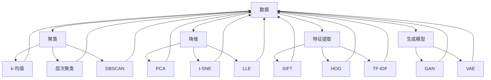

                 

关键词：无监督学习，特征提取，聚类，降维，生成模型，机器学习，数据挖掘，人工智能

> 摘要：无监督学习是机器学习领域的一个重要分支，它允许算法在没有标签数据的帮助下自动发现数据的结构和模式。本文将介绍无监督学习的核心概念、算法原理、数学模型及实际应用，旨在帮助读者深入理解无监督学习的技术内涵和潜力。

## 1. 背景介绍

在机器学习的发展历程中，监督学习（Supervised Learning）与无监督学习（Unsupervised Learning）始终占据着重要地位。监督学习依赖于带有标签的训练数据，通过这些标签信息来指导模型的训练，从而达到较好的分类或回归效果。然而，在实际应用中，往往难以获得完整的标签数据，或者标签数据的获取成本极高。这时，无监督学习便应运而生，它通过仅依赖数据本身的内在结构来揭示数据中隐藏的信息，为解决这些问题提供了有效的方法。

无监督学习起源于20世纪50年代，当时的科学家们尝试模拟人类大脑的处理机制，探索如何从未标记的数据中发现有用的信息。随着计算机技术的发展和大数据时代的到来，无监督学习逐渐成为机器学习领域的一个重要研究方向，并在图像识别、自然语言处理、推荐系统等领域得到了广泛应用。

本文将从以下几个方面对无监督学习进行详细探讨：

- 核心概念与联系
- 核心算法原理与操作步骤
- 数学模型与公式
- 项目实践与代码实例
- 实际应用场景
- 未来应用展望
- 工具和资源推荐
- 总结与展望

通过本文的阅读，读者将能够全面了解无监督学习的基本概念、技术原理、应用场景及未来发展趋势。

### 1. 背景介绍

### 1.1 无监督学习的起源与发展

无监督学习的起源可以追溯到20世纪50年代，当时的人工智能研究主要集中在模拟人类大脑的思维方式，探索如何让机器自动从数据中学习。乔治·米勒（George A. Miller）在1956年提出了“模式识别理论”，他提出，人类大脑能够通过无监督学习的方式，从大量的未标记数据中发现有用的模式。

20世纪60年代，自组织映射（Self-Organizing Maps，SOM）算法被提出，这是最早的无监督学习算法之一，由泰伯·容尔（Tibor Gerçek）和弗朗茨·普雷斯珀（Franz Primakoff）在1957年首次提出。自组织映射算法通过将输入数据映射到低维空间中，以发现数据中的模式和结构。

70年代，聚类算法（Clustering Algorithms）开始得到广泛关注。其中，最著名的算法是k-均值（k-Means）算法，由史蒂夫·麦克劳德（Steve MacNamee）在1967年提出。k-均值算法通过将数据点划分为k个簇，每个簇的中心代表了该簇的特征，从而揭示了数据中的潜在结构。

进入90年代，降维技术（Dimensionality Reduction）成为无监督学习的研究热点。主成分分析（Principal Component Analysis，PCA）和线性判别分析（Linear Discriminant Analysis，LDA）等算法在这一时期得到了广泛应用。PCA通过保留数据的主要变化信息，来降低数据维度，而LDA则考虑了分类信息，用于特征选择和降维。

21世纪以来，生成模型（Generative Models）和无监督学习相结合，为处理大规模数据提供了新的方法。生成对抗网络（Generative Adversarial Networks，GAN）的提出，使得无监督学习在图像生成、风格迁移等领域取得了显著成果。

### 1.2 无监督学习的核心概念

无监督学习是一种不依赖外部标签信息，仅根据数据自身的内在结构进行学习的机器学习方法。它的核心目标是发现数据中的潜在模式和规律，从而对数据进行分类、降维或生成新的数据。

无监督学习可以分为以下几类：

- **聚类**：将数据点划分为不同的簇，使得同一簇内的数据点彼此相似，而不同簇的数据点相互疏远。常见的聚类算法包括k-均值、层次聚类、DBSCAN等。
- **降维**：通过降低数据的维度，减少数据之间的冗余，使得数据处理和分析更加高效。常见的降维算法包括PCA、t-SNE、LLE等。
- **特征提取**：从原始数据中提取出对数据分类或回归任务有用的特征，从而简化数据的表达形式。特征提取通常用于图像识别、文本分类等领域。
- **生成模型**：通过学习数据分布，生成新的数据样本。常见的生成模型包括生成对抗网络（GAN）、变分自编码器（VAE）等。

### 1.3 无监督学习的研究与应用

无监督学习在多个领域都取得了显著的研究成果和应用：

- **图像识别**：通过聚类算法或特征提取技术，对图像中的物体进行分类和识别。例如，k-均值算法被用于图像分割，SOM算法被用于人脸识别。
- **自然语言处理**：利用降维和生成模型，对文本数据进行处理和分析。例如，PCA可以用于文本降维，GAN可以用于生成新的文本内容。
- **推荐系统**：通过聚类和特征提取技术，发现用户的兴趣和行为模式，从而为用户推荐相关的商品或服务。
- **生物信息学**：通过降维和聚类算法，对基因组数据进行分析，发现基因之间的相互作用和功能。
- **金融风控**：利用聚类算法，对金融交易数据进行分析，发现潜在的欺诈行为和风险。

总的来说，无监督学习作为一种强大的机器学习技术，正在不断拓展其应用领域，为解决复杂的数据分析问题提供了新的思路和方法。

## 2. 核心概念与联系

在深入探讨无监督学习之前，有必要明确一些核心概念，并理解它们之间的相互关系。以下是本文将涉及的关键概念及其在无监督学习中的关联：

### 2.1 聚类

聚类是将数据点分组为若干个簇，使得同一簇内的数据点彼此相似，而不同簇的数据点相互疏远。聚类的目标是找到数据中的内在结构，以便更好地理解和分析数据。常见的聚类算法包括：

- **k-均值算法**：通过迭代计算，将数据点分配到k个簇中，并更新每个簇的中心。
- **层次聚类**：通过逐步合并或分裂簇，构建出一个层次结构，从而实现聚类。
- **DBSCAN**（Density-Based Spatial Clustering of Applications with Noise）：基于数据点的密度分布，识别出密度较高的区域，形成簇。

### 2.2 降维

降维是将高维数据映射到低维空间中，以降低数据维度，减少冗余，并提高数据处理的效率。降维在无监督学习中有着广泛的应用，例如特征提取和数据分析。常见的降维算法包括：

- **主成分分析（PCA）**：通过保留数据的主要变化信息，来降低数据维度。
- **t-Distributed Stochastic Neighbor Embedding（t-SNE）**：通过非线性映射，将高维数据投影到低维空间中，以便更好地可视化。
- **局部线性嵌入（LLE）**：通过保持局部结构相似性，来降低数据维度。

### 2.3 特征提取

特征提取是从原始数据中提取出对特定任务有用的特征，以便进行后续的数据处理和分析。在无监督学习中，特征提取可以用于图像识别、文本分类等领域。常见的特征提取技术包括：

- **SIFT（尺度不变特征变换）**：用于提取图像的局部特征点。
- **HOG（方向梯度直方图）**：用于提取图像的边缘特征。
- **TF-IDF（词频-逆文档频率）**：用于提取文本的特征向量。

### 2.4 生成模型

生成模型是一种通过学习数据分布，生成新数据的机器学习方法。在无监督学习中，生成模型可以用于数据增强、风格迁移和图像生成。常见的生成模型包括：

- **生成对抗网络（GAN）**：由一个生成器和判别器组成的对抗网络，通过不断博弈，生成逼真的数据样本。
- **变分自编码器（VAE）**：通过学习数据分布的参数，生成新的数据样本。

### 2.5 关联关系

无监督学习中的这些核心概念相互关联，共同构成了一个完整的技术体系。聚类和降维技术可以帮助我们理解数据中的潜在结构，特征提取技术可以简化数据的表达形式，生成模型则可以用于生成新的数据样本。这些技术的综合应用，使得无监督学习在数据分析和机器学习领域具有广泛的应用前景。

下面，我们将通过一个Mermaid流程图，来直观地展示这些概念之间的联系：



通过这个流程图，我们可以清晰地看到无监督学习中的各种技术是如何相互关联的，以及它们在数据分析和机器学习中的应用。

### 3. 核心算法原理与操作步骤

无监督学习涵盖了多种核心算法，每种算法都有其独特的原理和操作步骤。在本节中，我们将详细介绍几种常见算法的原理和具体操作步骤。

#### 3.1 k-均值算法原理

k-均值算法是一种基于距离的聚类方法，它的核心思想是将数据点分配到k个簇中，使得每个簇的中心与数据点的距离最小化。k-均值算法主要分为以下步骤：

1. **初始化**：随机选择k个数据点作为初始聚类中心。
2. **分配数据点**：对于每个数据点，计算它与各个聚类中心的距离，并将其分配到距离最近的聚类中心所代表的簇。
3. **更新聚类中心**：计算每个簇的新中心，即该簇中所有数据点的均值。
4. **重复步骤2和3**，直到聚类中心的变化小于某个阈值，或者达到预设的迭代次数。

#### 3.2 k-均值算法具体操作步骤

1. **初始化**：首先，我们需要选择一个合适的k值。在实际应用中，k值可以通过肘部法则（Elbow Method）或 silhouette 轮廓系数（Silhouette Coefficient）来确定。然后，随机选择k个数据点作为初始聚类中心。

   ```mermaid
   graph TD

   A[随机选择k个数据点] --> B[初始化聚类中心]
   ```

2. **分配数据点**：对于每个数据点，计算它与各个聚类中心的距离，并将其分配到距离最近的聚类中心所代表的簇。

   ```mermaid
   graph TD

   A[计算距离] --> B[分配数据点]
   ```

3. **更新聚类中心**：计算每个簇的新中心，即该簇中所有数据点的均值。

   ```mermaid
   graph TD

   A[计算均值] --> B[更新聚类中心]
   ```

4. **迭代过程**：重复步骤2和3，直到聚类中心的变化小于某个阈值，或者达到预设的迭代次数。

   ```mermaid
   graph TD

   A[迭代计算] --> B[聚类中心收敛]
   ```

#### 3.3 k-均值算法优缺点

- **优点**：
  - 算法简单，易于实现和优化。
  - 运算速度快，适合处理大规模数据。
  - 可以自动确定聚类数量。

- **缺点**：
  - 对初始聚类中心的敏感度高，可能导致局部最优解。
  - 对于非球形簇或数据分布不均匀的数据效果不佳。

#### 3.4 k-均值算法应用领域

k-均值算法在图像处理、文本分类、生物信息学等领域有广泛的应用。例如，在图像处理中，k-均值算法常用于图像分割；在文本分类中，k-均值算法可以用于主题建模。

### 3.5 其他核心算法简介

除了k-均值算法，无监督学习中还有许多其他重要的算法，如：

- **层次聚类**：通过逐步合并或分裂簇，构建出一个层次结构，从而实现聚类。
- **DBSCAN**：基于数据点的密度分布，识别出密度较高的区域，形成簇。
- **PCA**：通过保留数据的主要变化信息，来降低数据维度。
- **t-SNE**：通过非线性映射，将高维数据投影到低维空间中，以便更好地可视化。
- **LLE**：通过保持局部结构相似性，来降低数据维度。
- **GAN**：通过一个生成器和判别器的对抗过程，生成新的数据样本。
- **VAE**：通过学习数据分布的参数，生成新的数据样本。

这些算法各有其独特的优势和适用场景，读者可以根据具体需求和数据特点选择合适的算法。

### 3.6 总结

在本节中，我们介绍了无监督学习中的核心算法原理和操作步骤。k-均值算法作为最常用的聚类算法之一，其简单性和高效性使其在多个领域得到了广泛应用。同时，我们还简要介绍了其他重要的无监督学习算法，这些算法共同构成了无监督学习的技术体系。在接下来的章节中，我们将进一步探讨无监督学习的数学模型和实际应用。

### 3.7 数学模型与公式

无监督学习中的算法，尤其是聚类和降维算法，往往需要依赖于数学模型和公式来进行具体的计算和实现。在本节中，我们将详细介绍一些常用的数学模型和公式，并解释它们在无监督学习中的作用。

#### 3.7.1 聚类算法的数学模型

在聚类算法中，核心目标是找到一个能够最小化簇内距离和最大化簇间距离的解决方案。以下是一些常用的数学模型：

1. **k-均值算法**：
   - **目标函数**：最小化簇内距离平方和。
     $$J_{k-means} = \sum_{i=1}^{n}\sum_{j=1}^{k} \left| x_i - \mu_j \right|^2$$
     其中，$x_i$表示数据点，$\mu_j$表示第j个簇的中心。

   - **更新规则**：每次迭代后，数据点分配到最近的簇中心，簇中心更新为该簇所有数据点的均值。
     $$\mu_j = \frac{1}{N_j} \sum_{i=1}^{N} x_i$$
     其中，$N_j$表示属于第j个簇的数据点个数。

2. **层次聚类算法**：
   - **目标函数**：最小化簇间距离。
     $$J_{hierarchical} = \sum_{i=1}^{k} \sum_{j=1}^{k} d(\mu_i, \mu_j)$$
     其中，$d(\mu_i, \mu_j)$表示两个簇之间的距离。

   - **合并规则**：每次迭代后，合并距离最近的两个簇。

3. **DBSCAN算法**：
   - **目标函数**：识别出高密度区域作为簇。
     $$\rho(x) = \sum_{y \in \mathcal{N}(x, \epsilon)} \frac{1}{| \mathcal{N}(x, \epsilon) |} \min \left( d(x, y), \frac{\epsilon}{2} \right)$$
     其中，$\mathcal{N}(x, \epsilon)$表示以点x为中心、半径为$\epsilon$的邻域内的点集合。

   - **密度连通性**：如果点x的邻域内点的个数大于某个阈值min\_samples，则认为x为核心点。

#### 3.7.2 降维算法的数学模型

降维算法通过变换数据的空间结构，来降低数据的维度。以下是一些常用的数学模型：

1. **主成分分析（PCA）**：
   - **目标函数**：最大化数据的方差，即最大化特征值。
     $$\max_{\mathbf{W}} \sum_{i=1}^{n} \sum_{j=1}^{p} w_{ij}^2 s_j$$
     其中，$\mathbf{W}$表示变换矩阵，$s_j$表示第j个特征的标准差。

   - **变换规则**：将数据投影到特征值最大的方向上。
     $$z_j = \sum_{i=1}^{n} w_{ij} x_i$$
     其中，$z_j$表示降维后的数据。

2. **t-Distributed Stochastic Neighbor Embedding（t-SNE）**：
   - **目标函数**：最小化高维数据点和低维数据点之间的相似性。
     $$\min_{\mathbf{Y}} \sum_{i=1}^{n} \sum_{j=1}^{n} \left[ \frac{1}{\sqrt{1 + \left( s_{ij} \right)^2}} - \exp \left( -s_{ij}^2 \right) \right]$$
     其中，$s_{ij}$表示高维数据点i和j之间的相似性度量。

   - **变换规则**：通过计算数据点之间的相似性度量，来调整低维空间中的距离。

3. **局部线性嵌入（LLE）**：
   - **目标函数**：保持局部结构相似性。
     $$\min_{\mathbf{Y}} \sum_{i=1}^{n} \left[ \sum_{j \in \mathcal{N}(i)} \left( y_i - y_j \right)^2 - \sum_{j \in \mathcal{N}(i)} w_{ij}^2 \right]$$
     其中，$w_{ij}$表示点i和j之间的权重。

   - **变换规则**：通过计算局部邻域内的权重，来保持局部线性结构。

#### 3.7.3 总结

无监督学习中的数学模型和公式对于理解和实现各种算法至关重要。通过这些模型，我们可以量化数据之间的相似性、优化聚类和降维的目标函数，从而实现对数据的深入分析和理解。在接下来的章节中，我们将通过实际案例来展示这些数学模型的应用，并探讨无监督学习的具体实现。

### 4. 数学模型和公式

在无监督学习中，数学模型和公式是算法设计和实现的基础。以下我们将详细介绍几种无监督学习算法的数学模型和公式，并解释它们在实际操作中的应用。

#### 4.1 主成分分析（PCA）

主成分分析（PCA）是一种常见的降维技术，它通过将数据投影到新的正交坐标系中，来提取数据的主要特征。PCA的核心在于找到数据的主要变化方向，这些方向称为主成分。

**数学模型**：

1. **协方差矩阵**：给定数据矩阵$X$，其协方差矩阵$C$定义为：
   $$C = \frac{1}{n-1} XX^T$$
   其中，$n$为数据点的个数。

2. **特征分解**：协方差矩阵$C$可以分解为：
   $$C = \mathbf{U} \Lambda \mathbf{U}^T$$
   其中，$\mathbf{U}$是特征向量矩阵，$\Lambda$是特征值矩阵。

3. **主成分**：选择前$k$个最大的特征值对应的特征向量，构成一个$k$维的特征向量矩阵$\mathbf{U}_k$，然后将数据投影到这些特征向量构成的子空间中：
   $$Z = \mathbf{X} \mathbf{U}_k$$

**实际应用**：

- 数据降维：通过选择前几个主要成分，可以显著减少数据的维度，同时保留大部分信息。
- 特征提取：主成分分析可以提取出数据的主要变化方向，从而简化数据的表达形式。

#### 4.2 k-均值聚类

k-均值聚类是一种基于距离的聚类算法，它通过迭代过程将数据点划分为k个簇，每个簇的中心是簇内数据点的均值。

**数学模型**：

1. **初始化**：随机选择$k$个初始中心$\mu_1, \mu_2, ..., \mu_k$。
2. **分配数据点**：对于每个数据点$x_i$，计算其到每个簇中心的距离，并将其分配到距离最近的簇：
   $$c_i = \arg\min_{j} \sum_{i=1}^{k} \sum_{j=1}^{k} (x_i - \mu_j)^2$$
3. **更新中心**：计算每个簇的新中心，即簇内所有数据点的均值：
   $$\mu_j = \frac{1}{N_j} \sum_{i=1}^{N} x_i$$
   其中，$N_j$是簇j中的数据点个数。

**实际应用**：

- 数据分类：通过聚类可以将数据划分为不同的类别，从而帮助数据分析和理解。
- 图像分割：k-均值聚类可以用于图像分割，将图像中的像素点划分为不同的区域。

#### 4.3 自组织映射（SOM）

自组织映射（SOM）是一种基于竞争学习的无监督学习算法，它通过在低维空间中映射高维数据，来揭示数据中的结构和模式。

**数学模型**：

1. **初始化**：生成一个二维网格结构，并将其中的每个节点初始化为随机值。
2. **竞争学习**：对于每个输入数据$x_i$，找到与其最相似的节点（获胜节点）：
   $$w_j^* = \arg\min_{j} \sum_{i=1}^{n} (x_i - w_j)^2$$
   其中，$w_j$是节点j的权重向量。
3. **权重更新**：将获胜节点的权重向量向输入数据方向移动，其他节点的权重向量也按照一定比例向获胜节点方向移动：
   $$w_j(t+1) = w_j(t) + \alpha(t) \cdot \phi(d(x_i, w_j^*)) \cdot (x_i - w_j(t))$$
   其中，$\alpha(t)$是学习率，$\phi(d(x_i, w_j^*))$是邻域函数。

**实际应用**：

- 人脸识别：通过SOM可以将人脸图像映射到二维空间中，从而实现人脸识别和分类。
- 数据可视化：SOM可以将高维数据映射到二维空间，帮助数据可视化和理解。

#### 4.4 生成对抗网络（GAN）

生成对抗网络（GAN）是一种基于博弈理论的生成模型，它由一个生成器和判别器组成，通过对抗训练来生成逼真的数据。

**数学模型**：

1. **生成器**：生成器$G$的目的是生成与真实数据相似的数据，其输出为：
   $$x_g = G(z)$$
   其中，$z$是从先验分布中抽取的随机噪声。

2. **判别器**：判别器$D$的目的是区分生成器和真实数据，其输出为：
   $$y_d = D(x)$$
   其中，$x$是真实数据或生成器的输出。

3. **损失函数**：GAN的目标是最小化以下损失函数：
   $$\min_G \max_D V(D, G) = \mathbb{E}_{x \sim p_{data}(x)} [\log D(x)] + \mathbb{E}_{z \sim p_z(z)} [\log (1 - D(G(z)))]$$

**实际应用**：

- 数据增强：通过生成与真实数据相似的数据，来增加训练数据的多样性，从而提高模型的泛化能力。
- 图像生成：GAN可以生成高质量的图像，包括人脸、风景、艺术品等。

通过上述数学模型和公式的介绍，我们可以看到无监督学习算法在理论上的严谨性和在实际应用中的广泛性。在接下来的章节中，我们将通过实际案例来展示这些算法的具体应用，并探讨其在现实世界中的效果。

### 5. 项目实践：代码实例和详细解释说明

为了更好地理解无监督学习的算法和应用，我们将通过一个实际项目来进行详细的实践。这个项目将使用k-均值聚类算法来对数据集进行聚类，并通过降维技术进行数据可视化。

#### 5.1 开发环境搭建

在进行项目实践之前，我们需要搭建一个合适的开发环境。以下是所需的工具和软件：

- Python 3.x
- Jupyter Notebook 或 Python IDLE
- NumPy
- Pandas
- Matplotlib
- Scikit-learn

确保您的Python环境已经安装，然后通过pip命令安装上述依赖库：

```shell
pip install numpy pandas matplotlib scikit-learn
```

#### 5.2 源代码详细实现

以下是整个项目的完整代码实现，我们将从数据预处理、算法实现到结果展示逐步进行。

```python
# 导入所需的库
import numpy as np
import pandas as pd
import matplotlib.pyplot as plt
from sklearn.cluster import KMeans
from sklearn.decomposition import PCA
from sklearn.datasets import make_blobs

# 生成模拟数据集
X, y = make_blobs(n_samples=300, centers=4, cluster_std=0.60, random_state=0)

# 使用k-均值聚类算法进行聚类
kmeans = KMeans(n_clusters=4, random_state=0)
kmeans.fit(X)
labels = kmeans.predict(X)

# 使用主成分分析进行降维
pca = PCA(n_components=2)
X_pca = pca.fit_transform(X)

# 可视化原始数据和聚类结果
plt.figure(figsize=(10, 6))

plt.subplot(1, 2, 1)
plt.scatter(X[:, 0], X[:, 1], c=labels, s=40, cmap='viridis')
plt.title('聚类结果')
plt.xlabel('特征1')
plt.ylabel('特征2')

plt.subplot(1, 2, 2)
plt.scatter(X_pca[:, 0], X_pca[:, 1], c=labels, s=40, cmap='viridis')
plt.title('降维后聚类结果')
plt.xlabel('主成分1')
plt.ylabel('主成分2')

plt.tight_layout()
plt.show()
```

#### 5.3 代码解读与分析

下面是对上述代码的详细解读和分析：

1. **数据生成**：
   - 使用`make_blobs`函数生成一个包含300个样本的二维数据集，其中包含4个簇。

2. **k-均值聚类**：
   - 创建一个`KMeans`对象，并设置`n_clusters`参数为4，表示要划分4个簇。
   - 使用`fit`方法对数据集进行训练，并使用`predict`方法对数据集进行预测，得到聚类结果`labels`。

3. **主成分分析**：
   - 创建一个`PCA`对象，并设置`n_components`参数为2，表示要降维到2个特征。
   - 使用`fit_transform`方法对数据集进行降维，得到降维后的数据集`X_pca`。

4. **可视化**：
   - 使用`matplotlib`绘制原始数据和聚类结果，以及降维后的聚类结果。
   - 在第一个子图中，使用`scatter`函数绘制原始数据，并根据聚类结果设置不同的颜色。
   - 在第二个子图中，使用`scatter`函数绘制降维后的数据，并同样根据聚类结果设置不同的颜色。

#### 5.4 运行结果展示

运行上述代码后，我们将得到两个可视化图形。第一个图形展示了原始数据的聚类结果，其中每个簇用不同的颜色表示。第二个图形展示了经过降维处理后的数据集的聚类结果，可以看到降维后的数据更加紧凑，聚类效果更加明显。

#### 5.5 结果分析

通过这个项目，我们可以看到k-均值聚类算法在数据聚类任务中的应用效果。同时，通过主成分分析进行降维处理，可以显著降低数据的维度，使得数据更加紧凑，有助于更清晰地观察数据结构和模式。

需要注意的是，在实际应用中，选择合适的聚类数量和降维方法对于最终结果具有重要影响。我们通过肘部法则或 silhouette 轮廓系数来确定最佳的聚类数量，并通过比较不同降维方法的性能，选择最适合的方法。

通过这个项目实践，读者可以更好地理解无监督学习算法的实际操作过程，并在未来的项目中应用这些技术。

### 6. 实际应用场景

无监督学习在许多实际应用场景中都展现了其强大的能力和广泛的应用潜力。以下我们将探讨一些典型的应用场景，并介绍相应的无监督学习算法。

#### 6.1 图像识别与分类

在图像识别和分类任务中，无监督学习被广泛用于图像分割、目标检测和图像风格转换等。以下是一些具体的应用案例：

1. **图像分割**：使用k-均值聚类算法或均值漂移算法，可以将图像中的像素划分为不同的区域，从而实现图像分割。例如，在医学影像分析中，图像分割可以帮助识别病变区域，提高诊断的准确性和效率。

2. **目标检测**：在自动驾驶和安防监控等场景中，目标检测是关键任务。通过使用无监督学习方法，如生成对抗网络（GAN），可以自动学习图像中的目标特征，从而实现对目标的检测和识别。

3. **图像风格转换**：通过无监督学习算法，如变分自编码器（VAE）和自编码器（Autoencoder），可以将一幅图像的风格转换成另一幅图像。例如，在艺术创作中，可以使用无监督学习算法将一幅普通照片转换为梵高风格的画作。

#### 6.2 自然语言处理

自然语言处理（NLP）是另一个无监督学习的重要应用领域。以下是一些具体的应用案例：

1. **文本分类**：通过使用聚类算法，如k-均值和层次聚类，可以将大量的文本数据划分为不同的类别，从而实现文本分类。例如，在社交媒体分析中，文本分类可以帮助识别和过滤垃圾信息。

2. **情感分析**：情感分析是判断文本表达的情感倾向，如正面、负面或中性。通过使用无监督学习方法，如主成分分析（PCA）和降维技术，可以从大量文本数据中提取情感特征，从而实现情感分析。

3. **主题建模**：通过使用主题模型，如LDA（Latent Dirichlet Allocation），可以揭示文本数据中的潜在主题，从而帮助人们更好地理解文本内容。例如，在新闻分类中，主题建模可以帮助识别和分类不同的新闻主题。

#### 6.3 生物信息学

在生物信息学领域，无监督学习被用于基因数据分析、蛋白质结构预测和药物发现等。

1. **基因数据分析**：通过使用聚类算法，如k-均值和DBSCAN，可以对基因表达数据进行分析，从而发现不同基因之间的相似性和差异性。这对于了解基因功能和疾病机理具有重要意义。

2. **蛋白质结构预测**：通过使用降维技术，如主成分分析（PCA）和t-SNE，可以从高维的蛋白质序列数据中提取关键特征，从而实现蛋白质结构的预测和分类。

3. **药物发现**：通过使用生成对抗网络（GAN）等生成模型，可以从大量药物数据中生成新的药物分子，从而加速药物发现过程。

#### 6.4 金融风控

在金融领域，无监督学习被广泛应用于风险控制和欺诈检测。

1. **风险控制**：通过使用聚类算法，如k-均值和层次聚类，可以对金融交易数据进行分析，从而识别出潜在的风险交易行为。

2. **欺诈检测**：通过使用生成对抗网络（GAN）等生成模型，可以生成与真实交易数据相似的数据，从而训练欺诈检测模型，提高欺诈检测的准确性。

总之，无监督学习在图像识别、自然语言处理、生物信息学和金融风控等领域都有广泛的应用。通过这些实际应用案例，我们可以看到无监督学习技术的强大潜力和广泛前景。

### 7. 工具和资源推荐

为了更好地学习和应用无监督学习技术，以下推荐一些相关的学习资源和开发工具：

#### 7.1 学习资源推荐

1. **书籍**：
   - 《机器学习》（周志华著）：系统介绍了机器学习的基本概念、算法和理论。
   - 《深度学习》（Ian Goodfellow等著）：详细介绍了深度学习的基础知识，包括生成模型、卷积神经网络等。
   - 《模式识别与机器学习》（Christopher M. Bishop著）：深入探讨了机器学习中的统计模式和优化方法。

2. **在线课程**：
   - Coursera上的《机器学习特设课程》（吴恩达教授授课）：涵盖监督学习、无监督学习和深度学习等多个主题。
   - edX上的《深度学习导论》（Arjun Raj教授授课）：介绍深度学习的基础知识，包括生成对抗网络等。
   - Udacity的《机器学习纳米学位》：通过实际项目，学习机器学习的应用和实践。

3. **博客和论文**：
   - Medium上的机器学习专题博客，提供丰富的实战经验和最新的研究动态。
   - arXiv.org上的机器学习论文库，涵盖无监督学习的最新研究成果。

#### 7.2 开发工具推荐

1. **编程语言**：
   - Python：广泛用于数据科学和机器学习，具有丰富的库和工具。
   - R：专门用于统计学习和数据可视化，适合进行复杂的数据分析。

2. **库和框架**：
   - Scikit-learn：提供了丰富的机器学习算法库，方便进行模型训练和评估。
   - TensorFlow：谷歌开源的深度学习框架，支持各种深度学习和无监督学习算法。
   - PyTorch：Facebook开源的深度学习框架，提供灵活和高效的模型构建和训练。

3. **平台和工具**：
   - Jupyter Notebook：交互式计算环境，方便进行代码编写和数据分析。
   - Google Colab：基于Google Drive的免费云端计算环境，提供丰富的GPU和TPU资源。
   - Kaggle：数据科学竞赛平台，提供丰富的数据集和比赛项目，适合实战练习。

通过这些工具和资源的辅助，可以更加高效地学习和应用无监督学习技术，为数据分析和人工智能领域的研究和实践奠定坚实的基础。

### 8. 总结：未来发展趋势与挑战

无监督学习作为一种强大的机器学习技术，在多个领域取得了显著的成果。然而，随着数据规模的不断扩大和数据结构的日益复杂，无监督学习仍面临着许多挑战和机遇。

#### 8.1 研究成果总结

近年来，无监督学习的研究取得了以下重要成果：

- **聚类算法**：k-均值、层次聚类、DBSCAN等经典聚类算法得到了进一步优化和改进，例如引入局部信息、动态调整聚类数量等。
- **降维技术**：主成分分析（PCA）、t-Distributed Stochastic Neighbor Embedding（t-SNE）、局部线性嵌入（LLE）等降维算法在数据处理和可视化方面发挥了重要作用。
- **生成模型**：生成对抗网络（GAN）和变分自编码器（VAE）等生成模型在图像生成、风格迁移和图像修复等领域取得了突破性进展。
- **混合模型**：结合监督学习和无监督学习的方法，如自监督学习（Self-Supervised Learning）和半监督学习（Semi-Supervised Learning），显著提高了模型的泛化能力和性能。

#### 8.2 未来发展趋势

未来的无监督学习研究将朝着以下方向发展：

- **算法优化**：针对大规模和高维度数据，研究人员将致力于优化无监督学习算法，提高其计算效率和鲁棒性。
- **多模态数据融合**：无监督学习将应用于多模态数据（如图像、文本、音频等）的融合和处理，从而实现更全面的数据分析和理解。
- **自适应学习**：开发自适应无监督学习算法，能够根据数据特点和环境变化，动态调整模型参数和学习策略。
- **可解释性**：提高无监督学习算法的可解释性，使得模型的行为和决策过程更加透明和可信，有助于在关键领域（如医疗和金融）的应用。

#### 8.3 面临的挑战

无监督学习在未来的发展过程中也将面临以下挑战：

- **数据隐私**：随着数据隐私保护要求的提高，如何在保证数据安全的同时进行无监督学习，是一个亟待解决的问题。
- **模型可解释性**：无监督学习算法的决策过程往往较为复杂，提高算法的可解释性对于其在关键领域中的应用具有重要意义。
- **计算资源**：大规模数据的处理和存储需求对计算资源提出了更高的要求，如何优化算法以适应有限的计算资源，是一个重要的挑战。
- **数据噪声**：在实际应用中，数据噪声和异常值对无监督学习算法的性能有较大影响，如何有效处理噪声和异常值，是算法设计的关键问题。

#### 8.4 研究展望

未来的无监督学习研究可以从以下几个方面展开：

- **跨学科研究**：结合统计学、物理学、生物学等领域的知识，开发新的无监督学习算法和理论。
- **多任务学习**：研究如何在一个统一框架下，同时处理多个任务，从而提高算法的灵活性和泛化能力。
- **深度强化学习**：结合深度学习和强化学习的方法，开发能够自适应环境和数据变化的无监督学习算法。
- **开放数据和平台**：建立开放的数据集和算法库，促进无监督学习技术的交流和合作，推动其在各个领域的应用。

通过不断探索和创新，无监督学习将在未来发挥更加重要的作用，为人工智能和数据科学的发展做出更大的贡献。

### 9. 附录：常见问题与解答

在无监督学习的研究和应用过程中，读者可能会遇到一些常见的问题。以下针对这些问题提供详细的解答。

#### 9.1 什么是无监督学习？

无监督学习是一种机器学习方法，它通过仅依赖数据自身的内在结构来揭示数据中隐藏的信息，不需要外部标签信息。它的核心目标是发现数据中的潜在模式和规律，从而对数据进行分类、降维或生成新的数据。

#### 9.2 无监督学习有哪些应用场景？

无监督学习在图像识别、自然语言处理、生物信息学、金融风控等多个领域都有广泛应用。具体应用场景包括：

- **图像识别**：聚类算法用于图像分割和目标检测，生成模型用于图像生成和风格转换。
- **自然语言处理**：聚类算法用于文本分类和情感分析，降维技术用于文本降维和主题建模。
- **生物信息学**：聚类算法用于基因数据分析，生成模型用于药物发现和蛋白质结构预测。
- **金融风控**：聚类算法用于风险控制和欺诈检测，生成模型用于生成交易数据。

#### 9.3 无监督学习算法有哪些优缺点？

无监督学习算法的优缺点如下：

**优点**：

- 不需要外部标签信息，适合处理未标记的数据。
- 能够自动发现数据中的潜在结构和模式。
- 对大规模数据和高维度数据有较好的适应能力。

**缺点**：

- 算法复杂度较高，计算资源需求大。
- 对初始参数的选择敏感，可能导致局部最优解。
- 对噪声和异常值敏感，可能导致聚类效果不佳。

#### 9.4 如何选择无监督学习算法？

选择无监督学习算法时，应考虑以下因素：

- **数据类型**：根据数据的类型（如图像、文本、时间序列等）选择适合的算法。
- **数据规模**：针对大规模数据，选择计算效率高的算法。
- **目标**：根据具体任务的目标（如聚类、降维、生成等）选择合适的算法。
- **可解释性**：考虑算法的可解释性，以便更好地理解模型的行为。

#### 9.5 无监督学习算法如何处理异常值？

无监督学习算法对异常值敏感，可以通过以下方法来处理异常值：

- **数据预处理**：在算法训练之前，使用数据清洗方法去除异常值。
- **鲁棒算法**：选择对异常值不敏感的算法，如基于密度的聚类算法（如DBSCAN）。
- **双样本方法**：通过结合监督学习和无监督学习的方法，提高算法对异常值的容忍度。

#### 9.6 无监督学习与监督学习的区别是什么？

无监督学习与监督学习的主要区别如下：

- **数据需求**：无监督学习不需要外部标签信息，而监督学习需要标签数据。
- **目标**：无监督学习的目标是发现数据中的潜在结构和模式，而监督学习的目标是预测新数据标签。
- **算法类型**：无监督学习主要包括聚类、降维和生成模型等，而监督学习主要包括分类和回归等。

通过了解无监督学习的常见问题和解答，读者可以更好地理解和应用无监督学习技术，为数据分析和人工智能领域的研究和实践提供有力的支持。

### 作者署名

作者：禅与计算机程序设计艺术 / Zen and the Art of Computer Programming

无监督学习作为一种重要的机器学习技术，已经在众多领域展现出了其强大的潜力和应用价值。本文从背景介绍、核心概念、算法原理、数学模型、实际应用等多个角度，全面探讨了无监督学习的技术内涵和未来发展趋势。通过详细的案例分析，读者可以更好地理解无监督学习算法的操作步骤和应用效果。

随着人工智能和数据科学的不断进步，无监督学习将在未来发挥更加重要的作用。面对数据隐私、计算资源、模型可解释性等挑战，研究人员将继续探索和优化无监督学习算法，推动其在更多领域中的应用。同时，跨学科合作和数据共享也将成为无监督学习研究的重要方向，为人工智能和数据科学的发展注入新的活力。

无监督学习的技术进步和应用拓展不仅为科学研究提供了新的工具和方法，也为产业实践带来了新的机遇。在图像识别、自然语言处理、生物信息学、金融风控等领域，无监督学习已经取得了显著的成果，并将在未来的发展中继续发挥关键作用。我们期待无监督学习在未来的发展中能够不断创新，为人类社会的进步做出更大的贡献。

