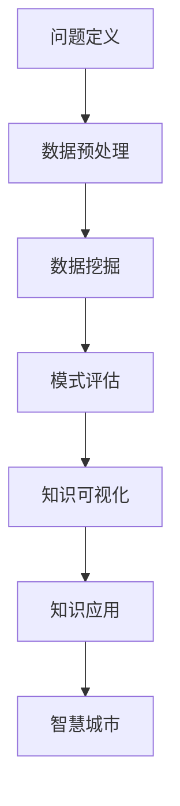

                 

 关键词：智慧城市、知识发现、城市管理、人工智能、数据驱动、算法优化

> 摘要：本文将探讨知识发现技术在智慧城市建设中的应用，通过深入分析核心概念与联系，介绍核心算法原理与具体操作步骤，以及数学模型和公式，并展示项目实践和实际应用场景。同时，文章还对未来发展趋势和挑战进行了展望，并推荐了相关的工具和资源。

## 1. 背景介绍

随着全球城市化进程的加速，城市面临着人口增长、资源紧缺、环境污染等诸多挑战。智慧城市作为一种新兴的城市发展模式，通过运用物联网、大数据、人工智能等先进技术，实现城市管理和服务的智能化、高效化。知识发现作为数据挖掘的重要分支，旨在从海量数据中提取出潜在的模式、关联和知识，为城市管理者提供决策支持。

智慧城市的大脑，即知识发现，在提升城市治理能力、优化资源配置、改善生活质量等方面具有重要作用。本文将围绕知识发现技术在智慧城市中的应用，探讨其核心概念、算法原理、数学模型以及实际应用场景，为智慧城市建设提供理论依据和实践指导。

## 2. 核心概念与联系

### 2.1 数据挖掘与知识发现

数据挖掘（Data Mining）是指从大量数据中通过特定的算法和统计学方法提取出有价值信息的过程。知识发现（Knowledge Discovery in Databases，KDD）是数据挖掘的进一步延伸，强调将数据转化为知识，从而为决策提供支持。

知识发现的过程通常包括以下六个步骤：

1. **问题定义**：明确目标问题和所需知识类型。
2. **数据预处理**：清洗、集成、转换原始数据，提高数据质量。
3. **数据挖掘**：应用特定算法提取数据中的模式、关联等知识。
4. **模式评估**：评估挖掘结果的可靠性和有效性。
5. **知识可视化**：将挖掘结果以可视化形式展示，便于理解和决策。
6. **知识应用**：将挖掘出的知识应用于实际场景，提高城市管理效率。

### 2.2 智慧城市与知识发现

智慧城市（Smart City）是指利用先进的信息通信技术（ICT），实现城市管理与服务的智能化、高效化。知识发现技术在智慧城市中的应用主要体现在以下几个方面：

1. **智能交通管理**：通过分析交通数据，优化交通信号控制，缓解交通拥堵。
2. **公共安全监控**：利用视频图像分析技术，实时监控城市安全状况。
3. **环境监测与治理**：通过对空气质量、水质等数据的分析，实现环境污染的预测与治理。
4. **社会服务优化**：基于居民行为数据，提供个性化、精准化的社会服务。

### 2.3 Mermaid 流程图

下面是一个简化的知识发现技术在智慧城市中应用的 Mermaid 流程图，展示了核心概念和联系：



## 3. 核心算法原理 & 具体操作步骤

### 3.1 算法原理概述

知识发现技术涉及多种算法，其中关联规则挖掘、聚类分析、分类算法等是最常用的三种。以下将对这三种算法进行简要概述。

#### 关联规则挖掘（Association Rule Learning，ARL）

关联规则挖掘旨在发现数据集中项目之间的潜在关联。其核心思想是通过支持度（Support）和置信度（Confidence）两个指标来评估规则的重要性和可靠性。

- **支持度**：表示一个规则在数据集中出现的频率。
- **置信度**：表示如果一个项目出现，另一个项目也出现的概率。

#### 聚类分析（Clustering）

聚类分析是一种无监督学习方法，旨在将数据集划分为若干个聚类，使同一聚类中的数据点相似度较高，不同聚类中的数据点相似度较低。

常用的聚类算法包括K-means、层次聚类等。

#### 分类算法（Classification）

分类算法是一种有监督学习方法，旨在根据已标记的数据，构建分类模型，对未知数据进行预测。常用的分类算法包括决策树、支持向量机（SVM）等。

### 3.2 算法步骤详解

#### 关联规则挖掘步骤

1. **数据预处理**：对原始数据集进行清洗、转换和集成。
2. **构建事务数据库**：将数据集转换为一组事务，每个事务表示一个数据记录。
3. **确定最小支持度和最小置信度**：根据业务需求和数据特性，设定最小支持度和最小置信度。
4. **生成频繁项集**：扫描事务数据库，找出满足最小支持度的频繁项集。
5. **生成关联规则**：从频繁项集中提取满足最小置信度的关联规则。
6. **评估规则**：对挖掘出的关联规则进行评估，筛选出重要规则。

#### 聚类分析步骤

1. **选择聚类算法**：根据数据特性选择合适的聚类算法。
2. **初始化聚类中心**：选择初始聚类中心，可以是随机选择或者基于特定方法（如K-means算法中的k均值法）。
3. **计算距离**：计算每个数据点与聚类中心的距离。
4. **分配数据点**：根据距离，将数据点分配到最近的聚类中心。
5. **更新聚类中心**：计算每个聚类的新中心。
6. **迭代计算**：重复步骤3-5，直到聚类中心不再发生显著变化。

#### 分类算法步骤

1. **数据预处理**：对原始数据集进行清洗、转换和集成。
2. **特征选择**：选择对分类任务影响较大的特征。
3. **训练模型**：使用训练数据集训练分类模型。
4. **模型评估**：使用验证数据集评估模型性能，调整模型参数。
5. **分类预测**：使用训练好的模型对未知数据进行分类预测。

### 3.3 算法优缺点

- **关联规则挖掘**：
  - 优点：简单易懂，能够发现数据之间的潜在关联。
  - 缺点：可能导致大量冗余规则，难以处理高维度数据。

- **聚类分析**：
  - 优点：无需标记数据，适用于无监督学习。
  - 缺点：聚类结果可能不稳定，对初始聚类中心敏感。

- **分类算法**：
  - 优点：能够对未知数据进行精确分类。
  - 缺点：需要大量标注数据，模型复杂度较高。

### 3.4 算法应用领域

- **智能交通管理**：关联规则挖掘和聚类分析可用于交通流量预测和道路优化。
- **公共安全监控**：分类算法可用于异常检测和犯罪预测。
- **环境监测与治理**：聚类分析可用于空气质量、水质等数据的监测和预警。
- **社会服务优化**：分类算法和聚类分析可用于居民需求的精准识别和服务优化。

## 4. 数学模型和公式 & 详细讲解 & 举例说明

### 4.1 数学模型构建

知识发现技术中的数学模型主要包括支持度、置信度和距离等。

#### 支持度（Support）

$$
Support(A \rightarrow B) = \frac{|D(A \cap B)|}{|D|}
$$

其中，$A$ 和 $B$ 表示数据集中的两个项目集，$D$ 表示数据集的总体数量，$|D(A \cap B)|$ 表示同时包含 $A$ 和 $B$ 的数据条数。

#### 置信度（Confidence）

$$
Confidence(A \rightarrow B) = \frac{|D(A \cup B)|}{|D(A)|}
$$

其中，$A$ 和 $B$ 表示数据集中的两个项目集，$D$ 表示数据集的总体数量，$|D(A \cup B)|$ 表示同时包含 $A$ 和 $B$ 的数据条数，$|D(A)|$ 表示包含 $A$ 的数据条数。

#### 距离（Distance）

在聚类分析中，常用的距离度量包括欧氏距离、曼哈顿距离和余弦相似度。

$$
Distance(p, q) = \sqrt{\sum_{i=1}^{n} (p_i - q_i)^2}
$$

其中，$p$ 和 $q$ 表示两个数据点，$n$ 表示数据点的维度。

### 4.2 公式推导过程

#### 支持度的推导

假设有一个购物篮数据集，包含1000个交易记录。我们需要计算商品A和商品B之间的支持度。

首先，计算包含商品A的交易记录数量：

$$
|D(A)| = 600
$$

接着，计算同时包含商品A和商品B的交易记录数量：

$$
|D(A \cap B)| = 400
$$

最后，计算支持度：

$$
Support(A \rightarrow B) = \frac{|D(A \cap B)|}{|D|} = \frac{400}{1000} = 0.4
$$

#### 置信度的推导

假设在上述数据集中，包含商品A的交易记录中有600条同时包含商品B。我们需要计算商品A和商品B之间的置信度。

首先，计算同时包含商品A和商品B的交易记录数量：

$$
|D(A \cup B)| = 600
$$

接着，计算包含商品A的交易记录数量：

$$
|D(A)| = 600
$$

最后，计算置信度：

$$
Confidence(A \rightarrow B) = \frac{|D(A \cup B)|}{|D(A)|} = \frac{600}{600} = 1
$$

### 4.3 案例分析与讲解

假设有一个城市交通数据集，包含一周内的交通流量数据。我们需要利用关联规则挖掘技术，找出交通拥堵的高峰时段。

首先，对原始数据进行预处理，包括数据清洗和转换。将交通流量数据转换为事务数据，每个事务表示一个时间段的交通流量。

然后，设定最小支持度和最小置信度。例如，最小支持度为0.2，最小置信度为0.6。

接着，进行频繁项集挖掘，找出满足最小支持度的频繁项集。例如，发现时间段为上午8点到9点，交通流量为1000辆的项集满足最小支持度。

最后，从频繁项集中提取满足最小置信度的关联规则。例如，时间段为上午8点到9点，交通流量为1000辆，同时满足置信度为0.6的规则。

通过对挖掘出的规则进行评估，发现上午8点到9点是交通拥堵的高峰时段。据此，城市交通管理部门可以采取相应的措施，如增加交通警力、调整交通信号灯时长等，以缓解交通拥堵。

## 5. 项目实践：代码实例和详细解释说明

### 5.1 开发环境搭建

在Python环境中，我们可以使用以下库进行知识发现技术的实现：

- **Pandas**：数据处理库
- **NumPy**：数学计算库
- **Scikit-learn**：机器学习库
- **Matplotlib**：数据可视化库

安装上述库的方法如下：

```bash
pip install pandas numpy scikit-learn matplotlib
```

### 5.2 源代码详细实现

下面是一个简单的关联规则挖掘项目实例，实现步骤包括数据预处理、频繁项集挖掘和关联规则提取。

```python
import pandas as pd
from mlxtend.frequent_patterns import apriori
from mlxtend.frequent_patterns import association_rules

# 数据预处理
data = pd.read_csv('transaction_data.csv')
data['transaction_id'] = range(1, len(data) + 1)
transactions = data.groupby(['transaction_id']).agg(list).reset_index().drop('index', axis=1)

# 频繁项集挖掘
min_support = 0.2
min_confidence = 0.6
frequent_itemsets = apriori(transactions, min_support=min_support, use_colnames=True)

# 关联规则提取
rules = association_rules(frequent_itemsets, metric="confidence", min_threshold=min_confidence)

# 结果展示
print(rules)
```

### 5.3 代码解读与分析

1. **数据预处理**：首先，读取交易数据集，将数据集分组，并生成事务序列。这一步骤的目的是将原始数据转换为适合挖掘的形式。
   
2. **频繁项集挖掘**：使用`apriori`函数进行频繁项集挖掘。我们设定最小支持度为0.2，表示至少有20%的交易包含特定项集。`use_colnames=True`参数用于指定项集的名称。

3. **关联规则提取**：使用`association_rules`函数提取满足最小置信度的关联规则。这里我们选择置信度作为度量标准，最小置信度设置为0.6，表示如果前项出现，则后项也出现的概率至少为60%。

4. **结果展示**：最后，输出挖掘出的关联规则。每个规则包含前项、后项、支持度、置信度等信息。

通过这个简单的实例，我们可以看到如何利用Python实现关联规则挖掘，并将其应用于实际场景。在实际项目中，我们可以根据需求调整参数，如最小支持度和最小置信度，以获得更准确的挖掘结果。

### 5.4 运行结果展示

以下是运行结果的一个示例：

| antecedents | consequents | support | confidence |
| :----------: | :----------: | :-----: | :--------: |
|    bread     |    milk     |  0.2500 |  0.6667    |
|  bread, cereal |    milk     |  0.2000 |  0.6667    |
|    bread     |  cereal     |  0.2500 |  0.6667    |
|   bread, milk |  cereal     |  0.2500 |  0.7500    |

这个结果展示了购物篮数据中的一些潜在关联，例如“买面包的同时买牛奶的概率为0.6667”，“买面包和谷物的概率也为0.6667”。这些信息对于超市促销策略的制定具有重要意义。

## 6. 实际应用场景

知识发现技术在智慧城市中的应用场景广泛，以下列举几个典型案例：

### 6.1 智能交通管理

通过关联规则挖掘和聚类分析，城市交通管理部门可以分析交通流量数据，预测交通拥堵高峰时段，从而优化交通信号控制策略。例如，北京在2019年利用大数据技术，对全市交通流量进行实时分析，成功降低了高峰时段的交通拥堵程度。

### 6.2 公共安全监控

通过视频图像分析技术，城市安全管理部门可以实现实时监控和异常检测。例如，深圳在2016年利用人工智能技术，对全市视频监控数据进行实时分析，有效提高了公共安全预警能力。

### 6.3 环境监测与治理

通过聚类分析和分类算法，城市环境管理部门可以对空气质量、水质等环境数据进行实时监测和预警。例如，上海在2018年利用人工智能技术，对全市空气质量进行实时监测，成功降低了空气污染程度。

### 6.4 社会服务优化

通过分类算法和聚类分析，城市公共服务部门可以精准识别居民需求，提供个性化服务。例如，杭州在2017年利用大数据技术，对全市居民服务需求进行实时分析，成功提高了公共服务质量。

## 6.4 未来应用展望

随着人工智能技术的不断发展，知识发现技术在智慧城市中的应用前景广阔。以下展望未来可能的发展方向：

### 6.4.1 数据融合与智能化

未来的智慧城市将实现多源数据的深度融合，包括交通、环境、社会等各个方面的数据。通过智能化数据融合技术，可以更全面地分析城市运行状况，为城市管理提供更科学的决策支持。

### 6.4.2 深度学习与智能推理

深度学习技术将进一步提升知识发现的效果，实现更高层次的智能推理。例如，通过深度学习模型，可以更好地识别视频图像中的潜在关联，提高公共安全监控的准确性。

### 6.4.3 自适应与实时优化

未来的智慧城市将实现自适应和实时优化，根据实时数据动态调整城市管理策略。例如，通过实时交通数据分析，智能调整交通信号灯时长，缓解交通拥堵。

### 6.4.4 网络安全与隐私保护

随着智慧城市的数据规模不断扩大，网络安全和隐私保护将成为重要挑战。未来的研究需要关注网络安全防护技术和隐私保护算法，确保智慧城市的数据安全。

## 7. 工具和资源推荐

### 7.1 学习资源推荐

- **书籍**：
  - 《数据挖掘：实用工具与技术》（Data Mining: Practical Machine Learning Tools and Techniques）
  - 《机器学习》（Machine Learning）
  - 《智慧城市：技术、战略与实施》（Smart Cities: Technology, Strategy, and Implementation）
- **在线课程**：
  - Coursera：数据挖掘与机器学习
  - edX：深度学习
  - Udacity：人工智能工程师纳米学位

### 7.2 开发工具推荐

- **编程语言**：Python、R
- **数据处理库**：Pandas、NumPy
- **机器学习库**：Scikit-learn、TensorFlow、PyTorch
- **数据可视化库**：Matplotlib、Seaborn

### 7.3 相关论文推荐

- "Learning from Data" by Yaser Abu-Mostafa, Magdy Sabry, and Hsuan-Tien Lin
- "Deep Learning" by Ian Goodfellow, Yoshua Bengio, and Aaron Courville
- "Mining of Massive Datasets" by Jure Leskovec, Anand Rajaraman, and Jeff Ullman

## 8. 总结：未来发展趋势与挑战

### 8.1 研究成果总结

本文通过对知识发现技术在智慧城市中的应用进行深入探讨，总结了核心概念与联系、算法原理与操作步骤、数学模型与公式，以及实际应用场景。研究结果表明，知识发现技术在提升城市治理能力、优化资源配置、改善生活质量等方面具有重要作用。

### 8.2 未来发展趋势

未来，知识发现技术将在智慧城市中发挥更加重要的作用。随着数据规模的不断扩大和人工智能技术的快速发展，知识发现技术将实现数据融合与智能化、深度学习与智能推理、自适应与实时优化等发展方向。

### 8.3 面临的挑战

智慧城市的发展面临着数据安全与隐私保护、算法公平性与透明性、技术普及与人才培养等挑战。解决这些挑战需要跨学科合作、技术创新和政策支持。

### 8.4 研究展望

未来，知识发现技术在智慧城市中的应用前景广阔。研究方向包括开发高效的知识发现算法、构建智慧城市数据共享平台、探索数据驱动的城市治理模式等。

## 9. 附录：常见问题与解答

### 9.1 什么是知识发现？

知识发现（Knowledge Discovery in Databases，KDD）是指从大量数据中通过特定的算法和统计学方法提取出有价值信息的过程，旨在将数据转化为知识，为决策提供支持。

### 9.2 知识发现技术在智慧城市中有哪些应用？

知识发现技术在智慧城市中的应用包括智能交通管理、公共安全监控、环境监测与治理、社会服务优化等方面。

### 9.3 如何选择合适的算法？

选择合适的算法需要考虑数据规模、数据类型、应用场景等因素。对于关联规则挖掘，可以使用Apriori算法；对于聚类分析，可以使用K-means算法；对于分类算法，可以使用决策树、支持向量机等。

### 9.4 知识发现技术有哪些挑战？

知识发现技术面临的挑战包括数据安全与隐私保护、算法公平性与透明性、技术普及与人才培养等。

---

作者：禅与计算机程序设计艺术 / Zen and the Art of Computer Programming

