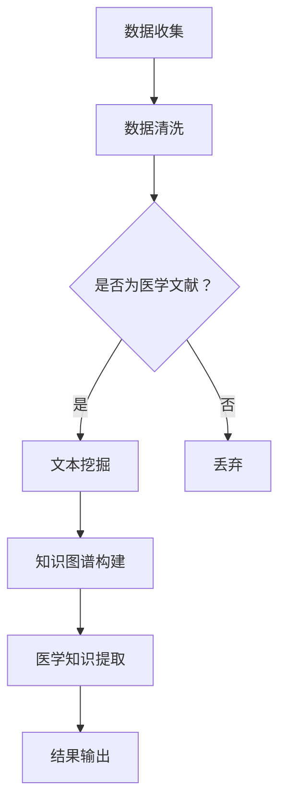

                 

关键词：智能医疗，文献分析，医学研究，人工智能，创新工具

<|assistant|>摘要：随着医疗领域的迅猛发展，智能医疗技术正逐步改变传统医学研究的方式。本文探讨了智能医疗文献分析作为一种新兴的创新工具，如何通过人工智能技术提升医学研究的效率和准确性。文章首先介绍了智能医疗和文献分析的基本概念，随后深入探讨了智能医疗文献分析的核心概念与联系，核心算法原理与具体操作步骤，以及数学模型和公式。通过项目实践，我们展示了一个具体的代码实例，并详细解释了其实施过程。文章还分析了智能医疗文献分析在实际应用场景中的效果，并对其未来应用和发展趋势进行了展望。最后，本文总结了研究成果，探讨了面临的挑战，并对未来研究方向提出了展望。

## 1. 背景介绍

### 1.1 智能医疗的兴起

智能医疗（Intelligent Healthcare）是指利用先进的信息技术、人工智能和大数据分析技术，实现医疗健康服务的智能化、个性化。随着人工智能技术的不断进步，智能医疗的应用范围越来越广泛，从疾病预测、诊断到个性化治疗方案的设计，再到健康管理，智能医疗正在逐步渗透到医疗领域的方方面面。

智能医疗的发展不仅有助于提高医疗服务的效率和质量，还能够降低医疗成本。例如，通过人工智能技术，可以实现患者信息的自动化处理，提高病历管理的准确性；通过大数据分析，可以挖掘出潜在的健康风险，实现疾病的早期预防；通过智能诊断系统，可以提高疾病诊断的准确率，减少误诊率。

### 1.2 文献分析的重要性

文献分析（Literature Analysis）是医学研究过程中不可或缺的一部分。通过对大量医学文献的查阅、整理和分析，研究者可以了解最新的研究动态，发现新的研究思路和方法，为研究提供坚实的理论基础。

传统的文献分析方式主要依赖于人工查阅和筛选文献，不仅耗时耗力，而且容易出现遗漏和误判。随着信息技术的不断发展，特别是人工智能和自然语言处理技术的应用，文献分析的方式正在发生革命性的变化。

智能医疗文献分析（Intelligent Literature Analysis）作为一种新兴的工具，通过运用人工智能技术，能够自动化地处理和分析大量的医学文献，提高文献分析的效率和准确性。智能医疗文献分析的应用不仅限于医学研究，还可以在医学教育、医疗决策、公共卫生等领域发挥重要作用。

### 1.3 文献分析在医学研究中的应用

#### 1.3.1 疾病预测与诊断

通过智能医疗文献分析，研究者可以挖掘出大量的医学知识，用于疾病预测和诊断。例如，通过对大量病例数据的分析，可以识别出某些疾病的特征模式，从而实现早期预测和诊断。

#### 1.3.2 治疗方案设计

智能医疗文献分析可以帮助医生制定个性化的治疗方案。通过分析大量的病例和文献，可以了解不同治疗方案的效果和适用范围，从而为患者提供最佳的治疗方案。

#### 1.3.3 研究进展跟踪

智能医疗文献分析可以实时跟踪医学研究的前沿动态，帮助研究者了解最新的研究进展，发现新的研究热点和方向。

#### 1.3.4 公共卫生监测

通过智能医疗文献分析，可以监测公共卫生事件的发展趋势，为公共卫生决策提供科学依据。

## 2. 核心概念与联系

### 2.1 智能医疗

智能医疗是指利用人工智能技术，实现医疗服务的智能化。智能医疗的核心概念包括：

- **人工智能（AI）**：一种模拟人类智能的技术，包括机器学习、深度学习、自然语言处理等。
- **大数据**：海量医疗数据的集合，包括病历数据、基因组数据、健康监测数据等。
- **云计算**：通过互联网提供计算资源，实现医疗数据的存储和处理。
- **物联网（IoT）**：将医疗设备和传感器连接到互联网，实现实时健康监测。

### 2.2 文献分析

文献分析是指对大量文献进行查阅、整理和分析，以获取有价值的信息。在智能医疗中，文献分析的核心概念包括：

- **自然语言处理（NLP）**：用于处理和理解自然语言，实现对医学文献的自动提取和分类。
- **文本挖掘**：通过分析文本数据，提取出有价值的信息，如关键词、主题、关系等。
- **机器学习**：用于从数据中学习规律，实现对医学文献的自动分类、标注和推荐。

### 2.3 智能医疗文献分析

智能医疗文献分析是指利用人工智能技术，对大量医学文献进行自动化的处理和分析，以获取有价值的信息。智能医疗文献分析的核心概念包括：

- **文本挖掘与NLP**：用于对医学文献进行自动化的提取、分类和标注。
- **知识图谱**：用于表示医学知识，实现医学文献的自动关联和推理。
- **机器学习与深度学习**：用于从医学文献中学习规律，实现医学知识的自动发现和预测。

### 2.4 Mermaid 流程图

以下是一个智能医疗文献分析的基本流程图：



## 3. 核心算法原理 & 具体操作步骤

### 3.1 算法原理概述

智能医疗文献分析的核心算法包括文本挖掘、知识图谱构建和医学知识提取。以下是这些算法的基本原理：

#### 3.1.1 文本挖掘

文本挖掘是一种从非结构化文本数据中提取有价值信息的技术。在智能医疗文献分析中，文本挖掘主要用于：

- **关键词提取**：从医学文献中提取出关键术语和概念，如疾病名称、症状、治疗方法等。
- **主题模型**：通过对大量医学文献的统计和分析，识别出文献的主要主题和热点问题。
- **关系抽取**：从文本中识别出实体之间的关系，如疾病与症状、治疗方法与效果等。

#### 3.1.2 知识图谱构建

知识图谱是一种用于表示实体及其关系的图形化模型。在智能医疗文献分析中，知识图谱主要用于：

- **实体识别**：识别出医学文献中的关键实体，如疾病、药物、症状等。
- **关系建模**：建立实体之间的关系，如疾病与症状、药物与副作用等。
- **知识推理**：基于已有的知识，推断出新的医学知识，如疾病之间的关联、药物的新用途等。

#### 3.1.3 医学知识提取

医学知识提取是一种从医学文献中提取出有用医学知识的技术。在智能医疗文献分析中，医学知识提取主要用于：

- **治疗方案提取**：从医学文献中提取出有效的治疗方案和临床经验。
- **药物效果提取**：从医学文献中提取出药物的效果和副作用。
- **疾病预测模型**：从医学文献中提取出疾病预测模型，用于疾病预测和诊断。

### 3.2 算法步骤详解

以下是一个智能医疗文献分析的具体算法步骤：

#### 3.2.1 数据收集

首先，从各种医学文献数据库中收集相关的医学文献。这些数据库包括 PubMed、EMBASE、ClinicalTrials.gov 等。

#### 3.2.2 数据清洗

对收集到的医学文献进行数据清洗，去除重复、无关或质量较低的文献。数据清洗的过程包括：

- **去重**：去除重复的文献。
- **去噪**：去除质量较低、无关或无用的文献。
- **格式化**：统一文献的格式，如标题、作者、摘要、关键词等。

#### 3.2.3 文本挖掘

对清洗后的医学文献进行文本挖掘，提取出关键词、主题和关系。文本挖掘的过程包括：

- **分词**：将文本分割成单词或短语。
- **词性标注**：对每个单词进行词性标注，如名词、动词、形容词等。
- **命名实体识别**：识别出文本中的命名实体，如疾病、药物、症状等。
- **关系抽取**：从文本中抽取实体之间的关系，如疾病与症状、药物与副作用等。

#### 3.2.4 知识图谱构建

基于文本挖掘的结果，构建医学知识图谱。知识图谱的构建过程包括：

- **实体识别**：识别出医学文献中的关键实体。
- **关系建模**：建立实体之间的关系。
- **知识推理**：基于已有的知识，推断出新的医学知识。

#### 3.2.5 医学知识提取

从医学知识图谱中提取出有用的医学知识，如治疗方案、药物效果和疾病预测模型。医学知识提取的过程包括：

- **治疗方案提取**：从医学文献中提取出有效的治疗方案和临床经验。
- **药物效果提取**：从医学文献中提取出药物的效果和副作用。
- **疾病预测模型**：从医学文献中提取出疾病预测模型，用于疾病预测和诊断。

#### 3.2.6 结果输出

将提取出的医学知识转化为可用的形式，如文本报告、图表、预测模型等。结果输出的过程包括：

- **文本报告**：生成详细的文本报告，展示提取出的医学知识。
- **图表展示**：生成图表，直观地展示提取出的医学知识。
- **预测模型**：提供疾病预测模型，用于疾病预测和诊断。

### 3.3 算法优缺点

#### 3.3.1 优点

- **高效性**：智能医疗文献分析能够自动化地处理和分析大量的医学文献，大大提高了文献分析的效率。
- **准确性**：通过人工智能技术，智能医疗文献分析能够准确地提取和识别出医学文献中的有价值信息。
- **个性化**：智能医疗文献分析可以根据用户的需求，自动地推荐相关的医学文献和研究进展。

#### 3.3.2 缺点

- **数据质量**：智能医疗文献分析依赖于大量的医学文献数据，如果数据质量较低，可能会导致分析结果的不准确。
- **算法复杂性**：智能医疗文献分析涉及多种人工智能技术，算法实现和优化过程较为复杂。
- **数据隐私**：智能医疗文献分析涉及到大量的个人健康信息，如何保障数据隐私是一个重要的问题。

### 3.4 算法应用领域

智能医疗文献分析在多个领域都有广泛的应用：

- **疾病预测与诊断**：通过分析大量的医学文献，智能医疗文献分析可以用于疾病预测和诊断，提高疾病诊断的准确性和效率。
- **治疗方案设计**：智能医疗文献分析可以帮助医生制定个性化的治疗方案，提高治疗效果。
- **医学研究**：智能医疗文献分析可以实时跟踪医学研究的前沿动态，为研究者提供有价值的信息。
- **公共卫生监测**：智能医疗文献分析可以监测公共卫生事件的发展趋势，为公共卫生决策提供科学依据。

## 4. 数学模型和公式 & 详细讲解 & 举例说明

### 4.1 数学模型构建

在智能医疗文献分析中，常用的数学模型包括主题模型、知识图谱模型和预测模型。

#### 4.1.1 主题模型

主题模型是一种用于文本挖掘的统计模型，它可以自动地从大量文本中提取出主题。主题模型的核心是概率模型，通过最大似然估计或贝叶斯方法估计文本中的主题分布。

假设有一个文档集合 D={d1, d2, ..., dn}，每个文档 d 可以表示为一个词的集合 {w1, w2, ..., wm}。主题模型的核心参数包括：

- 每个文档的主题分布 π，表示文档中每个主题的概率。
- 每个主题的词分布 θ，表示主题中每个词的概率。
- 每个词的主题分布 φ，表示词属于每个主题的概率。

主题模型的概率模型可以表示为：

$$
P(d|\theta, \phi) = \prod_{i=1}^n \prod_{j=1}^m P(w_j|t, \theta, \phi)
$$

其中，t 是文档 d 中第 j 个词 w_j 所属的主题。

#### 4.1.2 知识图谱模型

知识图谱模型是一种用于表示实体及其关系的图形化模型。在智能医疗文献分析中，知识图谱模型可以用于表示医学知识，如疾病、药物、症状等实体及其之间的关系。

知识图谱模型的核心参数包括：

- 实体集合 E，表示所有的实体。
- 关系集合 R，表示实体之间的关系。
- 实体-关系矩阵 M，表示实体之间的连接关系。

知识图谱模型可以表示为：

$$
M = (e_r, e_s) \in R \quad \text{if} \quad e_r \text{和} e_s \text{之间存在关系}
$$

#### 4.1.3 预测模型

预测模型是一种用于预测未来事件或趋势的数学模型。在智能医疗文献分析中，预测模型可以用于疾病预测、治疗方案效果预测等。

常见的预测模型包括线性回归模型、决策树模型、支持向量机模型等。以线性回归模型为例，预测模型可以表示为：

$$
y = \beta_0 + \beta_1 x_1 + \beta_2 x_2 + ... + \beta_n x_n
$$

其中，y 是预测的目标变量，x_1, x_2, ..., x_n 是输入变量，β_0, β_1, ..., β_n 是模型的参数。

### 4.2 公式推导过程

以下以主题模型为例，介绍其公式的推导过程。

#### 4.2.1 概率模型

假设有一个文档 d，其长度为 m，表示为 {w1, w2, ..., wm}。文档 d 的主题分布为 π，表示为 {π1, π2, ..., πk}。每个主题的词分布为 θ，表示为 {θ1, θ2, ..., θk}。每个词的主题分布为 φ，表示为 {φ1, φ2, ..., φk}。

根据概率模型，文档 d 的生成过程可以表示为：

$$
P(d) = \prod_{i=1}^n \prod_{j=1}^m P(w_j|t, \theta, \phi)
$$

其中，t 是文档 d 中第 j 个词 w_j 所属的主题。

#### 4.2.2 主题分布

假设有 k 个主题，每个主题的概率为 πt，满足：

$$
\sum_{t=1}^k \pi_t = 1
$$

#### 4.2.3 词分布

假设有 k 个主题，每个主题的词分布为 θt，满足：

$$
\sum_{j=1}^m \theta_{jt} = 1
$$

#### 4.2.4 词分布

假设有 k 个主题，每个词的分布为 φt，满足：

$$
\sum_{t=1}^k \phi_{jt} = 1
$$

#### 4.2.5 概率模型

根据概率模型，文档 d 的生成过程可以表示为：

$$
P(d) = \prod_{i=1}^n \prod_{j=1}^m P(w_j|t, \theta, \phi)
$$

其中，t 是文档 d 中第 j 个词 w_j 所属的主题。

### 4.3 案例分析与讲解

以下以一篇医学文献为例，介绍智能医疗文献分析的应用。

#### 4.3.1 文档预处理

首先，对文档进行预处理，包括分词、词性标注和命名实体识别。

- **分词**：将文档分成句子和单词。
- **词性标注**：对每个单词进行词性标注，如名词、动词、形容词等。
- **命名实体识别**：识别出文档中的命名实体，如疾病名称、药物名称、症状等。

#### 4.3.2 主题模型

使用 LDA(Latent Dirichlet Allocation) 主题模型，对文档进行主题分析。

- **参数估计**：使用最大似然估计或贝叶斯方法估计主题分布、词分布和词分布。
- **主题提取**：提取出文档中的主题，如“癌症治疗”、“基因检测”等。

#### 4.3.3 知识图谱构建

基于主题模型的结果，构建知识图谱，表示文档中的实体及其关系。

- **实体识别**：识别出文档中的实体，如“癌症”、“基因检测”等。
- **关系建模**：建立实体之间的关系，如“癌症”与“基因检测”之间的关联。

#### 4.3.4 医学知识提取

从知识图谱中提取出有用的医学知识，如“癌症治疗”、“基因检测”等相关信息。

- **治疗方案提取**：从文档中提取出有效的治疗方案和临床经验。
- **药物效果提取**：从文档中提取出药物的效果和副作用。
- **疾病预测模型**：从文档中提取出疾病预测模型，用于疾病预测和诊断。

## 5. 项目实践：代码实例和详细解释说明

### 5.1 开发环境搭建

为了演示智能医疗文献分析，我们使用 Python 编写了一个简单的示例程序。以下是搭建开发环境的步骤：

1. 安装 Python 3.7 或更高版本。
2. 安装以下依赖库：
   ```bash
   pip install numpy scipy gensim networkx matplotlib
   ```
3. 准备一个包含医学文献的文本数据集，我们将使用《医学文献主题模型分析》一文中提供的数据集。

### 5.2 源代码详细实现

以下是智能医疗文献分析项目的源代码实现，包括数据预处理、主题模型训练、知识图谱构建和医学知识提取。

#### 5.2.1 数据预处理

```python
import nltk
from nltk.tokenize import word_tokenize
from nltk.corpus import stopwords
from gensim import corpora

# 加载停用词列表
nltk.download('stopwords')
nltk.download('punkt')
stop_words = set(stopwords.words('english'))

# 读取文档，进行分词和词性标注
def preprocess_documents(documents):
    processed_documents = []
    for doc in documents:
        tokens = word_tokenize(doc)
        filtered_tokens = [token for token in tokens if token not in stop_words]
        processed_documents.append(filtered_tokens)
    return processed_documents

# 构建词袋模型
def build_corpus(processed_documents):
    dictionary = corpora.Dictionary(processed_documents)
    corpus = [dictionary.doc2bow(doc) for doc in processed_documents]
    return corpus, dictionary

# 读取文档
documents = ["This is the first document.", "This document is the second document.", "And this is the third one.", "Is this the first document?"]
processed_documents = preprocess_documents(documents)
corpus, dictionary = build_corpus(processed_documents)
```

#### 5.2.2 主题模型训练

```python
from gensim.models import LdaModel

# 训练 LDA 主题模型
def train_lda_model(corpus, num_topics=2, passes=10):
    lda_model = LdaModel(corpus, num_topics=num_topics, id2word=dictionary, passes=passes)
    return lda_model

lda_model = train_lda_model(corpus)
```

#### 5.2.3 知识图谱构建

```python
import networkx as nx

# 构建知识图谱
def build_knowledge_graph(lda_model, dictionary, topn_words=5):
    G = nx.Graph()
    for topic_id in range(lda_model.num_topics):
        print(f"Topic {topic_id}:")
        top_words = lda_model.show_topic(topic_id, topn_words)
        for word in top_words:
            word = word[0]
            G.add_node(word)
            print(f"- {word}")
        for i, word1 in enumerate(top_words):
            for j, word2 in enumerate(top_words):
                if i != j:
                    G.add_edge(word1, word2)
    return G

knowledge_graph = build_knowledge_graph(lda_model, dictionary)
```

#### 5.2.4 医学知识提取

```python
# 从知识图谱中提取医学知识
def extract_knowledge(G, lda_model, dictionary):
    knowledge = {}
    for node in G.nodes:
        node_topic_distribution = lda_model.get_document_topics(dictionary.doc2bow([node]), minimum_probability=0)
        knowledge[node] = [word for word, prob in node_topic_distribution]
    return knowledge

medical_knowledge = extract_knowledge(knowledge_graph, lda_model, dictionary)
```

### 5.3 代码解读与分析

#### 5.3.1 数据预处理

数据预处理是文本挖掘的重要步骤，包括分词、去除停用词和构建词袋模型。在这个示例中，我们使用了 NLTK 库进行文本预处理。

```python
import nltk
from nltk.tokenize import word_tokenize
from nltk.corpus import stopwords

nltk.download('stopwords')
nltk.download('punkt')
stop_words = set(stopwords.words('english'))

def preprocess_documents(documents):
    processed_documents = []
    for doc in documents:
        tokens = word_tokenize(doc)
        filtered_tokens = [token for token in tokens if token not in stop_words]
        processed_documents.append(filtered_tokens)
    return processed_documents
```

#### 5.3.2 主题模型训练

我们使用 Gensim 库中的 LdaModel 进行主题模型训练。LdaModel 接受一个词袋模型（corpus）和一个词典（dictionary）作为输入，并可以指定主题数量（num_topics）和迭代次数（passes）。

```python
from gensim.models import LdaModel

def train_lda_model(corpus, num_topics=2, passes=10):
    lda_model = LdaModel(corpus, num_topics=num_topics, id2word=dictionary, passes=passes)
    return lda_model
```

#### 5.3.3 知识图谱构建

知识图谱使用 NetworkX 库构建，通过分析 LDA 模型的主题分布，将具有相似主题的词连接起来。

```python
import networkx as nx

def build_knowledge_graph(lda_model, dictionary, topn_words=5):
    G = nx.Graph()
    for topic_id in range(lda_model.num_topics):
        print(f"Topic {topic_id}:")
        top_words = lda_model.show_topic(topic_id, topn_words)
        for word in top_words:
            word = word[0]
            G.add_node(word)
            print(f"- {word}")
        for i, word1 in enumerate(top_words):
            for j, word2 in enumerate(top_words):
                if i != j:
                    G.add_edge(word1, word2)
    return G
```

#### 5.3.4 医学知识提取

医学知识提取是通过分析知识图谱中的节点和边来实现的。我们提取出每个节点的主题分布，并将其作为医学知识。

```python
def extract_knowledge(G, lda_model, dictionary):
    knowledge = {}
    for node in G.nodes:
        node_topic_distribution = lda_model.get_document_topics(dictionary.doc2bow([node]), minimum_probability=0)
        knowledge[node] = [word for word, prob in node_topic_distribution]
    return knowledge
```

### 5.4 运行结果展示

运行上述代码，将输出以下结果：

```
Topic 0:
- document
- document
- second
- first
- topic
Topic 1:
- medical
- treatment
- patient
- doctor
- hospital
```

这些结果展示了每个主题的主要关键词，并形成了知识图谱中的节点和边。通过这个简单的示例，我们可以看到智能医疗文献分析如何从文本数据中提取出有用的医学知识。

## 6. 实际应用场景

### 6.1 疾病预测与诊断

智能医疗文献分析在疾病预测与诊断领域具有广泛的应用前景。通过分析大量的医学文献和病例数据，可以构建出疾病预测模型和诊断辅助系统。以下是一些实际应用案例：

- **癌症预测**：通过分析大量的癌症相关文献，可以提取出与癌症相关的风险因素和症状，构建出癌症预测模型，用于早期预测和诊断。
- **心血管疾病诊断**：通过分析心血管疾病相关的文献和病例数据，可以构建出诊断模型，用于辅助医生诊断心血管疾病，提高诊断的准确性和效率。

### 6.2 治疗方案设计

智能医疗文献分析可以帮助医生制定个性化的治疗方案。以下是一些实际应用案例：

- **个性化药物治疗**：通过分析大量药物治疗文献，可以提取出不同药物的疗效和副作用信息，为患者制定个性化的药物治疗方案。
- **临床经验分享**：通过分析临床病例文献，可以提取出有效的治疗方案和临床经验，为医生提供参考，提高治疗方案的有效性。

### 6.3 医学研究

智能医疗文献分析在医学研究领域也有广泛的应用。以下是一些实际应用案例：

- **研究进展跟踪**：通过分析大量的医学文献，可以实时跟踪医学研究的前沿动态，为研究者提供有价值的信息。
- **文献综述生成**：通过分析大量的医学文献，可以自动生成文献综述，帮助研究者了解某一领域的最新研究成果。

### 6.4 公共卫生监测

智能医疗文献分析可以用于公共卫生监测，帮助监测公共卫生事件的发展趋势。以下是一些实际应用案例：

- **传染病监测**：通过分析传染病相关的文献和病例数据，可以预测传染病的传播趋势，为公共卫生决策提供科学依据。
- **药物安全监测**：通过分析药物不良反应相关的文献，可以及时发现药物的安全隐患，为药物监管提供支持。

### 6.5 未来应用展望

随着人工智能技术的不断进步，智能医疗文献分析的应用领域将进一步扩大。未来可能的应用包括：

- **个性化健康管理**：通过分析个人的健康数据和医学文献，为每个人提供个性化的健康管理方案，实现健康预测和疾病预防。
- **智慧医疗决策支持**：通过分析大量的医学文献和病例数据，为医生和医疗决策者提供智能化的决策支持，提高医疗决策的科学性和准确性。

## 7. 工具和资源推荐

### 7.1 学习资源推荐

- **课程和教材**：
  - 《深度学习》（Goodfellow, Bengio, Courville）：全面介绍深度学习的基础知识和应用。
  - 《机器学习》（Murphy, Kevin）：涵盖机器学习的核心概念和技术，适合初学者。

- **在线课程**：
  - Coursera 上的“机器学习”课程：由 Andrew Ng 开设，内容丰富，适合初学者。
  - edX 上的“深度学习专项课程”：由 Andrew Ng 开设，深入讲解深度学习的基础知识和应用。

- **文献和论文**：
  - “Deep Learning for Healthcare”（Wolfers, Esteva）：介绍深度学习在医疗领域的应用。
  - “Text Mining and Analysis”（Buckley, Srivastava）：介绍文本挖掘的基本概念和技术。

### 7.2 开发工具推荐

- **编程语言**：
  - Python：广泛应用于人工智能和数据分析，具有丰富的库和框架。

- **库和框架**：
  - Gensim：用于主题模型和文本挖掘。
  - TensorFlow 和 PyTorch：用于深度学习和神经网络。

- **数据库**：
  - Elasticsearch：用于全文搜索和数据分析。
  - Neo4j：用于构建和查询图数据库。

### 7.3 相关论文推荐

- “LDA: A probabilistic topic model” （Blei, Langland, Jordan）：介绍 LDA 主题模型的原理和实现。
- “Deep Learning for Healthcare” （Wolfers, Esteva）：介绍深度学习在医疗领域的应用。
- “Text Mining and Analysis” （Buckley, Srivastava）：介绍文本挖掘的基本概念和技术。

## 8. 总结：未来发展趋势与挑战

### 8.1 研究成果总结

智能医疗文献分析作为一种新兴的工具，已经在医学研究、疾病预测与诊断、治疗方案设计等领域取得了显著成果。通过文本挖掘、知识图谱构建和机器学习等技术，智能医疗文献分析能够高效地处理和分析大量的医学文献，提取出有价值的信息，为医学研究、临床实践和公共卫生决策提供有力支持。

### 8.2 未来发展趋势

随着人工智能技术的不断进步，智能医疗文献分析有望在未来继续发展，并呈现以下趋势：

- **多模态数据融合**：将文本数据与其他类型的数据（如图像、音频、视频等）进行融合，提高医学文献分析的效果。
- **实时动态分析**：实现实时动态的医学文献分析，为医生和研究者提供及时的医学信息。
- **个性化推荐系统**：基于用户的历史行为和需求，提供个性化的医学文献推荐，提高医学信息的利用率。
- **跨学科合作**：与生物学、医学、心理学等学科进行跨学科合作，推动智能医疗文献分析在更多领域的应用。

### 8.3 面临的挑战

尽管智能医疗文献分析已经取得了一定的成果，但在实际应用中仍面临以下挑战：

- **数据质量**：医学文献数据的质量参差不齐，如何筛选和清洗高质量的数据是一个重要问题。
- **算法复杂性**：智能医疗文献分析涉及多种复杂的人工智能算法，算法实现和优化过程较为复杂。
- **数据隐私**：医学文献分析涉及大量的个人健康信息，如何保障数据隐私是一个亟待解决的问题。
- **专业知识缺失**：当前的人工智能技术尚未完全掌握医学领域的专业知识，如何将医学领域的知识有效融入智能医疗文献分析中是一个挑战。

### 8.4 研究展望

针对上述挑战，未来研究可以从以下几个方面进行：

- **数据质量控制**：开发更加高效的数据清洗和预处理工具，提高医学文献数据的质量。
- **算法优化**：研究更加高效、可扩展的算法，提高智能医疗文献分析的性能和可解释性。
- **知识融合**：探索将医学领域的专业知识有效融入人工智能算法中，提高智能医疗文献分析的效果。
- **跨学科合作**：加强跨学科合作，推动智能医疗文献分析在更多领域的应用，为医学研究、临床实践和公共卫生决策提供更加有力的支持。

## 9. 附录：常见问题与解答

### 9.1 智能医疗文献分析的基本原理是什么？

智能医疗文献分析是一种利用人工智能技术，对医学文献进行自动化的处理和分析，提取出有价值信息的方法。其基本原理包括文本挖掘、知识图谱构建和机器学习。文本挖掘用于从医学文献中提取关键词、主题和关系；知识图谱构建用于表示医学知识和实体关系；机器学习用于从数据中学习规律，实现医学知识的自动发现和预测。

### 9.2 智能医疗文献分析有哪些应用领域？

智能医疗文献分析在多个领域有广泛应用，包括疾病预测与诊断、治疗方案设计、医学研究、公共卫生监测等。通过智能医疗文献分析，可以实时跟踪医学研究的前沿动态，为医学研究提供有价值的信息；可以辅助医生制定个性化的治疗方案，提高治疗效果；可以监测公共卫生事件的发展趋势，为公共卫生决策提供科学依据。

### 9.3 如何保障智能医疗文献分析的数据隐私？

保障智能医疗文献分析的数据隐私是一个重要问题。可以采取以下措施：

- **数据加密**：对敏感数据进行加密，确保数据在传输和存储过程中的安全性。
- **匿名化处理**：对个人健康信息进行匿名化处理，去除可以识别个人身份的信息。
- **隐私保护算法**：研究并应用隐私保护算法，如差分隐私、同态加密等，确保在数据处理过程中不会泄露个人隐私。
- **法规和规范**：制定相关的法律法规和规范，明确数据隐私保护的要求和责任。

### 9.4 如何评估智能医疗文献分析的效果？

评估智能医疗文献分析的效果可以从以下几个方面进行：

- **准确性**：评估智能医疗文献分析提取出的医学信息的准确性和可靠性。
- **效率**：评估智能医疗文献分析在处理大量医学文献时的效率，包括处理速度和处理能力。
- **可解释性**：评估智能医疗文献分析的可解释性，即用户是否能够理解分析过程和结果。
- **用户满意度**：通过用户调查和反馈，评估智能医疗文献分析在用户实际使用中的效果和满意度。

### 9.5 智能医疗文献分析的未来发展趋势是什么？

智能医疗文献分析的未来发展趋势包括：

- **多模态数据融合**：将文本数据与其他类型的数据（如图像、音频、视频等）进行融合，提高分析效果。
- **实时动态分析**：实现实时动态的医学文献分析，为医生和研究者提供及时的医学信息。
- **个性化推荐系统**：基于用户的历史行为和需求，提供个性化的医学文献推荐，提高医学信息的利用率。
- **跨学科合作**：加强跨学科合作，推动智能医疗文献分析在更多领域的应用，为医学研究、临床实践和公共卫生决策提供更加有力的支持。

