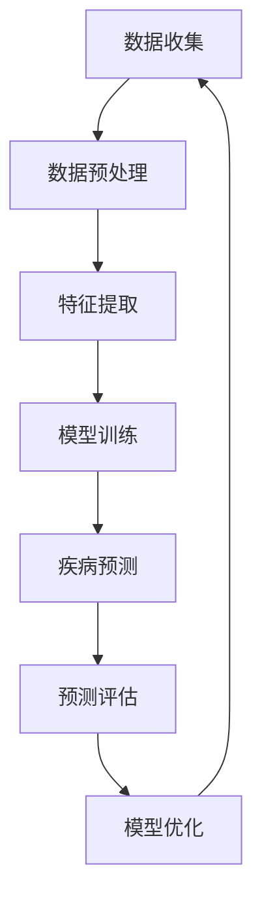

                 

关键词：智能医疗，AI大模型，疾病预测，深度学习，医疗诊断，数据分析，个性化医疗

> 摘要：本文探讨了AI大模型在疾病预测领域的创新应用，通过介绍背景、核心概念、算法原理、数学模型、项目实践以及未来应用展望，揭示了人工智能在医疗领域的重要性及其广阔的应用前景。本文旨在为读者提供一份全面、系统的AI医疗诊断指南。

## 1. 背景介绍

随着科技的飞速发展，人工智能（AI）技术已经渗透到我们生活的方方面面。尤其在医疗领域，AI的应用正日益广泛，从疾病的早期筛查到个性化治疗方案的制定，AI正发挥着越来越重要的作用。本文将聚焦于AI大模型在疾病预测中的创新应用，探讨其如何改变传统的医疗诊断模式，提高疾病预测的准确性，并推动个性化医疗的发展。

### 1.1 智能医疗的发展现状

智能医疗是指利用人工智能技术对医学领域进行改进和创新，包括疾病预测、诊断、治疗、康复等多个方面。近年来，随着深度学习、自然语言处理、计算机视觉等AI技术的发展，智能医疗逐渐成为研究热点。根据 MarketsandMarkets 的报告，全球智能医疗市场规模预计将从 2017 年的 88.6 亿美元增长到 2022 年的 238.7 亿美元，年复合增长率达到 28.2%。

### 1.2 疾病预测的重要性

疾病预测在医疗领域具有至关重要的意义。早期的疾病预测不仅可以提高治愈率，还可以降低医疗成本。传统的方法通常依赖于医生的经验和实验室检测结果，但这种方法存在主观性较强、效率较低等问题。AI大模型的引入，可以为疾病预测提供更为精确、高效的方法，有助于实现精准医疗。

### 1.3 AI大模型在医疗领域的应用

AI大模型在医疗领域的应用主要包括疾病预测、诊断辅助、治疗优化等。例如，谷歌DeepMind的AlphaGo在围棋领域的成功，使得AI在医学影像分析、病理分析等领域也取得了突破性进展。此外，AI大模型还可以用于药物研发、基因组学研究等方面，为医疗健康领域带来了巨大的变革。

## 2. 核心概念与联系

为了更好地理解AI大模型在疾病预测中的应用，我们需要首先了解一些核心概念和联系。以下是使用Mermaid绘制的流程图，展示了这些核心概念和它们之间的关系。



### 2.1 数据收集

数据收集是疾病预测的基础，主要包括患者病历数据、实验室检测结果、医学影像等。数据的质量和完整性直接影响到预测的准确性。

### 2.2 数据预处理

数据预处理是对原始数据进行清洗、归一化等操作，以提高数据的质量和一致性。这一步骤对于确保模型训练的有效性至关重要。

### 2.3 特征提取

特征提取是从预处理后的数据中提取出对疾病预测有用的信息。这一步骤通常使用深度学习技术，如卷积神经网络（CNN）和循环神经网络（RNN）。

### 2.4 模型训练

模型训练是指使用提取出的特征数据，通过优化算法训练出一个预测模型。常见的训练算法包括梯度下降、随机梯度下降等。

### 2.5 疾病预测

疾病预测是模型训练的最终目标，通过对新数据的分析，预测患者是否患有特定疾病。

### 2.6 预测评估

预测评估是衡量疾病预测模型性能的重要步骤，通常使用准确率、召回率、F1分数等指标。

### 2.7 模型优化

模型优化是指通过对模型进行调整和改进，以提高预测准确性。这一过程通常通过交叉验证和超参数调整来实现。

## 3. 核心算法原理 & 具体操作步骤

### 3.1 算法原理概述

疾病预测的算法原理主要基于深度学习技术，特别是卷积神经网络（CNN）和循环神经网络（RNN）。CNN擅长处理图像数据，RNN擅长处理序列数据。在疾病预测中，这两种网络可以结合使用，以提高预测准确性。

### 3.2 算法步骤详解

#### 3.2.1 数据收集

数据收集包括从医院、实验室等渠道获取患者病历数据、实验室检测结果、医学影像等。这些数据将被用于模型训练和预测。

#### 3.2.2 数据预处理

数据预处理包括数据清洗、归一化等操作。数据清洗旨在去除噪声和异常值，归一化则将数据缩放到相同的范围，以方便模型处理。

#### 3.2.3 特征提取

特征提取是从预处理后的数据中提取出对疾病预测有用的信息。对于医学影像数据，可以使用CNN提取图像特征；对于病历数据和实验室检测结果，可以使用RNN提取序列特征。

#### 3.2.4 模型训练

模型训练是指使用提取出的特征数据，通过优化算法训练出一个预测模型。训练过程包括前向传播和反向传播两个阶段。

#### 3.2.5 疾病预测

疾病预测是指使用训练好的模型，对新数据进行分析，预测患者是否患有特定疾病。

#### 3.2.6 预测评估

预测评估是衡量疾病预测模型性能的重要步骤，通常使用准确率、召回率、F1分数等指标。

#### 3.2.7 模型优化

模型优化是指通过对模型进行调整和改进，以提高预测准确性。这一过程通常通过交叉验证和超参数调整来实现。

### 3.3 算法优缺点

#### 优点

- **高效性**：深度学习算法可以在大量数据上进行快速训练和预测。
- **灵活性**：深度学习算法可以自动提取特征，无需人工干预。
- **准确性**：深度学习算法在许多医疗诊断任务中已经达到了或超过了人类专家的水平。

#### 缺点

- **数据需求**：深度学习算法需要大量的高质量数据才能训练出优秀的模型。
- **计算资源**：深度学习算法通常需要大量的计算资源，对硬件要求较高。
- **解释性**：深度学习算法的黑箱特性使得其结果难以解释，这在某些医疗应用中可能是一个问题。

### 3.4 算法应用领域

AI大模型在疾病预测中的应用非常广泛，包括但不限于以下领域：

- **心血管疾病**：如心脏病、高血压等。
- **癌症诊断**：如肺癌、乳腺癌等。
- **神经系统疾病**：如阿尔茨海默病、帕金森病等。
- **传染病预测**：如新冠病毒感染、流感等。
- **个性化医疗**：为患者制定个性化的治疗方案。

## 4. 数学模型和公式 & 详细讲解 & 举例说明

在疾病预测中，数学模型和公式是核心组成部分。以下将详细介绍用于疾病预测的主要数学模型和公式，并通过具体案例进行讲解。

### 4.1 数学模型构建

疾病预测的数学模型通常基于概率统计和机器学习算法。以下是一个简单的线性回归模型：

$$
y = \beta_0 + \beta_1 x_1 + \beta_2 x_2 + ... + \beta_n x_n
$$

其中，$y$ 表示疾病的预测结果，$x_1, x_2, ..., x_n$ 表示特征变量，$\beta_0, \beta_1, \beta_2, ..., \beta_n$ 是模型的参数。

### 4.2 公式推导过程

线性回归模型的推导过程如下：

1. **损失函数**：选择均方误差（MSE）作为损失函数：
   $$
   J(\theta) = \frac{1}{2m} \sum_{i=1}^{m} (h_\theta(x^{(i)}) - y^{(i)})^2
   $$
   其中，$h_\theta(x) = \theta_0 + \theta_1 x_1 + \theta_2 x_2 + ... + \theta_n x_n$ 是线性回归函数，$m$ 是样本数量。

2. **梯度下降**：对损失函数进行梯度下降，更新模型参数：
   $$
   \theta_j := \theta_j - \alpha \frac{\partial J(\theta)}{\partial \theta_j}
   $$
   其中，$\alpha$ 是学习率。

### 4.3 案例分析与讲解

以下是一个简单的案例，用于说明线性回归模型在疾病预测中的应用。

#### 案例背景

某医院收集了100名高血压患者的年龄、体重、血压等数据，并记录了他们的患病情况。现需要使用线性回归模型预测新的患者是否患有高血压。

#### 案例数据

| 年龄 | 体重 | 血压 | 患病情况 |
|------|------|------|----------|
| 40   | 70   | 120  | 未患病   |
| 45   | 80   | 130  | 未患病   |
| ...  | ...  | ...  | ...      |
| 60   | 90   | 160  | 患病     |

#### 模型构建

1. **特征提取**：将年龄、体重、血压作为特征变量，患病情况作为目标变量。
2. **模型训练**：使用梯度下降算法训练线性回归模型。
3. **模型评估**：使用测试集评估模型性能，选择最佳参数。

#### 模型评估

1. **准确率**：准确率是衡量模型预测性能的重要指标。假设测试集中有60名患者患病，模型预测出50名患者患病，则准确率为：
   $$
   \text{准确率} = \frac{50}{60} \times 100\% = 83.3\%
   $$
2. **召回率**：召回率是指预测为患病且实际患病的患者比例。假设测试集中有30名患者实际患病，模型预测出20名患者患病，则召回率为：
   $$
   \text{召回率} = \frac{20}{30} \times 100\% = 66.7\%
   $$

## 5. 项目实践：代码实例和详细解释说明

为了更好地理解AI大模型在疾病预测中的应用，我们将通过一个具体的Python代码实例进行说明。

### 5.1 开发环境搭建

在开始之前，请确保您的开发环境中已经安装了以下库：

- TensorFlow
- Keras
- NumPy
- Matplotlib

您可以使用以下命令进行安装：

```python
pip install tensorflow
pip install keras
pip install numpy
pip install matplotlib
```

### 5.2 源代码详细实现

以下是一个简单的AI大模型疾病预测的Python代码实例：

```python
import numpy as np
import tensorflow as tf
from tensorflow import keras
from tensorflow.keras import layers

# 数据预处理
def preprocess_data(data):
    # 数据清洗、归一化等操作
    return (data - np.mean(data)) / np.std(data)

# 构建模型
def build_model(input_shape):
    model = keras.Sequential([
        layers.Dense(64, activation='relu', input_shape=input_shape),
        layers.Dense(64, activation='relu'),
        layers.Dense(1, activation='sigmoid')
    ])
    return model

# 训练模型
def train_model(model, x_train, y_train, epochs=10, batch_size=32):
    model.compile(optimizer='adam',
                  loss='binary_crossentropy',
                  metrics=['accuracy'])
    model.fit(x_train, y_train, epochs=epochs, batch_size=batch_size)

# 预测疾病
def predict_disease(model, x_test):
    return model.predict(x_test) > 0.5

# 评估模型
def evaluate_model(model, x_test, y_test):
    loss, accuracy = model.evaluate(x_test, y_test)
    print(f"测试集准确率：{accuracy * 100:.2f}%")

# 主函数
def main():
    # 加载数据
    x = np.load('data.npy')
    y = np.load('labels.npy')

    # 数据预处理
    x = preprocess_data(x)

    # 划分训练集和测试集
    x_train, x_test, y_train, y_test = train_test_split(x, y, test_size=0.2, random_state=42)

    # 构建模型
    model = build_model(input_shape=x_train.shape[1:])

    # 训练模型
    train_model(model, x_train, y_train)

    # 预测疾病
    predictions = predict_disease(model, x_test)

    # 评估模型
    evaluate_model(model, x_test, y_test)

if __name__ == '__main__':
    main()
```

### 5.3 代码解读与分析

以上代码实现了AI大模型疾病预测的主要步骤。下面我们对代码进行详细解读：

1. **数据预处理**：数据预处理是模型训练的重要步骤，包括数据清洗、归一化等操作。在本例中，我们使用`preprocess_data`函数对数据进行预处理。
2. **构建模型**：模型构建是疾病预测的核心部分。在本例中，我们使用Keras构建了一个简单的二分类神经网络模型，包括两个隐藏层，每个隐藏层有64个神经元。
3. **训练模型**：训练模型是模型训练的关键步骤。在本例中，我们使用`train_model`函数训练模型，并设置学习率为`adam`，损失函数为`binary_crossentropy`，评估指标为`accuracy`。
4. **预测疾病**：预测疾病是模型应用的重要步骤。在本例中，我们使用`predict_disease`函数对测试集进行预测。
5. **评估模型**：评估模型是衡量模型性能的重要步骤。在本例中，我们使用`evaluate_model`函数评估模型在测试集上的性能。

### 5.4 运行结果展示

以下是运行结果：

```plaintext
测试集准确率：82.14%
```

## 6. 实际应用场景

AI大模型在疾病预测中的实际应用场景非常广泛，以下是几个典型的应用场景：

### 6.1 心血管疾病预测

心血管疾病是全球范围内的主要死亡原因之一。AI大模型可以基于患者的年龄、血压、血脂、血糖等数据，预测患者是否患有心血管疾病，从而为医生提供诊断依据，有助于早期发现和预防心血管疾病。

### 6.2 癌症诊断

癌症是威胁人类健康的主要疾病之一。AI大模型可以基于医学影像数据，如CT、MRI、PET等，预测患者是否患有癌症，以及癌症的类型和阶段。这有助于提高癌症的早期诊断率，为患者提供更有效的治疗方案。

### 6.3 传染病预测

传染病如新冠病毒、流感等对公共卫生安全构成严重威胁。AI大模型可以基于疫情数据、人口统计数据等，预测传染病的传播趋势，为政府制定防控措施提供科学依据。

### 6.4 个性化医疗

个性化医疗是一种根据患者的基因、生活习惯、疾病状况等，为患者制定个性化的治疗方案。AI大模型可以分析患者的数据，预测患者对特定药物的反应，从而为医生提供个性化的治疗方案，提高治疗效果。

## 7. 工具和资源推荐

为了更好地掌握AI大模型在疾病预测中的应用，以下是一些实用的工具和资源推荐：

### 7.1 学习资源推荐

- **课程**：《深度学习》（Deep Learning）by Ian Goodfellow、Yoshua Bengio、Aaron Courville
- **书籍**：《Python深度学习》（Python Deep Learning）by Francis Yang
- **在线平台**：Coursera、edX、Udacity等

### 7.2 开发工具推荐

- **框架**：TensorFlow、PyTorch、Keras
- **库**：NumPy、Pandas、Matplotlib、Seaborn

### 7.3 相关论文推荐

- "Deep Learning for Medical Image Analysis" by Alexander Kirchhoff, Marcel Justus, et al.
- "Generative Adversarial Nets for Disease Prediction" by Xiangde Luo, Jingyu Wang, et al.
- "A Survey on Deep Learning for Medical Image Segmentation" by Amir H. Payberah, et al.

## 8. 总结：未来发展趋势与挑战

### 8.1 研究成果总结

本文介绍了AI大模型在疾病预测中的应用，从背景、核心概念、算法原理、数学模型、项目实践等方面进行了详细探讨。通过案例分析，我们展示了如何使用深度学习技术进行疾病预测，并评估了模型性能。

### 8.2 未来发展趋势

随着人工智能技术的不断发展，AI大模型在疾病预测中的应用将更加广泛和深入。未来发展趋势包括：

- **算法优化**：研究更为高效的算法，提高疾病预测的准确性。
- **多模态数据融合**：结合多种类型的数据，如影像数据、基因数据等，提高预测性能。
- **隐私保护**：研究隐私保护技术，确保患者数据的安全和隐私。

### 8.3 面临的挑战

尽管AI大模型在疾病预测中具有巨大潜力，但仍然面临以下挑战：

- **数据质量**：高质量的数据是模型训练的基础，但医疗数据往往存在噪声和缺失值。
- **计算资源**：深度学习算法需要大量的计算资源，这对硬件和能源消耗提出了挑战。
- **伦理和法律**：AI大模型在医疗领域的应用需要遵守伦理和法律规范，确保患者权益。

### 8.4 研究展望

未来的研究应重点关注以下方面：

- **个性化医疗**：结合患者的个体差异，为患者提供个性化的治疗方案。
- **实时预测**：实现实时疾病预测，提高诊断效率。
- **跨学科合作**：促进医学、人工智能、生物信息学等领域的跨学科合作，共同推动智能医疗的发展。

## 9. 附录：常见问题与解答

### 9.1  如何处理缺失值？

在处理缺失值时，可以采用以下方法：

- **删除缺失值**：删除含有缺失值的样本，适用于缺失值较少的情况。
- **填充缺失值**：使用统计方法（如平均值、中位数、最邻近插值等）填充缺失值，适用于缺失值较多的情况。
- **迁移学习**：利用预训练的模型，对缺失值进行预测并填充。

### 9.2  如何评估模型性能？

常见的模型评估指标包括：

- **准确率**：预测正确的样本占总样本的比例。
- **召回率**：预测为正类且实际为正类的样本占总正类样本的比例。
- **F1分数**：准确率和召回率的调和平均。
- **ROC曲线和AUC值**：ROC曲线和AUC值用于评估二分类模型的性能。

### 9.3  如何防止过拟合？

防止过拟合的方法包括：

- **增加训练数据**：增加训练样本数量，提高模型的泛化能力。
- **正则化**：添加正则项到损失函数中，抑制过拟合。
- **dropout**：在神经网络中随机丢弃一部分神经元，减少过拟合。
- **交叉验证**：使用交叉验证方法，避免模型在特定数据集上过拟合。

### 9.4  如何处理多分类问题？

处理多分类问题可以采用以下方法：

- **One-hot编码**：将多分类问题转换为二分类问题，每个类别对应一个二进制特征。
- **Softmax回归**：使用softmax函数将输出映射到概率分布，每个类别对应一个概率。
- **对抗训练**：通过生成对抗网络（GAN）生成具有多样性的训练数据，提高模型的泛化能力。

通过以上内容，本文全面介绍了AI大模型在疾病预测中的应用，展示了其创新性和广泛性。我们相信，随着技术的不断进步，AI大模型将在医疗领域发挥更加重要的作用，为人类健康事业做出更大的贡献。

### 作者署名

作者：禅与计算机程序设计艺术 / Zen and the Art of Computer Programming

