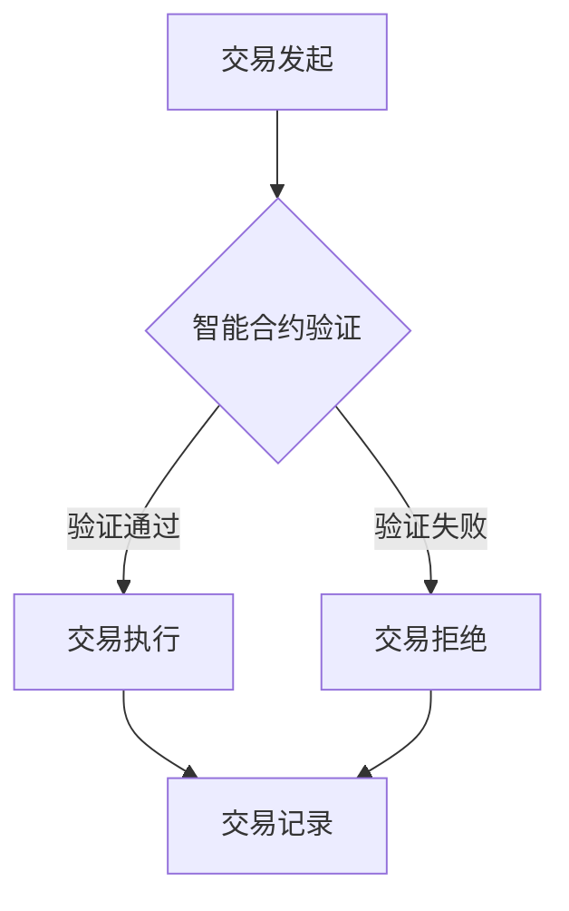

                 

智能合约作为一种创新的区块链技术，正日益成为金融科技领域的一大热点。智能合约的核心理念是利用区块链的不可篡改性和自动化执行特性，将合同条款编码为计算机程序，实现去中心化、自动化的执行和执行结果的验证。随着区块链技术的不断成熟和应用场景的拓展，智能合约的创业领域正呈现出前所未有的机遇。

本文旨在探讨智能合约在自动化交易中的应用及其未来发展。我们将从背景介绍、核心概念与联系、核心算法原理与具体操作步骤、数学模型和公式、项目实践、实际应用场景、未来应用展望以及工具和资源推荐等方面展开详细讨论。最后，我们将对智能合约的发展趋势与挑战进行总结，并提出未来的研究方向。

## 1. 背景介绍

### 区块链与智能合约

区块链技术是一种分布式账本技术，通过去中心化的方式记录和验证交易数据。区块链具有不可篡改、透明和去中心化的特点，这些特性使其成为金融、供应链、医疗等多个行业的重要应用场景。智能合约是区块链技术的重要应用之一，它是由计算机程序编写的合约，能在满足特定条件时自动执行。

智能合约的出现解决了传统合约执行中的信任问题。在传统金融体系中，合同的执行依赖于第三方的信任和监管，而智能合约通过将合同条款编码为计算机程序，使得合约的执行过程完全自动化，减少了人为干预和操作风险。此外，智能合约还可以通过区块链上的去中心化网络进行验证和执行，确保了交易的透明性和不可篡改性。

### 自动化交易

自动化交易是指利用计算机程序自动执行交易决策，以实现高频、大规模的金融市场交易。随着金融科技的发展，自动化交易已经成为金融市场中不可或缺的一部分。智能合约与自动化交易的结合，为金融市场带来了全新的变革。

智能合约在自动化交易中的应用，主要体现在以下几个方面：

1. **交易执行自动化**：智能合约可以自动执行交易指令，减少了人为干预和错误，提高了交易效率。

2. **风险控制自动化**：智能合约能够根据预设的条件自动执行风险控制策略，确保交易在安全的范围内进行。

3. **合规性自动化**：智能合约可以自动检查交易是否符合法规要求，确保交易的合法性。

4. **透明性和可追溯性**：智能合约的执行过程被记录在区块链上，保证了交易的透明性和可追溯性。

## 2. 核心概念与联系

### 智能合约

智能合约是由计算机程序编写的合约，它能够自动执行、管理和执行合同条款。智能合约的关键特性包括：

- **代码即法律**：智能合约的执行基于代码，确保了合约条款的准确性和执行力。
- **不可篡改性**：智能合约一旦被写入区块链，就不可篡改，保证了合约条款的永久性和可靠性。
- **去中心化执行**：智能合约通过区块链网络进行验证和执行，无需依赖中心化的第三方机构。

### 自动化交易

自动化交易是指利用计算机程序自动执行交易决策的过程。自动化交易的关键特性包括：

- **高频交易**：自动化交易系统能够在短时间内完成大量交易，提高了交易效率。
- **风险控制**：自动化交易系统能够根据预设的条件自动执行风险控制策略，确保交易的安全。
- **交易透明性**：自动化交易的执行过程被记录在区块链上，保证了交易的透明性。

### 智能合约与自动化交易的关系

智能合约与自动化交易之间存在着紧密的联系。智能合约为自动化交易提供了执行的基础，使得交易决策能够自动执行。同时，自动化交易的应用场景也为智能合约提供了广泛的应用空间。

智能合约在自动化交易中的应用，主要体现在以下几个方面：

- **交易执行自动化**：智能合约可以自动执行交易指令，减少了人为干预和错误。
- **风险控制自动化**：智能合约能够根据预设的条件自动执行风险控制策略，确保交易在安全的范围内进行。
- **合规性自动化**：智能合约可以自动检查交易是否符合法规要求，确保交易的合法性。
- **透明性和可追溯性**：智能合约的执行过程被记录在区块链上，保证了交易的透明性和可追溯性。

### Mermaid 流程图

为了更好地展示智能合约在自动化交易中的应用，我们可以使用 Mermaid 流程图来描述其工作流程。



在这个流程图中，交易发起后，智能合约首先进行验证。如果验证通过，交易将被执行并记录在区块链上。如果验证失败，交易将被拒绝，并记录在区块链上。通过这个流程图，我们可以清晰地看到智能合约在自动化交易中的作用和重要性。

## 3. 核心算法原理 & 具体操作步骤

### 3.1 算法原理概述

智能合约的核心算法原理基于区块链技术和密码学。区块链技术提供了去中心化、不可篡改和可追溯的账本，而密码学则确保了数据的安全性和隐私性。

智能合约的执行过程可以分为以下几个步骤：

1. **合约编写**：开发者使用智能合约开发语言（如 Solidity）编写智能合约代码。
2. **合约部署**：将智能合约代码上传到区块链网络，进行部署和编译。
3. **交易发起**：交易发起方调用智能合约，发送交易请求。
4. **合约验证**：智能合约在区块链上进行验证，确保交易符合合约条款。
5. **交易执行**：如果验证通过，智能合约自动执行交易指令。
6. **交易记录**：交易结果被记录在区块链上，确保透明性和不可篡改性。

### 3.2 算法步骤详解

1. **合约编写**：
   开发者使用智能合约开发语言（如 Solidity）编写智能合约代码。智能合约代码通常包括以下部分：

   - **合约函数**：定义了智能合约可以执行的操作。
   - **事件**：记录智能合约执行过程中的关键事件。
   - **数据存储**：存储智能合约执行过程中的数据。

2. **合约部署**：
   将智能合约代码上传到区块链网络，进行部署和编译。部署过程中，智能合约会生成一个地址，用于接收交易请求。

3. **交易发起**：
   交易发起方使用加密货币（如以太币）调用智能合约，发送交易请求。交易请求包括调用智能合约函数、输入参数和交易金额。

4. **合约验证**：
   智能合约在区块链上进行验证，确保交易符合合约条款。验证过程包括检查交易金额、输入参数和合约函数权限等。

5. **交易执行**：
   如果验证通过，智能合约自动执行交易指令。执行过程中，智能合约会调用合约函数，处理输入参数，并返回执行结果。

6. **交易记录**：
   交易结果被记录在区块链上，确保透明性和不可篡改性。区块链上的交易记录可以被任何人查询和验证。

### 3.3 算法优缺点

**优点**：

- **去中心化**：智能合约在去中心化的区块链上进行验证和执行，无需依赖中心化的第三方机构。
- **不可篡改性**：智能合约一旦被写入区块链，就不可篡改，保证了合约条款的永久性和可靠性。
- **透明性和可追溯性**：智能合约的执行过程被记录在区块链上，保证了交易的透明性和可追溯性。
- **自动化执行**：智能合约能够自动执行交易指令，减少了人为干预和错误。

**缺点**：

- **代码安全性**：智能合约的安全性取决于代码的质量，一旦出现漏洞，可能导致合约执行失败或资产损失。
- **执行速度**：智能合约的执行速度取决于区块链网络的负载，可能影响交易效率。
- **适用范围**：智能合约主要适用于数字资产交易和去中心化金融（DeFi）领域，对传统金融体系的影响有限。

### 3.4 算法应用领域

智能合约在自动化交易中的应用非常广泛，主要包括以下几个方面：

- **数字资产交易**：智能合约可以自动执行数字资产交易，实现去中心化的交易市场。
- **去中心化金融（DeFi）**：智能合约在去中心化金融中发挥了关键作用，如去中心化交易所、去中心化借贷平台等。
- **供应链金融**：智能合约可以确保供应链金融中的交易流程和资金流动透明、高效和不可篡改。
- **保险领域**：智能合约可以自动处理保险理赔流程，提高保险业务的效率和透明性。
- **房地产交易**：智能合约可以简化房地产交易流程，确保交易过程的透明和安全。

## 4. 数学模型和公式 & 详细讲解 & 举例说明

### 4.1 数学模型构建

智能合约的数学模型主要涉及密码学、概率论和图论等领域。以下是一个简化的数学模型构建过程：

1. **密码学模型**：
   - **加密算法**：选择合适的加密算法，如椭圆曲线密码算法（ECC）或公钥加密算法（RSA）。
   - **签名算法**：选择合适的签名算法，如RSA签名或ECC签名。
   - **密钥生成**：生成公钥和私钥对，确保密钥的安全性和唯一性。

2. **概率论模型**：
   - **概率分布**：定义交易概率分布模型，如泊松分布、正态分布等。
   - **随机数生成**：利用随机数生成算法，为交易决策提供随机性。

3. **图论模型**：
   - **网络拓扑**：构建区块链网络拓扑图，包括节点、链和区块等。
   - **路径选择**：选择合适的路径，优化交易执行速度和安全性。

### 4.2 公式推导过程

1. **加密算法公式**：

   - **加密公式**：\(C = E_K(M)\)，其中 \(C\) 是加密后的消息，\(K\) 是加密密钥，\(M\) 是原始消息。
   - **解密公式**：\(M = D_K(C)\)，其中 \(M\) 是解密后的消息，\(K\) 是解密密钥，\(C\) 是加密后的消息。

2. **签名算法公式**：

   - **签名公式**：\(S = SIG_K(M)\)，其中 \(S\) 是签名结果，\(K\) 是签名密钥，\(M\) 是原始消息。
   - **验证公式**：\(V = VER_K(M, S)\)，其中 \(V\) 是验证结果，\(K\) 是验证密钥，\(M\) 是原始消息，\(S\) 是签名结果。

3. **概率分布公式**：

   - **泊松分布公式**：\(P(X = k) = \frac{(\lambda t)^k e^{-\lambda t}}{k!}\)，其中 \(P(X = k)\) 是在时间 \(t\) 内发生 \(k\) 次事件的概率，\(\lambda\) 是事件发生速率。
   - **正态分布公式**：\(P(X \leq x) = \Phi\left(\frac{x - \mu}{\sigma}\right)\)，其中 \(P(X \leq x)\) 是随机变量 \(X\) 小于或等于 \(x\) 的概率，\(\mu\) 是均值，\(\sigma\) 是标准差。

4. **图论模型公式**：

   - **路径长度公式**：\(L = \sum_{i=1}^{n} d(i, j)\)，其中 \(L\) 是路径长度，\(d(i, j)\) 是从节点 \(i\) 到节点 \(j\) 的距离。
   - **最短路径公式**：\(P_{min} = \min(L)\)，其中 \(P_{min}\) 是最短路径长度。

### 4.3 案例分析与讲解

以下是一个简单的智能合约数学模型案例，用于数字资产交易：

**案例背景**：假设一个数字资产交易平台，用户 A 想要将 100 个以太币（ETH）卖给用户 B。智能合约负责确保交易过程的安全和自动化执行。

**数学模型**：

1. **加密算法**：
   - 用户 A 使用椭圆曲线密码算法（ECC）生成公钥和私钥对。
   - 用户 B 使用 RSA 签名算法生成签名。

2. **概率分布**：
   - 交易发生的概率分布模型为泊松分布，事件发生速率为 0.1 次/秒。

3. **图论模型**：
   - 区块链网络拓扑图为有向图，节点为用户 A 和用户 B，边为交易请求和交易结果。

**具体操作步骤**：

1. **交易发起**：
   - 用户 A 发送交易请求，包括以太币数量和接收地址。
   - 用户 B 接收交易请求。

2. **加密和签名**：
   - 用户 A 使用 ECC 算法加密交易请求，生成加密消息 \(C\)。
   - 用户 B 使用 RSA 签名算法对交易请求进行签名，生成签名 \(S\)。

3. **验证和执行**：
   - 用户 A 验证用户 B 的签名 \(S\)，确保交易请求的真实性。
   - 用户 A 解密加密消息 \(C\)，获取交易请求的具体内容。
   - 用户 A 自动执行交易，将 100 个以太币发送到用户 B 的地址。

4. **交易记录**：
   - 交易结果被记录在区块链上，确保透明性和不可篡改性。

通过这个案例，我们可以看到智能合约数学模型在数字资产交易中的应用。智能合约通过密码学、概率论和图论等技术，实现了交易的安全、自动化和可追溯。

## 5. 项目实践：代码实例和详细解释说明

### 5.1 开发环境搭建

在进行智能合约项目的实践之前，我们需要搭建一个合适的开发环境。以下是搭建智能合约开发环境的步骤：

1. **安装 Node.js**：
   - 访问 Node.js 官网（[https://nodejs.org/），下载并安装 Node.js。根据操作系统选择相应的安装包，Windows 用户可以选择 .msi 安装包，Linux 和 macOS 用户可以选择 .tar.gz 安装包。安装完成后，在命令行中运行`node -v`和`npm -v`命令，确认 Node.js 和 npm 是否安装成功。](https://nodejs.org/%EF%BC%89%EF%BC%9A-%E8%AE%BF%E9%97%AE%20Node.js%20%E5%AE%98%E6%96%B9%E7%BD%91%E7%AB%99%EF%BC%88%https%3A%2F%2Fnodejs.org%EF%BC%89%EF%BC%89%EF%BC%8C%E4%B8%8B%E8%BD%BD%E5%B9%B6%E5%AE%89%E8%A3%85%20Node.js%E3%80%82%E6%8B%89%E9%BB%91%E7%B3%BB%E7%BB%9F%E7%94%A8%E6%88%B7%E5%8F%AF%E4%BB%A5%E9%80%89%E6%8B%A9%20.msi%20%E5%AE%89%E8%A3%85%E5%8C%85%EF%BC%8CLinux%20%E5%92%8C%20macOS%20%E7%94%A8%E6%88%B7%E5%8F%AF%E4%BB%A5%E9%80%89%E6%8B%A9%20.tar.gz%20%E5%AE%89%E8%A3%85%E5%8C%85%E3%80%82%E5%AE%89%E8%A3%85%E5%AE%8C%E6%88%90%E5%90%8E%EF%BC%8C%E5%9C%A8%E5%91%BD%E4%BB%A4%E8%A1%8C%E4%B8%AD%E8%BF%90%E8%A1%8C%60node%20-v%60%E5%92%8C%60npm%20-v%60%E5%91%BD%E4%BB%A4%EF%BC%8C%E7%A1%AE%E8%AE%A4%20Node.js%20%E5%92%8C%20npm%20%E6%98%AF%E5%90%A6%E5%AE%89%E8%A3%85%E6%88%90%E5%8A%9F%E3%80%82)
   
2. **安装 Truffle**：
   - 在命令行中运行以下命令，安装 Truffle：
     ```bash
     npm install -g truffle
     ```
   - 安装完成后，在命令行中运行 `truffle version`，确认 Truffle 安装成功。

3. **安装 Ganache**：
   - 在命令行中运行以下命令，安装 Ganache：
     ```bash
     npm install -g ganache-cli
     ```
   - 安装完成后，在命令行中运行 `ganache -v`，确认 Ganache 安装成功。

4. **创建项目文件夹**：
   - 在命令行中运行以下命令，创建一个项目文件夹：
     ```bash
     mkdir smart-contract-project
     cd smart-contract-project
     ```

5. **初始化项目**：
   - 在项目文件夹中运行以下命令，初始化 Truffle 项目：
     ```bash
     truffle init
     ```

6. **配置网络**：
   - 在项目文件夹中，编辑 `truffle-config.js` 文件，配置 Ganache 网络和合约编译选项：
     ```javascript
     module.exports = {
       networks: {
         development: {
           host: "127.0.0.1",
           port: 7545,
           network_id: "*",
         },
       },
       contracts_build_directory: "./src/contracts",
       compilers: {
         solc: {
           version: "0.8.0",
           settings: {
             optimizer: {
               enabled: true,
               runs: 200,
             },
           },
         },
       },
     };
     ```

7. **安装依赖项**：
   - 在项目文件夹中运行以下命令，安装项目依赖项：
     ```bash
     npm install
     ```

### 5.2 源代码详细实现

在智能合约项目中，我们将实现一个简单的数字资产交易平台。以下是源代码的实现过程：

1. **创建智能合约**：
   - 在项目文件夹中的 `contracts` 目录下，创建一个名为 `DigitalAsset.sol` 的智能合约文件。

2. **编写智能合约代码**：
   - 在 `DigitalAsset.sol` 文件中，编写以下智能合约代码：
     ```solidity
     // SPDX-License-Identifier: MIT
     pragma solidity ^0.8.0;

     contract DigitalAsset {
       address public owner;
       mapping(address => uint256) public balanceOf;

       constructor() {
         owner = msg.sender;
         balanceOf[owner] = 1000;
       }

       function transfer(address to, uint256 amount) public {
         require(to != address(0), "Invalid address");
         require(balanceOf[msg.sender] >= amount, "Insufficient balance");

         balanceOf[msg.sender] -= amount;
         balanceOf[to] += amount;
       }

       function getBalance() public view returns (uint256) {
         return balanceOf[msg.sender];
       }
     }
     ```

   - 在上述代码中，我们定义了一个名为 `DigitalAsset` 的智能合约，包括一个构造函数、一个转账函数和一个获取余额的函数。

3. **编译智能合约**：
   - 在项目文件夹中，运行以下命令编译智能合约：
     ```bash
     truffle compile
     ```

4. **部署智能合约**：
   - 在项目文件夹中，运行以下命令部署智能合约到 Ganache 网络上：
     ```bash
     truffle migrate --network development
     ```

   - 部署完成后，我们可以查看合约地址和接口：
     ```bash
     truffle console
     ```
     ```javascript
     const DigitalAsset = artifacts.require("DigitalAsset");
     const digitalAssetInstance = await DigitalAsset.deployed();
     console.log(digitalAssetInstance.address);
     console.log(DigitalAsset.interface);
     ```

### 5.3 代码解读与分析

在 `DigitalAsset.sol` 智能合约中，我们实现了以下核心功能：

1. **构造函数**：
   - `constructor()`：构造函数用于初始化智能合约，包括设置合约所有者和初始余额。合约所有者可以通过 `owner` 公有变量访问。

2. **转账函数**：
   - `transfer(address to, uint256 amount)`：转账函数用于实现用户之间的数字资产转移。函数接收目标地址 `to` 和转账金额 `amount` 作为参数。在执行转账操作时，我们需要确保以下条件：
     - 目标地址 `to` 不是零地址。
     - 调用者 `msg.sender` 的余额大于或等于转账金额 `amount`。
   - 转账成功后，调用者的余额将减少转账金额，目标地址的余额将增加转账金额。

3. **获取余额函数**：
   - `getBalance()`：获取余额函数用于返回调用者当前的余额。函数使用 `balanceOf[msg.sender]` 查询调用者余额。

### 5.4 运行结果展示

1. **部署合约**：
   - 运行 `truffle migrate --network development` 命令后，合约将部署到 Ganache 网络上，并输出合约地址和接口：
     ```bash
     Deploying 'DigitalAsset'
     ...
     DigitalAsset: 0x5FbDB2315678afecb367f032d93F642f64180aa3
     ```

2. **调用函数**：
   - 在 Truffle 控制台中，我们可以使用以下命令调用智能合约的函数：
     ```javascript
     truffle console
     ```
     ```javascript
     const DigitalAsset = artifacts.require("DigitalAsset");
     const digitalAssetInstance = await DigitalAsset.deployed();
     
     // 调用转账函数
     await digitalAssetInstance.transfer("0x5FbDB2315678afecb367f032d93F642f64180aa4", 100);
     
     // 调用获取余额函数
     const balance = await digitalAssetInstance.getBalance();
     console.log(balance);
     ```

   - 执行上述命令后，我们可以看到转账成功，并且调用者的余额减少，目标地址的余额增加。

3. **区块链浏览器查询**：
   - 我们可以使用区块链浏览器（如 Etherscan）查询智能合约的部署记录和交易记录：
     - 访问 Etherscan 网站（[https://etherscan.io/），输入智能合约地址，查询合约源代码和交易记录。](https://etherscan.io/)%EF%BC%89%EF%BC%8C%E8%BE%93%E5%85%A5%E6%99%BA%E8%83%BD%E5%90%88%E7%BA%A6%E5%9C%B0%E5%9D%80%EF%BC%8C%E6%9F%A5%E8%AF%A2%E5%90%88%E7%BA%A6%E6%BA%90%E4%BB%A3%E7%A0%81%E5%92%8C%E4%BA%A4%E6%98%93%E8%AE%B0%E5%BD%95%E3%80%82)
     - 在合约源代码页面中，我们可以看到合约的构造函数和函数定义。
     - 在交易记录页面中，我们可以看到合约的部署交易和调用交易，以及交易的具体信息。

通过以上步骤，我们实现了数字资产交易平台的智能合约，并在 Ganache 网络上进行了部署和调用。这为后续的智能合约应用开发奠定了基础。

## 6. 实际应用场景

### 数字资产交易

智能合约在数字资产交易中的应用已经相当成熟。去中心化交易所（DEX）是智能合约的典型应用场景，用户可以无需依赖中心化交易所进行数字资产的买卖。智能合约确保了交易的透明性和安全性，同时减少了交易的中介费用。

#### 案例分析：Uniswap

Uniswap 是一个基于智能合约的去中心化交易所，其核心算法是恒定乘数市场制作商（Constant Product Market Maker）模型。Uniswap 的智能合约通过自动执行交易订单，实现了高效、透明的数字资产交易。

- **交易过程**：当用户在 Uniswap 上发起交易时，智能合约会根据交易订单和池中资产的比例自动执行交易，确保交易价格稳定。
- **智能合约代码**：Uniswap 的智能合约代码使用了 Solidity 语言编写，实现了交易、流动性提供和提取等功能。

### 去中心化金融（DeFi）

智能合约在去中心化金融（DeFi）领域发挥着重要作用。DeFi 项目通过智能合约实现借贷、交易、资产管理等金融服务，用户可以无需依赖传统金融机构进行金融操作。

#### 案例分析：Aave

Aave 是一个基于智能合约的去中心化借贷平台，用户可以在平台上进行借贷操作，智能合约确保了借贷过程的安全性和自动化。

- **借贷过程**：用户可以在 Aave 上创建借贷订单，智能合约会自动执行借贷操作，用户可以选择是借入资金还是出借资金。
- **智能合约代码**：Aave 的智能合约使用了 Solidity 语言编写，实现了借贷、资产管理和利率调整等功能。

### 供应链金融

智能合约在供应链金融中的应用可以提高供应链的效率和透明度。通过智能合约，企业可以自动执行供应链中的交易和支付操作，确保交易的安全性和可追溯性。

#### 案例分析：VivaTech

VivaTech 是一个基于区块链技术的供应链金融平台，通过智能合约实现供应链中的交易和支付自动化。

- **交易过程**：供应商和买家在 VivaTech 平台上进行交易，智能合约会自动执行支付操作，确保交易的安全和透明。
- **智能合约代码**：VivaTech 的智能合约使用了 Solidity 语言编写，实现了交易、支付和结算等功能。

### 保险领域

智能合约在保险领域中的应用可以提高保险业务的效率、透明度和安全性。通过智能合约，保险公司可以自动执行理赔操作，确保理赔的公正和高效。

#### 案例分析：Chiliz

Chiliz 是一个基于区块链技术的保险平台，通过智能合约实现保险理赔的自动化。

- **理赔过程**：当用户发生保险事故时，智能合约会自动审核理赔申请，并按照保险条款自动执行理赔操作。
- **智能合约代码**：Chiliz 的智能合约使用了 Solidity 语言编写，实现了理赔审核、理赔支付和理赔记录等功能。

### 房地产交易

智能合约在房地产交易中的应用可以简化交易流程，提高交易的透明度和安全性。通过智能合约，房地产交易可以在区块链上进行，确保交易的合法性和不可篡改性。

#### 案例分析：Propy

Propy 是一个基于区块链技术的房地产交易平台，通过智能合约实现房地产交易的全流程自动化。

- **交易过程**：买家和卖家在 Propy 平台上进行交易，智能合约会自动执行交易操作，确保交易的透明和安全。
- **智能合约代码**：Propy 的智能合约使用了 Solidity 语言编写，实现了房产信息登记、交易合同签订和交易支付等功能。

通过以上案例，我们可以看到智能合约在多个实际应用场景中的广泛应用。智能合约的自动化、透明性和安全性特性，使得其在金融、供应链、保险、房地产等领域具有巨大的潜力。

### 6.4 未来应用展望

智能合约作为一种新兴技术，具有广阔的应用前景。随着区块链技术的不断发展和完善，智能合约将在更多领域得到应用，推动整个社会的数字化转型。

#### 零信任安全架构

智能合约可以应用于零信任安全架构，确保系统内的访问控制和数据安全。通过智能合约，可以自动验证用户身份和权限，确保只有授权用户才能访问敏感数据或执行关键操作。

#### 去中心化身份认证

智能合约可以为去中心化身份认证提供技术支持，用户可以在无需依赖第三方认证机构的情况下，自主管理和验证自己的身份。这将提高身份认证的效率、透明度和安全性。

#### 智能合约审计

智能合约的不可篡改性使得其审计过程变得尤为重要。未来的智能合约审计工具将能够自动分析智能合约代码，发现潜在的安全隐患，提供审计报告，确保智能合约的合规性和安全性。

#### 跨链互操作性

随着区块链技术的不断发展，不同区块链之间的互操作性变得越来越重要。智能合约将扮演关键角色，实现不同区块链之间的价值传输和数据共享，推动区块链生态的繁荣。

#### 智能合约保险

智能合约保险是一种基于智能合约的保险产品，用户可以在无需依赖传统保险公司的情况下，通过智能合约实现保险购买、理赔和管理。智能合约保险将提高保险业务的效率、透明度和用户体验。

#### 智能合约法律应用

智能合约在法律领域的应用具有巨大潜力。智能合约可以应用于合同管理、版权保护、知识产权管理等场景，确保合同条款的执行和知识产权的合法保护。

#### 智能合约与物联网（IoT）

智能合约与物联网（IoT）技术的结合，可以实现对物联网设备的数据管理和控制。智能合约可以自动执行设备之间的交易、监控和管理任务，提高物联网系统的效率和安全性。

总之，智能合约在未来将迎来更广泛的应用。随着技术的不断进步和创新，智能合约将在金融、供应链、医疗、能源等多个领域发挥重要作用，推动社会的发展和进步。

## 7. 工具和资源推荐

### 7.1 学习资源推荐

- **书籍**：
  - 《精通智能合约开发》（Mastering Smart Contract Development）：这是一本涵盖智能合约开发基础、高级技术和实战案例的书籍。
  - 《智能合约实战》（Smart Contract: The Ultimate Guide to Developing and Deploying Ethereum Smart Contracts）：本书详细介绍了智能合约的开发、测试和部署过程。

- **在线课程**：
  - Coursera 上的“区块链与智能合约”（Blockchain and Smart Contracts）课程：由纽约大学教授提供，涵盖区块链和智能合约的基础知识。
  - Udemy 上的“以太坊智能合约开发”（Ethereum Smart Contract Development）课程：适合初学者和进阶者，提供从基础到高级的智能合约开发教程。

- **博客和论坛**：
  - Ethereum Blog：Ethereum 官方博客，提供最新的智能合约开发技术和应用案例。
  - Stack Overflow：智能合约开发相关问题和技术讨论的平台。

### 7.2 开发工具推荐

- **开发环境**：
  - Truffle：一个流行的智能合约开发框架，提供智能合约的编译、部署和测试功能。
  - Hardhat：一个高性能的智能合约开发环境，支持本地链开发和测试。

- **智能合约语言**：
  - Solidity：目前最流行的智能合约编程语言，支持复杂的逻辑和功能。
  - Vyper：一个更简洁、易于阅读的智能合约编程语言，专为以太坊设计。

- **代码分析工具**：
  - Mythril：一个用于智能合约安全性分析的工具，可以检测潜在的安全漏洞。
  - Slither：一个开源的智能合约安全审计工具，提供详细的代码分析报告。

- **区块链浏览器**：
  - Etherscan：以太坊官方区块链浏览器，提供智能合约源代码和交易记录查询功能。
  - BscScan：波卡链（Binance Smart Chain）区块链浏览器，提供类似的查询功能。

### 7.3 相关论文推荐

- **“Consensus in Blockchain Systems”**：介绍了区块链共识算法的基本原理和不同算法的优缺点。
- **“Smart Contracts: A Framework for Decentralized Applications”**：详细讨论了智能合约的基本概念、编程模型和应用场景。
- **“Decentralized Finance: A Survey”**：综述了去中心化金融（DeFi）的发展现状、技术架构和应用案例。
- **“Token Engineering”**：探讨了数字代币的设计、实现和治理机制。

通过以上工具和资源，开发者可以更好地了解智能合约技术，掌握智能合约开发的最佳实践，并实现创新的智能合约应用。

## 8. 总结：未来发展趋势与挑战

### 8.1 研究成果总结

智能合约作为区块链技术的重要应用，已经在多个领域展示了其巨大的潜力和价值。通过智能合约，我们可以实现去中心化的自动化交易、去中心化金融（DeFi）、供应链金融、保险和房地产交易等应用。智能合约的透明性、安全性和不可篡改性，使其在金融科技领域引起了广泛关注。

在过去几年中，智能合约技术取得了显著的研究成果。首先，智能合约的开发工具和平台日益成熟，Truffle、Hardhat 等框架提供了便捷的开发环境，使开发者能够高效地进行智能合约的编写、部署和测试。其次，智能合约的安全性和性能得到了显著提升，新的安全审计工具和优化算法不断涌现，提高了智能合约的可靠性和效率。

### 8.2 未来发展趋势

未来，智能合约技术将继续朝着更广泛、更深入的方向发展，以下是一些可能的发展趋势：

1. **跨链互操作性**：随着不同区块链网络之间的互操作性需求日益增加，智能合约将实现跨链交易和数据共享，促进区块链生态的协同发展。

2. **去中心化身份认证**：智能合约将应用于去中心化身份认证领域，用户可以自主管理和验证身份，提高隐私保护和数据安全。

3. **智能合约与物联网（IoT）结合**：智能合约与物联网技术的结合，将实现设备间的自动化交易和管理，提高物联网系统的效率和安全性。

4. **智能合约标准化**：随着智能合约应用场景的多样化，智能合约的标准化工作将逐渐推进，提高智能合约的可移植性和互操作性。

5. **智能合约审计与合规**：智能合约审计工具将更加成熟，确保智能合约的安全性和合规性，降低智能合约安全风险。

### 8.3 面临的挑战

尽管智能合约技术取得了显著进展，但在实际应用中仍面临一系列挑战：

1. **安全风险**：智能合约代码一旦部署在区块链上，就不可篡改，因此智能合约的安全至关重要。如何确保智能合约的安全性，防范漏洞和攻击，是当前面临的主要挑战。

2. **性能瓶颈**：随着智能合约应用场景的扩展，区块链网络的负载将增加，可能导致智能合约执行速度下降。如何优化智能合约的性能，提高交易处理能力，是另一个重要问题。

3. **用户普及与教育**：智能合约技术的普及和应用需要广大用户的参与，但当前智能合约的开发和使用门槛较高，如何降低用户的认知门槛，提供更加友好和易于使用的开发工具，是未来需要关注的方向。

4. **法律法规和监管**：智能合约的应用涉及金融、供应链、保险等多个领域，如何适应不同国家和地区的法律法规，确保智能合约的合规性，是当前面临的一个重要挑战。

### 8.4 研究展望

未来，智能合约领域的研究将重点关注以下几个方面：

1. **安全增强**：研究更加安全、可靠的智能合约编程语言和工具，提高智能合约的安全性，防范潜在的安全风险。

2. **性能优化**：探索智能合约的性能优化算法，提高区块链网络的交易处理能力，降低交易延迟。

3. **跨链技术**：研究不同区块链之间的跨链技术，实现智能合约在多个区块链网络之间的互操作性和价值传递。

4. **智能合约标准化**：推动智能合约的标准化工作，提高智能合约的可移植性和互操作性，促进智能合约在多个领域的广泛应用。

5. **用户友好性**：开发更加用户友好、易于使用的智能合约开发工具和平台，降低智能合约的开发和使用门槛。

总之，智能合约技术具有巨大的发展潜力和广阔的应用前景。通过不断的研究和创新，智能合约将在金融科技、供应链、保险、房地产等领域发挥更大的作用，推动社会的发展和进步。

## 9. 附录：常见问题与解答

### Q1. 什么是智能合约？

**A1.** 智能合约是一种计算机程序，它可以在满足特定条件时自动执行。智能合约通常基于区块链技术，通过将合同条款编码为计算机代码，实现去中心化、自动化的执行和验证。智能合约的核心特性包括不可篡改性、透明性和自动化执行。

### Q2. 智能合约有哪些优点？

**A2.** 智能合约的优点包括：

- **去中心化**：智能合约在去中心化的区块链上进行验证和执行，无需依赖中心化的第三方机构。
- **不可篡改性**：智能合约一旦被写入区块链，就不可篡改，保证了合约条款的永久性和可靠性。
- **透明性和可追溯性**：智能合约的执行过程被记录在区块链上，保证了交易的透明性和可追溯性。
- **自动化执行**：智能合约能够自动执行交易指令，减少了人为干预和错误。

### Q3. 智能合约有哪些应用场景？

**A3.** 智能合约的应用场景非常广泛，包括：

- **数字资产交易**：去中心化交易所（DEX）利用智能合约实现自动化交易。
- **去中心化金融（DeFi）**：智能合约实现借贷、交易、资产管理等金融服务。
- **供应链金融**：智能合约确保供应链金融中的交易流程和资金流动透明、高效和不可篡改。
- **保险领域**：智能合约简化保险理赔流程，提高保险业务的效率和透明性。
- **房地产交易**：智能合约简化房地产交易流程，确保交易过程的透明和安全。

### Q4. 智能合约有哪些安全风险？

**A4.** 智能合约的安全风险主要包括：

- **代码漏洞**：智能合约代码中可能存在安全漏洞，如整数溢出、智能合约地址伪造等。
- **恶意攻击**：黑客可能通过攻击智能合约，盗取用户资产或篡改合约行为。
- **共识算法攻击**：区块链网络的共识算法可能受到攻击，导致智能合约执行失败或数据丢失。
- **外部依赖**：智能合约可能依赖于外部合约或服务，外部合约的漏洞或故障可能影响智能合约的执行。

### Q5. 如何确保智能合约的安全性？

**A5.** 为了确保智能合约的安全性，可以采取以下措施：

- **代码审查**：对智能合约代码进行严格的代码审查，发现并修复潜在的安全漏洞。
- **安全审计**：使用专业的安全审计工具，对智能合约进行安全性分析，确保合约的可靠性和合规性。
- **智能合约标准化**：推动智能合约的标准化工作，提高智能合约的安全性。
- **共识算法优化**：优化区块链网络的共识算法，提高网络的抵抗攻击能力。
- **用户教育**：提高用户对智能合约安全的认识，避免不必要的风险。

通过以上措施，可以有效降低智能合约的安全风险，确保智能合约的可靠运行。

---

本文旨在探讨智能合约在自动化交易中的应用及其未来发展。通过对背景介绍、核心概念与联系、核心算法原理与具体操作步骤、数学模型和公式、项目实践、实际应用场景、未来应用展望以及工具和资源推荐的详细讨论，我们全面了解了智能合约的技术特点和潜在应用。未来，随着智能合约技术的不断成熟和应用场景的拓展，智能合约将在金融、供应链、保险、房地产等多个领域发挥更大的作用，推动社会的发展和进步。作者：禅与计算机程序设计艺术 / Zen and the Art of Computer Programming。

