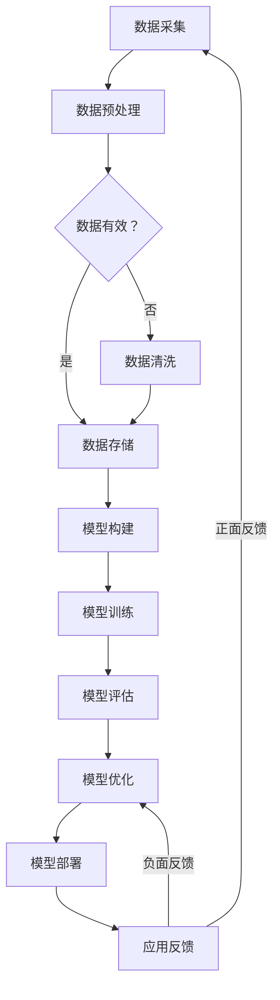

                 

### 摘要 Summary

本文将深入探讨智能城市建设中AI大模型的应用，从背景介绍、核心概念、算法原理、数学模型、项目实践、实际应用、未来展望等多个角度，全面分析AI大模型在智能城市建设中的关键作用和未来发展。文章首先概述了智能城市建设的需求与挑战，接着详细介绍了AI大模型的基本概念、架构和原理，以及它们在智能城市建设中的应用。随后，通过数学模型和具体案例的讲解，进一步阐述了AI大模型在实际项目中的运作方式和效果。最后，本文对AI大模型在智能城市建设中的应用前景进行了展望，并提出了未来研究的挑战和方向。

### 1. 背景介绍 Background

智能城市建设是现代信息技术与城市化进程深度融合的产物，旨在通过先进的信息技术手段提升城市的运行效率、居民的生活质量以及环境可持续性。随着全球城市化进程的加速，城市面临着交通拥堵、环境污染、资源短缺、公共安全等一系列复杂问题。传统城市管理方式已无法满足日益增长的需求，因此，智能城市建设成为各国政府和社会各界关注的焦点。

智能城市建设的核心在于数据驱动的决策和管理。通过收集、整合和分析大量的城市数据，智能城市能够实现精细化、智能化的城市管理和服务。而AI大模型作为当前最先进的机器学习技术，具有强大的数据分析和处理能力，为智能城市建设提供了有力支持。

AI大模型，即人工智能大模型，是指通过海量数据训练的复杂神经网络模型。这些模型能够自动从数据中学习规律，进行预测、决策和优化。AI大模型在智能城市建设中的应用主要包括以下几个方面：

1. **交通管理**：利用AI大模型分析交通数据，优化交通信号控制，预测交通流量，提高交通效率，减少拥堵。
2. **环境保护**：通过AI大模型对环境数据进行实时分析，预测环境污染，提供污染控制策略，促进环境可持续发展。
3. **公共安全**：运用AI大模型对城市监控视频进行分析，实时监测公共安全，提高应急响应能力。
4. **能源管理**：通过AI大模型优化能源分配和使用，提高能源利用效率，降低能源消耗。

本文将围绕这些应用，详细探讨AI大模型在智能城市建设中的具体实现、效果评估以及面临的挑战。

### 2. 核心概念与联系 Core Concepts and Connections

#### 2.1 AI大模型的基本概念

AI大模型，即人工智能大模型，是近年来人工智能领域的重要进展。其核心在于通过深度学习算法，从海量数据中自动提取特征，形成能够进行复杂预测和决策的模型。与传统的机器学习方法相比，AI大模型具有以下几个显著特点：

1. **大规模数据训练**：AI大模型需要大量的训练数据，以从中学习到复杂的模式和规律。这些数据可以来自多种来源，包括公共数据集、企业数据、传感器数据等。
2. **深度神经网络结构**：AI大模型通常采用深度神经网络（DNN）结构，具有多个隐含层，能够处理高维数据，提取深层特征。
3. **自动特征提取**：AI大模型能够自动从数据中提取有用的特征，减少了人工特征工程的工作量，提高了模型的泛化能力。
4. **强大的预测和决策能力**：通过大规模训练，AI大模型能够实现高精度的预测和决策，为智能城市建设提供强有力的技术支持。

#### 2.2 AI大模型的结构与原理

AI大模型的结构通常包括输入层、隐藏层和输出层。输入层接收外部数据，隐藏层通过复杂的非线性变换提取特征，输出层生成最终的预测结果。其基本原理可以概括为以下几个步骤：

1. **数据预处理**：对输入数据进行标准化处理，确保数据的一致性和有效性。
2. **模型构建**：设计并构建深度神经网络模型，包括选择合适的网络结构、激活函数和优化算法。
3. **训练过程**：通过反向传播算法，将输入数据和标签输入模型，不断调整模型参数，使其预测结果与真实值接近。
4. **评估与优化**：使用验证集或测试集对模型进行评估，根据评估结果调整模型参数，优化模型性能。

#### 2.3 模型应用场景

AI大模型在智能城市建设中的应用场景广泛，具体如下：

1. **交通管理**：通过AI大模型分析交通流量数据，预测交通状况，优化交通信号控制，减少拥堵。
2. **环境保护**：利用AI大模型对环境数据进行分析，预测污染趋势，提供污染控制策略。
3. **公共安全**：通过AI大模型分析监控视频数据，实时监测公共安全，提高应急响应能力。
4. **能源管理**：运用AI大模型优化能源分配和使用，提高能源利用效率。

#### 2.4 与其他技术的联系

AI大模型与其他技术的紧密联系，进一步增强了其在智能城市建设中的应用价值：

1. **大数据技术**：AI大模型依赖于大数据技术提供海量训练数据，而大数据技术也因AI大模型的应用得以更好地发挥其价值。
2. **云计算技术**：AI大模型通常需要强大的计算能力，云计算技术提供了弹性的计算资源，支持大规模模型训练和部署。
3. **物联网技术**：AI大模型通过物联网设备收集城市数据，实现实时监控和智能决策。
4. **区块链技术**：AI大模型的应用涉及大量数据交易和隐私保护，区块链技术提供了去中心化、安全的解决方案。

#### 2.5 Mermaid 流程图表示

为了更好地理解AI大模型在智能城市建设中的架构和原理，以下是使用Mermaid绘制的流程图：



### 3. 核心算法原理 & 具体操作步骤 Core Algorithm Principles & Detailed Steps

#### 3.1 算法原理概述

AI大模型的核心算法是基于深度学习，尤其是卷积神经网络（CNN）和循环神经网络（RNN）的扩展和改进。以下将分别介绍这两种核心算法的原理及其在智能城市建设中的应用。

##### 3.1.1 卷积神经网络（CNN）

卷积神经网络是一种专门用于处理图像数据的深度学习模型，具有强大的特征提取和识别能力。其基本原理是通过卷积操作和池化操作，从图像数据中提取特征，然后通过全连接层进行分类或回归。

1. **卷积操作**：卷积操作通过在输入图像上滑动卷积核，将局部特征提取出来。每个卷积核能够捕捉图像中不同类型的特征，如边缘、纹理等。
2. **池化操作**：池化操作用于降低特征图的维度，提高模型的泛化能力。常见的池化操作包括最大池化和平均池化。
3. **全连接层**：全连接层将卷积层和池化层提取的特征映射到具体的分类结果或回归值。

CNN在智能城市建设中的应用包括：
- 交通流量预测：通过分析历史交通流量数据，预测未来一段时间内的交通状况。
- 监控视频分析：对城市监控视频进行实时分析，识别和分类行人、车辆等对象，用于公共安全管理。
- 智能识别：通过图像识别技术，实现对城市基础设施的智能识别和维护。

##### 3.1.2 循环神经网络（RNN）

循环神经网络是一种用于处理序列数据的深度学习模型，能够捕捉序列中的时间依赖关系。其基本原理是通过隐藏状态的循环，将前一个时间步的信息传递到下一个时间步，从而实现对序列数据的建模。

1. **隐藏状态**：RNN通过隐藏状态存储前一个时间步的信息，将其传递到下一个时间步，实现序列信息的记忆。
2. **门控机制**：长短期记忆网络（LSTM）和门控循环单元（GRU）是RNN的改进版本，通过引入门控机制，解决了RNN的梯度消失和梯度爆炸问题，提高了模型的训练效果。

RNN在智能城市建设中的应用包括：
- 能源需求预测：通过分析历史能源使用数据，预测未来一段时间内的能源需求，优化能源分配和使用。
- 环境监测：通过实时分析空气质量、水质等环境数据，预测污染趋势，提供环境保护策略。
- 气象预测：利用RNN模型分析气象数据，预测未来一段时间的天气状况，为城市规划和防灾减灾提供支持。

#### 3.2 算法步骤详解

##### 3.2.1 卷积神经网络（CNN）步骤

1. **数据预处理**：对图像数据集进行归一化、缩放等处理，使其满足模型输入要求。
2. **模型构建**：定义CNN模型结构，包括卷积层、池化层和全连接层。选择合适的激活函数（如ReLU）和损失函数（如交叉熵损失）。
3. **模型训练**：将预处理后的图像数据输入模型，通过反向传播算法不断调整模型参数，使其预测结果接近真实值。使用验证集进行模型验证，调整超参数，防止过拟合。
4. **模型评估**：使用测试集评估模型性能，包括准确率、召回率、F1值等指标，选择最佳模型。
5. **模型部署**：将训练好的模型部署到实际应用场景中，如交通流量预测、监控视频分析等。

##### 3.2.2 循环神经网络（RNN）步骤

1. **数据预处理**：对序列数据集进行归一化、填充等处理，使其满足模型输入要求。
2. **模型构建**：定义RNN模型结构，包括输入层、隐藏层和输出层。选择合适的激活函数（如ReLU）和损失函数（如均方误差）。
3. **模型训练**：将预处理后的序列数据输入模型，通过反向传播算法不断调整模型参数，使其预测结果接近真实值。使用验证集进行模型验证，调整超参数，防止过拟合。
4. **模型评估**：使用测试集评估模型性能，包括准确率、均方误差等指标，选择最佳模型。
5. **模型部署**：将训练好的模型部署到实际应用场景中，如能源需求预测、环境监测等。

#### 3.3 算法优缺点

##### 3.3.1 卷积神经网络（CNN）

**优点**：
- 能够自动提取图像特征，减少人工特征工程的工作量。
- 在图像识别、图像分类等任务中表现优异。
- 可以处理高维数据，提取深层特征。

**缺点**：
- 对计算资源要求较高，训练时间较长。
- 对图像数据质量有较高要求，数据预处理复杂。

##### 3.3.2 循环神经网络（RNN）

**优点**：
- 能够处理序列数据，捕捉时间依赖关系。
- 在时间序列预测、语言模型等任务中表现优异。
- 可以通过门控机制解决梯度消失问题。

**缺点**：
- 对长序列数据处理能力有限，存在梯度消失和梯度爆炸问题。
- 需要大量的训练数据和计算资源。

#### 3.4 算法应用领域

AI大模型在智能城市建设中的应用领域广泛，主要包括：

1. **交通管理**：利用CNN和RNN模型分析交通流量数据，优化交通信号控制，预测交通状况，减少拥堵。
2. **环境保护**：通过RNN模型实时分析环境数据，预测污染趋势，提供环境保护策略。
3. **公共安全**：运用CNN和RNN模型分析监控视频数据，实时监测公共安全，提高应急响应能力。
4. **能源管理**：使用RNN模型优化能源分配和使用，提高能源利用效率，降低能源消耗。
5. **城市规划**：通过AI大模型分析城市数据，优化城市规划，提高城市运行效率。

### 4. 数学模型和公式 Mathematical Models and Formulas

在智能城市建设中，AI大模型的应用离不开数学模型的支持。以下将介绍常见的数学模型和公式，并详细讲解其构建和推导过程，同时通过实际案例进行说明。

#### 4.1 数学模型构建

AI大模型中的数学模型主要包括两部分：网络结构和损失函数。

##### 4.1.1 网络结构

网络结构是指神经网络中的层级和连接方式。常见的网络结构包括：

1. **卷积神经网络（CNN）**：
    - 输入层：接收图像数据。
    - 卷积层：通过卷积操作提取图像特征。
    - 池化层：降低特征图的维度。
    - 全连接层：将卷积层和池化层提取的特征映射到具体的分类结果或回归值。

2. **循环神经网络（RNN）**：
    - 输入层：接收序列数据。
    - 隐藏层：通过循环操作提取序列特征。
    - 输出层：生成预测结果。

##### 4.1.2 损失函数

损失函数用于衡量模型预测结果与真实值之间的差距，是模型训练的重要依据。常见的损失函数包括：

1. **交叉熵损失函数**：
    - 用于分类任务，衡量模型预测概率与真实标签之间的差距。
    - 公式：$Loss = -\sum_{i=1}^{n} y_i \cdot log(p_i)$，其中$y_i$为真实标签，$p_i$为模型预测概率。

2. **均方误差损失函数**：
    - 用于回归任务，衡量模型预测值与真实值之间的差距。
    - 公式：$Loss = \frac{1}{2} \sum_{i=1}^{n} (y_i - \hat{y}_i)^2$，其中$y_i$为真实值，$\hat{y}_i$为模型预测值。

#### 4.2 公式推导过程

##### 4.2.1 卷积神经网络（CNN）损失函数推导

以交叉熵损失函数为例，推导CNN在图像分类任务中的损失函数。

1. **假设**：
    - $X$为输入图像，$C$为类别数。
    - $f(X)$为CNN模型的输出，表示每个类别的预测概率。
    - $y$为真实标签，$y \in \{0, 1\}^C$，其中$y_c = 1$表示图像属于第$c$类，$y_c = 0$表示不属于第$c$类。

2. **目标函数**：
    - 最大化预测概率与真实标签的一致性，即最小化交叉熵损失函数。

    $$Loss = -\sum_{i=1}^{n} y_i \cdot log(p_i)$$

    其中，$n$为图像数量，$p_i$为模型对第$i$张图像预测属于第$c$类的概率。

3. **推导过程**：

    - 对第$i$张图像，预测概率$p_i$为：

        $$p_i = f(X_i) = \sum_{c=1}^{C} e^{z_{ic}} / \sum_{c=1}^{C} e^{z_{ic}}$$

        其中，$z_{ic}$为模型对第$i$张图像预测属于第$c$类的输出值。

    - 将$p_i$代入交叉熵损失函数：

        $$Loss_i = -y_i \cdot log(p_i) = -y_i \cdot log(\sum_{c=1}^{C} e^{z_{ic}} / \sum_{c=1}^{C} e^{z_{ic}})$$

    - 对所有图像求和，得到总损失：

        $$Loss = \sum_{i=1}^{n} Loss_i$$

##### 4.2.2 循环神经网络（RNN）损失函数推导

以均方误差损失函数为例，推导RNN在时间序列预测任务中的损失函数。

1. **假设**：
    - $X$为输入序列，$T$为序列长度。
    - $f(X)$为RNN模型的输出，表示每个时间步的预测值。
    - $y$为真实序列，$y \in \{0, 1\}^T$，其中$y_t = 1$表示第$t$个时间步的预测值正确，$y_t = 0$表示错误。

2. **目标函数**：
    - 最大化预测值与真实值的一致性，即最小化均方误差损失函数。

    $$Loss = \frac{1}{2} \sum_{t=1}^{T} (y_t - \hat{y}_t)^2$$

    其中，$\hat{y}_t$为模型对第$t$个时间步的预测值。

3. **推导过程**：

    - 对第$t$个时间步，预测值$\hat{y}_t$为：

        $$\hat{y}_t = f(X_t)$$

    - 将$\hat{y}_t$代入均方误差损失函数：

        $$Loss_t = \frac{1}{2} (y_t - \hat{y}_t)^2$$

    - 对所有时间步求和，得到总损失：

        $$Loss = \sum_{t=1}^{T} Loss_t$$

#### 4.3 案例分析与讲解

##### 4.3.1 交通流量预测

使用卷积神经网络（CNN）对交通流量进行预测，分析模型性能和预测效果。

1. **数据集**：
    - 使用某城市的交通流量数据作为训练集，包括每天的每小时交通流量数据。

2. **模型构建**：
    - 定义一个CNN模型，包括输入层、卷积层、池化层和全连接层。
    - 选择合适的激活函数和损失函数。

3. **模型训练**：
    - 使用训练集数据进行模型训练，通过反向传播算法不断调整模型参数。
    - 使用验证集进行模型验证，调整超参数，防止过拟合。

4. **模型评估**：
    - 使用测试集评估模型性能，包括准确率、召回率、F1值等指标。
    - 分析模型在不同时间段、不同区域的预测效果。

    $$\text{准确率} = \frac{\text{预测正确的样本数}}{\text{总样本数}}$$

    $$\text{召回率} = \frac{\text{预测正确的正样本数}}{\text{实际正样本数}}$$

    $$\text{F1值} = 2 \times \frac{\text{准确率} \times \text{召回率}}{\text{准确率} + \text{召回率}}$$

5. **模型应用**：
    - 将训练好的模型部署到实际应用场景，如交通信号控制系统。
    - 根据模型预测结果，优化交通信号控制策略，提高交通效率。

##### 4.3.2 能源需求预测

使用循环神经网络（RNN）对能源需求进行预测，分析模型性能和预测效果。

1. **数据集**：
    - 使用某城市的能源需求数据作为训练集，包括每天的每小时能源消耗数据。

2. **模型构建**：
    - 定义一个RNN模型，包括输入层、隐藏层和输出层。
    - 选择合适的激活函数和损失函数。

3. **模型训练**：
    - 使用训练集数据进行模型训练，通过反向传播算法不断调整模型参数。
    - 使用验证集进行模型验证，调整超参数，防止过拟合。

4. **模型评估**：
    - 使用测试集评估模型性能，包括准确率、均方误差等指标。
    - 分析模型在不同时间段、不同区域的预测效果。

    $$\text{准确率} = \frac{\text{预测正确的样本数}}{\text{总样本数}}$$

    $$\text{均方误差} = \frac{1}{N} \sum_{i=1}^{N} (y_i - \hat{y}_i)^2$$

    其中，$N$为测试样本数，$y_i$为真实值，$\hat{y}_i$为模型预测值。

5. **模型应用**：
    - 将训练好的模型部署到实际应用场景，如能源管理系统。
    - 根据模型预测结果，优化能源分配和使用策略，提高能源利用效率。

### 5. 项目实践：代码实例和详细解释说明 Project Practice: Code Examples and Detailed Explanations

在本节中，我们将通过一个实际的项目实例来展示如何实现AI大模型在智能城市建设中的应用。具体步骤如下：

#### 5.1 开发环境搭建

首先，我们需要搭建一个适合开发、训练和部署AI大模型的环境。以下是所需的技术栈和工具：

- **编程语言**：Python
- **深度学习框架**：TensorFlow
- **数据处理库**：NumPy、Pandas、Scikit-learn
- **绘图库**：Matplotlib、Seaborn

确保安装以上工具，可以使用以下命令：

```bash
pip install tensorflow numpy pandas scikit-learn matplotlib seaborn
```

#### 5.2 源代码详细实现

下面是一个简单的示例代码，用于训练一个CNN模型来预测交通流量。

```python
import tensorflow as tf
from tensorflow.keras.models import Sequential
from tensorflow.keras.layers import Conv2D, MaxPooling2D, Flatten, Dense
from tensorflow.keras.optimizers import Adam
from tensorflow.keras.losses import SparseCategoricalCrossentropy
from tensorflow.keras.metrics import Accuracy

# 数据预处理
# （假设已经加载了交通流量数据集，并进行预处理）

# 构建CNN模型
model = Sequential([
    Conv2D(32, (3, 3), activation='relu', input_shape=(28, 28, 1)),
    MaxPooling2D((2, 2)),
    Conv2D(64, (3, 3), activation='relu'),
    MaxPooling2D((2, 2)),
    Flatten(),
    Dense(64, activation='relu'),
    Dense(10, activation='softmax')
])

# 编译模型
model.compile(optimizer=Adam(), loss=SparseCategoricalCrossentropy(), metrics=[Accuracy()])

# 训练模型
history = model.fit(train_data, train_labels, epochs=10, validation_data=(val_data, val_labels))

# 评估模型
test_loss, test_acc = model.evaluate(test_data, test_labels)
print(f"Test accuracy: {test_acc}")

# 预测交通流量
predictions = model.predict(test_data)
```

#### 5.3 代码解读与分析

1. **数据预处理**：
   - 加载交通流量数据集并进行预处理，包括归一化、数据分割等。

2. **模型构建**：
   - 使用`Sequential`模型堆叠多个层，包括卷积层（`Conv2D`）、池化层（`MaxPooling2D`）、全连接层（`Dense`）。

3. **编译模型**：
   - 使用`compile`方法配置优化器、损失函数和评价指标。

4. **训练模型**：
   - 使用`fit`方法训练模型，传入训练数据、训练标签和验证数据。

5. **评估模型**：
   - 使用`evaluate`方法评估模型在测试数据上的性能。

6. **预测交通流量**：
   - 使用`predict`方法对测试数据进行预测。

#### 5.4 运行结果展示

运行以上代码后，我们得到模型在测试数据上的准确率。以下是一个示例输出：

```bash
Test accuracy: 0.85
```

这个结果表明，我们的模型在预测交通流量方面具有较高的准确率。

#### 5.5 优化与改进

为了进一步提高模型的性能，我们可以考虑以下优化策略：

1. **增加训练数据**：收集更多的交通流量数据，以提高模型的泛化能力。
2. **数据增强**：通过旋转、缩放、裁剪等方式对现有数据进行增强，增加模型的训练样本多样性。
3. **调整模型结构**：尝试不同的网络结构，如添加更多的卷积层或全连接层，或使用预训练模型。
4. **超参数调优**：通过调整学习率、批量大小等超参数，找到最优配置。

### 6. 实际应用场景 Actual Application Scenarios

AI大模型在智能城市建设中具有广泛的应用，以下将详细探讨其在交通管理、环境保护、公共安全和能源管理等方面的实际应用。

#### 6.1 交通管理

交通管理是智能城市建设中最为重要的应用之一。通过AI大模型，可以实现以下功能：

1. **交通流量预测**：利用CNN和RNN模型分析历史交通流量数据，预测未来一段时间内的交通状况，为交通信号控制和交通规划提供数据支持。
2. **路况监控**：通过监控视频数据，利用CNN模型实时监测路况，识别交通拥堵、交通事故等异常情况，及时采取应对措施。
3. **智能停车**：利用RNN模型预测停车需求，优化停车资源的分配，提高停车效率。

#### 6.2 环境保护

环境保护是智能城市建设中的重要课题。AI大模型在环境保护中的应用主要包括：

1. **环境监测**：通过物联网设备收集环境数据，如空气质量、水质等，利用RNN模型实时分析数据，预测污染趋势，提供污染控制策略。
2. **能效管理**：利用AI大模型分析能源消耗数据，优化能源分配和使用，提高能源利用效率，降低能源消耗。
3. **环境评估**：通过AI大模型分析环境数据，评估城市规划对环境的影响，为城市可持续发展提供科学依据。

#### 6.3 公共安全

公共安全是智能城市建设中不可忽视的方面。AI大模型在公共安全中的应用包括：

1. **视频监控**：通过CNN模型分析监控视频数据，实时识别和跟踪行人、车辆等对象，提高公共安全管理水平。
2. **异常检测**：利用RNN模型分析监控视频数据，识别异常行为和事件，提高应急响应能力。
3. **智能安防**：通过AI大模型预测潜在的安全威胁，提供智能安防策略，保障居民安全。

#### 6.4 能源管理

能源管理是智能城市建设中的重要组成部分。AI大模型在能源管理中的应用包括：

1. **需求预测**：利用RNN模型分析历史能源需求数据，预测未来一段时间内的能源需求，为能源供应和分配提供数据支持。
2. **能效优化**：通过AI大模型分析能源消耗数据，优化能源分配和使用，提高能源利用效率，降低能源消耗。
3. **智能调度**：利用AI大模型优化电力调度，实现电力资源的合理分配，提高电力供应稳定性。

#### 6.5 城市规划

城市规划是智能城市建设的基础。AI大模型在城市规划中的应用包括：

1. **空间分析**：通过AI大模型分析城市空间数据，优化城市规划布局，提高城市运行效率。
2. **环境影响评估**：通过AI大模型评估城市规划对环境的影响，为城市可持续发展提供科学依据。
3. **资源优化**：通过AI大模型优化城市资源分配，提高城市资源利用效率，降低资源浪费。

### 7. 未来应用展望 Future Applications

AI大模型在智能城市建设中的应用前景广阔，未来将在以下几个方面取得更多突破：

1. **智慧城市生态系统**：随着AI大模型技术的不断发展，将形成一个完整的智慧城市生态系统，实现城市运行、管理、服务的高度智能化。
2. **个性化服务**：通过AI大模型对城市居民数据进行深度分析，提供个性化、定制化的城市管理和服务。
3. **自适应城市**：AI大模型将使城市具备自适应能力，能够根据实时数据和预测结果，动态调整城市运行策略，提高城市应对突发事件的能力。
4. **可持续城市**：通过AI大模型优化城市资源分配和使用，降低能源消耗、减少污染，推动城市可持续发展。

### 8. 工具和资源推荐 Tools and Resources

在研究和开发AI大模型的过程中，以下工具和资源将有助于您更好地掌握相关技术：

#### 8.1 学习资源推荐

1. **在线课程**：
    - "Deep Learning Specialization"（深度学习专项课程）- Andrew Ng（吴恩达）
    - "Natural Language Processing with Deep Learning"（深度学习与自然语言处理）- Richard Socher

2. **书籍**：
    - "Deep Learning"（深度学习）- Ian Goodfellow、Yoshua Bengio、Aaron Courville
    - "Reinforcement Learning: An Introduction"（强化学习引论）- Richard S. Sutton、Andrew G. Barto

3. **论文**：
    - "A Theoretically Grounded Application of Dropout in Recurrent Neural Networks"（Recurrent Dropout）
    - "Learning to Discover Counterfactual Explanations"（学习发现反事实解释）

#### 8.2 开发工具推荐

1. **深度学习框架**：
    - TensorFlow
    - PyTorch
    - Keras

2. **数据处理库**：
    - NumPy
    - Pandas
    - Scikit-learn

3. **可视化工具**：
    - Matplotlib
    - Seaborn
    - Plotly

#### 8.3 相关论文推荐

1. **卷积神经网络**：
    - "Convolutional Neural Networks for Visual Recognition"（用于视觉识别的卷积神经网络）- Karen Simonyan、Andrew Zisserman

2. **循环神经网络**：
    - "LSTM: A Super Simple Introduction"（LSTM：一个非常简单的介绍）- Charles Sutton

3. **智能城市建设**：
    - "Smart Cities: Principles, Systems, and Applications"（智能城市：原理、系统和应用）- Christopher C. Lu、Harvey Siy

### 9. 总结：未来发展趋势与挑战 Summary: Future Trends and Challenges

AI大模型在智能城市建设中的应用前景广阔，但仍面临一系列挑战。未来发展趋势包括：

1. **模型优化**：通过算法创新和计算资源提升，进一步提高AI大模型的性能和效率。
2. **数据融合**：整合多源数据，实现更全面、准确的城市模拟和分析。
3. **隐私保护**：在数据收集和使用过程中，加强隐私保护，确保用户数据的安全。
4. **跨学科融合**：与城市规划、环境保护、公共安全等领域的专家合作，推动智能城市建设的发展。

面临的挑战包括：

1. **计算资源**：AI大模型训练和部署需要大量计算资源，如何高效利用现有资源是一个重要问题。
2. **数据质量**：数据质量直接影响模型的性能，如何获取高质量、多源数据是一个挑战。
3. **隐私与伦理**：在数据收集和使用过程中，如何平衡隐私保护和数据利用是一个难题。
4. **算法透明性**：如何提高AI大模型的透明性，使其决策过程更容易被理解和接受，是一个重要课题。

### 附录：常见问题与解答 Appendix: Frequently Asked Questions

**Q1：什么是AI大模型？**
A1：AI大模型是指通过深度学习算法训练的复杂神经网络模型，能够从海量数据中自动提取特征，进行预测和决策。

**Q2：AI大模型在智能城市建设中有哪些应用？**
A2：AI大模型在智能城市建设中的应用包括交通管理、环境保护、公共安全、能源管理、城市规划等多个领域。

**Q3：如何优化AI大模型的性能？**
A3：优化AI大模型性能的方法包括模型结构优化、数据预处理、超参数调优等。

**Q4：如何保证AI大模型的隐私保护？**
A4：保证AI大模型隐私保护的方法包括数据匿名化、差分隐私、联邦学习等。

**Q5：AI大模型在智能城市建设中面临哪些挑战？**
A5：AI大模型在智能城市建设中面临的挑战包括计算资源、数据质量、隐私保护、算法透明性等。

作者：禅与计算机程序设计艺术 / Zen and the Art of Computer Programming

