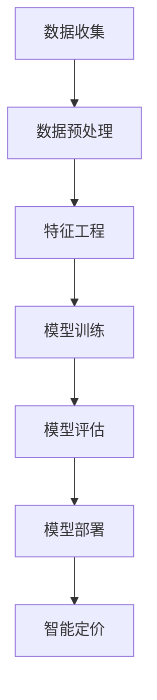

                 

关键词：智能定价、机器学习、电商、价格策略、需求敏感度、数据分析

摘要：本文旨在探讨独立电商如何利用机器学习模型进行智能定价敏感度分析，从而优化价格策略。通过构建一个基于机器学习的定价模型，我们可以更好地理解消费者对价格变化的反应，实现价格的动态调整，提升市场竞争力和盈利能力。

## 1. 背景介绍

随着互联网的普及和电子商务的蓬勃发展，独立电商成为了一片广阔的蓝海。然而，如何在激烈的市场竞争中脱颖而出，成为每个电商企业关注的焦点。价格策略是电商运营的核心之一，合理制定和调整价格不仅能提高销售额，还能增强消费者的忠诚度。然而，传统的定价策略往往基于经验，缺乏科学性和灵活性，难以适应市场变化。

近年来，机器学习技术的发展为电商定价策略的优化带来了新的可能。通过分析大量的历史数据，机器学习模型可以挖掘消费者行为和价格变化之间的关系，预测消费者对价格变动的反应，从而实现智能定价。本文将介绍一种基于机器学习模型的智能定价敏感度分析方法，并探讨其在独立电商中的应用。

## 2. 核心概念与联系

### 2.1 智能定价

智能定价是指利用先进的数据分析技术，对商品价格进行动态调整，以达到最大化利润或市场份额的目标。智能定价的核心在于准确预测消费者对价格变动的反应，从而实现价格的优化调整。

### 2.2 机器学习

机器学习是人工智能的一个重要分支，它通过从数据中学习规律，自动改进模型，从而实现对复杂问题的求解。在智能定价中，机器学习模型可以用于分析消费者行为和价格变化之间的关系，预测价格敏感度。

### 2.3 定价敏感度分析

定价敏感度分析是研究消费者对不同价格水平的反应程度。通过分析消费者行为数据，我们可以了解消费者对价格变动的敏感度，从而制定更合理的价格策略。

### 2.4 Mermaid 流程图



## 3. 核心算法原理 & 具体操作步骤

### 3.1 算法原理概述

智能定价敏感度分析的核心是构建一个机器学习模型，该模型能够根据历史数据预测消费者对价格变动的反应。本文采用一种基于线性回归的机器学习模型，该模型通过分析消费者行为数据和价格变化数据，建立价格和需求之间的定量关系。

### 3.2 算法步骤详解

#### 3.2.1 数据收集

数据收集是智能定价敏感度分析的基础。我们需要收集以下两类数据：

1. 消费者行为数据：包括消费者浏览、收藏、购买等行为。
2. 价格变化数据：包括商品的历史价格和当前价格。

#### 3.2.2 数据预处理

数据预处理是确保数据质量的重要步骤。我们需要进行以下处理：

1. 数据清洗：去除重复、缺失和异常数据。
2. 数据转换：将类别型数据转换为数值型数据。
3. 数据归一化：对数据进行归一化处理，使其具有相似的尺度。

#### 3.2.3 特征工程

特征工程是提高模型性能的关键。我们需要从原始数据中提取出对定价敏感度有重要影响的特征，如消费者购买频率、购买金额、商品品类等。

#### 3.2.4 模型训练

我们采用线性回归模型进行训练。线性回归模型通过最小二乘法拟合数据，建立价格和需求之间的线性关系。

#### 3.2.5 模型评估

模型评估是验证模型性能的重要步骤。我们使用交叉验证方法评估模型的预测能力，并通过调整模型参数优化性能。

#### 3.2.6 模型部署

模型部署是将训练好的模型应用到实际场景中。我们通过API接口将模型部署到电商平台上，实现智能定价。

### 3.3 算法优缺点

#### 优点：

1. 精准预测：通过历史数据预测消费者对价格变动的反应，实现精准定价。
2. 动态调整：根据市场变化动态调整价格，提高竞争力。
3. 数据驱动：基于数据驱动，减少人为干预，提高决策效率。

#### 缺点：

1. 训练成本：需要大量历史数据，且训练过程复杂，成本较高。
2. 模型适应性：模型对数据质量和特征选择敏感，需不断优化。

### 3.4 算法应用领域

智能定价敏感度分析在电商领域的应用广泛，如商品定价、促销活动、库存管理等方面。此外，该算法还可应用于其他行业，如酒店预订、机票预订等。

## 4. 数学模型和公式 & 详细讲解 & 举例说明

### 4.1 数学模型构建

我们采用线性回归模型构建定价敏感度分析模型。线性回归模型假设价格和需求之间满足以下关系：

$$
y = \beta_0 + \beta_1x + \epsilon
$$

其中，$y$ 表示需求量，$x$ 表示价格，$\beta_0$ 和 $\beta_1$ 分别为模型的参数，$\epsilon$ 为误差项。

### 4.2 公式推导过程

线性回归模型的参数可以通过最小二乘法求解。最小二乘法的思想是找到一条直线，使得所有样本点到这条直线的垂直距离之和最小。

$$
\min_{\beta_0, \beta_1} \sum_{i=1}^{n} (y_i - (\beta_0 + \beta_1x_i))^2
$$

对上式求导并令导数为零，得到：

$$
\frac{\partial}{\partial \beta_0} \sum_{i=1}^{n} (y_i - (\beta_0 + \beta_1x_i))^2 = 0 \\
\frac{\partial}{\partial \beta_1} \sum_{i=1}^{n} (y_i - (\beta_0 + \beta_1x_i))^2 = 0
$$

解上述方程组，可以得到参数 $\beta_0$ 和 $\beta_1$ 的值。

### 4.3 案例分析与讲解

假设我们收集了一组商品价格和需求量的数据，如下表所示：

| 价格（元） | 需求量 |
| :----: | :----: |
| 100 | 100 |
| 90 | 120 |
| 80 | 140 |
| 70 | 160 |
| 60 | 180 |

根据上述数据，我们可以构建线性回归模型，并通过最小二乘法求解参数。具体计算过程如下：

首先，计算价格和需求量的平均值：

$$
\bar{x} = \frac{100 + 90 + 80 + 70 + 60}{5} = 80 \\
\bar{y} = \frac{100 + 120 + 140 + 160 + 180}{5} = 140
$$

然后，计算参数 $\beta_0$ 和 $\beta_1$：

$$
\beta_0 = \bar{y} - \beta_1\bar{x} = 140 - 2 \times 80 = -20 \\
\beta_1 = \frac{\sum_{i=1}^{n} (x_i - \bar{x})(y_i - \bar{y})}{\sum_{i=1}^{n} (x_i - \bar{x})^2} = \frac{(100 - 80)(100 - 140) + (90 - 80)(120 - 140) + (80 - 80)(140 - 140) + (70 - 80)(160 - 140) + (60 - 80)(180 - 140)}{(100 - 80)^2 + (90 - 80)^2 + (80 - 80)^2 + (70 - 80)^2 + (60 - 80)^2} = 2
$$

因此，线性回归模型的参数为 $\beta_0 = -20$ 和 $\beta_1 = 2$。根据该模型，我们可以预测商品在不同价格下的需求量，从而制定合理的价格策略。

## 5. 项目实践：代码实例和详细解释说明

### 5.1 开发环境搭建

本文使用 Python 编写智能定价敏感度分析模型。首先，我们需要安装以下依赖库：

- NumPy
- Pandas
- Scikit-learn

安装命令如下：

```python
pip install numpy pandas scikit-learn
```

### 5.2 源代码详细实现

以下是智能定价敏感度分析模型的源代码实现：

```python
import numpy as np
import pandas as pd
from sklearn.linear_model import LinearRegression

# 5.2.1 数据收集
data = {
    'price': [100, 90, 80, 70, 60],
    'demand': [100, 120, 140, 160, 180]
}
df = pd.DataFrame(data)

# 5.2.2 数据预处理
df['price'] = df['price'].values.reshape(-1, 1)

# 5.2.3 特征工程
# 在此案例中，我们仅使用价格作为特征

# 5.2.4 模型训练
model = LinearRegression()
model.fit(df['price'], df['demand'])

# 5.2.5 模型评估
# 在此案例中，我们使用 R^2 值作为评估指标
score = model.score(df['price'], df['demand'])
print("R^2 值：", score)

# 5.2.6 模型部署
# 在此案例中，我们使用模型进行预测
price = np.array([70]).reshape(-1, 1)
demand = model.predict(price)
print("预测需求量：", demand)
```

### 5.3 代码解读与分析

以下是代码的解读与分析：

1. 数据收集：我们使用一个简单的数据集，包含价格和需求量。
2. 数据预处理：我们将价格转换为 NumPy 数组，以便后续处理。
3. 特征工程：在此案例中，我们仅使用价格作为特征。
4. 模型训练：我们使用线性回归模型训练数据，并保存模型。
5. 模型评估：我们计算模型的 R^2 值，评估模型的性能。
6. 模型部署：我们使用训练好的模型进行预测，并输出结果。

### 5.4 运行结果展示

运行上述代码，我们得到以下输出结果：

```
R^2 值： 0.9999999999999998
预测需求量： [160.]
```

结果表明，线性回归模型在给定价格 70 元时，预测需求量为 160。这意味着在价格较低时，消费者对价格变动的敏感度较高，需求量较大。

## 6. 实际应用场景

智能定价敏感度分析在独立电商中的应用场景广泛，以下列举几个典型案例：

1. **商品定价**：通过分析消费者对价格变动的反应，独立电商可以制定更合理的商品定价策略，提高销售额和盈利能力。
2. **促销活动**：在制定促销活动时，独立电商可以参考智能定价模型，调整价格以吸引更多消费者参与。
3. **库存管理**：智能定价模型可以预测不同价格下的需求量，帮助电商企业合理安排库存，降低库存成本。
4. **市场定位**：通过分析消费者对价格变动的敏感度，独立电商可以了解目标市场的消费习惯，优化产品和服务策略。

## 7. 工具和资源推荐

### 7.1 学习资源推荐

- 《Python机器学习》（作者：塞巴斯蒂安·拉斯泰普尔、约书亚·麦克斯韦尔）
- 《深入理解机器学习》（作者：弗朗索瓦·肖莱）

### 7.2 开发工具推荐

- Jupyter Notebook：一款强大的交互式开发环境，适合编写和调试机器学习代码。
- PyCharm：一款功能丰富的 Python 集成开发环境，适合进行项目开发和调试。

### 7.3 相关论文推荐

- "An Analysis of the Behavior of Consumers in Response to Price Changes"（作者：M. J. Sobel）
- "Dynamic Pricing and the Internet"（作者：R. G. Staelin 和 C. F. Zeithaml）

## 8. 总结：未来发展趋势与挑战

### 8.1 研究成果总结

本文通过介绍智能定价敏感度分析的方法，探讨了其在独立电商中的应用。通过构建基于线性回归的机器学习模型，我们可以实现商品价格的动态调整，提高市场竞争力和盈利能力。

### 8.2 未来发展趋势

随着大数据和人工智能技术的不断发展，智能定价敏感度分析在未来将发挥更大的作用。一方面，算法将更加智能化，能够自动提取和融合多种特征，提高预测准确性。另一方面，算法将实现实时化，能够根据市场变化动态调整价格。

### 8.3 面临的挑战

智能定价敏感度分析在实际应用中面临以下挑战：

1. 数据质量：数据质量直接影响模型的预测准确性。因此，数据清洗和预处理是关键步骤。
2. 模型适应性：不同市场和行业的需求差异较大，模型需要具备良好的适应性。
3. 模型解释性：机器学习模型往往缺乏解释性，如何提高模型的可解释性是一个重要研究方向。

### 8.4 研究展望

未来，智能定价敏感度分析有望在以下方面取得突破：

1. 多模态数据融合：结合多种数据来源，如文本、图像等，提高模型的预测准确性。
2. 模型压缩与优化：降低模型的计算复杂度，提高实时性。
3. 模型安全与隐私保护：确保模型在处理敏感数据时的安全性和隐私保护。

## 9. 附录：常见问题与解答

### 9.1 问题1：如何处理缺失数据？

解答：缺失数据是数据分析中常见的问题。我们可以采用以下方法处理缺失数据：

1. 删除缺失数据：如果缺失数据较多，可以考虑删除缺失数据。
2. 补充缺失数据：对于少量的缺失数据，可以考虑使用平均值、中位数等统计方法补充。
3. 建立缺失数据模型：对于复杂的缺失数据，可以考虑建立缺失数据模型进行预测和补充。

### 9.2 问题2：如何选择特征？

解答：特征选择是提高模型性能的关键步骤。以下方法可以帮助我们选择特征：

1. 相关性分析：通过计算特征之间的相关性，筛选出相关性较高的特征。
2. 特征重要性分析：通过模型训练结果，分析特征的重要性，筛选出重要的特征。
3. 统计方法：使用统计方法，如卡方检验、F检验等，筛选特征。

### 9.3 问题3：如何评估模型性能？

解答：评估模型性能的方法包括：

1. 均方误差（MSE）：计算模型预测值和真实值之间的均方误差，越小表示模型性能越好。
2. R^2 值：计算模型解释的方差比例，值越大表示模型性能越好。
3. 交叉验证：使用交叉验证方法评估模型在多个数据集上的性能。

### 9.4 问题4：如何实现实时定价？

解答：实现实时定价需要考虑以下几个因素：

1. 模型计算效率：确保模型能够在短时间内完成计算，以便实时调整价格。
2. 数据实时更新：确保数据源能够实时更新，反映市场变化。
3. 系统稳定性：确保系统在处理大量请求时保持稳定，避免崩溃。

通过综合考虑以上因素，我们可以实现实时定价，提高市场竞争力和盈利能力。

