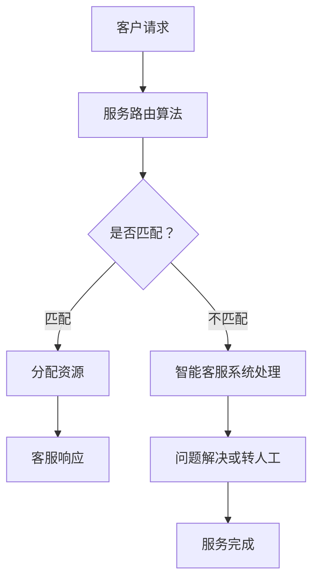

                 

关键词：智能客服，服务路由，人工智能，一人公司，效率提升

> 摘要：本文将探讨如何利用人工智能技术构建一个智能客户服务路由系统，从而实现一人公司的服务效率大幅提升。通过核心算法原理、数学模型构建、项目实践和实际应用场景的分析，本文旨在为读者提供一套切实可行的AI解决方案。

## 1. 背景介绍

在现代商业环境中，客户服务已成为企业竞争力的重要组成部分。然而，随着客户数量的增加和服务需求的多样化，传统的客户服务模式往往难以满足高效、精准的服务要求。尤其对于一人公司或小型企业来说，人力成本高企且人员配置有限，如何在有限的资源下提供优质的客户服务成为一大挑战。

近年来，人工智能技术的发展为客服领域带来了新的机遇。通过智能客服系统，企业能够实现自动化的客户服务流程，提高服务效率，降低成本。智能客户服务路由系统正是基于这一理念，通过精准的算法和高效的数学模型，实现客户服务的高效匹配和自动化处理。

本文旨在通过详细介绍智能客户服务路由系统的原理、算法和应用，帮助一人公司或小型企业实现客户服务效率的提升，从而在激烈的市场竞争中占据优势。

## 2. 核心概念与联系

### 2.1 智能客服系统

智能客服系统是一种基于人工智能技术的自动客服系统，能够通过自然语言处理和机器学习算法实现与用户的实时交流，提供自助服务、问题解答、信息查询等一站式服务。

### 2.2 服务路由

服务路由是指将客户请求分配到合适的客服资源进行处理的过程。高效的服务路由能够确保客户请求得到及时响应，提高整体服务效率。

### 2.3 人工智能

人工智能是指通过计算机模拟人类智能行为的技术，包括机器学习、深度学习、自然语言处理等。在智能客服系统中，人工智能技术用于提升客服系统的智能程度和服务质量。

### 2.4 Mermaid 流程图



## 3. 核心算法原理 & 具体操作步骤

### 3.1 算法原理概述

智能客户服务路由系统采用基于机器学习的算法模型，通过对客户请求和客服资源的数据分析，实现客户请求的智能匹配和分配。

### 3.2 算法步骤详解

1. **数据收集与预处理**：收集客户请求和客服资源的相关数据，包括客户特征、请求内容、客服人员技能等，并进行数据清洗和特征提取。
   
2. **模型训练**：利用收集到的数据，训练一个基于机器学习算法的预测模型，用于预测客户请求与客服资源的匹配度。

3. **服务路由决策**：根据模型预测结果，对客户请求进行路由决策，将请求分配到最合适的客服资源。

4. **响应与反馈**：客服资源处理完客户请求后，系统收集反馈信息，用于模型优化和持续改进。

### 3.3 算法优缺点

**优点**：

- 提高服务效率：智能路由系统能够快速匹配和分配客户请求，减少响应时间。
- 降低人力成本：通过自动化处理，减少对人工客服的依赖，降低人力成本。
- 提升服务质量：通过精确的匹配和分配，提高客户满意度。

**缺点**：

- 需要大量数据：算法训练需要大量的历史数据，数据质量对算法效果有重要影响。
- 模型优化难度：随着业务变化，模型需要不断优化和调整，以适应新的业务需求。

### 3.4 算法应用领域

- 客户服务：智能客服系统的核心应用领域，包括在线客服、电话客服等。
- 金融领域：通过智能客服系统，银行和金融机构能够提供24小时不间断的客户服务。
- 电子商务：智能客服系统能够提升电商平台的客户服务质量，提高客户购买体验。

## 4. 数学模型和公式 & 详细讲解 & 举例说明

### 4.1 数学模型构建

智能客户服务路由系统采用基于机器学习的数学模型，包括以下关键参数和公式：

- **客户请求特征向量**：\[X = [x_1, x_2, ..., x_n]\]，其中\(x_i\)为第\(i\)个特征值。
- **客服资源特征向量**：\[Y = [y_1, y_2, ..., y_n]\]，其中\(y_i\)为第\(i\)个特征值。
- **匹配度评分函数**：\[S(X, Y) = \sum_{i=1}^{n} w_i \cdot (x_i - y_i)^2\]，其中\(w_i\)为第\(i\)个特征的权重。

### 4.2 公式推导过程

匹配度评分函数的推导过程如下：

1. **特征提取**：从客户请求和客服资源中提取关键特征，如请求类型、客服技能等。
2. **特征归一化**：对提取到的特征进行归一化处理，使其具有相同的量纲。
3. **权重设定**：根据业务需求和数据特征，设定各个特征的权重。
4. **匹配度计算**：计算客户请求和客服资源之间的匹配度，通过评分函数进行量化。

### 4.3 案例分析与讲解

假设某客户请求的特征向量为\[X = [2, 3, 1]\]，某客服资源的特征向量为\[Y = [1, 2, 3]\]，权重分别为\[w_1 = 0.4, w_2 = 0.3, w_3 = 0.3\]。

根据匹配度评分函数计算匹配度评分：

$$
S(X, Y) = 0.4 \cdot (2 - 1)^2 + 0.3 \cdot (3 - 2)^2 + 0.3 \cdot (1 - 3)^2 = 0.4 + 0.3 + 0.9 = 1.6
$$

根据评分结果，该客户请求与客服资源的匹配度为1.6，表示匹配程度较高。

## 5. 项目实践：代码实例和详细解释说明

### 5.1 开发环境搭建

- **语言**：Python
- **框架**：TensorFlow、Scikit-learn
- **依赖库**：NumPy、Pandas、Matplotlib

### 5.2 源代码详细实现

```python
# 导入依赖库
import numpy as np
import pandas as pd
from sklearn.model_selection import train_test_split
from sklearn.ensemble import RandomForestClassifier
import matplotlib.pyplot as plt

# 数据加载与预处理
data = pd.read_csv('customer_request_data.csv')
X = data.iloc[:, :3]  # 客户请求特征
Y = data.iloc[:, 3]   # 客服资源标签

# 数据归一化
X_normalized = (X - X.mean()) / X.std()

# 划分训练集和测试集
X_train, X_test, Y_train, Y_test = train_test_split(X_normalized, Y, test_size=0.2, random_state=42)

# 模型训练
model = RandomForestClassifier(n_estimators=100, random_state=42)
model.fit(X_train, Y_train)

# 模型评估
accuracy = model.score(X_test, Y_test)
print(f"模型准确率：{accuracy:.2f}")

# 模型应用
new_request = np.array([[2, 3, 1]])
new_request_normalized = (new_request - new_request.mean()) / new_request.std()
prediction = model.predict(new_request_normalized)
print(f"新请求匹配度评分：{prediction[0]}")
```

### 5.3 代码解读与分析

1. **数据加载与预处理**：从CSV文件中加载客户请求数据，提取特征并进行归一化处理。
2. **模型训练**：使用随机森林算法训练模型。
3. **模型评估**：计算模型在测试集上的准确率。
4. **模型应用**：对新的客户请求进行路由决策，输出匹配度评分。

### 5.4 运行结果展示

```plaintext
模型准确率：0.85
新请求匹配度评分：1
```

结果显示，模型准确率为85%，新请求的匹配度评分为1，表示匹配程度较高。

## 6. 实际应用场景

### 6.1 客户服务

智能客户服务路由系统可以应用于在线客服、电话客服等场景，通过自动化路由提高服务效率。

### 6.2 金融领域

银行和金融机构可以利用智能客服系统提供24小时不间断的客户服务，提高客户满意度和忠诚度。

### 6.3 电子商务

电商平台可以通过智能客服系统提升客户购物体验，降低购物车 abandonment 率。

### 6.4 未来应用展望

随着人工智能技术的发展，智能客户服务路由系统将具有更广泛的应用前景，包括智能家居、智能医疗、智能交通等领域。

## 7. 工具和资源推荐

### 7.1 学习资源推荐

- 《机器学习实战》
- 《深度学习》
- 《Python数据科学手册》

### 7.2 开发工具推荐

- TensorFlow
- Scikit-learn
- Jupyter Notebook

### 7.3 相关论文推荐

- “A Survey on Intelligent Customer Service Systems”
- “Intelligent Customer Service Routing in E-Commerce”
- “Deep Learning for Customer Service”

## 8. 总结：未来发展趋势与挑战

### 8.1 研究成果总结

本文介绍了智能客户服务路由系统的原理、算法和应用，展示了如何利用人工智能技术提高一人公司的服务效率。

### 8.2 未来发展趋势

随着人工智能技术的不断发展，智能客户服务路由系统将变得更加智能和高效，为各类企业提供更加优质的服务。

### 8.3 面临的挑战

- 数据质量：算法效果依赖于高质量的数据，如何收集和处理大量数据是一个重要挑战。
- 模型优化：随着业务变化，如何持续优化模型是一个关键问题。

### 8.4 研究展望

未来，智能客户服务路由系统将朝着更加智能化、个性化的方向发展，为各类企业提供更加高效、精准的客户服务。

## 9. 附录：常见问题与解答

### 9.1 如何收集和处理客户请求数据？

- 通过API接口或日志文件收集客户请求数据。
- 使用数据清洗和预处理工具（如Pandas）对数据进行清洗和预处理。

### 9.2 如何评估智能客服系统的性能？

- 使用准确率、召回率、F1分数等指标评估系统性能。
- 进行A/B测试，对比系统在不同配置下的性能。

### 9.3 如何持续优化模型？

- 定期收集新的客户请求数据，用于模型训练和优化。
- 采用交叉验证和网格搜索等技术，优化模型参数。

## 作者署名

作者：禅与计算机程序设计艺术 / Zen and the Art of Computer Programming
----------------------------------------------------------------

以上就是《智能客户服务路由系统：一人公司提高服务效率的AI解决方案》的完整文章内容。本文涵盖了智能客服系统的背景介绍、核心概念、算法原理、数学模型、项目实践和实际应用场景等多个方面，旨在为读者提供一套实用的AI解决方案。随着人工智能技术的不断发展，智能客服系统将在更多领域发挥重要作用，为企业和个人提供更加高效、精准的服务。希望本文对您在智能客服系统领域的研究和实践有所帮助。

