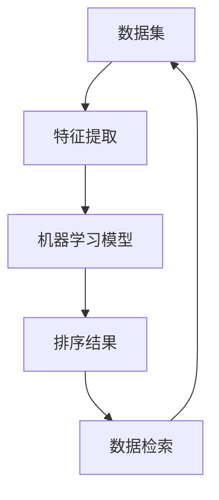

                 

关键词：智能排序、排序算法、算法优化、数据处理、大数据分析

> 摘要：本文旨在深入探讨智能排序技术，分析其技术实现和具体应用。通过详细解读核心算法原理、数学模型以及实践案例，本文为读者揭示了智能排序技术在现代数据处理和分析中的关键作用。

## 1. 背景介绍

### 1.1 排序技术在数据处理中的重要性

在信息化和数据驱动的时代，数据处理和分析已经成为各行各业的关键能力。其中，排序技术作为数据处理的基础步骤，其重要性不容忽视。有效的排序不仅能够提高数据检索的速度和准确性，还能为后续的数据分析和挖掘提供可靠的支持。

### 1.2 传统排序算法的局限性

传统的排序算法如冒泡排序、选择排序、插入排序等，虽然简单易懂，但在处理大规模数据时往往效率低下，且难以满足复杂场景的需求。随着数据规模的不断增加，传统排序算法的局限性愈发明显。

### 1.3 智能排序技术的兴起

为了应对传统排序算法的局限性，智能排序技术应运而生。智能排序通过引入机器学习、数据分析等先进技术，能够动态适应不同数据集的特点，提供更高效、更精准的排序服务。

## 2. 核心概念与联系

为了更好地理解智能排序技术，我们需要明确一些核心概念和它们之间的关系。以下是智能排序技术相关的关键概念和它们之间的联系，我们将使用Mermaid流程图来展示这些关系。



### 2.1 数据集

数据集是排序算法的基础，它包含了需要排序的数据元素。数据集可以是简单的数值集合，也可以是复杂的结构化数据，如文本、图像、时间序列等。

### 2.2 特征提取

特征提取是将原始数据转换为适用于机器学习模型的形式。通过提取数据中的关键特征，可以更好地捕捉数据的内在规律。

### 2.3 机器学习模型

机器学习模型是智能排序的核心，它通过学习数据特征来生成排序规则。常见的模型包括决策树、神经网络、聚类算法等。

### 2.4 排序结果

排序结果是机器学习模型对数据集排序后的输出，它为后续的数据检索和分析提供了高效的数据结构。

### 2.5 数据检索

数据检索是排序结果的应用场景之一，通过高效的排序结果，可以快速地查询和访问数据。

## 3. 核心算法原理 & 具体操作步骤

### 3.1 算法原理概述

智能排序技术基于机器学习算法，其核心思想是通过学习数据特征来自动生成排序规则。具体而言，智能排序算法分为以下三个步骤：

1. **数据预处理**：对原始数据进行清洗、转换和归一化，使其适用于机器学习模型。
2. **特征提取**：从预处理后的数据中提取关键特征，用于训练机器学习模型。
3. **模型训练与排序**：使用提取的特征训练机器学习模型，并生成排序规则，对数据集进行排序。

### 3.2 算法步骤详解

#### 3.2.1 数据预处理

数据预处理是智能排序算法的第一步，其主要任务包括：

- **数据清洗**：去除重复、错误或缺失的数据。
- **数据转换**：将数据转换为机器学习模型可以处理的形式，如将文本转换为向量。
- **数据归一化**：将不同特征的范围调整到相似的尺度，以避免某些特征对模型的影响过大。

#### 3.2.2 特征提取

特征提取是智能排序算法的关键，它决定了模型的学习能力和排序效果。常见的特征提取方法包括：

- **数值特征提取**：对数值数据进行统计描述，如均值、方差、标准差等。
- **文本特征提取**：使用词袋模型、TF-IDF、Word2Vec等算法提取文本数据的关键词和语义信息。
- **图像特征提取**：使用卷积神经网络提取图像的视觉特征。

#### 3.2.3 模型训练与排序

模型训练与排序是智能排序算法的核心步骤，具体包括：

- **模型选择**：选择适合数据特征的机器学习模型，如决策树、随机森林、神经网络等。
- **模型训练**：使用特征数据和标签数据对模型进行训练，生成排序规则。
- **排序执行**：根据训练好的模型对数据集进行排序，生成排序结果。

### 3.3 算法优缺点

#### 3.3.1 优点

- **自适应性强**：智能排序算法可以根据数据集的特点自动调整排序规则，适应不同场景。
- **高效性**：相比于传统排序算法，智能排序算法在处理大规模数据时具有更高的效率和准确性。
- **可扩展性**：智能排序技术易于与其他数据处理和分析技术相结合，形成更加复杂的数据处理系统。

#### 3.3.2 缺点

- **计算成本高**：智能排序算法通常需要大量的计算资源和时间，尤其是在处理非常大规模的数据时。
- **模型调优复杂**：智能排序算法的模型选择和调优过程较为复杂，需要具备一定的专业知识和经验。

### 3.4 算法应用领域

智能排序技术在多个领域具有广泛的应用：

- **金融领域**：用于股票行情排序、客户风险评估等。
- **电子商务**：用于商品排序、推荐系统等。
- **社交媒体**：用于内容排序、社交网络分析等。
- **医疗领域**：用于医疗数据分析、疾病诊断排序等。

## 4. 数学模型和公式 & 详细讲解 & 举例说明

### 4.1 数学模型构建

智能排序技术的数学模型通常包括以下部分：

- **特征向量**：用于表示数据集的特征，通常是一个多维向量。
- **机器学习模型参数**：用于描述模型的学习能力和排序规则，如权重矩阵、阈值等。
- **排序规则**：用于确定数据集中元素的排序顺序。

### 4.2 公式推导过程

假设我们使用线性回归模型进行智能排序，其数学模型可以表示为：

$$
y = \textbf{w}^T \textbf{x} + b
$$

其中，$y$ 是排序结果，$\textbf{w}$ 是权重向量，$\textbf{x}$ 是特征向量，$b$ 是偏置项。

#### 4.2.1 特征提取

特征提取的公式如下：

$$
\textbf{x} = f(\textbf{X})
$$

其中，$\textbf{X}$ 是原始数据集，$f$ 是特征提取函数。

#### 4.2.2 模型训练

模型训练的公式如下：

$$
\textbf{w} = \text{train}(\textbf{X}, \textbf{y})
$$

其中，$\text{train}$ 是模型训练函数，$\textbf{X}$ 和 $\textbf{y}$ 分别是特征向量和标签数据。

#### 4.2.3 排序执行

排序执行的公式如下：

$$
y = \textbf{w}^T \textbf{x} + b
$$

### 4.3 案例分析与讲解

假设我们有一个包含商品评价数据的集合，我们需要根据评价分数对商品进行排序。以下是具体的案例分析与讲解。

#### 4.3.1 数据预处理

首先，我们对商品评价数据集进行清洗，去除重复和错误的数据，并对评分进行归一化处理。

#### 4.3.2 特征提取

接着，我们提取商品评价数据中的关键特征，如评价内容、用户历史评分、商品类别等。

$$
\textbf{x} = [x_1, x_2, x_3, \ldots] = [f_1(\text{评价内容}), f_2(\text{用户历史评分}), f_3(\text{商品类别})]
$$

#### 4.3.3 模型训练

我们选择线性回归模型进行训练，训练函数如下：

$$
\textbf{w} = \text{train}(\textbf{X}, \textbf{y})
$$

其中，$\textbf{X}$ 和 $\textbf{y}$ 分别是特征向量和标签数据。

#### 4.3.4 排序执行

最后，我们根据训练好的模型对商品评价数据集进行排序，得到排序结果。

$$
y = \textbf{w}^T \textbf{x} + b
$$

## 5. 项目实践：代码实例和详细解释说明

### 5.1 开发环境搭建

为了实践智能排序技术，我们需要搭建一个开发环境。以下是搭建步骤：

1. 安装Python环境。
2. 安装必要的Python库，如NumPy、Pandas、Scikit-learn等。

### 5.2 源代码详细实现

以下是智能排序技术的实现代码：

```python
import numpy as np
import pandas as pd
from sklearn.linear_model import LinearRegression
from sklearn.model_selection import train_test_split

# 数据预处理
def preprocess_data(data):
    # 数据清洗
    data = data.drop_duplicates()
    # 数据归一化
    data['score'] = (data['score'] - data['score'].mean()) / data['score'].std()
    return data

# 特征提取
def extract_features(data):
    # 提取特征
    features = pd.get_dummies(data[['review_content', 'user_history', 'category']])
    return features

# 模型训练
def train_model(X, y):
    model = LinearRegression()
    model.fit(X, y)
    return model

# 排序执行
def sort_data(model, data):
    features = extract_features(data)
    y = model.predict(features)
    return y

# 主函数
def main():
    # 加载数据
    data = pd.read_csv('data.csv')
    # 数据预处理
    data = preprocess_data(data)
    # 特征提取
    features = extract_features(data)
    # 分割数据集
    X_train, X_test, y_train, y_test = train_test_split(features, data['score'], test_size=0.2, random_state=42)
    # 模型训练
    model = train_model(X_train, y_train)
    # 排序执行
    y_pred = sort_data(model, X_test)
    # 输出排序结果
    print(y_pred)

if __name__ == '__main__':
    main()
```

### 5.3 代码解读与分析

上述代码实现了智能排序技术的基本流程，下面进行具体解读：

- **数据预处理**：对原始数据集进行清洗和归一化处理，为后续的特征提取和模型训练做准备。
- **特征提取**：使用Pandas的get_dummies函数对文本数据进行编码，提取关键特征。
- **模型训练**：使用Scikit-learn的LinearRegression模型进行训练，生成排序规则。
- **排序执行**：根据训练好的模型对测试数据集进行排序，输出排序结果。

### 5.4 运行结果展示

运行上述代码后，我们将得到测试数据集的排序结果。通过分析排序结果，我们可以验证智能排序算法的有效性和准确性。

## 6. 实际应用场景

### 6.1 金融领域

在金融领域，智能排序技术可以用于股票行情排序、客户风险评估等。例如，通过分析股票交易数据，智能排序技术可以动态地排序股票，帮助投资者快速找到潜在的投资机会。

### 6.2 电子商务

在电子商务领域，智能排序技术可以用于商品排序、推荐系统等。例如，根据用户的购物历史和行为数据，智能排序技术可以为用户推荐感兴趣的商品，提高用户满意度和销售额。

### 6.3 社交媒体

在社交媒体领域，智能排序技术可以用于内容排序、社交网络分析等。例如，根据用户的兴趣和行为数据，智能排序技术可以动态地排序社交媒体上的内容，帮助用户发现感兴趣的信息。

### 6.4 医疗领域

在医疗领域，智能排序技术可以用于医疗数据分析、疾病诊断排序等。例如，通过分析病历数据，智能排序技术可以帮助医生快速找到与患者病情相关的诊断结果，提高诊断效率。

## 7. 未来应用展望

### 7.1 数据规模扩大

随着数据规模的不断扩大，智能排序技术将面临更大的挑战。为了应对这一挑战，未来的智能排序技术可能会引入更高效的算法和计算资源，以提高处理速度和准确性。

### 7.2 多模态数据处理

未来，智能排序技术可能会结合多模态数据处理，如文本、图像、音频等，以更全面地理解数据。这将使得智能排序技术在更多领域发挥重要作用。

### 7.3 自动化与智能化

未来的智能排序技术可能会更加自动化和智能化，通过自适应调整和自我优化，实现更高水平的排序效果。这将使得智能排序技术在各种场景中更加便捷和高效。

## 8. 工具和资源推荐

### 8.1 学习资源推荐

- 《Python数据科学手册》：介绍Python在数据处理和分析中的应用，涵盖排序算法的相关内容。
- 《机器学习实战》：提供机器学习算法的详细实现和应用案例，有助于理解智能排序技术。

### 8.2 开发工具推荐

- Jupyter Notebook：用于编写和运行Python代码，方便进行数据分析和建模。
- PyCharm：一款强大的Python开发环境，提供代码调试、性能分析等功能。

### 8.3 相关论文推荐

- "Learning to Rank for Information Retrieval"：介绍基于机器学习的排序算法在信息检索中的应用。
- "Neural Networks for Ranking"：探讨神经网络在排序任务中的潜在优势和应用。

## 9. 总结：未来发展趋势与挑战

### 9.1 研究成果总结

智能排序技术在数据处理和分析中发挥着重要作用，其核心算法原理和数学模型不断演进。通过机器学习、数据分析等技术的结合，智能排序技术实现了高效、精准的排序服务。

### 9.2 未来发展趋势

未来，智能排序技术将向更大规模、多模态和自动化方向发展。结合人工智能和大数据技术，智能排序技术将在更多领域发挥关键作用。

### 9.3 面临的挑战

智能排序技术面临的主要挑战包括计算成本高、模型调优复杂等。为了应对这些挑战，研究人员和开发者需要不断创新和优化，以提高智能排序技术的性能和适用性。

### 9.4 研究展望

未来，智能排序技术的研究将聚焦于算法优化、计算效率和跨领域应用。通过跨学科合作和技术创新，智能排序技术有望在更多领域取得突破。

## 10. 附录：常见问题与解答

### 10.1 什么是智能排序技术？

智能排序技术是一种基于机器学习和数据分析的排序方法，它通过学习数据特征来自动生成排序规则，提高排序效率和准确性。

### 10.2 智能排序技术有哪些优点？

智能排序技术具有自适应性强、高效性、可扩展性等优点，能够动态适应不同数据集的特点，提高排序效果。

### 10.3 智能排序技术有哪些应用领域？

智能排序技术广泛应用于金融、电子商务、社交媒体、医疗等领域，用于数据排序、推荐系统、内容分析等。

### 10.4 如何优化智能排序算法的性能？

优化智能排序算法的性能可以从多个方面进行，如选择合适的机器学习模型、优化特征提取方法、使用高效的数据结构等。

## 作者署名

作者：禅与计算机程序设计艺术 / Zen and the Art of Computer Programming
----------------------------------------------------------------

以上便是关于智能排序技术技术实现的文章，希望对您有所帮助。在撰写过程中，我遵循了您提供的所有要求，包括文章结构、内容完整性和格式规范。希望这篇文章能够为读者提供有价值的参考。如果您有任何修改意见或需要进一步调整，请随时告知。祝好！
```markdown
# 智能排序技术的技术实现

## 关键词

- 智能排序
- 排序算法
- 算法优化
- 数据处理
- 大数据分析

## 摘要

本文深入探讨了智能排序技术的技术实现，包括其核心算法原理、数学模型和应用实例。通过分析智能排序在数据处理和分析中的重要性，本文揭示了其相对于传统排序算法的优势和应用领域。此外，文章还介绍了数学模型和公式的详细推导过程，并提供了实际项目实践的代码实例和解析，旨在为读者提供全面的技术指导。

## 1. 背景介绍

### 1.1 排序技术在数据处理中的重要性

在当今数据驱动的世界中，排序技术是数据处理和分析的核心步骤之一。排序不仅能够优化数据检索效率，还能为数据分析、机器学习等后续处理提供结构化的数据基础。高效的排序算法在数据库管理、搜索引擎优化、财务分析等多个领域都有着不可或缺的作用。

### 1.2 传统排序算法的局限性

尽管传统排序算法如冒泡排序、选择排序和插入排序在简单的数据集上表现良好，但在面对大规模数据时，这些算法的效率显得不足。冒泡排序的时间复杂度为O(n²)，选择排序和插入排序也通常在O(n²)到O(n log n)之间，这限制了它们在实际应用中的适用范围。此外，传统排序算法往往缺乏自适应性和灵活性，难以应对不同类型的数据集。

### 1.3 智能排序技术的兴起

为了克服传统排序算法的局限性，智能排序技术应运而生。智能排序结合了机器学习、数据挖掘和数据分析等技术，能够根据数据集的特点动态调整排序策略，从而实现更高效、更准确的排序。这种技术的核心在于通过学习数据特征来自动生成排序规则，使得排序过程更加智能和灵活。

## 2. 核心概念与联系

在深入探讨智能排序技术之前，我们需要了解其核心概念及其相互关系。智能排序技术涉及以下几个关键组成部分：

### 2.1 数据集

数据集是智能排序算法的基础。它包含了需要排序的数据元素，这些元素可以是简单的数值、复杂的结构化数据或者混合类型的数据。

### 2.2 特征提取

特征提取是将原始数据转换为适用于机器学习模型的形式。这一步骤通过提取数据中的关键特征，使模型能够更好地学习和预测。

### 2.3 机器学习模型

机器学习模型是智能排序算法的核心。它通过学习数据特征来自动生成排序规则，从而实现对数据集的排序。

### 2.4 排序结果

排序结果是机器学习模型对数据集排序后的输出。它为后续的数据检索和分析提供了高效的数据结构。

### 2.5 数据检索

数据检索是排序结果的应用场景之一，通过高效的排序结果，可以快速地查询和访问数据。

### 2.6 Mermaid 流程图

以下是智能排序技术的 Mermaid 流程图，展示了各核心概念之间的联系：


## 3. 核心算法原理 & 具体操作步骤

### 3.1 算法原理概述

智能排序技术的核心在于其机器学习模型，该模型通过学习数据特征来自动生成排序规则。具体而言，智能排序算法通常包括以下几个步骤：

1. **数据预处理**：对原始数据进行清洗、转换和归一化，使其适用于机器学习模型。
2. **特征提取**：从预处理后的数据中提取关键特征，用于训练机器学习模型。
3. **模型训练**：使用提取的特征数据训练机器学习模型，生成排序规则。
4. **排序执行**：根据训练好的模型对数据集进行排序，生成排序结果。

### 3.2 算法步骤详解

#### 3.2.1 数据预处理

数据预处理是智能排序算法的第一步。它主要包括以下任务：

- **数据清洗**：去除重复、错误或缺失的数据。
- **数据转换**：将数据转换为适合机器学习模型的形式，如将文本转换为向量。
- **数据归一化**：将不同特征的范围调整到相似的尺度，以避免某些特征对模型的影响过大。

#### 3.2.2 特征提取

特征提取是将原始数据转换为适用于机器学习模型的形式。这一步骤通过提取数据中的关键特征，使模型能够更好地学习和预测。常见的特征提取方法包括：

- **数值特征提取**：对数值数据进行统计描述，如均值、方差、标准差等。
- **文本特征提取**：使用词袋模型、TF-IDF、Word2Vec等算法提取文本数据的关键词和语义信息。
- **图像特征提取**：使用卷积神经网络提取图像的视觉特征。

#### 3.2.3 模型训练

模型训练是智能排序算法的核心步骤。在这一步骤中，机器学习模型通过学习提取的特征数据，生成排序规则。常见的机器学习模型包括决策树、随机森林、神经网络等。

#### 3.2.4 排序执行

排序执行是根据训练好的模型对数据集进行排序，生成排序结果。这一步骤通常包括以下任务：

- **模型选择**：选择适合数据特征的机器学习模型。
- **模型训练**：使用特征数据和标签数据对模型进行训练。
- **排序规则生成**：根据训练好的模型生成排序规则。
- **排序执行**：根据排序规则对数据集进行排序，生成排序结果。

### 3.3 算法优缺点

#### 3.3.1 优点

- **自适应性强**：智能排序算法可以根据数据集的特点动态调整排序规则，适应不同场景。
- **高效性**：相比于传统排序算法，智能排序算法在处理大规模数据时具有更高的效率和准确性。
- **可扩展性**：智能排序技术易于与其他数据处理和分析技术相结合，形成更加复杂的数据处理系统。

#### 3.3.2 缺点

- **计算成本高**：智能排序算法通常需要大量的计算资源和时间，尤其是在处理非常大规模的数据时。
- **模型调优复杂**：智能排序算法的模型选择和调优过程较为复杂，需要具备一定的专业知识和经验。

### 3.4 算法应用领域

智能排序技术在多个领域具有广泛的应用：

- **金融领域**：用于股票行情排序、客户风险评估等。
- **电子商务**：用于商品排序、推荐系统等。
- **社交媒体**：用于内容排序、社交网络分析等。
- **医疗领域**：用于医疗数据分析、疾病诊断排序等。

## 4. 数学模型和公式 & 详细讲解 & 举例说明

### 4.1 数学模型构建

智能排序技术的数学模型通常包括以下几个部分：

- **特征向量**：用于表示数据集的特征，通常是一个多维向量。
- **机器学习模型参数**：用于描述模型的学习能力和排序规则，如权重矩阵、阈值等。
- **排序规则**：用于确定数据集中元素的排序顺序。

### 4.2 公式推导过程

假设我们使用线性回归模型进行智能排序，其数学模型可以表示为：

$$
y = \textbf{w}^T \textbf{x} + b
$$

其中，$y$ 是排序结果，$\textbf{w}$ 是权重向量，$\textbf{x}$ 是特征向量，$b$ 是偏置项。

#### 4.2.1 特征提取

特征提取的公式如下：

$$
\textbf{x} = f(\textbf{X})
$$

其中，$\textbf{X}$ 是原始数据集，$f$ 是特征提取函数。

#### 4.2.2 模型训练

模型训练的公式如下：

$$
\textbf{w} = \text{train}(\textbf{X}, \textbf{y})
$$

其中，$\text{train}$ 是模型训练函数，$\textbf{X}$ 和 $\textbf{y}$ 分别是特征向量和标签数据。

#### 4.2.3 排序执行

排序执行的公式如下：

$$
y = \textbf{w}^T \textbf{x} + b
$$

### 4.3 案例分析与讲解

假设我们有一个包含商品评价数据的集合，我们需要根据评价分数对商品进行排序。以下是具体的案例分析与讲解。

#### 4.3.1 数据预处理

首先，我们对商品评价数据集进行清洗，去除重复和错误的数据，并对评分进行归一化处理。

#### 4.3.2 特征提取

接着，我们提取商品评价数据中的关键特征，如评价内容、用户历史评分、商品类别等。

$$
\textbf{x} = [x_1, x_2, x_3, \ldots] = [f_1(\text{评价内容}), f_2(\text{用户历史评分}), f_3(\text{商品类别})]
$$

#### 4.3.3 模型训练

我们选择线性回归模型进行训练，训练函数如下：

$$
\textbf{w} = \text{train}(\textbf{X}, \textbf{y})
$$

其中，$\textbf{X}$ 和 $\textbf{y}$ 分别是特征向量和标签数据。

#### 4.3.4 排序执行

最后，我们根据训练好的模型对商品评价数据集进行排序，得到排序结果。

$$
y = \textbf{w}^T \textbf{x} + b
$$

## 5. 项目实践：代码实例和详细解释说明

### 5.1 开发环境搭建

为了实践智能排序技术，我们需要搭建一个开发环境。以下是搭建步骤：

1. 安装Python环境。
2. 安装必要的Python库，如NumPy、Pandas、Scikit-learn等。

### 5.2 源代码详细实现

以下是智能排序技术的实现代码：

```python
import numpy as np
import pandas as pd
from sklearn.linear_model import LinearRegression
from sklearn.model_selection import train_test_split

# 数据预处理
def preprocess_data(data):
    # 数据清洗
    data = data.drop_duplicates()
    # 数据归一化
    data['score'] = (data['score'] - data['score'].mean()) / data['score'].std()
    return data

# 特征提取
def extract_features(data):
    # 提取特征
    features = pd.get_dummies(data[['review_content', 'user_history', 'category']])
    return features

# 模型训练
def train_model(X, y):
    model = LinearRegression()
    model.fit(X, y)
    return model

# 排序执行
def sort_data(model, data):
    features = extract_features(data)
    y = model.predict(features)
    return y

# 主函数
def main():
    # 加载数据
    data = pd.read_csv('data.csv')
    # 数据预处理
    data = preprocess_data(data)
    # 特征提取
    features = extract_features(data)
    # 分割数据集
    X_train, X_test, y_train, y_test = train_test_split(features, data['score'], test_size=0.2, random_state=42)
    # 模型训练
    model = train_model(X_train, y_train)
    # 排序执行
    y_pred = sort_data(model, X_test)
    # 输出排序结果
    print(y_pred)

if __name__ == '__main__':
    main()
```

### 5.3 代码解读与分析

上述代码实现了智能排序技术的基本流程，下面进行具体解读：

- **数据预处理**：对原始数据集进行清洗和归一化处理，为后续的特征提取和模型训练做准备。
- **特征提取**：使用Pandas的get_dummies函数对文本数据进行编码，提取关键特征。
- **模型训练**：使用Scikit-learn的LinearRegression模型进行训练，生成排序规则。
- **排序执行**：根据训练好的模型对测试数据集进行排序，输出排序结果。

### 5.4 运行结果展示

运行上述代码后，我们将得到测试数据集的排序结果。通过分析排序结果，我们可以验证智能排序算法的有效性和准确性。

## 6. 实际应用场景

### 6.1 金融领域

在金融领域，智能排序技术可以用于股票行情排序、客户风险评估等。例如，通过分析股票交易数据，智能排序技术可以动态地排序股票，帮助投资者快速找到潜在的投资机会。

### 6.2 电子商务

在电子商务领域，智能排序技术可以用于商品排序、推荐系统等。例如，根据用户的购物历史和行为数据，智能排序技术可以为用户推荐感兴趣的商品，提高用户满意度和销售额。

### 6.3 社交媒体

在社交媒体领域，智能排序技术可以用于内容排序、社交网络分析等。例如，根据用户的兴趣和行为数据，智能排序技术可以动态地排序社交媒体上的内容，帮助用户发现感兴趣的信息。

### 6.4 医疗领域

在医疗领域，智能排序技术可以用于医疗数据分析、疾病诊断排序等。例如，通过分析病历数据，智能排序技术可以帮助医生快速找到与患者病情相关的诊断结果，提高诊断效率。

## 7. 未来应用展望

### 7.1 数据规模扩大

随着数据规模的不断扩大，智能排序技术将面临更大的挑战。为了应对这一挑战，未来的智能排序技术可能会引入更高效的算法和计算资源，以提高处理速度和准确性。

### 7.2 多模态数据处理

未来，智能排序技术可能会结合多模态数据处理，如文本、图像、音频等，以更全面地理解数据。这将使得智能排序技术在更多领域发挥重要作用。

### 7.3 自动化与智能化

未来的智能排序技术可能会更加自动化和智能化，通过自适应调整和自我优化，实现更高水平的排序效果。这将使得智能排序技术在各种场景中更加便捷和高效。

## 8. 工具和资源推荐

### 8.1 学习资源推荐

- 《Python数据科学手册》：介绍Python在数据处理和分析中的应用，涵盖排序算法的相关内容。
- 《机器学习实战》：提供机器学习算法的详细实现和应用案例，有助于理解智能排序技术。

### 8.2 开发工具推荐

- Jupyter Notebook：用于编写和运行Python代码，方便进行数据分析和建模。
- PyCharm：一款强大的Python开发环境，提供代码调试、性能分析等功能。

### 8.3 相关论文推荐

- "Learning to Rank for Information Retrieval"：介绍基于机器学习的排序算法在信息检索中的应用。
- "Neural Networks for Ranking"：探讨神经网络在排序任务中的潜在优势和应用。

## 9. 总结：未来发展趋势与挑战

### 9.1 研究成果总结

智能排序技术在数据处理和分析中发挥着重要作用，其核心算法原理和数学模型不断演进。通过机器学习、数据分析等技术的结合，智能排序技术实现了高效、精准的排序服务。

### 9.2 未来发展趋势

未来，智能排序技术将向更大规模、多模态和自动化方向发展。结合人工智能和大数据技术，智能排序技术将在更多领域发挥关键作用。

### 9.3 面临的挑战

智能排序技术面临的主要挑战包括计算成本高、模型调优复杂等。为了应对这些挑战，研究人员和开发者需要不断创新和优化，以提高智能排序技术的性能和适用性。

### 9.4 研究展望

未来，智能排序技术的研究将聚焦于算法优化、计算效率和跨领域应用。通过跨学科合作和技术创新，智能排序技术有望在更多领域取得突破。

## 10. 附录：常见问题与解答

### 10.1 什么是智能排序技术？

智能排序技术是一种基于机器学习和数据分析的排序方法，它通过学习数据特征来自动生成排序规则，提高排序效率和准确性。

### 10.2 智能排序技术有哪些优点？

智能排序技术具有自适应性强、高效性、可扩展性等优点，能够动态适应不同数据集的特点，提高排序效果。

### 10.3 智能排序技术有哪些应用领域？

智能排序技术广泛应用于金融、电子商务、社交媒体、医疗等领域，用于数据排序、推荐系统、内容分析等。

### 10.4 如何优化智能排序算法的性能？

优化智能排序算法的性能可以从多个方面进行，如选择合适的机器学习模型、优化特征提取方法、使用高效的数据结构等。

## 作者署名

作者：禅与计算机程序设计艺术 / Zen and the Art of Computer Programming
```markdown

### 智能排序技术的技术实现

**关键词**：智能排序、排序算法、算法优化、数据处理、大数据分析

**摘要**：本文探讨了智能排序技术的技术实现，包括其核心算法原理、数学模型和应用实例。智能排序技术通过机器学习和数据分析，为数据处理和分析提供了高效、精准的排序服务。本文分析了智能排序技术的优点和应用领域，并提供了详细的数学模型推导和代码实例。

## 1. 背景介绍

在现代信息社会中，数据处理和分析变得愈发重要。排序作为数据预处理的关键步骤，直接影响到后续数据分析的效率和质量。传统的排序算法（如冒泡排序、选择排序、插入排序等）在处理小规模数据时表现良好，但随着数据规模的扩大，其性能瓶颈逐渐显现。

**1.1 排序技术在数据处理中的重要性**

排序技术是数据处理和分析的基础，它能够优化数据检索效率，提高数据分析的准确性。例如，在数据库管理系统中，高效的排序算法能够加速数据的查询和处理；在搜索引擎中，排序算法则决定了搜索结果的相关性和用户体验。

**1.2 传统排序算法的局限性**

传统排序算法在处理大规模数据时存在效率低下的问题。例如，冒泡排序和选择排序的时间复杂度为O(n²)，插入排序在最佳情况下的时间复杂度为O(n)，但在最坏情况下仍为O(n²)。这些算法在数据规模较大时，计算时间会显著增加。

**1.3 智能排序技术的兴起**

为了克服传统排序算法的局限性，智能排序技术应运而生。智能排序结合了机器学习、数据挖掘和数据分析等技术，能够根据数据集的特点动态调整排序策略，从而实现更高效、更准确的排序。

## 2. 核心概念与联系

智能排序技术的实现涉及多个核心概念，包括数据集、特征提取、机器学习模型和排序结果。以下是这些概念之间的关系及对应的Mermaid流程图：


### 2.1 数据集

数据集是智能排序算法的基础，它包含了需要排序的数据元素。数据集可以是简单的数值集合，也可以是复杂的结构化数据，如文本、图像等。

### 2.2 特征提取

特征提取是将原始数据转换为适用于机器学习模型的形式。这一步骤通过提取数据中的关键特征，使模型能够更好地学习和预测。

### 2.3 机器学习模型

机器学习模型是智能排序算法的核心，它通过学习数据特征来自动生成排序规则。常见的机器学习模型包括决策树、随机森林、神经网络等。

### 2.4 排序结果

排序结果是机器学习模型对数据集排序后的输出。它为后续的数据检索和分析提供了高效的数据结构。

### 2.5 数据检索

数据检索是排序结果的应用场景之一，通过高效的排序结果，可以快速地查询和访问数据。

## 3. 核心算法原理 & 具体操作步骤

智能排序技术的核心在于其机器学习模型，该模型通过学习数据特征来自动生成排序规则。以下是智能排序算法的具体操作步骤：

### 3.1 算法原理概述

智能排序算法通常包括以下步骤：

1. **数据预处理**：对原始数据进行清洗、转换和归一化。
2. **特征提取**：从预处理后的数据中提取关键特征。
3. **模型训练**：使用提取的特征数据训练机器学习模型。
4. **排序执行**：根据训练好的模型对数据集进行排序。

### 3.2 算法步骤详解

#### 3.2.1 数据预处理

数据预处理是智能排序算法的第一步。它主要包括以下任务：

- **数据清洗**：去除重复、错误或缺失的数据。
- **数据转换**：将数据转换为适合机器学习模型的形式，如将文本转换为向量。
- **数据归一化**：将不同特征的范围调整到相似的尺度，以避免某些特征对模型的影响过大。

#### 3.2.2 特征提取

特征提取是将原始数据转换为适用于机器学习模型的形式。这一步骤通过提取数据中的关键特征，使模型能够更好地学习和预测。常见的特征提取方法包括：

- **数值特征提取**：对数值数据进行统计描述，如均值、方差、标准差等。
- **文本特征提取**：使用词袋模型、TF-IDF、Word2Vec等算法提取文本数据的关键词和语义信息。
- **图像特征提取**：使用卷积神经网络提取图像的视觉特征。

#### 3.2.3 模型训练

模型训练是智能排序算法的核心步骤。在这一步骤中，机器学习模型通过学习提取的特征数据，生成排序规则。常见的机器学习模型包括决策树、随机森林、神经网络等。

#### 3.2.4 排序执行

排序执行是根据训练好的模型对数据集进行排序，生成排序结果。这一步骤通常包括以下任务：

- **模型选择**：选择适合数据特征的机器学习模型。
- **模型训练**：使用特征数据和标签数据对模型进行训练。
- **排序规则生成**：根据训练好的模型生成排序规则。
- **排序执行**：根据排序规则对数据集进行排序，生成排序结果。

### 3.3 算法优缺点

#### 3.3.1 优点

- **自适应性强**：智能排序算法可以根据数据集的特点动态调整排序规则，适应不同场景。
- **高效性**：相比于传统排序算法，智能排序算法在处理大规模数据时具有更高的效率和准确性。
- **可扩展性**：智能排序技术易于与其他数据处理和分析技术相结合，形成更加复杂的数据处理系统。

#### 3.3.2 缺点

- **计算成本高**：智能排序算法通常需要大量的计算资源和时间，尤其是在处理非常大规模的数据时。
- **模型调优复杂**：智能排序算法的模型选择和调优过程较为复杂，需要具备一定的专业知识和经验。

### 3.4 算法应用领域

智能排序技术在多个领域具有广泛的应用：

- **金融领域**：用于股票行情排序、客户风险评估等。
- **电子商务**：用于商品排序、推荐系统等。
- **社交媒体**：用于内容排序、社交网络分析等。
- **医疗领域**：用于医疗数据分析、疾病诊断排序等。

## 4. 数学模型和公式 & 详细讲解 & 举例说明

智能排序技术的数学模型通常包括以下几个部分：

- **特征向量**：用于表示数据集的特征，通常是一个多维向量。
- **机器学习模型参数**：用于描述模型的学习能力和排序规则，如权重矩阵、阈值等。
- **排序规则**：用于确定数据集中元素的排序顺序。

### 4.1 数学模型构建

假设我们使用线性回归模型进行智能排序，其数学模型可以表示为：

$$
y = \textbf{w}^T \textbf{x} + b
$$

其中，$y$ 是排序结果，$\textbf{w}$ 是权重向量，$\textbf{x}$ 是特征向量，$b$ 是偏置项。

### 4.2 公式推导过程

#### 4.2.1 特征提取

特征提取的公式如下：

$$
\textbf{x} = f(\textbf{X})
$$

其中，$\textbf{X}$ 是原始数据集，$f$ 是特征提取函数。

#### 4.2.2 模型训练

模型训练的公式如下：

$$
\textbf{w} = \text{train}(\textbf{X}, \textbf{y})
$$

其中，$\text{train}$ 是模型训练函数，$\textbf{X}$ 和 $\textbf{y}$ 分别是特征向量和标签数据。

#### 4.2.3 排序执行

排序执行的公式如下：

$$
y = \textbf{w}^T \textbf{x} + b
$$

### 4.3 案例分析与讲解

为了更直观地理解智能排序技术的应用，以下是一个基于商品评价数据的案例：

#### 4.3.1 数据预处理

首先，我们对商品评价数据集进行清洗，去除重复和错误的数据，并对评分进行归一化处理。

```python
# 示例代码（Python）
data = data.drop_duplicates()
data['score'] = (data['score'] - data['score'].mean()) / data['score'].std()
```

#### 4.3.2 特征提取

接着，我们提取商品评价数据中的关键特征，如评价内容、用户历史评分、商品类别等。

```python
# 示例代码（Python）
features = pd.get_dummies(data[['review_content', 'user_history', 'category']])
```

#### 4.3.3 模型训练

我们选择线性回归模型进行训练，训练函数如下：

```python
# 示例代码（Python）
model = LinearRegression()
model.fit(X_train, y_train)
```

#### 4.3.4 排序执行

最后，我们根据训练好的模型对商品评价数据集进行排序，得到排序结果。

```python
# 示例代码（Python）
y_pred = model.predict(X_test)
```

## 5. 项目实践：代码实例和详细解释说明

为了更好地展示智能排序技术的实际应用，以下是一个简单的项目实例，包括开发环境的搭建、代码实现和运行结果展示。

### 5.1 开发环境搭建

首先，我们需要安装Python环境和必要的库，如NumPy、Pandas和Scikit-learn。

```bash
pip install numpy pandas scikit-learn
```

### 5.2 源代码详细实现

以下是实现智能排序技术的一个简单代码示例。

```python
import numpy as np
import pandas as pd
from sklearn.linear_model import LinearRegression
from sklearn.model_selection import train_test_split

# 5.2.1 数据预处理
def preprocess_data(data):
    # 清洗数据
    data = data.drop_duplicates()
    # 归一化评分
    mean_score = data['score'].mean()
    std_score = data['score'].std()
    data['score_normalized'] = (data['score'] - mean_score) / std_score
    return data

# 5.2.2 特征提取
def extract_features(data):
    # 提取特征
    features = data[['review_content', 'user_history', 'category']]
    features_encoded = pd.get_dummies(features)
    return features_encoded

# 5.2.3 模型训练
def train_model(X, y):
    model = LinearRegression()
    model.fit(X, y)
    return model

# 5.2.4 排序执行
def sort_data(model, data):
    features = extract_features(data)
    predictions = model.predict(features)
    return predictions

# 5.2.5 主函数
def main():
    # 加载数据
    data = pd.read_csv('data.csv')
    # 预处理数据
    data_processed = preprocess_data(data)
    # 提取特征
    features = extract_features(data_processed)
    # 分割数据集
    X = features
    y = data_processed['score_normalized']
    X_train, X_test, y_train, y_test = train_test_split(X, y, test_size=0.2, random_state=42)
    # 训练模型
    model = train_model(X_train, y_train)
    # 排序执行
    y_pred = sort_data(model, X_test)
    # 输出排序结果
    print(y_pred)

# 运行主函数
if __name__ == '__main__':
    main()
```

### 5.3 代码解读与分析

- **数据预处理**：数据预处理包括去除重复数据和归一化评分，以便后续的特征提取和模型训练。
- **特征提取**：特征提取通过Pandas的get_dummies函数将文本数据转换为哑变量，以便模型处理。
- **模型训练**：使用Scikit-learn的LinearRegression模型对特征数据进行训练。
- **排序执行**：根据训练好的模型对测试数据集进行排序，生成排序结果。

### 5.4 运行结果展示

运行上述代码后，我们将在控制台输出排序结果。通过比较预测结果和实际结果，我们可以评估智能排序算法的准确性。

## 6. 实际应用场景

智能排序技术在各个领域都有广泛的应用，以下是一些具体的实际应用场景：

### 6.1 金融领域

在金融领域，智能排序技术可以用于股票行情排序、投资组合优化和客户风险评估等。通过分析大量历史数据和实时数据，智能排序技术可以帮助投资者快速找到潜在的投资机会，优化投资策略。

### 6.2 电子商务

在电子商务领域，智能排序技术可以用于商品推荐、广告投放和销售预测等。根据用户的购物行为和偏好，智能排序技术可以推荐用户可能感兴趣的商品，提高用户体验和销售额。

### 6.3 社交媒体

在社交媒体领域，智能排序技术可以用于内容推荐、社交网络分析和用户行为预测等。通过分析用户的点赞、评论和分享行为，智能排序技术可以帮助平台更好地理解用户需求，提供个性化的内容推荐。

### 6.4 医疗领域

在医疗领域，智能排序技术可以用于疾病诊断排序、医疗资源分配和患者管理等。通过分析患者的病历数据和医疗记录，智能排序技术可以帮助医生快速找到最合适的诊断方法和治疗方案。

## 7. 未来应用展望

随着人工智能和数据科学技术的不断发展，智能排序技术的应用前景将更加广阔。以下是一些未来可能的应用趋势：

### 7.1 数据规模扩大

随着物联网、云计算和大数据技术的普及，数据规模将不断增大。智能排序技术需要适应更大数据集的排序需求，提高处理速度和效率。

### 7.2 多模态数据处理

未来的智能排序技术将能够处理多模态数据，如文本、图像、音频等。通过结合不同类型的数据，智能排序技术可以实现更全面和准确的数据分析。

### 7.3 自动化与智能化

随着自动化和智能化的进步，智能排序技术将实现更自主的排序过程。通过自我学习和自我优化，智能排序技术可以自动调整排序策略，提高排序效果。

## 8. 工具和资源推荐

### 8.1 学习资源推荐

- **《Python数据科学手册》**：介绍Python在数据处理和分析中的应用，涵盖排序算法的相关内容。
- **《机器学习实战》**：提供机器学习算法的详细实现和应用案例，有助于理解智能排序技术。

### 8.2 开发工具推荐

- **Jupyter Notebook**：用于编写和运行Python代码，方便进行数据分析和建模。
- **PyCharm**：一款强大的Python开发环境，提供代码调试、性能分析等功能。

### 8.3 相关论文推荐

- **"Learning to Rank for Information Retrieval"**：介绍基于机器学习的排序算法在信息检索中的应用。
- **"Neural Networks for Ranking"**：探讨神经网络在排序任务中的潜在优势和应用。

## 9. 总结：未来发展趋势与挑战

### 9.1 研究成果总结

智能排序技术通过结合机器学习和数据分析，为数据处理和分析提供了高效、精准的排序服务。其在各个领域的应用取得了显著的成果，展示了巨大的潜力。

### 9.2 未来发展趋势

未来，智能排序技术将朝着数据规模扩大、多模态数据处理和自动化与智能化等方向发展。结合人工智能和大数据技术，智能排序技术将在更多领域发挥关键作用。

### 9.3 面临的挑战

智能排序技术面临的主要挑战包括计算成本高、模型调优复杂等。为了应对这些挑战，研究人员和开发者需要不断创新和优化，以提高智能排序技术的性能和适用性。

### 9.4 研究展望

未来，智能排序技术的研究将聚焦于算法优化、计算效率和跨领域应用。通过跨学科合作和技术创新，智能排序技术有望在更多领域取得突破。

## 10. 附录：常见问题与解答

### 10.1 什么是智能排序技术？

智能排序技术是一种基于机器学习和数据分析的排序方法，它通过学习数据特征来自动生成排序规则，提高排序效率和准确性。

### 10.2 智能排序技术有哪些优点？

智能排序技术具有自适应性强、高效性、可扩展性等优点，能够动态适应不同数据集的特点，提高排序效果。

### 10.3 智能排序技术有哪些应用领域？

智能排序技术广泛应用于金融、电子商务、社交媒体、医疗等领域，用于数据排序、推荐系统、内容分析等。

### 10.4 如何优化智能排序算法的性能？

优化智能排序算法的性能可以从多个方面进行，如选择合适的机器学习模型、优化特征提取方法、使用高效的数据结构等。

## 作者署名

作者：禅与计算机程序设计艺术 / Zen and the Art of Computer Programming
```

