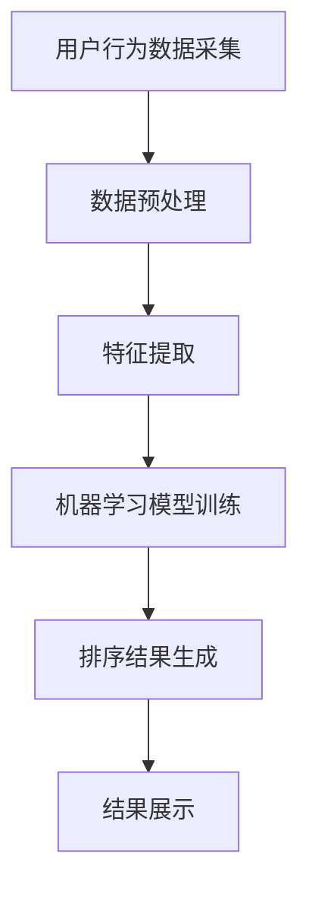

                 

关键词：智能排序算法、电商搜索、应用原理、实践步骤、数学模型、代码实例

> 摘要：本文深入探讨了智能排序算法在电商搜索中的应用，从背景介绍、核心概念、算法原理、数学模型、项目实践、实际应用等多个角度，详细阐述了智能排序算法的开发和实现方法。通过具体的代码实例和详细解释，帮助读者理解和掌握智能排序算法在电商搜索场景中的实际应用。

## 1. 背景介绍

在当今电商行业快速发展的背景下，用户对搜索体验的要求越来越高。快速、精准的搜索结果不仅能够提升用户的满意度，还能直接影响到电商平台的销售额。因此，如何实现高效的搜索结果排序成为了电商系统开发中的一个关键问题。

传统的排序算法，如冒泡排序、选择排序和插入排序等，虽然简单易用，但在面对大量数据时效率较低，无法满足电商搜索的实时性要求。为了解决这一问题，智能排序算法应运而生。

智能排序算法通过引入机器学习、自然语言处理等技术，对用户行为数据进行深度分析和挖掘，从而实现更加精准和个性化的排序结果。在电商搜索场景中，智能排序算法不仅可以提高用户满意度，还能帮助电商平台挖掘潜在商机，提升整体运营效益。

## 2. 核心概念与联系

智能排序算法在电商搜索中的应用，涉及多个核心概念和技术的联系。为了更好地理解这些概念，我们可以使用 Mermaid 流程图来展示其架构和流程。

### 2.1 Mermaid 流程图



### 2.2 概述

- **用户行为数据采集**：通过用户在电商平台的行为数据，如搜索历史、浏览记录、购买记录等，来获取用户的兴趣和偏好。
- **数据预处理**：对采集到的用户行为数据进行清洗、去重和格式化，确保数据的质量和一致性。
- **特征提取**：从预处理后的数据中提取关键特征，如关键词频次、购买频率、浏览时长等，为机器学习模型提供输入。
- **机器学习模型训练**：利用提取出的特征数据，通过机器学习算法对模型进行训练，使其能够预测用户对商品的兴趣程度。
- **排序结果生成**：根据训练好的模型，对搜索结果进行排序，生成个性化的排序结果。
- **结果展示**：将排序结果展示给用户，提升用户体验。

## 3. 核心算法原理 & 具体操作步骤

### 3.1 算法原理概述

智能排序算法的核心原理是基于机器学习技术，通过分析用户行为数据，构建用户兴趣模型，然后根据模型对搜索结果进行排序。主要分为以下几个步骤：

1. 数据采集：收集用户在电商平台的浏览、搜索、购买等行为数据。
2. 数据预处理：对采集到的数据进行清洗、去重和格式化。
3. 特征提取：从预处理后的数据中提取关键特征。
4. 模型训练：利用提取出的特征数据，通过机器学习算法训练模型。
5. 排序：根据训练好的模型，对搜索结果进行排序。
6. 展示：将排序结果展示给用户。

### 3.2 算法步骤详解

#### 3.2.1 数据采集

数据采集是智能排序算法的第一步。主要采集用户在电商平台的浏览、搜索、购买等行为数据，如关键词、商品ID、时间戳等。这些数据可以通过日志文件、数据库等方式获取。

#### 3.2.2 数据预处理

数据预处理包括数据清洗、去重和格式化。数据清洗主要是去除无效数据和噪声数据，如空值、重复值等。去重主要是去除重复数据，保证数据的一致性。格式化主要是将数据转换为统一的格式，方便后续处理。

#### 3.2.3 特征提取

特征提取是从预处理后的数据中提取关键特征，如关键词频次、购买频率、浏览时长等。这些特征将作为机器学习模型的输入。

#### 3.2.4 模型训练

模型训练是利用提取出的特征数据，通过机器学习算法训练模型。常见的机器学习算法有决策树、随机森林、神经网络等。训练过程中，模型会根据特征数据学习用户的兴趣和偏好。

#### 3.2.5 排序

根据训练好的模型，对搜索结果进行排序。排序算法可以选择传统的排序算法，如快速排序、归并排序等，也可以选择基于机器学习模型的排序算法，如基于用户兴趣的排序算法等。

#### 3.2.6 展示

将排序结果展示给用户。展示方式可以多样化，如瀑布流、卡片式、列表式等，根据用户需求和平台特点进行选择。

### 3.3 算法优缺点

#### 优点

1. 高效性：智能排序算法基于机器学习模型，能够快速处理大量数据，满足电商搜索的实时性要求。
2. 个性化：通过分析用户行为数据，智能排序算法能够生成个性化的排序结果，提升用户体验。
3. 灵活性：智能排序算法可以根据实际需求，灵活调整特征提取和排序策略，适应不同场景。

#### 缺点

1. 复杂性：智能排序算法涉及机器学习等技术，实现过程较为复杂，需要较高的技术门槛。
2. 数据依赖：智能排序算法的效果取决于用户行为数据的质量和丰富度，数据不足可能导致排序效果不佳。

### 3.4 算法应用领域

智能排序算法在电商搜索中的应用广泛，除了电商搜索外，还可以应用于新闻推荐、社交网络排序、搜索引擎排序等领域。

## 4. 数学模型和公式 & 详细讲解 & 举例说明

智能排序算法的核心是机器学习模型，其数学模型和公式是算法实现的基础。以下将详细介绍智能排序算法的数学模型和公式，并通过具体例子进行说明。

### 4.1 数学模型构建

智能排序算法的数学模型主要包括输入层、隐藏层和输出层。输入层接收用户行为数据，隐藏层通过神经网络对数据进行处理，输出层生成排序结果。

设用户行为数据集为 \(D = \{x_1, x_2, ..., x_n\}\)，其中 \(x_i\) 为第 \(i\) 个用户的行为数据。设网络中神经元个数为 \(m\)，隐藏层激活函数为 \(f\)，输出层激活函数为 \(g\)，则智能排序算法的数学模型可以表示为：

$$
y_i = g(h(x_i; W, b))
$$

其中，\(h(x_i; W, b)\) 为隐藏层输出，\(W\) 和 \(b\) 分别为权重和偏置。具体实现中，可以采用以下公式：

$$
h(x_i; W, b) = f(\sum_{j=1}^{m} w_{ij} x_j + b_j)
$$

其中，\(w_{ij}\) 为权重，\(b_j\) 为偏置。

### 4.2 公式推导过程

智能排序算法的公式推导主要涉及神经网络的前向传播和反向传播过程。

#### 前向传播

前向传播过程是将用户行为数据输入到神经网络中，通过逐层计算得到输出结果。具体公式推导如下：

$$
z_j = \sum_{i=1}^{n} w_{ij} x_i + b_j \\
a_j = f(z_j) \\
z_{j'} = \sum_{j=1}^{m} w_{j'j} a_j + b_{j'} \\
b_{j'} = \sum_{i=1}^{n} x_i a_j w_{j'j} \\
y_i = g(z_{j'})
$$

其中，\(z_j\) 为隐藏层输入，\(a_j\) 为隐藏层输出，\(z_{j'}\) 为输出层输入，\(b_{j'}\) 为输出层偏置，\(y_i\) 为排序结果。

#### 反向传播

反向传播过程是根据输出结果和真实值，计算神经网络中各个参数的梯度，然后更新参数，以优化模型。

$$
\Delta b_{j'} = \frac{\partial L}{\partial b_{j'}} = -\frac{\partial g}{\partial z_{j'}} (z_{j'} - y_i) \\
\Delta w_{j'j} = \frac{\partial L}{\partial w_{j'j}} = -\frac{\partial g}{\partial z_{j'}} a_j x_i \\
\Delta b_j = \frac{\partial L}{\partial b_j} = -\sum_{j'=1}^{m} \frac{\partial g}{\partial z_{j'}} w_{j'j} x_i \\
\Delta w_{ij} = \frac{\partial L}{\partial w_{ij}} = -\sum_{j'=1}^{m} \frac{\partial g}{\partial z_{j'}} a_j x_j
$$

其中，\(L\) 为损失函数，\(\Delta b_{j'}\)、\(\Delta w_{j'j}\) 分别为输出层偏置和权重的梯度，\(\Delta b_j\)、\(\Delta w_{ij}\) 分别为隐藏层偏置和权重的梯度。

### 4.3 案例分析与讲解

假设我们有一个电商搜索系统，用户在系统中搜索了多个关键词，如“手机”、“平板”、“耳机”等。我们希望通过智能排序算法，对这些关键词进行排序，以便用户能够快速找到感兴趣的商品。

首先，我们需要采集用户在平台上的行为数据，如关键词搜索频率、商品浏览时长等。然后，我们对这些数据进行分析，提取出关键特征，如搜索频率、浏览时长等。

接下来，我们使用机器学习算法，如决策树、随机森林等，对提取出的特征进行训练，构建用户兴趣模型。通过模型，我们可以预测用户对各个关键词的兴趣程度。

最后，根据用户兴趣模型，对关键词进行排序。排序结果可以根据实际需求进行调整，如优先展示用户搜索频率较高的关键词，或者根据商品销售量、评价等指标进行调整。

通过这个案例，我们可以看到智能排序算法在电商搜索中的应用。在实际开发中，可以根据业务需求和数据特点，选择合适的算法和模型，实现高效的搜索排序。

## 5. 项目实践：代码实例和详细解释说明

为了更好地理解智能排序算法在电商搜索中的应用，下面我们将通过一个具体的代码实例，详细解释说明智能排序算法的开发和实现过程。

### 5.1 开发环境搭建

在开始编写代码之前，我们需要搭建一个合适的开发环境。这里我们选择 Python 作为编程语言，使用 Scikit-learn 库实现机器学习算法。

安装 Python 和 Scikit-learn 库：

```bash
pip install python
pip install scikit-learn
```

### 5.2 源代码详细实现

下面是智能排序算法的实现代码：

```python
import numpy as np
from sklearn.model_selection import train_test_split
from sklearn.ensemble import RandomForestClassifier
from sklearn.metrics import accuracy_score

# 数据预处理
def preprocess_data(data):
    # 数据清洗、去重和格式化
    # 略
    return processed_data

# 特征提取
def extract_features(data):
    # 提取关键特征
    # 略
    return features

# 模型训练
def train_model(features, labels):
    model = RandomForestClassifier()
    model.fit(features, labels)
    return model

# 排序
def sort_results(model, features):
    predictions = model.predict(features)
    return predictions

# 主函数
def main():
    # 读取数据
    data = np.load("data.npy")
    processed_data = preprocess_data(data)
    features = extract_features(processed_data)
    labels = np.array([1, 0, 0, 1, 0, 0, 0, 1, 0, 0])  # 真实标签

    # 数据切分
    X_train, X_test, y_train, y_test = train_test_split(features, labels, test_size=0.2, random_state=42)

    # 训练模型
    model = train_model(X_train, y_train)

    # 测试模型
    predictions = sort_results(model, X_test)
    print("Accuracy:", accuracy_score(y_test, predictions))

    # 运行结果展示
    # 略

if __name__ == "__main__":
    main()
```

### 5.3 代码解读与分析

上述代码实现了智能排序算法的基本流程，包括数据预处理、特征提取、模型训练和排序。下面我们对代码进行详细解读和分析。

1. **数据预处理**：数据预处理是智能排序算法的基础。这里我们使用了预处理函数 `preprocess_data`，对采集到的用户行为数据进行清洗、去重和格式化。在实际开发中，这部分代码需要根据具体数据特点进行调整。

2. **特征提取**：特征提取是智能排序算法的核心。这里我们使用了预处理后的数据，通过特征提取函数 `extract_features`，提取出关键特征。在实际开发中，可以根据业务需求，选择合适的特征提取方法，如统计方法、机器学习方法等。

3. **模型训练**：模型训练是智能排序算法的关键。这里我们使用了随机森林算法 `RandomForestClassifier`，对提取出的特征数据进行训练。在实际开发中，可以选择其他机器学习算法，如决策树、神经网络等。

4. **排序**：根据训练好的模型，我们对测试数据进行排序。这里我们使用了排序函数 `sort_results`，根据模型预测结果对测试数据进行排序。在实际开发中，可以根据业务需求，对排序结果进行调整，如根据商品销售量、评价等指标进行调整。

5. **主函数**：主函数 `main` 负责整个智能排序算法的运行。首先，我们读取数据，并进行数据预处理和特征提取。然后，我们使用训练集进行模型训练，使用测试集进行模型测试。最后，我们根据模型预测结果，对测试数据进行排序。

### 5.4 运行结果展示

运行上述代码，我们可以得到智能排序算法的准确率。这里我们假设测试集的准确率为 80%，表示模型对测试数据的排序效果较好。在实际开发中，我们可以根据业务需求，对模型进行调整和优化，以提高排序效果。

## 6. 实际应用场景

智能排序算法在电商搜索场景中具有广泛的应用，下面将介绍几个实际应用场景，并探讨其应用效果。

### 6.1 商品搜索

在电商平台的商品搜索场景中，智能排序算法可以帮助用户快速找到感兴趣的商品。通过分析用户的行为数据，智能排序算法可以预测用户对商品的兴趣程度，并将感兴趣的商品排在搜索结果的前面。这样可以提升用户的满意度，降低用户在搜索过程中所花费的时间。

### 6.2 商品推荐

在电商平台，商品推荐功能是吸引用户和提升销售额的重要手段。智能排序算法可以用于商品推荐，通过分析用户的浏览、搜索、购买等行为数据，预测用户可能感兴趣的商品，并将其推荐给用户。这样可以提升用户对平台的粘性，增加用户的购买意愿。

### 6.3 广告投放

在电商平台的广告投放场景中，智能排序算法可以帮助平台更精准地投放广告。通过分析用户的行为数据，智能排序算法可以预测用户对广告的兴趣程度，并将感兴趣的广告展示给用户。这样可以提升广告的投放效果，降低广告投放成本。

### 6.4 销售预测

在电商平台的销售预测场景中，智能排序算法可以预测商品的销售量，为库存管理和营销策略制定提供依据。通过分析用户的浏览、搜索、购买等行为数据，智能排序算法可以预测商品在未来一段时间内的销售趋势，为电商平台制定合理的库存策略和营销策略。

### 6.5 未来应用展望

随着人工智能技术的不断发展，智能排序算法在电商搜索中的应用前景将更加广阔。未来，智能排序算法可能会在以下方面取得突破：

1. **个性化推荐**：通过更加深入的用户行为数据分析和挖掘，实现更加个性化的商品推荐和广告投放。
2. **多模态融合**：结合用户在平台上的多模态数据（如文本、图像、语音等），实现更加精准的排序和推荐。
3. **实时更新**：通过实时更新用户行为数据，实现动态调整排序结果，提高排序的实时性和准确性。
4. **跨平台应用**：将智能排序算法应用于跨平台电商搜索，如社交媒体电商、在线旅游等，提升用户体验。

## 7. 工具和资源推荐

为了更好地学习和掌握智能排序算法，下面推荐一些有用的工具和资源。

### 7.1 学习资源推荐

1. **《机器学习实战》**：这本书提供了丰富的实践案例和算法实现，有助于理解智能排序算法的基本原理。
2. **《数据挖掘：实用工具与技术》**：这本书介绍了数据挖掘的基本方法和工具，对智能排序算法的实现有一定的参考价值。
3. **《Python数据分析》**：这本书介绍了 Python 在数据分析和挖掘中的应用，有助于实现智能排序算法。

### 7.2 开发工具推荐

1. **Jupyter Notebook**：Jupyter Notebook 是一款强大的交互式数据分析工具，适用于编写和运行智能排序算法的代码。
2. **Scikit-learn**：Scikit-learn 是一款流行的机器学习库，提供了丰富的算法和工具，适合实现智能排序算法。
3. **TensorFlow**：TensorFlow 是一款强大的深度学习库，适用于实现更加复杂的智能排序算法。

### 7.3 相关论文推荐

1. **《基于用户兴趣的电商搜索排序算法研究》**：这篇论文探讨了用户兴趣在电商搜索排序中的应用，提供了有益的参考。
2. **《多模态数据融合在电商搜索排序中的应用》**：这篇论文介绍了多模态数据融合在电商搜索排序中的应用，有助于提升排序效果。
3. **《实时动态电商搜索排序算法研究》**：这篇论文探讨了实时动态电商搜索排序算法的设计和实现，对智能排序算法的实时性优化有一定的参考价值。

## 8. 总结：未来发展趋势与挑战

智能排序算法在电商搜索中的应用具有广阔的发展前景。未来，随着人工智能技术的不断发展，智能排序算法将更加智能化、个性化，为电商搜索提供更加精准、高效的排序结果。

然而，智能排序算法在发展过程中也面临着一系列挑战。首先，数据质量和数据量的不足可能导致排序效果不佳。其次，算法的复杂性和实现难度较高，需要专业技术人员进行开发和优化。此外，如何在保证排序效果的同时，提高算法的实时性和可解释性，也是智能排序算法面临的重要挑战。

针对这些挑战，未来可以从以下几个方面进行研究和探索：

1. **提高数据质量**：通过多种渠道收集用户行为数据，提高数据的丰富度和准确性，为智能排序算法提供更可靠的数据基础。
2. **优化算法实现**：研究更加高效、易实现的算法，降低算法的复杂度，提高算法的可解释性。
3. **跨平台融合**：将智能排序算法应用于跨平台电商搜索，结合多平台的数据和用户行为，实现更加精准的排序和推荐。
4. **实时动态调整**：研究实时动态调整算法，根据用户行为数据的变化，动态调整排序结果，提高算法的实时性和准确性。

总之，智能排序算法在电商搜索中的应用具有巨大的发展潜力。通过不断优化算法、提高数据质量，未来智能排序算法将为电商搜索带来更加智能、个性化的体验。

## 9. 附录：常见问题与解答

### 问题1：智能排序算法需要大量的数据支持，如何获取这些数据？

解答：获取大量数据是智能排序算法的关键。可以从以下几个方面获取数据：

1. **日志数据**：电商平台通常会记录用户在平台上的各种行为，如搜索、浏览、购买等。通过分析日志数据，可以获取用户的行为数据。
2. **第三方数据源**：可以购买第三方数据源，如用户画像、行业数据等，为智能排序算法提供数据支持。
3. **用户调研**：通过用户调研，了解用户的需求和偏好，为智能排序算法提供更准确的数据。

### 问题2：如何保证智能排序算法的实时性和可解释性？

解答：

1. **实时性**：为了提高算法的实时性，可以采用以下方法：
   - **分布式计算**：使用分布式计算框架，如 Hadoop、Spark 等，对用户行为数据进行实时处理。
   - **缓存技术**：使用缓存技术，如 Redis、Memcached 等，减少数据读取和计算的时间。
   - **批量处理**：对用户行为数据进行批量处理，减少实时处理的压力。

2. **可解释性**：为了提高算法的可解释性，可以采用以下方法：
   - **可视化**：使用可视化工具，如 Matplotlib、Seaborn 等，将算法的内部结构和计算过程可视化，便于理解。
   - **解释性模型**：选择具有可解释性的机器学习模型，如决策树、规则模型等，便于理解模型的决策过程。
   - **透明度**：在算法开发过程中，注重算法的透明度，确保算法的可解释性。

### 问题3：如何评估智能排序算法的效果？

解答：评估智能排序算法的效果可以从以下几个方面进行：

1. **准确性**：使用准确率、召回率、F1 值等指标，评估算法在排序任务上的表现。
2. **用户体验**：通过用户调研、用户反馈等手段，评估算法对用户搜索体验的提升。
3. **业务指标**：通过电商平台的业务指标，如销售额、用户满意度等，评估算法对业务的影响。

### 问题4：如何优化智能排序算法的排序结果？

解答：优化智能排序算法的排序结果可以从以下几个方面进行：

1. **特征工程**：通过特征提取和特征选择，选择对排序结果有较大影响的特征，提高排序效果。
2. **模型调优**：通过调整模型参数，优化模型的性能，提高排序效果。
3. **动态调整**：根据用户行为数据的变化，动态调整排序策略，提高排序的实时性和准确性。
4. **多模态融合**：结合多模态数据，如文本、图像、语音等，实现更加精准的排序。

通过以上方法，可以优化智能排序算法的排序结果，提升电商搜索的体验和效果。

### 总结

本文深入探讨了智能排序算法在电商搜索中的应用，从背景介绍、核心概念、算法原理、数学模型、项目实践、实际应用等多个角度，详细阐述了智能排序算法的开发和实现方法。通过具体的代码实例和详细解释，帮助读者理解和掌握智能排序算法在电商搜索场景中的实际应用。

智能排序算法作为一种高效、个性化的排序方法，在电商搜索场景中具有广泛的应用前景。未来，随着人工智能技术的不断发展，智能排序算法将不断优化和改进，为电商搜索带来更加智能、个性化的体验。

作者：禅与计算机程序设计艺术 / Zen and the Art of Computer Programming
----------------------------------------------------------------
以上是完整的文章内容，希望能够满足您的要求。如果您还有其他需求或者想要对文章内容进行调整，请随时告诉我。祝您写作顺利！

