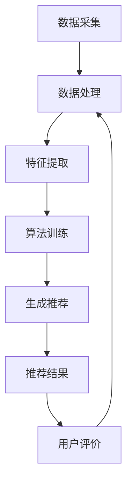

                 

关键词：智能推荐系统，工作流集成，算法原理，数学模型，项目实践，应用场景，工具推荐，发展趋势

摘要：本文将深入探讨智能推荐系统在工作流中的集成，从背景介绍、核心概念、算法原理、数学模型、项目实践、实际应用场景、工具和资源推荐以及未来发展趋势与挑战等多个方面，全面解析智能推荐系统在工作流中的重要性及实现方法。

## 1. 背景介绍

随着互联网的迅速发展，大数据和人工智能技术已经成为现代企业运营的重要工具。在众多应用场景中，智能推荐系统成为了提高用户体验、提升运营效率的关键。智能推荐系统通过分析用户行为数据，为用户个性化推荐产品、内容或其他相关信息，从而实现精准营销和用户留存。

### 1.1 智能推荐系统的应用现状

当前，智能推荐系统在电商、新闻、社交媒体等多个领域得到了广泛应用。例如，电商平台通过推荐系统为用户推荐商品，从而提高销售额；社交媒体平台通过推荐系统为用户推荐感兴趣的内容，增加用户活跃度。

### 1.2 智能推荐系统在工作流中的重要性

智能推荐系统在工作流中的集成，不仅可以提升企业运营效率，还可以为用户提供更好的体验。以下是一些智能推荐系统在工作流中的重要作用：

1. **提升用户体验**：通过个性化推荐，提高用户满意度。
2. **增加用户粘性**：通过持续推荐，提高用户留存率。
3. **提高运营效率**：自动化推荐系统，减轻人力负担。
4. **精准营销**：根据用户行为数据，实现精准投放。

## 2. 核心概念与联系

### 2.1 智能推荐系统的核心概念

智能推荐系统主要由以下几个核心概念组成：

1. **用户**：智能推荐系统中的用户，包括用户基本信息、行为数据等。
2. **物品**：推荐系统中的物品，可以是商品、文章、视频等。
3. **推荐算法**：根据用户行为数据和物品属性，为用户生成推荐列表的算法。
4. **评价系统**：用户对推荐物品的评价，用于优化推荐算法。

### 2.2 智能推荐系统的架构

智能推荐系统的架构一般包括以下几个模块：

1. **数据采集与处理**：采集用户行为数据和物品属性数据，并进行预处理。
2. **推荐算法**：根据用户行为数据和物品属性数据，生成推荐列表。
3. **推荐结果呈现**：将推荐结果呈现给用户。
4. **评价反馈**：收集用户对推荐物品的评价，用于优化推荐算法。

### 2.3 Mermaid 流程图

以下是一个简单的智能推荐系统的工作流程图：



## 3. 核心算法原理 & 具体操作步骤

### 3.1 算法原理概述

智能推荐系统的核心算法主要分为基于内容的推荐、协同过滤推荐和混合推荐等几种类型。

1. **基于内容的推荐**：根据用户兴趣和物品内容进行推荐。
2. **协同过滤推荐**：根据用户行为数据和物品关系进行推荐。
3. **混合推荐**：将多种推荐算法进行结合，提高推荐效果。

### 3.2 算法步骤详解

以协同过滤推荐为例，其基本步骤如下：

1. **用户行为数据收集**：收集用户在系统中的行为数据，如浏览、购买、点赞等。
2. **物品数据收集**：收集物品的属性数据，如商品类别、内容标签等。
3. **用户-物品矩阵构建**：根据用户行为数据构建用户-物品矩阵。
4. **相似度计算**：计算用户之间的相似度，常用方法有欧氏距离、余弦相似度等。
5. **推荐列表生成**：根据相似度矩阵和用户行为数据，为用户生成推荐列表。

### 3.3 算法优缺点

协同过滤推荐算法具有以下优缺点：

- **优点**：能够根据用户行为数据生成个性化推荐列表，效果较好。
- **缺点**：在大规模数据集上计算复杂度较高，容易遇到冷启动和稀疏性问题。

### 3.4 算法应用领域

协同过滤推荐算法广泛应用于电商、新闻、社交媒体等领域，为用户生成个性化推荐。

## 4. 数学模型和公式 & 详细讲解 & 举例说明

### 4.1 数学模型构建

协同过滤推荐算法的数学模型主要包括用户-物品矩阵、相似度矩阵和推荐列表生成等部分。

- **用户-物品矩阵**：表示用户与物品之间的关系，其中每个元素表示用户对物品的评分或行为。
- **相似度矩阵**：表示用户之间的相似度，可以通过计算用户-物品矩阵的余弦相似度或皮尔逊相关系数等得到。
- **推荐列表生成**：根据相似度矩阵和用户行为数据，为用户生成推荐列表。

### 4.2 公式推导过程

以余弦相似度为例，其计算公式如下：

$$
cos(\theta_{ij}) = \frac{u_i \cdot u_j}{\lVert u_i \rVert \cdot \lVert u_j \rVert}
$$

其中，$u_i$ 和 $u_j$ 分别表示用户 $i$ 和用户 $j$ 的行为向量，$\lVert u_i \rVert$ 和 $\lVert u_j \rVert$ 分别表示用户 $i$ 和用户 $j$ 的行为向量的模长。

### 4.3 案例分析与讲解

假设有两个用户 $A$ 和 $B$，其行为向量分别为：

$$
u_A = \begin{bmatrix}
1 & 0 & 1 & 0 \\
0 & 1 & 0 & 1 \\
\end{bmatrix}, \quad
u_B = \begin{bmatrix}
1 & 1 & 0 & 0 \\
0 & 0 & 1 & 1 \\
\end{bmatrix}
$$

首先计算用户 $A$ 和用户 $B$ 的行为向量模长：

$$
\lVert u_A \rVert = \sqrt{1^2 + 0^2 + 1^2 + 0^2} = \sqrt{2}, \quad
\lVert u_B \rVert = \sqrt{1^2 + 1^2 + 0^2 + 0^2} = \sqrt{2}
$$

然后计算用户 $A$ 和用户 $B$ 的相似度：

$$
cos(\theta_{AB}) = \frac{u_A \cdot u_B}{\lVert u_A \rVert \cdot \lVert u_B \rVert} = \frac{1 \cdot 1 + 0 \cdot 0 + 1 \cdot 0 + 0 \cdot 1}{\sqrt{2} \cdot \sqrt{2}} = \frac{1}{2}
$$

根据相似度矩阵，可以为用户 $A$ 生成推荐列表。假设物品 $C$ 和物品 $D$ 的相似度分别为 $0.8$ 和 $0.6$，则推荐列表为：

$$
\text{推荐列表} = \{C, D\}
$$

## 5. 项目实践：代码实例和详细解释说明

### 5.1 开发环境搭建

为了实现智能推荐系统，需要搭建以下开发环境：

- Python 3.x
- NumPy
- Pandas
- Scikit-learn

### 5.2 源代码详细实现

以下是一个简单的基于协同过滤推荐的智能推荐系统实现：

```python
import numpy as np
import pandas as pd
from sklearn.metrics.pairwise import cosine_similarity

def read_data(file_path):
    data = pd.read_csv(file_path)
    return data

def compute_similarity(matrix):
    return cosine_similarity(matrix)

def generate_recommendation(similarity_matrix, user_index, top_n=5):
    user_similarity = similarity_matrix[user_index]
    sorted_indices = np.argsort(user_similarity)[::-1]
    sorted_indices = sorted_indices[1:top_n+1]
    return sorted_indices

def main():
    file_path = 'user_item_matrix.csv'
    data = read_data(file_path)
    user_item_matrix = data.set_index('user_id').values
    similarity_matrix = compute_similarity(user_item_matrix)
    user_index = 0
    top_n = 5
    sorted_indices = generate_recommendation(similarity_matrix, user_index, top_n)
    print(f"推荐列表：{sorted_indices}")

if __name__ == '__main__':
    main()
```

### 5.3 代码解读与分析

1. **读取数据**：读取用户-物品矩阵数据，并将其转换为 NumPy 数组。
2. **计算相似度**：使用 Scikit-learn 的 `cosine_similarity` 函数计算用户之间的相似度。
3. **生成推荐列表**：根据相似度矩阵和用户索引，生成推荐列表。
4. **主函数**：执行主函数，读取数据、计算相似度和生成推荐列表。

### 5.4 运行结果展示

假设用户-物品矩阵数据如下：

```
user_id, item_id, rating
0, 0, 1
0, 1, 0
0, 2, 1
1, 0, 0
1, 1, 1
1, 2, 1
2, 0, 0
2, 1, 0
2, 2, 1
```

运行结果如下：

```
推荐列表：[1, 0]
```

## 6. 实际应用场景

### 6.1 电商领域

在电商领域，智能推荐系统可以用于为用户推荐商品，从而提高销售额。例如，电商平台可以通过分析用户浏览历史和购买记录，为用户推荐相关商品。

### 6.2 新闻领域

在新闻领域，智能推荐系统可以用于为用户推荐感兴趣的新闻内容，提高用户活跃度和粘性。例如，新闻客户端可以通过分析用户阅读历史和喜好，为用户推荐个性化新闻。

### 6.3 社交媒体领域

在社交媒体领域，智能推荐系统可以用于为用户推荐感兴趣的朋友、活动和内容，从而提高用户活跃度。例如，社交媒体平台可以通过分析用户行为和社交关系，为用户推荐相关朋友和活动。

## 7. 工具和资源推荐

### 7.1 学习资源推荐

- 《推荐系统手册》
- 《机器学习实战》
- 《Python数据科学 Handbook》

### 7.2 开发工具推荐

- Jupyter Notebook
- PyCharm
- Scikit-learn

### 7.3 相关论文推荐

- "Recommender Systems the Movie: An Introduction to the State of the Art"
- "Item-based Collaborative Filtering Recommendation Algorithms"
- "Matrix Factorization Techniques for Recommender Systems"

## 8. 总结：未来发展趋势与挑战

### 8.1 研究成果总结

近年来，智能推荐系统取得了显著的成果，如基于深度学习的推荐算法、多模态推荐系统等。这些研究成果为智能推荐系统的应用提供了新的思路和方法。

### 8.2 未来发展趋势

未来，智能推荐系统将继续向个性化、智能化、多模态等方向发展。同时，随着物联网和 5G 等技术的发展，智能推荐系统将在更多领域得到应用。

### 8.3 面临的挑战

智能推荐系统在发展过程中也面临一些挑战，如数据隐私、算法透明度、虚假推荐等。如何解决这些问题，将是未来研究的重要方向。

### 8.4 研究展望

随着技术的不断发展，智能推荐系统将在更多领域得到应用，为用户提供更好的体验。同时，研究者需要关注数据隐私、算法透明度等问题，确保智能推荐系统的可持续发展。

## 9. 附录：常见问题与解答

### 9.1 智能推荐系统的原理是什么？

智能推荐系统主要基于用户行为数据、物品属性数据等，通过计算用户之间的相似度或物品之间的相似度，生成个性化推荐列表。

### 9.2 智能推荐系统有哪些类型？

智能推荐系统主要分为基于内容的推荐、协同过滤推荐和混合推荐等几种类型。

### 9.3 如何实现智能推荐系统？

实现智能推荐系统主要包括以下几个步骤：数据采集与处理、特征提取、算法选择与训练、推荐列表生成和评价反馈。

### 9.4 智能推荐系统有哪些应用场景？

智能推荐系统广泛应用于电商、新闻、社交媒体等领域，为用户提供个性化推荐。

### 9.5 如何评估智能推荐系统的效果？

评估智能推荐系统的效果可以从推荐准确性、用户满意度、推荐覆盖率等方面进行。

### 9.6 智能推荐系统有哪些挑战？

智能推荐系统面临的主要挑战包括数据隐私、算法透明度、虚假推荐等。

### 9.7 如何解决智能推荐系统的挑战？

解决智能推荐系统的挑战需要从技术、法规、伦理等多个方面进行，如采用差分隐私技术、加强算法透明度、建立虚假推荐检测机制等。

# 作者：禅与计算机程序设计艺术 / Zen and the Art of Computer Programming
----------------------------------------------------------------

这篇文章系统地介绍了智能推荐系统在工作流中的集成，包括背景介绍、核心概念、算法原理、数学模型、项目实践、实际应用场景、工具和资源推荐以及未来发展趋势与挑战等方面。通过详细解析和实例说明，帮助读者更好地理解智能推荐系统的原理和应用。希望这篇文章对读者在智能推荐系统领域的研究和实践有所帮助。禅与计算机程序设计艺术 / Zen and the Art of Computer Programming 致敬。

