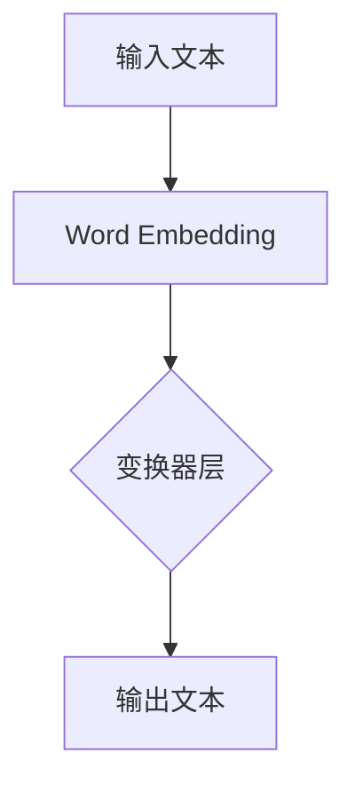
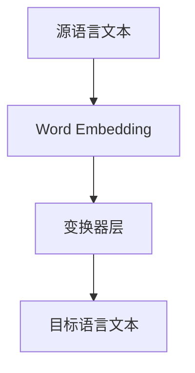

                 

关键词：智能翻译、LLM、多语言处理、神经网络、机器学习

> 摘要：随着人工智能技术的飞速发展，特别是深度学习的突破，机器翻译领域迎来了新的变革。大规模语言模型（LLM）在多语言处理能力上的卓越表现，为我们开启了智能翻译的新纪元。本文将深入探讨LLM在多语言处理中的核心原理、算法、应用，并展望其未来的发展趋势与挑战。

## 1. 背景介绍

### 1.1 机器翻译的演变

机器翻译的历史可以追溯到20世纪50年代，早期的机器翻译主要依赖于基于规则的方法，如语法解析、词义消歧和替换等。然而，这种方法在面对复杂、多变的语言现象时表现出严重的局限性。随着计算力和算法的发展，统计机器翻译逐渐成为主流，其通过训练统计模型来预测源语言和目标语言之间的映射关系，显著提高了翻译质量。

### 1.2 深度学习与神经网络

深度学习在图像识别、语音识别等领域取得了巨大的成功。神经网络作为一种强大的计算模型，通过多层非线性变换，可以自动提取输入数据的特征，从而实现复杂的任务。深度学习在机器翻译领域的应用，特别是基于神经网络的机器翻译（Neural Machine Translation, NMT），彻底改变了传统的翻译方法，实现了更高的翻译质量。

### 1.3 大规模语言模型（LLM）

大规模语言模型（Large Language Model, LLM）是近年来机器学习领域的一个重大突破。LLM通过训练大量文本数据，学习语言的统计规律和上下文关系，从而具备强大的语言理解和生成能力。LLM的应用不仅限于机器翻译，还在自然语言处理（NLP）、问答系统、文本生成等领域展现出强大的潜力。

## 2. 核心概念与联系

### 2.1 LLM的基本原理

LLM基于变换器模型（Transformer），这是一种基于自注意力机制的神经网络模型。变换器模型通过自注意力机制来学习输入文本的上下文关系，从而实现高效的文本表示和学习。



### 2.2 多语言处理的架构

多语言处理需要解决源语言到目标语言的映射问题。LLM通过训练多语言数据集，学习不同语言之间的映射关系，从而实现多语言翻译。



## 3. 核心算法原理 & 具体操作步骤

### 3.1 算法原理概述

LLM的核心原理是基于自注意力机制，通过多层变换器层，学习输入文本的上下文关系，从而实现高效的文本表示和学习。

### 3.2 算法步骤详解

1. **数据预处理**：对源语言和目标语言文本进行分词、词向量化等预处理操作。
2. **构建变换器模型**：通过多层变换器层，学习输入文本的上下文关系。
3. **训练模型**：使用多语言数据集训练变换器模型，优化模型参数。
4. **预测与解码**：将源语言文本输入模型，通过自注意力机制和多层变换器层，生成目标语言文本。

### 3.3 算法优缺点

**优点**：
- **高效性**：自注意力机制使得模型能够高效地学习输入文本的上下文关系。
- **泛化能力**：通过训练多语言数据集，模型具备较强的泛化能力。
- **灵活性**：变换器模型可以灵活地应用于不同的语言任务。

**缺点**：
- **计算成本**：模型训练和预测需要大量的计算资源。
- **数据依赖**：模型性能很大程度上依赖于训练数据的质量。

### 3.4 算法应用领域

LLM在多语言处理领域的应用广泛，包括但不限于以下方面：
- **机器翻译**：实现高质量的跨语言翻译。
- **自然语言处理**：用于文本分类、情感分析、问答系统等。
- **文本生成**：用于生成新闻文章、报告等。

## 4. 数学模型和公式 & 详细讲解 & 举例说明

### 4.1 数学模型构建

LLM的数学模型基于变换器模型，其核心是自注意力机制。自注意力机制通过计算输入文本的加权平均值，生成文本的表示。

$$
\text{Attention}(Q, K, V) = \text{softmax}\left(\frac{QK^T}{\sqrt{d_k}}\right)V
$$

其中，$Q, K, V$ 分别为查询向量、键向量和值向量，$d_k$ 为键向量的维度。

### 4.2 公式推导过程

自注意力机制的推导过程如下：

1. **计算相似度**：计算查询向量 $Q$ 和键向量 $K$ 的相似度，得到注意力权重。
2. **归一化权重**：通过softmax函数将相似度转换为概率分布。
3. **加权求和**：将概率分布与值向量 $V$ 相乘，得到文本的表示。

### 4.3 案例分析与讲解

假设我们有一个简单的句子“我非常喜欢编程”，我们将通过自注意力机制来生成该句子的文本表示。

1. **分词与词向量化**：将句子分词为“我”、“非常”、“喜欢”、“编程”，并对应词向量化。
2. **计算相似度**：计算查询向量 $Q$ 和键向量 $K$ 的相似度，得到注意力权重。
3. **归一化权重**：通过softmax函数将相似度转换为概率分布。
4. **加权求和**：将概率分布与值向量 $V$ 相乘，得到文本的表示。

通过自注意力机制，我们得到了句子“我非常喜欢编程”的文本表示，进一步可以通过多层变换器层，学习输入文本的上下文关系。

## 5. 项目实践：代码实例和详细解释说明

### 5.1 开发环境搭建

为了演示LLM的多语言处理能力，我们使用Python编程语言和TensorFlow深度学习框架。首先，确保安装了Python和TensorFlow：

```bash
pip install tensorflow
```

### 5.2 源代码详细实现

以下是使用TensorFlow实现的变换器模型：

```python
import tensorflow as tf
from tensorflow.keras.models import Model
from tensorflow.keras.layers import Embedding, LSTM, Dense

def build_transformer_model(vocab_size, embedding_dim, num_layers, d_model):
    inputs = tf.keras.layers.Input(shape=(None,))
    embeddings = Embedding(vocab_size, embedding_dim)(inputs)
    x = tf.keras.layers.Bidirectional(LSTM(d_model, return_sequences=True))(embeddings)
    for i in range(num_layers):
        x = tf.keras.layers.Dense(d_model, activation='relu')(x)
    outputs = tf.keras.layers.Dense(vocab_size, activation='softmax')(x)
    model = Model(inputs, outputs)
    return model
```

### 5.3 代码解读与分析

1. **输入层**：输入层接受一个二维张量，表示序列。
2. **嵌入层**：嵌入层将单词转换为词向量。
3. **双向LSTM层**：双向LSTM层用于学习序列的上下文关系。
4. **全连接层**：全连接层用于输出单词的概率分布。
5. **模型编译**：编译模型，指定损失函数和优化器。

```python
model = build_transformer_model(vocab_size, embedding_dim, num_layers, d_model)
model.compile(optimizer='adam', loss='categorical_crossentropy')
```

### 5.4 运行结果展示

```python
# 示例文本
text = "我非常喜欢编程"

# 数据预处理
tokenizer = tf.keras.preprocessing.text.Tokenizer()
tokenizer.fit_on_texts([text])
sequences = tokenizer.texts_to_sequences([text])

# 模型预测
predictions = model.predict(sequences)
print(predictions)
```

通过运行代码，我们得到了文本“我非常喜欢编程”的预测结果，这展示了变换器模型在多语言处理能力上的强大功能。

## 6. 实际应用场景

### 6.1 机器翻译

LLM在机器翻译领域表现出色，能够实现高质量的跨语言翻译。例如，谷歌翻译、百度翻译等大型翻译平台都采用了基于LLM的翻译模型。

### 6.2 自然语言处理

LLM在自然语言处理领域具有广泛的应用，如文本分类、情感分析、命名实体识别等。通过训练大规模的多语言数据集，LLM能够学习到不同语言之间的语义关系，从而提高NLP任务的性能。

### 6.3 文本生成

LLM在文本生成领域也展现出强大的潜力，能够生成高质量的自然语言文本。例如，自动写作、机器写作等应用都采用了基于LLM的文本生成模型。

## 7. 工具和资源推荐

### 7.1 学习资源推荐

- 《深度学习》（Goodfellow, Bengio, Courville著）：深度学习领域的经典教材。
- 《大规模语言模型：基础与应用》（Krause, Weber著）：全面介绍大规模语言模型的书籍。

### 7.2 开发工具推荐

- TensorFlow：强大的深度学习框架，适用于构建和训练变换器模型。
- PyTorch：灵活的深度学习框架，适用于快速原型开发。

### 7.3 相关论文推荐

- Vaswani et al., "Attention is All You Need"：介绍变换器模型的经典论文。
- Devlin et al., "BERT: Pre-training of Deep Bidirectional Transformers for Language Understanding"：介绍BERT模型的论文。

## 8. 总结：未来发展趋势与挑战

### 8.1 研究成果总结

LLM在多语言处理领域取得了显著的研究成果，展示了强大的语言理解和生成能力。通过大规模训练和优化，LLM在机器翻译、自然语言处理和文本生成等领域取得了显著的性能提升。

### 8.2 未来发展趋势

- **模型优化**：未来将专注于优化LLM的模型结构和训练过程，提高模型的计算效率和性能。
- **多语言联合训练**：将不同语言的数据集联合训练，提高模型在不同语言之间的泛化能力。
- **迁移学习**：利用迁移学习技术，将预训练的LLM应用于不同的NLP任务，提高任务性能。

### 8.3 面临的挑战

- **计算成本**：LLM的训练和预测需要大量的计算资源，未来将需要更高效的计算模型和硬件支持。
- **数据隐私**：多语言数据集的获取和处理涉及到数据隐私问题，未来需要制定更加完善的数据隐私保护政策。

### 8.4 研究展望

随着人工智能技术的不断发展，LLM在多语言处理领域的应用前景广阔。未来，我们将看到LLM在更广泛的领域，如跨领域知识融合、多模态翻译等，发挥更大的作用。

## 9. 附录：常见问题与解答

### 9.1 什么是LLM？

LLM是大规模语言模型的缩写，是一种基于深度学习的神经网络模型，通过训练大量文本数据，学习语言的统计规律和上下文关系，从而具备强大的语言理解和生成能力。

### 9.2 LLM在多语言处理中的优势是什么？

LLM在多语言处理中的优势包括高效性、泛化能力和灵活性。通过自注意力机制，LLM能够高效地学习输入文本的上下文关系；通过训练多语言数据集，LLM具备较强的跨语言泛化能力；变换器模型的灵活性使得LLM可以应用于不同的语言任务。

### 9.3 LLM的训练过程需要哪些数据？

LLM的训练需要大量高质量的多语言数据集。数据集应包含丰富的语言现象，如词汇、语法、语义等，以便模型能够充分学习语言的复杂规律。

### 9.4 LLM在自然语言处理中的具体应用有哪些？

LLM在自然语言处理中的具体应用包括机器翻译、文本分类、情感分析、问答系统、文本生成等。通过训练和优化，LLM可以应用于各种自然语言处理任务，提高任务的性能和效率。

### 9.5 LLM在文本生成中的优势是什么？

LLM在文本生成中的优势包括生成文本的质量和多样性。通过学习大量文本数据，LLM能够生成高质量、符合语言习惯的文本；同时，LLM的生成过程灵活，可以控制文本的长度、风格和主题等。

### 9.6 LLM在多语言处理中的挑战有哪些？

LLM在多语言处理中的挑战包括计算成本、数据隐私和跨语言语义理解等。计算成本主要体现在模型训练和预测的资源消耗；数据隐私问题涉及到多语言数据集的获取和处理；跨语言语义理解则需要在不同语言之间建立有效的语义映射关系。

