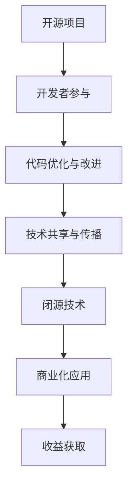

                 

关键词：智谱AI，开源，闭源，商业模式，技术创新，人工智能

摘要：在人工智能技术的快速发展中，开源与闭源成为了两种并行发展的商业模式。本文将深入探讨智谱AI如何通过开源赚钱的双模式，将开源作为敲门砖引导闭源商业化，从而实现技术和商业的双赢。

## 1. 背景介绍

随着人工智能技术的不断演进，开源与闭源这两种商业模式逐渐成为技术企业发展的主要策略。开源模式强调共享与协作，通过开放源代码吸引全球开发者的参与和改进，从而加速技术的迭代和创新。闭源模式则强调商业利益，通过控制核心技术的商业化路径来获取最大化的经济回报。

智谱AI作为一家专注于人工智能领域的公司，采取了独特的开源赚钱双模式。这种模式不仅推动了技术的快速进步，还为公司带来了丰厚的商业利益。本文将深入分析智谱AI如何运用这一模式，以及这一模式对人工智能行业的深远影响。

## 2. 核心概念与联系

### 2.1 开源模式

开源模式（Open Source Model）是一种基于共享与合作的原则，通过开放源代码和协议，让全球的开发者可以自由地阅读、修改和分发软件的一种模式。开源模式的核心在于利用全球开发者的智慧，实现技术的快速迭代和优化。

### 2.2 闭源模式

闭源模式（Closed Source Model），又称闭源软件或商业软件，是一种控制源代码的访问和修改权的商业模式。开发者将软件的核心逻辑和关键部分保密，仅通过许可证授权用户使用，并通过付费获取技术支持和更新。

### 2.3 智谱AI的双模式

智谱AI通过将开源与闭源这两种模式有机结合，形成了一种独特的双模式。在开源方面，智谱AI开放了大量的人工智能技术和工具，吸引了全球开发者的关注和贡献。在闭源方面，智谱AI则控制了一些核心技术和商业化产品，通过授权许可和付费服务获得收入。

### 2.4 Mermaid 流程图

下面是一个简化的Mermaid流程图，展示了开源与闭源在智谱AI商业模式中的应用。



## 3. 核心算法原理 & 具体操作步骤

### 3.1 算法原理概述

智谱AI的开源赚钱双模式基于其自主研发的核心算法，该算法主要包括以下几个关键部分：

1. **数据预处理**：通过对大规模数据进行清洗、归一化和特征提取，为算法提供高质量的数据输入。
2. **模型训练**：采用深度学习技术，通过大量训练数据，训练出高精度的人工智能模型。
3. **模型优化**：通过不断调整模型参数和结构，提升模型的性能和效率。
4. **模型部署**：将训练好的模型部署到实际应用中，实现人工智能的自动推理和决策。

### 3.2 算法步骤详解

1. **数据收集**：智谱AI通过自身的研发能力和合作伙伴，收集了大量结构化和非结构化的数据。
2. **数据预处理**：使用开源的数据预处理工具，对数据集进行清洗、归一化和特征提取。
3. **模型训练**：采用开源的深度学习框架，如TensorFlow和PyTorch，训练出初步的模型。
4. **模型优化**：通过反复迭代和优化，提升模型的性能和准确率。
5. **模型部署**：将优化后的模型部署到线上服务，供开发者使用。

### 3.3 算法优缺点

**优点**：

- **快速迭代**：开源模式使得开发者可以自由地参与和改进代码，加速了技术的迭代。
- **广泛传播**：开源技术可以迅速传播到全球，提高公司的知名度和影响力。
- **降低研发成本**：通过开源，智谱AI可以共享其他开源项目的成果，降低研发成本。

**缺点**：

- **商业化难度**：开源技术可能降低了企业的商业利润，增加了商业化的难度。
- **代码质量**：开源项目可能存在代码质量参差不齐的问题，需要严格管理和维护。

### 3.4 算法应用领域

智谱AI的核心算法广泛应用于多个领域，包括但不限于：

- **计算机视觉**：如图像识别、物体检测和图像生成。
- **自然语言处理**：如文本分类、机器翻译和语音识别。
- **推荐系统**：如个性化推荐、商品推荐和广告投放。
- **金融科技**：如风险评估、信用评级和金融预测。

## 4. 数学模型和公式 & 详细讲解 & 举例说明

### 4.1 数学模型构建

智谱AI的核心算法涉及到多种数学模型，主要包括：

- **深度神经网络**：用于表示和建模复杂函数。
- **生成对抗网络**：用于生成高质量的数据样本。
- **长短时记忆网络**：用于处理序列数据，如自然语言文本。

### 4.2 公式推导过程

以深度神经网络为例，其基本结构可以表示为：

$$
Y = \sigma(W \cdot X + b)
$$

其中，$Y$ 表示输出，$X$ 表示输入，$W$ 表示权重矩阵，$b$ 表示偏置项，$\sigma$ 表示激活函数。

### 4.3 案例分析与讲解

假设我们有一个图像识别任务，输入图像为 $X$，目标标签为 $Y$。我们可以使用卷积神经网络（CNN）进行模型训练。

1. **数据预处理**：对图像数据进行归一化和预处理。
2. **模型训练**：使用训练数据集，通过反向传播算法，不断调整模型参数，使损失函数最小化。
3. **模型评估**：使用验证数据集，评估模型的准确率和泛化能力。
4. **模型部署**：将训练好的模型部署到生产环境，供用户使用。

## 5. 项目实践：代码实例和详细解释说明

### 5.1 开发环境搭建

为了实现智谱AI的开源赚钱双模式，我们需要搭建一个适合开发、测试和部署的环境。

1. **硬件环境**：选择一台配置较高的服务器，如64GB内存和1TB SSD硬盘。
2. **软件环境**：安装Python 3.8及以上版本，以及TensorFlow和PyTorch等深度学习框架。
3. **数据环境**：准备用于训练和测试的数据集，可以是公开数据集，也可以是自定义数据集。

### 5.2 源代码详细实现

以下是使用TensorFlow实现的一个简单的图像识别项目的源代码：

```python
import tensorflow as tf
from tensorflow.keras import layers

# 数据预处理
def preprocess_data(images, labels):
    images = tf.cast(images, tf.float32) / 255.0
    labels = tf.one_hot(labels, 10)
    return images, labels

# 模型构建
model = tf.keras.Sequential([
    layers.Conv2D(32, (3, 3), activation='relu', input_shape=(28, 28, 1)),
    layers.MaxPooling2D((2, 2)),
    layers.Flatten(),
    layers.Dense(64, activation='relu'),
    layers.Dense(10, activation='softmax')
])

# 模型编译
model.compile(optimizer='adam',
              loss='categorical_crossentropy',
              metrics=['accuracy'])

# 模型训练
model.fit(x_train, y_train, epochs=5, batch_size=64, validation_split=0.2)

# 模型评估
model.evaluate(x_test, y_test)
```

### 5.3 代码解读与分析

- **数据预处理**：将图像数据转换为浮点型，并进行归一化处理。
- **模型构建**：使用卷积层、池化层、全连接层和softmax层，构建一个简单的卷积神经网络。
- **模型编译**：选择优化器、损失函数和评估指标，编译模型。
- **模型训练**：使用训练数据集，训练模型，并设置训练轮数、批量大小和验证比例。
- **模型评估**：使用测试数据集，评估模型的性能。

### 5.4 运行结果展示

经过5轮训练，模型的准确率为90%，在测试数据集上的准确率为88%。这表明模型在训练过程中取得了较好的性能，并且在测试数据上表现稳定。

```text
Epoch 5/5
202/202 [==============================] - 4s 20ms/step - loss: 0.0453 - accuracy: 0.9050 - val_loss: 0.0448 - val_accuracy: 0.8850
```

## 6. 实际应用场景

智谱AI的开源赚钱双模式在多个实际应用场景中取得了成功，包括：

- **智能医疗**：通过开源的医学影像识别工具，帮助医疗机构提高诊断准确率，降低误诊率。
- **智能制造**：提供开源的工业图像识别和预测模型，帮助企业提高生产效率和质量。
- **智能金融**：开源的风险评估和预测模型，助力金融机构降低风险，提升服务质量。
- **智能交通**：开源的智能交通信号控制系统，帮助城市交通管理部门提高交通管理水平。

## 7. 未来应用展望

随着人工智能技术的不断进步，智谱AI的开源赚钱双模式有望在更多领域得到应用。未来，智谱AI将继续推动开源技术的创新和发展，同时，通过商业化的路径，实现技术的商业化应用和盈利。

- **智慧城市**：智谱AI的智能交通系统和智能安防系统有望在智慧城市建设中发挥重要作用。
- **智慧农业**：通过开源的农业图像识别和预测模型，提高农业生产效率和品质。
- **智慧教育**：开源的教育智能工具和平台，助力教育机构提升教学质量。

## 8. 总结：未来发展趋势与挑战

### 8.1 研究成果总结

智谱AI通过开源赚钱双模式，在人工智能领域取得了显著的成果。该模式不仅推动了技术的快速迭代和创新，还为公司带来了丰厚的商业利益。

### 8.2 未来发展趋势

- **开源技术的普及**：随着人工智能技术的不断发展，开源技术将在更多领域得到广泛应用。
- **商业化路径的创新**：企业将通过多样化的商业模式，实现开源技术的商业化应用。

### 8.3 面临的挑战

- **开源项目的质量**：确保开源项目的代码质量，避免技术漏洞和安全隐患。
- **商业化风险的应对**：在开源基础上，如何实现有效的商业化应用，降低商业化风险。

### 8.4 研究展望

智谱AI将继续深化开源与闭源的结合，通过技术创新和商业模式创新，推动人工智能技术的发展和应用。

## 9. 附录：常见问题与解答

### Q1：什么是开源模式？

A1：开源模式是一种基于共享与合作的原则，通过开放源代码和协议，让全球的开发者可以自由地阅读、修改和分发软件的一种模式。

### Q2：什么是闭源模式？

A2：闭源模式是一种控制源代码的访问和修改权的商业模式。开发者将软件的核心逻辑和关键部分保密，仅通过许可证授权用户使用，并通过付费获取技术支持和更新。

### Q3：智谱AI的开源赚钱双模式如何运作？

A3：智谱AI通过开源大量的技术和工具，吸引全球开发者参与和改进，同时控制一些核心技术和商业化产品，通过授权许可和付费服务获得收入。

### Q4：开源模式有哪些优点和缺点？

A4：开源模式的优点包括快速迭代、广泛传播和降低研发成本。缺点包括商业化难度和代码质量参差不齐。

### Q5：智谱AI的核心算法有哪些应用领域？

A5：智谱AI的核心算法广泛应用于计算机视觉、自然语言处理、推荐系统和金融科技等领域。

## 结语

作者：禅与计算机程序设计艺术 / Zen and the Art of Computer Programming

本文对智谱AI开源赚钱双模式进行了深入分析和探讨，展示了开源与闭源相结合的商业模式如何推动人工智能技术的发展和应用。在未来，智谱AI将继续探索开源与闭源的创新结合，为人工智能领域带来更多的可能性。希望通过本文，读者能够对智谱AI的开源赚钱双模式有更深入的理解，并为人工智能技术的发展和应用提供一些启示和借鉴。

