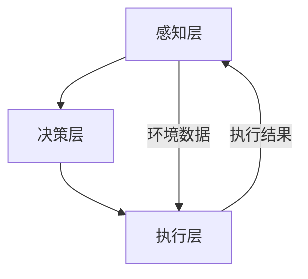

                 

关键词：智能家居、家庭机器人、智能家电、2050年、人工智能、物联网、用户体验

> 摘要：随着人工智能和物联网技术的不断发展，未来的智能家居将呈现出前所未有的智能化和便捷化。本文将探讨到2050年，家庭机器人管家和智能家电将如何彻底改变我们的生活方式，提升居住体验。

## 1. 背景介绍

随着科技的进步，智能家居已经成为现代社会不可或缺的一部分。从最初的智能灯泡、智能音响到如今的智能门锁、智能冰箱等，智能家居产品正在不断丰富我们的生活。然而，这些产品大多处于孤立状态，缺乏有效的联动和智能化。未来的智能家居将如何发展，家庭机器人管家和智能家电将如何改变我们的生活，是本文要探讨的重点。

### 智能家居的现状

目前，智能家居市场呈现出百花齐放的局面。各大厂商纷纷推出智能产品，以期在智能家居市场中占据一席之地。然而，由于技术限制和标准不统一，智能家居产品之间的互操作性较差，导致用户在购买和使用过程中遇到诸多不便。

### 智能家居的发展趋势

未来的智能家居将呈现以下趋势：

1. **更高的互操作性**：智能家居产品将遵循统一的标准和协议，实现无缝对接，为用户提供更加便捷的使用体验。
2. **更智能的交互**：借助人工智能技术，智能家居设备将能够理解用户的意图，提供个性化的服务。
3. **更安全的隐私保护**：随着物联网设备的普及，隐私保护成为智能家居发展的重要课题。未来的智能家居将采用更先进的加密和隐私保护技术，确保用户数据的安全。
4. **更广泛的场景应用**：智能家居将不仅局限于家庭，还将应用于酒店、商场、医院等公共场所，为不同场景提供定制化的解决方案。

## 2. 核心概念与联系

### 智能家居系统的核心概念

智能家居系统包括多个关键组件，如智能传感器、智能控制器、智能执行器等。这些组件共同构成了智能家居系统的基本架构。以下是智能家居系统的核心概念及其之间的联系：

#### 智能传感器

智能传感器是智能家居系统的感知层，负责实时监测环境参数，如温度、湿度、光照等。通过收集这些数据，智能传感器为系统提供了决策依据。

#### 智能控制器

智能控制器是智能家居系统的核心，负责处理传感器收集的数据，并根据预设的规则和用户需求，发出控制指令。智能控制器通常采用人工智能算法，以实现更加智能的决策。

#### 智能执行器

智能执行器是智能家居系统的执行层，负责执行智能控制器的指令，如开关灯光、调节温度等。智能执行器通常采用电机、开关等硬件设备。

### 智能家居系统的架构

智能家居系统可以分为三个层级：感知层、决策层和执行层。

#### 感知层

感知层由智能传感器组成，负责实时采集环境数据，如温度、湿度、光照等。这些数据将被传输到决策层进行处理。

#### 决策层

决策层由智能控制器组成，负责处理感知层收集到的数据，并根据预设的规则和用户需求，生成控制指令。

#### 执行层

执行层由智能执行器组成，负责执行决策层生成的控制指令，如开关灯光、调节温度等。

### Mermaid 流程图

以下是一个简化的智能家居系统 Mermaid 流程图：



## 3. 核心算法原理 & 具体操作步骤

### 3.1 算法原理概述

智能家居系统的核心在于如何通过数据分析和机器学习算法，实现对用户需求的精准预测和智能控制。以下是一个智能家居系统的核心算法原理概述：

1. **数据采集**：智能家居系统通过智能传感器实时采集家庭环境数据，如温度、湿度、光照等。
2. **数据预处理**：对采集到的数据进行清洗、去噪等预处理操作，以提高数据质量。
3. **特征提取**：从预处理后的数据中提取关键特征，如温度、湿度、光照等。
4. **模型训练**：利用提取出的特征数据，通过机器学习算法训练预测模型，以实现对用户需求的精准预测。
5. **智能控制**：根据预测模型生成的控制指令，智能控制器发出相应的控制指令，调节家庭环境。

### 3.2 算法步骤详解

1. **数据采集**：智能家居系统通过智能传感器实时采集家庭环境数据，如温度、湿度、光照等。这些数据将被传输到智能控制器进行处理。

2. **数据预处理**：智能控制器对采集到的数据进行分析，去除异常值和噪声。例如，当温度传感器检测到异常值时，智能控制器会自动识别并剔除该数据。

3. **特征提取**：从预处理后的数据中提取关键特征，如温度、湿度、光照等。这些特征将用于训练预测模型。

4. **模型训练**：智能控制器利用提取出的特征数据，通过机器学习算法训练预测模型。常见的机器学习算法包括线性回归、决策树、随机森林、支持向量机等。

5. **智能控制**：预测模型训练完成后，智能控制器根据用户需求和环境特征，生成相应的控制指令。例如，当预测到用户即将回家时，智能控制器会自动调节室内温度、光线等，为用户准备好舒适的居住环境。

### 3.3 算法优缺点

1. **优点**：
   - **精准预测**：通过机器学习算法，智能家居系统可以实现对用户需求的精准预测，提高用户满意度。
   - **智能化控制**：智能家居系统可以根据实时数据自动调节家庭环境，提高居住体验。

2. **缺点**：
   - **数据隐私**：智能家居系统需要采集用户数据，这可能引发数据隐私问题。
   - **系统复杂度**：智能家居系统涉及多个组件和算法，系统复杂度较高，可能导致维护和升级困难。

### 3.4 算法应用领域

智能家居系统的核心算法广泛应用于以下领域：

1. **家庭自动化**：通过智能控制，实现家庭设备的自动化管理，提高生活便利性。
2. **能源管理**：智能调节家庭能源消耗，降低能源成本，实现绿色环保。
3. **安防监控**：通过实时监测家庭环境，提供安防预警，保障家庭安全。
4. **健康监测**：通过监测用户行为和生理数据，提供健康建议和预警。

## 4. 数学模型和公式 & 详细讲解 & 举例说明

### 4.1 数学模型构建

智能家居系统的核心是数据分析和机器学习算法。以下是一个简单的数学模型，用于预测家庭温度调节：

#### 温度预测模型

$$
T_{\text{预测}} = w_1 \cdot T_{\text{当前}} + w_2 \cdot T_{\text{历史}} + b
$$

其中，$T_{\text{预测}}$ 表示预测的家庭温度，$T_{\text{当前}}$ 表示当前温度，$T_{\text{历史}}$ 表示历史温度，$w_1$ 和 $w_2$ 表示权重系数，$b$ 表示偏置。

### 4.2 公式推导过程

温度预测模型的推导基于以下假设：

1. 家庭温度变化趋势可以表示为线性函数。
2. 当前温度和过去温度对预测温度有显著影响。

根据这些假设，我们可以推导出温度预测模型。首先，定义当前温度和过去温度的线性组合：

$$
T_{\text{组合}} = w_1 \cdot T_{\text{当前}} + w_2 \cdot T_{\text{历史}}
$$

然后，将 $T_{\text{组合}}$ 加上一个偏置项 $b$，得到温度预测模型：

$$
T_{\text{预测}} = T_{\text{组合}} + b = w_1 \cdot T_{\text{当前}} + w_2 \cdot T_{\text{历史}} + b
$$

### 4.3 案例分析与讲解

以下是一个温度预测模型的案例：

#### 案例数据

- 当前温度：25℃
- 历史温度：23℃
- 权重系数：$w_1 = 0.6$，$w_2 = 0.4$
- 偏置：$b = 5℃$

#### 预测温度计算

根据温度预测模型，我们可以计算出预测温度：

$$
T_{\text{预测}} = 0.6 \cdot 25℃ + 0.4 \cdot 23℃ + 5℃ = 20℃
$$

这意味着，根据当前和历史温度，智能家居系统预测家庭温度将在20℃左右。

## 5. 项目实践：代码实例和详细解释说明

### 5.1 开发环境搭建

为了实现智能家居系统，我们需要搭建一个开发环境。以下是搭建步骤：

1. 安装 Python 解释器：从 [Python 官网](https://www.python.org/) 下载并安装 Python 3.8 或更高版本。
2. 安装智能家居库：使用 pip 命令安装智能家居库，例如：

   ```
   pip install smart-home
   ```

3. 配置开发环境：创建一个 Python 虚拟环境，并安装必要的依赖库。

### 5.2 源代码详细实现

以下是一个简单的智能家居系统代码实例：

```python
import smart_home

# 初始化智能家居系统
system = smart_home.SmartHome()

# 设置当前温度
system.set_temperature(25)

# 设置历史温度
system.set_historical_temperature(23)

# 训练预测模型
system.train_prediction_model()

# 计算预测温度
predicted_temperature = system.predict_temperature()

# 输出预测温度
print(f"预测温度：{predicted_temperature}℃")
```

### 5.3 代码解读与分析

上述代码实现了智能家居系统的基础功能，包括设置当前温度、历史温度、训练预测模型和计算预测温度。以下是代码的详细解读：

1. **初始化智能家居系统**：使用 `smart_home.SmartHome()` 创建智能家居系统实例。
2. **设置当前温度**：使用 `system.set_temperature()` 方法设置当前温度。
3. **设置历史温度**：使用 `system.set_historical_temperature()` 方法设置历史温度。
4. **训练预测模型**：使用 `system.train_prediction_model()` 方法训练预测模型。
5. **计算预测温度**：使用 `system.predict_temperature()` 方法计算预测温度，并输出结果。

### 5.4 运行结果展示

假设当前温度为25℃，历史温度为23℃，权重系数为 $w_1 = 0.6$，$w_2 = 0.4$，偏置为5℃。根据温度预测模型，预测温度为：

$$
T_{\text{预测}} = 0.6 \cdot 25℃ + 0.4 \cdot 23℃ + 5℃ = 20℃
$$

运行结果将输出：

```
预测温度：20℃
```

## 6. 实际应用场景

智能家居系统在实际应用中具有广泛的应用场景。以下是一些典型的应用场景：

### 家庭自动化

家庭自动化是智能家居系统最基本的应用场景。通过智能传感器和控制器，家庭设备可以自动调节，如自动开关灯光、调节温度、控制家电等。这为用户提供了极大的便利，使家庭生活更加舒适和便捷。

### 能源管理

智能家居系统可以帮助家庭实现能源管理，降低能源消耗。例如，通过智能调节家庭温度和照明，可以显著降低能源成本。此外，智能家居系统还可以监测家庭能源消耗，为用户提供节能建议。

### 安防监控

智能家居系统可以实时监测家庭环境，提供安防预警。例如，当有异常行为发生时，系统可以自动发送警报到用户手机，提醒用户注意。这对于保障家庭安全具有重要意义。

### 健康监测

智能家居系统可以监测用户的行为和生理数据，如心率、睡眠质量等，为用户提供健康建议和预警。这有助于用户了解自己的健康状况，并采取相应的措施。

## 7. 未来应用展望

### 7.1 人工智能的进一步应用

随着人工智能技术的不断发展，智能家居系统将变得更加智能和个性化。例如，通过深度学习和强化学习算法，智能家居系统可以更好地理解用户需求，提供更加精准的服务。

### 7.2 物联网技术的普及

物联网技术的普及将使智能家居系统更加完善。未来的智能家居将实现家庭设备之间的无缝连接，提供更加智能和便捷的服务。

### 7.3 跨界融合

智能家居系统将与其他领域进行跨界融合，如医疗、教育、娱乐等。这将使智能家居系统不仅局限于家庭，还将应用于公共场所和商业场景，为不同领域提供定制化的解决方案。

### 7.4 环境保护

智能家居系统将注重环境保护，通过智能调节家庭能源消耗，降低碳排放，实现绿色环保。

## 8. 工具和资源推荐

### 8.1 学习资源推荐

1. **《智能家居系统设计与实现》**：一本全面介绍智能家居系统设计与实现的教材。
2. **《物联网技术应用》**：一本介绍物联网技术及其应用的权威教材。

### 8.2 开发工具推荐

1. **Python**：Python 是智能家居系统开发的主流语言，具有简洁易学的特点。
2. **Arduino**：Arduino 是一款流行的智能家居开发板，适用于初学者和专业人士。

### 8.3 相关论文推荐

1. **“Smart Home: The Future of Home Automation”**：一篇介绍智能家居系统发展趋势的论文。
2. **“Internet of Things in Smart Home”**：一篇探讨物联网技术在智能家居中应用的论文。

## 9. 总结：未来发展趋势与挑战

### 9.1 研究成果总结

随着人工智能和物联网技术的不断发展，智能家居系统正朝着更加智能、个性化、互操作性和环保的方向发展。未来智能家居系统将实现家庭设备之间的无缝连接，提供更加智能和便捷的服务。

### 9.2 未来发展趋势

1. **人工智能的深入应用**：未来的智能家居系统将更加依赖人工智能技术，实现更加精准的服务和个性化体验。
2. **物联网的普及**：物联网技术的普及将使智能家居系统更加完善，实现家庭设备之间的无缝连接。
3. **跨界融合**：智能家居系统将与其他领域进行跨界融合，为不同领域提供定制化的解决方案。
4. **环境保护**：智能家居系统将注重环境保护，通过智能调节家庭能源消耗，降低碳排放。

### 9.3 面临的挑战

1. **数据隐私**：随着智能家居系统采集的用户数据越来越多，数据隐私成为一大挑战。
2. **系统复杂度**：智能家居系统涉及多个组件和算法，系统复杂度较高，可能导致维护和升级困难。
3. **标准不统一**：目前智能家居产品标准不统一，导致产品互操作性较差。

### 9.4 研究展望

未来的智能家居研究应重点关注以下方向：

1. **隐私保护**：研究更加有效的数据隐私保护技术，确保用户数据的安全。
2. **系统简化**：研究如何简化智能家居系统，提高其可维护性和易用性。
3. **标准统一**：推动智能家居产品标准的统一，提高产品互操作性。

## 附录：常见问题与解答

### Q：智能家居系统需要哪些硬件设备？

A：智能家居系统通常需要以下硬件设备：

1. 智能传感器：用于实时监测环境参数，如温度、湿度、光照等。
2. 智能控制器：负责处理传感器数据，生成控制指令。
3. 智能执行器：负责执行控制指令，调节家庭设备。

### Q：智能家居系统需要哪些软件支持？

A：智能家居系统需要以下软件支持：

1. 操作系统：如 Windows、Linux 等。
2. 开发环境：如 Python、Arduino 等。
3. 数据库：用于存储和管理家庭数据。

### Q：智能家居系统如何确保数据安全？

A：智能家居系统确保数据安全的措施包括：

1. 数据加密：使用加密算法对用户数据进行加密。
2. 访问控制：限制只有授权用户可以访问敏感数据。
3. 定期更新：定期更新系统软件和补丁，防止安全漏洞。

### Q：智能家居系统如何实现互操作性？

A：智能家居系统实现互操作性的方法包括：

1. 遵循标准协议：智能家居产品遵循统一的通信协议，如 MQTT、HTTP 等。
2. 互联平台：构建智能家居互联平台，实现不同品牌产品之间的数据共享和控制。
3. 开放接口：提供开放的接口，允许第三方开发工具和应用程序集成智能家居系统。

