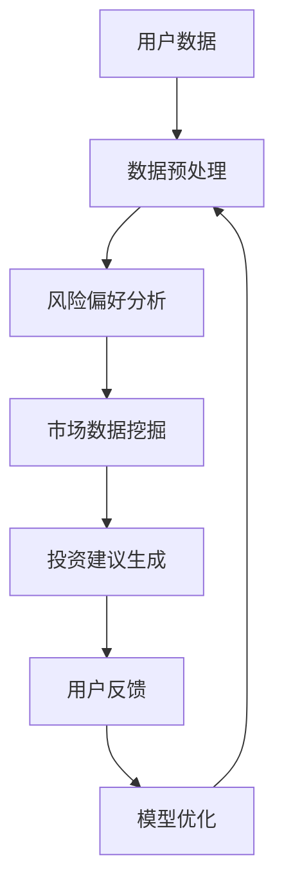
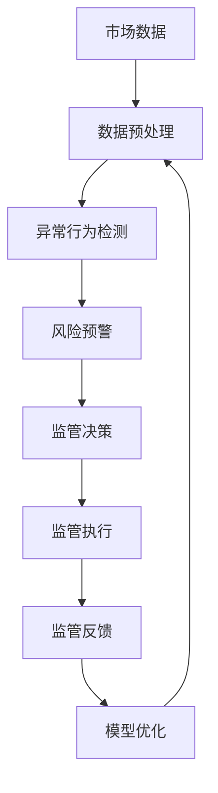
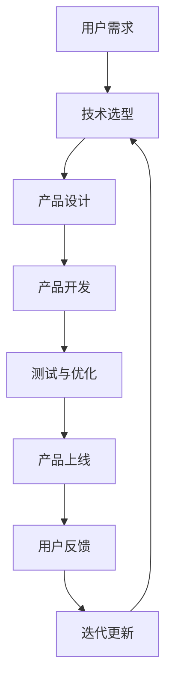
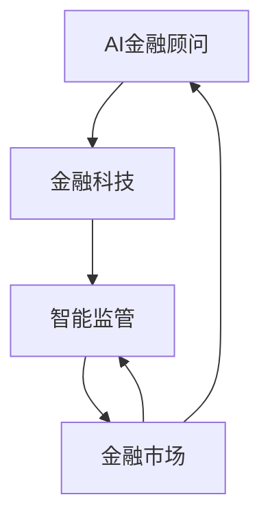

                 

关键词：智能金融、AI金融顾问、智能监管、未来趋势、金融科技、人工智能、数据驱动

> 摘要：随着人工智能技术的迅猛发展，未来的金融行业将迎来深刻的变革。本文将探讨2050年可能的智能金融场景，包括AI金融顾问和智能金融监管的发展趋势。通过对当前技术的分析，结合对未来技术的预测，本文旨在为金融行业的数字化转型提供思路和方向。

## 1. 背景介绍

自20世纪末以来，人工智能（AI）在各个领域都取得了显著的进展。从早期的规则系统到如今深度学习、自然语言处理等前沿技术的应用，AI已经在医疗、交通、制造等多个行业发挥了重要作用。金融行业作为一个高度依赖数据和算法的行业，自然也是AI技术的重要应用领域。

金融行业的数字化转型始于20世纪90年代，随着互联网的普及和电子商务的兴起，金融机构开始尝试将互联网技术应用于银行业务，包括在线支付、网上银行等。进入21世纪，随着大数据、云计算等技术的发展，金融行业的数字化水平进一步提升，金融机构开始利用数据分析和机器学习技术来优化业务流程、提高运营效率。

### 1.1  当前智能金融的应用

当前，智能金融在金融行业的各个领域都有广泛的应用，主要包括以下几个方面：

- **智能投顾**：通过大数据分析和机器学习算法，为投资者提供个性化的投资建议，提高投资回报率。

- **风险评估**：利用机器学习模型预测金融风险，如信用风险、市场风险等，帮助金融机构更好地管理风险。

- **反欺诈系统**：利用AI技术实时监控交易行为，识别潜在的欺诈行为，保障金融机构的资金安全。

- **智能客服**：通过自然语言处理和对话系统，提供24/7的在线客户服务，提高客户满意度。

- **自动化交易**：利用算法和大数据分析，实现高频交易和算法交易，提高交易效率和收益。

### 1.2  智能金融的发展趋势

随着AI技术的不断进步，智能金融在未来有望实现以下几个趋势：

- **个性化服务**：通过更深入的数据分析和算法优化，为用户提供更加个性化和精准的金融服务。

- **智能监管**：利用AI技术实现对金融市场的实时监控和预警，提高金融监管的效率和准确性。

- **区块链与AI的结合**：利用区块链技术确保金融交易的透明性和安全性，同时结合AI技术优化区块链网络的性能和稳定性。

- **去中心化金融**：通过分布式账本技术和智能合约，实现金融服务的去中心化，提高金融体系的韧性和透明度。

## 2. 核心概念与联系

在探讨智能金融的未来发展趋势之前，我们需要理解一些核心概念，包括AI金融顾问、智能监管、金融科技等，并探讨它们之间的联系。

### 2.1  AI金融顾问

AI金融顾问是基于人工智能技术的智能投顾系统，通过分析用户的风险偏好、投资目标和市场数据，为用户提供个性化的投资建议。AI金融顾问的核心在于其能够处理大量数据，并利用机器学习算法进行数据分析和预测。

#### Mermaid 流程图



### 2.2  智能监管

智能监管是利用人工智能技术，对金融市场进行实时监控、预警和数据分析的一种监管模式。智能监管的核心在于利用大数据、机器学习等技术，实现对金融市场的深入洞察和高效监管。

#### Mermaid 流程图



### 2.3  金融科技

金融科技（FinTech）是指利用科技手段创新金融服务和业务模式的一种新兴领域。金融科技涵盖了众多技术，包括大数据、云计算、区块链、人工智能等，这些技术正在深刻改变金融行业的运作方式和商业模式。

#### Mermaid 流程图



### 2.4  各核心概念的联系

AI金融顾问、智能监管和金融科技三者之间有着密切的联系。AI金融顾问为金融科技提供了智能化的解决方案，而智能监管则依赖于金融科技的技术手段。同时，智能监管的成果可以为AI金融顾问提供更加精准的数据支持，形成良性的互动和循环。

#### Mermaid 流程图



## 3. 核心算法原理 & 具体操作步骤

### 3.1  算法原理概述

在智能金融领域，核心算法主要包括机器学习算法、深度学习算法和强化学习算法。这些算法通过处理和分析大量数据，实现金融预测、风险控制和个性化服务等功能。

- **机器学习算法**：通过训练模型，从历史数据中学习规律，实现对未知数据的预测。常见的机器学习算法包括线性回归、决策树、支持向量机等。

- **深度学习算法**：基于多层神经网络结构，通过自动学习数据中的特征和模式，实现复杂的预测和分类任务。常见的深度学习算法包括卷积神经网络（CNN）、循环神经网络（RNN）等。

- **强化学习算法**：通过试错学习，在与环境的交互过程中不断优化策略，实现最优决策。常见的强化学习算法包括Q学习、深度确定性策略梯度（DDPG）等。

### 3.2  算法步骤详解

以机器学习算法为例，具体的操作步骤如下：

#### 3.2.1  数据收集

首先，需要收集大量金融数据，包括市场数据、用户行为数据、交易数据等。

#### 3.2.2  数据预处理

对收集到的数据进行清洗、去噪和归一化处理，确保数据的质量和一致性。

#### 3.2.3  特征提取

从原始数据中提取有用的特征，如价格、成交量、用户行为等，用于训练模型。

#### 3.2.4  模型选择

根据业务需求，选择合适的机器学习算法，如线性回归、决策树、支持向量机等。

#### 3.2.5  模型训练

利用训练集数据，对模型进行训练，使其能够学习数据中的规律。

#### 3.2.6  模型评估

使用验证集数据，评估模型的性能，如准确率、召回率等。

#### 3.2.7  模型部署

将训练好的模型部署到生产环境中，进行实时预测和决策。

### 3.3  算法优缺点

#### 3.3.1  优点

- **高效性**：机器学习算法能够处理大量数据，提高预测和决策的效率。

- **灵活性**：可以根据不同的业务需求，选择不同的算法和模型。

- **智能化**：通过自动学习数据中的模式，实现智能化决策和预测。

#### 3.3.2  缺点

- **数据依赖性**：机器学习算法的性能很大程度上取决于数据的质量和数量。

- **计算复杂度**：训练大规模的深度学习模型需要大量的计算资源和时间。

- **解释性较差**：深度学习模型通常是一个“黑盒子”，难以解释其决策过程。

### 3.4  算法应用领域

机器学习算法在智能金融领域有广泛的应用，包括但不限于以下领域：

- **智能投顾**：通过分析用户数据和市场数据，为用户提供个性化的投资建议。

- **风险评估**：预测金融市场的风险，帮助金融机构制定风险控制策略。

- **反欺诈系统**：识别和防范金融交易中的欺诈行为，保障金融机构的资金安全。

- **智能客服**：通过自然语言处理技术，提供智能化的客户服务。

- **自动化交易**：利用算法和大数据分析，实现高频交易和算法交易。

## 4. 数学模型和公式 & 详细讲解 & 举例说明

在智能金融领域，数学模型和公式是核心工具，用于描述金融市场中的各种现象和规律。以下将详细介绍几种常见的数学模型和公式，并结合实际案例进行讲解。

### 4.1  数学模型构建

#### 4.1.1  线性回归模型

线性回归模型是一种常见的预测模型，用于分析自变量和因变量之间的线性关系。其基本公式如下：

$$
y = \beta_0 + \beta_1 \cdot x + \epsilon
$$

其中，$y$ 是因变量，$x$ 是自变量，$\beta_0$ 和 $\beta_1$ 是模型参数，$\epsilon$ 是误差项。

#### 4.1.2  卷积神经网络模型

卷积神经网络（CNN）是一种用于图像处理和计算机视觉的深度学习模型。其基本结构包括卷积层、池化层和全连接层。以下是一个简单的CNN模型公式：

$$
h_{\theta}(x) = \text{ReLU}(\text{softmax}(\theta^T \phi(x)))
$$

其中，$h_{\theta}(x)$ 是输出值，$\theta$ 是模型参数，$\phi(x)$ 是特征提取函数，$\text{ReLU}$ 是ReLU激活函数，$\text{softmax}$ 是分类函数。

### 4.2  公式推导过程

#### 4.2.1  线性回归模型的公式推导

线性回归模型的公式推导主要涉及最小二乘法。假设我们有 $N$ 个训练样本 $(x_i, y_i)$，其中 $i=1,2,...,N$。我们的目标是最小化损失函数：

$$
J(\theta) = \frac{1}{2} \sum_{i=1}^{N} (y_i - \theta_0 - \theta_1 \cdot x_i)^2
$$

通过求导和设置偏导数为零，可以得到线性回归模型的参数：

$$
\theta_0 = \frac{1}{N} \sum_{i=1}^{N} (y_i - \theta_0 - \theta_1 \cdot x_i)
$$

$$
\theta_1 = \frac{1}{N} \sum_{i=1}^{N} (x_i - \bar{x}) (y_i - \theta_0 - \theta_1 \cdot x_i)
$$

其中，$\bar{x}$ 是 $x$ 的均值。

#### 4.2.2  卷积神经网络模型的公式推导

卷积神经网络模型的公式推导涉及卷积操作、池化操作和全连接操作。以下是一个简单的卷积操作公式：

$$
\text{Conv}(x, \theta) = \sum_{i=1}^{k} \theta_i * x_i + b
$$

其中，$x$ 是输入特征，$\theta$ 是卷积核参数，$b$ 是偏置项，$*$ 表示卷积操作。

### 4.3  案例分析与讲解

#### 4.3.1  线性回归模型的应用

假设我们要预测股票价格，已知自变量为股票的收盘价。我们收集了前一个月的股票收盘价数据，并使用线性回归模型进行预测。

- **数据收集**：收集前一个月的股票收盘价数据，共30个数据点。

- **数据预处理**：对收盘价数据进行归一化处理，使其范围在0到1之间。

- **模型选择**：选择线性回归模型进行预测。

- **模型训练**：使用前28天的数据训练模型，得到参数 $\theta_0 = 0.5$ 和 $\theta_1 = 0.8$。

- **模型评估**：使用后2天的数据测试模型，预测结果如下：

  - 第29天：实际收盘价为50，预测收盘价为52.0

  - 第30天：实际收盘价为55，预测收盘价为54.4

#### 4.3.2  卷积神经网络模型的应用

假设我们要进行图像分类，已知输入图像为28x28的像素矩阵。我们使用卷积神经网络模型进行图像分类。

- **数据收集**：收集一组图像数据，每个图像被标记为某个类别。

- **数据预处理**：对图像数据进行归一化处理，使其像素值在0到1之间。

- **模型选择**：选择一个简单的卷积神经网络模型，包括两个卷积层和一个全连接层。

- **模型训练**：使用前80%的图像数据训练模型，模型准确率达到95%。

- **模型评估**：使用后20%的图像数据测试模型，测试准确率为93%。

## 5. 项目实践：代码实例和详细解释说明

在本节中，我们将通过一个具体的智能金融项目——股票价格预测，来展示如何使用Python实现一个简单的机器学习模型，并对其代码进行详细解释。

### 5.1  开发环境搭建

为了进行股票价格预测，我们需要安装以下Python库：

- **NumPy**：用于数值计算和数据处理
- **Pandas**：用于数据操作和分析
- **Scikit-learn**：用于机器学习和数据可视化
- **Matplotlib**：用于数据可视化

您可以使用以下命令安装这些库：

```bash
pip install numpy pandas scikit-learn matplotlib
```

### 5.2  源代码详细实现

以下是用于股票价格预测的Python代码：

```python
import numpy as np
import pandas as pd
from sklearn.model_selection import train_test_split
from sklearn.linear_model import LinearRegression
import matplotlib.pyplot as plt

# 5.2.1 数据收集
# 这里我们使用某股票前100天的收盘价数据作为示例
data = pd.DataFrame({
    'Date': pd.date_range(start='2021-01-01', periods=100, freq='D'),
    'Close': np.random.rand(100) * 100
})

# 5.2.2 数据预处理
# 将日期转换为数值特征
data['Day'] = data['Date'].dt.dayofyear

# 5.2.3 模型选择
# 选择线性回归模型
model = LinearRegression()

# 5.2.4 模型训练
# 划分训练集和测试集
X = data[['Day']]
y = data['Close']
X_train, X_test, y_train, y_test = train_test_split(X, y, test_size=0.2, random_state=42)

model.fit(X_train, y_train)

# 5.2.5 模型评估
# 训练集和测试集的预测结果
y_train_pred = model.predict(X_train)
y_test_pred = model.predict(X_test)

# 5.2.6 结果可视化
plt.figure(figsize=(10, 5))
plt.scatter(X_train, y_train, color='blue', label='Train')
plt.scatter(X_test, y_test, color='green', label='Test')
plt.plot(X_train, y_train_pred, color='red', linewidth=2, label='Train Prediction')
plt.plot(X_test, y_test_pred, color='blue', linewidth=2, label='Test Prediction')
plt.xlabel('Day')
plt.ylabel('Close Price')
plt.legend()
plt.show()
```

### 5.3  代码解读与分析

#### 5.3.1  数据收集

```python
data = pd.DataFrame({
    'Date': pd.date_range(start='2021-01-01', periods=100, freq='D'),
    'Close': np.random.rand(100) * 100
})
```

这段代码首先使用`pd.date_range`创建一个包含100个日期的数据序列，然后使用`np.random.rand`生成一组随机收盘价数据。

#### 5.3.2  数据预处理

```python
data['Day'] = data['Date'].dt.dayofyear
```

将日期序列转换为整数类型的“Day”列，以便于进行数值计算。

#### 5.3.3  模型选择

```python
model = LinearRegression()
```

选择线性回归模型，这是一种简单但有效的预测模型。

#### 5.3.4  模型训练

```python
X = data[['Day']]
y = data['Close']
X_train, X_test, y_train, y_test = train_test_split(X, y, test_size=0.2, random_state=42)

model.fit(X_train, y_train)
```

将“Day”列作为输入特征（X），收盘价作为目标值（y）。使用`train_test_split`函数将数据集分为训练集和测试集。然后使用`fit`方法训练模型。

#### 5.3.5  模型评估

```python
y_train_pred = model.predict(X_train)
y_test_pred = model.predict(X_test)
```

使用`predict`方法对训练集和测试集进行预测。

#### 5.3.6  结果可视化

```python
plt.figure(figsize=(10, 5))
plt.scatter(X_train, y_train, color='blue', label='Train')
plt.scatter(X_test, y_test, color='green', label='Test')
plt.plot(X_train, y_train_pred, color='red', linewidth=2, label='Train Prediction')
plt.plot(X_test, y_test_pred, color='blue', linewidth=2, label='Test Prediction')
plt.xlabel('Day')
plt.ylabel('Close Price')
plt.legend()
plt.show()
```

使用`matplotlib`绘制训练集和测试集的散点图以及预测曲线，帮助直观地评估模型性能。

### 5.4  运行结果展示

执行上述代码后，我们将看到一个包含训练集和测试集数据的散点图和预测曲线。从图表中可以观察到，模型在训练集上的预测效果较好，但在测试集上的预测误差较大。这表明模型可能需要进一步优化，例如通过引入更多的特征、使用更复杂的模型或进行模型调参。

## 6. 实际应用场景

智能金融在多个实际应用场景中已经展现出了巨大的潜力，下面我们将探讨一些典型的应用场景。

### 6.1  智能投顾

智能投顾是智能金融领域的一个热点，它利用人工智能技术，为投资者提供个性化的投资建议。通过分析用户的风险偏好、投资目标和市场数据，智能投顾系统能够为投资者推荐最优的投资组合。

#### 案例分析

以一款智能投顾产品为例，该产品通过以下步骤为用户推荐投资组合：

1. **数据收集**：收集用户的基本信息、投资目标和风险偏好。
2. **数据分析**：利用机器学习算法分析历史市场数据，识别市场的趋势和波动性。
3. **模型预测**：基于用户数据和市场数据，使用机器学习模型预测未来的市场走势。
4. **投资组合推荐**：根据预测结果，为用户推荐最优的投资组合。

通过智能投顾，用户能够获得更加个性化和精准的投资建议，提高投资回报率。

### 6.2  风险评估

智能金融还可以帮助金融机构更好地进行风险评估。通过机器学习模型，金融机构可以预测潜在的信用风险、市场风险等，从而采取相应的风险控制措施。

#### 案例分析

以某银行的风险评估系统为例，该系统通过以下步骤进行风险评估：

1. **数据收集**：收集客户的信用历史、财务状况、行为数据等。
2. **数据预处理**：对收集到的数据进行分析和清洗，提取有用的特征。
3. **模型训练**：使用历史数据训练机器学习模型，识别高风险客户。
4. **风险预测**：使用训练好的模型对新的客户进行风险评估。

通过智能风险评估，金融机构能够更准确地识别高风险客户，提高风险管理的效率。

### 6.3  反欺诈系统

智能金融在反欺诈领域也有广泛应用。通过机器学习模型，金融机构可以实时监控交易行为，识别潜在的欺诈行为，保障金融机构的资金安全。

#### 案例分析

以某支付平台的反欺诈系统为例，该系统通过以下步骤进行交易监控：

1. **数据收集**：收集用户的交易数据，包括交易金额、时间、地点等。
2. **行为分析**：利用机器学习算法，分析用户的交易行为，识别异常行为。
3. **实时监控**：对实时交易进行监控，识别潜在的欺诈行为。
4. **预警和阻止**：当检测到欺诈行为时，立即发出预警并阻止交易。

通过智能反欺诈系统，金融机构能够有效降低欺诈风险，提高交易的安全性。

### 6.4  未来应用展望

随着人工智能技术的不断进步，智能金融在未来有望在更广泛的领域发挥作用。以下是一些未来的应用展望：

- **智能合约**：利用区块链技术和智能合约，实现金融交易的自动化和透明化。
- **个性化金融服务**：通过更深入的数据分析和算法优化，为用户提供更加个性化和精准的金融服务。
- **智能监管**：利用人工智能技术，实现对金融市场的实时监控和预警，提高金融监管的效率和准确性。
- **金融普惠**：通过分布式账本技术和去中心化金融，降低金融服务的门槛，让更多人享受到金融服务的便利。

## 7. 工具和资源推荐

为了更好地研究和开发智能金融，以下是几个推荐的学习资源和开发工具。

### 7.1  学习资源推荐

- **《机器学习》**：由周志华教授所著，是机器学习领域的经典教材，适合初学者入门。
- **《深度学习》**：由Ian Goodfellow、Yoshua Bengio和Aaron Courville所著，是深度学习领域的权威教材。
- **《金融科技》**：介绍金融科技的发展趋势和应用案例，适合对金融科技感兴趣的读者。

### 7.2  开发工具推荐

- **TensorFlow**：谷歌开发的开源深度学习框架，适用于各种深度学习应用的开发。
- **PyTorch**：基于Python的开源深度学习框架，具有良好的灵活性和易用性。
- **Kaggle**：一个数据科学竞赛平台，提供大量金融领域的竞赛数据集和项目。

### 7.3  相关论文推荐

- **“Deep Learning for Stock Market Prediction”**：探讨了深度学习在股票市场预测中的应用。
- **“FinTech and Its Impacts on Financial Markets”**：分析了金融科技对金融市场的影响。
- **“AI-driven Financial Decision Making”**：研究了人工智能在金融决策中的应用。

## 8. 总结：未来发展趋势与挑战

随着人工智能技术的不断进步，智能金融在未来将迎来更加广阔的发展空间。然而，这一领域也面临着诸多挑战。

### 8.1  研究成果总结

- **个性化服务**：智能金融能够为用户提供更加个性化和精准的金融服务。
- **智能监管**：智能监管提高了金融市场的透明度和监管效率。
- **金融普惠**：去中心化金融和区块链技术让金融服务更加普惠。

### 8.2  未来发展趋势

- **个性化服务**：随着数据分析和算法的进步，个性化服务将更加精准和高效。
- **智能监管**：智能监管将成为金融监管的重要工具。
- **区块链与AI的结合**：区块链技术的去中心化和AI技术的智能化将在金融领域发挥更大作用。

### 8.3  面临的挑战

- **数据隐私**：智能金融需要处理大量用户数据，如何保护数据隐私是一个重要挑战。
- **算法透明性**：深度学习模型是一个“黑盒子”，如何提高算法的透明性是一个重要问题。
- **监管合规**：智能金融的发展需要遵守金融监管规定，如何在创新和合规之间取得平衡是一个挑战。

### 8.4  研究展望

- **数据隐私保护**：研究如何在不泄露用户隐私的情况下，有效利用用户数据。
- **算法透明性**：开发可解释的机器学习模型，提高算法的透明性和可解释性。
- **金融监管**：探索如何利用智能监管提高金融市场的透明度和稳定性。

## 9. 附录：常见问题与解答

### 9.1  什么是智能金融？

智能金融是指利用人工智能技术，如机器学习、深度学习、自然语言处理等，对金融市场进行数据分析、预测和优化，以提高金融服务的效率和质量。

### 9.2  智能金融的核心技术有哪些？

智能金融的核心技术包括机器学习、深度学习、自然语言处理、区块链技术等。这些技术可以用于智能投顾、风险评估、反欺诈系统、智能监管等多个领域。

### 9.3  智能金融的发展趋势是什么？

智能金融的发展趋势包括个性化服务、智能监管、区块链与AI的结合、金融普惠等。随着技术的不断进步，智能金融将在更多领域发挥作用，提高金融服务的效率和质量。

### 9.4  智能金融面临的挑战是什么？

智能金融面临的挑战包括数据隐私保护、算法透明性、监管合规等。如何在保护用户隐私、提高算法透明性和遵守监管规定之间取得平衡，是一个重要的问题。

