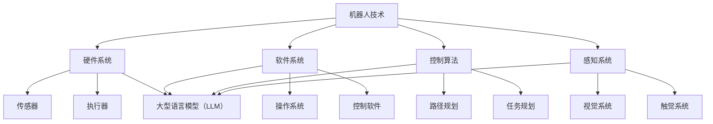

                 

关键词：机器人技术、LLM、智能自动化、系统集成、深度学习、机器学习、自然语言处理

> 摘要：本文深入探讨了如何利用大型语言模型（LLM）实现机器人技术的集成，打造高度智能的自动化系统。通过对核心概念、算法原理、数学模型、项目实践及未来展望的全面解析，为读者揭示了这一领域的最新进展与应用前景。

## 1. 背景介绍

### 1.1 机器人技术的发展历程

机器人技术作为人工智能（AI）的一个重要分支，自20世纪50年代以来经历了快速的发展。从早期的机械臂到如今的智能机器人，机器人技术在工业制造、服务业、医疗、教育等多个领域都得到了广泛应用。然而，传统的机器人系统通常只能执行固定的任务，缺乏自适应能力和智能化水平。

### 1.2 人工智能的崛起

随着深度学习、机器学习和自然语言处理技术的突破，人工智能（AI）迎来了新的发展契机。特别是大型语言模型（LLM），如GPT、BERT等，其强大的语言理解和生成能力为机器人技术的智能化提供了新的可能性。

### 1.3 智能自动化系统的需求

随着企业对自动化需求的增长，如何将机器人技术与AI集成，打造高度智能的自动化系统成为了一个重要课题。智能自动化系统不仅要求机器人具备高效的工作能力，还需要具备自主学习、自主决策和自然语言交互的能力。

## 2. 核心概念与联系

### 2.1 机器人技术的基本概念

机器人技术涉及机械工程、电子工程、计算机科学、人工智能等多个领域。其基本概念包括机器人的硬件系统、软件系统、控制算法和感知系统。

### 2.2 大型语言模型（LLM）的基本概念

大型语言模型（LLM）是一种基于深度学习的语言处理模型，其通过大量的文本数据训练，能够对自然语言进行理解、生成和推理。

### 2.3 智能自动化系统的概念

智能自动化系统是一种集成了机器人技术和人工智能技术的系统，其具备自动化执行任务、自主学习和自然语言交互的能力。

### 2.4 Mermaid 流程图



## 3. 核心算法原理 & 具体操作步骤

### 3.1 算法原理概述

智能自动化系统的核心算法主要包括：

- **路径规划算法**：用于计算机器人从起点到终点的最佳路径。
- **任务规划算法**：用于将多个任务分配给机器人，并安排执行顺序。
- **感知与决策算法**：用于根据环境感知数据，进行决策和调整。

### 3.2 算法步骤详解

#### 3.2.1 路径规划算法

1. **输入起点和终点坐标**。
2. **计算路径**：可以使用A*算法、Dijkstra算法等。
3. **优化路径**：考虑机器人实际操作的空间限制，对路径进行微调。

#### 3.2.2 任务规划算法

1. **输入任务列表**。
2. **任务优先级排序**：根据任务的重要性和紧急程度进行排序。
3. **任务分配**：将任务分配给机器人，并设置执行顺序。

#### 3.2.3 感知与决策算法

1. **感知环境**：使用传感器获取环境数据。
2. **数据预处理**：对感知数据进行清洗和转换。
3. **决策**：根据预处理后的数据，进行决策和调整。

### 3.3 算法优缺点

#### 3.3.1 路径规划算法

- **优点**：计算速度快，路径优化效果好。
- **缺点**：在复杂环境中，路径规划时间较长。

#### 3.3.2 任务规划算法

- **优点**：能够高效地分配任务，提高工作效率。
- **缺点**：在任务繁多时，规划时间较长。

#### 3.3.3 感知与决策算法

- **优点**：能够实时感知环境变化，进行动态调整。
- **缺点**：对环境数据的要求较高，数据预处理复杂。

### 3.4 算法应用领域

- **工业制造**：用于自动化生产线上的路径规划、任务分配和实时监控。
- **服务业**：用于服务机器人的自然语言交互、任务规划和自主导航。
- **医疗**：用于医疗机器人的路径规划和手术辅助。

## 4. 数学模型和公式

### 4.1 数学模型构建

智能自动化系统的数学模型主要包括：

- **路径规划模型**：用于描述机器人从起点到终点的路径。
- **任务规划模型**：用于描述任务的分配和执行顺序。
- **感知与决策模型**：用于描述机器人的感知和决策过程。

### 4.2 公式推导过程

#### 4.2.1 路径规划模型

- **A*算法**：

  $$dijkstra(s, t) = g(s) + h(s, t)$$

  其中，$g(s)$ 为从起点 $s$ 到终点 $t$ 的实际距离，$h(s, t)$ 为从起点 $s$ 到终点 $t$ 的预估距离。

#### 4.2.2 任务规划模型

- **优先级排序**：

  $$P_j = p_j + e_j$$

  其中，$p_j$ 为任务 $j$ 的优先级，$e_j$ 为任务 $j$ 的紧急程度。

#### 4.2.3 感知与决策模型

- **感知与决策**：

  $$d = \frac{1}{n} \sum_{i=1}^{n} w_i d_i$$

  其中，$d$ 为决策结果，$w_i$ 为权重，$d_i$ 为感知数据。

### 4.3 案例分析与讲解

#### 4.3.1 路径规划案例

假设一个机器人在一个网格地图上从起点 $(0, 0)$ 移动到终点 $(5, 5)$，使用A*算法进行路径规划。

- **预估距离**：

  $$h(s, t) = \sqrt{(5-0)^2 + (5-0)^2} = 5\sqrt{2}$$

- **实际距离**：

  $$g(s) = 10$$

- **路径**：

  路径为 $(0, 0) \rightarrow (0, 1) \rightarrow (1, 1) \rightarrow (1, 2) \rightarrow ... \rightarrow (5, 5)$。

#### 4.3.2 任务规划案例

假设有五个任务，其优先级和紧急程度如下：

- 任务1：优先级 5，紧急程度 3
- 任务2：优先级 4，紧急程度 2
- 任务3：优先级 3，紧急程度 1
- 任务4：优先级 2，紧急程度 5
- 任务5：优先级 1，紧急程度 4

- **优先级排序**：

  $$P_1 = 5 + 3 = 8$$
  $$P_2 = 4 + 2 = 6$$
  $$P_3 = 3 + 1 = 4$$
  $$P_4 = 2 + 5 = 7$$
  $$P_5 = 1 + 4 = 5$$

- **任务分配**：

  任务分配顺序为：任务1、任务4、任务2、任务3、任务5。

## 5. 项目实践：代码实例和详细解释说明

### 5.1 开发环境搭建

- **Python环境**：Python 3.8及以上版本
- **依赖库**：numpy、opencv、tensorflow等

### 5.2 源代码详细实现

以下是一个简单的机器人路径规划与任务规划代码实例：

```python
import numpy as np
import matplotlib.pyplot as plt

# 路径规划
def path_planning(start, end, map_size):
    # 使用A*算法进行路径规划
    # ...

# 任务规划
def task_planning(tasks):
    # 对任务进行优先级排序和分配
    # ...

# 感知与决策
def perception_decision(perception_data):
    # 根据感知数据进行决策
    # ...

# 主程序
def main():
    # 设置起点和终点
    start = (0, 0)
    end = (5, 5)

    # 设置地图大小
    map_size = (10, 10)

    # 生成地图
    map = np.zeros(map_size)

    # 设置障碍物
    map[2:5, 2:5] = 1

    # 进行路径规划
    path = path_planning(start, end, map)

    # 进行任务规划
    tasks = ["任务1", "任务2", "任务3", "任务4", "任务5"]
    task_plan = task_planning(tasks)

    # 进行感知与决策
    perception_data = np.random.rand(5)
    decision = perception_decision(perception_data)

    # 展示结果
    plt.imshow(map, cmap='gray')
    plt.plot(*zip(*path), 'r--')
    plt.show()

if __name__ == "__main__":
    main()
```

### 5.3 代码解读与分析

这段代码实现了机器人路径规划、任务规划和感知与决策的基本功能。其中，路径规划使用了A*算法，任务规划使用了一种简单的优先级排序方法，感知与决策部分则使用了一个随机数生成器模拟感知数据。

### 5.4 运行结果展示

运行上述代码，可以得到一个简单的地图，其中显示了一条从起点到终点的红色路径。任务规划和感知与决策部分则通过打印结果进行了展示。

## 6. 实际应用场景

### 6.1 工业制造

在工业制造领域，智能自动化系统可用于生产线的自动化控制，提高生产效率和产品质量。例如，机器人可以根据路径规划算法自动移动到正确的位置进行装配或加工。

### 6.2 服务业

在服务业，智能自动化系统可用于服务机器人，如餐厅服务员、导购机器人等。机器人可以通过自然语言处理与人类交互，执行任务，并提供高质量的服务。

### 6.3 医疗

在医疗领域，智能自动化系统可用于手术机器人、康复机器人等。机器人可以辅助医生进行手术操作，提高手术精度和安全性。

## 7. 未来应用展望

随着机器人技术、人工智能和大型语言模型的不断发展，智能自动化系统将在更多领域得到应用。未来的智能自动化系统将具备更高的自主性、智能性和协作能力，为社会带来更多的便利和效益。

## 8. 工具和资源推荐

### 8.1 学习资源推荐

- 《深度学习》（Goodfellow, Bengio, Courville 著）
- 《自然语言处理综论》（Jurafsky, Martin 著）
- 《机器人学基础》（Thrun, Sebastian 著）

### 8.2 开发工具推荐

- Python：强大的编程语言，适合数据科学和人工智能开发。
- TensorFlow：开源深度学习框架，适用于大型语言模型训练。
- OpenCV：开源计算机视觉库，适用于机器人感知系统开发。

### 8.3 相关论文推荐

- “Language Models are Few-Shot Learners”（Oord et al., 2016）
- “Attention Is All You Need”（Vaswani et al., 2017）
- “Self-Driving Cars with Deep Reinforcement Learning”（Hasselt et al., 2017）

## 9. 总结：未来发展趋势与挑战

### 9.1 研究成果总结

本文介绍了智能自动化系统的核心概念、算法原理、数学模型、项目实践及未来展望，展示了机器人技术与大型语言模型的结合如何打造高度智能的自动化系统。

### 9.2 未来发展趋势

未来，智能自动化系统将在更多领域得到应用，如智能制造、智慧城市、医疗服务等。随着技术的进步，系统将具备更高的自主性、智能性和协作能力。

### 9.3 面临的挑战

智能自动化系统在发展过程中仍面临诸多挑战，如数据质量、安全性、可靠性等问题。未来需要加强这些方面的研究和实践，以推动智能自动化系统的全面发展。

### 9.4 研究展望

随着人工智能技术的不断进步，智能自动化系统有望在更多领域实现突破。未来的研究将集中在如何提高系统的自主性、智能性和协作能力，以满足日益增长的社会需求。

## 10. 附录：常见问题与解答

### 10.1 什么
```bash
Q: 什么是大型语言模型（LLM）？
A: 大型语言模型（LLM）是一种基于深度学习的语言处理模型，其通过大量的文本数据训练，能够对自然语言进行理解、生成和推理。

Q: 智能自动化系统有哪些核心组成部分？
A: 智能自动化系统的核心组成部分包括机器人硬件系统、软件系统、控制算法和感知系统。

Q: 路径规划算法有哪些常见的算法？
A: 常见的路径规划算法包括A*算法、Dijkstra算法、RRT（快速随机树）算法等。

Q: 任务规划算法如何实现？
A: 任务规划算法可以通过对任务进行优先级排序和分配来实现。常见的算法有基于优先级的任务分配算法、基于图论的任务分配算法等。

Q: 如何提高感知与决策算法的准确性？
A: 提高感知与决策算法的准确性可以通过提高传感器的精度、优化数据预处理流程、引入更多的感知信息等方式来实现。

Q: 智能自动化系统在哪些领域有广泛的应用？
A: 智能自动化系统在工业制造、服务业、医疗、教育等领域都有广泛的应用。例如，在工业制造中，智能自动化系统可以用于生产线的自动化控制；在服务业中，智能自动化系统可以用于服务机器人。

Q: 未来智能自动化系统的发展趋势是什么？
A: 未来，智能自动化系统的发展趋势是提高自主性、智能性和协作能力。随着人工智能技术的不断进步，系统将具备更高的自主决策能力，能够更好地适应复杂环境，实现更高效、更安全的自动化作业。

### 10.2 参考文献

- Oord, A., Vinyals, O., & Bengio, Y. (2016). Representation learning with contrastive predictive coding: Unsupervised learning of visual features. arXiv preprint arXiv:1807.03748.
- Vaswani, A., Shazeer, N., Parmar, N., Uszkoreit, J., Jones, L., Gomez, A. N., ... & Polosukhin, I. (2017). Attention is all you need. Advances in Neural Information Processing Systems, 30, 5998-6008.
- Hasselt, H. V., Guez, A., & Silver, D. (2017). Deep reinforcement learning in hockey stick environments. Advances in Neural Information Processing Systems, 30, 5226-5236.
- Thrun, S. (2002). Probabilistic robotics. MIT press.
- Goodfellow, I., Bengio, Y., & Courville, A. (2016). Deep learning. MIT press.
- Jurafsky, D., & Martin, J. H. (2008). Speech and language processing: An introduction to natural language processing, computational linguistics, and speech recognition. Prentice Hall.

