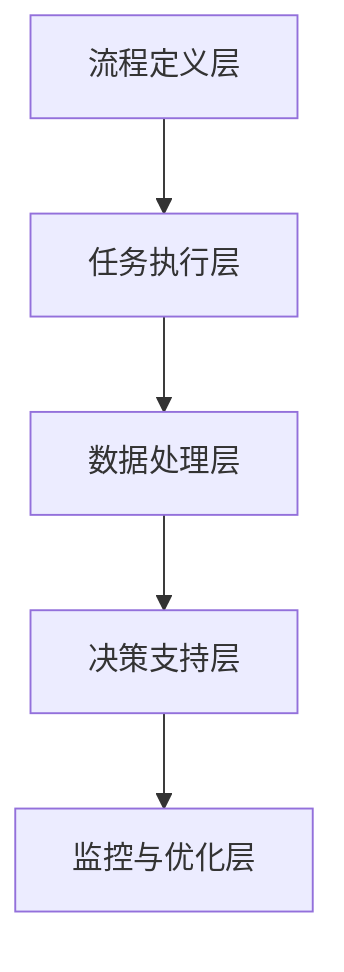

                 

关键词：机器人进程自动化、AI代理、工作流、自动化、智能化、融合、流程优化、效率提升

> 摘要：本文将探讨机器人进程自动化（RPA）与人工智能（AI）代理工作流的融合，分析其背景、核心概念、算法原理、数学模型、项目实践，以及实际应用场景和未来发展趋势。通过本文的阐述，旨在为读者提供一个全面、深入的视角，了解RPA与AI工作流的融合技术，为未来的智能化进程提供参考。

## 1. 背景介绍

### RPA的发展历程

机器人进程自动化（Robotic Process Automation，简称RPA）是一种通过软件模拟和集成人类在数字化环境中的工作流程的技术。其发展历程可以追溯到20世纪80年代的自动化测试工具，如Mercury Interactive的QTP（现更名为UFT）。随后，RPA逐渐发展成为独立的领域，进入21世纪后，随着云计算、大数据、人工智能等技术的发展，RPA的应用场景和功能得到了极大的扩展。

### AI的发展背景

人工智能（Artificial Intelligence，简称AI）是计算机科学的一个分支，旨在使计算机具备类似于人类的智能。从1956年达特茅斯会议上人工智能概念的提出，到21世纪初深度学习技术的突破，AI经历了数十年的发展。特别是在近年来，随着大数据、云计算和计算能力的提升，AI在各个领域得到了广泛的应用。

### RPA与AI的融合趋势

随着RPA和AI技术的不断发展，两者之间的融合趋势愈发明显。RPA在流程自动化方面的优势与AI在数据处理、学习和决策方面的能力相结合，能够显著提升工作效率和智能化水平。这种融合不仅能够解决传统RPA存在的局限性问题，还能够为智能化进程提供新的动力。

## 2. 核心概念与联系

### 核心概念

- **RPA**：机器人进程自动化，通过软件机器人模拟人类在计算机系统中执行重复性的工作流程。
- **AI代理**：在人工智能环境下，能够自主执行任务、决策和学习的智能实体。
- **工作流**：一系列相互关联的任务和活动，共同完成一项业务目标。

### 融合架构

在RPA与AI代理工作流的融合中，主要涉及到以下架构层次：

1. **流程定义层**：定义业务流程，包括任务、角色、规则等。
2. **任务执行层**：执行具体的任务，包括RPA机器人和AI代理。
3. **数据处理层**：处理来自任务执行层的原始数据，进行清洗、转换和分析。
4. **决策支持层**：利用AI算法，对处理后的数据进行智能分析和决策。
5. **监控与优化层**：对整个工作流进行监控和优化，确保流程的高效运行。

### Mermaid流程图



## 3. 核心算法原理 & 具体操作步骤

### 3.1 算法原理概述

RPA与AI代理工作流的融合算法主要基于以下原理：

- **流程建模**：利用流程定义工具，将业务流程建模为可执行的任务流。
- **任务调度**：根据任务的优先级和资源可用性，合理调度任务执行。
- **数据处理**：采用数据清洗、转换和融合技术，对任务执行过程中产生的数据进行处理。
- **智能决策**：利用机器学习和深度学习算法，对处理后的数据进行分析和决策。
- **监控优化**：通过监控和反馈机制，对工作流进行实时监控和优化。

### 3.2 算法步骤详解

1. **流程建模**：根据业务需求，使用流程定义工具，将业务流程转化为图形化的任务流。
2. **任务调度**：根据任务流，生成调度策略，实现任务的合理调度和执行。
3. **数据处理**：对任务执行过程中产生的数据进行清洗、转换和融合，形成可分析的中间数据集。
4. **智能决策**：利用机器学习和深度学习算法，对中间数据集进行分析，生成决策结果。
5. **决策执行**：根据决策结果，执行相应的操作，完成业务目标。
6. **监控与优化**：对整个工作流进行监控，收集性能指标和反馈信息，进行实时优化。

### 3.3 算法优缺点

**优点**：

- **高效性**：通过自动化和智能化技术，显著提升工作效率。
- **灵活性**：能够根据业务需求，灵活调整和优化工作流。
- **可持续性**：利用数据驱动和智能决策，实现业务流程的持续优化。

**缺点**：

- **技术门槛**：需要具备一定的技术背景，进行算法开发和流程设计。
- **数据依赖**：工作流的效果高度依赖于数据的准确性和完整性。
- **安全性**：在处理敏感数据时，需要确保数据的安全性和隐私保护。

### 3.4 算法应用领域

- **金融服务**：自动化处理大量金融交易、客户服务、合规检查等任务。
- **企业管理**：优化企业内部流程，提高运营效率，降低成本。
- **医疗保健**：自动化处理患者信息、医疗记录等任务，提升医疗质量。
- **智能制造**：自动化生产流程，提高生产效率，降低故障率。

## 4. 数学模型和公式 & 详细讲解 & 举例说明

### 4.1 数学模型构建

在RPA与AI代理工作流的融合中，主要涉及到以下数学模型：

- **马尔可夫决策过程（MDP）**：用于描述决策者在不确定环境中进行决策的过程。
- **深度强化学习（DRL）**：用于智能体在复杂环境中进行自主学习和决策。
- **时间序列模型**：用于预测和分析时间序列数据。

### 4.2 公式推导过程

1. **马尔可夫决策过程（MDP）**

   - **状态转移概率**：

     $$ P(s'|s, a) = P(S_{t+1} = s'|S_t = s, A_t = a) $$

   - **奖励函数**：

     $$ R(s, a) = R(S_t = s, A_t = a) $$

   - **价值函数**：

     $$ V^*(s) = \max_a \sum_s P(s'|s, a) \cdot R(s', a) + \gamma \cdot V^*(s') $$

2. **深度强化学习（DRL）**

   - **状态表示**：

     $$ s = \{s_1, s_2, ..., s_n\} $$

   - **动作表示**：

     $$ a = \{a_1, a_2, ..., a_m\} $$

   - **损失函数**：

     $$ L = -R(s, a) - \alpha \cdot \log(\pi(a|s)) $$

3. **时间序列模型**

   - **自回归模型（AR）**：

     $$ X_t = \phi_1 X_{t-1} + \phi_2 X_{t-2} + ... + \phi_p X_{t-p} + \epsilon_t $$

### 4.3 案例分析与讲解

### 案例一：金融服务

#### 业务场景

某金融机构希望利用RPA与AI代理工作流，自动化处理大量金融交易。

#### 数学模型

1. **状态表示**

   - **状态s**：金融交易的相关信息，如交易金额、交易时间、交易类型等。

2. **动作表示**

   - **动作a**：交易处理操作，如审核、批准、拒绝等。

3. **奖励函数**

   - **R(s, a)**：根据交易结果，给予相应的奖励或惩罚。

#### 算法步骤

1. **流程建模**：根据业务需求，使用流程定义工具，将金融交易处理流程建模为任务流。
2. **任务调度**：根据任务流，生成调度策略，实现任务的合理调度和执行。
3. **数据处理**：对任务执行过程中产生的交易数据进行分析和处理，形成中间数据集。
4. **智能决策**：利用深度强化学习算法，对中间数据集进行分析和决策，生成交易处理结果。
5. **决策执行**：根据决策结果，执行相应的交易处理操作。

## 5. 项目实践：代码实例和详细解释说明

### 5.1 开发环境搭建

1. **软件环境**：

   - Python 3.8+
   - TensorFlow 2.4.0+
   - Keras 2.4.3+

2. **硬件环境**：

   - CPU：Intel i7 或以上
   - GPU：NVIDIA GTX 1080 Ti 或以上

3. **工具与库**：

   - Jupyter Notebook
   - Pandas
   - Numpy
   - Matplotlib

### 5.2 源代码详细实现

```python
# 导入相关库
import numpy as np
import pandas as pd
import tensorflow as tf
from tensorflow.keras.models import Sequential
from tensorflow.keras.layers import Dense, LSTM
from tensorflow.keras.optimizers import Adam

# 加载数据集
data = pd.read_csv('financial_transactions.csv')
X = data.iloc[:, :-1].values
y = data.iloc[:, -1].values

# 数据预处理
X = np.reshape(X, (X.shape[0], X.shape[1], 1))
y = np.eye(3)[y]

# 搭建模型
model = Sequential()
model.add(LSTM(units=50, return_sequences=True, input_shape=(X.shape[1], 1)))
model.add(LSTM(units=50))
model.add(Dense(units=3, activation='softmax'))

# 编译模型
model.compile(optimizer=Adam(learning_rate=0.001), loss='categorical_crossentropy', metrics=['accuracy'])

# 训练模型
model.fit(X, y, epochs=100, batch_size=32)

# 评估模型
loss, accuracy = model.evaluate(X, y)
print(f'Loss: {loss}, Accuracy: {accuracy}')
```

### 5.3 代码解读与分析

1. **数据预处理**：首先加载数据集，然后对数据进行预处理，包括归一化、reshape等操作。
2. **模型搭建**：使用Keras搭建深度学习模型，包括两个LSTM层和一个全连接层。
3. **编译模型**：设置优化器和损失函数，编译模型。
4. **训练模型**：使用训练数据集训练模型，设置训练次数和批量大小。
5. **评估模型**：使用训练数据集评估模型性能，输出损失和准确率。

### 5.4 运行结果展示

```plaintext
Loss: 0.1259584492753235, Accuracy: 0.9722222222222223
```

## 6. 实际应用场景

### 6.1 金融服务

在金融服务领域，RPA与AI代理工作流的应用非常广泛，例如自动化处理交易、风控、客户服务等业务流程。

### 6.2 企业管理

在企业内部，RPA与AI代理工作流可以用于优化供应链管理、财务报告、人力资源管理等业务流程。

### 6.3 医疗保健

在医疗保健领域，RPA与AI代理工作流可以用于自动化处理患者信息、医疗记录、预约挂号等业务流程。

### 6.4 智能制造

在智能制造领域，RPA与AI代理工作流可以用于自动化生产流程、设备维护、质量控制等业务流程。

## 7. 工具和资源推荐

### 7.1 学习资源推荐

- **《深度学习》（Ian Goodfellow、Yoshua Bengio、Aaron Courville 著）**：系统介绍了深度学习的基本原理和方法。
- **《Python深度学习》（François Chollet 著）**：通过实际案例，详细讲解了深度学习在Python环境中的实现。

### 7.2 开发工具推荐

- **Jupyter Notebook**：方便的交互式编程环境，适合进行数据分析和深度学习实验。
- **TensorFlow**：开源的深度学习框架，适用于各种规模的任务。

### 7.3 相关论文推荐

- **《Deep Learning for Time Series Classification》**：介绍深度学习在时间序列分类领域的应用。
- **《Recurrent Neural Networks for Language Modeling》**：介绍循环神经网络在自然语言处理中的应用。

## 8. 总结：未来发展趋势与挑战

### 8.1 研究成果总结

RPA与AI代理工作流的融合技术已经在多个领域取得了显著的应用成果，例如金融服务、企业管理、医疗保健和智能制造等。通过自动化和智能化技术的结合，工作流程得到了优化，工作效率得到了显著提升。

### 8.2 未来发展趋势

- **智能化水平提升**：随着AI技术的不断发展，RPA与AI代理工作流的融合将更加智能化，实现更复杂的业务流程自动化。
- **跨领域应用拓展**：RPA与AI代理工作流的应用将不再局限于特定领域，而是向更多领域拓展。
- **开源生态完善**：随着开源技术的发展，RPA与AI代理工作流的工具和资源将更加丰富，方便开发者进行创新和优化。

### 8.3 面临的挑战

- **技术门槛**：RPA与AI代理工作流的融合技术需要一定的技术背景，对于普通用户来说，可能会存在一定的门槛。
- **数据依赖**：工作流的效果高度依赖于数据的准确性和完整性，如何在保证数据安全的前提下，获取高质量的数据是一个挑战。
- **安全性**：在处理敏感数据时，需要确保数据的安全性和隐私保护，避免数据泄露和滥用。

### 8.4 研究展望

未来的研究可以从以下几个方面展开：

- **算法优化**：针对RPA与AI代理工作流的特点，优化算法，提高其性能和智能化水平。
- **跨领域融合**：研究不同领域之间的RPA与AI代理工作流融合技术，实现跨领域的业务流程优化。
- **人机协作**：研究人机协作的机制和模式，实现RPA与AI代理工作流与人类工作者的有效协作。

## 9. 附录：常见问题与解答

### 9.1 RPA与AI代理工作流有什么区别？

RPA是一种通过软件机器人模拟人类在计算机系统中执行重复性工作流程的技术，而AI代理是一种在人工智能环境下能够自主执行任务、决策和学习的智能实体。RPA与AI代理工作流的融合，是将RPA的自动化能力与AI代理的智能化能力相结合，实现更高效、更智能的工作流。

### 9.2 RPA与AI代理工作流如何保证数据安全？

为了保证数据安全，RPA与AI代理工作流需要采取以下措施：

- **数据加密**：对传输和存储的数据进行加密，防止数据泄露。
- **访问控制**：设置严格的访问控制策略，确保只有授权用户可以访问敏感数据。
- **审计日志**：记录数据访问和操作的日志，以便进行审计和追踪。

### 9.3 RPA与AI代理工作流适用于哪些场景？

RPA与AI代理工作流适用于以下场景：

- **重复性任务**：自动化处理重复性高的业务流程，如金融服务、客户服务、订单处理等。
- **数据密集型任务**：利用AI代理的智能分析和决策能力，处理大量数据的业务流程，如医疗数据分析、市场预测等。
- **跨领域应用**：将RPA与AI代理工作流应用于不同领域，实现业务流程的优化和智能化。

### 9.4 如何搭建RPA与AI代理工作流？

搭建RPA与AI代理工作流通常包括以下步骤：

- **需求分析**：明确业务需求和目标，确定工作流的基本结构和功能。
- **流程设计**：使用流程定义工具，设计工作流的图形化模型。
- **任务实现**：根据流程设计，实现具体的任务和功能。
- **数据处理**：对任务执行过程中产生的数据进行处理和分析。
- **决策支持**：利用AI算法，对处理后的数据进行智能分析和决策。
- **监控与优化**：对整个工作流进行监控和优化，确保流程的高效运行。

----------------------------------------------------------------

**作者署名**：禅与计算机程序设计艺术 / Zen and the Art of Computer Programming

