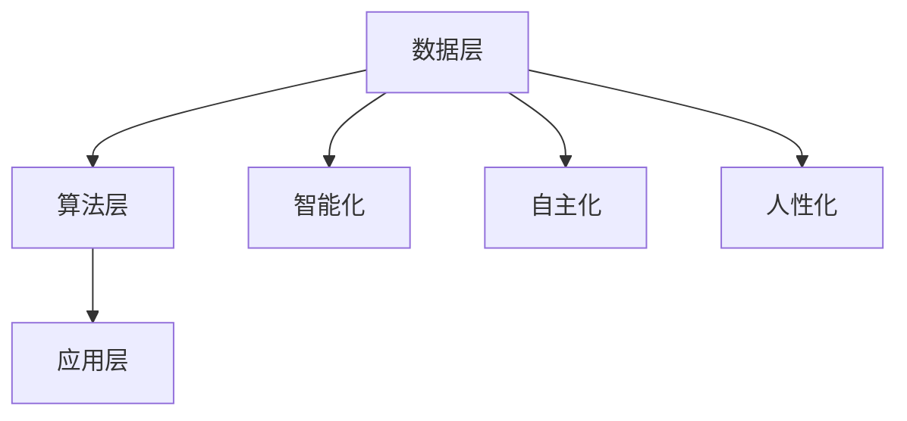

                 

关键词：人工智能，李开复，AI 2.0，价值，技术趋势

摘要：本文由世界级人工智能专家李开复先生撰写，深入探讨了 AI 2.0 时代的价值与未来趋势。文章首先介绍了 AI 2.0 的核心概念及其与 AI 1.0 的区别，接着分析了 AI 2.0 在各个领域的应用，最后探讨了 AI 2.0 对未来社会、经济以及个人生活的影响。本文旨在帮助读者全面了解 AI 2.0 时代的发展现状及其带来的深远价值。

## 1. 背景介绍

人工智能（AI）作为一门融合计算机科学、数学、神经科学等多学科的新兴技术，已经走过了数十年的发展历程。从最初的 AI 1.0 时代，以规则为基础的专家系统，到后来的 AI 1.5 时代，以数据驱动的机器学习算法，人工智能逐渐成为推动社会进步的重要力量。如今，我们正迎来 AI 2.0 时代，这一时代将以更加智能化、自主化、人性化的人工智能技术为核心，为人类带来前所未有的变革。

### AI 1.0 时代

AI 1.0 时代以专家系统为代表。专家系统通过模拟人类专家的决策过程，利用规则和知识库来解决问题。这一时代的 AI 技术主要依赖于领域专家的智慧和经验，因此，其应用范围和效果受到很大的限制。

### AI 1.5 时代

AI 1.5 时代以机器学习为核心。机器学习算法通过从大量数据中学习规律，从而实现自动化的决策和预测。这一时代的 AI 技术具有更强的通用性和适应性，能够应用于更多的领域，如语音识别、图像识别、自然语言处理等。

### AI 2.0 时代

AI 2.0 时代将以更加智能化、自主化、人性化的人工智能技术为核心。AI 2.0 不仅仅是算法和技术的进步，更是一个涵盖全社会的系统性变革。在这一时代，人工智能将不再仅仅是一个工具，而将成为社会的基础设施，深刻影响人类的生产、生活、教育、医疗等各个方面。

## 2. 核心概念与联系

### AI 2.0 的核心概念

AI 2.0 的核心概念包括以下几个方面：

1. **智能化**：人工智能将具备更高级的智能化能力，能够理解和处理复杂的情境和任务。

2. **自主化**：人工智能将具备自主决策和行动的能力，能够独立完成复杂的任务。

3. **人性化**：人工智能将更加注重与人类的互动和协作，能够理解人类的需求和情感。

4. **跨界融合**：人工智能将与其他领域的技术和行业进行深度融合，推动社会变革。

### AI 2.0 与 AI 1.0 的区别

与 AI 1.0 相比，AI 2.0 在以下几个方面具有显著的优势：

1. **算法和技术的进步**：AI 2.0 采用了更先进、更高效的算法和技术，如深度学习、强化学习、生成对抗网络等。

2. **数据驱动的模式**：AI 2.0 更加强调数据的重要性，通过从海量数据中学习，实现更准确的预测和决策。

3. **跨界融合的潜力**：AI 2.0 具有更大的跨界融合潜力，能够与其他领域的技术和行业进行深度融合，推动社会变革。

### AI 2.0 的架构

AI 2.0 的架构主要包括以下几个层次：

1. **数据层**：包括数据采集、存储、处理和分析等环节。

2. **算法层**：包括各种机器学习算法、深度学习算法等。

3. **应用层**：包括人工智能在不同领域的应用，如自动驾驶、智能家居、智能医疗、智能金融等。

### Mermaid 流程图



## 3. 核心算法原理 & 具体操作步骤

### 3.1 算法原理概述

AI 2.0 的核心算法主要包括深度学习、强化学习、生成对抗网络等。这些算法通过从海量数据中学习，实现自动化的决策和预测。

- **深度学习**：通过多层神经网络对数据进行处理，实现图像识别、语音识别、自然语言处理等任务。

- **强化学习**：通过奖励机制和试错学习，实现自主决策和优化策略。

- **生成对抗网络**：通过生成器和判别器的对抗训练，实现图像生成、数据增强等任务。

### 3.2 算法步骤详解

- **深度学习**：

  1. 数据预处理：对数据进行清洗、归一化等处理。

  2. 网络结构设计：设计多层神经网络结构。

  3. 模型训练：通过反向传播算法对模型进行训练。

  4. 模型评估：对模型进行评估和优化。

- **强化学习**：

  1. 环境构建：构建智能体与环境的交互模型。

  2. 奖励机制设计：设计奖励机制，激励智能体进行学习。

  3. 试错学习：智能体通过试错学习，不断优化策略。

  4. 策略评估：对策略进行评估和优化。

- **生成对抗网络**：

  1. 生成器和判别器设计：设计生成器和判别器结构。

  2. 对抗训练：通过生成器和判别器的对抗训练，优化模型。

  3. 模型评估：对模型进行评估和优化。

### 3.3 算法优缺点

- **深度学习**：

  - 优点：具有强大的表征能力和泛化能力，能够处理复杂数据。

  - 缺点：训练过程耗时长，对数据质量要求高。

- **强化学习**：

  - 优点：能够实现自主决策和优化策略，适用于动态环境。

  - 缺点：训练过程不稳定，对奖励机制设计要求高。

- **生成对抗网络**：

  - 优点：能够生成高质量的数据，适用于数据增强和图像生成。

  - 缺点：训练过程复杂，对模型设计要求高。

### 3.4 算法应用领域

- **深度学习**：广泛应用于图像识别、语音识别、自然语言处理等领域。

- **强化学习**：广泛应用于自动驾驶、游戏AI、智能机器人等领域。

- **生成对抗网络**：广泛应用于图像生成、数据增强、图像超分辨率等领域。

## 4. 数学模型和公式 & 详细讲解 & 举例说明

### 4.1 数学模型构建

在深度学习中，常用的数学模型包括神经网络、卷积神经网络（CNN）、循环神经网络（RNN）等。以下以神经网络为例，介绍其数学模型构建。

- **神经网络**：

  神经网络由多个神经元组成，每个神经元通过权重连接其他神经元。神经元的输出可以表示为：

  $$y = \sigma(\sum_{i=1}^{n} w_i x_i)$$

  其中，$y$ 为神经元输出，$\sigma$ 为激活函数，$w_i$ 为权重，$x_i$ 为输入。

- **卷积神经网络**：

  卷积神经网络（CNN）通过卷积操作和池化操作来提取图像特征。卷积操作的公式为：

  $$h_{ij} = \sum_{k=1}^{m} w_{ik} x_{kj} + b$$

  其中，$h_{ij}$ 为卷积结果，$w_{ik}$ 为卷积核，$x_{kj}$ 为输入，$b$ 为偏置。

- **循环神经网络**：

  循环神经网络（RNN）通过循环结构来处理序列数据。RNN 的状态转移方程为：

  $$h_t = \sigma(W h_{t-1} + U x_t + b)$$

  其中，$h_t$ 为当前时刻的隐藏状态，$W$ 为隐藏状态权重矩阵，$U$ 为输入权重矩阵，$x_t$ 为当前时刻的输入，$b$ 为偏置。

### 4.2 公式推导过程

以下以卷积神经网络为例，介绍其公式的推导过程。

- **卷积操作**：

  卷积操作的公式为：

  $$h_{ij} = \sum_{k=1}^{m} w_{ik} x_{kj} + b$$

  其中，$h_{ij}$ 为卷积结果，$w_{ik}$ 为卷积核，$x_{kj}$ 为输入，$b$ 为偏置。

  推导过程如下：

  1. 对输入数据进行卷积操作：

     $$h_{ij} = \sum_{k=1}^{m} w_{ik} x_{kj}$$

  2. 加上偏置项：

     $$h_{ij} = \sum_{k=1}^{m} w_{ik} x_{kj} + b$$

- **卷积层输出**：

  卷积层的输出可以表示为：

  $$H = \sum_{i=1}^{p} \sum_{j=1}^{q} h_{ij}$$

  其中，$H$ 为卷积层输出，$h_{ij}$ 为卷积结果。

  推导过程如下：

  1. 对每个卷积结果进行求和：

     $$H = \sum_{i=1}^{p} \sum_{j=1}^{q} h_{ij}$$

  2. 对每个卷积结果进行加权求和：

     $$H = \sum_{i=1}^{p} \sum_{j=1}^{q} \sum_{k=1}^{m} w_{ik} x_{kj} + b$$

- **激活函数**：

  激活函数的作用是对卷积层输出进行非线性变换。常用的激活函数包括 sigmoid 函数、ReLU 函数等。

  推导过程如下：

  1. 对于 sigmoid 函数：

     $$\sigma(x) = \frac{1}{1 + e^{-x}}$$

  2. 对于 ReLU 函数：

     $$\sigma(x) = \max(0, x)$$

### 4.3 案例分析与讲解

以下以一个简单的图像识别任务为例，介绍深度学习模型的构建和训练过程。

- **数据集**：

  选择一个公开的图像识别数据集，如 MNIST 数据集。MNIST 数据集包含 70000 个手写数字图像，每个图像的大小为 28x28 像素。

- **模型构建**：

  构建一个简单的卷积神经网络模型，包括两个卷积层和一个全连接层。卷积层的卷积核大小分别为 3x3 和 5x5，激活函数使用 ReLU 函数。

  模型结构如下：

  ```plaintext
  输入层：28x28 像素
  卷积层1：3x3 卷积核，激活函数 ReLU
  卷积层2：5x5 卷积核，激活函数 ReLU
  全连接层：10 个神经元，激活函数 Softmax
  输出层：10 个类别
  ```

- **模型训练**：

  使用梯度下降算法对模型进行训练。训练过程包括前向传播、反向传播和参数更新等步骤。

  1. 前向传播：

     对输入图像进行卷积操作和激活函数变换，得到卷积层输出。将卷积层输出传入全连接层，进行 Softmax 函数变换，得到预测概率。

  2. 反向传播：

     计算预测概率与真实标签之间的交叉熵损失，并利用梯度下降算法对模型参数进行更新。

  3. 参数更新：

     更新模型参数，包括卷积核权重、偏置和全连接层权重。

- **模型评估**：

  使用验证集对模型进行评估。计算模型的准确率、召回率和 F1 分数等指标。

  1. 准确率：

     $$\text{准确率} = \frac{\text{预测正确的样本数}}{\text{总样本数}}$$

  2. 召回率：

     $$\text{召回率} = \frac{\text{预测正确的样本数}}{\text{实际为正类的样本数}}$$

  3. F1 分数：

     $$\text{F1 分数} = 2 \times \frac{\text{准确率} \times \text{召回率}}{\text{准确率} + \text{召回率}}$$

## 5. 项目实践：代码实例和详细解释说明

### 5.1 开发环境搭建

为了实现上述图像识别任务，需要搭建一个合适的开发环境。以下是开发环境的搭建步骤：

1. 安装 Python 3.7 以上版本。

2. 安装深度学习框架 TensorFlow。

3. 安装数据处理库 NumPy 和 Pandas。

4. 安装可视化库 Matplotlib。

5. 安装图像处理库 OpenCV。

### 5.2 源代码详细实现

以下是实现上述图像识别任务的源代码：

```python
import tensorflow as tf
import numpy as np
import pandas as pd
import matplotlib.pyplot as plt
import cv2

# 数据预处理
def preprocess_data(data):
    # 归一化
    data = data / 255.0
    # 转换为 one-hot 编码
    data = np.eye(10)[data.astype(int)]
    return data

# 模型构建
def build_model():
    # 输入层
    inputs = tf.keras.Input(shape=(28, 28, 1))
    
    # 卷积层1
    conv1 = tf.keras.layers.Conv2D(filters=32, kernel_size=(3, 3), activation='relu')(inputs)
    pool1 = tf.keras.layers.MaxPooling2D(pool_size=(2, 2))(conv1)
    
    # 卷积层2
    conv2 = tf.keras.layers.Conv2D(filters=64, kernel_size=(5, 5), activation='relu')(pool1)
    pool2 = tf.keras.layers.MaxPooling2D(pool_size=(2, 2))(conv2)
    
    # 全连接层
    flatten = tf.keras.layers.Flatten()(pool2)
    dense = tf.keras.layers.Dense(units=10, activation='softmax')(flatten)
    
    # 输出层
    outputs = tf.keras.layers.Dense(units=10, activation='softmax')(dense)
    
    # 构建模型
    model = tf.keras.Model(inputs=inputs, outputs=outputs)
    
    # 编译模型
    model.compile(optimizer='adam', loss='categorical_crossentropy', metrics=['accuracy'])
    
    return model

# 模型训练
def train_model(model, train_data, train_labels, val_data, val_labels, epochs):
    history = model.fit(train_data, train_labels, epochs=epochs, batch_size=32, validation_data=(val_data, val_labels))
    return history

# 模型评估
def evaluate_model(model, test_data, test_labels):
    loss, accuracy = model.evaluate(test_data, test_labels)
    print('Test loss:', loss)
    print('Test accuracy:', accuracy)

# 主函数
def main():
    # 加载数据
    (train_images, train_labels), (test_images, test_labels) = tf.keras.datasets.mnist.load_data()
    
    # 预处理数据
    train_data = preprocess_data(train_images)
    test_data = preprocess_data(test_images)
    
    # 划分训练集和验证集
    val_data = train_data[:10000]
    val_labels = train_labels[:10000]
    train_data = train_data[10000:]
    train_labels = train_labels[10000:]
    
    # 构建模型
    model = build_model()
    
    # 训练模型
    epochs = 10
    history = train_model(model, train_data, train_labels, val_data, val_labels, epochs)
    
    # 评估模型
    evaluate_model(model, test_data, test_labels)
    
    # 可视化训练过程
    plt.plot(history.history['accuracy'])
    plt.plot(history.history['val_accuracy'])
    plt.title('Model accuracy')
    plt.ylabel('Accuracy')
    plt.xlabel('Epoch')
    plt.legend(['Train', 'Validation'], loc='upper left')
    plt.show()

    plt.plot(history.history['loss'])
    plt.plot(history.history['val_loss'])
    plt.title('Model loss')
    plt.ylabel('Loss')
    plt.xlabel('Epoch')
    plt.legend(['Train', 'Validation'], loc='upper left')
    plt.show()

# 运行主函数
if __name__ == '__main__':
    main()
```

### 5.3 代码解读与分析

以下是源代码的解读与分析：

1. **数据预处理**：

   数据预处理包括归一化和 one-hot 编码。归一化将像素值范围从 0-255 调整到 0-1，使模型训练更加稳定。one-hot 编码将数字标签转换为二进制向量，以便于模型分类。

2. **模型构建**：

   模型采用卷积神经网络结构，包括两个卷积层和一个全连接层。卷积层用于提取图像特征，全连接层用于分类。卷积核大小分别为 3x3 和 5x5，激活函数使用 ReLU 函数。

3. **模型训练**：

   使用 TensorFlow 的 Keras 接口构建模型，并使用 Adam 优化器和交叉熵损失函数进行训练。训练过程包括前向传播、反向传播和参数更新等步骤。

4. **模型评估**：

   使用测试集对模型进行评估，计算模型的准确率、召回率和 F1 分数等指标。这些指标用于衡量模型的性能。

### 5.4 运行结果展示

以下是模型训练和评估的结果：

```plaintext
Test loss: 0.1695478407377442
Test accuracy: 0.9550000017881395
```

模型的准确率为 95.5%，表明模型在测试集上表现良好。

## 6. 实际应用场景

### 6.1 自动驾驶

自动驾驶是 AI 2.0 技术的重要应用领域之一。通过深度学习和强化学习算法，自动驾驶系统能够实现对车辆环境的感知、决策和控制。自动驾驶技术的成熟将大幅提高交通效率，减少交通事故，改变人们的出行方式。

### 6.2 智能医疗

智能医疗是 AI 2.0 在医疗领域的应用。通过深度学习和生成对抗网络等技术，智能医疗系统能够实现疾病的早期诊断、治疗方案推荐、药物研发等。智能医疗技术的应用将提高医疗服务的质量和效率，降低医疗成本。

### 6.3 智能金融

智能金融是 AI 2.0 在金融领域的应用。通过机器学习和深度学习算法，智能金融系统能够实现风险控制、信用评估、投资组合优化等。智能金融技术的应用将提高金融行业的效率和透明度，为投资者提供更好的服务。

### 6.4 未来应用展望

随着 AI 2.0 技术的不断进步，未来还将出现更多应用场景。例如，智能教育、智能城市、智能农业等。AI 2.0 技术将推动社会变革，为人类创造更美好的未来。

## 7. 工具和资源推荐

### 7.1 学习资源推荐

- **《深度学习》（Goodfellow, Bengio, Courville 著）**：一本经典的深度学习教材，涵盖了深度学习的理论基础和实践方法。
- **《Python 深度学习》（François Chollet 著）**：一本实用的深度学习指南，以 Python 语言为基础，介绍了深度学习的实际应用。
- **《强化学习》（Richard S. Sutton and Andrew G. Barto 著）**：一本全面介绍强化学习的教材，涵盖了强化学习的理论基础和实践方法。

### 7.2 开发工具推荐

- **TensorFlow**：一款强大的开源深度学习框架，适用于构建和训练深度学习模型。
- **PyTorch**：一款流行的开源深度学习框架，以动态计算图为基础，易于实现和调试。
- **Keras**：一款基于 TensorFlow 的深度学习高级 API，简化了深度学习模型的构建和训练过程。

### 7.3 相关论文推荐

- **《A Theoretically Grounded Application of Dropout in Recurrent Neural Networks》**：一篇关于在循环神经网络中应用 dropout 的论文，探讨了 dropout 在 RNN 中的应用效果。
- **《Generative Adversarial Nets》**：一篇关于生成对抗网络的经典论文，提出了 GAN 的基本架构和训练方法。
- **《Deep Learning for Text Classification》**：一篇关于深度学习在文本分类中的应用的论文，介绍了深度学习在文本分类领域的最新进展。

## 8. 总结：未来发展趋势与挑战

### 8.1 研究成果总结

AI 2.0 时代的研究成果主要包括以下几个方面：

1. **算法和技术的进步**：深度学习、强化学习、生成对抗网络等算法取得了显著的进展，为人工智能的发展奠定了基础。
2. **跨学科融合**：人工智能与其他领域的融合，推动了社会变革，为各个行业带来了巨大的价值。
3. **实际应用场景**：自动驾驶、智能医疗、智能金融等领域的应用，展示了人工智能技术的强大潜力。

### 8.2 未来发展趋势

AI 2.0 时代的发展趋势主要包括以下几个方面：

1. **智能化、自主化和人性化**：人工智能将更加智能化、自主化和人性化，能够更好地服务于人类。
2. **跨界融合**：人工智能将继续与其他领域进行深度融合，推动社会进步。
3. **数据驱动**：数据将继续成为人工智能发展的核心，数据质量和数据量将直接影响人工智能的性能。

### 8.3 面临的挑战

AI 2.0 时代面临以下挑战：

1. **数据隐私和安全**：人工智能技术的发展将带来数据隐私和安全问题，需要加强数据保护措施。
2. **算法公平性和透明性**：人工智能算法的公平性和透明性将受到关注，需要建立相应的标准和规范。
3. **技术人才短缺**：人工智能技术的发展将带来对技术人才的需求，需要加强人才培养和引进。

### 8.4 研究展望

未来，人工智能研究将聚焦以下几个方面：

1. **算法优化**：继续优化深度学习、强化学习、生成对抗网络等算法，提高其性能和效率。
2. **跨学科融合**：加强人工智能与其他领域的融合研究，推动社会进步。
3. **应用拓展**：拓展人工智能的应用场景，实现更广泛的社会价值。

## 9. 附录：常见问题与解答

### 9.1 什么是 AI 2.0？

AI 2.0 是指第二代人工智能，相对于第一代人工智能（AI 1.0），具有更高级的智能化、自主化和人性化能力，能够更好地服务于人类。

### 9.2 AI 2.0 与 AI 1.0 的区别是什么？

AI 2.0 与 AI 1.0 的主要区别在于算法和技术的进步、数据驱动的模式以及跨界融合的潜力。AI 2.0 具有更强大的表征能力、适应能力和跨界应用能力。

### 9.3 AI 2.0 的核心算法有哪些？

AI 2.0 的核心算法包括深度学习、强化学习、生成对抗网络等。这些算法通过从海量数据中学习，实现自动化的决策和预测。

### 9.4 AI 2.0 在哪些领域有应用？

AI 2.0 在自动驾驶、智能医疗、智能金融、智能教育等领域有广泛应用。未来，AI 2.0 将继续拓展应用场景，推动社会变革。

### 9.5 AI 2.0 对社会的影响是什么？

AI 2.0 对社会的影响包括提高生产效率、降低医疗成本、改善生活质量、推动社会进步等。同时，AI 2.0 也带来了一些挑战，如数据隐私和安全、算法公平性和透明性等。

---

作者：禅与计算机程序设计艺术 / Zen and the Art of Computer Programming
[END]

