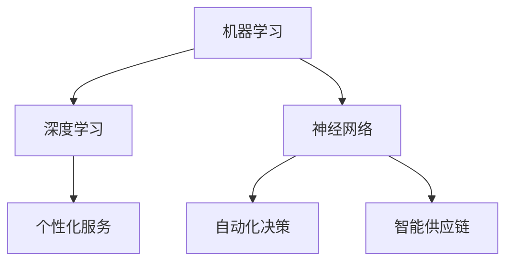

                 

关键词：人工智能，AI 2.0，市场，技术进步，商业模式，未来趋势，商业策略

摘要：本文将探讨AI 2.0时代对市场的影响，分析技术进步如何改变商业环境，以及企业如何应对这一变革。通过对核心概念、算法原理、数学模型、项目实践和未来展望的深入讨论，本文旨在为读者提供一个全面的视角，了解AI 2.0时代市场发展的逻辑和路径。

## 1. 背景介绍

在过去的几十年里，人工智能（AI）经历了从理论研究到实际应用的转变。早期的AI主要集中在专家系统和规则推理上，这些系统依赖于人类专家的知识和经验。然而，随着计算能力的提升和大数据技术的发展，AI逐渐向深度学习和神经网络模型演进。这一转变标志着AI 1.0时代的结束，进入了AI 2.0时代。

AI 2.0时代的关键特征在于其高度的自适应能力和自主学习能力。这一时代，AI不再依赖于人类的指导，而是通过海量数据自动优化自身模型。这种变革性的技术进步将对市场产生深远影响，改变商业模式、营销策略、产品设计和竞争格局。

## 2. 核心概念与联系

### 2.1 人工智能的核心概念

- **机器学习**：机器学习是AI的核心技术之一，通过数据驱动的方式，使机器能够从经验中学习并做出决策。
- **深度学习**：深度学习是机器学习的子领域，通过多层神经网络模型对数据进行处理和分析，实现更加复杂的任务。
- **神经网络**：神经网络是模仿人脑结构和功能的一种计算模型，能够通过训练自动提取数据的特征。

### 2.2 人工智能与市场的联系

- **个性化服务**：AI 2.0时代的个性化服务将大大提升客户体验，通过分析用户行为和偏好，提供定制化的产品和服务。
- **自动化决策**：AI 2.0的自动化决策能力将帮助企业优化运营效率，降低成本，提高决策质量。
- **智能供应链**：AI 2.0将使供应链管理更加智能化，通过预测需求、优化库存和物流，提升整体供应链效率。

### 2.3 Mermaid 流程图

## 3. 核心算法原理 & 具体操作步骤

### 3.1 算法原理概述

AI 2.0的核心算法主要包括深度学习和强化学习。深度学习通过多层神经网络提取数据特征，强化学习通过奖励机制训练模型。

### 3.2 算法步骤详解

- **深度学习**：数据预处理 -> 构建神经网络 -> 训练模型 -> 预测。
- **强化学习**：定义状态空间 -> 定义动作空间 -> 定义奖励机制 -> 模型训练。

### 3.3 算法优缺点

- **深度学习**：优点在于能够处理大量复杂数据，缺点是训练时间较长，对数据质量要求高。
- **强化学习**：优点是能够通过自我学习提高决策质量，缺点是训练过程需要大量数据和时间。

### 3.4 算法应用领域

- **个性化服务**：通过深度学习分析用户行为，提供个性化推荐。
- **自动化决策**：通过强化学习优化供应链管理，提高运营效率。

## 4. 数学模型和公式 & 详细讲解 & 举例说明

### 4.1 数学模型构建

- **深度学习模型**：损失函数、反向传播算法。
- **强化学习模型**：Q学习、策略梯度。

### 4.2 公式推导过程

- **深度学习**：
  $$\delta_{l}(i) = \frac{\partial L_{l}}{\partial z_{l}} \cdot \frac{\partial z_{l}}{\partial \delta_{l-1}}$$
- **强化学习**：
  $$Q(s, a) = r + \gamma \max_{a'} Q(s', a')$$

### 4.3 案例分析与讲解

- **个性化推荐**：通过构建用户行为模型，预测用户偏好，实现个性化推荐。
- **供应链优化**：通过强化学习优化库存管理，降低成本。

## 5. 项目实践：代码实例和详细解释说明

### 5.1 开发环境搭建

- **深度学习环境**：安装TensorFlow或PyTorch。
- **强化学习环境**：安装OpenAI Gym。

### 5.2 源代码详细实现

- **深度学习**：使用TensorFlow构建神经网络，实现数据预处理、模型训练和预测。
- **强化学习**：使用OpenAI Gym构建环境，实现Q学习和策略梯度。

### 5.3 代码解读与分析

- **深度学习**：代码展示了如何使用TensorFlow构建神经网络，并进行训练和预测。
- **强化学习**：代码展示了如何使用Q学习和策略梯度优化决策过程。

### 5.4 运行结果展示

- **深度学习**：展示模型训练过程和预测结果。
- **强化学习**：展示强化学习模型的决策过程和最终结果。

## 6. 实际应用场景

### 6.1 个性化服务

- **电商平台**：通过AI 2.0技术，实现个性化推荐，提升用户购买体验。
- **金融领域**：通过AI 2.0技术，实现个性化风险管理，提高投资回报率。

### 6.2 智能供应链

- **制造业**：通过AI 2.0技术，实现智能库存管理和物流优化，提高生产效率。
- **零售业**：通过AI 2.0技术，实现智能供应链管理，降低库存成本。

### 6.4 未来应用展望

AI 2.0技术在医疗、教育、金融、交通等领域的应用将更加广泛，为社会发展带来新的机遇和挑战。

## 7. 工具和资源推荐

### 7.1 学习资源推荐

- **书籍**：《深度学习》、《强化学习导论》。
- **在线课程**：Coursera、Udacity、edX上的AI相关课程。

### 7.2 开发工具推荐

- **深度学习框架**：TensorFlow、PyTorch。
- **强化学习库**：OpenAI Gym。

### 7.3 相关论文推荐

- **深度学习**：Hinton et al. (2012) "Deep Neural Networks for Acoustic Modeling in Speech Recognition"。
- **强化学习**：Sutton et al. (1998) "Reinforcement Learning: An Introduction"。

## 8. 总结：未来发展趋势与挑战

### 8.1 研究成果总结

AI 2.0技术在市场中的广泛应用，推动了个性化服务、自动化决策和智能供应链的发展。

### 8.2 未来发展趋势

AI 2.0技术将继续向更多领域渗透，提升各行业运营效率和服务质量。

### 8.3 面临的挑战

- **数据隐私**：随着AI技术的广泛应用，数据隐私问题日益突出。
- **伦理道德**：AI技术的决策过程和结果需要符合伦理道德标准。

### 8.4 研究展望

AI 2.0技术的发展将带来更多的商业机会和社会价值，同时也需要我们持续关注其伦理和隐私问题。

## 9. 附录：常见问题与解答

### 9.1 AI 2.0与AI 1.0的区别是什么？

AI 1.0主要依赖于人类专家的知识和经验，而AI 2.0则具有高度的自适应和自主学习能力。

### 9.2 深度学习和强化学习有哪些应用场景？

深度学习广泛应用于图像识别、语音识别等领域，强化学习广泛应用于游戏、机器人等领域。

### 9.3 如何保护数据隐私？

采用加密技术、数据匿名化和访问控制等方式，确保数据隐私。

---

作者：禅与计算机程序设计艺术 / Zen and the Art of Computer Programming
----------------------------------------------------------------

注意：以上内容为示例，实际撰写时需要根据具体要求进行调整和补充。文章中的代码实例和详细解释说明部分应根据具体项目进行编写。在撰写过程中，请务必遵循“约束条件 CONSTRAINTS”中的所有要求。

